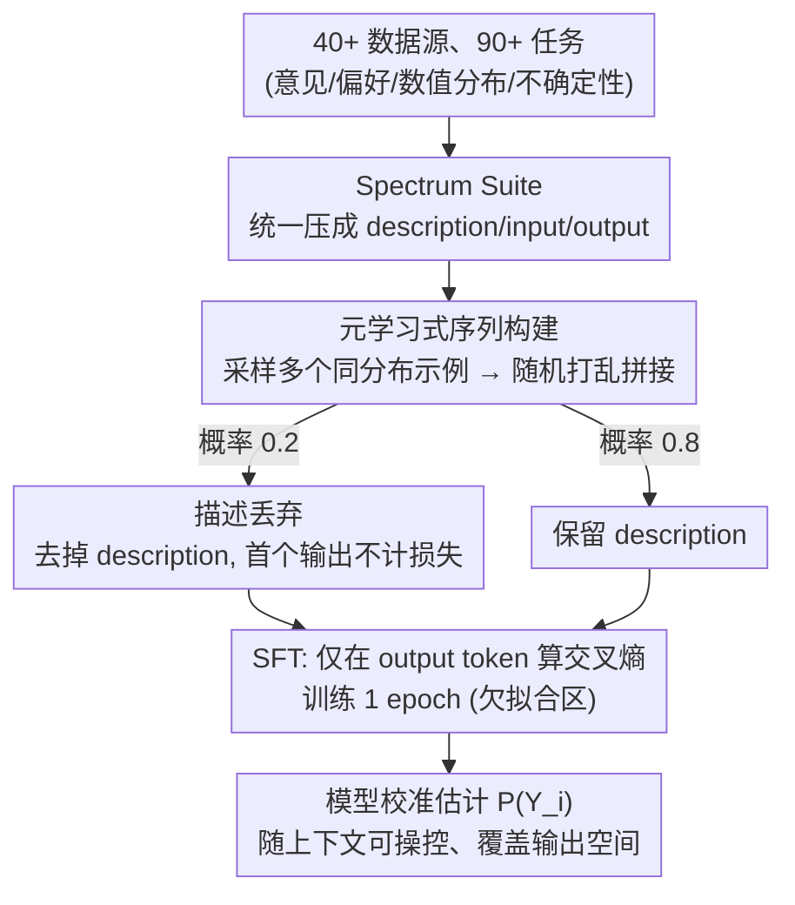

# Spectrum Tuning: Post-Training for Distributional Coverage and In-Context Steerability

**会议**: ICLR 2026  
**arXiv**: [2510.06084](https://arxiv.org/abs/2510.06084)  
**代码**: [GitHub](https://github.com/tsor13/spectrum)  
**领域**: 信号通信  
**关键词**: 后训练, 分布覆盖, 上下文可操控性, 元学习, 语言模型

## 一句话总结

提出Spectrum Tuning后训练方法，通过在90+任务的分布拟合数据集上训练，改善语言模型的上下文可操控性、输出空间覆盖度和分布对齐能力，揭示当前指令调优会损害模型的上下文可操控性。

## 研究背景与动机

1. **领域现状**: LLM后训练（指令调优、RLHF等）显著提升了模型的指令遵循和单一正确答案任务性能，但对需要多样化输出的任务（创意写作、合成数据生成、多元偏好建模）的影响较少研究。

2. **现有痛点**: 当前后训练方法在需要分布建模的任务上可能产生负面影响——模型在条件分布建模的三个维度上表现下降：上下文可操控性（根据新信息调整输出分布）、输出覆盖度（生成多样化有效输出）和分布对齐（匹配目标分布）。

3. **核心矛盾**: 指令调优使模型形成强先验，擅长产出"最佳"单一答案，但这恰恰损害了根据上下文示例灵活调整输出分布的能力。需要区分两种上下文学习：能力引出（ICL for capability elicitation）和上下文可操控性（in-context steerability）。

4. **本文目标**: 量化当前后训练对分布建模能力的影响，并提出改善方法。

5. **切入角度**: 编译涵盖40+数据源、90+任务的Spectrum Suite数据集，包含个人偏好建模、数值分布估计等需要分布匹配的任务，作为评估和训练资源。

6. **核心 idea**: 在分布拟合任务上进行元学习式微调，使模型在保持能力的同时获得灵活的上下文可操控性。

## 方法详解

### 整体框架

Spectrum Tuning 想解决的是：当前后训练（指令调优、RLHF）让模型只会给"最佳"单一答案、却丢掉了"随上下文示例灵活调整输出分布"的能力。它的解法本质上是一次精心设计的监督微调。先把分散在 40+ 数据源、90+ 任务里的"分布建模"数据统一压成 description / input / output 格式（Spectrum Suite）；训练时为每条序列采样多个来自**同一分布**的示例、随机打乱后首尾相接，并以概率 0.2 丢掉任务描述；然后做标准 SFT，但**只在输出 token 上**算交叉熵、且整个训练只跑 **1 个 epoch**。把训练停在这个欠拟合区域是关键：对来自同一分布的蒙特卡洛样本最小化交叉熵，会逼着模型给出对底层分布 $P(Y_i)$ 的**校准估计**，而不是记住某个"最佳答案"。配合"多个同分布示例 + 随机打乱"的序列结构，模型在预测第 $k$ 个输出时必须利用前 $k-1$ 个示例隐式更新后验——这正是让它学会随上下文调整输出分布的源头。

### 关键设计

**1. Spectrum Suite 数据集：把"分布建模能力"变成可训练可评测的统一资源**

现有基准几乎都在考单一正确答案的任务，没法系统地衡量模型能否覆盖输出空间、对齐目标分布、随上下文示例调整。为此本文从 40+ 个数据源编译出 90+ 个任务，统一压成 description / input / output 三段式格式。任务覆盖四类典型分布场景：自然人际变异（意见建模、个人偏好）、同分布文本集合（合成数据、特定格式的诗歌）、随机分布的 i.i.d. 抽样（如从正态分布采样）、以及不确定性推理，其中特别强调个人建模数据。这套数据既是评测套件，也直接当训练语料用，把抽象的"分布覆盖/可操控性"落地成可优化的目标。

**2. 元学习式序列构建：把分布匹配重述为"学会如何学习"**

每条训练序列都装入多个来自同一分布的示例 $(x_j, y_j)$，并把它们随机打乱后首尾相接。模型在预测第 $k$ 个输出时要利用前 $k-1$ 个示例隐式更新后验——本质上是在序列内执行一次贝叶斯更新；随机打乱则保证了**可交换性**（exchangeability，贝叶斯分析中后验对样本顺序不变），使模型学到的是分布本身而非位置偏好。这套构建方式与标准指令 SFT 的区别正是它有效的核心：上下文里塞的是多个同分布样本而非单条、数据本身是分布性的而非确定的最优答案、优化目标是拟合分布而非对话流畅度、且输入 $x$ 是可选的（不像聊天里 user message 必须存在）。正因如此，模型学到的是"给我一个数据生成过程的几个样本，我能续出符合该过程的下一个样本"这种元能力。

**3. 描述丢弃策略：逼模型从示例里推断分布，而不是只读描述**

如果任务描述总是存在，模型容易偷懒——直接照着描述生成，而不去看上下文示例里隐含的分布特征。本文以概率 $p_{\text{drop}}=0.2$ 随机丢掉任务描述；一旦丢掉，序列里第一个输出因为"无前序信息可推断"而不计损失，从第二个输出起模型必须依靠前序示例反推出当前任务的分布长什么样。这一招直接训练了模型在描述缺失或模糊时的上下文可操控性，也解释了为何 Spectrum Tuning 在仅给示例、不给说明的设定下仍能对齐目标分布。

### 损失函数 / 训练策略

损失就是标准交叉熵，但**只在输出 token 上**计算，描述和输入 token 不计损失。训练严格控制在 1 个 epoch，刻意停在欠拟合区域以避免记忆化、保住分布校准（理论依据是 Ji et al. 2021：欠拟合区内对蒙特卡洛样本最小化交叉熵会得到校准的分布估计）。模型从预训练（PT）权重初始化，仅把指令调优（IT）模型里两三个特殊 format token 的 embedding 迁移过来，从而既不继承 IT 的强先验、又能复用其格式 token。

## 实验关键数据

### 主实验

三个模型系列的上下文可操控性对比（76个任务-模型对比）：

| 变化方向 | PT→IT | PT→ST(本文) |
|---------|-------|------------|
| 显著下降 | 35/76 | 较少 |
| 无显著变化 | 33/76 | — |
| 显著提升 | 7/76 | 更多 |

Spectrum Tuning在保持能力引出的同时改善可操控性：

| 模型 | 方法 | habermas_individual (Acc) | wvs_individual (Acc) | numbergame_individual (Acc) |
|------|------|--------------------------|---------------------|---------------------------|
| Gemma-3-12B | PT | 24.4 | 42.1 | 64.3 |
| Gemma-3-12B | IT | 22.4 | 40.4 | 65.6 |
| Gemma-3-12B | **ST** | **23.8** | **42.6** | **70.2** |

### 消融实验

| 配置 | 关键指标 | 说明 |
|------|---------|------|
| 指令调优(IT)可操控性变化 | 76对中35下降vs7提升 | IT明显损害可操控性 |
| IT能力引出变化 | 24对中8提升vs2下降 | IT保持能力引出能力 |
| Loss变化(IT vs PT) | 117/144更差 | 自由文本任务IT几乎全面劣于PT |

### 关键发现

- **指令调优系统性损害上下文可操控性**: 这是本文最核心的empirical发现
- **能力引出与可操控性是独立的**: IT提升前者但损害后者
- **Spectrum Tuning在三个模型系列上一致改善**: 首次实现分布对齐优于预训练模型
- **Loss在IT模型上几乎全面更高**: 说明IT模型在分布匹配任务上的校准性严重退化

## 亮点与洞察

- **概念区分的价值**: 将上下文学习分为"能力引出"和"可操控性"两种，为理解后训练的影响提供了新框架
- **简单但有效**: Spectrum Tuning本质上就是在分布数据上的SFT，但精心的任务设计使其有效
- **元学习视角**: 将分布匹配重新表述为元学习问题，每个任务是一个"数据生成过程"
- **对LLM评估的启发**: 当前benchmarks几乎都测试单一正确答案，忽略了分布建模能力

## 局限与展望

- Spectrum Suite主要关注分类和短文本任务，长文本生成的分布匹配评估不足
- 一个epoch的训练限制可能在某些任务上不是最优的
- 可探索与RLHF/DPO等偏好学习方法的结合
- 可操控性下降的根本原因（强先验vs过拟合vs benchmark适应）值得深入研究

## 相关工作与启发

- 与In-context Learning领域的研究衔接，但首次区分了能力引出和可操控性
- 分布多元主义（distributional pluralism）概念来自Sorensen et al. (2024)
- 启发: 后训练的"副作用"需要更系统的研究——单一正确答案的优化可能损害其他重要能力

## 评分

- 新颖性: ⭐⭐⭐⭐⭐ 首次系统研究后训练对分布建模能力的影响
- 实验充分度: ⭐⭐⭐⭐ 三个模型系列、90+任务、完整的对比分析
- 写作质量: ⭐⭐⭐⭐⭐ 概念明确，逻辑严密
- 价值: ⭐⭐⭐⭐⭐ 揭示了后训练的重要盲区，对LLM开发有实际指导意义

<!-- RELATED:START -->

## 相关论文

- [\[ICLR 2026\] Fluent Alignment with Disfluent Judges: Post-training for Lower-Resource Languages](fluent_alignment_with_disfluent_judges_post-training_for_lower-resource_language.md)
- [\[ICLR 2026\] Chasing the Tail: Effective Rubric-based Reward Modeling for Large Language Model Post-Training](chasing_the_tail_effective_rubric-based_reward_modeling_for_large_language_model.md)
- [\[ICLR 2026\] Quagmires in SFT-RL Post-Training: When High SFT Scores Mislead and What to Use Instead](quagmires_in_sft-rl_post-training_when_high_sft_scores_mislead_and_what_to_use_i.md)
- [\[NeurIPS 2025\] GVPO: Group Variance Policy Optimization for Large Language Model Post-Training](../../NeurIPS2025/llm_alignment/gvpo_group_variance_policy_optimization_for_large_language_model_post-training.md)
- [\[ACL 2026\] What Makes Good Instruction-Tuning Data? An In-Context Learning Perspective](../../ACL2026/llm_alignment/what_makes_good_instruction-tuning_data_an_in-context_learning_perspective.md)

<!-- RELATED:END -->
