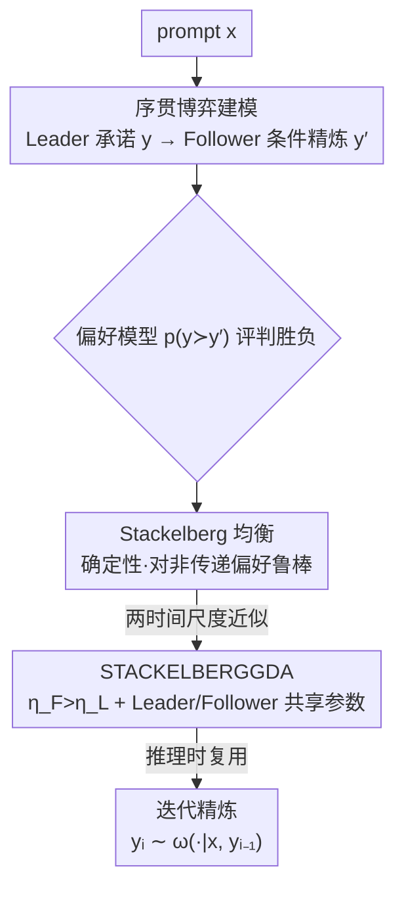

# Stackelberg Learning from Human Feedback: Preference Optimization as a Sequential Game

**会议**: ICLR 2026  
**OpenReview**: [https://openreview.net/forum?id=vc9Tj11LNE](https://openreview.net/forum?id=vc9Tj11LNE)  
**代码**: 无  
**领域**: 对齐RLHF  
**关键词**: 偏好优化, Stackelberg 博弈, 非传递偏好, 推理时精炼, 序贯博弈

## 一句话总结
本文把 LLM 偏好对齐重新建模成一个"领导者—跟随者"的**序贯博弈**（SLHF）：领导者先承诺一个回答、跟随者在看到这个回答后再给出改进版，由此天然得到一个确定性、对非传递偏好鲁棒的均衡，并支持**推理时无需训练的迭代自我精炼**，在 0.5B–8B 模型上一致超过 RLHF（RLOO）与 NLHF（Nash-MD-PG）基线。

## 研究背景与动机

**领域现状**：用人类偏好对齐 LLM 的主流是 RLHF——先在成对比较数据上训一个标量奖励模型（通常假设 Bradley-Terry 模型 $p(y\succ y'\mid x)=\sigma(r(x,y)-r(x,y'))$），再用 RL 最大化这个奖励。近年 NLHF 提出绕开奖励模型，把偏好优化写成两个策略之间的**同时出招博弈**，用 Nash 均衡作为解。

**现有痛点**：RLHF 把"偏好"压缩成一个实值奖励，这个标量假设在实践中经常失败——多人聚合后的偏好常出现**非传递的循环**（$A\succ B\succ C$ 但 $C\succ A$），标量奖励根本表达不了这种结构，甚至在传递偏好下也可能错排；更糟的是，最优策略对训练集里"采样了哪些比较对"高度敏感，换一种采样就给出不同答案。NLHF 虽然不假设传递性、对数据分布不敏感，但当没有任何动作被多数偏好时，Nash 均衡必然是**混合策略**（在 Condorcet 悖论下退化成均匀分布），输出带有内在随机性，在需要确定、可靠回答的场景里并不理想。

**核心矛盾**：两条路线各自牺牲了一样东西——RLHF 牺牲了对非传递偏好的表达力与数据鲁棒性；NLHF 为了处理循环偏好被迫接受随机的混合策略。两者都用**单一策略**去对抗一个不可观测、非平稳的对手，学习不稳定。

**本文目标**：找到一个解概念，既能直接在成对偏好上优化、对非传递循环鲁棒、不依赖标量奖励，又能给出确定性的策略，还能利用"反复采样"在推理时持续改进输出。

**切入角度**：作者注意到 Nash 博弈的随机性来自"同时出招"的对称性——双方都看不到对方的实际动作。如果改成**序贯出招**（Stackelberg 博弈），让第二个玩家先看到第一个玩家已经落地的动作，再做最优回应，这种信息不对称就能打破对称、产生确定性最优回应。

**核心 idea**：把偏好优化从"单策略对抗"改写成"领导者承诺 + 跟随者条件精炼"的序贯博弈，用 Stackelberg 均衡替代 Nash 均衡。

## 方法详解

### 整体框架

SLHF 把对齐问题拆成两个角色玩的一场序贯博弈。给定上下文（prompt）$x$，**领导者（Leader）** 策略 $\pi$ 先采样一个动作 $y\sim\pi(\cdot\mid x)$ 并"承诺"它；**跟随者（Follower）** 策略 $\omega$ 同时观测到上下文 $x$ **和领导者已落地的动作 $y$**，再给出回应 $y'\sim\omega(\cdot\mid x,y)$。注意跟随者条件在**实际动作 $y$**（而非领导者的策略 $\pi$）上，这是它比标准 Stackelberg 设定多拿到的信息。两个动作交给一个成对偏好模型 $p(y\succ y'\mid x)$ 评判胜负。整个目标写成一个 max-min 序贯博弈：

$$\max_{\pi\in\Pi}\ \min_{\omega\in\Omega}\ \mathbb{E}_{x\sim\rho}\Big[\mathbb{E}_{y\sim\pi(\cdot|x)}\big[\mathbb{E}_{y'\sim\omega(\cdot|x,y)}[p(y\succ y'\mid x)]+\tau^F\mathrm{KL}_{x,y}(\omega\|\omega_{\mathrm{ref}})\big]-\tau^L\mathrm{KL}_x(\pi\|\pi_{\mathrm{ref}})\Big]$$

这把优化拆成两个互补的子问题：跟随者解的是一个**精炼问题**（对一个已知输出找最优回应，对手是固定的、问题是平稳的），领导者解的是一个**对抗鲁棒问题**（预判到跟随者会改进，于是选一个"即使被改进后仍然强"的初始动作）。训练用 STACKELBERGGDA 双时间尺度梯度算法逼近均衡，推理则复用同一套机制做迭代精炼。

### 关键设计

**1. 序贯博弈建模：用"承诺—精炼"两角色替代单策略对抗**

针对 RLHF/NLHF 用单一策略去对抗非平稳对手、学习不稳定的痛点，SLHF 引入信息不对称的序贯结构。领导者先出 $y$，跟随者在**观测到这个实际动作后**再出 $y'$，于是跟随者面对的不再是一个会随训练漂移的对手分布，而是"给定一个已知输出，找能击败它的最佳回应"这样一个平稳的最优回应问题——学习更稳、对领导者策略变化的适应更快。反过来，跟随者越快收敛，给领导者的反馈就越平稳，领导者就越能准确预判精炼结果、选出鲁棒的初始动作。目标函数式 (5) 中 $\tau^L,\tau^F\ge0$ 是两方各自相对参考策略 $\pi_{\mathrm{ref}},\omega_{\mathrm{ref}}$ 的 KL 正则系数；无正则（$\tau^L=\tau^F=0$）时它就是一个序贯出招的常数和博弈。这与 RLHF（标量奖励）和 NLHF（同时出招）的根本区别在于：它直接在成对偏好 $p$ 上优化，且靠"谁先动、谁能看到对方动作"的非对称性去捕捉更丰富的偏好结构。

**2. Stackelberg 均衡：确定性、唯一、对非传递偏好鲁棒**

NLHF 的 Nash 均衡在循环偏好下必然是混合策略，输出随机。SLHF 的解概念则不同。命题 1 证明：当 $\tau^L,\tau^F>0$ 且 $\pi_{\mathrm{ref}}(y\mid x)>0$ 时，式 (5) 存在**唯一**解 $(\pi^\star,\omega^\star)$，称为 Stackelberg 均衡。其关键性质是：由于跟随者总存在一个确定性的最佳回应（对任意 $y$ 都能挑出击败它的 $y'$），领导者随机化没有任何好处，因此在无正则极限下 $(\pi^\star,\omega^\star)$ 可以是**确定性**的。在经典的 Condorcet 悖论（三个动作 $A,B,C$ 两两循环、不存在 Condorcet 胜者）里，这套机制把循环"解开"了：跟随者的最优策略就是沿环走最佳回应（$y=A\Rightarrow y'=C$，$y=B\Rightarrow y'=A$，$y=C\Rightarrow y'=B$），领导者则预判到这点、挑出"最不易被剥削"的动作（当某类标注者占比 $\alpha_i$ 最大时确定性地选对应动作）。相比之下，RLHF 在这里的解依赖数据集里采样了哪些比较对（缺 $\{A,C\}$ 就会偏向 $A$），NLHF 则给出均匀随机策略。

**3. STACKELBERGGDA：双时间尺度梯度上升下降 + 领导者/跟随者共享参数**

直接在策略空间上求 max-min 在大动作空间不可行，本文提出 STACKELBERGGDA 来逼近均衡。它对领导者做梯度上升、对跟随者做梯度下降，每步后投影回各自的概率单纯形：$\pi_{i+1}=\pi_i+\eta^L\nabla_\pi f$，$\omega_{i+1}=\omega_i-\eta^F\nabla_\omega f$。关键是**双时间尺度**——取 $\eta^F>\eta^L$（记 $\kappa=\eta^F/\eta^L$，实验最优 $\kappa=5$），让跟随者比领导者更新得更快，从而给领导者提供更平稳的反馈；这一选择借鉴了 Actor-Critic 与 GAN（TTUR）的经验，并在非凸-凹 regime 下有更强收敛保证。目标 $f$ 在 $\pi$ 上凹、在 $\omega$ 上凸，因而 GDA 有遍历（ergodic）收敛性。落到 LLM 微调时还有一个省内存的巧设计：领导者和跟随者**共用同一套参数**——用一个 prompt 模板把它们写成多轮对话，领导者是"回答 user 的 prompt"，跟随者则在多接一句"Improve the previous answer!"后续写改进版，于是任何多轮对话模型都能同时当 $\pi_{\mathrm{ref}}$ 和 $\omega_{\mathrm{ref}}$。整个过程是在线 RL 优化，既不需要显式奖励模型，也不需要对混合策略做昂贵采样。

**4. 推理时迭代精炼：无需训练的 pass@k 式自我改进**

训练时偏好是跨标注者聚合的群体偏好，但部署时要对齐的是**单个用户**的口味，两者可能不一致。SLHF 的序贯结构天然支持在推理时无额外训练地适配：先从领导者采一个初始回答 $y_1$，之后每一步都把上一步的输出喂回跟随者继续精炼 $y_i\sim\omega^\star(\cdot\mid x,y_{i-1})$，得到一串逐步改进的回答，类似可验证领域里的 pass@k——用户可以不断重采样直到拿到满意的那个。在 Condorcet 悖论里这一过程会**遍历整个偏好环**：以 $\alpha_1=\alpha_2=\alpha_3=1/3$ 为例，对某个偏好 $A\succ B\succ C$ 的用户，NLHF 单次采到 $A$ 的概率是 $1/3$、$N=2$ 步累计 $56\%$，而 SLHF 因为跟随者沿环精炼，$N=2$ 步采到 $A$ 的概率升到 $67\%$、$N=3$ 步无论领导者初始选什么都能走遍整个环。关键是这一切只靠推理时计算，不需要任何额外训练或外部反馈，且实验显示这个跟随者能**跨模型迁移**，去改进其他独立训练模型的输出。

### 损失函数 / 训练策略
训练目标即式 (5) 的 max-min 序贯博弈目标，用 STACKELBERGGDA 双时间尺度 GDA 优化。实现基于 Transformers + TRL，AdamW 优化器；小规模实验从 QWEN2.5-0.5B 微调，跑 1000 步、batch $B=32$，学习率 $\eta\in\{1\mathrm{e}{-6},5\mathrm{e}{-6},1\mathrm{e}{-5}\}$、KL 系数 $\tau\in\{0.001,0.01,0.1\}$、$\kappa\in\{1,5,10\}$，最优为 $\eta=1\mathrm{e}{-5},\tau=0.001,\kappa=5$。

## 实验关键数据

### 主实验

小规模在 HELPSTEER2（11,826 条人工标注单轮对话，沿五个属性估计出带非传递性的偏好模型 $p$）上训练，与 RLOO（RLHF 代表）、NASH-MD-PG（NLHF 代表）做循环赛。下表每格为行算法相对列算法的平均偏好得分（>0.5 表示更受偏好）：

| 算法（行优于列） | 优于 QWEN2.5-0.5B | 优于 RLOO | 优于 NASH-MD-PG |
|--------|------|------|------|
| NASH-MD-PG | 0.721 | 0.607 | — |
| STACKELBERGGDA-LEADER | 0.734 | 0.613 | 0.503 |
| STACKELBERGGDA-FOLLOWER | **0.800** | **0.656** | **0.594** |

领导者与 Nash-MD-PG 大致打平（约 73% 胜过基座、61% 胜过 RLOO，两者互相约 50%），印证了"存在多个高质量回答时 Stackelberg 与 Nash 均衡重合"；而**跟随者**在领导者基础上再精炼一步带来显著增益——甚至以 60.5% 的比例胜过它所条件的领导者输出本身，即只多花一次生成就换来实质提升。

大规模上，用 STACKELBERGGDA 训练 LLAMA-3.1-TULU-3-8B-SFT（Skywork-Critic-70B 提供成对反馈），在 AlpacaEval 2.0 / IFEval 上评测：

| 模型 | AlpacaEval 2.0 LC Winrate | IFEval Prompt Loose Acc. |
|------|------|------|
| LLAMA-3.1-TULU-3-8B-SFT（基座） | 8.83 | 67.46 |
| LLAMA-3.1-TULU-3-8B-DPO | 33.37 | 75.23 |
| STACKELBERGGDA-LEADER | 35.04 | 71.71 |
| STACKELBERGGDA-FOLLOWER | **44.57** | 61.92 |

跟随者把 AlpacaEval 2.0 LC 胜率从基座 8.83 拉到 44.57，超过同规模的 DPO（同基座同 prompt 但用前沿模型补全），只在 GEMMA-2-9B-IT 之下；代价是作为跟随者时上下文变长导致 IFEval 掉点（67.46→59.89）。

### 消融实验

| 配置 | 关键结果 | 说明 |
|------|---------|------|
| STACKELBERGGDA 当跟随者改进各种领导者 | 对所有领导者一致提升（Table 4，最高约 0.60） | 显式训练"改进给定输出"才有用 |
| QWEN2.5-0.5B / RLOO 当跟随者 | 仅能改进自家输出，常**降低**其他模型质量 | 纯指令提示不足以可靠精炼 |
| NASH-MD-PG 当跟随者 | 能改 QWEN/RLOO，但 70% < 自身 73% 自改进率 | 未专门训练精炼，能力受限 |
| 双时间尺度系数 $\kappa$ | 最优 $\kappa=5$（Sec. D.3） | $\eta^F>\eta^L$ 是有效性来源 |

### 关键发现
- **跟随者是性能主力**：领导者只与 Nash 策略打平，真正拉开差距的是跟随者的一步精炼，且能跨模型族迁移（去改进 RLOO、Nash-MD-PG 乃至自身输出）。
- **"显式训练改进"不可替代**：只靠 prompt 让模型"改进上一条回答"在偏好维度上不可靠，甚至会变差；必须像 SLHF 一样把"精炼"作为训练目标，这把可验证领域的自纠错结论推广到了人类偏好领域。
- **AlpacaEval 与 IFEval 的取舍**：SLHF 在更贴近人类偏好的 AlpacaEval 2.0 上大幅领先，但跟随者上下文变长会拖累可验证指令跟随（IFEval），作者指出可再用可验证奖励的 RL 找回。

## 亮点与洞察
- **用"谁先动"破解随机性**：把同时博弈改成序贯博弈，靠信息不对称（跟随者能看到领导者的实际动作）就把 NLHF 必然的混合策略变成可确定的最佳回应，这是非常干净的博弈论洞察。
- **一套参数兼任两角色**：用 prompt 模板（"Improve the previous answer!"）让 Leader/Follower 共享参数、写成多轮对话，既省显存又让任何多轮模型都能直接当参考策略，工程上很优雅。
- **训练目标 = 推理能力**：因为跟随者本就被训练成"改进一个已知输出"，推理时的迭代精炼是同一机制的自然延伸，不需要额外训练就实现 pass@k 式自我改进，且能迁移到别人的输出上——"训练即推理"这一设计可迁移到其他需要测试时改进的任务。

## 局限与展望
- **依赖良好规约的成对偏好函数**：和 NLHF 一样，整套方法建立在一个能代表目标偏好的成对偏好模型上，在开放/欠定域里这个 $p$ 很难可靠获得。
- **精炼仍非实时交互**：序贯结构支持迭代精炼，但目前是离线条件生成，没有真实用户的实时反馈回路；作者提出未来可结合主动偏好诱导与个性化，在测试时动态适配单个用户。
- **只有遍历收敛、无末迭代保证**：STACKELBERGGDA 目前只有 ergodic 收敛而非 last-iterate 收敛，作者建议用 extragradient/optimistic 或 mirror-prox 等方向去拿到末迭代保证。
- **跟随者上下文变长伤害可验证指令跟随**：IFEval 掉点提示该框架与 verifiable reward 的融合还需进一步设计。

## 相关工作与启发
- **vs RLHF（RLOO 等）**：RLHF 假设 Bradley-Terry 标量奖励，无法表达非传递循环、对训练比较对的采样分布敏感、易模式坍塌；SLHF 直接在成对偏好上优化、对非传递偏好鲁棒、不需要奖励模型，实验中跟随者全面超过 RLOO。
- **vs NLHF（Nash-MD-PG）**：NLHF 用同时博弈求 Nash 均衡，无结构假设但解通常是混合策略（循环偏好下退化成均匀随机）；SLHF 用序贯 Stackelberg 博弈，可得确定性均衡，领导者与 Nash 策略打平、跟随者再叠加精炼增益。
- **vs SGPO（Chu et al., 2025）**：SGPO 也用 Stackelberg 形式，但是在"一个策略"与"一个对抗偏好分布"之间博弈、且假设偏好传递；本文是"两个策略"之间的序贯博弈、不假设传递性。
- **vs 自纠错 / Kumar et al. (2025)**：后者也序贯训练 LLM 做自我改进，但依赖奖励模型、且分两阶段训练；SLHF 用单一 Leader-Follower 循环、无需辅助奖励模型即支持任意偏好信号上的推理时精炼。

## 评分
- 新颖性: ⭐⭐⭐⭐⭐ 把对齐重写成序贯 Stackelberg 博弈，用确定性均衡统一处理非传递偏好与推理时精炼，是干净且原创的解概念。
- 实验充分度: ⭐⭐⭐⭐ 从 0.5B 到 8B、循环赛 + 跨模型精炼 + 大规模后训练都覆盖，但代码未开源、基准略偏 AlpacaEval/IFEval 两项。
- 写作质量: ⭐⭐⭐⭐⭐ 理论（命题/均衡性质）与实证衔接清晰，Condorcet 悖论的三方案对比讲得很透。
- 价值: ⭐⭐⭐⭐ 提供了无奖励模型、对非传递偏好鲁棒且自带推理时改进的对齐新范式，跟随者可迁移这点尤其实用。

<!-- RELATED:START -->

## 相关论文

- [\[ICLR 2026\] What's In My Human Feedback? Learning Interpretable Descriptions of Preference Data](whats_in_my_human_feedback_learning_interpretable_descriptions_of_preference_dat.md)
- [\[ICLR 2026\] Semi-Supervised Preference Optimization with Limited Feedback](semi-supervised_preference_optimization_with_limited_feedback.md)
- [\[ICML 2026\] Reward Shaping for (Inference-Time) Alignment: A Stackelberg Game Perspective](../../ICML2026/llm_alignment/reward_shaping_for_inference-time_alignment_a_stackelberg_game_perspective.md)
- [\[ICLR 2026\] RLBFF: Binary Flexible Feedback to Bridge Between Human Feedback & Verifiable Rewards](rlbff_binary_flexible_feedback_to_bridge_between_human_feedback_verifiable_rewar.md)
- [\[ICLR 2026\] Text2Grad: Reinforcement Learning from Natural Language Feedback](text2grad_reinforcement_learning_from_natural_language_feedback.md)

<!-- RELATED:END -->
