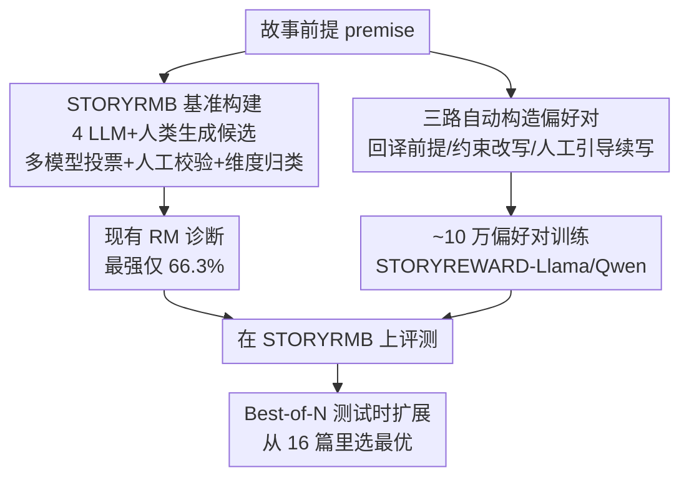

# StoryAlign：为故事生成评测并训练奖励模型

**会议**: ICLR 2026  
**OpenReview**: [https://openreview.net/forum?id=a3JmkJtTDV](https://openreview.net/forum?id=a3JmkJtTDV)  
**代码**: https://github.com/THU-KEG/StoryReward  
**领域**: 对齐RLHF / 文本生成  
**关键词**: 奖励模型, 故事生成, 人类偏好, 偏好数据构造, Best-of-N

## 一句话总结
本文指出现有奖励模型几乎无法识别人类偏好的故事（最强的 GPT-4o 也只有 66.3% 准确率），于是构建了首个故事偏好评测基准 STORYRMB（1133 条人工校验实例）并用约 10 万条自动构造的偏好对训练出专用奖励模型 STORYREWARD，仅 8B 规模就在基准上达到 75.0% 的 SoTA，并在 Best-of-N 测试时扩展中显著优于其他奖励模型。

## 研究背景与动机
**领域现状**：LLM 已经能写出流畅的故事，主流做法是用各种 workflow（大纲、分层、多 agent）驱动大模型生成长篇叙事。要让模型学会"写好故事"，标准路线是 RLHF——先训一个奖励模型（RM）捕捉人类偏好，再用它的打分去优化生成模型。

**现有痛点**：LLM 写的故事在叙事结构和创造力上仍远不及人类作品，有研究指出 LLM 故事通过专家评测的概率只有专业作者的 1/3 到 1/10。根本原因是训练时缺乏对"人类故事偏好"的有效建模：现有奖励模型几乎都面向通用领域，忽略了故事特有的偏好维度，还带有冗长偏置（verbosity bias，偏爱更长而非更好的回答）。

**核心矛盾**：故事偏好本身是**主观且多维**的（创造力、连贯性、人物塑造、流畅度、相关性都要兼顾），难以用通用偏好直接泛化覆盖；同时，要训练专用 RM 又缺乏大规模、能真实反映人类偏好的故事偏好数据——人工标注成本极高。

**本文目标**：分解成两个子问题——(1) 怎么**系统评测**一个奖励模型到底懂不懂故事偏好？(2) 怎么低成本拿到大规模、真实反映人类偏好的训练数据，并训出一个真正会选好故事的 RM？

**切入角度**：作者观察到一个反直觉现象——现有 RM 在"人类故事 vs LLM 故事"配对上反而更容易选错，倾向于偏爱 LLM 自己生成的内容。这说明问题不在模型容量，而在训练数据里根本没有"人类写得更好"这种信号。于是抓住**人类网络文学平台上现成的偏好信号**（点赞数、作者专栏、人工续写）做文章。

**核心 idea**：用"评测基准 STORYRMB + 自动构造的人类偏好对 + 专用奖励模型 STORYREWARD"这条完整链路，把故事偏好从"无法建模"变成"可评测、可训练、可应用于 BoN 选择"。

## 方法详解

### 整体框架
本文不是一个单一模型，而是一套"先建评测基准、再建训练数据、最后训出奖励模型并验证"的完整 pipeline。基准侧（STORYRMB）负责诊断现有 RM 有多差、差在哪个维度；训练侧（STORYREWARD）负责低成本造数据、训出专用 RM；应用侧用 Best-of-N 测试时扩展验证它在真实选故事任务里管用。

整条流程的输入是"故事前提（premise，即故事提示）"，输出是一个能给候选故事打分、从中选出人类最偏好那篇的奖励模型。中间分三段：评测基准构建 → 偏好对自动收集 → 奖励模型训练与应用。

### 关键设计

**1. STORYRMB：首个故事偏好评测基准，把"懂不懂故事"拆成五个维度可量化**

要诊断奖励模型，先得有一把尺子。作者构建了 STORYRMB——每条实例是一个前提 + 1 篇 chosen 故事 + 3 篇 rejected 故事，RM 的任务就是从 4 篇里选出人类偏好的那篇，准确率 = $\arg\max_i f(s_i) = s^*$ 命中的比例。基准构建分两步：**候选生成**用 GPT-4o、Gemini 2.5 Pro、Grok、Qwen-Long 四个模型为每个前提各写一篇，再混入 WritingPrompts 里的人类故事保证真实覆盖（前提一部分由 LLM 按"冲突或反转"结构造、一部分采自人类数据集，共约 1224 个）；**偏好判定**用 GLM-4.5、Qwen2.5-Max、Claude-3.5、DeepSeek-R1 四个模型沿创造力、连贯性、流畅度、人物塑造、相关性五个维度打分排序，再做人工校验。

这里的关键不是简单投票，而是用 **Kendall's Tau** 度量四个模型排序的一致性：对任意两个模型的排序 $\pi_A,\pi_B$，$\tau(\pi_A,\pi_B)=\frac{N_c-N_d}{\binom{m}{2}}$（$N_c$ 一致对数、$N_d$ 不一致对数），再取所有模型对的平均 $\tau_{avg}=\frac{2}{n(n-1)}\sum_{i<j}\tau(\pi_i,\pi_j)$。当 $\tau_{avg}<0.6$ 视为强烈分歧、直接交人工标注，否则用多数投票并人工核验。这样既省人力又保证有争议的样本由人定夺，最终得到 1133 条高质量实例。

**2. 维度归类：四级降级裁决，给每条偏好标注"主要因为哪个维度而被选中"**

光知道 A 比 B 好还不够，作者想知道 A **为什么**赢——是连贯性更好还是创造力更高？于是设计了一个四级裁决流程，给每条实例打上一个主导维度标签。**第一级·均值差**：对每个维度 $d$ 算 chosen 与所有 rejected 的平均分差 $\text{mean\_gap}_d=\text{score}_{chosen,d}-\frac{1}{|R|}\sum_{r\in R}\text{score}_{r,d}$，若某维度差值明显大于其他（超过容差 $\tau=0.5$）就归到该维度。**第二级·对亚军的领先**：若多个维度均值差接近，比 $\text{margin}_d=\text{score}_{chosen,d}-\max_{r\in R}\text{score}_{r,d}$，取领先最大的。**第三级·rejected 方差**：若仍并列，取 rejected 分数方差最小的维度（说明被拒故事在该维度一致表现差）。**第四级·序数兜底**：还并列就按固定顺序 $d_1\to\dots\to d_5$ 强制指派。

这个设计把"主观偏好"拆成可解释的诊断信号，最终 1133 条按主导维度分成创造力（292）、连贯性（265）、流畅度（225）、人物塑造（215）、相关性（136）五组，让后续分析能看出 RM 在哪类偏好上最弱。

**3. 三路自动构造偏好对：从人类网络文学里"白嫖"真实偏好信号**

训练 RM 需要海量偏好对，纯人工标不现实。作者从豆瓣（中文）和 WritingPrompts（英文）爬取大量人类故事及元数据（分类、点赞数），设计三种互补的自动构造法。**前提回译（Premise Back-generation）**：先按相似度（同体裁标签或同作者专栏）把故事聚类，类内采两篇用 GPT-4o 回译出共同前提，再用阅读量高低定 chosen/rejected，过滤掉极低互动的对，得到约 6000 对——这是完全来自真实人类故事的信号。**约束改写（Prompt-Guided Rewriting）**：拿人类故事当 chosen，用精心设计的 prompt 模板让 LLM 只改特定方面（如只改结尾来破坏情节连贯性）生成 rejected，约束改写避免了 chosen/rejected 差异过于琐碎，得到约 3 万对。**人工引导续写（Human-Guided Continuation）**：作者发现直接拿人类故事和 LLM 故事对比训练会**过快收敛、效果反而差**（因为表层差异太大、模型走捷径），于是给两个 LLM 相同前提，只让其中一个能看到真实的人类续写作为引导，引导版当 chosen、纯前提生成版当 rejected，约 1 万对。再叠加一个通用做法（一前提生成两故事、LLM 自动判优劣），最终凑齐约 10 万对。

三种方法的精妙在于**都不直接拿人类原文当 chosen**——人类原文质量太高会让 RM 学到表层捷径，所以要么用点赞数这种间接信号、要么用"被人类引导的 LLM 输出"，让偏好对的难度更接近真实分布。

### 损失函数 / 训练策略
以 Llama-3.1-8B-Instruct 和 Qwen3-8B 为基座，按标准奖励模型方式训练（输入前提、输出对故事的标量打分，用偏好对监督），分别得到 STORYREWARD-LLAMA 和 STORYREWARD-QWEN。batch size 设为 1，学习率 Llama 用 $9\times10^{-6}$、Qwen 用 $2\times10^{-5}$，各训练 1 个 epoch。

## 实验关键数据

### 主实验
在 STORYRMB 上从 4 篇候选里选 chosen 的准确率（%），Average 是五维度均值：

| 模型 | 创造力 | 人物塑造 | 流畅度 | 相关性 | Average |
|------|--------|----------|--------|--------|---------|
| ArmoRM-Llama3-8B | 48.8 | 44.2 | 56.4 | 43.4 | 49.7 |
| Qwen3-8B（基座） | 53.1 | 47.0 | 60.4 | 48.5 | 53.5 |
| Gemini-2.5-Pro | 51.7 | 57.2 | 64.4 | 52.2 | 56.8 |
| Grok-3 | 57.5 | 62.8 | 69.8 | 60.3 | 62.4 |
| GPT-4o（此前最强） | 63.7 | 66.0 | 73.3 | 67.6 | 66.3 |
| STORYREWARD-LLAMA | 60.8 | 62.3 | 53.8 | 67.7 | 61.4 |
| **STORYREWARD-QWEN** | **78.8** | **71.6** | 74.2 | **69.1** | **75.0** |

STORYREWARD-QWEN 以 8B 规模把 SoTA 从 66.3% 抬到 75.0%，在创造力、人物塑造这些**最难、最需要深层叙事理解**的维度上提升尤其明显（创造力 53.1→78.8）。

### 偏好分析：人类 vs LLM 故事
把 STORYRMB 拆成 LLM–LLM 对和 Human–LLM 对（chosen 是人类写的）分别评测：

| 配置 | 现象 | 说明 |
|------|------|------|
| 现有 RM 在 LLM–LLM 对 | 相对较好 | 都是 LLM 故事，符合其训练分布 |
| 现有 RM 在 Human–LLM 对 | 明显更差 | 倾向于偏爱 LLM 生成内容，选不出人类故事 |
| STORYREWARD 在 Human–LLM 对 | 更好 | 受益于大量人类偏好对，更贴合人类偏好 |

### 关键发现
- **现有 RM 整体偏向流畅度**：在流畅度维度普遍最高，因为 RM 和 LLM-as-judge 对表层流畅天然敏感；而创造力、人物塑造这类需要深层理解的维度普遍偏低，暴露通用 RM 抓不住故事特有偏好。
- **"偏爱 LLM 内容"是核心病灶**：现有 RM 在 Human–LLM 对上系统性选错，可能因为 LLM 偏好 LLM 生成的内容，导致用它做 RLHF 无法把模型引向人类水平——这正是本文要补的信号缺口。
- **数据有效且可扩展**：STORYREWARD 相比基座 Llama3.1、Qwen3 大幅提升，证明 10 万偏好对的价值；构造方法可扩展，作者鼓励社区收集更多语料。
- **Best-of-N 应用有效**：在 MoPS 数据集上对每个前提用 Llama-3.1-70B 生成 16 篇、人工排序，再用 RM 选最优。STORYREWARD 对各对手的胜率普遍 63–75%、选到劣质故事的比例不到 30%，且只有 8B 规模、部署推理成本低。

## 亮点与洞察
- **把"主观偏好"做成可诊断的工程**：五维度 + 四级降级裁决，把"A 为什么比 B 好"量化成主导维度标签，这套归类逻辑可迁移到任何多维主观评测任务（如对话质量、文案吸引力）。
- **"不直接用人类原文当 chosen"是反直觉但关键的洞察**：直接对比人类 vs LLM 会让 RM 学表层捷径、过快收敛，改用点赞信号和"被人类引导的 LLM 输出"，把偏好对难度拉回真实分布——这个数据构造哲学很值得借鉴。
- **小模型打败大模型**：8B 的 STORYREWARD-QWEN 超过 GPT-4o / Gemini / Grok 这些大得多的系统，说明在垂直偏好建模上，对的数据比模型规模更重要。

## 局限与展望
- STORYREWARD-LLAMA 在流畅度维度只有 53.8%，明显弱于 GPT-4o（73.3），说明基座选择对结果影响大，方法并非对所有基座都稳定增益。
- 偏好对构造依赖点赞数、约束改写等**代理信号**，这些信号与真实"故事好坏"未必完全对齐（如热门未必质量高），可能引入新偏置。
- 评测基准的偏好标注本身部分由 LLM 投票生成（仅强分歧时才纯人工），可能继承 LLM 的共有偏好；作者也只在 20 个样本上验证了"人类故事更优"和"人工引导更优"两个假设，验证规模偏小。
- 作者建议把 STORYREWARD 用于更细粒度的搜索（如 MCTS）以选出更好的故事，这是自然的延伸方向。

## 相关工作与启发
- **vs 通用奖励模型（InternLM2-Reward / Skywork-Reward / ArmoRM / GRM 等）**：它们面向通用领域、对故事偏好几乎无效（多数在 STORYRMB 上 Average 仅 15–50%），本文专门针对故事造数据、训专用 RM，优势是抓住了故事特有维度，劣势是领域专用、泛化到非故事任务未知。
- **vs LLM-as-judge（GPT-4o / Gemini / Grok）**：它们零样本就能打分但天花板只到 66.3%，且偏爱 LLM 内容；本文用 8B 专用模型在准确率和"选人类故事"上都更强，且推理成本低得多。
- **vs 故事生成 workflow（Agents' Room / DOME 等）**：那些工作改进的是**怎么生成**，本文补的是**怎么评判和选择**，两者正交——好的奖励模型可以反过来通过 RLHF 或 BoN 提升这些生成框架的输出质量。

## 评分
- 新颖性: ⭐⭐⭐⭐ 首个故事偏好评测基准 + 专用奖励模型，"不直接用人类原文"的数据构造洞察很巧
- 实验充分度: ⭐⭐⭐⭐ 主基准 + 人类/LLM 对分析 + BoN 测试时扩展三层验证，但缺传统消融拆解三路数据各自贡献
- 写作质量: ⭐⭐⭐⭐ 动机—诊断—构造—验证链路清晰，公式和维度定义交代完整
- 价值: ⭐⭐⭐⭐ 数据、模型、代码全开源，对故事生成对齐和创意写作 RLHF 有直接实用价值

<!-- RELATED:START -->

## 相关论文

- [\[ICLR 2026\] RewardBench 2: Advancing Reward Model Evaluation](rewardbench_2_advancing_reward_model_evaluation.md)
- [\[ICLR 2026\] Omni-Reward: Towards Generalist Omni-Modal Reward Modeling with Free-Form Preferences](omni-reward_towards_generalist_omni-modal_reward_modeling_with_free-form_prefere.md)
- [\[ICLR 2026\] When Data Is the Algorithm: A Systematic Study and Curation of Preference Optimization Datasets](when_data_is_the_algorithm_a_systematic_study_and_curation_of_preference_optimiz.md)
- [\[ICLR 2026\] Skywork-Reward-V2: Scaling Preference Data Curation via Human-AI Synergy](skywork-reward-v2_scaling_preference_data_curation_via_human-ai_synergy.md)
- [\[ICLR 2026\] Reward Models Inherit Value Biases from Pretraining](reward_models_inherit_value_biases_from_pretraining.md)

<!-- RELATED:END -->
