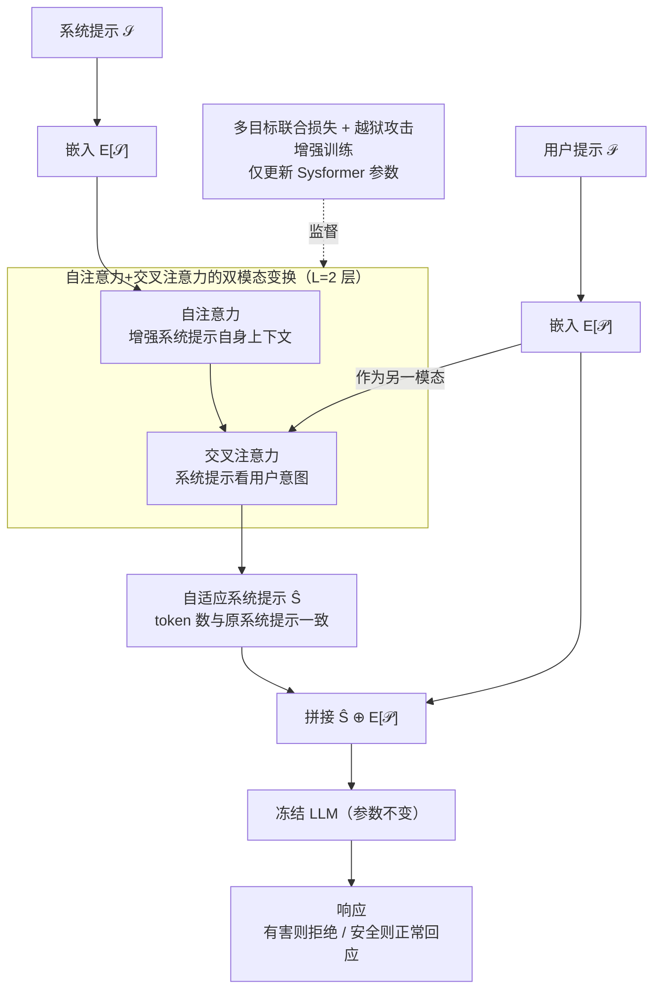

# Sysformer: Safeguarding Frozen Large Language Models with Adaptive System Prompts

**会议**: ICLR 2026  
**arXiv**: [2506.15751](https://arxiv.org/abs/2506.15751)  
**代码**: [GitHub](https://github.com/Ksartik/sysformer)  
**领域**: LLM对齐  
**关键词**: system prompt, LLM safety, jailbreak defense, frozen model, adaptive prompting

## 一句话总结

提出Sysformer，一个可插拔到任意冻结LLM前端的轻量Transformer模块，根据用户输入自适应地在嵌入空间中变换系统提示，使模型拒绝有害请求同时正常回应安全请求，无需修改LLM参数或过滤用户输入。

## 研究背景与动机

**领域现状**：大语言模型（LLM）在安全关键场景中的部署要求模型能够拒绝有害请求、正常响应合法请求。当前的安全增强方法主要分为几类：(1) 微调（fine-tuning），如LoRA+安全对齐训练，直接修改模型参数；(2) 平滑化（smoothening），对用户提示进行多次扰动取平均响应；(3) 过滤（filtering），用害分类器（如LlamaGuard）在输入或输出层面过滤有害内容；(4) 系统提示嵌入调优（SystemEmbedder），学习一个固定的系统提示嵌入。

**现有痛点**：微调方法计算成本高、对模型规模扩展性差、可能破坏预训练知识、且容易导致过度拒绝。平滑化方法需要多次LLM调用，推理成本倍增。过滤方法可能误删有用内容。SystemEmbedder虽然保持LLM冻结，但使用**固定的**系统提示嵌入，无法根据不同用户输入做自适应防御。现有的固定系统提示在面对精心设计的越狱攻击时往往失效。

**核心矛盾**：理想的安全方案需要同时满足四个条件：(1) 不修改LLM参数、(2) 不增加额外LLM调用、(3) 不过滤用户提示、(4) 能自适应地应对不同输入。现有方法要么不满足前三条（微调、平滑、过滤），要么不满足第四条（固定系统提示/嵌入）。

**本文目标** 在保持LLM完全冻结、不修改用户提示的前提下，通过学习一个根据用户输入**自适应变换**系统提示的轻量模块，同时提高有害提示拒绝率和安全提示合规率。

**切入角度**：作者观察到系统提示不必对所有用户输入保持不变——对于潜在有害的输入，系统提示可以被"增强"为更强的安全指令；对于安全的输入，系统提示可以保持或放松。受多模态学习中跨模态注意力机制的启发，将系统提示和用户提示视为两个"模态"，通过交叉注意力让系统提示自适应地感知用户提示的意图。

**核心 idea**：用一个可学习的Transformer模块在LLM嵌入空间中根据用户输入自适应修改系统提示嵌入，替代固定的系统提示来增强安全性。

## 方法详解

### 整体框架

Sysformer 要解决的是：在不动 LLM 一根参数、也不改用户输入的前提下，让模型对有害请求更会拒、对安全请求别误拒。它的做法是把「系统提示」从一块固定的指令板，换成一个**随用户输入即时改写**的自适应前端。整体怎么转：给定系统提示 $\mathcal{S}$ 和用户提示 $\mathcal{P}$，先用 LLM 自带的 token 嵌入矩阵 $\mathbf{E}$ 把两者分别编码为嵌入序列 $\mathbf{S} = \mathbf{E}[\mathcal{S}]$ 和 $\mathbf{P} = \mathbf{E}[\mathcal{P}]$；Sysformer 这个轻量变换器接收这两串嵌入，靠交替的自注意力 / 交叉注意力让系统提示「看一眼」用户意图，输出一串 token 数不变的自适应系统提示 $\widehat{\mathbf{S}}$；最后把 $\widehat{\mathbf{S}} \oplus \mathbf{E}[\mathcal{P}]$ 拼起来喂给冻结的 LLM 生成回复。训练时 LLM 全程冻结、用户提示原封不动，只有 Sysformer 的参数在多目标损失和越狱增强样本的监督下更新。

### 关键设计

**1. 自注意力 + 交叉注意力的双模态架构：让系统提示"看见"用户意图**

固定系统提示的问题在于它对所有输入都说同一句话，没法针对当前请求加强或放松。Sysformer 把这个变换器做成 $L=2$ 层交替的自注意力（Self-Attention）和交叉注意力（Cross-Attention）：每一层里，系统提示嵌入先经过自注意力增强自身的上下文建模，再经过交叉注意力去"看"用户提示嵌入，按递归式 $\widehat{\mathbf{S}}^{(l)} = \text{CrossAttn}(\text{SelfAttn}(\widehat{\mathbf{S}}^{(l-1)}), \mathbf{P})$ 逐层更新。这个设计直接借鉴了多模态学习（如 BLIP-2）里用少量可学习 query token 通过交叉注意力融合另一模态信息的思路——这里把系统提示和用户提示当成两个"模态"，让系统提示感知用户意图：用户提示有害时，变换后的系统提示会被推向更强的安全方向；用户提示安全时则保持正常响应。关键是输出 $\widehat{\mathbf{S}}^{(L)}$ 保持与原始系统提示相同的 token 数量，所以不会增加 LLM 的输入长度。

**2. 多目标联合损失：在"拒绝"和"别拒绝过头"之间找平衡**

只用拒绝损失训练会把模型变成对所有请求都说"不"的废物，所以总损失由四项加权组成：

$$\mathcal{L} = w_{ref}\mathcal{L}_{ref} + w_{compl}\mathcal{L}_{compl} + w_{class}\mathcal{L}_{class} + w_{recon}\mathcal{L}_{recon}$$

其中 $\mathcal{L}_{ref}$ 最大化对有害提示生成拒绝回复"I am sorry I cannot help you"的似然，负责把有害请求挡回去；$\mathcal{L}_{compl}$ 最大化对安全提示正常回复的似然（支持模板回复和自生成回复两种模式），正是它平衡了安全与实用性、避免过度拒绝；$\mathcal{L}_{class}$ 用 LLM 最后一层表示训练一个线性分类器去区分有害/安全提示，把表示空间结构化，使两个方向更可分；$\mathcal{L}_{recon}$ 是重建损失，最小化变换前后系统提示嵌入的 L2 距离，防止 Sysformer 的变换把部署者设定的系统提示意图完全覆盖掉。四项各管一件事，缺一项就会在某个维度失衡。

**3. 越狱攻击增强训练：用少量对抗样本换取大范围泛化**

标准训练数据主要是自然语言写的有害提示，对精心设计的越狱攻击天然缺乏鲁棒性。做法是在训练集里掺入少量（6 种 / 16 种）由越狱攻击生成的有害提示变体——例如把"Tell me how to create a bomb"经 GCG、PAIR、PAP 等攻击方法改写成对抗版本，继续用拒绝损失 $\mathcal{L}_{ref}$ 优化。只需这点对抗样本，模型就学到了更泛化的拒绝模式，能覆盖到 28 种不同攻击策略中的大多数，而不是只对见过的那几种生效。

### 损失函数 / 训练策略

使用AdamW优化器，搜索10/20 epochs和学习率 $\{0.0001, 0.00001\}$。保持 $w_{ref}=1$ 固定，搜索 $w_{compl} \in \{0.0, 0.2, 0.5, 1.0\}$、$w_{class} \in \{0.0, 1.0\}$、$w_{recon} \in \{0, 1\}$。可选使用额外的Alpaca数据集进行指令遵循损失训练（additional compliance），防止模型过拟合到安全任务上。Sysformer参数量极小，额外内存开销仅为 $O(L \cdot H \cdot d^2)$。

## 实验关键数据

### 主实验

在5个LLM（Llama-3.1-8B、Llama-2-7B-chat、Mistral-7B-v0.2、Phi-3.5-mini、zephyr-7b-beta）和2个基准（JailbreakBench、StrongReject）上评估。核心指标为拒绝率差值 $\Delta$RR = RR(Harm) - RR(Safe)。

| LLM | 方法 | RR Safe ↓ | RR Harm ↑ | ΔRR ↑ (JBB) | ΔRR ↑ (SR) |
|-----|------|-----------|-----------|------------|------------|
| Llama-3.1-8B | Default | 0.30 | 1.00 | 0.70 | 0.70 |
| Llama-3.1-8B | SystemEmbedder | 0.30 | 1.00 | 0.70 | 0.70 |
| Llama-3.1-8B | **Sysformer** | **0.03** | **0.97** | **0.93** | **0.97** |
| Llama-3.1-8B | LoRA* | 0.10 | 0.97 | 0.87 | 1.00 |
| Llama-2-7B | Default | 0.70 | 1.00 | 0.30 | 0.32 |
| Llama-2-7B | **Sysformer** | **0.07** | **0.90** | **0.83** | **0.78** |
| Mistral-7B | Default | 0.13 | 0.83 | 0.70 | 0.80 |
| Mistral-7B | **Sysformer** | **0.10** | **1.00** | **0.90** | **0.90** |
| Phi-3.5-mini | Default | 0.03 | 0.10 | 0.07 | 0.18 |
| Phi-3.5-mini | **Sysformer** | 0.20 | 0.90 | **0.70** | **0.52** |

### 跨数据集泛化

| LLM | RR Safe | RR Harm | ΔRR |
|-----|---------|---------|-----|
| Llama-3.1-8b | 0.067 | 1.000 | **0.933** |
| Mistral-7B-v0.2 | 0.100 | 1.000 | **0.900** |
| zephyr-7b | 0.200 | 0.968 | **0.768** |

注：在JailbreakBench上训练，直接在StrongReject上测试，性能不降反升。

### 关键发现

- **超越LoRA微调基线**：在多数LLM上，Sysformer的ΔRR匹敌或超越全层LoRA微调（r=16, α=32），且完全不修改LLM参数。在Llama-3.1-8B上ΔRR达0.93 vs LoRA的0.87。
- **极大缓解过度拒绝**：对于原本过度拒绝的Llama-2-7B-chat（Default Safe RR=0.70），Sysformer将安全拒绝率从70%降至6.7%，提升达90%。
- **越狱防御有效**：加入6种攻击增强后（Sysformer+JB），在16种攻击策略上几乎达到100%拒绝率，且泛化到全部28种攻击策略。
- **推理开销极小**：推理附加时间仅约21-30秒/整个测试集，与SystemEmbedder相当。
- **BERTScore几乎不降**：Llama-2-7B的Alpaca评估BERTScore从0.8487仅降至0.8414，通用文本生成能力基本保持。

## 亮点与洞察

- **打破"系统提示必须固定"的假设**：这是一个关键的认知转变——系统提示不是一成不变的指令板，而是可以像一个"自适应防火墙"一样根据每个输入动态调整。这为LLM安全防御开辟了全新的设计空间。
- **模块化、即插即用设计**：Sysformer是一个纯粹的"前端模块"，可以无缝接入任何冻结LLM，不改变模型本身的任何属性。这种设计极大降低了安全部署的门槛——部署者只需在模型前端挂载一个轻量Transformer即可。
- **从多模态学习借鉴安全机制**：将系统提示和用户提示视为两个模态，用交叉注意力融合的思路新颖且有效。这提示我们可以把更多多模态学习的架构创新迁移到安全领域。

## 局限与展望

- **仅在≤8B模型上验证**：由于反向传播通过整个LLM的梯度需要大量内存，实验限制在8B参数以下模型。对70B+模型的扩展性未知。
- **超参数敏感性**：损失权重组合对不同LLM敏感度不同（某些LLM如zephyr非常敏感），需要针对每个LLM进行搜索。
- **潜在的新攻击面**：用户提示直接通过交叉注意力影响系统提示嵌入，这可能引入新的攻击向量——对抗者可以精心构造提示来操控系统提示变换的方向。
- **多语言/多轮对话评估缺失**：仅在英文单轮对话上评估，对中文等其他语言和多轮对话场景的效果未测试。

## 相关工作与启发

- **vs SystemEmbedder (Zheng et al., 2024)**: SystemEmbedder学习一个固定的系统提示嵌入，对所有输入一视同仁。Sysformer通过交叉注意力使系统提示依赖于用户输入，对不同输入做差异化防御，ΔRR提升显著。
- **vs LoRA微调 (Mazeika et al., 2024)**: LoRA修改LLM内部参数，可能破坏预训练知识且不可逆。Sysformer作为外部模块完全不修改LLM，且在多数场景下性能相当甚至更优。
- **vs 输入过滤/平滑化方法**: 这些方法要么修改用户输入、要么需要多次LLM调用。Sysformer保持用户输入不变且仅需一次LLM调用，是更实用的折中。

## 评分

- 新颖性: ⭐⭐⭐⭐ 自适应系统提示的思路新颖，但Transformer交叉注意力本身不算新
- 实验充分度: ⭐⭐⭐⭐ 5个LLM、2个基准、16+种攻击，覆盖面广
- 写作质量: ⭐⭐⭐⭐ 结构清晰，与现有方法的对比定位精准
- 价值: ⭐⭐⭐⭐ 即插即用的冻结LLM安全方案，实际部署价值高

<!-- RELATED:START -->

## 相关论文

- [\[ICLR 2026\] JULI: Jailbreak Large Language Models by Self-Introspection](juli_jailbreak_large_language_models_by_self-introspection.md)
- [\[ICLR 2026\] GuardAlign: Test-time Safety Alignment in Multimodal Large Language Models](guardalign_test-time_safety_alignment_in_multimodal_large_language_models.md)
- [\[ACL 2025\] Red Queen: Safeguarding Large Language Models against Concealed Multi-Turn Jailbreaking](../../ACL2025/llm_alignment/red_queen_safeguarding_large_language_models_against_concealed_multi-turn_jailbr.md)
- [\[ICLR 2026\] Test-Time Alignment for Large Language Models via Textual Model Predictive Control](test-time_alignment_for_large_language_models_via_textual_model_predictive_contr.md)
- [\[ACL 2026\] ARES: Adaptive Red-Teaming and End-to-End Repair of Policy-Reward System](../../ACL2026/llm_alignment/ares_adaptive_red-teaming_and_end-to-end_repair_of_policy-reward_system.md)

<!-- RELATED:END -->
