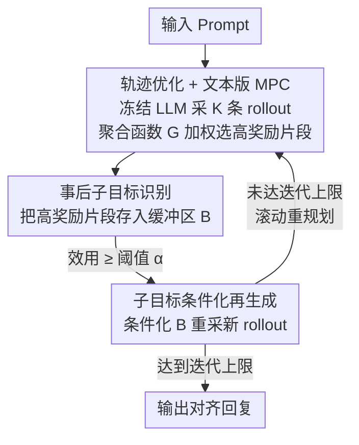

# Test-Time Alignment for Large Language Models via Textual Model Predictive Control

**会议**: ICLR 2026  
**OpenReview**: [https://openreview.net/forum?id=DsS3xRPSs5](https://openreview.net/forum?id=DsS3xRPSs5)  
**论文**: [Project Page](https://rl-bandits-lab.github.io/TMPC/)  
**代码**: https://rl-bandits-lab.github.io/TMPC/ (项目页)  
**领域**: 对齐RLHF / LLM测试时对齐  
**关键词**: 测试时对齐, 模型预测控制, 子目标规划, 轨迹优化, 推理时搜索

## 一句话总结
把 LLM 的测试时偏好对齐重述成一个轨迹优化问题，借控制论里的模型预测控制（MPC）做"边走边规划"，靠**事后子目标识别**从已生成的 rollout 里挑出高奖励片段当 waypoint、再**条件化重新生成**滚动逼近最优，在机器翻译、长文回复、代码生成三类任务上都不动模型参数就稳定涨点。

## 研究背景与动机

**领域现状**：让 LLM 对齐人类偏好的主流路线是训练时对齐——RLHF、DPO、SimPO、CPO 这类要更新参数的方法效果好，但每换一个偏好或任务就得重新训一遍，代价高、不灵活。于是测试时对齐（test-time alignment）成了轻量替代：冻结模型，只在推理阶段引导输出。常见做法分两类，一类是 token 级的引导解码（如 ARGS、GenARM，用奖励模型逐 token 干预），一类是回复级的迭代精修（如 TPO，把奖励翻成文字 critique 让模型重写）。

**现有痛点**：作者把生成过程看成"序列决策"，发现这两类做法各踩一个坑。token 级动作的引导解码会陷入**视野诅咒（curse of horizon）**：动作粒度太细，一条轨迹动辄上百步，credit assignment（哪个 token 该为最终质量负责）变得极不可靠，对齐很脆。回复级动作的迭代精修则陷入**维度诅咒（curse of dimensionality）**：每一步都要重写整段回复，动作空间巨大，搜索既不稳定也很难找到真正的改进方向。

**核心矛盾**：动作粒度太细 → 视野太长、信用难分配；动作粒度太粗 → 搜索空间爆炸。准确的信用分配和可控的搜索空间之间存在 trade-off，而前两类方法各占一端、都没占到甜点。

**本文目标**：找到一种中间粒度的"动作单元"，既能缩短规划视野、又能把搜索约束在高质量区域，且全程不训练、不更新参数。

**切入角度**：控制论里的 MPC 正好是"在移动窗口上反复求解局部最优、只执行一部分、再滚动重规划"的范式，天然平衡了视野与搜索。但经典 MPC 假设问题能切成预定义的硬边界片段（hard segment boundary），而文本生成（尤其是代码）往往没有天然边界。

**核心 idea**：提出 **Textual Model Predictive Control（TMPC）**——把 MPC 搬到文本生成里，用"子目标（subgoal）"充当可变的时间步单元，借鉴分层强化学习的两条原则解决"没有天然边界"的问题：事后（hindsight）从 rollout 里挑出高奖励片段当子目标，再条件化这些已验证的子目标去滚动生成，从而在视野与搜索之间取得平衡。

## 方法详解

### 整体框架

TMPC 把"给定 prompt 生成对齐回复"形式化为一个确定性 MDP 上的轨迹优化问题：状态是文本前缀、动作是某种粒度的生成单元、奖励来自奖励模型或任务信号，目标是最大化整条轨迹的累计奖励 $J(\tau)=\sum_{t=0}^{T-1}R(s_t,a_t)$。直接全局搜索长度为 $T$ 的最优动作序列不可行，所以借 MPC 思路把它拆成"在移动窗口上反复求解局部最优"。

具体一轮是这样转的：冻结的 LLM 当作 proposal 分布，从当前状态采样出 $K$ 条 rollout；每条 rollout 被切成片段并逐段打分；一个**聚合函数 $G$** 仿照连续控制里的 MPPI（Model Predictive Path Integral），用奖励加权的方式挑出一组**非连续的高奖励片段** $\tilde a^{\text{TMPC}}$；这些片段被事后认定为子目标、存进缓冲区 $B$；下一轮生成不再从通用 proposal 出发，而是**条件化 $B$ 里已验证的子目标**去采新 rollout。如此 receding-horizon 地滚动若干轮，每轮把轨迹的一部分"事后执行"、对剩余部分重新优化，最终拼出全局高效用的回复。

TMPC 之所以天然适配测试时对齐，有两点：① **不需要额外学习**——文本生成 MDP 的状态转移本身确定可知（dynamics model 现成），冻结 LLM 又能直接当 proposal 分布，所以无需训练任何东西；② **同时治两个诅咒**——在子目标层评估奖励缩短了有效信用视野（治视野诅咒），用子目标缓冲把搜索约束到高奖励区域缩小了每轮动作空间（治维度诅咒）。

### 关键设计

**1. 轨迹优化视角 + 文本版 MPC：用可变粒度子目标占据"信用分配 vs 搜索空间"的甜点**

针对前面那个核心矛盾——token 级太细、回复级太粗——TMPC 不固定动作粒度，而是把对齐重述为轨迹优化 $a^*(s_0)=\arg\max_{a_{0:T-1}}\sum_t R(s_t,a_t)$，再用 MPC 在移动窗口 $H$（通常 $H<T$）上近似求解 $a^{\text{MPC}}(s_t)=\arg\max_{a_{t:t+H-1}}\sum_{i=t}^{t+H-1}R(s_t,a_t)$，每次只执行其中一部分动作再滚动重规划。关键是怎么从离散文本 rollout 里"加权选动作"：作者把连续控制里的 MPPI 加权 $a_t=\big(\sum_i \exp(\tfrac{1}{\lambda}J(\tau^{(i)}_t))a^{(i)}_t\big)/\sum_i \exp(\tfrac{1}{\lambda}J(\tau^{(i)}_t))$ 抽象成一个**聚合函数** $\tilde a^{\text{TMPC}}(s)\leftarrow G(\{\tau^{(i)}\}_{i=1}^K,\{J(\tau^{(i)})\}_{i=1}^K;s)$，它从 $K$ 条 rollout 中选出一组非连续动作供后续子目标生成使用。这样既不在 token 层做脆弱的逐步引导，也不在回复层盲目重写整段，而是落到"片段/子目标"这个中间粒度——这正是它能比引导解码和整段精修都更稳的根因。

**2. 事后子目标识别：没有天然边界，就让奖励事后告诉你哪段是好 waypoint**

经典 MPC 要求问题能切成预定义硬边界，但翻译能按句切、长文回复只能按语义切、代码生成更是没有可规划的结构边界（AST 节点太碎）。TMPC 的解法是"先生成、后认定"：先采出候选 rollout 并逐段评估，再**事后（hindsight）**把高奖励的中间片段追认为子目标——子目标可以很具体（翻译里的一个句子），也可以很抽象（代码里"通过某个失败单测"这种功能里程碑）。被选中的片段按效用进出缓冲区 $B$：未满则直接并入，已满则用更高奖励的新片段替换掉缓冲里更差的片段（式 4 的"低于则淘汰"规则）。这一步的意义在于把"任务无关的统一机制"装进了三类边界性质完全不同的任务，且因为是事后挑、不是先验切，它能发现真正对最终质量有贡献的步骤，从而把长视野有效缩短。

**3. 子目标条件化再生成：滚动地把已验证的"积木"拼成全局高效用回复**

光识别子目标还不够——单遍优化容易停在次优解。TMPC 让规划迭代进行：下一轮不从通用 proposal 采样，而是**条件化缓冲区 $B$ 里的高奖励子目标**去生成新 rollout，聚合函数据此挑出 $\tilde a^{\text{TMPC}}_t(s)\leftarrow G(\{\tau^{(i)}_t\}_{i=1}^K,R(\cdot)\mid s,B):=\{a\mid R(s,a)\ge\alpha,\ a\in\{\tau^{(i)}_t\}_{i=1}^K\}$，即只保留奖励超过阈值 $\alpha$ 的片段。直觉上，模型被鼓励"组合并延展"已经被验证过的好积木，而不是每轮从零冒险。Principle 1 决定"哪些已生成片段算子目标"，Principle 2 决定"围绕它们怎么重排出新的完整轨迹"，两者合起来就构成了文本上的 receding-horizon 控制环：每轮把一部分轨迹事后定为已执行、对剩余部分条件化这些承诺重新优化，从而跳出差的局部最优、把跨轮发现的最佳片段累积成全局高质量回复。正因为新轨迹始终建立在已验证 waypoint 之上，TMPC 的改进是稳定累积的，而不像纯迭代精修那样容易误差滚雪球。

### 一个完整示例

以 zh→en 段落翻译为例走一遍：冻结的 LLaMA-3.1-8B 对一段中文先采出 $K=3$ 条候选译文，每条按句切段、用奖励模型（MetricX/COMET 框架下）逐句打分；聚合函数挑出各候选里得分最高的若干句子，把它们作为子目标存入缓冲（如某句的高质量译法被追认为 waypoint）；下一轮生成时强制条件化这些已验证句子，让模型只在尚未稳定的部分重新探索；如此滚动 3 轮，SEGALE-COMET 从第 1 轮的 93.28 升到第 3 轮的 94.13（第 4、5 轮略降），而把 TMPC 退化成 buf=1,seg=1 的朴素迭代精修则一路停在 84 上下不动——直观展示了"识别子目标 + 条件化再生成"两条原则各自的贡献。

## 实验关键数据

骨干统一为 LLaMA-3.1-8B-Instruct，三类任务覆盖不同边界性质：段落级机器翻译（WMT'24 文学翻译，有天然边界）、长文回复（HH-RLHF 最长 1024 条，无天然边界）、程序合成（MBPP 500 题，用单测通过当奖励、边界靠"功能里程碑"定义）。

### 主实验

段落级翻译（SEGALE-COMET ↑ / NA Ratio ↓，test-time 方法对比）：

| 方法 | zh→en COMET | zh→en NA↓ | zh→ru COMET | zh→de COMET |
|------|------|------|------|------|
| ARGS（token 级） | 63.99 | 31.53 | 43.03 | 51.97 |
| RAIN | 58.52 | 37.18 | 66.29 | 67.43 |
| RE-Control | 86.39 | 7.06 | 84.97 | 87.16 |
| GenARM | 61.18 | 34.73 | 55.67 | 60.96 |
| TPO | 88.81 | 5.63 | **92.63** | 87.67 |
| Best-of-60 | 90.97 | 3.58 | 84.86 | 82.74 |
| **TMPC** | **94.62** | **0.00** | 91.53 | 91.73 |
| GPT-4o（上界参考） | 94.58 | 0.10 | 93.74 | 94.54 |

TMPC 在 zh→en 上甚至超过 GPT-4o，且 NA Ratio（漏译/过译比例）压到 0；用远小于 Best-of-60 的算力就打过了它。长文回复（Avg Reward）：TMPC 4.60，高于 DPO（-0.91 基座/训练时最强 SimPO 3.95）、Best-of-20（4.36）、TPO(iter=4) 4.19，而 TMPC 只用 3 轮×3 rollout + 1 次初始 = 10 次生成，Best-of-20 翻倍采样仍更差，TPO 要花约两倍算力才追平。程序合成（MBPP Pass Rate）：TMPC 61%，碾压 TPO（48%）、Best-of-35（50%）、基座（34%）。

### 消融实验

长文回复上对两条原则与鲁棒性的分析（Avg Reward）：

| 配置 | Avg Reward | 说明 |
|------|---------|------|
| Full TMPC | 4.595 | 完整模型 |
| w/o Principle 1（缓冲改 FIFO、不按质量排） | 4.264 | 掉最多，子目标不再按质量筛，优化方向被带偏 |
| w/o Principle 2（缓冲 size=1，几乎不条件化） | 4.463 | 也掉点，但不退化成 Best-of-N |
| 阈值 $\alpha=0$ | 4.469 | 过早纳入低质片段，略降 |
| 阈值 $\alpha=4$ / $\alpha=5$ | 4.595 / 4.539 | $\alpha$ 太高减少多样性、向 Best-of-N 收敛 |
| 弱奖励模型（GRM, 77.54% acc） | 4.332 | 影响有限，子目标缓冲会逐步滤掉差片段 |
| 注入奖励噪声（$\sigma^2=1$） | 4.457 | 影响更小 |
| buffer/segment 尺寸（3/6 组合） | 4.482~4.595 | 变化 < 0.1，对核心超参不敏感 |

### 关键发现
- **事后识别（Principle 1）是最关键的一环**：把它退化成 FIFO 缓冲后掉点最多（4.595→4.264），说明"按奖励质量挑子目标"比"有缓冲"本身更重要——缓冲若不排序，反而把优化推向错误方向。
- **对奖励模型质量出奇地鲁棒**：换弱 RM 或注噪声都只小幅下降，作者归因于子目标缓冲的渐进过滤——差片段会被后续更强片段覆盖，相当于自带降噪。
- **迭代收益有拐点**：zh→en 上性能升到第 3 轮见顶，之后略降；而朴素迭代精修（buf=1,seg=1）从头到尾不涨，凸显两条原则缺一不可。
- **样本效率是核心卖点**：等算力（10 次 LLM 调用）下 TMPC 持平或胜过 TPO，TPO 要花约两倍算力才追平。

## 亮点与洞察
- **把控制论的 MPC/MPPI 干净地映射到文本生成**：确定性转移让 dynamics model 现成、冻结 LLM 当 proposal 分布，于是"无需任何训练"地拿到了 model-based 规划的好处，这个对应关系本身就很漂亮。
- **"子目标"是治两个诅咒的同一把钥匙**：中间粒度既缩短信用视野又约束搜索空间，一个设计同时夹在两端之间，避免了 token 级和回复级各自的失败模式。
- **事后（hindsight）识别绕过"没有天然边界"**：不预设切分，而让奖励事后告诉你哪段是好 waypoint，于是同一机制能统一覆盖翻译（按句）、长文（按语义块）、代码（按通过单测）三种完全不同的边界性质——这种 task-agnostic 是可迁移的设计思路。
- **缓冲区自带降噪**：高奖励片段不断覆盖低奖励片段，使整个方法对奖励模型误差和噪声很鲁棒，这对测试时对齐这种"奖励信号常常不完美"的场景特别实用。

## 局限与展望
- 全程依赖一个外部奖励信号（奖励模型或单测）来打分挑子目标，奖励本身的偏差/可被 reward hacking 的风险没被根治；作者用 Win Rate（GPT-4 评判）来缓解 Avg Reward 的"刷分"问题，但奖励质量仍是上限。
- 迭代有拐点（约 3 轮后翻译略降），更多迭代不总更好，何时停需要按任务调；buffer/segment/$\alpha$ 虽鲁棒但仍是要设的超参。
- 实验只用单一 8B 骨干（LLaMA-3.1-8B-Instruct），更大模型或更强基座上"测试时对齐还能涨多少"未知；每轮多 rollout 仍带来推理成本（虽比 Best-of-N、TPO 省）。
- 子目标的"组合与延展"具体怎么在 prompt 层实现、对长依赖任务是否会拼接出不连贯轨迹，正文交代较略（细节在附录），是潜在改进点。

## 相关工作与启发
- **vs 引导解码（ARGS / GenARM / RE-Control）**：它们在 token 级用奖励或值函数逐步干预，落入视野诅咒、信用分配脆弱（翻译表里 NA Ratio 高达 30%+）；TMPC 把动作提到子目标级，信用视野更短、更稳。
- **vs 迭代精修 TPO**：TPO 把奖励翻成文字 critique 让模型整段重写，处于回复级、易受脆弱 critique 影响并误差累积；TMPC 用已验证子目标缓冲做条件，等算力下更稳更省（10 vs 20 次调用）。
- **vs Best-of-N**：Best-of-N 靠采样运气、受基座初始能力上限约束（MBPP 即便 N=35 也只 50%）；TMPC 主动构造解、在部分正确基础上系统探索，把"碰运气"换成"搭积木"。
- **vs 训练时对齐（DPO / SimPO / SFT）**：后者要更新参数、换偏好就重训；TMPC 不动参数即可对齐，长文回复上 Avg Reward 还胜过 DPO。

## 评分
- 新颖性: ⭐⭐⭐⭐⭐ 首次把 MPC/MPPI 的 receding-horizon 规划 + 事后子目标识别系统地搬到 LLM 测试时对齐，视角和机制都新。
- 实验充分度: ⭐⭐⭐⭐ 三类边界性质迥异的任务 + 两原则消融 + 奖励模型鲁棒性/阈值/迭代分析较全，但只用单一 8B 骨干。
- 写作质量: ⭐⭐⭐⭐⭐ "两个诅咒"的 framing 清晰，公式与图（MPPI→聚合函数 G）对应明确。
- 价值: ⭐⭐⭐⭐ 不训练即对齐、对奖励噪声鲁棒、样本效率高，对测试时对齐落地很实用。

<!-- RELATED:START -->

## 相关论文

- [\[ICLR 2026\] GuardAlign: Test-time Safety Alignment in Multimodal Large Language Models](guardalign_test-time_safety_alignment_in_multimodal_large_language_models.md)
- [\[ACL 2026\] On the Rejection Criterion for Proxy-Based Test-Time Alignment](../../ACL2026/llm_alignment/on_the_rejection_criterion_for_proxy-based_test-time_alignment.md)
- [\[ICLR 2026\] Towards Understanding Valuable Preference Data for Large Language Model Alignment](towards_understanding_valuable_preference_data_for_large_language_model_alignmen.md)
- [\[ICLR 2026\] Multi-objective Large Language Model Alignment with Hierarchical Experts](multi-objective_large_language_model_alignment_with_hierarchical_experts.md)
- [\[ICLR 2026\] Semantic-aware Wasserstein Policy Regularization for Large Language Model Alignment](semantic-aware_wasserstein_policy_regularization_for_large_language_model_alignm.md)

<!-- RELATED:END -->
