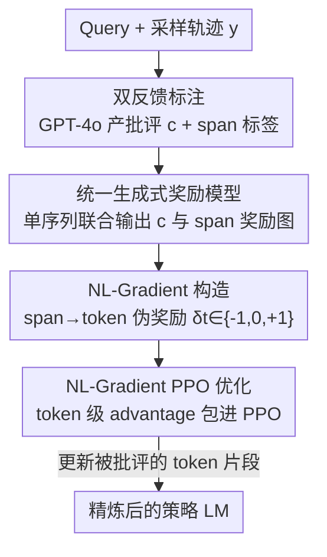

# Text2Grad: Reinforcement Learning from Natural Language Feedback

**会议**: ICLR 2026  
**OpenReview**: [https://openreview.net/forum?id=SIE9fNq8lk](https://openreview.net/forum?id=SIE9fNq8lk)  
**代码**: https://github.com/microsoft/Text2Grad (有)  
**领域**: 对齐RLHF / LLM训练 / 强化学习  
**关键词**: 自然语言反馈, span 级奖励, token 级信用分配, PPO, 生成式奖励模型

## 一句话总结
把自由形式的文字批评对齐到输出的 token 片段、转成 token 级伪奖励，再据此构造"自然语言梯度"驱动 PPO 更新，让模型只修改"被批评的那几个 token"而非全局乱推，在摘要、代码生成、问答三类任务上同时超过标量奖励 RL 和纯提示反思基线。

## 研究背景与动机

**领域现状**：RLHF 已是对齐 LLM 的主流范式，做法是把人类偏好压成一个标量奖励 $R(y)$，再用 PPO/DPO 把策略往高分方向推。

**现有痛点**：标量奖励把"答案哪里好、哪里坏、坏在哪个位置"这种多维、细粒度的信息全部塌缩成一个数字。优化器拿到 $-3$ 这样的分数，只知道"整体不行"，却不知道该改哪一段，导致信用分配不准、收敛慢、可解释性差。论文图 1 的例子很传神：奖励模型说"我知道这个摘要不好，但到底哪部分不好？"——标量奖励答不上来。

**核心矛盾**：另一条路（ReAct、Reflexion 等）把反馈保留成自然语言、在推理时让模型反思自纠，可解释性上去了，但**模型参数原封不动**——反馈没有被"内化"，每次遇到同类错误都要重新纠正一遍，教训留不住。于是形成两难：要细粒度可训练信号就得塌缩成标量丢掉语言信息；要保留语言信息就只能停在推理时、训不进参数。

**本文目标**：把自由形式的文字批评变成**可训练的梯度**，既保留语言的细粒度定位能力，又能真正更新策略参数。

**切入角度**：作者观察到一句批评（如"摘要漏掉了作者担心稿子被拒"）天然指向输出里**特定的 token 片段**。如果能把"批评短语 ↔ token span"对齐起来，就能把语言反馈落到具体 token 上，进而当作 token 级的奖励权重塞进策略梯度。

**核心 idea**：定义"自然语言梯度"（NL-Gradient）——把文字批评对齐到 span、映射成 token 级伪奖励 $\delta_t$，再用 $\delta_t$ 给标准策略梯度逐 token 加权，"语言决定了更新什么、更新在哪"。

## 方法详解

### 整体框架

Text2Grad 的核心目标是构造一个能直接驱动策略更新的 NL-Gradient。整条流水线把"语言推理"接到"可微的信用分配"上：先用强 LLM 给采样轨迹标出"文字批评 + span 级正负标签"，把这套标注训进一个统一的生成式奖励模型；推理时奖励模型对策略的输出同时吐出批评和 span 奖励图，解析成逐 token 的伪奖励 $\delta_t \in \{-1, 0, +1\}$；这些 $\delta_t$ 经 GAE 算出 token 级 advantage，包进 PPO 目标完成更新。整套东西只需要在 PPO 之上加一层"token 加权包装"，跨任务无需改动。

### 关键设计

**1. 双反馈标注：让"批评文字"和"被批评的 token"严格对齐**

要把语言变成 token 级监督，第一步得有"既有解释、又有定位"的标注。作者用 GPT-4o 对每条样本同时产出两样东西：一段自由文字批评 $c$（说清这个回答好在哪、坏在哪），和一个结构化的 span 奖励图 $A(y)$，把回答里的片段标成 `positive` / `negative`（`neutral` 隐式不标）。比如摘要任务里批评是"摘要漏掉了作者担心稿子可能被拒"，对应 JSON 就把 `"200 page unpublished novel"` 标为 good span、`"first time author"` / `"finding a good editor"` 标为 poor span。

关键在于标注提示**强制要求 span 必须由批评直接支撑**：在没有人工反馈时用 CoT 提示让 GPT-4o 先逐步推理质量、再写批评、最后才高亮 span，每个 span 都要能在批评 $c$ 里找到证据锚点。这保证了"批评 ↔ span"语义对齐，而不是模型随手圈几个词。配合"只标正负、不标中性"的类别优先策略，标注成本省 85–90%，且只标了约 30% 的 token 却保持 93–96% 的准确率——论文强调性能取决于 span 选择**质量**而非覆盖率，密集逐 token 标注（标到约 70% 的 token）反而引入风格词/无关词的噪声。

**2. 统一生成式奖励模型：一个自回归序列同时产出批评和 span 奖励图**

有了标注数据，作者不再训一个预测标量分数的奖励模型，而是把奖励建模当成**文本生成任务**。给定 prompt $x$ 和回答 $y$，奖励模型 $R_\phi$ 输出一个序列 $z = [c; A(y)]$——前半是自然语言批评、后半是 JSON 格式的 span 标签图，整段用单次自回归生成。训练就是标准的条件语言建模交叉熵：

$$\mathcal{L}_R(\phi) = -\mathbb{E}_{(x,y,z)\in D_R}\big[\log p_\phi(z \mid x, y)\big]$$

这样设计有三重好处：跨任务靠文本监督即可泛化、梯度能流过 token 化输出、解释和 token 级奖励统一在一个模型里。实现上微调 Llama3.1-8B-Instruct 当奖励模型，用 GPT-4o 的 CoT 标注做监督。它取代了标量奖励模型，让"为什么打这个分"和"分打在哪些 token"一并产出，是后续构造 NL-Gradient 的信号源。

**3. NL-Gradient 定义与构造：把 span 标签落成 token 伪奖励再加权策略梯度**

这是全文的理论核心。传统策略梯度优化序列级标量回报 $J(\theta) = \mathbb{E}_{y\sim\pi_\theta}[R(y)]$，掩盖了 token 级贡献。作者定义 NL-Gradient：给定序列 $y=(y_1,\dots,y_T)$ 和批评 $c$，把 $c$ 对齐到 $y$ 得到 token 级伪奖励 $\{\delta_t\}$，则

$$\nabla_{\mathrm{NL}}(c\to y) = \sum_{t=1}^{T} \delta_t \,\nabla_\theta \log \pi_\theta(y_t \mid x, y_{<t})$$

其中 span 到 token 的映射很直接：落在 positive span 的 token 给 $\delta_t=+1$，negative span 给 $-1$，其余给 $0$。注意作者澄清"NL-Gradient"不是真的对文本求导，而是"语言决定更新什么、更新在哪"——批评对齐到 span、span 离散成 token 伪奖励、伪奖励给标准策略梯度逐 token 加权。这就把"全局轻推"换成了"按批评精确定位的局部调整"，并天然带来可解释性（每步更新都对应一句人类可读的反馈）和可迁移性（模型学到的是"文本 → 梯度信号"的映射）。

**4. NL-Gradient PPO 优化：token 级 advantage 包进 PPO**

光有 $\delta_t$ 还不够，要稳定优化得接进 PPO。作者用这些密集的 token 伪奖励做细粒度 advantage 估计：先把伪奖励与 KL 惩罚合并成 $r^{\text{total},A}_t = \delta_t + r^{\text{KL}}_t$，再走 GAE：

$$A_t = \sum_{l=0}^{T-t-1} (\gamma\lambda)^l \,\delta^{\mathrm{TD}}_{t+l},\quad \delta^{\mathrm{TD}}_t = r^{\text{total},A}_t + \gamma V_\psi(x, y_{<t+1}) - V_\psi(x, y_{<t})$$

token 级 advantage 直接代入 PPO 的 clip 目标 $\mathcal{L}_{\text{PPO}}(\theta) = \mathbb{E}_t[\min(\rho_t A_t, \mathrm{clip}(\rho_t, 1-\epsilon, 1+\epsilon)A_t)] - \beta H(\pi_\theta)$。论文还给了一个理论论证：token 级奖励相比"序列末端给一个总奖励"对早期 token 的信用分配放大得多——在 $\gamma\lambda\approx 0.95$ 时，倒数第 20 个 token 的反馈权重约是末端监督的 $0.95^{-20}\approx 2.8$ 倍，即近 $3\times$，因而对长文本里定位并纠错更有效。

## 实验关键数据

三类任务统一用 Llama3.1-8B-Instruct（QA 用 Llama3-8B-Instruct）当策略与奖励模型骨干，奖励监督全部来自 GPT-4o 的 CoT 标注。

### 主实验

摘要（SLF5K）：Text2Grad 在所有指标上 SOTA，比 PPO 高 +25.3% BLEU、+6.7 ROUGE-L。

| 方法 | R-1 | R-2 | R-L | BLEU | BERTScore |
|------|-----|-----|-----|------|-----------|
| SFT | 0.285 | 0.078 | 0.195 | 0.032 | 0.875 |
| SFT + Reflection | 0.329 | 0.087 | 0.225 | 0.041 | 0.888 |
| DPO | 0.327 | 0.101 | 0.224 | 0.039 | 0.885 |
| PPO | 0.365 | 0.132 | 0.262 | 0.075 | 0.893 |
| PRM-PPO | 0.341 | 0.130 | 0.254 | 0.069 | 0.889 |
| ILF | 0.349 | 0.134 | 0.259 | 0.073 | 0.892 |
| **Text2Grad** | **0.400** | **0.155** | **0.291** | **0.094** | **0.902** |

代码生成（KodCode，pass@1 %）：平均比 PPO +3.6、比 DPO/PRM-PPO 各 +5.1/+5.8。

| 方法 | HumanEval | HumanEval+ | MBPP | MBPP+ | Avg. |
|------|-----------|-----------|------|-------|------|
| DPO | 65.2 | 56.7 | 66.1 | 56.1 | 61.0 |
| PPO | 64.6 | 61.0 | 68.5 | 55.8 | 62.5 |
| PRM-PPO | 61.5 | 59.8 | 65.1 | 54.9 | 60.3 |
| ILF | 63.4 | 60.4 | 68.5 | 57.1 | 62.3 |
| **Text2Grad** | **67.7** | **61.6** | **73.3** | **61.6** | **66.1** |

开放域问答（UltraFeedback）：AlpacaEval 比基座 +12.1、比 PPO +2.3，ARC-C 与 MT-Bench 也均超 PPO（34.7 / 84.4 / 7.58 对 PPO 的 32.4 / 82.7 / 7.43）。

### 消融实验

| 配置 | 关键指标 | 说明 |
|------|---------|------|
| Text2Grad（完整） | R-L 0.291 / 代码 Avg 66.1 | CoT 批评 + span 标签 |
| w/o CoT | R-L 0.275 / 代码 Avg 59.2 | 只给 span 分数、去掉文字解释，代码上掉 6.9 分 |
| 密集 token 标注 | R-L 0.196 | 标到约 70% token，函数词噪声拖垮 advantage |

### 关键发现

- **CoT 文字解释是关键、不只是 span 标签**：去掉 CoT 后代码任务平均掉 6.9 分、摘要 ROUGE-L 从 0.291 降到 0.275，说明"自然语言解释"才能产出更可操作的 token 级监督。
- **质量 > 覆盖率**：CoT 标注只标约 30% 的 token 却保持 93–96% 准确率；密集标注覆盖到 70% 反而把 ROUGE-L 从 0.291 拉到 0.196，因为大量标的是无语义的功能词。
- **精度优先于召回**：奖励模型负 token 召回偏低（UltraFeedback 仅 22%），但作者论证错号奖励会直接污染梯度、漏标只是降低更新密度，所以精度优先 + 高人类对齐（>82%）就够撑起稳定 advantage。
- **更快收敛**：Text2Grad 在 SLF5K 上比 PPO 快约 22% 收敛，GPT-4 评审对比 PPO 有约 12% 胜率增益。

## 亮点与洞察
- **把"批评文字 → token 伪奖励 → 加权策略梯度"串成一条可训练链路**：既保住了语言反馈的细粒度定位，又真正更新参数，巧妙地绕开了"标量丢信息 vs. 推理时不内化"的两难。
- **奖励建模改写成文本生成**：一个自回归序列同时产批评和 span 图，解释与监督统一在一个模型里，比"标量打分 + 另配解释"的拼装方案干净，且天然可解释。
- **"只标正负、CoT 驱动"的标注策略**：少标却更准，把标注成本砍 85–90% 的同时性能反而更好——"标得少但标得准"这个反直觉结论，可迁移到任何依赖密集 token 监督的对齐任务。
- **轻量集成**：只在 PPO 上加一层 token 加权包装就跨任务通用，工程上易接。

## 局限与展望
- 整条流水线重度依赖 GPT-4o 当标注器，标注质量与偏置直接决定 span 监督的天花板；换弱标注器或特殊领域时效果未知。
- 负 token 召回偏低（部分数据集仅 22%），作者用"精度优先"解释为可接受，但这意味着相当一部分真实错误片段被漏标，长文本里可能仍有未覆盖的错误区域。
- 实验骨干集中在 8B 量级的 Llama 系，更大模型 / 更长上下文下 token 级信用分配是否同样稳定有待验证。
- 伪奖励是离散的 $\{-1,0,+1\}$ 三档，错误"严重程度"无法分级；后续可探索连续或多档的 span 强度。

## 相关工作与启发
- **vs PPO / DPO（标量 RLHF）**：它们把多维批评塌缩成一个数字、丢掉错误位置；Text2Grad 保留 span 级语言信号做 token 级信用分配，主结果全面更优。
- **vs PRM（过程奖励模型）**：PRM 提供了更细的信用分配，但仍是标量信号、缺乏语言解释力，且长回答里"步骤"难界定（UltraFeedback 上因此略去 PRM-PPO）；Text2Grad 用自然语言批评直接锚定 token。
- **vs ReAct / Reflexion（推理时反馈）**：它们把批评停在推理时、参数不动，教训留不住；Text2Grad 把批评训进参数，实现一次内化、长期生效。
- **vs ILF（从语言反馈学习）**：ILF 用反馈生成精炼序列再做模仿/监督学习，信号停在序列级目标；Text2Grad 把反馈转成 token 级梯度，粒度更细。

## 评分
- 新颖性: ⭐⭐⭐⭐⭐ 首个把自由文字反馈系统性转成 token 级梯度并训进参数的完整框架，定义清晰。
- 实验充分度: ⭐⭐⭐⭐ 覆盖摘要/代码/问答三类任务 + 奖励模型评测 + 消融，但骨干集中在 8B Llama。
- 写作质量: ⭐⭐⭐⭐⭐ 动机两难讲得透，图 1/图 2 对比直观，方法与理论分析自洽。
- 价值: ⭐⭐⭐⭐⭐ 为"语言反馈当直接训练信号"开了一条可落地的新路，工程上易集成。

<!-- RELATED:START -->

## 相关论文

- [\[NeurIPS 2025\] Strategyproof Reinforcement Learning from Human Feedback](../../NeurIPS2025/llm_alignment/strategyproof_reinforcement_learning_from_human_feedback.md)
- [\[ACL 2026\] PERSA: Reinforcement Learning for Professor-Style Personalized Feedback with LLMs](../../ACL2026/llm_alignment/persa_reinforcement_learning_for_professor-style_personalized_feedback_with_llms.md)
- [\[ICLR 2026\] Stackelberg Learning from Human Feedback: Preference Optimization as a Sequential Game](stackelberg_learning_from_human_feedback_preference_optimization_as_a_sequential.md)
- [\[ICLR 2026\] Inverse Reinforcement Learning with Dynamic Reward Scaling for LLM Alignment](inverse_reinforcement_learning_with_dynamic_reward_scaling_for_llm_alignment.md)
- [\[ACL 2025\] Curiosity-Driven Reinforcement Learning from Human Feedback](../../ACL2025/llm_alignment/curiosity_driven_rlhf.md)

<!-- RELATED:END -->
