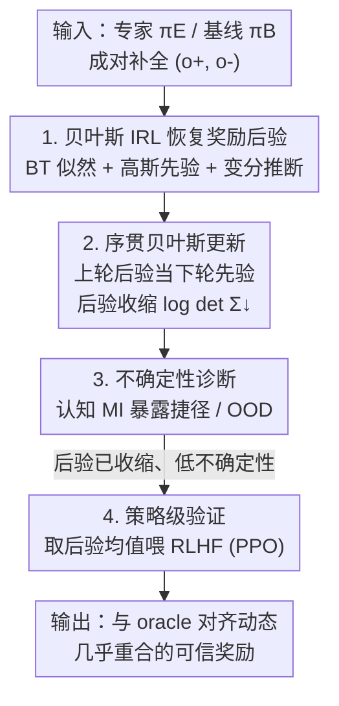

# The Alignment Auditor: A Bayesian Framework for Verifying and Refining LLM Objectives

**会议**: ICLR 2026  
**OpenReview**: [https://openreview.net/forum?id=CH7TfRLqSF](https://openreview.net/forum?id=CH7TfRLqSF)  
**代码**: https://github.com/ai4ai-lab/IRL-Alignment-Auditor  
**领域**: 对齐RLHF / LLM 安全审计  
**关键词**: 贝叶斯逆强化学习, 奖励推断, 非可辨识性, 不确定性量化, 对齐审计

## 一句话总结
把"逆强化学习恢复 LLM 隐式奖励"从一次性点估计，重构成一套贝叶斯审计流程——先用变分推断恢复奖励的**后验分布**而非单点，再用序贯贝叶斯更新让后验逐轮收缩、用认知不确定性诊断暴露捷径与分布外输入，最后把收缩后的低不确定性奖励直接喂回 RLHF，证明它能复现 oracle 奖励的对齐效果（毒性下降曲线几乎重合）。

## 研究背景与动机

**领域现状**：LLM 经过预训练、微调、RLHF 之后，真正在优化什么目标是隐式的、不透明的。逆强化学习（IRL）提供了一个自然视角：把 LLM 的输出当作行为示范，反推能解释这些行为的奖励函数，从而审计模型"到底想达成什么"。

**现有痛点**：现有 IRL 方法用于对齐审计有两个致命问题。其一，它们通常只返回**单个、可能过度自信的**奖励点估计；其二，它们忽视了任务本身的**非可辨识性（non-identifiability）**——同一份观测到的专家行为，可以被无数个不同的奖励函数同等地解释。没有原则性的不确定性量化，审计员根本无法判断"推断出来的目标"什么时候是脆弱的、不可信的，于是奖励推断很容易被虚假解释（spurious shortcut）带偏。

**核心矛盾**：审计需要的是"可信度判断"，而点估计 IRL 给的是"一个看似确定的答案"。把一个本质上多解、充满歧义的问题硬塞进一个确定性估计框架，等于把歧义藏起来而不是暴露出来——这正是审计最不能接受的。

**本文目标**：作者把奖励推断重新分解为三个子问题：(1) 如何让歧义显式化并系统性地减少它；(2) 如何判断推断出的目标在哪些输入上不可信；(3) 如何验证推断奖励不只是行为的被动描述，而是能真正驱动对齐的可用目标。

**切入角度**：贝叶斯 IRL 天生通过维护奖励函数上的**分布**来处理非可辨识性，但此前从未被用于 LLM，也一直停留在"推断后验"这一步，没人把它扩展成完整的验证流程。作者的观察是：后验的方差本身就是非可辨识性的度量，而后验可以通过序贯证据被主动"收紧"。

**核心 idea**：把奖励推断从"估计（estimation）"升级为"验证（verification）"——用贝叶斯 IRL 恢复奖励后验，用序贯更新让它收缩，用不确定性诊断给出可操作的可信度信号，最后用 RLHF 做策略级闭环验证。

## 方法详解

### 整体框架

作者把 LLM 与用户的交互建模为**单步 MDP（上下文 bandit）**：状态是 prompt $p$，动作是补全文本 $o$，奖励 $R_\theta(o)=\theta^\top\phi(o)$ 是定义在固定预训练编码器特征 $\phi(o)$ 上的线性函数。审计的核心目标是：通过观察专家策略 $\pi_E$（已对齐、低毒）与基线策略 $\pi_B$（未对齐）在同一批 prompt 上的成对补全 $(o^+, o^-)$，推断并验证专家的隐式奖励参数 $\theta_E$。

整个框架是一条三阶段串行流水线：**Stage 1** 用贝叶斯 IRL 把成对示范转成奖励的后验分布，让歧义显式化；**Stage 2** 把数据切成 $K$ 轮做序贯贝叶斯更新（上一轮后验当下一轮先验），让后验单调收缩，同时用认知/偶然不确定性分解做诊断，暴露捷径和分布外 prompt；**Stage 3** 取最终收缩后验的均值当奖励信号，直接喂进标准 RLHF（PPO）微调基线 LLM，对比它与用真 oracle 奖励训练时的训练动态，做策略级验证。其中 Stage 1–2 已是一个不需要重训的"轻量审计模式"，Stage 3 是可选的、提供更强行为证据的验证步。

### 关键设计

**1. 贝叶斯 IRL 恢复奖励后验：用分布代替点估计来显式化歧义**

针对"点估计藏起了非可辨识性"这个痛点，作者不再求单个 $\theta$，而是推断 $\theta$ 的**完整后验分布**。在成对数据集 $\mathcal{D}=\{(o_i^+, o_i^-)\}$ 上，定义特征边际 $\Delta\phi := \phi(o^+)-\phi(o^-)$，并搭起一个标准贝叶斯结构：先验用零均值各向同性高斯 $p(\theta)=\mathcal{N}(\theta\mid 0, \sigma_0^2 I)$（表示初始时不偏好任何特征）；似然用 Bradley–Terry 模型刻画专家偏好 $o^+\succ o^-$，

$$P(o^+ \succ o^- \mid \theta) = \sigma\big(\alpha\,\theta^\top \Delta\phi\big), \qquad p(\mathcal{D}\mid\theta) = \prod_{i=1}^{N} \sigma\big(\alpha\,\theta^\top \Delta\phi_i\big),$$

其中 $\alpha$ 是固定温度；后验由贝叶斯定理 $p(\theta\mid\mathcal{D})\propto p(\mathcal{D}\mid\theta)\,p(\theta)$ 给出。关键洞察是：**这个后验的体积（尤其是方差）直接量化了非可辨识性**——后验越宽，说明越多不同奖励函数都能解释同样的行为。由于高斯先验和 logistic 似然非共轭、后验解析不可解，作者用**变分推断**逼近：引入均场高斯变分族 $q_\lambda(\theta)=\mathcal{N}(\theta\mid\mu,\mathrm{diag}(\sigma^2))$，通过最大化 ELBO（重参数化技巧 + mini-batch）最小化 $\mathrm{KL}(q_\lambda\|p(\theta\mid\mathcal{D}))$：

$$\mathcal{L}(\lambda) = \mathbb{E}_{q_\lambda(\theta)}[\log p(\mathcal{D}\mid\theta)] - \mathrm{KL}\big(q_\lambda(\theta)\,\|\,p(\theta)\big).$$

**2. 序贯贝叶斯更新：用"后验当先验"链式收紧歧义**

光有一个后验还不够——它可能依旧很宽。作者用一个序贯贝叶斯更新方案**主动**减少歧义：把训练数据切成 $K$ 个不相交的轮次 $\mathcal{D}_1,\dots,\mathcal{D}_K$，在第 $k$ 轮里，**把上一轮的后验 $q_{k-1}(\theta)$ 当作本轮的先验**，用数据 $\mathcal{D}_k$ 推出新后验 $q_k(\theta)$。这正是贝叶斯信念随证据累积而更新的链式过程。核心审计指标是**后验收缩**，用协方差矩阵的对数行列式 $\log\det(\Sigma_k)$ 度量：该值跨轮单调下降，就是非可辨识性被实打实减少的具体证据；反过来，若后验在某轮**膨胀**，则直接标记出潜在的奖励冲突或误设（misspecification）。实验里 5 轮序贯更新把对数行列式协方差从 $-196$ 压到 $-897$，即便原始准确率相近，也说明流程是在改善可辨识性、而非单纯拟合数据。

**3. 不确定性诊断：分解认知不确定性以暴露捷径与 OOD**

有了奖励后验，第二个能力是给审计员**可操作的可信度信号**。作者把预测不确定性（偏好标签 $y$ 的熵）分解为偶然（aleatoric，数据本身的歧义）与认知（epistemic，奖励模型自身的不确定）两部分：

$$\underbrace{H[p(y\mid o,\mathcal{D})]}_{\text{总不确定性}} = \underbrace{\mathbb{E}_{q(\theta)}\big[H[p(y\mid o,\theta)]\big]}_{\text{偶然不确定性}} + \underbrace{I(\theta, y\mid o,\mathcal{D})}_{\text{认知不确定性 (互信息)}}.$$

高认知不确定性（互信息 MI）意味着奖励模型对这个输入没把握，从而标记出真正歧义或**分布外**的 prompt。作者据此做诊断探针：往 prompt 里注入虚假特征（无关关键词）。一个稳健的奖励模型应当在这种被"污染"的输入上表现出**升高的**认知不确定性；而一个学到了捷径的模型反而会虚假地变得过度自信——这恰好把捷径依赖暴露出来。实验中，被注入虚假特征的"marked" prompt 局部不确定性确实更高，且奖励方差与到训练分布的马氏距离呈极强正相关（$r=0.989$），证明模型"知道自己不知道"。

**4. 策略级验证：把推断奖励喂回 RLHF 做闭环检验**

最关键的检验是：推断出的奖励到底是不是行为的被动描述，还是真能驱动对齐的可用目标？作者取最终收缩后验（第 $K$ 轮）的均值 $\hat R(o)=\mu_K^\top\phi(o)$ 当奖励信号，用标准 PPO 微调原始基线 $\pi_B$，再把这个过程的训练动态与"用生成专家 $\pi_E$ 的真 oracle 奖励训练"的 ground-truth run 对比，看三个指标：奖励均值曲线是否单调上升并贴合 oracle 曲线、对策略与基线之间的 KL 散度是否稳定有界（说明学习受控、非剥削性）、留出高风险 prompt 上的毒性下降速率是否与 oracle 相当。只有当用推断奖励训练出的策略**复现**了用真奖励训练的行为，审计才算成功。一个尖锐的发现是：用第 1 轮（仍欠可辨识）的后验做 PPO 会诱发奖励 hacking，而第 2 轮及之后的收缩后验则不会——这反过来证明"先收缩后对齐"的必要性。

### 损失函数 / 训练策略

奖励头是冻结文本特征上的线性层，特征 $\phi(o)$ 取各 LLM embedding 空间的 mean-pool 隐状态并在训练池上标准化后固定。变分后验用 Adam（lr $1\text{e}{-2}$，batch 256）训 3k 步。序贯更新把成对数据均分成 5 轮，每轮用上轮后验当先验、同样训 3k 步。专家策略 $\pi_E$ 由 KL 正则化 PPO（目标-KL 控制、top-p/top-k 解码、20-token 短续写）在 RealToxicityPrompts 上对一个 RoBERTa 毒性分类器优化得到，其 KL 正则目标为 $J(\phi)=\mathbb{E}_{o\sim\pi_\phi}[R^\star(o)] - \beta\,\mathrm{KL}(\pi_\phi\|\pi_{\text{ref}})$。

## 实验关键数据

### 主实验

任务以 AllenAI **RealToxicityPrompts**（99k 条带 Perspective 分数）做去毒为主，额外在 Anthropic **HH-RLHF** helpfulness 上测泛化。模型覆盖 Pythia（70M/410M/1B）、SmolLM（135M/360M）、Llama-3.2-1B 与 Llama-3.1-8B。评测指标包括成对保真度（pairwise accuracy / AUROC / Brier / ECE）与单文本诊断（accuracy / F1 / AUROC）。

| 设置 | 模型 | 关键指标 | 结果 |
|--------|------|------|------|
| 去毒（主） | Llama-3.2-1B | 奖励分离效应量 Cohen's $d$ | 1.325 |
| 去毒（主） | Llama-3.1-8B | 奖励分离效应量 Cohen's $d$ | 1.821（随规模↑） |
| helpfulness | Llama-3.2-1B → 8B | pairwise accuracy | 0.725 → 0.729 |
| helpfulness | Llama-3.2-1B → 8B | single-text F1 | 0.630 → 0.645 |

主结论：奖励函数把有毒/无毒补全清晰分开，pairwise 与 single-text 的可靠性曲线都贴近对角线（校准良好），且**规模越大、特征越线性可分**，pairwise accuracy / AUROC / F1 与校准均随模型增大而改善（成对校准始终强于单文本校准，说明推断奖励对比较判断最可靠）。helpfulness 这个更细腻的任务上规模增益有限、ECE 不随规模改善。

### 消融实验

| 配置 | 关键指标 | 说明 |
|------|---------|------|
| 单轮推断 | $\log\det\Sigma \approx -196$ | 后验仍宽，欠可辨识 |
| 序贯 5 轮 | $\log\det\Sigma \approx -897$ | 后验体积大幅收缩，可辨识性显著提升 |
| 用第 1 轮后验做 PPO | 训练动态不稳 / 毒性更差 | 欠可辨识 → 诱发奖励 hacking |
| 用第 2–5 轮后验做 PPO | 毒性下降贴合 oracle | 收缩后才安全用于对齐 |

### 关键发现
- **后验收缩是核心机制**：5 轮序贯更新中 $\log\det(\Sigma_k)$ 单调下降、认知不确定性（MI）随数据增多而减少，同时 AUROC/pairwise accuracy 上升、Brier/ECE 下降——歧义减少与性能提升同步发生，且在 helpfulness（Llama-3.1-8B）上同样成立，说明不是去毒任务专属。
- **认知不确定性是真信号而非数值噪声**：奖励方差与马氏距离 $r=0.989$ 的强相关 + 跨轮单调收缩，共同支持把报告的认知不确定性解释为真正的奖励歧义。
- **"先收缩后对齐"不可省**：直接用欠识别的第 1 轮后验会奖励 hacking；序贯收缩后（rounds ≥2）的奖励才能让 RLHF 复现 oracle 的毒性下降曲线、不塌缩退化。

## 亮点与洞察
- **把"后验方差"直接当作"非可辨识性的度量"**：这是全文最优雅的一步——IRL 的老大难（多解）被转译成一个可监控、可优化的标量 $\log\det\Sigma$，让"减少歧义"变成可操作的工程目标，而不是哲学口号。
- **序贯"后验当先验"既是收紧手段也是冲突检测器**：后验膨胀直接报警奖励冲突/误设，等于免费送了一个一致性自检。
- **认知不确定性诊断把"捷径"变得可观测**：注入虚假特征看模型是变谨慎还是变过度自信，这套探针思路可迁移到任何基于后验的奖励/分类模型上做鲁棒性审计。
- **策略级闭环验证立了一个高标准**：不满足于"奖励能分类毒性"，而要求"用它训出的策略复现 oracle 的训练动态"，这把奖励推断从"看起来对"推进到"用起来对"。

## 局限与展望
- **线性奖励 + 冻结特征的容量天花板**：$R_\theta(o)=\theta^\top\phi(o)$ 依赖固定预训练编码器特征，小模型上出现"校准但无信息（calibrated but uninformative）"现象——概率可靠但排序能力弱，说明低容量下非可辨识性依旧顽固。
- **专家奖励即 ground truth 的循环性**：实验用毒性分类器既造专家 $\pi_E$ 又当 oracle 验证，审计对象的"真目标"是已知构造出来的；真实场景里没有 oracle，如何确认推断奖励"忠实"会更难。
- **规模偏小、单步 bandit 假设**：模型最大到 8B，且把交互建模成单步上下文 bandit，回避了多轮长程动态——对需要长程推理的对齐目标是否成立未验证。
- **改进方向**：把线性奖励换成可学非线性头、把诊断探针扩展到更系统的对抗性 OOD 套件、在没有 oracle 的真实部署模型上做端到端审计。

## 相关工作与启发
- **vs 点估计 IRL（Joselowitz et al. 2025 / Sun & van der Schaar 2025）**：他们把 IRL 当估计工具、止步于推断单个奖励，留下非可辨识性与实用验证两个空白；本文恢复后验、序贯收缩并做策略级验证，把估计升级为验证。
- **vs 既有贝叶斯 IRL（Ramachandran & Amir 2007 等）**：贝叶斯 IRL 早已用分布处理非可辨识性，但从未用于 LLM，也只停在后验推断；本文首次把它落到 LLM，并补上收缩 + 诊断 + 闭环验证。
- **vs Cai et al. 2025**：同样把对齐表述为贝叶斯 IRL 并用变分逼近恢复奖励后验，但他们的重心是推断**效率**；本文的贡献是更宽的**审计框架**，整合后验恢复、序贯不确定性减少与策略级验证。
- **vs LLM 不确定性量化（贝叶斯 prompt ensemble / LoRA ensemble 等）**：那些方法量化的是**输出预测或 prompt 参数**的不确定性；本文量化并验证的是**驱动行为的奖励函数**上的后验，把不确定性从"表层校准"推进到"目标级验证"。

## 评分
- 新颖性: ⭐⭐⭐⭐⭐ 首次把贝叶斯 IRL 用于 LLM，并把奖励推断从估计重构为含序贯收缩 + 不确定性诊断 + 策略级验证的完整审计范式。
- 实验充分度: ⭐⭐⭐⭐ 覆盖 7 个模型规模、两个任务（去毒 + helpfulness）、含收缩/诊断/闭环三类证据；但模型规模偏小、缺真实无 oracle 场景。
- 写作质量: ⭐⭐⭐⭐⭐ 三阶段结构清晰，公式与审计指标（$\log\det\Sigma$、MI 分解）交代到位，动机层层递进。
- 价值: ⭐⭐⭐⭐⭐ 给审计员/安全团队/监管者提供了"验证 LLM 真正在优化什么"的可操作工具箱，对可问责 AI 有直接意义。

<!-- RELATED:START -->

## 相关论文

- [\[ICLR 2026\] RE-PO: Robust Enhanced Policy Optimization as a General Framework for LLM Alignment](re-po_robust_enhanced_policy_optimization_as_a_general_framework_for_llm_alignme.md)
- [\[AAAI 2026\] Differentiated Directional Intervention: A Framework for Evading LLM Safety Alignment](../../AAAI2026/llm_alignment/differentiated_directional_intervention_a_framework_for_evading_llm_safety_align.md)
- [\[ICLR 2026\] Beyond RLHF and NLHF: Population-Proportional Alignment under an Axiomatic Framework](beyond_rlhf_and_nlhf_population-proportional_alignment_under_an_axiomatic_framew.md)
- [\[ICLR 2026\] Inverse Reinforcement Learning with Dynamic Reward Scaling for LLM Alignment](inverse_reinforcement_learning_with_dynamic_reward_scaling_for_llm_alignment.md)
- [\[ICLR 2026\] Beyond Pairwise: Empowering LLM Alignment With Ranked Choice Modeling](beyond_pairwise_empowering_llm_alignment_with_ranked_choice_modeling.md)

<!-- RELATED:END -->
