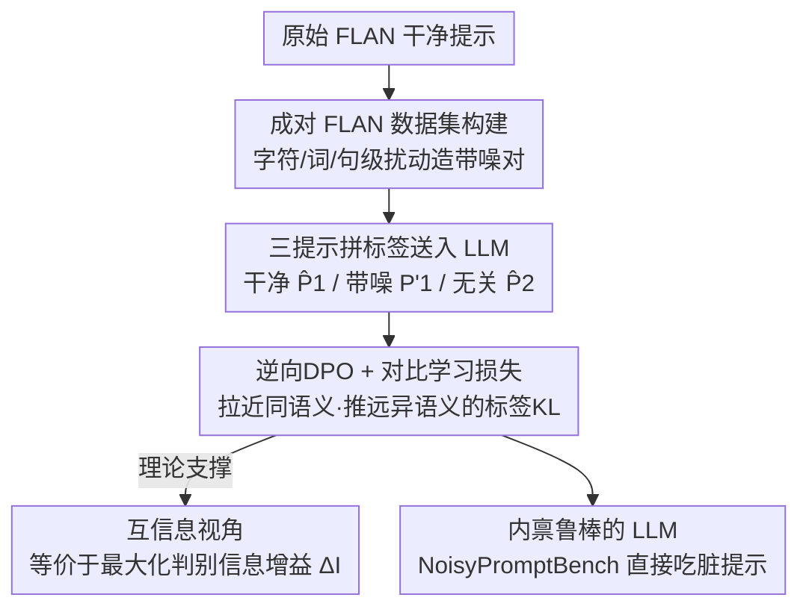

# Towards Self-Robust LLMs: Intrinsic Prompt Noise Resistance via CoIPO

**会议**: ICLR 2026  
**OpenReview**: [https://openreview.net/forum?id=TUd3c7Vr1z](https://openreview.net/forum?id=TUd3c7Vr1z)  
**代码**: https://github.com/vegetable-yx/CoIPO  
**领域**: 对齐RLHF / LLM鲁棒性  
**关键词**: 提示噪声鲁棒性, 逆向DPO, 对比学习, 偏好优化, 互信息

## 一句话总结
本文提出 CoIPO（对比学习 + 逆向 DPO），让 LLM 在脏提示（拼写错误、词替换、句式扰动）下输出与干净提示尽量一致，不依赖任何外部预处理工具就把内禀鲁棒性练进模型，在自建的 NoisyPromptBench 上比当前 SOTA（CoIN）平均准确率高 3.64%。

## 研究背景与动机
**领域现状**：LLM 对提示极其敏感，尤其在数学解题、代码生成、JSON/XML 严格格式输出这类"开放度受限"的场景下，提示里一点点扰动就能让效果断崖式下跌（图 1 显示 Llama2-7B 在 TextFolder 扰动下从 55.10% 掉到 37.66%，跌了 17.44%）。而真实用户的提示几乎从不"完美"——拼错单词（"clasify" 写成 "classify"）、用词偏差（医疗任务里把 "diagnosis" 说成 "investigation"）、加无关内容（在数学题后面附一句"有趣的是猫一生大部分时间在睡觉"）都会拖垮回答质量。

**现有痛点**：以往工作主要走"提示预处理与修复"路线——上语法检查器、术语归一化系统，或者再叫一个 LLM 来重写提示。这类外挂方案有三个硬伤：① 额外的计算开销、金钱成本和部署复杂度；② 多级流水线会**级联放大误差**，让最终输出偏离用户原意；③ 它们始终把模型当成需要被"喂干净输入"的对象，完全忽略了模型自身处理脏输入的潜力。此外，现有噪声评测集（如 PromptBench）大多只支持单步扰动，难以模拟真实场景。

**核心矛盾**：把鲁棒性"外包"给前置工具，等于承认模型本身不鲁棒——这既增加成本又引入新的不确定性。真正该做的是让模型**内禀地**对噪声免疫，而不是不断在输入端打补丁。

**本文目标**：在不引入任何外部组件、纯离线后训练的前提下，把"对提示扰动免疫"这件事直接练进模型参数里。

**切入角度**：作者注意到——对于语义等价的干净/脏提示对，模型理想情况下应当给出**几乎一样的标签预测分布**。于是把鲁棒性问题转化为一个分布对齐问题：拉近"脏提示在正确标签上的 logits"与"干净提示在同一标签上的 logits"，同时推远"无关任务提示"的 logits。

**核心 idea**：用"固定标签、比较不同提示"的逆向 DPO（Inverse DPO）配合对比学习，让模型学会"无论提示干净还是带噪，只要语义相同就给出相同的标签置信度"。

## 方法详解

### 整体框架
CoIPO 的输入是一个三元组——干净提示 $\hat P_1$、它的带噪版本 $P'_1$、以及一个来自不同任务的无关干净提示 $\hat P_2$，三者分别与同一个标签 $y_1$ 拼接后送入同一个 LLM，得到三组 logits（图 3 中的 Logits 1、Logits 1'、Logits 2）。训练目标是：以**脏提示**的标签 logits 为参照点，**最大化**它与同语义干净提示 $\hat P_1$ 的相似度（preferred），**最小化**它与异语义提示 $\hat P_2$ 的相似度（dispreferred）。相似度用标签 token 上的 KL 散度度量。整套流程纯离线后训练，推理时模型直接吃脏提示，不挂任何外部模块。

这套方法由三块支撑：先要有**成对训练数据**（怎么造干净-带噪提示对），再有**逆向 DPO + 对比学习的损失**（怎么把对齐约束写成可优化目标），最后有**互信息解释**（为什么这个损失等价于提升判别信息）。

### 关键设计

**1. 逆向 DPO：固定标签、比较不同提示**

标准 DPO 比较的是"同一个输入 $x$ 下不同输出"的对数概率差，按偏好信号优化模型。但鲁棒性问题里"输出（标签 $y$）"是确定的，要比的恰恰是"不同提示在同一标签上的条件概率"——也就是把 DPO 的输入输出角色对调，作者称之为 Inverse DPO（invDPO）。形式上定义比较函数 $D$，损失写为 $L_{\text{invDPO}} = -D(\hat P_2 \| P'_1, y_1) + D(\hat P_1 \| P'_1, y_1)$，其中 $\hat P_1$、$\hat P_2$ 是两个不同任务的干净提示，$P'_1$ 是 $\hat P_1$ 的带噪版本。直观含义是：让带噪提示 $P'_1$ 在标签上的表现**靠拢**同语义的 $\hat P_1$、**远离**异语义的 $\hat P_2$。这种"输入侧偏好"的设定是本文区别于常规偏好优化的根本一招。

**2. 对比学习实例化 D：标签 token 上的 KL 散度**

要把抽象的 $D$ 落地，作者用 logits 分布的相似度当作概率的代理。对输入序列 $S = P \oplus y$（提示拼标签），模型前向得到 logits $\ell_{1:T}(S) = g_\theta(S)$；再用一个掩码算子 $M_y(\cdot)$ **只保留标签 token 对应的 logits**、丢掉提示位置，得到每个标签 token 的条件分布 $p^{(P,y)}_t = \mathrm{softmax}(M_y(\ell_t(P\oplus y)))$。于是 $D$ 被实例化为序列级 KL 散度 $D(P\|P_{\text{ref}}, y) = \sum_{t\in T_y} \mathrm{KL}(p^{(P_{\text{ref}},y)}_t \| p^{(P,y)}_t)$。最终损失把"参照点设为脏提示 $P'_1$"这件事写死：

$$L = -\sum_{t\in T_{y_1}} \mathrm{KL}\big(p^{(P'_1,y_1)}_t \,\|\, p^{(\hat P_2,y_1)}_t\big) + \sum_{t\in T_{y_1}} \mathrm{KL}\big(p^{(P'_1,y_1)}_t \,\|\, p^{(\hat P_1,y_1)}_t\big)$$

第二项缩小脏提示与同语义干净提示的标签分布差距（要小），第一项放大脏提示与异语义提示的差距（要大）。最小化 $L$ 就同时实现了"对齐同语义、排斥异语义"的对比效果——这正是鲁棒性想要的：脏提示和它该等价的干净提示在标签预测上不可区分。

**3. 互信息解释：最小化损失 = 最大化判别信息增益**

作者进一步从互信息角度论证为什么这个损失有效，而不只是工程拼凑。把脏提示 $P'_1$ 当参照，定义相对互信息增益 $\Delta I = I(Y;\hat P_1 \mid P'_1) - I(Y;\hat P_2 \mid P'_1)$，衡量"正确干净提示比错误提示多提供了多少关于标签 $Y$ 的判别信息"。展开条件互信息后化简为条件熵之差 $\Delta I = H(Y\mid \hat P_2, P'_1) - H(Y\mid \hat P_1, P'_1)$。由于真实分布未知，用模型在脏提示下的输出分布 $q(y) = p_\theta(y\mid P'_1)$ 作经验参照，最终把经验互信息差写成两个 KL 之差 $\Delta\tilde I_q = \mathrm{KL}(q\|p_\theta(\cdot\mid\hat P_2)) - \mathrm{KL}(q\|p_\theta(\cdot\mid\hat P_1))$，代入逐 token 分布后恰好得到 $L_{\text{CoIPO}} = -\Delta\tilde I_q$。也就是说，**最小化 CoIPO 损失严格等价于最大化相对互信息增益**——模型被引导从正确提示中提取更多判别信息、同时减少与错误提示共享的信息，且这一切都在"脏输入"语境下进行。这给方法提供了信息论层面的原理性支撑。

### 损失函数 / 训练策略
训练数据基于 FLAN，选 25 个答案确定的子集，每条先从预定义的规范指令模板里随机抽一个生成干净提示，再随机施加字符级/词级/句级扰动得到带噪提示，构成干净-带噪对（扰动类型随机选以增强泛化）。模型用 Alpaca（LLaMA-7B 指令微调版）和 Qwen2.5-7B，学习率 $1\times10^{-4}$，batch size 64，最大序列长度 256，A100 上训练。

## 实验关键数据

### 主实验
在自建的 NoisyPromptBench（由 PromptBench 增强而来，选 5 个数据集 × 4 类扰动 DeepWordBug/TextFolder/CheckList/StressTest，覆盖字符/词/句三级，且对每类扰动多次随机采样模拟真实强度随机性）上对比 Base、SFT、CoIN、CoIPO。Acc 为准确率，Diff 为相对干净提示的掉点。

| 模型 | 方法 | Clean Acc | 扰动后平均 Acc | 平均掉点 Diff |
|------|------|-----------|----------------|---------------|
| Llama | Base | 55.10 | 46.64 | 10.58 |
| Llama | SFT | 57.28 | 54.72 | 3.20 |
| Llama | CoIN | 61.87 | 58.60 | 4.08 |
| Llama | **CoIPO** | **67.00** | **63.90** | 3.88 |
| Qwen | Base | 75.25 | 72.24 | 3.76 |
| Qwen | SFT | 77.94 | 76.85 | 1.36 |
| Qwen | CoIN | 82.93 | 81.48 | 1.81 |
| Qwen | **CoIPO** | **83.88** | **83.45** | **0.54** |

Llama 上 CoIPO 平均准确率超 CoIN 5.3%、超 SFT 9.18%、超 Base 17.26%；Qwen 上超 CoIN 1.97%、超 SFT 6.6%、超 Base 11.21%。Qwen 的掉点率仅 0.54%，是所有方法里最低。论文摘要给出的整体提升口径是"全噪声类型平均准确率 +3.64%，TextFolder 场景最高 +4.18%"。

### 消融实验
方法由 inverse DPO 和对比学习两部分组成，分别拆出 CL（只对比学习）、InvDPO（只逆向 DPO）与完整 CoIPO 对比（Avg 列为四种扰动平均）。

| 模型 | 配置 | Clean Acc | 扰动后平均 Acc | 平均掉点 Diff |
|------|------|-----------|----------------|---------------|
| Llama | SFT | 57.28 | 54.72 | 3.20 |
| Llama | CL | 61.87 | 58.60 | 4.08 |
| Llama | InvDPO | 65.89 | 62.72 | 3.97 |
| Llama | **CoIPO** | **67.00** | **63.90** | 3.88 |
| Qwen | SFT | 77.94 | 76.85 | 1.36 |
| Qwen | CL | 82.93 | 81.48 | 1.81 |
| Qwen | InvDPO | 83.31 | 82.86 | 0.56 |
| Qwen | **CoIPO** | **83.88** | **83.45** | **0.54** |

### 关键发现
- **两个组件缺一不可，但 InvDPO 是主力**：单独 CL 或单独 InvDPO 都打不过完整 CoIPO，但都明显强于 SFT 基线；其中 InvDPO 单独贡献已经很大（Llama 62.72% vs CL 58.60%），说明"固定标签比较不同提示"的偏好建模是核心，对比项再补一刀拉开异语义提示。
- **既高又稳**：CoIPO 不只在干净提示上准确率最高，扰动后掉点也维持在很小范围（Qwen 仅 0.54%）。SFT 虽然掉点也小（Llama 3.20%），但因其干净准确率本就低，整体鲁棒性有限——掉点小不等于强，要看绝对水平。
- **解码半径更大**：作者定义扰动半径 $r$（对干净提示的字符编辑数）和解码半径 $R(a)=\sup\{r: \mathrm{Acc}(r)\ge a\}$。图 5 在 MNLI 上显示，给定目标准确率 $a$，CoIPO 的 $R(a)$ 明显大于 Base，即能扛更多编辑才掉到同一水平。
- **跨规模有效**：在 Qwen2.5 的 7B/14B/72B 上 CoIPO 都稳定领先，且整体符合"模型越大越好"的 scaling 趋势。

## 亮点与洞察
- **把 DPO 的输入输出角色对调**是最巧的一笔：常规偏好优化比"同输入不同输出"，本文比"同输出不同输入"，恰好把"提示扰动鲁棒性"自然写成偏好信号，无需额外奖励模型或人工偏好标注——偏好天然由"同语义 vs 异语义"给定。
- **鲁棒性从输入端搬到参数里**：不靠任何前置语法检查/重写工具，纯离线后训练就让模型内禀免疫，省成本、无级联误差、可独立部署，思路上从"修输入"转向"修模型"。
- **损失有信息论闭环**：$L_{\text{CoIPO}} = -\Delta\tilde I_q$ 这个等式让"最小化对比损失"严格等价于"最大化判别信息增益"，不是事后凑的解释，可迁移到其他"希望某类输入扰动不改变输出分布"的任务（如代码注释改写、口语化指令）。
- **只在标签 token 上算 KL** 而非整段输出，把对齐约束聚焦到真正影响答案的位置，避免被提示本身的措辞差异干扰。

## 局限与展望
- **任务范围偏窄**：实验集中在分类/NLI 类"答案确定"的 FLAN 子集（MNLI/MRPC/QNLI/QQP/SST2），标签是离散短序列，KL 对齐天然好用；对开放式生成（长文本、代码、推理链）这套"标签 token KL"是否还成立、怎么定义"标签"，论文未充分验证。
- **需要成对数据 + 异语义负例**：训练必须构造干净-带噪对并采样无关任务提示，数据工程有成本；负例 $\hat P_2$ 的选择策略（随机抽取 vs 难负例挖掘）对效果的影响没深入讨论。
- **扰动半径用字符编辑数定义**偏粗糙，句级语义扰动（CheckList/StressTest）未必能用字符编辑数很好刻画，解码半径分析主要在 MNLI 单数据集上给出。
- **改进思路**：把 invDPO 推广到生成式任务（用序列级一致性而非标签 token KL）、引入难负例提升判别边界、或在线生成扰动对做课程式训练。

## 相关工作与启发
- **vs 提示预处理（语法检查器 / LLM 重写 / BAT / RoP / PromptAgent）**: 它们在**输入端**外挂工具检测修复脏提示，本文把鲁棒性**内化进参数**，省去外部组件、避免流水线级联误差、推理零额外延迟；代价是需要离线后训练且改了模型权重。
- **vs CoIN（当前内禀鲁棒 SOTA）**: 同样走"提升模型自身鲁棒"路线，但 CoIPO 用逆向 DPO + 对比学习的标签 KL 对齐，并配互信息理论解释，平均准确率在两个模型族上分别超 CoIN 5.3%（Llama）和 1.97%（Qwen）。
- **vs 标准 DPO**: 标准 DPO 优化"同输入下不同输出"的偏好；CoIPO 反过来固定输出标签、比较不同提示，是把偏好优化框架迁到"输入鲁棒性"问题上的一次角色互换。

## 评分
- 新颖性: ⭐⭐⭐⭐ 逆向 DPO 这一"固定输出比输入"的视角转换简洁有效，且配上互信息闭环论证。
- 实验充分度: ⭐⭐⭐⭐ 两模型族 × 4 扰动 × 5 数据集 + 消融 + 7B/14B/72B scaling，但局限于分类类任务。
- 写作质量: ⭐⭐⭐⭐ 动机清晰、理论推导完整，图 3 框架直观。
- 价值: ⭐⭐⭐⭐ 提供了不依赖外部工具的内禀鲁棒方案 + NoisyPromptBench 基准 + 成对 FLAN 数据，工程可落地。

<!-- RELATED:START -->

## 相关论文

- [\[ACL 2026\] Team-Based Self-Play With Dual Adaptive Weighting for Fine-Tuning LLMs](../../ACL2026/llm_alignment/team-based_self-play_with_dual_adaptive_weighting_for_fine-tuning_llms.md)
- [\[ICLR 2026\] Robust Reward Modeling via Causal Rubrics](robust_reward_modeling_via_causal_rubrics.md)
- [\[ICLR 2026\] Robust Preference Alignment via Directional Neighborhood Consensus](robust_preference_alignment_via_directional_neighborhood_consensus.md)
- [\[ICLR 2026\] JULI: Jailbreak Large Language Models by Self-Introspection](juli_jailbreak_large_language_models_by_self-introspection.md)
- [\[ICLR 2026\] Obscure but Effective: Classical Chinese Jailbreak Prompt Optimization via Bio-Inspired Search](obscure_but_effective_classical_chinese_jailbreak_prompt_optimization_via_bio-in.md)

<!-- RELATED:END -->
