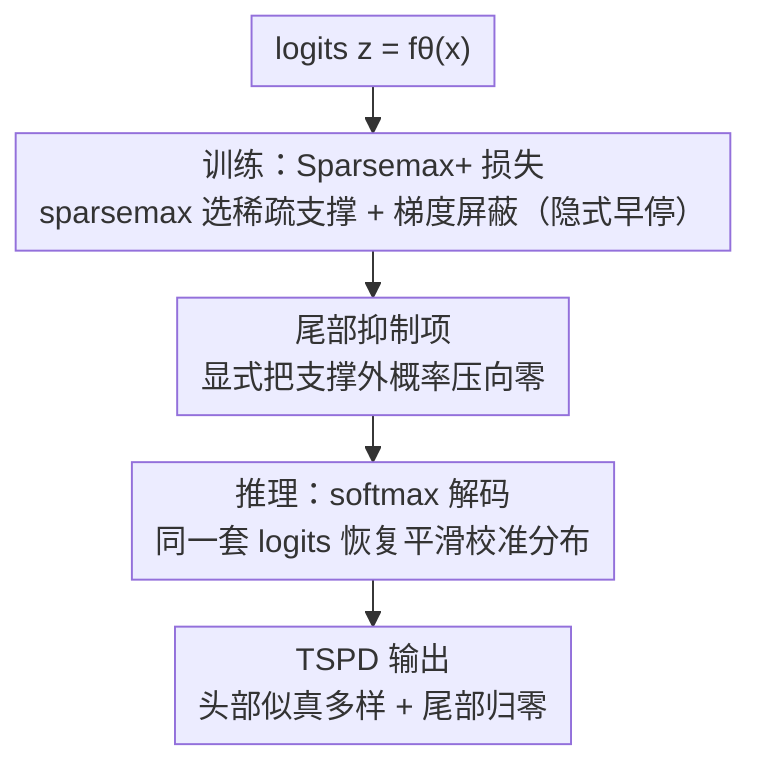

# TS²：训练用 Sparsemax+、测试用 Softmax，让 LLM 微调既准又多样

**会议**: ICLR 2026  
**OpenReview**: [https://openreview.net/forum?id=CylRqa82Rk](https://openreview.net/forum?id=CylRqa82Rk)  
**代码**: https://github.com/xzy-bit/TS-2-ICLR-2026  
**领域**: 对齐RLHF / LLM微调  
**关键词**: 监督微调, 输出多样性, Sparsemax, Fenchel-Young 损失, 对齐税

## 一句话总结
针对交叉熵（CE）监督微调把概率挤成 one-hot、压垮输出多样性的问题，本文提出 TS²：训练时用带尾部抑制项的 Sparsemax+ 损失（稀疏支撑 + 显式压尾），推理时换回 softmax 解码，从而在不改模型结构的前提下同时提升 Llama-3.1-8B / Qwen-2.5-7B 在聊天、代码、开放生成上的准确率与多样性。

## 研究背景与动机

**领域现状**：大模型后训练的标准做法是监督微调（SFT），损失函数默认用交叉熵（CE）。CE 对应最大似然、是严格正确的打分规则，理论上最优；但同样的几何性质会把概率质量一路推向 one-hot 的标注 token，把所有"合理但非标注"的候选 token 压到接近零。

**现有痛点**：微调后的模型会出现"对齐税"（alignment tax）——预训练模型本来对同一个 prompt 能给出多个语义合理的回答，SFT 之后却变得高度确定、千篇一律。这对依赖采样探索的生成任务（写作、规划、代码生成的 best-of-N）是致命伤：模型其实"会"，但分布塌缩后采不出正确的备选答案。

**核心矛盾**：提升多样性和"保持概率校准、把尾部管住"之间存在张力。只改解码（nucleus / top-k / best-of-N）不碰训练动态；改训练信号的代表 GEM 把 SFT 重写成反向 KL + 熵正则，能保留一些多样性，却**不能保证把明显错误的 token 压到零**——熵正则反而会给长尾错误 token 灌进概率。

**本文目标**：作者认为领域缺一个对"有用的多样性"的精确操作性定义。我们想要的不是把概率均匀撒满整个词表，而是**让概率集中在少数语义合理的候选 token 上，同时把明显错误的长尾 token 狠狠压向零**。

**切入角度**：从"logits→概率"映射函数的几何性质入手——前向 KL 是 mean-seeking（哪里有数据支撑就给概率，容易抬高低概率 token），反向 KL 是 mode-seeking（把质量集中到有希望的区域）。Sparsemax 这个映射天生能把非支撑 token 赋成**精确的零**，且在目标 token 落在支撑集内时，支撑集外的梯度直接消失（Lemma 3），等于自带"早停"。

**核心 idea**：把训练和推理的映射函数解耦——训练用 sparsemax（配一个改良的 Fenchel-Young 损失）做稀疏判别 + 尾部抑制，推理换回 softmax 恢复平滑校准的分布，让"似真候选"在采样时存活下来。

## 方法详解

### 整体框架

TS² 要解决的事很具体：让 SFT 后的模型在"把答案学准"的同时，别把所有备选 token 压成 one-hot。它的整体转换链路是一条"训练—推理用不同映射"的流水线：同一套 logits $z=f_\theta(x)$，**训练阶段**送进 Sparsemax+ 损失——sparsemax 投影自动挑出一个紧凑的似真候选支撑集 $S^{sp}(z)$、并把支撑集外的梯度屏蔽掉（隐式早停），再叠加一个尾部抑制项把残留在尾部的概率显式压向零；**推理阶段**对同一套 logits 改用 softmax 解码，恢复出平滑、校准、非退化的分布，让头部那几个似真候选保留可观概率、尾部接近零。最终输出满足作者定义的"尾部抑制的似真多样性"（TSPD）：头部多样、尾部归零。

### 关键设计

**1. TSPD：把"有用的多样性"形式化为头部保留 + 尾部抑制**

直接对着痛点——"什么才算有用的多样性"——给一个可验证的定义。作者提出 **Tail-Suppressed Plausible Diversity（TSPD）**：给定 prompt-response 对 $(x,y)$ 和分布 $p=g(f_\theta(x))$，固定整数 $m\ge 2$ 和阈值 $0<\varepsilon_{head}\le \frac1m$、$0\le\varepsilon_{tail}\le 1-m\varepsilon_{head}$。取 $\mathrm{Top}_m(p)$；若标注 $y$ 在其中则支撑集 $S:=\mathrm{Top}_m(p)$，否则 $S:=\mathrm{Top}_{m-1}(p)\cup\{y\}$。$p$ 满足 $m$ 阶 TSPD 当且仅当**头部保留** $\min_{j\in S}p_j\ge\varepsilon_{head}$ 且**尾部抑制** $\sum_{j\notin S}p_j\le\varepsilon_{tail}$。

这个定义的价值在于把模糊的"多样性"变成两条硬约束：支撑集内每个候选都得有不可忽略的概率（别只剩一个赢家），支撑集外的 token 加起来概率得趋零（别把概率撒给明显错误的长尾）。推论里点明：一旦 $p$ 塌缩成 one-hot（$p_y=1$），就**直接不满足** TSPD——等于把 CE 的塌缩定性为"失败"，给后面的方法指明优化方向。

**2. 训练/推理映射解耦：sparsemax 训练 + softmax 解码**

这是 TS² 的结构性创新，针对"训练动态和推理需求其实需求不同"这一点。作者用统一的 **Fenchel-Young 损失** $L_\Pi(z;y)=\Pi(e_y)-\Pi(p^*)+\langle z,p^*-e_y\rangle$ 把 softmax 和 sparsemax 统一起来：取负 Shannon 熵正则就退化成 softmax + CE，取负 Gini 熵正则就得到 sparsemax 损失。

训练为什么选 sparsemax？因为它对同一套 logits **线性地拉开候选间的概率间隔**（Theorem 4：支撑集内 $\frac{\partial}{\partial u}(p^{sp}_i-p^{sp}_j)=1$，而 softmax 严格 $<1$），一旦头部 logit 越过 margin 就快速收敛、支撑外梯度归零，相当于自带早停、不在已分开的尾部候选上浪费更新。但 sparsemax **不能用于推理**——收敛后它本身也会输出近似 one-hot，多样性照样没了。所以推理换回 softmax：对同一套被训练拉开的 logits，softmax 恢复出平滑校准的概率，让头部似真候选都拿到非退化的质量，采样时无需激进调温度就能探索它们。一句话：训练阶段负责"分离 + 剪枝"，推理阶段负责"保留 + 多样化"。

**3. Sparsemax+ 损失：补一个尾部抑制项，把 softmax 推理的长尾摁死**

解耦留了个理论漏洞：Corollary 5 / Remark 2 证明，当词表 $K$ 很大时，softmax 推理时支撑集外累积的尾部质量 $\sum_{k>m}p^{sf}_{(k)}$ 的上界会随 $K$ 单调增大、趋近 1——也就是说光靠 sparsemax 训练**理论上不保证**尾部被压住，这和 TSPD 的尾部抑制目标矛盾。

为补这个洞，作者在 sparsemax 损失上加一个轻量的**尾部抑制损失**：$L_{sup}(p;y)=-\log\!\big(1-\sum_{i\notin S}p^{sf}_i\big)$，其中 $p^{sf}=\mathrm{softmax}(z)$。它显式地把支撑集外 token 的概率推向零。一个漂亮的解释（Remark 3）：它等价于 $-\log\sum_{i\in S}p^{sf}_i$，正是把支撑集 $S$ 当作一个"超类"的 softmax 交叉熵；当 $S=\{y\}$ 退化为单例时它就还原成普通 CE。合起来就是 **Sparsemax+ 损失**：

$$L_{spm+}(z;y)=-z_y+\frac12\!\sum_{j\in S^{sp}(z)}\!\big(z_j^2-\tau^2(z)\big)+\alpha\Big(\!-\log\big(1-\!\!\sum_{i\notin S^{sp}(z),\,i\ne y}\!\!p^{sf}_i\big)\Big)$$

其中 $\tau(z)$ 是 sparsemax 阈值，$\alpha>0$ 控制压尾强度，实现上直接用 sparsemax 支撑集 $S^{sp}(z)$ 当作 $S$ 效果最好。两项分工明确：sparsemax 项选出稳定支撑集 + 早停梯度，抑制项把不合理 token 显式归零，防止推理时冒出虚假概率。

### 损失函数 / 训练策略
训练目标即上面的 $L_{spm+}$；训练时按 mini-batch 计算 Sparsemax+ 损失并更新 $\theta$，测试时对 logits 取 softmax 后解码（Algorithm 1）。实验中 Llama-3.1-8B / Qwen-2-7B 在 UltraFeedback 上微调 3 epoch，AdamW、有效 batch size 128、cosine 学习率（初始 $2\times10^{-5}$、warmup 0.03）、最大序列长 2048；压尾权重 $\alpha$ 按模型经验调到最优。

## 实验关键数据

### 主实验

AlpacaEval 上用 best-of-32 协议测胜率（reward model 选最优回答再对比 GPT-4），同时报三个多样性指标。TS² 在质量和多样性上全面领先：

| 模型 | 方法 | Win Rate (%) ↑ | N-gram ↑ | 100−Self-BLEU ↑ | Sent-BERT ↑ |
|------|------|------|------|------|------|
| LLaMA-3.1-8B | CE | 29.77 | 17.78 | 47.04 | 9.97 |
| LLaMA-3.1-8B | GEM | 31.53 | 20.32 | 49.82 | 11.16 |
| LLaMA-3.1-8B | **TS² (本文)** | **33.12** | **23.78** | **53.87** | **12.80** |
| Qwen-2-7B | CE | 31.41 | 17.23 | 16.77 | 7.95 |
| Qwen-2-7B | GEM | 33.89 | 24.35 | 31.19 | 9.25 |
| Qwen-2-7B | **TS² (本文)** | **37.48** | **30.15** | **39.04** | **9.81** |

- 聊天（Llama，N=32）胜率 33.12%，相对 CE +11.2%、相对 GEM +5.0%；同时 N-gram / BLEU / Sent-BERT 多样性相对 GEM 分别 +17.0% / +8.1% / +10.7%——确认"质量-多样性 trade-off"被打破。
- 代码生成（HumanEval）pass@100 达 87.00%，相对 GEM +4.3%、相对 CE +19.8%；尤其 pass@50（82.70%）几乎追平 GEM 的 pass@100（83.40%），说明同样的正确率用更少采样就能拿到（采样效率更高）。
- OpenLLM Leaderboard 六任务用 best-of-N 协议：Llama 上 N=32 平均准确率 88.88%，比 GEM（75.69%）绝对高 13.2 个点（相对 +17.4%），说明预训练知识被更好地保留。

### 消融实验

TS² 由三件套组成：(1) sparsemax 训练、(2) softmax 解码、(3) 尾部抑制项。在 AlpacaEval 上拆开看：

| 配置 | 现象 | 说明 |
|------|------|------|
| Full TS² | 胜率 + 多样性都最好 | 三者协同 |
| Decoupling Only（sparsemax 训 + softmax 推、无压尾） | 多样性暴涨但胜率灾难性下跌 | 解耦放出多样性，但没压尾就是没校准的噪声 |
| Unified Sparsemax（训练推理都 sparsemax） | 胜率有竞争力但多样性明显偏低 | 证明推理换 softmax 才能把 logit 几何翻译成可采样的丰富分布 |
| Suppression Only（CE + 压尾项） | 两个指标都失败 | 压尾不是独立改进，必须和 sparsemax 支撑集协同 |

### 关键发现
- 三个组件缺一不可且互相依赖：解耦负责"放出多样性"，压尾负责"保证多样性是高质量而非噪声"，softmax 推理负责"把训练学到的 logit 几何变成可采样分布"。
- 最大贡献来自"解耦 + 压尾"的协同：单独解耦会牺牲胜率，单独压尾（在 CE 上）两头不讨好，只有配上 sparsemax 定义的支撑集才生效。
- 在依赖采样探索的场景（best-of-N 聊天、pass@k 代码、多路推理保留）TS² 优势随采样预算 N 放大——这正是"保留多样性"的价值兑现点。

## 亮点与洞察
- **训练/推理用不同映射函数**是很轻巧的解耦视角：不动模型结构、不改解码器接口，只换损失和最后一层的概率映射，就能 drop-in 进现有 SFT 管线，和 nucleus / top-k / best-of-N 完全兼容。
- 把 sparsemax 的"梯度屏蔽"重新诠释为**隐式早停**——在已经分开的尾部候选上不再浪费更新——这个角度比"加正则"更本质，解释了为什么它能避免 CE 式的过度自信塌缩。
- TSPD 定义 + 理论上界（尾部质量随词表 $K$ 趋 1）形成一个完整的"提出问题—证明 sparsemax 不够—补抑制项"的闭环论证，把"为什么需要第三个组件"讲得有理有据，而不是凑出来的。
- 尾部抑制损失等价于"超类 softmax CE"这个 Remark 很可迁移：任何想"把概率集中到一组候选而非单个标签"的场景（多正确答案、集合预测）都能借用。

## 局限与展望
- 解耦带来训练/推理分布不一致（train sparsemax、test softmax），理论保证依赖 Corollary 5 那套 logit margin 假设；在真实长序列自回归下这些假设成立到什么程度，文中以定理+经验佐证为主。
- 压尾权重 $\alpha$ 需按模型逐个经验调优（Llama / Qwen 各报最优值），缺一个自适应或免调的方案；$\alpha$ 过大可能反而压垮头部多样性，敏感性细节未充分展开。
- 评测大量依赖 best-of-N / pass@k 这类"采样预算放大"协议，对单次贪心解码场景的收益相对没那么突出——优势主要兑现在采样型应用。
- 只在 8B/7B 规模、UltraFeedback 单一 SFT 数据上验证，更大模型、偏好对齐（DPO/RLHF）阶段是否仍有效待考。

## 相关工作与启发
- **vs GEM**：GEM 把 SFT 重写成反向 KL + 熵正则来保留多样性，但只"促进铺开"、不强制把不合理 token 压到精确零；TS² 用 sparsemax 保证"铺开发生在该铺开的地方"、再用抑制项提供"硬归零"，因此在质量和多样性两端都超过 GEM。
- **vs 纯解码方法（nucleus / top-k / best-of-N）**：这些只改采样、不碰训练动态和校准；TS² 直接重塑训练阶段的 logit 几何，且与这些解码器正交兼容。
- **vs CE / CE+WD / NEFTune**：CE 把分布推成 one-hot 牺牲多样性，CE+WD、NEFTune 靠正则/加噪缓解过拟合但收效有限；TS² 从"映射函数几何"层面治本，消融中"CE+压尾"两头不讨好恰好反衬出 sparsemax 支撑集的不可替代。

## 评分
- 新颖性: ⭐⭐⭐⭐⭐ "训练/推理用不同概率映射"的解耦视角 + Fenchel-Young 统一框架 + TSPD 形式化，角度清新且自洽
- 实验充分度: ⭐⭐⭐⭐ 两模型、聊天/代码/创意写作/OpenLLM 多任务覆盖且消融到位，但规模和数据集偏单一
- 写作质量: ⭐⭐⭐⭐⭐ 从问题形式化到理论缺口再到补丁，论证链条完整清晰
- 价值: ⭐⭐⭐⭐ drop-in、可兼容现有解码器，对采样型生成应用直接有用，但收益场景偏向 best-of-N

<!-- RELATED:START -->

## 相关论文

- [\[ICLR 2026\] Capability-Based Scaling Trends for LLM-Based Red-Teaming](capability-based_scaling_trends_for_llm-based_red-teaming.md)
- [\[ICLR 2026\] The Alignment Auditor: A Bayesian Framework for Verifying and Refining LLM Objectives](the_alignment_auditor_a_bayesian_framework_for_verifying_and_refining_llm_object.md)
- [\[ICLR 2026\] Evaluating and Improving Cultural Awareness of Reward Models for LLM Alignment](evaluating_and_improving_cultural_awareness_of_reward_models_for_llm_alignment.md)
- [\[ICLR 2026\] Beyond Pairwise: Empowering LLM Alignment With Ranked Choice Modeling](beyond_pairwise_empowering_llm_alignment_with_ranked_choice_modeling.md)
- [\[ICLR 2026\] Inverse Reinforcement Learning with Dynamic Reward Scaling for LLM Alignment](inverse_reinforcement_learning_with_dynamic_reward_scaling_for_llm_alignment.md)

<!-- RELATED:END -->
