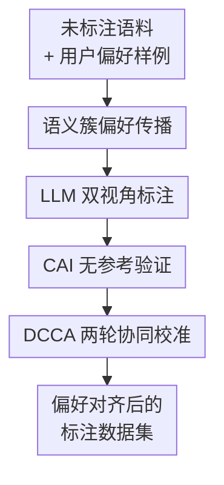

# Verification and Co-Alignment via Heterogeneous Consistency for Preference-Aligned LLM Annotations

**会议**: ICLR 2026  
**OpenReview**: [https://openreview.net/forum?id=jugY302BAh](https://openreview.net/forum?id=jugY302BAh)  
**代码**: https://github.com/858006908cc/VERIFICATION-AND-CO-ALIGNMENT-ICLR26  
**领域**: LLM 对齐 / 偏好标注 / 无参考评估  
**关键词**: 异构一致性、偏好对齐标注、CAI Ratio、半监督 NLU、训练无关校准  

## 一句话总结
本文提出 Heterogeneous-Consistency Co-Alignment (HCC)，用 LLM 与任务专用 embedding 模型之间的一致/不一致关系，在无 ground truth 的半监督 NLU 标注场景中验证 LLM 标注可靠性，并通过两轮基于近邻投票的协同校准修正偏好不一致样本。

## 研究背景与动机
**领域现状**：LLM 已经越来越多地被用作数据标注器，尤其是在意图分类、主题分类、情感识别、关系分类这类 categorical NLU 任务中。相比人工标注，LLM 可以快速给大规模未标注语料打标签；相比训练一个新模型，prompt 或 few-shot 标注又更轻量。另一方面，真实应用里的“正确标签”常常不只是客观事实，还包含用户、地区、文化和任务方的偏好，例如东南亚本地表达、个人推荐偏好、家庭机器人操作习惯或医疗问答里的个体化约束。

**现有痛点**：SFT 和 RLHF 可以把偏好写进模型，但它们通常需要大量高质量偏好数据。个性化 RLHF 虽然试图适配不同用户，也仍然依赖大规模、多样化偏好语料和额外训练。直接让 LLM 标注则更便宜，却有两个风险：第一，LLM 可能根据预训练里的群体统计给出“看似合理但不符合该用户偏好”的标签；第二，LLM 自评或置信度常常过度自信，在没有参考答案时很难知道哪些标注需要修正。

**核心矛盾**：本文处理的是低资源偏好标注里的两难：用户只愿意或只能提供很小一批偏好样例，但系统又需要把偏好传播到大规模未标注语料；同时，真实标签不可见，传统 accuracy、F1、precision/recall 都无法在标注阶段直接使用。单靠 embedding 相似度会把“几何上接近”误当成“偏好上正确”，单靠 LLM 又会把自身输出当成可信判断，二者各自都有盲区。

**本文目标**：作者把问题拆成两个子问题：一是如何在 reference-free 条件下判断 LLM 生成标签是否可靠；二是如何用少量用户偏好样例，对不可靠的 LLM 标注做低成本、训练无关的修正。这里的目标不是训练一个全局 reward model，而是面向具体用户或具体任务，把未标注语料重新校准到该偏好集合上。

**切入角度**：HCC 的关键观察是，LLM 和轻量任务模型犯错机制不同。LLM 的标签来自 token-level 生成概率，擅长利用语言知识但可能过度自信；MiniLM/BERT 这类任务专用模型通过 embedding 空间近邻传播标签，计算便宜但可能受语义簇质量限制。若两者在同一样本上给出同一标签，这个样本更可能可靠；若两者冲突，它就应该进入待修正集合。

**核心 idea**：用“异构模型是否一致”替代 ground truth 作为无参考可靠性信号，再用一致样本和少量用户偏好样例作为锚点，通过 embedding 近邻多数投票逐步修正不一致标注。

## 方法详解
### 整体框架
HCC 输入一个未标注语料 $D_u$ 和少量用户偏好样例 $H$，输出一个经过偏好校准的标注数据集 $D^{final}$。它先让任务专用模型 $S$ 通过 embedding 近邻给每个样本分配伪标签，再让 LLM $T$ 在 zero-shot 和带 $S$ 伪标签提示的 single-shot 设置下生成标签；随后用异构模型之间的标签一致性切分 consistent set $C$ 与 inconsistent set $I$，并只对 $I$ 做协同校准。

整个流程最像一个“先验分歧检测 + 局部重标注”系统：一致样本被当作可靠锚点，不一致样本被视作高风险区域；修正时不重新训练 LLM，也不训练 reward model，而是把 $C$ 和用户偏好集 $H$ 合起来作为参考库，用近邻多数投票重新给冲突样本赋标签。

### 关键设计
**1. 异构一致性验证：用两类模型的分歧暴露 LLM 标注不确定性**

HCC 不把 LLM 自己的置信度当成可靠证据，而是比较两个来源不同的标签假设。任务专用模型 $S$ 把样本 $x_i$ 编码为句向量 $e_i=S(x_i)$，再根据用户偏好样例形成的类别簇给出 embedding-based 标签 $\bar{y}^{(S)}_i$；LLM $T$ 则分别在 zero-shot 和 single-shot 下生成 $\bar{y}^{(T)}_i$ 与 $\hat{y}^{(T)}_i$。若这些标签一致，样本进入 consistent set $C$；只要存在标签不一致，样本就进入 inconsistent set $I$。

这个设计的好处是把“验证”从 reference-based accuracy 变成了 reference-free agreement。LLM 可能因为预训练分布给出流行但不个性化的标签，embedding 模型可能因为语义簇混叠给出近邻偏差；两者同时同意时，错误概率相对更低。论文用 CAI Ratio 量化这种结构：

$$
CAI(D_u;T,S)=\frac{N_C}{N_I+\epsilon}
$$

其中 $N_C=|C|$，$N_I=|I|$。$CAI$ 高说明一致样本相对更多，标注结构更稳定；$CAI$ 低说明模型间分歧频繁，后续修正应更谨慎。它不是传统 accuracy 的替代真值，而是一个无需 ground truth 的可靠性诊断信号。

**2. 语义簇偏好传播：用少量用户样例把偏好先扩散到未标注语料**

用户偏好集 $H$ 被划分成若干类别簇 $C_1,\ldots,C_k$，每个簇携带一个用户偏好标签。对任意未标注样本，HCC 用 MiniLM 等 sentence-transformer 得到 embedding，然后计算它和每个类别簇中 top-$k$ 近邻的平均余弦相似度：

$$
AS(e_i,C_j)=\frac{1}{k}\sum_{e\in Top-k(C_j,e_i)}\frac{e_i\cdot e}{\|e_i\|\|e\|}
$$

再选择 $C_{j^*}=\arg\max_{C_j}AS(e_i,C_j)$，把对应标签 $\bar{y}_{j^*}$ 赋给 $x_i$。论文实验默认 $k=5$，附录还系统考察了 $k=3,5,7,10$ 以及 BERT、MiniLM、E5、GTE、BGE 等不同 backbone。

这里的 embedding 模型不是被当作绝对裁判，而是提供结构性先验：哪些样本在语义空间里更接近用户标注过的例子。这个先验随后要经过 LLM 交叉验证，因此 HCC 避免了普通 clustering 方法“近邻即正确”的强假设；embedding 只负责提出候选偏好，CAI 负责判断哪些候选与 LLM 生成视角一致。

**3. DCCA 两轮校准：先修容易样本，再用新锚点处理更难冲突**

对 inconsistent set $I$，HCC 采用 Divide-and-Conquer Co-Alignment (DCCA)。第一轮使用 $C\cup H$ 作为参考集合，对每个不一致样本运行 MV-VTES，得到重分配标签 $\hat{y}$。若 $\hat{y}$ 与原不一致标签变得一致，该样本进入 $C_I$，成为第一轮已校准样本；仍不一致的样本进入 $I_I$。

第二轮再把参考集合扩展为 $C\cup C_I\cup H$，对 $I_I$ 做同样的近邻投票，得到 $I_I^{(1)}$。最终数据集为 $D^{final}=C\cup C_I\cup I_I^{(1)}$。这比一次性重标所有冲突样本更稳：第一轮解决靠近可靠锚点的容易冲突，第二轮利用新增的可靠样本扩展覆盖面，减少 hard samples 因参考不足而被错误拉偏。

论文也强调两轮是经验上的稳定停止点。附录中 Round 1 到 Round 2 在 Reddit 等噪声社交数据上带来很大提升，例如 Llama-3-8B 下 Reddit 的 R2 相比 R1 可提升约 14 到 18 个点；但在 Banking77、StackExchange 等部分配置上，更多传播可能出现饱和或轻微回退。因此 DCCA 的价值不是无限迭代，而是在纠错收益与噪声扩散之间停在较稳的位置。

**4. MV-VTES：用 top-$k$ 近邻多数投票替代参数化校准器**

MV-VTES 的输入是一个待修正样本 $x$、参考集合 $D_e=C\cup H$ 或 $C\cup C_I\cup H$、embedding 函数 $S(\cdot)$ 和近邻数 $k$。它先在参考集合中按余弦相似度取 top-$k$ 个样本：

$$
\{a_i\}_{i=1}^{k}=TopK_{a\in A_e}\left(\frac{S(a)\cdot S(x)}{\|S(a)\|\|S(x)\|}\right)
$$

然后统计这些近邻标签的频次 $n_a=\sum_{i=1}^{k}\mathbb{I}[\bar{y}_i=a]$，输出 $\hat{y}=\arg\max_{a}n_a$。它没有额外训练参数，也不需要拟合 reward model 或校准分类器，因此适合只有 1% 到 10% 用户偏好样例的冷启动场景。

这种投票看似简单，但和 CAI 分层配合后有两个实际优势。第一，它只在被 CAI 标记为不一致的样本上工作，避免对已经可靠的样本过度修正；第二，投票参考库会随 DCCA 变大，先把高置信一致样本变成锚点，再让这些锚点帮助更远的样本。论文附录也指出投票本身是 similarity-aware 的，因为候选票已经由 cosine top-$k$ 筛过，只是在 top-$k$ 内采用 uniform majority，而不是再人为调权。

### 一个完整示例
假设用户只标注了 5% 的意图分类样例，包含“查询余额”“冻结银行卡”“更改地址”等偏好标签。对于一句新请求“can you stop my card from being used”，MiniLM 根据 embedding 发现它最接近“冻结银行卡”簇，于是给出 $\bar{y}^{(S)}=$“冻结银行卡”。LLM zero-shot 可能输出“挂失银行卡”，single-shot 在看到专用模型提示后也可能输出“冻结银行卡”。若三者统一到同一标签，样本进入 $C$，后续作为可靠锚点。

再看另一句更模糊的请求“I need to update where my statements go”。专用模型可能把它分到“更改地址”，zero-shot LLM 可能给“账单查询”，single-shot LLM 可能跟随提示给“更改地址”。这个样本存在标签分歧，因此进入 $I$。DCCA 第一轮会在 $C\cup H$ 中找 top-$k$ 近邻；如果近邻多数都是“更改地址”，它就把该样本修正为“更改地址”。若第一轮后仍然和原标签不一致，它会留到第二轮，等第一轮新确认的 $C_I$ 加入参考集合后再投票一次。

这个例子体现了 HCC 的策略：它不是要求 LLM 一次性给出完美标签，而是把 LLM、专用模型和用户偏好样例构成一个互相制衡的标注系统。LLM 提供语言知识，embedding 模型提供局部结构，CAI 决定哪里可信，DCCA 决定哪里需要被重新对齐。

### 损失函数 / 训练策略
本文方法本身是 training-free，没有额外神经网络损失函数。需要训练的部分主要来自既有模型：LLM 是现成的 GPT-3.5、GPT-4o-mini、Llama-3-8B-Instruct 等，任务专用模型是 MiniLM、BERT、E5、GTE、BGE 等预训练 encoder。HCC 的核心计算是 embedding 检索、标签比较和多数投票。

实验设置中，用户偏好样例通常取训练集的 5%，附录还测试 1%、5%、10% 三档；部分 imbalance 实验在每类至少一个样本后，把剩余样本的 60% 分配给多数类，以模拟真实偏好分布偏斜。不同数据集使用不同 top-$k$ 与 consistent sample proportion，例如 Banking77 可用 $k=3$，CLINC 和 Massive Scenario 常用 $k=5$，MTOP、FewRel-Nat、Massive Intent 等也有更大的 $k$ 配置。总体上，$k=3$ 或 $k=5$ 在细粒度任务中往往更稳。

## 实验关键数据

### 主实验
论文在八个 categorical NLU 数据集上评估：CLINC、Massive Scenario、MTOP Intent、StackExchange、Banking77、Reddit、FewRel-Nat、Massive Intent。比较对象包括专用模型、LLM zero-shot、专用模型 + LLM、clustering、CoT、Few-shot/FoT、Self-Consistency、Self-Refine，以及 HCC correction 前后版本。

| LLM | HCC 取得最佳/近最佳的数据集数 | 典型提升 | 关键现象 |
|-----|------------------------------|----------|----------|
| GPT-3.5 Turbo | 5/8 取得最佳 | CLINC 81.32 → 85.49；Banking77 73.56 → 82.45 | HCC 能稳定提升闭源 LLM 标注，并显著提高 CAI |
| GPT-4o Mini | 6/8 取得最佳 | CLINC 85.23 → 87.93；Massive Scenario 79.60 → 80.18；Reddit 44.47 → 60.94 | 强 LLM 仍受益于异构校准，但 MTOP 等细粒度任务可能出现回退 |
| Llama-3-8B-Instruct | 7/8 取得最佳 | CLINC 32.49 → 82.43；Massive Scenario 43.52 → 78.13；Banking77 33.06 → 77.71 | HCC 对弱 zero-shot 开源 LLM 的补偿最明显 |

| 数据集 | Llama-3-8B zero-shot | 专用模型 | HCC w/ Corr. | HCC 相对 LLM 提升 |
|--------|----------------------|----------|---------------|-------------------|
| CLINC | 32.49 | 79.01 | 82.43 | +49.94 |
| Massive Scenario | 43.52 | 75.55 | 78.13 | +34.61 |
| MTOP Intent | 34.17 | 52.49 | 63.39 | +29.22 |
| StackExchange | 11.02 | 32.27 | 38.88 | +27.86 |
| Banking77 | 33.06 | 73.93 | 77.71 | +44.65 |
| Reddit | 36.31 | 51.73 | 58.81 | +22.50 |
| FewRel-Nat | 14.25 | 35.35 | 42.92 | +28.67 |
| Massive Intent | 45.41 | 61.80 | 67.75 | +22.34 |

### 消融实验
论文的消融重点不是单个模块开关，而是 CAI、backbone、轮次、用户偏好预算和不平衡分布对结果的影响。整体趋势是：更强 encoder 带来更好的语义簇，HCC 在弱 encoder 上仍能工作，但上限会受 embedding 可分性限制；两轮 DCCA 通常是纠错和噪声扩散之间的较好平衡。

| 消融维度 | 结果摘要 | 启示 |
|----------|----------|------|
| CAI 与 accuracy 相关性 | GPT-3.5 的 Pearson $\rho=0.93$，GPT-4o Mini $\rho=0.86$，Llama-8B $\rho=0.81$，均显著 | CAI 可作为无参考可靠性信号，但不是逐样本 ground truth |
| Backbone 强弱 | BERT 作为弱 backbone 时仍能让 Llama-3-8B + HCC 在多数据集超过 GPT-3.5/4o-mini；E5/GTE/BGE 通常进一步提升 | HCC 对 encoder 质量鲁棒，但强表示会放大协同校准收益 |
| DCCA 轮次 | Reddit 等复杂数据 R2 相比 R1 可大幅提升；部分数据 R2 后饱和或轻微下降 | 两轮是经验稳定点，不宜无限传播 |
| 用户偏好预算 | 从 1% 到 10% 时，多数数据集 HCC 稳步提升，例如 CLINC 从约 71.18 提到 86.84 | HCC 能利用更多少量监督，但低预算下仍有明显增益 |
| 不平衡偏好样例 | 60% imbalance 下 HCC 仍通常优于 baselines，但 MASSIVE-Intent 等任务会有波动 | 标签空间细粒度且簇混叠时，偏好不平衡会放大近邻错误 |

### 关键发现
- HCC 最强的场景是“LLM 语言能力可用但任务偏好/标签空间需要局部校准”的 semi-supervised NLU 标注。尤其在 Llama-3-8B 这类 zero-shot 较弱的开源 LLM 上，异构一致性和 DCCA 能显著弥补标注质量缺口。
- CAI 与 accuracy 有显著正相关，但不是单调保证。论文指出 GPT-4o Mini 在 MTOP Intent 上 CAI 从 0.74 提到 1.66，accuracy 却从 75.03 降到 67.10；StackExchange 上 CAI 小幅上升时也未必超过 LLM-only。这说明 CAI 更适合做诊断和模型/流程监控，而不是机械地“CAI 越高必然越准”。
- MASSIVE-Intent 是重要边界案例。该数据集意图标签极细，很多标签只差 slot 或短语，embedding 近邻容易混叠；多语言和 translationese 风格也削弱英文 encoder 的可分性。在这种低 separability 条件下，DCCA 可能无法从 consistent set 获得足够干净的纠错信号。
- 成本方面，HCC 的 active refinement 很轻。Llama-3-8B 设置下，DCCA 平均每个 backbone 约 51.8 秒；GPT-4o-mini 和 GPT-3.5 的 co-alignment 多数数据集也在 0.36 到 1.15 分钟量级。主要 token 成本仍来自 LLM 标注本身，而不是 HCC 修正阶段。

## 亮点与洞察
- CAI 的想法很实用：在没有答案时，不直接问“这个标签对不对”，而是问“两个犯错机制不同的系统是否同意”。这让无参考评估从抽象置信度变成可计算的 cross-model consistency。
- HCC 把 LLM 和小模型的角色分得比较清楚。LLM 不再是唯一裁判，embedding 模型也不被神化为正确标签来源；二者互相验证，再由用户偏好样例提供个性化锚点。
- DCCA 的两轮设计是一个可迁移的 trick。很多弱监督修正任务都可以先确认容易样本，再把这些样本加入 reference pool 处理更难样本；但必须设置停止点，否则后续轮次会把噪声也传播出去。
- 这篇论文对“LLM 标注数据质量”方向很有启发。很多数据合成 pipeline 只关注 prompt 和模型选择，HCC 提醒我们还需要一个不用 ground truth 的过程指标，持续监控标注是否在向某个偏好结构收敛。
- 论文把偏好对齐限定在 categorical NLU 标注，而不是泛化到 pairwise preference 或开放式生成评价，这个边界反而让方法更落地：标签空间有限、近邻投票可执行、CAI 可解释。

## 局限与展望
- 方法强依赖 embedding 空间的可分性。若类别非常细、语义差别主要体现在 slot、语气或上下文隐含偏好上，top-$k$ 近邻可能找不到真正同类样本，CAI 和 DCCA 都会变弱。
- CAI 是可靠性诊断，不是 correctness proof。两个模型一致也可能是共享偏差，尤其当 LLM 和 encoder 都受同一语料分布影响时，高 CAI 可能代表共同偏见而非真实偏好对齐。
- 当前实验主要是 categorical NLU，不覆盖开放式回答、长文本生成、pairwise preference ranking 或多轮对话对齐。若扩展到 RLHF-style 偏好数据，需要重新定义一致性、近邻参考和冲突修正方式。
- 用户偏好集假设每类至少有样例，这在真实冷启动中未必成立。若某些类别没有用户样例，HCC 很难为这些类形成可信锚点，可能需要主动学习或 human-in-the-loop 补样本机制。
- DCCA 的投票是 uniform majority，虽然 top-$k$ 选择已经使用相似度，但在边界样本上或许可以探索 similarity-weighted voting、密度自适应 $k$、slot-aware embedding、多语 encoder 等增强版本。

## 相关工作与启发
- **vs RLHF / 个性化 RLHF**: RLHF 学全局 reward，个性化 RLHF 也常需要大规模多用户偏好语料；HCC 不训练 reward model，而是在单用户/单任务的小偏好集上做标注级校准，成本更低，但任务范围也更窄。
- **vs SFT**: SFT 需要足够多的高质量标注才能把行为写进模型参数；HCC 面向标注生产阶段，用 reference-free 验证和非参数修正提高伪标签质量，适合训练数据还不充分的时候。
- **vs prompt-based methods**: CoT、Few-shot、Self-Consistency、Self-Refine 依赖 LLM 自身能力和 prompt 质量，无法显式判断哪里不符合用户偏好；HCC 额外引入 embedding 模型和 CAI，把“是否需要修正”变成一个外部可观测信号。
- **vs clustering / ClusterLLM**: 聚类方法通常默认 embedding 相近就语义或标签相同；HCC 把 embedding 相似度作为结构先验，再用 LLM agreement 做验证，并只修正不一致样本，因此对盲目传播有一定防护。
- **vs reference-free text evaluation metrics**: 传统无参考生成评价多关注流畅性、相关性或模型打分；CAI 则专门服务偏好标注，衡量的是 LLM 生成标签和任务结构标签之间的一致/不一致比例，更适合大规模 NLU annotation pipeline 的过程监控。

## 评分
- 新颖性: ⭐⭐⭐⭐ 异构一致性本身不是完全陌生概念，但把 CAI、用户偏好样例、embedding 近邻投票和两轮协同校准组合成无训练标注框架很有辨识度。
- 实验充分度: ⭐⭐⭐⭐ 覆盖八个 NLU 数据集、多种 LLM、多种 encoder、不同 $k$、偏好预算、不平衡和成本分析；不足是开放式生成与 pairwise preference 场景尚未验证。
- 写作质量: ⭐⭐⭐ 论文主线清楚，实验量很大，但附录表格和小节编号略拥挤，部分符号与表述需要读者自行整理。
- 价值: ⭐⭐⭐⭐ 对需要低成本生成偏好对齐标注数据的团队很实用，尤其适合作为 LLM 数据标注 pipeline 的无参考质量监控与后处理模块。

<!-- RELATED:START -->

## 相关论文

- [\[ICLR 2026\] Align Once, Benefit Multilingually: Enforcing Multilingual Consistency for LLM Safety Alignment](align_once_benefit_multilingually_enforcing_multilingual_consistency_for_llm_saf.md)
- [\[ACL 2026\] Teaching LLM to be Persuasive: Reward-Enhanced Policy Optimization for Alignment from Heterogeneous Rewards](../../ACL2026/llm_alignment/teaching_llm_to_be_persuasive_reward-enhanced_policy_optimization_for_alignment_.md)
- [\[ICLR 2026\] Evaluating and Improving Cultural Awareness of Reward Models for LLM Alignment](evaluating_and_improving_cultural_awareness_of_reward_models_for_llm_alignment.md)
- [\[ICLR 2026\] The Alignment Auditor: A Bayesian Framework for Verifying and Refining LLM Objectives](the_alignment_auditor_a_bayesian_framework_for_verifying_and_refining_llm_object.md)
- [\[ICLR 2026\] PALC: Preference Alignment via Logit Calibration](palc_preference_alignment_via_logit_calibration.md)

<!-- RELATED:END -->
