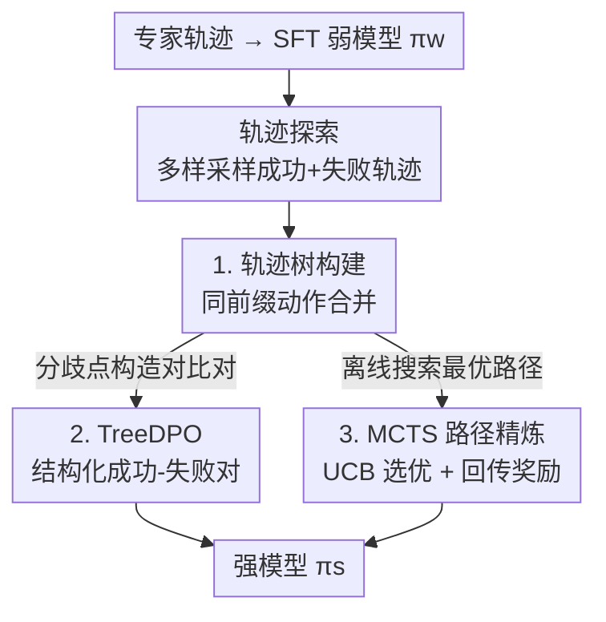

# Weak-to-Strong Generalization with Failure Trajectories

**会议**: ICLR 2026  
**OpenReview**: [https://openreview.net/forum?id=TXZ54qxdAF](https://openreview.net/forum?id=TXZ54qxdAF)  
**代码**: https://github.com/yeruimeng/TraTree.git  
**领域**: 对齐RLHF / LLM Agent  
**关键词**: 弱到强泛化, 失败轨迹, 轨迹树, MCTS, DPO

## 一句话总结
本文把"弱到强泛化"（W2SG）从二分类扩展到多步交互式决策任务：用一个弱模型探索出大量包含成功与失败的动作轨迹，按公共前缀合并成"轨迹树"，再用结构化对比对的 TreeDPO 或离线 MCTS 路径搜索去微调强模型，结果强模型在三个 Agent 环境上不仅超过 SFT 弱模型，甚至反超用专家数据训练的 SFT 强模型。

## 研究背景与动机
**领域现状**：随着超人类智能（superintelligence）被认为可能在十年内到来，"如何监督比人更强的模型"成了对齐领域的核心难题。弱到强泛化（W2SG，Burns et al. 2023）给出一个思路：用能力较弱的模型代替人类监督，把弱模型携带的"人类意图/价值"泛化到强模型上，从弱标签里激发强模型的全部潜力。

**现有痛点**：已有 W2SG 研究几乎只停留在二分类这种简单任务上，用的是离散的弱标签。一旦进入推理、多步决策这类复杂场景——解不再是一个标签而是一整条"动作轨迹"——现有范式就没法直接用。另一条相关路线 DPO 让 Agent 从轨迹偏好对里学习，但偏好对是二元的、随机配对的：两条轨迹之间往往毫无重叠，无法刻画多条推理路径之间丰富的结构关系。

**核心矛盾**：弱模型探索出来的轨迹是"不完美"的（很多失败、次优），而随机偏好对又把这些轨迹之间最有价值的信息——**它们在哪一步开始分道扬镳**——给丢掉了。一条成功路径和一条失败路径常常共享一段前缀，真正决定成败的是分叉后的第一个不同动作，可随机配对完全感知不到这种共享前缀。

**本文目标**：把 W2SG 推广到"解是动作轨迹"的复杂交互任务，并设计一种能利用失败经验、且能捕捉轨迹间层级结构的监督信号，让强模型在无人类标注的情况下被弱监督激发出来。

**切入角度**：作者借鉴人类学习——人不仅从成功经验学，也从祖先总结的失败教训里学，从而避免重蹈覆辙。于是失败轨迹不该被丢弃，而应和成功轨迹一起组织进一个层级结构里，把"共享前缀 + 关键分歧"显式暴露给强模型。

**核心 idea**：把弱模型探索出的成功与失败轨迹按公共前缀合并成"轨迹树"，在树上的分歧点构造结构化对比对（TreeDPO）或用 MCTS 搜出最优路径再做模仿，用这种带结构的弱监督信号去微调强模型。

## 方法详解

### 整体框架
方法的目标是：在没有人类标注、只有一个弱模型的前提下，把强模型 $\pi_s$ 的潜力激发到超过它自己用专家数据 SFT 的水平。整条流程分四步走：先用专家演示数据 SFT 出一个弱模型 $\pi_w^{SFT}$；让它在环境里反复探索、收集一批多样的轨迹（成功、失败、次优都要）；把这些轨迹按公共前缀合并成一棵轨迹树；最后在树上派生两种弱监督算法之一来微调强模型——要么用分歧点对比对做 TreeDPO，要么用 MCTS 离线搜出高质量路径做 SFT 模仿。

任务被形式化为部分可观测马尔可夫决策过程（POMDP）$(U, S, A, O, T, R)$，Agent 策略 $\pi_\theta$ 在每一步根据交互历史生成动作 $a_j \sim \pi_\theta(\cdot|u, a_1, o_1, \dots, a_{j-1}, o_{j-1})$，整条轨迹 $e=(u, a_1, o_1, \dots, a_n, o_n)$ 由环境打一个最终分数 $G(e)\in[0,1]$，策略性能为 $R(\pi_\theta)=\mathbb{E}_{u, e}[G(e)]$，也是主评估指标。

### 关键设计

**1. 轨迹树构建：把成功与失败按公共前缀合并成一棵可对比的层级结构**

这是全文的基石，针对"随机偏好对丢掉轨迹间共享前缀"的痛点。先让 SFT 弱模型对每条指令 $u$ 用不同采样参数（温度、top-p）采 $M$ 条轨迹，刻意保证多样性，覆盖成功、失败和次优路径；可选地再加一个对历史探索分布的 KL 惩罚 $L_{explore}=L_{SFT}-\lambda\cdot KL(\pi_w\|\pi'_{explore})$ 进一步逼出多样性。然后把这些轨迹逐条插入一棵以指令为根的树 $T=(V,E)$：每个节点是一个"执行步" $(o_v, th_v, a_v)$（观测+思考+动作），插入新步时若父节点下已有子节点动作相同、且观测在句向量余弦相似度阈值 $\xi_{sim}$ 内语义相近，就复用该节点并累加访问计数，否则新建分支（动作用精确匹配，措辞微小差异也会另起分叉）。终态节点上挂着该轨迹的环境分数 $G(e)$。

这样合并的妙处在于：一条成功路径（紫）和一条失败路径（红）一旦共享前缀，就会在树上汇成同一段主干，直到某一步动作不同才分叉——**这个分歧点正是决定成败的关键**。作者要求"好的轨迹树"满足三性：多样性（广度）、代表性（深度，路径要够长能完整解题）、信息量（分歧点处不同动作要导致 $G(e)$ 明显不同）。失败轨迹在这里不是噪声，而是提供分歧点对侧的负样本，让强模型学会"在这一步别这么走"。

**2. TreeDPO：只在树的分歧点上构造成功-失败对比对**

针对"随机 DPO 对噪声大、信号不聚焦"的问题。不像普通 DPO 随机配对两条轨迹，本文只在树的分歧点取偏好对：同一段共享前缀 $h$ 后分出两个续接 $\sigma^+$、$\sigma^-$，其聚合 $G(e)$ 不同，定义 $\tau^+=(h,\sigma^+)$、$\tau^-=(h,\sigma^-)$，在数据集 $D_w=\{(\tau_i^+,\tau_i^-)\}$ 上用 DPO 损失微调强模型：

$$L_{TreeDPO}(\pi_s;\pi_w^{SFT})=-\mathbb{E}_{(\tau^+,\tau^-)\sim D_w}\Big[\log\sigma\big(r_{\pi_s}(\tau^+)-r_{\pi_s}(\tau^-)\big)\Big]+\beta\cdot KL(\pi_s\|\pi_w^{SFT}),$$

其中 $r_{\pi_s}(\tau)$ 是强模型下轨迹 $\tau$ 的隐式 DPO 分数，$\pi_w^{SFT}$ 作为固定的 KL 参考。由于两条续接共享前缀、只在关键动作上分叉，这种对比对把无关变量剔掉了，DPO 拿到的是更干净、更聚焦决策点的信号——这也是后面消融里 TreeDPO 明显强于随机对（unstructured DPO）的原因。

**3. MCTS 路径精炼：在静态轨迹树上离线搜索，合成一条高质量路径做 SFT 模仿**

针对"在整棵树上枚举所有对比对计算量太大"的问题。当动作空间大、数据规模大时，TreeDPO 的对比对数量会爆炸。于是作者把 MCTS 当作离线策略优化器，直接在已建好的静态轨迹树上搜索：从父节点按 UCB 选子节点，平衡探索与利用，

$$UCB(v')=\frac{r_M(v')}{c_M(v')}+\gamma\sqrt{\frac{\log C_M}{c_M(v')}},$$

其中 $r_M$、$c_M$ 是节点的累积奖励与访问计数，由原始弱轨迹的终态 $G(e)$ 回传更新。多轮迭代后，每步贪心选 MCTS 精炼后平均奖励 $r_M(v)/c_M(v)$ 最高的子节点，抽出一条最优路径 $e^*$，再让强模型在 $D_{e^*}$ 上做标准 SFT 模仿：$L_{MCTS}(\pi_s)=-\frac{1}{|D_{e^*}|}\sum_{e^*}\sum_t \log\pi_s(a_t^* | \text{context}_t^*)$。这是本文声称的"首次把 MCTS 引入 W2SG"，把树结构里的层级信息压成一条可直接模仿的优质轨迹，避免了全树对比对的开销。

### 损失函数 / 训练策略
训练分两阶段：弱模型先用专家数据做标准 SFT（负对数似然 $L_{SFT}$），再探索环境生成轨迹；强模型则二选一地用 $L_{TreeDPO}$（DPO，KL 系数 $\beta=0.1$）或 $L_{MCTS}$（SFT 模仿）微调。全程用 LoRA（rank 64、$\alpha$ 128），AdamW，SFT 学习率 1e-5、DPO 阶段 2e-5。

理论上，作者基于 DPO 的贝叶斯解释给出性能保证（定理 1）：$R(\hat\pi_s^{TreeDPO})\geq R(\pi_s^{SFT})+\big(R(\pi^*)-R(\pi_s^{SFT})\big)-C\sqrt{\frac{KL(\pi^*\|\pi_w^{SFT})+\log(N_p/\delta_0)}{N_p}}$。直观含义是：只要轨迹树在共享前缀的分歧处提供了有信息量的偏好差，强模型就能被激发超过 SFT 基线；而当弱模型探索坍缩、偏好对没信息时，KL 正则会让 TreeDPO 自然退化回 SFT 强模型而不掉点——这是一种"失败安全"（failure-safe）的保证。

## 实验关键数据

### 主实验
三个交互式 Agent 环境：WebShop（虚拟购物）、ScienceWorld（科学实验）、AlfWorld（家务模拟）。默认弱模型 Llama2-7B、强模型 Llama2-13B。指标为平均奖励（Avg Reward）与成功率（Success Rate）。

| 方法 | WebShop 奖励 | WebShop 成功率 | SciWorld 奖励 | SciWorld 成功率 | AlfWorld 奖励 |
|------|------|------|------|------|------|
| SFT 弱模型 (Llama2-7B) | 47.1 | 87.0 | 41.2 | 55.5 | 44.8 |
| W2SG + TreeDPO | 53.2 | 97.0 | 55.4 | 61.1 | 56.0 |
| W2SG + MCTS (本文) | 56.9 | **99.0** | **58.2** | **66.8** | 57.5 |
| SFT 强模型 (Llama2-13B) | 51.0 | 94.0 | 53.6 | 59.2 | 51.5 |
| SFT 强 + ETO | 52.0 | 97.5 | 54.9 | 61.1 | 53.7 |
| SFT 强 + Best-of-N | 52.3 | 96.0 | 55.3 | 60.7 | 55.2 |
| Ceiling Model (专家偏好) | **58.3** | 96.5 | 56.9 | 63.5 | **59.0** |

关键结论：纯弱监督下的 W2SG-MCTS 在 WebShop / AlfWorld 上平均奖励比 SFT 强模型分别高 **11.6%** 和 **11.7%**，在 ScienceWorld 上甚至超过用 ETO 训练的 Ceiling 模型；相比专家训练的 Ceiling，不完美轨迹最多能恢复其 **39.4%** 的性能，且不需要任何额外人工标注。5 次随机种子 t-检验，TreeDPO vs SFT 强模型 $p=0.0003$、MCTS vs SFT 强模型 $p=0.0001$，显著性极强。跨家族迁移到 Llama3-8B（表 2）、Qwen2.5-14B（表 4）趋势一致，说明该现象与架构无关。

### 消融实验

| 配置 | AlfWorld 平均奖励 | 说明 |
|------|------|------|
| SFT (Llama3-8B) | 59.7 | 强 SFT 基线 |
| Unstructured DPO | 60.4 | 随机配对、无公共前缀，噪声大 |
| TreeDPO | 61.9 | 分歧点结构化对比对 |
| MCTS | **65.7** | 树上搜最优路径做模仿 |

另有树宽与 $\beta$ 的敏感性（表 3，ScienceWorld）：MCTS 在树宽 6 时奖励 58.2 最优，宽 7 反降到 54.9；$\beta$ 从 0.1 升到 0.5 时奖励从 54.9 跌到 49.2，说明小 $\beta$ 更利于知识迁移、避免过拟合参考策略。

### 关键发现
- **MCTS > TreeDPO > 随机 DPO**：结构化的"共享前缀+关键分歧"对比对比随机对信号更干净、更稳定，而 MCTS 把全树信息压成一条最优路径，效果最好且省掉了全树对比对的算力。
- **轨迹数量有甜点区**：轨迹从 3 增到 10，性能先升后降——ScienceWorld 用 6 条就反超 Ceiling，AlfWorld 超过 7 条反而掉点，盲目加轨迹不一定更好。
- **弱模型越强、信号越富**：固定强模型 Llama3-8B，用 Llama2-7B 当弱模型只有小幅但非负的提升，换更强的 Llama2-13B 提升明显更大，且从不产生负迁移，印证理论里的单调关系。
- **成本极低**：WebShop 上建树 + 100 次 MCTS rollout 仅 0.41s + 0.23s，因为只在已采样轨迹上做局部扩展和指针遍历，不依赖词表大小。

## 亮点与洞察
- **失败轨迹被显式利用**：把失败路径作为分歧点的负样本组织进树里，而不是简单丢弃，让强模型学会"在哪一步别犯错"——这正是标题"with failure trajectories"的核心，也是它区别于只用成功示范的 SFT 的地方。
- **共享前缀是信息富矿**：成功与失败常共享一段前缀，决定成败的就是分叉后第一个不同动作；把这个结构暴露给 DPO，等于自动做了"控制变量"，去掉无关噪声。这个洞察可迁移到任何需要从轨迹对里学习的偏好优化场景。
- **失败安全的退化性质**：KL 正则保证在弱监督无信息时退化回 SFT 强模型而不掉点，给"弱监督可能很差"的现实场景吃了定心丸。
- **MCTS 当离线树搜索器**：把通常在线用的 MCTS 改成在静态轨迹树上离线跑，既拿到层级信息又把成本压到亚秒级，是一个轻量好用的工程 trick。

## 局限与展望
- 弱/强模型规模差距有限（7B→13B、8B 等），论文论证的是 superalignment 方向，但实验里"弱"模型其实并不弱，离真正的超人类监督场景还远。
- 轨迹树的合并依赖动作精确匹配 + 观测句向量相似度阈值 $\xi_{sim}$，措辞微小差异就另起分叉，可能导致树过度碎片化；阈值如何设、对结果多敏感未充分讨论。
- 轨迹数量、树宽、$\beta$ 都有明显甜点区且跨任务不一致（SciWorld 用 6 条、AlfWorld 超 7 条就掉点），实际部署需要逐任务调参，缺乏自适应机制。
- 三个环境都是有明确环境奖励 $G(e)$ 的仿真任务；在缺乏可靠环境分数、只能靠弱模型自评的真实场景里能否成立尚未验证。

## 相关工作与启发
- **vs 传统 W2SG (Burns et al. 2023)**：他们让强模型从弱监督的离散标签里学（多在二分类），本文则把弱监督扩展成"整条交互轨迹"，并用树结构 + MCTS/DPO 蒸馏，第一次把 W2SG 落到多步决策任务上。
- **vs DPO (Rafailov et al. 2024)**：DPO 用随机对比对，两条轨迹无重叠、信息稀；TreeDPO 只在共享前缀的分歧点取对，信号更聚焦、更稳定，消融里明显更强。
- **vs ToT / CoT (Yao 2023b; Wei 2022)**：CoT 是单条线性推理链，ToT 虽探索多路径但不显式组织成功与失败；本文的轨迹树同时收编成功与失败轨迹，捕捉更丰富的层级关系。
- **vs ETO (Song et al. 2024b)**：ETO 让强模型从自己的探索里做 DPO，是"强监督强"；本文是"弱监督强"，在 ScienceWorld 上甚至超过 ETO 训练的 Ceiling。

## 评分
- 新颖性: ⭐⭐⭐⭐⭐ 首次把 W2SG 扩到多步决策 + 首次把 MCTS 引入 W2SG，失败轨迹 + 轨迹树的组合很巧。
- 实验充分度: ⭐⭐⭐⭐ 三环境、两模型家族、多消融 + 显著性检验齐全，但模型规模差距偏小、真实场景未验证。
- 写作质量: ⭐⭐⭐⭐ 动机—方法—理论—实验链条清晰，图示到位；部分理论细节压在附录。
- 价值: ⭐⭐⭐⭐ 给"无人类标注下激发强模型"提供了一条可扩展、成本极低且失败安全的路径，对 Agent 对齐有实践意义。

<!-- RELATED:START -->

## 相关论文

- [\[ACL 2025\] Synergistic Weak-Strong Collaboration by Aligning Preferences](../../ACL2025/llm_alignment/synergistic_weak-strong_collaboration_by_aligning_preferences.md)
- [\[ICLR 2026\] When Weak LLMs Speak with Confidence, Preference Alignment Gets Stronger](when_weak_llms_speak_with_confidence_preference_alignment_gets_stronger.md)
- [\[ACL 2026\] Student Guides Teacher: Weak-to-Strong Inference via Spectral Orthogonal Exploration](../../ACL2026/llm_alignment/student_guides_teacher_weak-to-strong_inference_via_spectral_orthogonal_explorat.md)
- [\[AAAI 2026\] W2S-AlignTree: Weak-to-Strong Inference-Time Alignment for Large Language Models via Monte Carlo Tree Search](../../AAAI2026/llm_alignment/w2s-aligntree_weak-to-strong_inference-time_alignment_for_large_language_models_.md)
- [\[ICLR 2026\] On the Shelf Life of Fine-Tuned LLM-Judges: Future-Proofing, Backward-Compatibility, and Question Generalization](on_the_shelf_life_of_fine-tuned_llm-judges_future-proofing_backward-compatibilit.md)

<!-- RELATED:END -->
