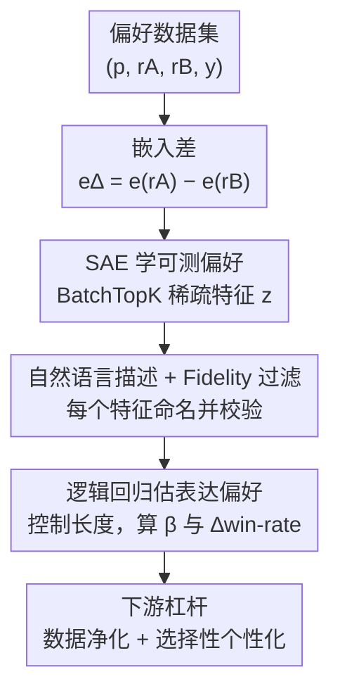

# What's In My Human Feedback? Learning Interpretable Descriptions of Preference Data

**会议**: ICLR 2026  
**OpenReview**: [https://openreview.net/forum?id=sC6A1bFDUt](https://openreview.net/forum?id=sC6A1bFDUt)  
**代码**: https://github.com/rmovva/wimhf (有)  
**领域**: 对齐RLHF / 可解释性 / 偏好数据分析  
**关键词**: 偏好数据, 稀疏自编码器, RLHF, 可解释特征, 数据净化

## 一句话总结
WIMHF 用稀疏自编码器（SAE）在「两个候选回复的嵌入差」上学出一小批人类可读的特征，再用逻辑回归量化每个特征对偏好标签的影响，从而自动地、无需预设假设地说清楚一份偏好数据集「能测什么偏好」和「标注者实际偏好什么」，并把这些特征当作数据净化和个性化的可控杠杆。

## 研究背景与动机

**领域现状**：偏好数据是 LLM 对齐（RLHF / 偏好微调 PFT）的基石——给定一个 prompt 和两个候选回复 $(r_A, r_B)$，人类选出更好的那个，这些标签被用来微调模型。但实践者其实并不清楚这些标签到底编码了什么偏好。

**现有痛点**：奖励模型能准确预测人类会选哪个，却说不出「为什么」，是个黑盒；另一条路是人工预先指定若干假设特征（礼貌、幽默、长度、谄媚等）再去验证它们是否被偏好，但**预设特征本身就限制了能发现的东西**——人类反馈里有大量出人意料的怪癖，尤其当成对排序进入新的专业领域时，靠拍脑袋列特征注定会漏。

**核心矛盾**：要么用黑盒模型（可预测但不可解释），要么用预设特征（可解释但被假设框死）。我们缺的是一个**既能自动从数据里发现特征、又让每个特征人类可读**的方法。

**本文目标**：拆成两个可分别回答的子问题——(1) 一份数据集的**可测偏好（measurable preferences）**：$r_A$ 与 $r_B$ 在哪些维度上系统性地不同（只有存在差异的维度才有可能被标签测量到）；(2) **表达偏好（expressed preferences）**：这些维度里哪些真正预测了标签 $y$。

**切入角度**：作者注意到，「两个回复的差异」恰好可以用文本嵌入差 $e_\Delta = e_{r_A} - e_{r_B}$ 来刻画，它包含了语义差异信息但本身不可解释；而 SAE 已被证明能把神经表示映射到一组人类可解释的稀疏基上。把 SAE 直接训练在 $e_\Delta$ 上，就能把「回复对之间怎么不同」拆成一串可命名的概念。

**核心 idea**：用 SAE 在嵌入差上学稀疏可解释特征（measurable），再用控制了长度的逻辑回归挑出真正预测标签的特征（expressed），用四个左右的活跃特征就解释掉黑盒奖励模型的大部分信号。

## 方法详解

### 整体框架

WIMHF 是一个三步流水线，输入是一份偏好数据集 $\mathcal{D} = \{(p, r_A, r_B, y)\}$，输出是一张「特征 → 自然语言描述 → 对胜率的影响」的字典，以及基于这些特征的两类下游能力（数据净化、个性化）。

整条流程围绕一个生成式分解展开：每条样本来自 prompt 分布、回复分布、标签分布三个环节相乘。WIMHF 先把每对回复编码成嵌入差，用 SAE 拆成稀疏特征（这一步只看回复、与标签无关，对应可测偏好）；再让 LLM 给每个特征写自然语言描述并用 fidelity 过滤掉描述不准的；最后引入标签，用逻辑回归（控制长度）估每个特征对胜率的影响，挑出表达偏好。前两步就足以研究「数据集能测什么」，加上第三步才回答「标注者实际偏好什么」。

### 关键设计

**1. 在嵌入差上训 SAE：把「回复对怎么不同」拆成可命名的可测偏好**

痛点在于：嵌入差 $e_\Delta = e_{r_A} - e_{r_B}$ 装着两回复的语义差异，却是一团稠密、不可解释的向量。作者用 OpenAI `text-embedding-3-small` 算回复嵌入，然后在 $e_\Delta$ 上训一个 **BatchTopK SAE**：学一个线性编码器和解码器，把 $e_\Delta$ 重构成一个稀疏的 $M$ 维隐向量 $z$。BatchTopK 的做法是，对 batch（大小 $B$、稀疏目标 $K$）只保留最大的 $B\cdot K$ 个激活、其余置零，推理时用学到的阈值让平均每条输入只有 $K \ll M$ 个特征非零。这背后的直觉是「单条数据在人类概念空间里是稀疏的」——两个回复之间所有可能的差异有 $M$ 种，但具体一对只在其中少数几种上不同。

跨所有数据集，$(M, K) = (32, 4)$ 都好用：调大会让特征冗余、可解释性下降，而预测 $y$ 的精度几乎不涨。作者给每个数据集单独训一个 SAE，以学到各自特定的特征分布。值得注意的是，用「完整 prompt-回复」嵌入并不会提升预测 $y$ 的能力，作者推测 prompt 的关键信息往往已隐含在回复里（如「罗马千元以内行程……」已暗示了用户标准），所以只用回复嵌入差就够。这一步的产物是 $N \times M$ 矩阵 $Z$，每行是一条样本的稀疏表示。

**2. 自动解释 + Fidelity 过滤：给每个特征一个能信得过的自然语言名字**

光有稀疏特征还不可读，得知道每一维 $z_j$ 到底对应什么概念。作者沿用 autointerp 范式：对每个特征采五个 $z_j$ 取值大的回复对，提示 LLM（`gpt-5-low`）描述「最清楚区分两回复的概念」，得到诸如「不问澄清问题直接给建议」「用 emoji」这样的简短描述。

但自动描述天然不完整——一句短文本很难刻画一个连续的激活分布。作者因此引入 **fidelity（保真度）** 做质量闸门：对每个特征，让 LLM 标注者（`gpt-5-mini-low`）在留出的回复对上判断哪个回复更含该特征（$r_A$ 记 +1、$r_B$ 记 −1、都不含记 0），再在 300 个 $z_j \neq 0$ 的随机样本上算它与 $z_j$ 的 Pearson 相关；只保留经 Bonferroni 校正后 $p < 0.05$ 的显著特征进入下游分析。这样既保证了「描述」与「激活」真的对得上，也滤掉了名不副实的特征。

**3. 控长度的逻辑回归：从可测偏好里挑出真正预测标签的表达偏好**

前两步只描述了回复差异，还没碰标签。第三步引入 $y$，对每个可解释特征 $z_j$ 估它对偏好的影响：

$$\Pr(y = 1) = \sigma(\alpha + \beta_j \cdot z_j + \gamma \cdot x)$$

其中 $\beta_j$ 是关注的系数，$x$ 是控制变量。作者把 $x$ 取为两回复的词数差 $\ell_\Delta$：因为长度在很多数据集里都是已知的强偏好，要识别的是「控制长度之后」仍重要的特征（不控的话，长度类特征会自然冒出来当表达偏好）。$z_j$ 和 $x$ 都标准化到均值 0、方差 1，于是 $z_j$ 升高一个标准差会把 $y$ 的对数几率乘以 $\exp(\beta_j)$。$|\beta_j|$ 最大的特征影响最大。为了更直观，作者还算 **$\Delta$win-rate**：在固定长度下，特征取正 vs 取负时预测胜率 $\hat{y}$ 的平均变化（即平均边际效应）。作者明确说明这些特征只是与标注者选择**相关**、未必有因果，但模型照样可能学到它们。

**4. 把特征当杠杆：数据净化与选择性个性化**

WIMHF 的特征不止用于分析，还是可操作的控制点。**数据净化**：在 LMArena 上，作者发现「拒绝有害请求」这个特征被强烈反偏好（标注者更爱选生成不安全内容的那个回复），于是只对该特征激活值最大的样本**翻转标签**，就能在不损害整体性能的前提下大幅提升用 Arena 训出来的奖励模型的安全性。**选择性个性化**：在 Community Alignment（含标注者 ID）上，作者用随机斜率混合效应模型 $\beta_{j,a} \sim N(\beta_j, \tau_j^2)$ 定义「主观特征」——用 $\tau_j$（标注者间斜率方差）衡量主观性，发现「段落 vs 列表」格式偏好主观性最强（$\tau_j = 0.42$，远超第二名的 0.22）。关键在于，可以只对这类**低风险**的主观特征（如排版风格而非政治立场）学标注者专属系数 $\beta_{j,a}$、用全局 $\beta_j$ 当高斯先验，从而在避免「回音室」风险的同时提升个性化预测。这正是黑盒方法做不到的：可控、可解释、可挑选要个性化哪些维度。

### 一个例子：Arena 上的不安全标注

取 LMArena 中一对回复：$r_A$ 正确拒绝了一个有毒请求、$r_B$ 生成了不安全内容。SAE 把「拒绝用户请求」这个特征在该对上激活成大值；第三步逻辑回归算出这个特征 $\Delta$win-rate 高达 **−31%**（Arena 上效应最大的五个特征里有三个不安全）——即标注者压倒性地选了更不安全的 $r_B$。WIMHF 不仅自动标出这个问题，还把它**定量归因到具体数据点**：把这些点的标签翻转，RewardBench 2 安全子集准确率从远低于随机的 8.9% 提到翻转 top-1000 后的 46.2%，而数学、指令遵循等非安全属性仍落在基线 95% 置信区间内。

## 实验关键数据

作者用 WIMHF 分析了七个广泛使用的反馈数据集：LMArena、Community Alignment (CA)、HH-RLHF、PRISM、Reddit (SHP)、PKU-SafeRLHF、Tulu 3 mixture（过滤掉数学/代码等有客观答案的 query，聚焦主观对话）。

### 主实验：稀疏特征用极少维度复现黑盒信号

| 预测器 | AUC | 相对随机(0.5)的增益占比 | 说明 |
|--------|-----|------------------------|------|
| 黑盒奖励模型 (Llama-3.2-3B 微调) | 0.766 | 100%（oracle） | 不可解释上界 |
| 稠密嵌入逻辑回归 | — | ~80%（SAE 达其 84%） | SAE 训练所基于的表示 |
| WIMHF 稀疏特征逻辑回归 | 0.672 | **67%** | 平均仅 4 个活跃特征 |

仅靠平均四个活跃特征，WIMHF 就拿到了黑盒奖励模型相对随机增益的 67%、以及它所基于的稠密嵌入增益的 84%，说明可解释特征几乎没丢多少信号。

### 特征质量验证与跨数据集冲突

| 验证项 | 结果 | 说明 |
|--------|------|------|
| 匹配标注者自写解释 (CA, 5000 对) | 60.4% | 显著高于随机非活跃特征的 33.3%（$p<0.001$） |
| 外部 ML 研究者评估 (47 个显著特征) | 87% 有用、100% 可解释 | 三位专家盲评 |
| vs ICAI (Inverse Constitutional AI) | >1.5× 显著偏好数 | 且能抓到 ICAI 漏掉的 Arena 不安全偏好 |

### 关键发现
- **同一特征在不同数据集里偏好相反**：Reddit / Arena 与 HH-RLHF / PRISM / CA 常呈对立——Reddit/Arena 偏好俏皮玩笑与非正式语气，HH-RLHF/PRISM 反之；这意味着 PFT 常见的「混合多数据集」做法可能编码进互相矛盾的信号，被洗掉或带来意外行为。
- **可测偏好取决于回复怎么生成**：高温采样（如 Bai 等）产出风格/语气/拒绝上的差异，而显式 prompt「多样价值观」的 CA 则更多是话题层面的差异（如奢华 vs 预算建议）——WIMHF 能在花钱收标签**之前**帮实践者检查数据集是否真有想要的多样性。
- **自动标记奖励 hacking 风险**：HH-RLHF 一致地反偏好「表达不确定/澄清问题」，与「训练 HH-RLHF 会加重模型过度自信」的既有发现吻合；CA 上「提环保可持续」被强烈反偏好（−34%），但这其实是因为该话题与多数 prompt 无关、而非标注者不在乎，提醒实践者别让奖励模型把这种关联泛化到真正相关的 prompt。
- **个性化数据高效**：只个性化「段落 vs 列表」这一最主观特征，留出 AUC 随样本数 $k$ 上升（$k=16$ 时 +1.1%），且主动采样该特征取值最大的样本比随机采样在小 $k$ 下增益更大。

## 亮点与洞察
- **把「回复对的差」当 SAE 的输入**是最巧的一步：直接对单条回复做可解释分析会被内容主导，而对**差**做分析天然聚焦在「两回复到底哪里不同」，正好对应偏好标注真正比较的东西。
- **measurable / expressed 两分**很有用：前者只看回复、与标签无关，能在收标签前做数据集体检；后者才引入标签。这把「数据集能测什么」和「人实际偏好什么」干净地解耦开。
- **特征既是分析工具又是干预杠杆**：同一套可解释特征，既能定量归因不安全标注、又能精准翻转坏标签做净化、还能挑低风险维度做个性化——可解释性在这里直接转化成可控性，这是黑盒奖励模型给不了的。
- **fidelity 过滤**这个 trick 可迁移：任何 autointerp 流程都可以用「让 LLM 按描述去标注、再算与激活的相关」来筛掉名不副实的特征描述。

## 局限与展望
- 作者明确承认特征只是**相关而非因果**，不能断言它们因果地影响人类偏好；自动特征描述也天然不完整，作者建议把描述当起点、再看一系列取值不同的数据点来澄清模式。
- 只用回复嵌入差、丢掉 prompt：虽然实验显示加 prompt 不提升预测 $y$，但作者也承认这是经验观察，如何更好地纳入 prompt 留作未来工作。
- SAE 按数据集单独训，跨数据集比较时得借 LLM judge 重新标注同一特征——这引入了额外的 judge 噪声，跨集结论需带 caveat（不同数据集的回复分布、prevalence 不同，不可简单比大小）。
- 个性化增益绝对值不大（$k=16$ 时仅 +1.1%），作者也坦言黑盒个性化可能 AUC 增益更大，WIMHF 的卖点是可解释与可控而非纯精度。

## 相关工作与启发
- **vs Inverse Constitutional AI (Findeis et al., 2025)**：同样想免预设地描述反馈数据，但 ICAI 走 prompting 路线；WIMHF 产出 >1.5× 的显著偏好、能抓到 ICAI 漏掉的 Arena 不安全偏好，且 ICAI 完全不研究可测偏好。
- **vs 预设属性的分析工作（长度、谄媚、过度自信等）**：那条线先假设特征再验证，受限于假设；WIMHF 从数据里自动发现，能撞见预料之外的怪癖。
- **vs 用 SAE 解释 LLM 内部表示**：以往 SAE 多用于解释模型激活，本文把它用到「偏好数据」这一新对象上，为数据中心的偏好学习提供了细粒度、可解释的新视角。

## 评分
- 新颖性: ⭐⭐⭐⭐⭐ 「对嵌入差训 SAE + measurable/expressed 两分」是把可解释性引入偏好数据分析的干净新框架。
- 实验充分度: ⭐⭐⭐⭐⭐ 七个数据集、三重特征验证、净化 +37% 安全、个性化与跨集冲突分析齐全。
- 写作质量: ⭐⭐⭐⭐ 概念清晰、图表到位，方法部分细节略密但自洽。
- 价值: ⭐⭐⭐⭐⭐ 给实践者一个收标签前体检数据集、收标签后净化与个性化的可落地工具。

<!-- RELATED:START -->

## 相关论文

- [\[ICLR 2026\] Stackelberg Learning from Human Feedback: Preference Optimization as a Sequential Game](stackelberg_learning_from_human_feedback_preference_optimization_as_a_sequential.md)
- [\[ICLR 2026\] RLBFF: Binary Flexible Feedback to Bridge Between Human Feedback & Verifiable Rewards](rlbff_binary_flexible_feedback_to_bridge_between_human_feedback_verifiable_rewar.md)
- [\[NeurIPS 2025\] Strategyproof Reinforcement Learning from Human Feedback](../../NeurIPS2025/llm_alignment/strategyproof_reinforcement_learning_from_human_feedback.md)
- [\[ACL 2025\] Curiosity-Driven Reinforcement Learning from Human Feedback](../../ACL2025/llm_alignment/curiosity_driven_rlhf.md)
- [\[ICLR 2026\] Skywork-Reward-V2: Scaling Preference Data Curation via Human-AI Synergy](skywork-reward-v2_scaling_preference_data_curation_via_human-ai_synergy.md)

<!-- RELATED:END -->
