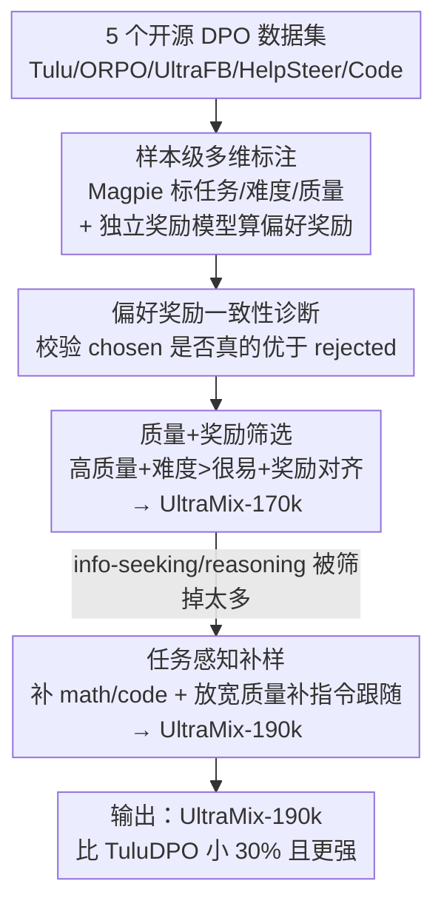

# When Data Is the Algorithm: A Systematic Study and Curation of Preference Optimization Datasets

**会议**: ICLR 2026  
**OpenReview**: [https://openreview.net/forum?id=bmoh0i1nqE](https://openreview.net/forum?id=bmoh0i1nqE)  
**代码**: 无（在 HuggingFace 公开了 6 个标注数据集与 UltraMix 混合集）  
**领域**: 对齐RLHF / 偏好优化 / 数据治理  
**关键词**: DPO、偏好数据、数据为中心、奖励模型、数据筛选

## 一句话总结
本文对 5 个常用开源 DPO 偏好数据集做了首个系统的「样本级」横向体检——用 Magpie 标注任务类别/难度/输入质量、再用独立奖励模型给每对偏好打「偏好奖励」分，发现 20–30% 的样本"被选中的回答其实不如被丢弃的"；基于这些诊断信号，作者筛出一个比最强单一数据集小 30% 却更强的混合集 UltraMix。

## 研究背景与动机
**领域现状**：对齐 LLM 的最后一步通常是从偏好反馈中学习（RLHF）。其中 DPO（Direct Preference Optimization）因为不需要显式奖励模型、不需要策略 rollout，直接在「优选 vs 劣选」的偏好对上微调，成了开源社区最流行的对齐方法。社区也放出了一批开源 DPO 语料：TuluDPO、ORPO、UltraFeedback、HelpSteer、Code-Preference-Pairs。

**现有痛点**：这些数据集几乎都是「黑盒」——只报告粗粒度的整体组成，样本层面没有丰富标注。有的只给二元偏好对、没有排序分数，根本看不出"优选到底比劣选好多少"；有的偏好分来自 GPT-4 或人工，但没人验证过这个偏好顺序到底对不对。更糟的是，已有的横向比较都是在不同模型、不同超参下做的，方法学高度异质，导致"到底哪个 DPO 数据集更好"始终是一笔糊涂账。

**核心矛盾**：DPO 的算法本身很简单，真正决定效果的是**数据质量**——但社区一直缺一套能在固定训练配置下、对样本质量与任务覆盖做并排对照的诊断工具，于是也就没法设计有原则的数据筛选配方。换句话说，"数据就是算法"，可没人系统地研究过这份算法的输入。

**本文目标**：（1）在统一训练配置下公平地横评 5 个 DPO 数据集；（2）给每个偏好对补上样本级标注，尤其是一个能独立校验偏好顺序的信号；（3）用这些标注设计出能跨数据集挑样本的 curation 配方，造出更小更强的混合集。

**切入角度**：作者引入一个**与原数据集标注无关的独立奖励模型**来给每对偏好打分。如果"被选中的回答"得分反而低于"被丢弃的回答"，那这对偏好就可疑。这个信号既能体检数据集质量，又能当作筛选标准。

**核心 idea**：把偏好数据当成"算法"来诊断——用多维标注（任务/难度/输入质量/偏好奖励）找出噪声与冗余样本，再用「质量 + 奖励 + 任务感知」三类信号组合筛样，跨 5 个数据集拼出 UltraMix。

## 方法详解

### 整体框架
方法分三段：先给所有偏好样本打**多维标注**（用 Magpie 标任务类别/难度/输入质量，再用独立奖励模型 FsfairX 算「偏好奖励」），然后做**横向诊断**找出各数据集在组成、质量、偏好一致性上的结构差异，最后据此设计**筛选配方**，从 5 个数据集里跨集挑样、去噪去冗，迭代出最终的 UltraMix-190k。整条管线是「数据为中心」的：不改 DPO 算法、不改训练超参，只动数据。

### 关键设计

**1. 样本级多维标注：给黑盒偏好数据装上仪表盘**

针对"DPO 数据集在样本层面是黑盒、看不出每条样本好不好"这个痛点，作者用 Magpie 这套自合成标注流水线，把每个偏好对打上结构化标签：任务类别（12 类，如 information seeking、math、coding 等）、查询难度（very easy→very hard）、输入质量（very poor→excellent），以及语言和安全标签——这些标签由 Llama-3.3-70B-Instruct 作为裁判模型生成。真正的新意在于额外引入了**偏好奖励（preference reward）**：用 FsfairX（一个基于 Llama-3-8B-Instruct、在多样高质量偏好数据上微调的奖励模型）分别给「被选中」和「被丢弃」两个回答打分。这个奖励模型与原数据集的标注来源完全无关，因此它的打分可以当作一把"外部尺子"，去衡量每条样本的回答到底有多满足指令，而不依赖原始的人工或 GPT 标注。为避免对单一奖励模型过度依赖，作者还换了另一个奖励模型做对照，结论一致。

**2. 偏好奖励一致性诊断：偏好顺序未必可信**

有了独立奖励模型，作者第一件事就是验证"被选中的回答是不是真的比被丢弃的好"。结果出人意料：TuluDPO、ORPO、UltraFeedback、HelpSteer 都只有 **70–80%** 的样本满足 $r_\text{chosen} > r_\text{rejected}$，也就是说有 20–30% 的偏好对里，奖励模型认为"被丢弃的回答其实更好"。这暴露出 UltraFeedback 基于 GPT-4 的奖励标注、以及 HelpSteer 简单取均值的做法，常常与专用偏好奖励模型的判断错位。进一步看奖励差 $r_\text{chosen}-r_\text{rejected}$ 的分布：TuluDPO/ORPO/UltraFeedback 的差值分布更宽、能伸到正尾，说明优劣分得清；HelpSteer 的分布则紧贴 0，意味着大量偏好对是"两个差不多的回答硬选一个"，对齐信号很弱。作者还发现**输入质量与偏好奖励强正相关**——输入越好的 prompt，被选回答的平均奖励越高（图 5），这是"写得差的指令会导致更差的偏好对齐"的首个实证证据。Code-Preference-Pairs 受错配影响最小，因为代码任务里"缺功能/语法错"这类信号更显眼，人和奖励模型都更容易判优劣。

**3. 多信号 + 任务感知的 curation 配方：从 170k 迭代到 190k**

针对"单一信号筛选不够、要组合多信号"这个核心结论，作者分两步造 UltraMix。**初始配方（质量+奖励）**：从每个数据集里只留 (a) 输入质量为 excellent/good、(b) 难度高于 very easy（很易样本与下游表现相关性低）、(c) $r_\text{chosen}>r_\text{rejected}$ 的样本；再按奖励百分位卡阈值（4 个通用集留 25 分位以上，Code-Preference-Pairs 用更严的 80 分位以免代码样本过载），并去重（TuluDPO 与 UltraFeedback 重叠很大）。这套配方得到 **UltraMix-170k**（比 TuluDPO 小 37%），整体分略涨、TruthfulQA 大涨，但在 code、MATH、IFEval 上反而掉点。诊断发现问题出在 170k **欠采样了 information seeking 和 reasoning**（相对 TuluDPO 分别少了 20% 和 13%）——而指令跟随能力是跨任务涨点的关键。于是**改进配方（质量+奖励+任务感知）**做两步增强：先按"$r_\text{chosen}>r_\text{rejected}$"从所有数据集补 17k 条 math/code 样本得到 **UltraMix-187k**；再针对指令跟随，**放宽质量约束**——挑偏好奖励高于 70 分位、但输入质量为 average 的 information seeking/reasoning 样本补 3k 条，得到最终 **UltraMix-190k**（仍比 TuluDPO 小 30%）。关键洞见是：质量、任务、奖励三类滤波器单独用都不够，UltraMix 的有效性来自三者的有原则组合。

## 实验关键数据

### 主实验
固定训练配置（Open-Instruct 框架），在 Llama-3.1-8B-TuluSFT 与 Qwen-2.5-7B-TuluSFT 上做 DPO，评测 12 个 Open LLM Leaderboard 任务 + HumanEval/HumanEval+，共 14 个 benchmark 的 Overall 平均分：

| 模型 | SFT | TuluDPO（最强单集） | UltraMix-170k | UltraMix-190k（本文最终） |
|------|------|------|------|------|
| Llama-3.1-8B-TuluSFT | 50.09 | 53.96 | 54.16 | **56.04** |
| Qwen-2.5-7B-TuluSFT | 56.55 | 59.56 | 60.48 | **62.05** |

UltraMix-190k 在两个模型上都全面超过此前最强的单一数据集 TuluDPO，且样本量少 30%。代表性单项（Llama）：GSM8K 79.48→82.48、HumanEval 67.24→69.05、IFEval 80.35→81.13；Qwen 上 MATH 43.13→49.55、GSM8K 76.84→82.70。

### 横向诊断 / 消融

| 诊断维度 | 关键发现 | 说明 |
|------|---------|------|
| 偏好顺序一致性 | 仅 70–80% 样本 chosen>rejected | 20–30% 偏好对被独立奖励模型判为"选错了" |
| 任务分布（170k） | info-seeking −20%、reasoning −13% | 仅靠质量+奖励筛会丢掉指令跟随样本 → 掉点 |
| 任务感知补样 | 187k/190k 分别补回 +5%/+10% info-seeking | 190k 在几乎所有 benchmark 上反超 170k 和 TuluDPO |
| 单信号 vs 组合 | 质量/任务/奖励单独滤波都不够 | UltraMix 效果来自三类信号的有原则组合 |

### 关键发现
- **偏好顺序错配普遍存在且伤性能**：20–30% 的"优选"在独立奖励模型看来不如"劣选"，这是过去横评从未量化的问题。
- **输入质量 ↔ 偏好奖励强正相关**：写得差的 prompt 会带来更差的偏好对齐，首次给出实证。
- **绝对数量 > 相对比例**：TuluDPO 的 math 样本占比只有 17%，但因绝对量大、质量高，math 表现反而强于占比 29% 的 ORPO；这也解释了为什么 190k 要"补绝对数量"而非只调比例。
- **泛化性**：在另外 6 个不同架构/规模（1B→8B）的开源模型上，UltraMix-190k 同样稳定领先所有原始数据集及 170k/187k 变体。

## 亮点与洞察
- **"数据就是算法"这个视角立得住**：不碰 DPO 算法、不调超参，纯靠数据诊断 + 筛选就把最强基线又推高一截，且数据量更小，说明偏好数据里有大量噪声与冗余可挤。
- **用独立奖励模型当"测谎仪"很巧**：把一个与原标注无关的奖励模型用来反向校验偏好顺序，既是体检工具又是筛选标准，一举两得；这个思路可迁移到任何带偏好标注的数据集治理。
- **"先质量再补任务"的迭代过程很有教学价值**：作者诚实地展示了初始配方因丢掉指令跟随样本而掉点、再用任务感知补样救回来的全过程，让读者看清"单信号筛选为什么不够"。
- **可复用 trick**：对不同数据集用不同百分位阈值（代码集卡 80 分位防过载）、放宽质量约束去捞高奖励的指令跟随样本——都是很实用的数据混合工程经验。

## 局限与展望
- **依赖奖励模型的判断**：整套诊断与筛选都建立在 FsfairX 这个奖励模型上，虽换模型对照过，但奖励模型本身的偏置仍可能影响"哪些样本被判错配"的结论。
- **配方含较多人工阈值**：百分位、难度门槛、放宽质量到 average 等都是经验设定，未必能无缝迁移到新数据集，作者称配方"原则上可泛化"但需重新调。
- **只覆盖 5 个数据集 / DPO 一种范式**：未涉及更大规模语料或 PPO/在线 RLHF 等其他对齐范式，混合策略在这些场景是否成立尚待验证。
- **改进思路**：可把偏好奖励的校验做成在线/迭代式（边训边重筛），或用多个奖励模型投票降低单模型偏置。

## 相关工作与启发
- **vs 已有 DPO 横评**：以往比较只覆盖小子集、且在不同模型/超参下做，方法学异质；本文首次固定训练配置做 8 模型 × 14 benchmark 的公平横评，并补齐样本级标注。
- **vs UltraFeedback / HelpSteer 等原始数据集**：它们的偏好分来自 GPT-4 或人工取均值，本文用独立奖励模型证明这些标注有 20–30% 与专用偏好模型错配，揭示了原始标注的盲区。
- **vs 作者前作（SFT 数据标注分析）**：本文把"标注 + 诊断 + 筛选"的数据为中心方法从 SFT 场景延伸到了 DPO 偏好对场景。

## 评分
- 新颖性: ⭐⭐⭐⭐ 视角（数据即算法）和用独立奖励模型反向校验偏好顺序都很扎实，但单点技术创新有限。
- 实验充分度: ⭐⭐⭐⭐⭐ 8 个模型、14 个 benchmark、固定配置横评 + 三轮迭代消融，诊断与结论自洽。
- 写作质量: ⭐⭐⭐⭐ 逻辑清晰、诚实展示失败配方，但图表密集、部分分析需对照附录。
- 价值: ⭐⭐⭐⭐⭐ 公开了全部标注数据与 UltraMix，给"如何从开源语料挑偏好数据"提供了可直接复用的实操指南。

<!-- RELATED:START -->

## 相关论文

- [\[ICLR 2026\] Skywork-Reward-V2: Scaling Preference Data Curation via Human-AI Synergy](skywork-reward-v2_scaling_preference_data_curation_via_human-ai_synergy.md)
- [\[ICLR 2026\] When Weak LLMs Speak with Confidence, Preference Alignment Gets Stronger](when_weak_llms_speak_with_confidence_preference_alignment_gets_stronger.md)
- [\[ICLR 2026\] Towards Understanding Valuable Preference Data for Large Language Model Alignment](towards_understanding_valuable_preference_data_for_large_language_model_alignmen.md)
- [\[ICLR 2026\] What's In My Human Feedback? Learning Interpretable Descriptions of Preference Data](whats_in_my_human_feedback_learning_interpretable_descriptions_of_preference_dat.md)
- [\[ICLR 2026\] Is On-Policy Data always the Best Choice for Direct Preference Optimization-based LM Alignment?](is_on-policy_data_always_the_best_choice_for_direct_preference_optimization-base.md)

<!-- RELATED:END -->
