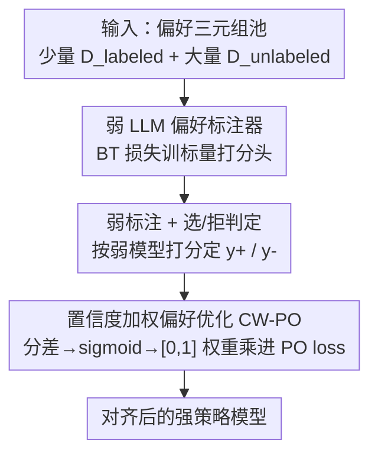

# When Weak LLMs Speak with Confidence, Preference Alignment Gets Stronger

**会议**: ICLR 2026  
**论文**: [Project Website](https://brbiclab.epfl.ch/projects/CW-PO)（EPFL，含代码；缓存未给 arXiv 号）  
**代码**: https://brbiclab.epfl.ch/projects/CW-PO (有)  
**领域**: 对齐RLHF / 偏好优化  
**关键词**: 偏好对齐, 弱模型标注, 置信度加权, DPO, 弱到强对齐

## 一句话总结
用一个不到 0.5B 的弱 LLM 当偏好标注器，再按它对每个样本的"置信度"给偏好优化目标逐样本加权（CW-PO），结果只用 20%~30% 的人工标注就能在多个数据集上反超用 100% 人工标注训练的 DPO，且兼容 DPO/IPO/rDPO 各种目标。

## 研究背景与动机
**领域现状**：把 LLM 对齐到人类价值观的主流路线是偏好对齐——RLHF 或 DPO 这类方法，都需要一批三元组 $(x, y_1, y_2)$（一个提示 + 两个候选回答），由标注者判断哪个更好，再用这些偏好标签去优化策略模型。

**现有痛点**：候选回答 $y_1, y_2$ 通过 prompt LLM 很容易批量生成，真正贵的是"判断哪个更好"这一步。人工标注昂贵、耗时，而且因为人的主观性，跨标注者、跨语境会产生噪声；换成 ChatGPT 这类大 API 模型当标注器，又要付出可观的算力和金钱成本。

**核心矛盾**：要高质量偏好数据，就得花大价钱（人工或大模型 API）；省钱（用弱小模型标注）又怕标注质量不够。最近 Tao & Li (2025) 发现，连 OPT-125M 这种弱 LLM 用少量人工数据训一下，也能当标注器去对齐更强的模型，甚至追平人工监督——但他们**直接把弱模型的预测当成偏好标签来用**，等于默认弱模型每个判断都一样可信。

**本文目标**：既然弱模型能当标注器，那它对不同样本的"把握"显然有强有弱，能不能更聪明地利用这种不确定性，而不是把所有弱标注一视同仁？

**切入角度**：作者做了个关键观察——只挑弱 LLM "最有信心"的那部分样本（按预测分差排序取 top-N%）去训练强模型，效果反而比用全部弱标注、甚至比用全部人工标注还好。这说明弱模型的置信度本身就是一个有用的、几乎免费的信号。

**核心 idea**：不做硬过滤，而是把弱 LLM 的置信度变成一个 $[0,1]$ 的逐样本权重，乘进偏好优化损失里——高置信样本多学、低置信样本少学。这就是 Confidence-Weighted Preference Optimization (CW-PO)。

## 方法详解

### 整体框架
CW-PO 解决的是"用弱模型监督强模型"这一弱到强对齐场景。给定一个偏好三元组池，其中只有一小部分 $D_{labeled}$（如 30%）有人工标签，剩下 $D_{unlabeled}$ 没标签。整条流水线分三步：**先**用 $D_{labeled}$ 把一个弱 LLM 训成偏好标注器；**再**让它去给 $D_{unlabeled}$ 标注出"被选/被拒"的回答，同时算出每个样本的置信度；**最后**用带置信度权重的偏好优化目标去对齐强策略模型。关键转折在第三步：置信度不是用来筛掉样本，而是作为权重逐样本缩放损失，所以全部弱标注数据都参与训练，只是贡献大小不同。

### 关键设计

**1. 弱 LLM 偏好标注器：用极小模型 + BT 目标榨出可用的偏好信号**

针对"人工/大模型标注太贵"这个痛点，作者把标注任务交给一个 <0.5B 的弱模型（OPT-125M 或 Qwen2.5-0.5B）。做法是拿弱模型的预训练 backbone，**去掉最后一层、换上一个标量输出层** $\pi_w:(X,Y)\to\mathbb{R}$，对整个模型做微调。训练用经典的 Bradley-Terry 模型把打分和偏好连起来：$p(y^+\succ y^-\mid x)=\sigma(\pi_w(x,y^+)-\pi_w(x,y^-))$，优化目标是人工偏好数据上的负对数似然 $L_{weak}=-\mathbb{E}_{(x,y^+,y^-)\sim D_{labeled}}[\log\sigma(\pi_w(x,y^+)-\pi_w(x,y^-))]$。复用预训练 backbone 是关键——它把弱模型已有的语言知识迁移到打分任务上，所以只要少量人工数据就能训出一个还算准的标注器。注意这里和 Tao & Li (2025) 不同：他们保持 LLM 输出不变、用生成的隐式 reward 当伪标签，本文是显式训一个打分头。

**2. 选/拒判定：用打分把无标签对自动转成偏好三元组**

标注器训好后，对 $D_{unlabeled}$ 里每个提示 $x$ 和两个候选 $(y_1, y_2)$，直接按弱模型打分定胜负：$y^+=\arg\max_{y\in\{y_1,y_2\}}\pi_w(x,y)$，$y^-=\arg\min_{y\in\{y_1,y_2\}}\pi_w(x,y)$。打分高的当被选回答，另一个当被拒回答，于是无标签数据被自动变成弱标注偏好集 $\hat D$。这一步让"批量生成三元组很容易、可靠标注很难"的实际困境被打通：三元组照常 prompt 生成，标注交给可反复复用的弱模型。

**3. 置信度加权偏好优化：把"弱模型有多大把握"变成逐样本权重**

这是全文核心。痛点是把所有弱标注一视同仁会被低质量（弱模型其实没把握）的样本拖累。CW-PO 在通用偏好优化目标上乘一个置信度权重：$L_{\text{CW-PO}}=\mathbb{E}_{(x,y^+,y^-)\sim\hat D}\big[C(x,y^+,y^-)\cdot\ell(\pi_s;x,y^+,y^-)\big]$。置信度定义为弱模型对选/拒两个回答打分差经 sigmoid 后的归一化值：

$$C(x,y^+,y^-)=2\cdot\big(\sigma(\pi_w(x,y^+)-\pi_w(x,y^-))-0.5\big).$$

由选/拒定义恒有 $\pi_w(x,y^+)\ge\pi_w(x,y^-)$，故 $\sigma(\cdot)\in[0.5,1]$；减 0.5 再乘 2 把它平移缩放到 $[0,1]$。$C\approx0$ 表示弱模型对两个回答打分相近、很不确定；$C\approx1$ 表示分差大、很有把握。这样低置信样本几乎不影响强模型对齐，高置信样本被重点学习。作者强调为什么用 sigmoid 归一化而不是直接用原始分差 $\pi_w(x,y^+)-\pi_w(x,y^-)$：原始分差无界，会让优化不稳；sigmoid 归一化产生平滑梯度、有界权重，而且和弱模型训练目标 $L_{weak}$、BT 模型的偏好公式天然一致，从而提升训练稳定性。值得注意的是 CW-PO **不做任何数据过滤，只做逐样本重加权**——这与第 3.1 节"硬挑 top-N% 最自信样本"的探索性发现互补，是它的软化、可微版本。

CW-PO 是个通用框架：把这个权重套到 DPO、IPO、rDPO 上就得到 CW-DPO、CW-IPO、CW-rDPO。以 CW-DPO 为例，目标是 $L_{\text{CW-DPO}}=-\mathbb{E}_{\hat D}\big[C(x,y^+,y^-)\log\sigma(\beta_{\text{DPO}}\log\frac{\pi_s(y^+|x)}{\pi_{ref}(y^+|x)}-\beta_{\text{DPO}}\log\frac{\pi_s(y^-|x)}{\pi_{ref}(y^-|x)})\big]$，即在标准 DPO 的每个样本前乘上置信度权重，保持原算法核心不变，是即插即用的增强。

## 实验关键数据

### 主实验
评测指标为 Gold Reward Accuracy (GRA)：用一个预训练 reward 模型打分，统计对齐后模型的回答得分高于 SFT 基线的频率。弱→强模型对为 OPT-125M→OPT-13B 与 Qwen2.5-0.5B→Qwen2.5-14B，数据集为 HH-RLHF（Harmless+Helpful）、TL;DR、UFB，弱模型用 30% 人工标注训练。

| 模型对 / 方法 | HH-RLHF | TL;DR | UFB | Avg. |
|--------------|---------|-------|-----|------|
| OPT 13B · Human (DPO) | 56.9 | 57.0 | 61.3 | 58.4 |
| OPT 13B · WS-DPO | 56.7 | 53.5 | 63.4 | 57.9 |
| OPT 13B · **CW-DPO** | 61.3 | 56.6 | 63.1 | **60.3** |
| Qwen 14B · Human (DPO) | 78.8 | 64.2 | 78.1 | 73.7 |
| Qwen 14B · WS-DPO | 81.4 | 64.8 | 78.3 | 74.8 |
| Qwen 14B · **CW-DPO** | 80.6 | 66.0 | 80.1 | **75.6** |

平均而言，CW-PO 比 WS-DPO（Tao & Li 2025 的直接弱标注法）高约 5.2% GRA，比 Human 基线高约 5%。在 IPO、rDPO 上同样成立：CW-rDPO 在 OPT 上平均 62.7（vs Human 56.3 / WS-DPO 55.5），说明置信度加权是跨目标的即插即用增强。

只用 30% 人工标注的 CW-DPO，还能反超用 100% 全人工标注训练的 DPO：

| 数据集 | OPT-1.3B Human(100%) | OPT-1.3B CW-DPO(30%) | Qwen-7B Human(100%) | Qwen-7B CW-DPO(30%) |
|--------|------|------|------|------|
| HARMLESS | 69.2 | 72.9 (+3.7) | 65.7 | 72.0 (+6.3) |
| HELPFUL | 70.2 | 72.7 (+2.5) | 58.5 | 70.8 (+12.3) |
| HH-RLHF | 71.9 | 69.9 (−2.0) | 72.7 | 75.2 (+2.5) |
| TL;DR | 54.2 | 59.5 (+5.3) | 63.4 | 64.4 (+1.0) |
| Avg. | 66.4 | 68.8 (+2.4) | 65.1 | 70.6 (+5.5) |

### 消融实验

| 配置 / 分析 | 关键指标 | 说明 |
|------------|---------|------|
| top-30% 最自信样本 vs Human | GRA ↑ | 只挑弱模型最自信 30% 训练，反超用全人工标注（Fig.2 的探索性发现，启发了 CW-PO） |
| CW-DPO vs WS-DPO（不同 student 尺寸） | OPT Avg 64.8 vs 61.2 | 小/中模型受益最大，模型越大增益越小 |
| CW-DPO(20% 标注) vs DPO(100% 全人工) | 70.3% vs 69.7% | 仅 20% 标注仍反超全人工 DPO（Fig.3 Right） |
| CW-DPO vs 直接在 D_labeled 上跑 DPO | 全分割比例下 CW-DPO 占优 | 同样的标注预算下，先训弱标注器再标注更划算 |

### 关键发现
- **置信度加权 > 硬过滤**：Fig.2 的"硬挑 top-N% 最自信样本"已经能超过人工标注，但需要选阈值且丢数据；CW-PO 把它软化成可微的逐样本权重，不丢数据还更稳。
- **student 越小收益越大**：CW-PO 对中小模型增益明显（OPT 平均 +3.6 over WS-DPO），但强模型 SFT 基线本就高、GRA 提升空间小，所以大模型增益收窄——这是 GRA 相对基线度量的特性，不代表绝对性能没涨。
- **标注预算极省**：在 20% 标注下仍能反超 100% 全人工 DPO，弱标注器训好后可反复复用，实际部署成本远低于人工或大 API 标注。

## 亮点与洞察
- **把"不确定性"当免费监督信号**：弱模型的打分差几乎零成本，作者把它从"要不要相信这条标注"的硬判断，变成连续权重，等于让弱模型自己告诉强模型"这条我有多大把握"，思路很巧。
- **sigmoid 归一化的双重作用**：$C\in[0,1]$ 既保证权重有界、梯度平滑（训练稳定），又在数学形式上和 BT 模型、弱模型训练目标对齐，不是随手加的归一化。
- **即插即用**：CW-PO 不改任何 PO 算法本体，只在损失前乘权重，DPO/IPO/rDPO 都能直接套，可迁移性强——任何"用噪声/弱标注训练"的偏好优化都能借这个权重降噪。

## 局限与展望
- 作者为控成本，所有结果都是**单次运行**（沿用 Tao & Li 2025 的做法），缺方差/置信区间，个别条目（如 HH-RLHF 上 OPT CW-DPO −2.0）的稳健性需谨慎看待。
- 置信度完全来自弱模型自身打分——当弱模型系统性偏置（对某类回答一贯过度自信但其实错）时，高置信权重反而会放大错误，论文未深入分析这种失败模式。⚠️ 以原文为准。
- GRA 依赖一个外部 reward 模型当裁判，不同数据集换了不同 reward 模型，跨数据集的绝对数值不宜直接横向比大小。
- 评测主要在 HH-RLHF / TL;DR / UFB 这几个经典偏好集与 OPT/Qwen 两个家族上，更大规模强模型、更多对齐维度（如安全红队）下的表现仍待验证。

## 相关工作与启发
- **vs Tao & Li (2025) / WS-DPO**：两者都用"弱模型训成标注器去对齐强模型"，但 WS-DPO 把弱标注直接当硬标签、所有样本等权；本文额外引入逐样本置信度权重，且用显式标量打分头（而非生成式隐式 reward），平均高约 5.2% GRA。
- **vs 标准 DPO / IPO / rDPO**：这些目标假设输入偏好对都可信；CW-PO 是它们的"带置信度"版本，承认弱标注有噪声并按可信度加权，是对这些目标的正交增强而非替代。
- **vs 用大 API 模型（ChatGPT）当标注器**：后者标注质量高但贵；本文证明 <0.5B 弱模型 + 置信度加权能在成本低一两个数量级的情况下达到甚至超过全人工标注效果。

## 评分
- 新颖性: ⭐⭐⭐⭐ 把弱模型置信度从硬过滤升级为可微逐样本权重，简单但观察扎实、动机清晰
- 实验充分度: ⭐⭐⭐⭐ 跨 3 数据集、3 PO 目标、两个模型家族、多 student 尺寸，但全是单次运行
- 写作质量: ⭐⭐⭐⭐ 从观察到方法的推导链条清楚，公式与设计动机交代到位
- 价值: ⭐⭐⭐⭐ 大幅降低偏好对齐标注成本且即插即用，实用性强

<!-- RELATED:START -->

## 相关论文

- [\[ICLR 2026\] When Data Is the Algorithm: A Systematic Study and Curation of Preference Optimization Datasets](when_data_is_the_algorithm_a_systematic_study_and_curation_of_preference_optimiz.md)
- [\[ICLR 2026\] Weak-to-Strong Generalization with Failure Trajectories](weak-to-strong_generalization_with_failure_trajectories.md)
- [\[ICLR 2026\] Annotation-Efficient Honesty Alignment via Confidence Elicitation and Calibration](annotation-efficient_honesty_alignment_via_confidence_elicitation_and_calibratio.md)
- [\[ICML 2026\] The Realignment Problem: When Right becomes Wrong in LLMs](../../ICML2026/llm_alignment/the_realignment_problem_when_right_becomes_wrong_in_llms.md)
- [\[ICLR 2026\] Robust Preference Alignment via Directional Neighborhood Consensus](robust_preference_alignment_via_directional_neighborhood_consensus.md)

<!-- RELATED:END -->
