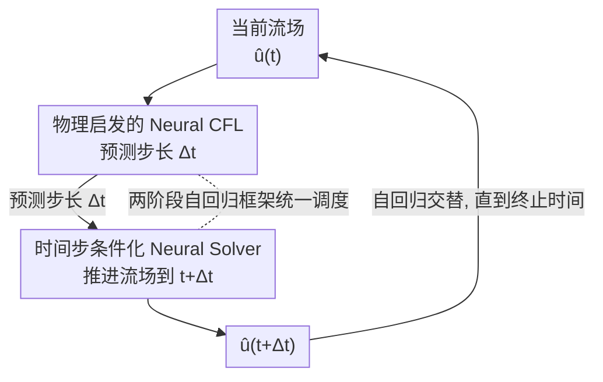

# A Two-Phase Deep Learning Framework for Adaptive Time-Stepping in High-Speed Flow Modeling

**会议**: ICLR2026  
**OpenReview**: [https://openreview.net/forum?id=d4gzLgGl7I](https://openreview.net/forum?id=d4gzLgGl7I)  
**代码**: https://github.com/divelab/AIRS （ShockCast 作为 AIRS 库一部分开源）  
**领域**: 科学计算 / 流体力学 / 神经 PDE 求解器  
**关键词**: 高速流动, 自适应时间步, 神经 PDE 求解器, CFL 条件, 时间步条件化

## 一句话总结
ShockCast 把"高速流动的自适应时间步进"拆成两个学习问题——先用一个 Neural CFL 模型根据当前流场预测下一步该走多大的时间步 $\Delta t$，再用一个被 $\Delta t$ 条件化的 Neural Solver 把流场往前推进 $\Delta t$，两者在推理时自回归交替，从而让神经求解器能在含激波的超声速流场上像经典求解器一样"该细的地方细、该粗的地方粗"。

## 研究背景与动机
**领域现状**：用神经网络加速流体模拟（learning fluid dynamics）目前几乎都聚焦在**低速、不可压缩**的场景。这类流动的时间尺度相对稳定，$\|\partial_t u(t)\|$ 不剧烈波动，所以可以全程用一个**固定的时间步长**做时间推进，既简单又不太损精度。

**现有痛点**：可一旦流速逼近或超过声速（超声速 $1<M<5$、高超声速 $M>5$，$M=v/a$ 是马赫数），流场里会冒出激波、膨胀扇、强压缩效应这类**局部时间尺度极小**的现象。要分辨激波就得用很小的步长，但激波耗散后流场又变光滑、时间尺度回升。经典高速求解器对此的标准答案是**自适应时间步进**：梯度尖锐处走小步、光滑处走大步，由 CFL 条件 $\Delta t \le \frac{C}{\lambda_{\max}}\min_{x,y}(\Delta x,\Delta y)$ 算出每步该多大。

**核心矛盾**：神经求解器的加速来自**在时空粗化网格上**学习"跨数百个经典求解步"的映射，而且往往只显式建模一部分物理变量。这让经典 CFL 条件**用不了**——式子里的 $\Delta x,\Delta y$ 是细网格的、算出来的 $\Delta t$ 比神经求解器实际跨越的步长小好几个数量级；多相流的 CFL 形式还涉及大量场变量，直接照搬等于逼着神经网络去演化所有变量、反而稀释了对关注场的建模能力。固定步长对神经求解器同样不友好：同一个 $\Delta t$ 下，尖锐梯度状态的 $\|u(t+\Delta t)-u(t)\|$ 远大于光滑状态，训练样本难度极不均衡。

**本文目标**：让神经求解器能在**带自适应时间分辨率**的高速流动数据上训练与推理，既复现经典求解器的演化、又复现它"怎么选步长"的过程。

**切入角度**：作者注意到——既然 CFL 条件本身在粗网格上不可直接计算，那就**把"算步长"也变成一个监督学习问题**，用一个轻量模型在粗时空网格、只看子集变量的条件下学一个"代理 CFL 条件"。

**核心 idea**：用"预测步长 + 步长条件化推进"这一对神经模块，替代"经典 CFL 公式 + 固定/经典步长"，实现神经求解器上的自适应时间步进。

## 方法详解

### 整体框架
ShockCast 把一次"前进一步"分解成两个相继的阶段。数据集 $\mathcal{D}=\{U_i\}_{i}^{N}$ 是经典高速求解器算出的可压 Navier–Stokes 解，每条轨迹 $U=\{u_j\}_j^n$ 是在**粗化时间网格**（每隔 $J\ge100$ 个求解步取一帧）上的快照序列，$u_j\in\mathbb{R}^{D\times M}$ 有 $M$ 个网格点、$D$ 个场。

- **第一阶段（Neural CFL）**：模型 $\psi$ 吃当前流场 $u_j$，预测对应的时间步 $\Delta_j$，训练目标是 MAE：$\mathbb{E}_{j,U}[L_c(\psi(u_j),\Delta_j)]$。它学的不是"演化流场"，而是"经典求解器当初是怎么选这个步长的"。
- **第二阶段（Neural Solver）**：模型 $\phi$ 吃当前流场 $u_j$ 与步长 $\Delta_j$，预测下一帧 $u_{j+1}$，one-step 目标用逐场平均的相对误差 $\mathbb{E}_{j,U}[L_s(\phi(u_j,\Delta_j),u_{j+1})]$。

推理时给定初始条件 $u_0$，两阶段**自回归交替**：$\hat{\Delta t}:=\psi(\hat u(t))$，$\hat u(t+\hat{\Delta t})=\phi(\hat u(t),\hat{\Delta t})$，直到到达预设终止时间。关键约束是：推理时预测的 $\Delta t$ 必须和训练数据里的 $\Delta t$ 分布对齐，否则 Neural Solver 会遭遇测试期分布漂移——这正是为什么步长要"学"而不是"算"。

### 关键设计

**1. 两阶段自回归框架：把"选步长"和"推进流场"拆成两个学习问题**

直接照搬经典自适应时间步进会撞上"粗网格上 CFL 公式失效"的墙：神经求解器跨越数百个经典步、只建模子集变量，CFL 给出的步长比它实际需要的小几个数量级，而且多相流的 CFL 形式会逼它演化全部变量。ShockCast 的破局点是把这件事**解耦**——Neural CFL $\psi$ 只负责"在粗时空网格、只看关注场的前提下，模仿经典求解器当初的选步过程"，Neural Solver $\phi$ 只负责"给定步长把流场往前推"。两者各自有干净的监督信号（$\psi$ 监督到真实 $\Delta_j$，$\phi$ 监督到 $u_{j+1}$），训练互不耦合，推理时再自回归地串起来。这种拆法的妙处在于：自适应步长让 $\phi$ 的 one-step 目标 $\|u(t+\Delta t)-u(t)\|$ 在尖锐/光滑样本间更均匀，降低了训练目标的方差；同时直接吃经典求解器原生的非均匀时间网格，免去了插值到均匀网格带来的额外误差。

**2. 物理启发的 Neural CFL：让网络带着 CFL 条件的"先验结构"去预测步长**

如果让 Neural CFL 裸学一个 $u_j\mapsto\Delta_j$ 的回归，它丢掉了经典 CFL 条件里所有有用的物理结构。作者据此往输入和内部结构里**注入三处物理先验**：其一，既然自适应步长是按 $u(t)$ 梯度的尖锐程度调的，就把所有场的**空间梯度** $\nabla u$（有限差分算）加进输入；其二，CFL 条件依赖**最大波速** $\lambda_{\max}=\max_{x,y}\lambda(x,y)$，其中 $\lambda(x,y)=\max(|u|+a,\,|v|+a)$，这个"对全场取 max"的操作本质是一次 max pooling，于是作者干脆把网络的**空间下采样函数换成 max pooling**，让结构本身对齐 $\lambda_{\max}$ 的语义；其三，额外把 **CFL 特征**（局部波速 $\lambda(x,y)$、速度幅值 $|u|,|v|$、局部声速 $a(x,y)=\sqrt{\gamma R T}$）拼进输入，相当于把"组成 CFL 条件的函数"喂给网络去学一个代理条件。实验显示这些增强在**单相**问题（circular blast）上未必有益——此时建模变量本身就足以定步长，裸模型反而最好；但在**多相**问题（coal dust explosion，CFL 形式更复杂、要同时管气相和固相）上收益显著，最佳组合是 $\nabla u$ + max pooling + CFL 特征。

**3. 步长条件化的 Neural Solver：三种把 $\Delta t$ 注入求解器的策略**

Neural Solver 必须"知道"自己这一步要推进多大的 $\Delta t$，否则没法对可变时长的演化做出正确响应。作者给出三条递进的条件化路线。**Affine（时间条件化 LayerNorm / 空间-谱条件化）**是基线：把 $\Delta t$ 嵌成 scale/shift 向量 $a,b$，在每个归一化层后做 $\mathrm{LN}(z)(1+a)+b$；对 F-FNO 这类在傅里叶空间做卷积、默认不带归一化层的模型，则改用空间-谱条件化——把特征图的傅里叶变换与 $\Delta t$ 的复数嵌入 $\xi$ 逐点相乘 $\mathcal{F}(z)\xi$。**Euler Residuals**把残差连接和欧拉积分的对应关系用到点子上：注意到 $v(t+\Delta t)\approx v(t)+\Delta t\,\partial_t v(t)$ 恰好对应 $z_{l+1}=z_l+F_l(z_l)$，于是把层间残差改写成 $z_{l+1}=z_l+aF_l(z_l)$，其中 $a=W\Delta t+c$ 是 $\Delta t$ 的仿射变换——把"这一层积分多长时间"显式绑到步长上。**Mixture of Experts**进一步用按 $\Delta t$ 门控的专家混合 $z_{l+1}=z_l+\sum_k^K G_l(\Delta t)_k\,(a_k F_{l,k}(z_l))$，让不同专家分别擅长"短步、尖锐梯度"和"长步、光滑动力学"，代价是路由是稠密的（不享受稀疏 MoE 的省算红利），用更多算力换更大容量。

### 损失函数 / 训练策略
两阶段独立训练：Neural CFL 用 MAE $L_c$ 拟合真实步长；Neural Solver 用逐场平均相对误差 $L_s$ 做 one-step 监督，并采用 Sanchez-Gonzalez 等的**噪声注入**策略提升自回归 rollout 的稳定性。规则域用 ConvNeXt 作 Neural CFL 骨干、不规则的 Airfoil 域用带逐层空间下采样的 GNN；Neural Solver 在规则域试了 U-Net / CNO / F-FNO / Transolver，在 Airfoil 域试了 MeshGraphNets 与 Diffusion Graph Nets。

## 实验关键数据

### 主实验
作者自建三套超声速流动数据集评测，指标为关联时间占比（Correlation Time Proportion，相关系数跌破 0.9 前的时刻占总时长比例，↑）、湍动能误差（TKE Error，↓）、平均流误差（Mean Flow Error，↓）。

| 数据集 | 设置 | 案例数(训练/测试) | 马赫数范围 |
|--------|------|------|------|
| Coal Dust Explosion | 气-固两相，激波卷起煤尘 | 100 (90/10) | 初始激波 1.2–2.1 |
| Circular Blast | 二维 Sod 激波管的圆形版 | 99 (90/9) | 最大 0.49–2.97 |
| Airfoil Shock | 激波冲击 NACA 0012 翼型 | 100 (90/10) | 初始激波 1.2–2.1，攻角 ±8° |

并额外扩展出 Spherical Blast（3D，验证可扩展性）与 Long Circular Blast（>100 个自回归步，验证长时稳定性）。

### 消融实验

| 配置 | 现象 | 说明 |
|------|------|------|
| Neural CFL 裸模型 | circular blast 上最好 | 单相问题，建模变量已足以定步长 |
| + $\nabla u$ + max pool + CFL 特征 | coal dust 上最好 | 多相 CFL 更复杂，物理先验收益显著 |
| Affine 条件化 | 基线 | TCLN / 空间-谱条件化 |
| Euler / MoE 条件化 | TKE 误差普遍更低 | 步长显式绑进残差/门控更有效 |

### 关键发现
- **物理先验的收益取决于问题相态**：单相 circular blast 上 Neural CFL 不需要额外特征，多相 coal dust explosion 上 $\nabla u$+max pooling+CFL 特征带来明显提升——说明增强是"对症"的而非万能。
- **条件化策略与骨干/指标耦合**：关联时间上 U-Net + 时间条件化 LayerNorm 最稳；但 TKE 误差上 Euler / MoE 条件化（coal dust 配 U-Net、circular blast 配 F-FNO）更优，F-FNO+MoE 还拿下 circular blast 的最低平均流误差——没有单一最优组合。
- **长时与高维稳定性**：Long Circular Blast 上解能保持相关约 0.9 至约半程，低 TKE/平均流误差说明预测仍在分布内；Airfoil Shock 上 DGN 全面优于 MGN，3D Spherical Blast 也跑通，验证了框架的可扩展性。
- **预测步长贴合真值**：自回归 unrolling 出的 $\Delta t$ 与 ground-truth $\Delta t$ 曲线几乎重合（Figure 3），说明 Neural CFL 确实学到了代理 CFL 条件。

## 亮点与洞察
- **把"自适应时间步"重构成一个可学习子问题**：这是最核心的"啊哈"——经典 CFL 公式在神经求解器的粗网格设定下失效，作者没有去修公式，而是把"选步长"整体当成监督回归来学，绕开了 $\Delta x,\Delta y$ 不匹配与多相变量爆炸的死结。
- **用结构对齐物理而非堆特征**：把 max pooling 选为下采样函数，正是因为它在语义上对应 CFL 里的 $\lambda_{\max}$ 全场取 max——这种"让网络结构本身携带物理算子"的思路可迁移到其他有明确物理算子的代理建模任务。
- **残差=欧拉积分的视角被用活了**：Euler Residuals 把"层间残差 ≈ 一步欧拉积分"这一已知关系，落地成"积分时长由 $\Delta t$ 仿射控制"，是把理论对应转成可条件化机制的漂亮一手，且几乎零额外成本。
- **自适应步长顺带均衡了训练难度**：反比于变化率缩放 $\Delta t$ 让 one-step 目标在尖锐/光滑样本间更均匀——这是从"数值稳定性"需求里意外收获的"机器学习友好性"。

## 局限与展望
- **稠密 MoE 不省算**：作者明确承认 MoE 路由是稠密的，享受不到稀疏 MoE 的条件计算红利，是用更高算力换容量；要真正落地大规模高速流动，稀疏化是个自然待办。
- **两阶段误差会累积**：Neural CFL 的步长预测误差会经自回归喂给 Neural Solver，长 rollout（如 Long Circular Blast 半程后相关性下滑）暴露了这一耦合，端到端联合训练或步长不确定性建模值得探索。
- **评测仍偏超声速二维**：核心数据集集中在 $M\lesssim3$ 的超声速二维场景，高超声速（$M>5$，含强激波相互作用、化学反应）尚未覆盖，是论文动机里提到却未实验的部分。
- **无与经典求解器的加速比/精度直接对照表**：论文主打"神经可行性"，但缺一张"ShockCast vs 经典 CFD 求解器"的端到端 wall-clock 加速与守恒量误差对照，读者较难量化"省了多少算"。

## 相关工作与启发
- **vs 学习空间重网格（Pfaff 2021 / Song 2022 等）**：以往可学习重网格几乎都做**空间** re-meshing，本文是据作者所知**首个**用"可变时间分辨率数据"学习**时间** re-meshing 的工作，这对高速流动尤其关键。
- **vs 连续时间/任意时刻查询（Wu 2025 / Janny 2024 / Hagnberger 2024）**：这些方法在**时间均匀**数据上学插值器或条件神经场以查询任意时刻，ShockCast 反过来直接吃**非均匀**自适应数据并显式预测步长，避免了对均匀网格的依赖。
- **vs 已知步长的多步条件化（Gupta & Brandstetter 2023 / Herde 2024）**：它们把时间步条件化当成"步长先验已知"的基准或预训练任务；ShockCast 指出这一假设在高速流动里不现实，并补上了"步长从哪来"的 Neural CFL 这一环。

## 评分
- 新颖性: ⭐⭐⭐⭐⭐ 首个把高速流动的自适应**时间**步进重构成可学习两阶段问题，切入角度干净且有效。
- 实验充分度: ⭐⭐⭐⭐ 自建三套数据集 + 多骨干 × 多条件化 + 3D/长时扩展，但缺与经典求解器的直接加速/精度对照。
- 写作质量: ⭐⭐⭐⭐⭐ 动机推导严谨，把"为何 CFL 公式失效"讲得透彻，方法与物理动机一一对应。
- 价值: ⭐⭐⭐⭐ 为神经高速流动求解开了一个可复用的范式，并开源数据与代码（AIRS 库）。

<!-- RELATED:START -->

## 相关论文

- [\[ICLR 2026\] Deep Hierarchical Learning with Nested Subspace Networks for Large Language Models](deep_hierarchical_learning_with_nested_subspace_networks_for_large_language_mode.md)
- [\[ICLR 2026\] MesaNet: Sequence Modeling by Locally Optimal Test-Time Training](mesanet_sequence_modeling_by_locally_optimal_test-time_training.md)
- [\[ICML 2025\] Curse of High Dimensionality Issue in Transformer for Long-context Modeling](../../ICML2025/llm_efficiency/curse_of_high_dimensionality_issue_in_transformer_for_long-context_modeling.md)
- [\[ICLR 2026\] DASH: Deterministic Attention Scheduling for High-throughput Reproducible LLM Training](dash_deterministic_attention_scheduling_for_high-throughput_reproducible_llm_tra.md)
- [\[ICLR 2026\] CONCUR: A Framework for Continual Constrained and Unconstrained Routing](concur_a_framework_for_continual_constrained_and_unconstrained_routing.md)

<!-- RELATED:END -->
