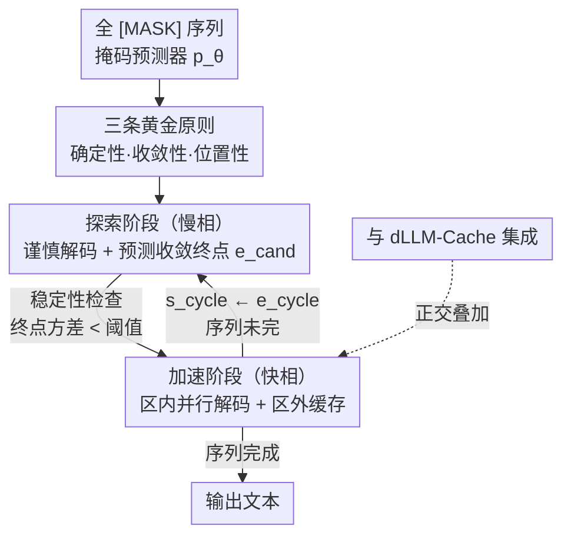

# Accelerating Diffusion Large Language Models with SlowFast Sampling: The Three Golden Principles

**会议**: ICLR 2026  
**OpenReview**: [https://openreview.net/forum?id=Uh17FiwF4q](https://openreview.net/forum?id=Uh17FiwF4q)  
**代码**: https://github.com/LiangrunFlora/Slow-Fast-Sampling  
**领域**: LLM效率 / 扩散语言模型 / 推理加速  
**关键词**: 扩散语言模型, 并行解码, 采样加速, 置信度, 特征缓存

## 一句话总结
针对扩散语言模型（dLLM）现有采样策略"速度恒定、不会随生成状态调整"的问题，本文先总结出三条经验规律（确定性、收敛性、位置性），据此设计了在"慢相探索"与"快相加速"之间动态切换的 SlowFast Sampling，并可与 dLLM-Cache 正交叠加——在 GPQA 上对 LLaDA 实现最高 15.63× 加速、叠加缓存后达 34.22×，精度几乎无损。

## 研究背景与动机

**领域现状**：扩散语言模型（dLLM，如 LLaDA、Dream）是自回归 LLM 的一种新替代范式。它从一个全 `[MASK]` 的序列出发，用掩码预测器 $p_\theta$ 迭代去噪 $N$ 步，每步可以**并行**地解出多个 token，而不像自回归那样严格一个接一个，因此理论上能大幅降低长序列的推理延迟。

**现有痛点**：但现有采样策略并没把这个潜力发挥出来。主流做法有两类——基于置信度的选择（如 Fast-dLLM：置信度超过阈值的 token 才解码）和半自回归解码（把序列切成固定块、块内逐步去噪）。它们都有一个共性毛病：**行为是静态的**，整段生成过程中每步解多少 token、解哪里基本固定不变；一旦想"一步多解"提速，精度就明显掉。

**核心矛盾**：采样的"激进程度"应当随生成状态而变——序列里有些区域已经被模型想清楚了（高置信、稳定），完全可以一口气并行解出；另一些区域还很模糊，硬解就会出错。静态策略无法区分这两种情况，只能要么整体保守（慢）、要么整体激进（掉点）。

**本文目标**：设计一个动态采样器，能**智能地决定每步解多少 token、以及这些 token 落在序列的哪个位置**，在高并行度下仍保住质量。

**切入角度**：作者先对 LLaDA 这类模型的去噪轨迹做实证观察，发现 token 的置信度演化呈现出几条稳定规律——高置信 token 往往就是最终答案、置信度会随步数收敛到稳定值、且高置信 token 倾向于成片聚集而非随机散布。这些规律恰好给"何时能放心加速、加速哪一段"提供了判据。

**核心 idea**：把这三条规律提炼为"三条黄金原则"，并据此让采样在"慢相小心探路、圈出稳定区"与"快相在稳定区里并行猛解、区外缓存复用"之间循环切换。

## 方法详解

### 整体框架

SlowFast Sampling 把一次完整生成拆成若干个"探索→加速"的循环周期，每个周期处理序列上一段从 $s_{\text{cycle}}$ 开始的区域。**慢相（探索阶段）**小心地每步只解几个最高置信的 token，同时不断预测"当前能放心解到多远"这个收敛终点 $e_{\text{cand}}$，并用一个滑动窗口监控这个终点是否稳定下来；一旦终点的方差低于阈值，就认定 $[s_{\text{cycle}}, e_{\text{cycle}}]$ 是一段稳定区，慢相结束。**快相（加速阶段）**在这段稳定区内对所有超过高置信阈值的 token 一次性并行解码，区外暂时跳过的低置信 token 则把预测值缓存起来留待复用。一个周期结束后把起点更新为 $s_{\text{cycle}} \leftarrow e_{\text{cycle}}$，进入下一周期，直到整条序列生成完毕。三条黄金原则贯穿其中：确定性与位置性帮助"找到该加速的成片区域"，收敛性帮助"判断这段区域是否已经稳了"。

### 关键设计

**1. 三条黄金原则：把"何时能加速、加速哪一段"变成可量化的判据**

这是全方法的观察基石，针对的是"静态采样不知道哪里能放心提速"。作者对去噪轨迹的实证分析得到三条规律：**确定性原则**——置信度 $P_\theta(\hat r^{(k)}_{0,i}\mid c, y^{(k)})$ 高的 token 更可能就是最终正确结果、后续步骤几乎不再变，因此值得优先"接受"、少做重采样；**收敛性原则**——随去噪步数 $k$ 减小，单个 token 的预测身份和置信度会先波动、再收敛到一个稳定值，收敛即代表模型对它已形成一致判断；**位置性原则**——高置信、早收敛的 token 不是随机散落，而是成片聚集在相邻区域（可能源于局部语义依赖），因此可以按"区域"而非"逐个"地集中算力。三条原则合起来说明：一刀切的静态采样必然低效，应当让"解多少、按什么标准选、解在哪"都随序列演化而自适应。

**2. 探索阶段（慢相）：边谨慎解码，边圈出下一段稳定区**

这一步针对"不知道哪段已经稳了、不能盲目并行"的痛点。从当前起点 $s_{\text{cycle}}$ 到序列末尾 $L$，慢相每个去噪步只做保守更新——在窗口 $[s_{\text{cycle}}, L]$ 内挑出置信度最高的 top-$k_{\text{slow}}$ 个 token 解掉。与此同时，模型预测一个**收敛终点候选** $e^{(k)}_{\text{cand}}$，即满足最低置信阈值的最远位置：

$$e^{(k)}_{\text{cand}} = \max\{\, i \mid i \in [s_{\text{cycle}}, L] \,\wedge\, P_\theta(\hat r^{(k)}_{0,i}\mid c, y^{(k)}) > \tau_{\min\_conf} \,\}$$

它表示"当前这一步我能放心解到多远"。再用一个长度为 $W_{\text{hist}}$ 的滑动窗口 $H_W$ 收集最近若干步的候选终点，做**稳定性检查**：当窗口内终点的方差 $\mathrm{Var}(H_W) < \sigma^2_{\text{stable}}$ 时，说明这段区域的"可解边界"已经稳定，慢相在该步 $k_{\text{final}}$ 结束；最终的周期终点 $e_{\text{cycle}}$ 取窗口内候选终点的均值。本质上，慢相用确定性原则选 token、用位置性原则估边界、用收敛性原则（方差判据）确认稳定，从而把"可以安全加速的成片区域"精确地框出来。

**3. 加速阶段（快相）：区内一次性并行猛解，区外缓存复用**

拿到稳定区 $[s_{\text{cycle}}, e_{\text{cycle}}]$ 后，快相要做的是把这段快速解完、同时省掉区外的冗余计算。**区内并行解码**：对区内所有还是 `[MASK]` 且置信度超过高确定性阈值的位置，

$$P_\theta(\hat r^{(k)}_{0,i}\mid c, y^{(k)}) > \tau_{\text{high\_conf}}$$

在同一步里一次性全部解出，而不是逐个慢慢来——这正是把确定性原则"高置信即定型"用到极致。**区外缓存**：对 $i > e_{\text{cycle}}$ 且置信度仍低的位置，把这一步算出的预测值 $\hat r^{(k)}_{0,i}$ 缓存下来，只要它还没进入活跃解码区就直接复用，避免重复前向。**回退机制**：如果区内满足高阈值的 token 太少（不足以推进），就退化为保守地选 top-$k_{\text{fast}}$ 个最高置信 token 解掉，保证每步都有稳定进展。三招配合既快又稳，解完一个周期就把起点推进到 $e_{\text{cycle}}$ 继续循环。

**4. 与 dLLM-Cache 正交叠加：采样加速与特征缓存互不冲突**

SlowFast 优化的是"采样策略本身"（解的顺序与并行度），而 dLLM-Cache 这类方法优化的是"特征复用"（缓存中间表示减少前向计算），两者作用在不同维度，因此可以**直接叠加**而非互斥。论文把 SlowFast 与 dLLM-Cache 联合使用，缓存的提示侧长间隔与响应侧短间隔进一步削掉冗余前向，使加速比在单用 SlowFast 的基础上再上一个台阶——GPQA 上从 15.63× 提到 34.22×。这条设计的价值在于：它把"采样层加速"做成了一个能与现有缓存生态协作的正交模块，而不是又一个互相打架的孤立方案。

## 实验关键数据

设置：在 LLaDA 8B 与 Dream 7B 上、覆盖数学/科学、通用、代码三类共 8 个基准（GSM8K、GPQA、Math、MMLU、MMLU-pro、BBH、MBPP、HumanEval），单卡 RTX 4090，以 TPS（每秒 token 数）衡量速度、任务准确率衡量质量。默认超参 $\tau_{\min\_conf}=0.1$、$\tau_{\text{high\_conf}}=0.85$、$K_{\max}=8$、$W_{\text{hist}}=2$、$\sigma^2_{\text{stable}}=1.0$。

### 主实验：仅用 SlowFast（LLaDA 8B 部分）

| 任务 | 方法 | TPS | 加速比 | 准确率 |
|------|------|-----|--------|--------|
| GSM8K | LLaDA 原版 | 4.55 | 1.00× | 69.83 |
| GSM8K | + Fast-dLLM | 7.45 | 1.64× | 69.60 |
| GSM8K | + SlowFast | 14.57 | 3.20× | 69.59 |
| GPQA | LLaDA 原版 | 3.31 | 1.00× | 31.47 |
| GPQA | + SlowFast | 16.36 | 4.94× | 31.91 |
| BBH | LLaDA 原版 | 4.04 | 1.00× | 44.97 |
| BBH | + SlowFast | 21.19 | 5.24× | 44.60 |
| HumanEval | LLaDA 原版 | 11.24 | 1.00× | 31.71 |
| HumanEval | + SlowFast | 35.46 | 3.15× | 33.54 |

可见 SlowFast 在大多数任务上加速 2–5×、准确率几乎不变（多数 ±1 以内），且在同等设定下普遍快于 Fast-dLLM 并行版。

### 叠加 dLLM-Cache + 极端加速对比

| 任务/对比 | 方法 | TPS | 加速比 | 准确率 |
|-----------|------|-----|--------|--------|
| GPQA（叠加缓存） | + SlowFast + Cache | 29.06 | 8.78× | 33.48 |
| BBH（Dream，叠加缓存） | + SlowFast + Cache | 70.20 | 10.13× | 48.24 |
| GPQA（Len=1024） | LLaDA + SlowFast | 25.00 | 15.63× | 31.47 |
| GPQA（Len=1024） | + SlowFast + Cache（$K_p{=}100,K_r{=}5$） | 48.80 | 30.50× | 30.13 |
| GPQA（Len=1024） | + SlowFast + Cache（$K_p{=}500,K_r{=}30$） | 54.75 | 34.22× | 28.79 |
| GPQA 参照 | LLaMA3 8B（自回归） | 33.79 | — | 31.92 |

值得注意的是：叠加缓存后 LLaDA 的吞吐（54.75 TPS）甚至超过自回归强基线 LLaMA3 8B（33.79 TPS），而准确率仍可比——这是"扩散范式经过良好采样设计后能反超自回归吞吐"的直接证据。

### 采样策略对比（GSM8K，LLaDA）

| 采样策略 | TPS | 准确率 |
|----------|-----|--------|
| 自回归（AR） | 5.25 | 60.80 |
| 扩散采样 | 4.55 | 69.83 |
| 半自回归 | 5.44 | 66.41 |
| SlowFast | 9.87 | 69.59 |

### 关键发现
- **加速比上限来自"叠加"而非单点**：单用 SlowFast 在 GPQA 上 15.63×，叠加 dLLM-Cache 跃升至 34.22×，说明采样层与缓存层的收益可乘性很强。
- **激进解码的代价随并行度上升**：缓存配置越激进（$K_p,K_r$ 越大），加速越高但准确率从 31.47 逐步掉到 28.79，存在明确的速度-质量权衡，需按场景取舍。
- **稳定性检查的超参不敏感但有讲究**：$K_{\max}=8$ 给收敛终点足够的探索余量；由于预测变化与收敛发生得很快，小窗口 $W_{\text{hist}}=2$ 即可在质量与速度间取得好平衡；严格的方差阈值 $\sigma^2_{\text{stable}}=1.0$ 确保只在真正稳定的区域才触发快相。
- **慢相负责"锚点"、快相负责"成段"**：案例分析显示慢相先输出主语/动词/标点等少量可靠 token 给句子打桩，快相再一次性吐出"she has 9 - 4 = 5 yuan left"这样的高置信长片段，二者交替兼顾了效率与正确性。

## 亮点与洞察
- **从"观察规律"反推"算法设计"**：论文先把 dLLM 去噪轨迹的经验现象提炼成三条可量化原则，再让每条原则对应算法里的一个判据（确定性→选 token、位置性→估区域、收敛性→方差稳定判据），方法的每一步都有据可依，而不是拍脑袋调采样。
- **用"方差稳定"判断何时切换相位很巧妙**：把"这段区域是否已经想清楚"转化为收敛终点 $e_{\text{cand}}$ 的滑窗方差判据，是个轻量又可解释的信号，几乎零额外开销就实现了动态相位切换。
- **正交叠加的工程价值**：SlowFast 不和缓存方案竞争同一块收益，而是作用在采样维度，可与 dLLM-Cache 直接相乘——这种"做成正交模块"的思路很容易迁移到其他 dLLM 加速研究里。
- **打破"扩散比自回归慢"的刻板印象**：实验直接给出 LLaDA+SlowFast+Cache 吞吐反超 LLaMA3 8B 的结果，为 dLLM 作为高效推理路线提供了说服力。

## 局限与展望
- **速度-质量权衡仍在**：极端加速配置下准确率有可见下滑（GPQA 31.47→28.79），论文没有给出在固定精度损失预算下自动选取最优加速配置的机制。
- **超参依赖人工设定**：$\tau_{\min\_conf}$、$\tau_{\text{high\_conf}}$、$\sigma^2_{\text{stable}}$ 等阈值是全局固定的，不同任务/序列长度下最优值可能不同，缺乏自适应整定。
- **规律的普适性待验证**：三条黄金原则主要在 LLaDA、Dream 上观察得到，是否在更大规模或不同训练方式的 dLLM 上同样成立、阈值是否需要重标定，论文未充分覆盖。
- **位置性原则的利用偏启发式**：成片聚集现象被用于缓存与区域解码，但"为什么会聚集"只给了局部语义依赖的猜测，缺乏更深入的机理分析，改进空间在于把位置先验做成可学习的预测器。

## 相关工作与启发
- **vs Fast-dLLM（置信度并行）**: Fast-dLLM 只按"置信度是否超阈值"做并行解码，全程速度恒定；本文额外引入收敛性与位置性，能动态判断"哪段稳了再猛解"，在同等任务上普遍更快且质量更稳。
- **vs 半自回归解码**: 半自回归把序列切成固定块、块内去噪，块边界是预设死的；SlowFast 的稳定区 $[s_{\text{cycle}}, e_{\text{cycle}}]$ 是按收敛状态动态圈定的，边界随生成内容自适应，更贴合"高置信区成片出现"的实际分布。
- **vs dLLM-Cache / dKV-Cache 等缓存方法**: 这些方法优化的是特征复用维度；本文优化采样维度，二者正交可叠加，论文实验正是把 SlowFast 与 dLLM-Cache 联合使用拿到最高加速比。

## 评分
- 新颖性: ⭐⭐⭐⭐ 把去噪轨迹的经验规律系统化为三条原则并落到动态相位切换的采样器，角度新且自洽。
- 实验充分度: ⭐⭐⭐⭐ 覆盖两模型 8 基准、含缓存叠加与采样策略对比，但超参敏感性与跨模型普适性的分析略浅。
- 写作质量: ⭐⭐⭐⭐ 原则→方法→实验的逻辑清晰，公式与案例配合到位。
- 价值: ⭐⭐⭐⭐⭐ 实测让 dLLM 吞吐反超自回归强基线，对推动扩散语言模型走向实用有直接意义。

<!-- RELATED:START -->

## 相关论文

- [\[ICLR 2026\] NI Sampling: Accelerating Discrete Diffusion Sampling by Token Order Optimization](ni_sampling_accelerating_discrete_diffusion_sampling_by_token_order_optimization.md)
- [\[ICLR 2026\] Learning to Parallel: Accelerating Diffusion Large Language Models via Learnable Parallel Decoding](learning_to_parallel_accelerating_diffusion_large_language_models_via_learnable_.md)
- [\[ACL 2026\] CreditDecoding: Accelerating Parallel Decoding in Diffusion Large Language Models with Trace Credit](../../ACL2026/llm_efficiency/creditdecoding_accelerating_parallel_decoding_in_diffusion_large_language_models.md)
- [\[ICLR 2026\] Diffusion Language Models Know the Answer Before Decoding](diffusion_language_model_knows_the_answer_before_it_decodes.md)
- [\[ICLR 2026\] UltraLLaDA: Scaling the Context Length to 128K for Diffusion Large Language Models](ultrallada_scaling_the_context_length_to_128k_for_diffusion_large_language_model.md)

<!-- RELATED:END -->
