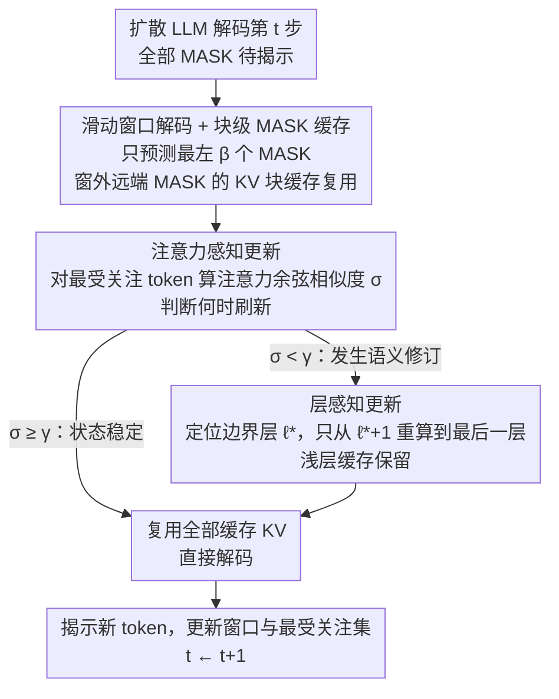

# Attention Is All You Need for KV Cache in Diffusion LLMs

**会议**: ICLR 2026  
**OpenReview**: [https://openreview.net/forum?id=zkUbhdAiFJ](https://openreview.net/forum?id=zkUbhdAiFJ)  
**项目页**: [https://vila-lab.github.io/elastic-cache-webpage/](https://vila-lab.github.io/elastic-cache-webpage/)  
**代码**: 待确认  
**领域**: LLM效率 / 扩散语言模型 / KV Cache  
**关键词**: 扩散语言模型, KV Cache, 自适应缓存, 注意力漂移, 推理加速

## 一句话总结
针对扩散语言模型（DLM）每步都重算全部 token、全部层 KV 的冗余问题，本文提出训练无关、架构无关的 Elastic-Cache：用「最受关注 token 的注意力漂移」判断**何时**刷新缓存、用「深层先变」的规律决定**从哪层往上**刷新，并对滑动窗口外的远端 MASK token 做块级缓存，在 LLaDA / Dream-7B 等模型上实现最高 45.1× 解码加速且几乎不掉点。

## 研究背景与动机

**领域现状**：扩散语言模型（LLaDA、Dream-7B 等）用「迭代去噪 / 逐步揭示 MASK」的方式生成文本，作为自回归 Transformer 的替代路线，能并行解码、灵活填空，质量已逼近自回归模型。但它的每一步去噪都要对**所有 token、所有层**重新计算 Q/K/V，推理极其昂贵。

**现有痛点**：自回归模型靠 KV Cache 复用历史，因为因果注意力下历史 K/V 永远不变（$K^{t-1}_{[1:t-1]}=K^{t}_{[1:t-1]}$）。但扩散 LLM 是**双向注意力**，每步新揭示的 token 会改变所有位置的表示，缓存的 K/V 会"过期"，于是朴素实现只能每步全量重算。

**核心矛盾**：现有加速方法（Fast-dLLM、dLLM-Cache、DeepCache）大多用**固定周期**刷新（每 $k$ 步刷一次），与实例难度、当前注意力、层间差异都无关。这导致两头不讨好：在状态没变时白白重算、在语义剧烈修订时又错过更新；同时对所有层一视同仁——浅层早已收敛却被反复重算，深层变化最大却服务不足。

**切入角度**：作者引入 **KV drift（KV 漂移）**——相邻两步缓存 K/V 的变化量，并观察到三条经验规律：(1) 远端 MASK token 主要充当"长度先验"，对当前揭示几乎没影响；(2) KV 漂移随层深增大（浅层快速稳定、深层持续调整全局语义）；(3) **最受关注的 token 漂移最小**，可作为其他 token 变化量的保守下界。

**核心 idea**：把 KV 缓存管理重构成"注意力引导的控制问题"——注意力告诉你哪些 token 重要、漂移告诉你状态变了多少、边界层 $\ell^\star$ 告诉你更新从哪开始划算，从而做到自适应、按层、按需的缓存刷新。

## 方法详解

### 整体框架

Elastic-Cache 的目标：在解码每一步**自适应地决定何时、何处重算 KV**，既保精度又压延迟。它把"全 token 全层重算"拆成三个正交决策：① 空间上，用**滑动窗口**只预测最左侧 $\beta$ 个 MASK，窗口外远端 MASK 的 KV 做块级缓存复用；② 时间上，用**注意力感知更新**监控最受关注 token 的注意力漂移，超阈值才触发刷新；③ 层级上，用**层感知更新**只从被触发的边界层 $\ell^\star$ 往深层重算，浅层缓存原样复用。三者共同把重算对齐到"模型信念真正改变的时间和位置"。

### 关键设计

**1. 滑动窗口解码 + 块级 MASK 缓存：把"远端 MASK 不重要"变成可缓存的空间结构**

朴素扩散解码每步对全序列算注意力，但作者从注意力图（图 1a）观察到：滑动窗口内相邻的 MASK token 彼此强注意，而**远处的 MASK token 几乎不被关注**——它们更像一个"长度先验"。据此，作者在每步只对最左侧、长度为 $\beta$ 的窗口 $M^t_\beta = M^t_{[1:\beta]}$ 做预测和注意力计算，窗口外的 MASK token 的 K/V 直接块级缓存复用：

$$A^{t,l}_{[M^{t-1}_\beta]} = \mathrm{softmax}\!\left(\frac{Q^{t,l}_{[M^{t-1}_\beta]}(\tilde K^{t,l}_{[I]})^\top}{\sqrt{d_k}}\right)\tilde V^{t,l}_{[I]}$$

它和 Fast-dLLM 的块级解码相似，但关键区别在于：块级解码把序列切成固定块、块内一起解码，容易在块边界附近"误冻结"仍需更新的 MASK，导致预测变差；而滑动窗口随解码从左到右平滑移动，把真正互相关注的近邻 MASK 聚在一起预测，减少了对远端 MASK 的缓存损失，缓存更激进但更安全。

**2. 注意力感知 KV 更新：用最受关注 token 的注意力漂移当"何时刷新"的轻量触发器**

这是全文最核心的创新——**自动判断**该不该刷新缓存。直接比较隐藏状态 $H^{t,l+1}$ 与 $H^{t-1,l+1}$ 不可靠，因为误差会被"缓存值与真值的偏离"放大。作者转而盯住每层"最受关注的那个 token" $\mathcal{T}^{t,l}=\arg\max_{k\in D_{<t}}\sum_{q\in M^t_\beta} S^{t,l}_{[q,k]}$（在已解码 token 中累计注意力最高者）。选它有两层理由：它对预测结果影响最大；并且（图 1d）它在所有缓存 token 中**漂移最小**——所以一旦连它都变了，其余 token 大概率也变了，构成保守下界。

具体地，把上一步的最受关注集 $\mathcal{T}^{t-1}$ 并进当前窗口，逐层计算其注意力权重在相邻两步的余弦相似度：

$$\sigma^{t,l} = \frac{\lVert S^{t-1,l}_{[\mathcal{T}^{t-1}]}\cdot S^{t,l}_{[\mathcal{T}^{t-1}]}\rVert}{\lVert S^{t-1,l}_{[\mathcal{T}^{t-1}]}\rVert \cdot \lVert S^{t,l}_{[\mathcal{T}^{t-1}]}\rVert}$$

当某层 $\sigma^{t,l}<\gamma$ 时判定"注意力显著变化、缓存正在偏离真值"，触发刷新；否则继续复用。作者用注意力变化而非 KV 变化做信号，是因为双向注意力正是 KV 变化的源头——新解码 token 获得高注意力时会改写过去的注意力输出，因此注意力漂移与 KV 漂移呈现高度一致的模式（图 1b/1c）。附录 Theorem A.9 进一步证明最受关注 token 的 KV 漂移有界 $\Delta^{t,\ell}_{\mathcal{T}^{t,\ell}}\le\bar\Delta^{t,\ell}+O(\sqrt{d_k}/R_\ell\sqrt{N})$，给这个代理信号提供了理论支撑。超参 $\gamma$ 越高刷新越频繁、越保精度，越低越省、越快，由此可调速度-精度权衡。

**3. 层感知 KV 更新：利用"深层先变"只从边界层往上重算，浅层缓存照旧复用**

既然漂移随层深增大（图 1b），就不该所有层一刀切刷新。一旦第 2 个设计在某层 $l$ 检测到 $\sigma^{t,l}<\gamma$，就把它记为边界层 $\ell^\star=l$，**只对 $\ell^\star+1$ 到最后一层 $L$ 重算 K/V**，更浅的层（$l\le\ell^\star$，表示已收敛）继续复用缓存。重算时用保存并更新过的隐藏状态 $\tilde H^{t,l+1}_{[I]}$ 重新初始化，再按 $t=0$ 时的方式覆盖写入 KV Cache：

$$Q^{t,l+1}_{[I]}, K^{t,l+1}_{[I]}, V^{t,l+1}_{[I]} = \mathrm{linear}(\tilde H^{t,l+1}_{[I]})$$

如果所有层都满足 $\sigma^{t,l}\ge\gamma$，则这一步完全复用缓存、不做任何重算。这样把算力精准集中在"语义修订真正发生的深层"，避免浪费在早已稳定的浅层——这正是固定周期方法"过度服务浅层、服务不足深层"的对症解法。

### 损失函数 / 训练策略
Elastic-Cache 是**训练无关、架构无关**的推理期策略，不改训练目标也不改基座结构，直接套用在已训好的扩散 LLM 上。默认超参：注意力阈值 $\gamma=0.9$、并行解码置信度 $\epsilon=0.9$、缓存块大小 32；全部实验在单张 A100 80GB 上完成。

## 实验关键数据

### 主实验

在 LLaDA-Instruct / LLaDA-1.5 / 多模态 LLaDA-V 上，覆盖数学推理（GSM8K、MATH、MathVista、MathVerse）与代码生成（HumanEval、MBPP），统一用 lm-eval-harness、吞吐量按 tokens/sec 计。代表性结果（吞吐量括号内为相对基线加速比）：

| 模型 / 任务 | 生成长度 | 基线 acc / t/s | Fast-dLLM acc / t/s | Elastic-Cache acc / t/s |
|------|------|------|------|------|
| LLaDA-Inst GSM8K | 512 | 77.10 / 3.6 (1.0×) | 74.83 / 44.0 (12.3×) | **77.71 / 90.1 (25.2×)** |
| LLaDA-Inst MBPP | 512 | 15.0 / 4.7 (1.0×) | 13.6 / 44.7 (9.5×) | **15.6 / 63.0 (13.4×)** |
| LLaDA-1.5 GSM8K | 512 | 81.35 / 2.6 (1.0×) | 80.82 / 36.8 (14.1×) | 81.35 / **117.2 (45.1×)** |
| Dream-7B GSM8K | 512 | 76.0 / 7.9 (1.0×) | 74.1 / 45.9 (5.8×) | 75.6 / **169.4 (21.4×)** |
| Dream-7B HumanEval | 512 | 54.3 / 17.2 (1.0×) | 51.2 / 50.1 (2.9×) | **56.7 / 95.2 (5.5×)** |

与更多 KV 缓存方法对比（LLaDA-1.5，GSM8K 512 tokens）：

| 方法 | Acc | 吞吐 t/s (加速) |
|------|------|------|
| LLaDA-1.5 基线 | 81.35 | 2.6 (1.0×) |
| dKV-Cache | 67.02 | 14.82 (5.7×) |
| dLLM-Cache | 80.97 | 16.84 (6.5×) |
| DeepCache (N=20) | 81.4 | 60.9 (23.4×) |
| **Elastic-Cache** | **83.7** | **139.4 (53.6×)** |

可见相对固定调度方法，自适应注意力感知缓存在**精度更高的同时吞吐更高**：53.6× 加速且 acc 反超基线。作者还观察到 Elastic-Cache 随生成长度增长吞吐**上升**，而 Fast-dLLM 反而下降——得益于固定大小滑动窗口与按需更新，吞吐对生成长度的依赖被削弱。

### 消融实验

| 配置 | 关键发现 | 说明 |
|------|---------|------|
| 阈值 $\gamma$ | $\gamma\downarrow$ → 吞吐↑ 但 acc↓ | $\gamma$ 控制刷新频率；高精度模型最佳 $\gamma$ 越接近 1.0 |
| 滑动窗口 $\beta$ | $\beta\lesssim64$ acc 稳定接近 No-Cache | $\beta$ 过大可缓存的 MASK 变少、反而升每步算力 |
| 滑动窗口 vs 块级 | 滑动窗口在小块下显著优于块级 | 块级过度冻结远端 MASK，伤小块预测 |
| 缓存更新频率 | $\gamma=0.95$ 时刷新频率仅 ~20% | 多数设置下刷新远低于基线全量重算 |

### 关键发现
- **注意力漂移是可靠且低开销的触发信号**：极端情况下（$\gamma=0.95$）刷新频率才升到约基线的 20%，说明绝大多数步骤其实根本不需要重算，固定周期方法的浪费被坐实。
- **方法在模型越准时越有效**：LLaDA-1.5 比 LLaDA-Instruct 增益更大，因为准确预测对应更干净、离群更少的注意力分数，使漂移信号更平滑可信。
- **去噪调度越激进，相对加速越大**：在 1 tok/step 下达 18.1× 加速且 acc 反超基线（82.6 vs 81.4）。

## 亮点与洞察
- **把"何时刷新"从启发式周期变成可观测的物理量**：用最受关注 token 的注意力余弦相似度当漂移代理，既有图 1d 的经验支撑又有 Theorem A.9 的有界性证明——这是比"每 k 步刷一次"更扎实的控制信号，可迁移到任何需要判断"缓存是否过期"的迭代式生成。
- **三个决策正交解耦**：何时（注意力漂移）、何处-层（边界层 $\ell^\star$）、何处-序列（滑动窗口 + 块级 MASK 缓存）互不耦合，各自对应一条经验观察，组合起来既好理解又好调。
- **训练无关、架构无关、即插即用**：不碰训练和基座，直接加速已有扩散 LLM，对实际部署非常友好；$\gamma$ 一个旋钮就能连续调速度-精度权衡。

## 局限与展望
- **依赖模型预测质量**：方法在模型本身较准时增益最大，对弱模型 / 难任务（注意力分数嘈杂、离群多）漂移信号会变噪，效果会打折。
- **超参需按模型调**：最佳 $\gamma$ 随模型精度漂移（高精度模型趋近 1.0），跨模型不能直接套默认值；$\beta$ 过大也会触发 LLaDA 提前发 EOS 的退化。
- **仅在扩散 LLM 上验证**：核心假设（双向注意力下 KV 漂移、最受关注 token 漂移最小）是否能推广到其他迭代式生成范式仍待验证；Theorem A.9 的误差界依赖典型 Transformer 维度假设。

## 相关工作与启发
- **vs Fast-dLLM（块级双缓存）**: 它用固定块、块内统一缓存，块边界易误冻结仍需更新的 MASK，且吞吐随生成长度下降；本文用滑动窗口聚拢近邻 MASK + 注意力感知按需刷新，精度和吞吐同时反超，且吞吐随长度上升。
- **vs dKV-Cache / dLLM-Cache**: 它们针对扩散 LLM 缓存但仍偏固定调度，加速有限（5–7×）；本文自适应触发把加速推到几十倍且精度更优。
- **vs DeepCache（固定间隔 N）**: 固定间隔重算无视实例与层差异；本文按注意力漂移 + 层深双重自适应，在相近精度下吞吐更高（139.4 vs 60.9 t/s）。

## 评分
- 新颖性: ⭐⭐⭐⭐⭐ 首个面向扩散 LLM 的自适应、按层 KV 刷新策略，注意力漂移触发器有理论支撑
- 实验充分度: ⭐⭐⭐⭐⭐ 覆盖 3 类基座 + 多模态 + 6 个基准 + 多组消融，与 5 种缓存方法对比
- 写作质量: ⭐⭐⭐⭐ 三条观察→三个设计逻辑清晰，公式密集但符号偏重需对照算法看
- 价值: ⭐⭐⭐⭐⭐ 训练无关即插即用，最高 45.1× 加速近乎不掉点，对扩散 LLM 落地意义大

<!-- RELATED:START -->

## 相关论文

- [\[ICLR 2026\] Fast-dLLM: Training-free Acceleration of Diffusion LLM by Enabling KV Cache and Parallel Decoding](fast-dllm_training-free_acceleration_of_diffusion_llm_by_enabling_kv_cache_and_p.md)
- [\[NeurIPS 2025\] Tensor Product Attention Is All You Need](../../NeurIPS2025/llm_efficiency/tensor_product_attention_is_all_you_need.md)
- [\[ICLR 2026\] ReST-KV: Robust KV Cache Eviction with Layer-wise Output Reconstruction and Spatial-Temporal Smoothing](rest-kv_robust_kv_cache_eviction_with_layer-wise_output_reconstruction_and_spati.md)
- [\[ICLR 2026\] SparseD: Sparse Attention for Diffusion Language Models](sparsed_sparse_attention_for_diffusion_language_models.md)
- [\[ICLR 2026\] FlashDLM: Accelerating Diffusion Language Model Inference via Efficient KV Caching and Guided Diffusion](flashdlm_accelerating_diffusion_language_model_inference_via_efficient_kv_cachin.md)

<!-- RELATED:END -->
