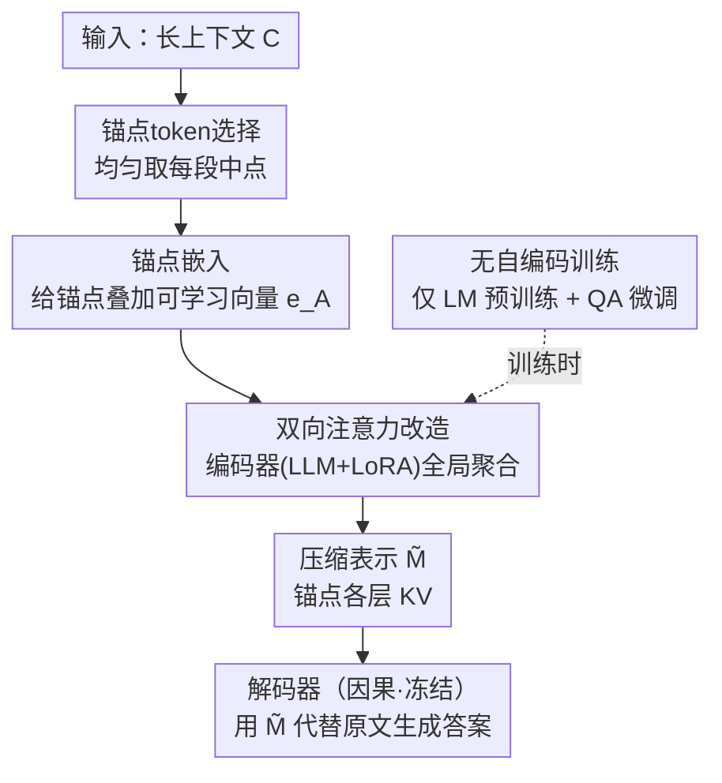

# Autoencoding-Free Context Compression for LLMs via Contextual Semantic Anchors

**会议**: ICLR2026  
**OpenReview**: [https://openreview.net/forum?id=8Pi6Du0n7F](https://openreview.net/forum?id=8Pi6Du0n7F)  
**代码**: https://github.com/lx-Meteors/SAC  
**领域**: LLM 效率 / 上下文压缩  
**关键词**: 上下文压缩, 语义锚点, KV 表示, 双向注意力, 自编码-free

## 一句话总结
SAC 不再像 ICAE 那样追加随机初始化的"压缩 token"并靠自编码预训练去重建上下文，而是直接从原文里挑出若干"锚点 token"、给它们加一个可学习的锚点嵌入、再用双向注意力让锚点聚合全局信息，把上下文压进锚点的 KV 里——彻底丢掉自编码任务后，在问答和长文摘要上反而稳定超过现有压缩方法。

## 研究背景与动机
**领域现状**：把长上下文塞进 LLM 既慢又贵，还会触发"lost-in-the-middle"。主流的上下文压缩（context compression）做法是：在上下文末尾追加一批特殊的"压缩 token"，靠 LLM 的因果注意力把全文信息汇聚到这几个 token 上，得到一个紧凑表示 $\tilde{M}$，之后 LLM 只需基于 $\tilde{M}$（而非原文）生成回答，从而大幅省下推理时间和显存。

**现有痛点**：这些压缩 token 是**随机初始化**的、本身不带任何语义。为了让它们学会"承载上下文"，ICAE 及其后续工作（500xCompressor、EPL 等）几乎都要先做一轮代价高昂的**自编码（AE）预训练**——逼着 $\tilde{M}$ 能把整段原文一字不漏地重建出来。

**核心矛盾**：作者指出，"重建全文"这个 AE 目标和"下游任务真正需要什么"（如从压缩表示里答对一个问题）是**错位**的。AE 强迫模型在有限容量里塞进所有 token，其中很多 token 对下游根本没用，却挤占了本该留给关键信息的容量；更糟的是，作者实测 AE 损失和 LM 损失的梯度在训练早期短暂对齐后**迅速正交**（余弦相似度趋近 0），两个任务在参数空间里互相干扰。

**本文目标**：能不能设计一种**先天就具备压缩能力**的架构，从而绕开这个又贵又有害的 AE 阶段？

**切入角度**：如果压缩载体本身就是原文里挑出来的、自带语义的 token（而不是凭空加的空白 token），它就天然带着语义先验，不需要靠 AE 从零学"我代表什么"。

**核心 idea**：用"从上下文里选出的语义锚点 token + 锚点嵌入 + 双向注意力"替代"追加随机压缩 token + 自编码预训练"，把上下文压进锚点的 KV 表示里。

## 方法详解

### 整体框架
上下文压缩的形式化定义是：编码器 $E$ 把上下文 $C=(c_1,\dots,c_{|C|})$ 压成紧凑表示 $\tilde{M}=E(C)$，随后目标 LLM 用 $\tilde{M}$ 代替原文 $C$ 去做问答等任务。SAC 的全部改动都集中在编码器一侧：它**不追加任何新 token**，而是直接从原文中选出一个子集 $S\subseteq C$ 当"锚点 token"；给每个锚点叠加一个可学习的锚点嵌入 $e_A$ 作标记；再把编码器的因果注意力换成双向注意力，让锚点能看到整段上下文；最后取锚点在各层的 KV 对作为压缩表示 $\tilde{M}$。编码器是一个带 LoRA 的 LLM，目标 LLM（解码器）参数全程冻结、仍用因果注意力，直接拿 $\tilde{M}$ 当作上下文的 KV cache 来续写答案。训练上彻底去掉 AE，只用 LM 预训练 + QA 微调。

### 关键设计

**1. 锚点 token 选择：让压缩载体自带语义先验**

要绕开 AE，前提是压缩载体得是"原文里本就有语义的 token"，而不是随机初始化的空白 token。SAC 因此从上下文 $C$ 里直接选出 $|S|=\lfloor L/r\rfloor$ 个锚点（$r$ 是压缩比、$L$ 是子上下文长度），默认沿用 EPL 的均匀策略：把上下文切成 $|S|$ 段、每段取中间那个 token，以最大化对全文的覆盖。消融显示选择策略很关键：随机选会显著掉点（ID F1 从 63.63 跌到 59.54），因为随机 token 既缺语义重要性、位置又散导致覆盖差；而均匀选和基于 Lingua-2 重要性打分的选择效果相当，说明 SAC 的架构能"放大"任意高质量选择策略、而不绑死某一种——这也意味着 SAC 可以和现成的 token 重要性方法即插即用。

**2. 锚点嵌入：给锚点打上"我是压缩载体"的可学习标记**

光是选出原文 token 还不够——模型得知道这些 token 此刻扮演的是"压缩载体"而非普通词。SAC 给每个被选中的锚点叠加一个可学习的锚点嵌入 $e_A$，得到输入嵌入序列：

$$e_i = \mathrm{Emb}(c_i) + \mathbb{1}_{c_i\in S}\cdot e_A$$

其中 $\mathbb{1}_{c_i\in S}$ 是指示函数，锚点处为 1、其余为 0。这样模型就能把锚点和普通 token 区分开，明确该往哪些 token 上汇聚信息。相比从零学一批压缩 token 的表示，复用原文 token + 一个标记向量大幅提升了学习效率；消融里去掉锚点嵌入（w/o anchor）后 ID 平均 F1 从 66.24 降到 64.58，证明这个显式结构信号确实在引导模型准确识别和处理锚点。

**3. 双向注意力改造：让锚点看见整段上下文**

如果编码器仍用因果注意力，锚点只能看到它前面的 token，表示能力受限——位置靠前的锚点几乎拿不到后文信息。SAC 因此把编码器的因果注意力**改成双向注意力**，且这种双向是作用在**全部 token**上（不只锚点之间），让模型捕捉更丰富的全局依赖。注意只有**编码器**改双向，解码器仍保持因果。这一改动借鉴了 NV-Embed、LLM2Vec 等"去掉单向约束能增强表征"的发现，把它首次系统用到上下文压缩里。消融中去掉双向（w/o mask）掉点最狠（ID 平均 F1 66.24→63.62），是两个组件里贡献更大的一个，印证了"锚点能否聚到全局信息"是压缩质量的关键。

**4. 无自编码训练：去掉 AE 反而更好**

有了前三个设计，锚点本身已经携带足够的上下文语义，于是 SAC 干脆在预训练阶段**只用 LM 损失、彻底不用 AE 损失**，微调阶段只用 QA 损失 $L_{QA}=-\log P(A|\tilde{M},Q)$。作者从两个角度解释 AE 为何有害：直觉上，AE 逼模型在有限容量里重建全部 token，把容量浪费在对下游无用的 token 上；机理上，AE 与 LM 的梯度余弦相似度训练早期就趋近 0、二者在参数空间近乎正交，AE 的优化会干扰 LM 更新。消融（Table 5）很有说服力——给 SAC 加回 AE（w/ AE only 或 w/ AE+LM）全面拖累性能，例如 15× 下 ID F1 从完整 SAC 的 54.95 跌到 AE-only 的 49.93。这也反过来质疑了"AE 是上下文压缩必备"的传统假设。

### 损失函数 / 训练策略
两阶段训练：先在 SlimPajama-6B 上用 LM 目标做 20,000 步预训练，再在 MRQA 上用 QA 目标做 20,000 步微调，batch size 均为 16。编码器和目标 LLM 同为 Llama-3.2-1B，编码器加 LoRA（rank=128, $\alpha$=256），目标 LLM 冻结。每段子上下文 510 token，锚点数 $|S|=\lfloor L/r\rfloor$ 由压缩比决定；编码器复用原文 KV cache，使解码器无需额外语义对齐就能读懂压缩表示。

## 实验关键数据

### 主实验
数据集：预训练用 SlimPajama-6B，问答用 MRQA（含 in-domain 与 out-of-domain 两套测试），指标 ROUGE-1 F1 / EM。下表为 15× 压缩比下的平均结果，对比强基线 EPL 与较弱的 ICAE。

| 设置 | 指标 | SAC | EPL | ICAE | 相对 ICAE/EPL |
|------|------|-----|-----|------|------|
| In-domain 平均 | F1 | **54.95** | 51.52 | 44.50 | 最高 +23.5% / 最低 +6.7% |
| In-domain 平均 | EM | **39.67** | 36.65 | 31.28 | 最高 +26.8% / 最低 +8.2% |
| Out-of-domain 平均 | F1 | **39.26** | 36.74 | 30.81 | 最高 +27.4% / 最低 +6.9% |
| Out-of-domain 平均 | EM | **26.02** | 23.83 | 20.18 | 最高 +28.9% / 最低 +9.2% |

SAC 在 ID/OOD 的每个子数据集上都超过所有基线，且在 5×/15×/51× 各压缩比下都拿到最佳平均分。可扩展性上（Table 6），换到 Llama-3.2-3B、Llama-3.1-8B 仍稳超 EPL（3B：50.48/34.73 vs 47.46/31.82；8B：52.31/35.93 vs 50.82/34.42），且增益不随模型变大而衰减。长文摘要（QMSum/GovReport，32K 输入、15× 压缩）平均 ROUGE-1 18.49 也超过 EPL 的 17.61，说明去掉 AE 不伤长文建模能力。

### 消融实验

| 配置 | ID 平均 F1/EM | OOD 平均 F1/EM | 说明 |
|------|---------------|----------------|------|
| SAC（完整） | 66.24 / 53.11 | 48.45 / 32.19 | 完整模型 |
| w/o mask（去双向注意力） | 63.62 / 50.35 | 45.11 / 30.16 | 掉点最多，贡献最大 |
| w/o anchor（去锚点嵌入） | 64.58 / 51.56 | 47.65 / 31.99 | 也明显掉点 |

（注：组件消融表用的是 TriviaQA+HotpotQA / BioASQ+TextbookQA 的子集平均，故绝对值与主表 15× 平均略有差异。）AE 消融（Table 5，15×）：完整 SAC ID F1 54.95，加回 AE-only 跌到 49.93、AE+LM 51.73，均不如不带 AE。

### 关键发现
- **双向注意力是第一功臣**：去掉它掉点最狠，证明"锚点能否聚到全局信息"决定压缩质量；锚点嵌入次之但同样不可省。
- **AE 不仅非必需、还有害**：梯度可视化显示 AE 与 LM 梯度迅速正交，是 AE 拖累下游的机理证据。
- **表示空间分析**：t-SNE 显示 SAC 的锚点 KV 与原文 token KV 在 key/value 空间都贴得最近、均匀混在一起，而 500xCompressor 的压缩 token 明显自成一簇——锚点直接嵌在原文里，使其表示与上下文保持紧密语义联系，解码器因此更易读懂。
- **注意力更聚焦**：高压缩比下 SAC 锚点仍保持清晰的局部对角注意力、只聚焦少数关键 token，而 EPL/500x 的注意力趋于弥散。

## 亮点与洞察
- **"载体自带语义"是个很省事的思路**：把"凭空造压缩 token 再花大代价教它装信息"换成"直接征用原文里本就有意义的 token"，一步消掉整个 AE 预训练阶段，工程上既省算力又少一个易错环节。
- **用梯度正交性给"AE 有害"做实证**：很多工作默认 AE 是上下文压缩标配，SAC 用 AE/LM 梯度余弦趋零这一可视化把"任务错位"从直觉落到机理，说服力强、也给后续工作提供了一个诊断工具。
- **与 token 选择方法正交可叠加**：SAC 本质是"token 选择 + 压缩 token 训练"的结合体，能即插即用任意高质量选择策略（如 Lingua-2），迁移性好。
- **可复用 trick**：把编码器改双向、解码器保因果的"编码-解码不对称"配置，可迁移到其他需要全局表征却又要自回归生成的压缩/检索场景。

## 局限与展望
- **任务范围偏窄**：主实验集中在 MRQA 问答与两个摘要集，未覆盖多轮对话、RAG、代码等更复杂的长上下文场景，泛化边界还需验证。
- **依赖良好的锚点选择**：随机选会显著掉点，说明 SAC 性能仍受"选哪些 token 当锚点"影响；当前默认均匀策略未必对所有领域最优，自适应/任务感知的选择是自然的改进方向。
- **编码器仍需训练**：虽然去掉了 AE，但仍需 LM 预训练 + QA 微调各两万步、且编码器要带 LoRA，并非完全免训练。
- **同模型约束**：编码器与解码器须用同一 LLM（否则有语义鸿沟伤性能），限制了跨模型/异构部署的灵活性。

## 相关工作与启发
- **vs ICAE**：ICAE 追加随机压缩 token 并用 AE+LM 联合预训练让其学会承载语义；SAC 直接征用原文 token 当锚点、彻底去 AE。SAC 在所有数据集上全面超过 ICAE（15× ID F1 +6.7%~23.5%）。
- **vs 500xCompressor**：500x 把压缩载体从末层输出换成各层 KV 以提高压缩比，但其压缩 token 在表示空间自成一簇、注意力弥散；SAC 同样用各层 KV，但锚点内嵌原文使表示与上下文对齐、注意力更聚焦。
- **vs EPL**：EPL 通过均匀分布压缩 token 的 position ID（让其与原文共享 RoPE 角度）来拉近表示距离，是最强基线；SAC 可视为在 EPL 之上增强了压缩 token 的表示（锚点共享与 EPL 压缩 token 相同的 position ID），并去掉 AE，因而每个数据集都更优。
- **vs LLMLingua-2 等硬压缩 / token 选择**：这类方法靠小模型按信息熵/分类器删 token，证明少数代表性 token 足以让 LLM 理解原文，但不训练被选 token 的可用性；SAC 把"选 token"与"训练压缩表示"结合，被选锚点经过训练后对目标 LLM 更可用。

## 评分
- 新颖性: ⭐⭐⭐⭐⭐ "去掉自编码、用原文锚点当压缩载体"是对上下文压缩范式的一次干净的重新设计，且有梯度正交性实证支撑
- 实验充分度: ⭐⭐⭐⭐ 压缩比/模型规模/组件/选择策略/AE 多维消融到位，表示与注意力可视化扎实；任务面（QA+摘要）略窄
- 写作质量: ⭐⭐⭐⭐ 动机—分析—方法逻辑清晰，图表对照充分
- 价值: ⭐⭐⭐⭐ 同时省掉一个昂贵训练阶段并提升效果，对长上下文推理加速有实用意义，代码开源

<!-- RELATED:START -->

## 相关论文

- [\[ICLR 2026\] RMAAT: Astrocyte-Inspired Memory Compression and Replay for Efficient Long-Context Transformers](rmaat_astrocyte-inspired_memory_compression_and_replay_for_efficient_long-contex.md)
- [\[ICLR 2026\] Command-V: Training-Free Representation Finetuning Transfer](command-v_training-free_representation_finetuning_transfer.md)
- [\[ICML 2026\] Proxy Compression for Language Modeling](../../ICML2026/llm_efficiency/proxy_compression_for_language_modeling.md)
- [\[ACL 2026\] RACER: Retrieval-Augmented Contextual Rapid Speculative Decoding](../../ACL2026/llm_efficiency/racer_retrieval-augmented_contextual_rapid_speculative_decoding.md)
- [\[ICLR 2026\] Extending the Context of Pretrained LLMs by Dropping Their Positional Embedding](extending_the_context_of_pretrained_llms_by_dropping_their_positional_embedding.md)

<!-- RELATED:END -->
