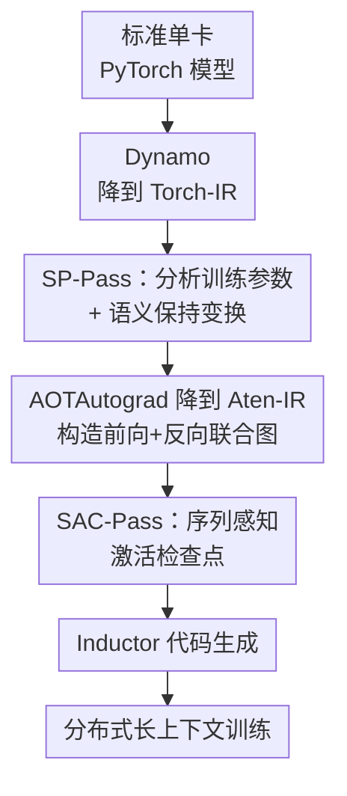

# AutoSP: Unlocking Long-Context LLM Training Via Compiler-Based Sequence Parallelism

**会议**: ICLR 2026  
**OpenReview**: [https://openreview.net/forum?id=0fgsHvmBBI](https://openreview.net/forum?id=0fgsHvmBBI)  
**代码**: 承诺开源（论文称代码与 benchmark 将公开，暂未给出链接），实现集成进 DeepSpeed 项目  
**领域**: LLM效率 / 长上下文训练 / 编译器  
**关键词**: 序列并行, 长上下文训练, PyTorch-2.0 编译器, 激活检查点, DeepSpeed-Ulysses

## 一句话总结
AutoSP 把序列并行（SP）从手写、与框架强耦合的算子，抬升成 PyTorch-2.0 编译栈里的两个编译 pass——在 Torch-IR 上自动插通信、resize 激活 buffer 的 SP-Pass，以及在 Aten-IR 联合图上松开 min-cut 约束、重算计算密集算子的序列感知激活检查点 SAC-Pass——让用户几行代码就能把单卡模型编译成分布式长上下文训练管线，在 NVIDIA / AMD 上把可训练序列长度拉长最高 2.7× / 2.5×，而吞吐几乎无损。

## 研究背景与动机
**领域现状**：LLM 越来越多地在长上下文数据上训练（文档理解、多步推理、多轮对话），输入动辄几万到几十万 token，激活内存暴涨，单卡很快 OOM。为绕开 OOM，社区提出序列并行（Sequence Parallelism, SP）：把激活沿序列维切到多卡上，靠堆设备数聚合显存来训更长的序列。代表方案是 DeepSpeed-Ulysses（用 all-to-all 在注意力层边界切换激活布局）和 RingAttention（环形交换 K/V）。

**现有痛点**：现有 SP 全部是 eager 模式手写、且和 DeepSpeed / Megatron-LM 这类专用框架强耦合。要把 SP 接到一条新的训练管线里，开发者得侵入式改代码：手动在需要完整序列的算子（如注意力）之间插入 `all2all` 通信原语、管理跨设备的激活布局、还要保证前向和反向都正确。这要求很深的系统专长，严重拖慢科研生产力，也限制了跨模型架构、跨硬件的可移植性。

**核心矛盾**：与此同时，业界已经开始把 ZeRO-3/FSDP 这类分布式策略"抬升"进 PyTorch-2.0 编译器（如 SimpleFSDP、DeepCompile），用编译 pass 自动化掉手工活。但这些工作只盯着**怎么把更多模型参数切片**，针对的是大参数量模型，**没有一个**专门优化长上下文训练。于是自然要问：SP 能不能也被抬升进深度学习编译栈，实现自动序列并行？

**本文目标**：把 SP 做成 PyTorch-2.0 原生的编译 pass，让用户写标准单卡 PyTorch 模型、加几行注册代码就自动获得分布式长上下文训练能力。这要克服三个具体难题——(1) PyTorch-2.0 有 Torch-IR / Aten-IR / Inductor-IR 等多层中间表示，粒度各异，选哪一层做"既能分析出模型信息、又能做语义保持改写"非常关键：太细的 IR 让分析变难，太粗的 IR 让改写不可行；(2) 编译器里推断"依赖序列长度的张量形状"很难——降级过程会插入转置等数据搬运算子、频繁改变 buffer 的序列轴，而 SP 只需要 resize 部分 buffer（如 token / position id），别的（如 attention mask）不能动，到底哪个张量的哪一维该 resize 很难判别；(3) 把 SP 塞进编译栈会和 PyTorch 原生的激活检查点（AC）pass 冲突——天真地把 AC 和 SP 组合会在反向触发多余通信，反伤性能。

**核心 idea**：用编译器的"分析 + 改写"框架自动完成 SP——在最接近用户神经网络语义的 **Torch-IR** 上做程序分析与语义保持变换（自动插通信、自动 resize buffer、自动重算手工索引），并配一个**序列感知的激活检查点**策略，利用"长上下文下线性投影/MLP 的 FLOPs 占比随序列长度按 $O(1/s)$ 衰减"这一观察，把传统被禁止重算的计算密集算子放开重算，以极小的吞吐代价换巨大的显存收益。

## 方法详解

### 整体框架
AutoSP 把序列并行作为一组编译 pass 插进 PyTorch-2.0 的编译栈。用户照常写单卡 PyTorch 模型，只需注册 `auto_sp` 和 `sp_ac` 两个 pass、初始化分布式、调用 `model.compile()`，训练循环里把 batch 按 SP 组切一下喂进去即可——所有跨设备激活布局管理、通信原语插入、前向/反向正确性都由编译器接管。

整条管线分两个阶段对接 PyTorch-2.0 的降级流程：Dynamo 先把模型 trace 成 Torch-IR 计算图，**SP-Pass** 在这一层做分析与变换（插 `all-to-all`、resize buffer、重算索引）；随后 AOTAutograd 把 Torch-IR 进一步降到更细粒度的 Aten-IR、构造前向+反向的联合图，**SAC-Pass** 在这一层改写 AC 的网络流构造、决定哪些激活在反向重算；最后 Inductor 消费 Aten-IR 生成后端 kernel。两个 pass 各管一层 IR，正好对应它们各自的难点。

### 关键设计

**1. SP-Pass：在 Torch-IR 上分析训练参数 + 做语义保持变换**

这是 AutoSP 自动序列并行的核心。难点在于"选哪层 IR 动手"：AutoSP 选了 **Torch-IR** 而不是更细的 Aten-IR，原因有三——(1) Torch-IR 更贴近用户写的神经网络，算子仍是 `linear`、`attention` 这样的高层概念，容易判断某段图属于哪一层、该怎么 resize；而 Aten-IR 把这些拆成一堆 mat-mul、permute，很难反推哪些算子属于线性投影、哪些属于注意力。(2) Torch-IR→Aten-IR 的降级会插入 reshape、permute 等布局变换，把"哪一维是序列/batch/hidden"这些信息搞糊，让"该 resize 哪一维"变得困难。(3) Torch-IR 只描述前向，变换更简单——只要给每个新加节点登记好对应的反向梯度算子即可；Aten-IR 同时含前向和反向，改写复杂得多。

pass 分两步走。**分析**：要正确实例化通信用的 token-buffer，得拿到 batch、序列、hidden 维度，但这些参数不在任何 IR 里显式出现。AutoSP 的办法是看计算图的输入节点——预处理后喂进图的数据形状是确定的（如 NLP 任务是 `[batch, seq_len]`），由此拿到 batch 和 seq；再沿图遍历到第一个注意力算子，看它输出 ND 张量的最后两维 `[num_heads, head_dim]`，二者乘积就是 model-dimension。**变换**：拿到 $b,s,h,d$ 后遍历图，对每个节点做三件事——(1) 若属于 `RESIZE_BUFS` 集合就按它在注意力层还是 MLP/线性层 resize buffer（Ulysses 下注意力层算子要 resize 成"完整序列、$h/\text{WS}$ 份头"，即 $[b,s,h/\text{WS},d]$；MLP/线性层算子则 resize 成"完整 model-dim、部分序列长度 $s/\text{WS}$"，即 $[b,s/\text{WS},d]$，WS 为 world size）；(2) 若属于 `INDEX_OPS`（如因果 mask 的手工索引）就重算其索引以匹配新形状；(3) 若是注意力层的第一个/最后一个算子，就在它前后插入 `all-to-all` 并配好相应尺寸的通信 buffer。`RESIZE_BUFS` / `INDEX_OPS` / `ATTN_OPS` 这几个集合是作者通过分析手写 transformer 编译出的 Dynamo FX 图人工整理出来的。这套做法的价值在于：用户完全不用碰通信代码，单卡图被自动改写成正确的序列并行图，前向反向都对。

**2. SAC-Pass：序列感知的激活检查点，松开 min-cut 的"禁重算"约束**

光有 SP 还不够，激活检查点（AC）也是长上下文省显存的关键，但 PyTorch-2.0 自带的 AC pass 和 SP 组合起来表现并不好。PyTorch 的 AC pass 工作在 Aten-IR 上，把"选哪些激活在反向重算而不伤性能"建模成一个网络流问题：构造前向+反向联合图，源点连所有输入张量、汇点连所有从梯度可达的节点，给每个节点按"产出的激活内存"等启发式赋容量，再把节点流转成边流（每个节点拆成 in/out 两个、之间连一条容量等于节点代价的边，其余边容量为 $\infty$），对这张图求 **min-cut**——被割中的有限容量边对应的节点就是要存下来的激活，直觉上就是"用最小代价存一组激活以满足反向依赖"。

问题出在 PyTorch-2.0 太保守：它**纯按算子类型**禁止重算很多看似计算密集的算子（mat-mul、scaled mat-mul 等），做法是从源点对每个计算密集节点的 in 连一条容量为 $\infty$ 的额外边，强迫该节点（或其下游）落在割集里、必须被存下来。但 AutoSP 观察到：长上下文下这条规则是错的。对 batch $b$、序列 $s$、头数 $h$、头维 $d$、MLP 隐维 $d_{ffn}$ 的 transformer，注意力 FLOPs 是 $2bhs^2d$，线性投影是 $8bhsd^2$，MLP 是 $4bhsd_{ffn}d$；当 $s \gg d,h,d_{ffn}$ 时，线性投影+MLP 占总计算的比例为

$$\frac{8bhsd^2 + 4bhsd_{ffn}d}{2bhs^2d + 8bhsd^2 + 4bhsd_{ffn}d} \approx O\!\left(\frac{1}{s}\right), \quad s \to \infty$$

也就是说，序列越长，这些"计算密集"算子其实占比越小，重算它们的代价微乎其微。AutoSP 据此改写：遍历联合图、删掉源点连向计算密集算子的那些额外边，让只有图的真正输入张量连源点，再把这张被改过的联合图交回 PyTorch-2.0 的 AC 求解器。这样注意力层以外的 (batch) mat-mul 等就被允许重算，以极小吞吐代价换来显著更长的可训练序列。这正是 AutoSP 相比手写 SP（DS-Ulysses / RingAttention）额外胜出的来源。

### 一个完整示例
拿一个标准 Transformer（`q,k,v = linear_projections(x); attention = sdpa(q,k,v); x = mlp(attention)`）在 SP-size = WS 下走一遍 SP-Pass：① 分析阶段——从输入张量读出 `[batch, seq]`，遍历到 `sdpa` 看输出末两维拿到 `[heads, head_dim]`，相乘得到 model-dim；② 变换阶段——线性投影 `Wq/Wk/Wv` 是逐序列点操作，每卡直接在自己那份 token 上算、无需通信，buffer resize 成部分序列 `[b, s/WS, d]`；进注意力前插入第一个 `all-to-all`，把激活从"切序列"重排成"切头"，buffer 变成 `[b, s, heads/WS, d]`，每卡在自己负责的若干头上本地算 `sdpa`；算完再插一个 `all-to-all` 把 token 排回"切序列"布局供后续 MLP 使用；其间因果 mask 的手工索引被 `recalc_index` 按新形状重算。整段改写后，这张图就是一份正确的序列并行前向图，反向靠每个新节点登记的共轭梯度算子自动得到。

## 实验关键数据

### 主实验
评测平台：NVIDIA GH200-96GB / A100-80GB、AMD MI250-64GB；PyTorch-2.7 + CUDA 12.8（NV）/ ROCm 6.4（AMD）。模型覆盖 Llama-3.2 1B/3B、Llama-3.1 8B、Llama-2 13B（含 GQA 与 Full-Attention）。Baseline：torch.compile 下的 ZeRO-3(FSDP)、Inductor 编译的手写 DS-Ulysses、RingAttention。核心指标是 **trainability**——OOM 前能训的最大序列长度。

| 对比对象（8×A100） | 3B | 8B | 13B |
|---|---|---|---|
| AutoSP vs ZeRO-3(FSDP) | 5× | 5.6× | 2.5× |
| AutoSP vs DS-Ulysses | 2.14× | 3× | 1.88× |
| AutoSP vs RingAttention | 2.14× | 3× | 1.6× |

跨硬件可移植性（Fig. 7）：NVIDIA GH200 上 1B/3B 分别 1.58×/2.70× 更长序列；AMD MI250 上 1B/3B 分别 2×/2.5×。运行时性能（Fig. 8）：在各方法都能训的序列长度上，AutoSP 达到 Inductor 手写 baseline 的 0.97×（1B）/0.98×（3B，NVIDIA）、0.97×/0.87×（AMD），即作为通用编译 pass 仍保住约 97% 的手写性能，却带来最高 2.7× 的 trainability 增益。端到端单步迭代（Llama-3.1 8B，Fig. 6）相比 ZeRO-3 baseline 单步快 5× 而 trainability 高一个数量级。

### 消融实验
Llama-3.1 1B，逐项开关优化（Table 1）：

| 配置 | 最大 token | 单步时间(s) | 说明 |
|---|---|---|---|
| DS-Ulysses（手写 baseline） | 81,000 | 1.06 | 高度优化的手写 SP |
| AutoSP（仅 SP-Pass） | 77,000 | 1.09 | 通用编译 pass 达 baseline 97% 速度 |
| AutoSP（SP + SAC-Pass） | 128,000 | 1.19 | SAC 在 SP 上再增 1.66× trainability |

算子级 breakdown（Llama-3.2 1B，40k 序列，GH200，Fig. 9）：AutoSP 把注意力算子激活内存降 13.03×、MLP 算子降 2.22×（MLP 收益大因含大量可重算的 mat-mul），代价仅是反向 pass 1.14× 的运行时开销、前向几乎不变。

### 关键发现
- **SAC-Pass 是相对手写 SP 额外胜出的关键**：仅 SP-Pass 时 AutoSP 略低于手写 DS-Ulysses（77k vs 81k），但叠加 SAC 后冲到 128k——增量 1.66× trainability 只换 7% 速度下降，根因正是 $O(1/s)$ 那条 FLOPs 占比衰减观察。
- **收益对 8B 模型最显著、13B 反而回落**：8B 上线性投影/MLP 产生由 hidden-dim 参数化的大激活，重算它们省得最多；13B 时优化器状态已吃掉约 50% 显存，留给激活的腾挪空间变小。
- **DS-Ulysses 比 RingAttention 快**：Ring 需要 $p$ 步（$p$=SP size）环形交换 K/V 的通信延迟，而 Ulysses 只用单次 all-to-all 重排 token，现代集群节点内 all-to-all 因成对链路很快。

## 亮点与洞察
- **把"系统优化"重述成"编译器 pass"**：序列并行历来是手写、与框架耦合的脏活，AutoSP 第一个把它做成 PyTorch-2.0 原生编译 pass，用户几行代码即得分布式长上下文训练——这是一种把专家知识沉淀进编译栈、可移植到 NVIDIA/AMD 的范式迁移。
- **IR 选择是工程巧思**：在"分析友好但改写受限的粗 IR"和"改写灵活但分析困难的细 IR"之间，选 Torch-IR 让分析（按 `linear`/`attention` 语义判层）和变换（只动前向、登记共轭梯度）双双变简单，是值得复用的"选对抽象层级"的方法论。
- **$O(1/s)$ 这条不等式是点睛之笔**：它把"该不该重算计算密集算子"从"看算子类型"改成"看序列长度下的真实占比"，一句数学观察直接松开了 PyTorch min-cut 的保守约束——这种"用 workload 特性反推编译策略"的思路可迁移到其他长序列/稀疏场景的重算决策。

## 局限与展望
- **集合是人工整理的**：`RESIZE_BUFS` / `INDEX_OPS` / `ATTN_OPS` 靠分析手写 transformer 的 FX 图人工 curate，对非标准/新颖架构（非常规注意力变体、自定义算子）可能需要补集合，自动化程度并非"零人工"。
- **只落地了 Ulysses 一种 SP**：实现把 DeepSpeed-Ulysses 抬升进编译栈，RingAttention 等其他 SP 策略、以及 SP 与 TP/PP/EP 的组合是否同样易抬升，论文未展开。
- **大模型收益递减**：13B 上优化器状态主导显存，trainability 增益明显回落；与 ZeRO-3 等参数切片策略的深度协同（让 SP 省激活、ZeRO 省优化器态）是自然的下一步。
- **反向开销随重算增多累积**：SAC 放开重算虽吞吐代价小（前向几乎不变、反向 1.14×），但更激进地重算时反向成本会上升，长期需要更细的"按算子收益排序"的重算策略。

## 相关工作与启发
- **vs ZeRO-3/FSDP、Tensor/Pipeline 并行**：它们针对大参数量模型、切优化器/参数/梯度/激活态以降单卡显存，但不显式针对长上下文，无法靠堆设备数扩序列长度；AutoSP 正是补上"专门扩序列"这条正交的轴。
- **vs DeepCompile / SimpleFSDP（编译器自动化 ZeRO-3）**：同样是"把分布式策略抬升进 PyTorch-2.0 编译栈"的思路，但它们抬升的是 FSDP（盯参数切片），AutoSP 第一个抬升 SP（盯长上下文），证明 SP 也能编译器化。
- **vs GSPMD（XLA 自动并行）**：GSPMD 靠用户注解引导自动并行，仍需人工；AutoSP 走 PyTorch 原生编译 pass、无需注解。
- **vs 传统激活检查点（ILP 搜索 / $\sqrt{N}$ 静态切块）**：搜索法难扩到十亿级模型，静态策略在 SP 下会引入反向的多余通信；AutoSP 的 SAC 利用长上下文的计算/内存特性、在编译栈内无人工干预地做决策，避开侵入式改写。

## 评分
- 新颖性: ⭐⭐⭐⭐⭐ 首个把序列并行抬升为 PyTorch-2.0 原生编译 pass，IR 选择与 $O(1/s)$ 重算观察都很有洞见。
- 实验充分度: ⭐⭐⭐⭐ 覆盖 1B–13B、NVIDIA/AMD 双平台、含消融与算子级 breakdown；但 baseline 偏 Ulysses 系，未与更多 SP/并行组合对比。
- 写作质量: ⭐⭐⭐⭐ 难点—方案—验证脉络清晰，IR 图与网络流图直观；部分实现集合的整理过程略简。
- 价值: ⭐⭐⭐⭐⭐ 直击长上下文训练的工程痛点，可移植、近零吞吐损失、几行代码接入，对训练基础设施有实际意义。

<!-- RELATED:START -->

## 相关论文

- [\[ICLR 2026\] ParaRNN: Unlocking Parallel Training of Nonlinear RNNs for Large Language Models](pararnn_unlocking_parallel_training_of_nonlinear_rnns_for_large_language_models.md)
- [\[ICLR 2026\] Long-Context Attention Benchmark: From Kernel Efficiency to Distributed Context Parallelism](long-context_attention_benchmark_from_kernel_efficiency_to_distributed_context_p.md)
- [\[ICLR 2026\] EntropyLong: Effective Long-Context Training via Predictive Uncertainty](entropylong_effective_long-context_training_via_predictive_uncertainty.md)
- [\[ICLR 2026\] Unlocking Full Efficiency of Token Filtering in Large Language Model Training](unlocking_full_efficiency_of_token_filtering_in_large_language_model_training.md)
- [\[ICLR 2026\] MesaNet: Sequence Modeling by Locally Optimal Test-Time Training](mesanet_sequence_modeling_by_locally_optimal_test-time_training.md)

<!-- RELATED:END -->
