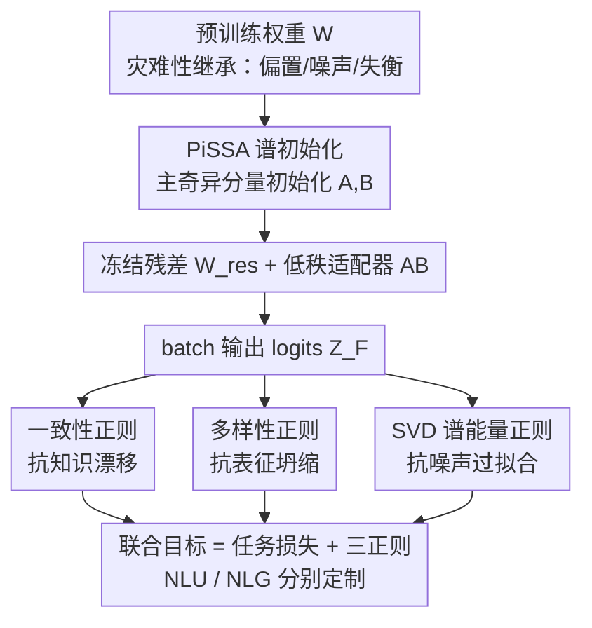

# BA-LoRA: Bias-Alleviating Low-Rank Adaptation to Mitigate Catastrophic Inheritance in Large Language Models

**会议**: ICLR2026  
**OpenReview**: [https://openreview.net/forum?id=q0X9SiXiRO](https://openreview.net/forum?id=q0X9SiXiRO)  
**代码**: 待确认  
**领域**: LLM 效率 / 参数高效微调（PEFT）  
**关键词**: LoRA, 参数高效微调, 灾难性继承, 偏置缓解, 输出空间正则

## 一句话总结
BA-LoRA 在 PiSSA 谱初始化的 LoRA 框架上叠加「一致性 + 多样性 + SVD」三个**输出空间正则**，分别对治微调放大预训练偏置时的知识漂移、表征坍缩与噪声过拟合，在 NLG/NLU 多任务上稳定超过一众 LoRA 变体，且在噪声更重的预训练模型上增益更大。

## 研究背景与动机

**领域现状**：把大模型适配到下游任务，参数高效微调（PEFT）已经成了事实标准，其中 LoRA 用低秩矩阵 $\Delta W = AB$（$A\in\mathbb{R}^{m\times r}$、$B\in\mathbb{R}^{r\times n}$，秩 $r\ll\min(m,n)$）逼近权重更新，冻结原权重 $W$ 只训 $A,B$，前向变成 $Y=X(W+AB)$，省显存又方便部署。PiSSA 进一步用 $W$ 的 SVD 主奇异分量来初始化 $A,B$，加速收敛。

**现有痛点**：预训练语料是 web 级别的脏数据，模型会把里面的偏置、噪声和长尾失衡一并继承下来——这就是「灾难性继承（Catastrophic Inheritance）」。糟糕的是，LoRA 这类方法把更新限制在一个低维瓶颈里，自由度不足以纠正这些继承缺陷，反而可能在带噪/失衡数据上**放大**预训练里的伪相关，让公平性与鲁棒性进一步恶化。

**核心矛盾**：低秩更新的高效性，和它"没有足够自由度去抵消继承偏置、甚至会放大偏置"是一对内在张力。单纯收敛得快（PiSSA）并不等于学到的是稳健信号，可能只是更快地拟合了噪声。

**本文目标**：把模糊的"灾难性继承"拆成可定向治理的三个子问题——**知识漂移**（学新任务时遗忘了稳健的预训练知识）、**表征坍缩**（在失衡数据上输出多样性下降、塌向少数主导类）、**噪声过拟合**（学到与标签无关的高频伪相关）——再逐一对症下药。

**切入角度**：与其去约束低秩适配器的**权重**，不如直接正则化模型的**输出空间**（batch 内的 logits 矩阵），从而塑造模型的功能行为。作者观察到：知识可以靠"向预训练教师对齐"来保住、多样性可以靠"去相关 logits"来维持、噪声可以靠"让谱能量集中在主奇异分量"来压制。

**核心 idea**：在 PiSSA 初始化基础上，给任务损失追加三个输出空间正则项（consistency / diversity / SVD-based），各自精准对应一个失败模式，并针对 NLU 与 NLG 任务定制具体形式。

## 方法详解

### 整体框架
BA-LoRA 整体仍是 LoRA 的低秩适配骨架：用 PiSSA 的方式把预训练权重 $W$ 做 SVD，主奇异分量初始化可训练的 $A,B$，剩下的塞进**冻结的残差矩阵** $W_{res}=U_{[:,r:]}S_{[r:,r:]}V_{[:,r:]}^\top$，保证训练起点处 $W=W_{res}+AB$ 完整保留预训练能力。真正的新意在训练目标：在标准任务损失之外，针对微调时 batch 输出 logits $Z_F$ 计算三个正则项，分别压制知识漂移、表征坍缩和噪声过拟合，最后加权求和成统一目标。由于 NLU（分类，类别数 $D$ 不大）和 NLG（自回归，词表 $|V|$ 极大）在输出结构上差异很大，三个正则在两类任务下采用不同的可计算形式。

### 关键设计

**1. PiSSA 谱初始化：让起点站在预训练的主方向上**

这一步针对"低秩更新随机初始化会偏离预训练能力、收敛慢"的问题。BA-LoRA 沿用 PiSSA：把 $W=USV^\top$ 的 SVD 按秩 $r$ 切成主分量与残差，用主分量初始化适配器 $A=U_{[:,:r]}S_{[:r,:r]}^{1/2}$、$B=S_{[:r,:r]}^{1/2}V_{[:,:r]}^\top$，残差 $W_{res}$ 冻结。这样微调一开始就把更新对准了能量最大的奇异方向，既保留预训练全容量、又加速收敛。它是后续三个输出空间正则的载体——正是因为更新集中在主方向，才更需要在输出端额外约束，防止主方向把噪声也一起放大。

**2. 一致性正则：用预训练教师锚住知识、抗知识漂移**

针对知识漂移（学新任务时遗忘稳健的预训练知识），作者借知识蒸馏的思路，让微调后的学生模型在输出分布上向**预训练教师**对齐。设预训练与微调模型的 batch logits 为 $Z_P,Z_F$，温度 $T$ 软化分布后取 KL 散度：

$$\mathcal{L}_{CR\_NLU} = T^2 \cdot \mathrm{KL}\big(\mathrm{softmax}(Z_P/T)\;\|\;\mathrm{softmax}(Z_F/T)\big)$$

$T^2$ 用来把梯度量级拉回与标准交叉熵相当。NLG 版本把它推广到 token 级，对序列中 $M$ 个有效（非 padding）token 的逐位置 KL 取平均。其意义是：在教师信号可靠的样本/token 上，逼学生模仿教师的决策行为，从而把预训练学到的基础知识"钉住"，而不是被下游任务带跑。

**3. 多样性正则：去相关 logits、抗表征坍缩**

针对失衡数据导致的表征坍缩（模型塌向少数主导类、输出多样性下降）。NLU 里对 batch logits 算 $D\times D$ 协方差矩阵 $C(Z_F)=\frac{1}{N-1}Z_{centered}^\top Z_{centered}$，惩罚其**非对角元**：

$$\mathcal{L}_{DR\_NLU} = \frac{1}{D}\sum_{i\neq j}[C(Z_F)]_{i,j}^2$$

让任意两个类别的预测之间不要过度相关，从而避免坍缩到几个主导类。NLG 里直接最大化整个词表的熵会和"生成连贯文本"冲突，于是改成在 Top-K 候选集 $V_{top\text{-}K}$ 内做**受限熵正则**：对重归一化后的候选概率 $P'_F(v|h_i)$ 最大化熵（最小化负熵），只在"最可能的少数候选"里鼓励多样性，兼顾连贯与不坍缩。

**4. SVD 谱能量正则：让能量集中在主奇异分量、抗噪声过拟合**

针对噪声过拟合（学到与标签无关的高频伪相关）。作者认为主奇异值捕捉的是最显著的数据模式，于是对 batch logits 矩阵做 SVD，鼓励谱能量集中在前 $k$ 个奇异值上。NLU 里类别数适中、精确 SVD 代价可忽略，定义为归一化的能量占比的负值：

$$\mathcal{L}_{SVDR\_NLU} = -\frac{\sum_{i=1}^k \sigma_i}{\sum_{j=1}^{\min(N,D)} \sigma_j}$$

NLG 里词表 $|V|$ 巨大，改用**随机化 SVD** 近似奇异值 $\tilde\sigma_i$，并用 Frobenius 范数归一化以避免全谱计算：$\mathcal{L}_{SVDR\_NLG} = -\frac{\sum_{i=1}^k \tilde\sigma_i}{\|Z_{valid}\|_F}$。直觉是：逼模型形成更简单、更连贯的决策边界，而不是去拟合那些与任务标签对不上的高频 logit 抖动。

### 损失函数 / 训练策略
三个正则与任务损失加权求和。NLU 目标为

$$\mathcal{L}_{NLU} = \mathcal{L}_{task\_NLU} + \lambda_1\mathcal{L}_{CR\_NLU} + \lambda_2\mathcal{L}_{DR\_NLU} + \lambda_3\mathcal{L}_{SVDR\_NLU}$$

NLG 同构，$\mathcal{L}_{task}$ 换成因果语言建模损失。超参上 NLG 取 $\lambda_1=0.025,\lambda_2=0.005,\lambda_3=0.005$、SVD 秩 $k=10$；NLU 取 $\lambda_1=0.15,\lambda_2=0.03,\lambda_3=0.03$、$k=5$，均由 held-out 验证集上的粗粒度网格搜索选定后固定。LLaMA-2-7B 的 NLG 实验用 AdamW、学习率 $2\times10^{-5}$、cosine 调度（warmup 0.03）、BFloat16、LoRA 的 $r=\alpha=128$、有效 batch size 32，结果在三个随机种子（42/1024/2024）上平均。

## 实验关键数据

### 主实验

NLG（LLaMA-2-7B，100K 数据单 epoch；GSM8K/MATH 报准确率，HumanEval/MBPP 报 Pass@1，MT-Bench 报 GPT-4 首轮评分）：

| 方法 | GSM8K | MATH | HumanEval | MBPP | MT-Bench | Avg |
|------|------|------|-----------|------|----------|-----|
| Full FT | 48.9 | 7.48 | 20.52 | 23.64 | 4.85 | 21.08 |
| LoRA | 42.68 | 5.92 | 16.80 | 21.51 | 4.60 | 18.30 |
| PiSSA | 51.48 | 7.60 | 19.48 | 23.84 | 4.92 | 21.46 |
| CorDA++ | 55.03 | 8.95 | 21.76 | 24.74 | **5.64** | 23.22 |
| **BA-LoRA** | **55.86** | **9.47** | **23.58** | **36.86** | 5.11 | **26.18** |

BA-LoRA 平均 26.18，比强基线 CorDA++ 高 **2.96** 分；最大单项增益出现在 MBPP（36.86，远超 24.74），说明输出空间正则在"监督带噪/有限"的代码生成场景尤其有用。唯一不及 CorDA++ 的是 MT-Bench。训练曲线上，无论 $r=128$ 还是 $r=32$，BA-LoRA 的最终任务损失都低于 LoRA/PiSSA、逼近 Full FT。

NLU（DeBERTa-v3-base，GLUE 八任务）：

| 方法 | #Params | MNLI | CoLA | RTE | QQP | Avg |
|------|--------|------|------|-----|-----|-----|
| Full FT | 184M | 90.34 | 71.43 | 83.75 | 92.11 | 88.65 |
| LoRA | 1.33M | 90.71 | 70.05 | 85.43 | 92.07 | 88.56 |
| PiSSA | 1.33M | 90.47 | 72.27 | 87.14 | 92.21 | 89.47 |
| **BA-LoRA** | 1.33M | **91.26** | **75.46** | **88.58** | **93.63** | **90.67** |

BA-LoRA 在全部八个任务上都超过所有 PEFT 基线，平均比 PiSSA / LoRA 高 **1.20 / 2.11** 分，CoLA 上的提升尤为突出（75.46 vs 72.27）。

### 关键分析：噪声预训练对照实验

作者设计了一个直击核心假设的实验——比较"语料更干净"的 RoBERTa-base（约 160GB 精选混合语料）与"web 噪声更重"的 T5-base（约 750GB C4 网络爬取）在 GLUE 子集上的微调表现：

| 模型 | 方法 | CoLA | MRPC | Avg |
|------|------|------|------|-----|
| RoBERTa（较干净） | PiSSA | 67.28 | 88.11 | 85.23 |
| RoBERTa（较干净） | **BA-LoRA** | **67.91** | **90.07** | **86.34** (+1.11) |
| T5（噪声重） | PiSSA | 74.27 | 76.31 | 84.71 |
| T5（噪声重） | **BA-LoRA** | **80.19** | **83.43** | **87.97** (+3.26) |

核心发现：BA-LoRA 在**噪声更重**的 T5 上增益（约 +3.26 分）明显大于较干净的 RoBERTa（+1.11 分），与"BA-LoRA 主要在缓解继承噪声时受益"的假设一致。（注：两模型架构本身不同，是有用但非严格受控的对照。）

### 关键发现
- 三个正则各对应一个失败模式，去掉任一项都会掉点（消融与 t-SNE/silhouette 可视化支撑了三管齐下的必要性）；表征坍缩可视化显示 BA-LoRA 的类簇分离度更高。
- 增益与"预训练噪声程度"正相关，是本文最有说服力的证据——它不只是又一个刷榜的 LoRA 变体，而是真的在对治继承噪声。
- 训练损失逼近 Full FT，说明输出空间正则把优化导向了更优的解空间，而非单纯加约束牺牲拟合。

## 亮点与洞察
- **从"约束权重"转向"约束输出空间"**：大多数 LoRA 改进在动适配器矩阵本身，BA-LoRA 直接正则化 batch logits 的功能行为，这个视角更通用、也更贴近"偏置/坍缩/噪声其实都体现在输出分布上"的本质。
- **把模糊概念拆成可操作子问题**：把"灾难性继承"分解成知识漂移/表征坍缩/噪声过拟合，并让每个正则一一对应，是非常清爽的问题建模，可迁移到其他"难以直接定义"的鲁棒性目标。
- **NLU/NLG 分头定制很务实**：同一个正则思想，在词表巨大的 NLG 上换成 Top-K 受限熵 + 随机化 SVD，体现了对可计算性的认真权衡，而不是把分类版公式硬套到生成。
- **噪声对照实验设计精彩**：用"干净 vs 脏"的两个预训练模型来验证"我专治脏数据"的假设，比单纯刷榜更能说明机制。

## 局限性 / 可改进方向
- 噪声对照用的是 RoBERTa 与 T5 两个**架构不同**的模型，预训练语料与架构混杂，作者也承认是"有用但非完全受控"的 testbed，结论的因果强度受限。
- 引入三个正则带来三个权重超参 $\lambda_{1,2,3}$ 与 SVD 秩 $k$，需网格搜索，且 NLU/NLG 取值差一个量级，迁移到新任务时调参成本不可忽略。
- 一致性正则需要同时跑预训练教师做前向，NLG 上的随机化 SVD 也有额外开销，相对纯 LoRA 牺牲了部分训练效率。
- 偏置缓解主要通过"性能/稳定性/表征多样性"等代理指标体现，缺少在标准公平性/偏置基准（如刻板印象、毒性）上的直接、系统评测，"缓解偏置"的 claim 更多是间接证据。

## 相关工作与启发
- **vs LoRA / PiSSA**：都走低秩适配，BA-LoRA 继承 PiSSA 的谱初始化，但额外在输出空间加三正则；区别在于前者只管"怎么初始化/更新低秩矩阵"，本文管"微调后输出分布要满足什么性质"，因而在带噪数据上更稳。
- **vs CorDA++ 等 SOTA LoRA 变体**：它们在适配器结构/初始化上做文章，BA-LoRA 用正则的方式正交叠加，NLG 平均高 2.96 分，但在 MT-Bench 等个别对话指标上不及 CorDA++，说明输出正则更利于"有客观标签/带噪监督"的任务。
- **启发**：把"输出空间正则 = 功能行为塑造"这套思路，可迁移到持续学习（抗遗忘=一致性正则）、长尾分类（抗坍缩=多样性正则）、带噪标注训练（抗过拟合=谱能量正则），尤其适合"标签脏但任务明确"的场景。

## 评分
- 新颖性: ⭐⭐⭐⭐ 输出空间三正则 + 灾难性继承三分解的组合视角清晰，但每个正则单看都有先例（蒸馏/VICReg/谱正则）。
- 实验充分度: ⭐⭐⭐⭐ NLG+NLU 多模型多任务覆盖广，噪声对照实验是亮点；缺直接的公平性基准评测。
- 写作质量: ⭐⭐⭐⭐ 问题分解到方法到验证逻辑闭环，公式与动机对应清楚。
- 价值: ⭐⭐⭐⭐ 即插即用、与现有 LoRA 变体正交，对"脏数据微调"场景实用价值高。

<!-- RELATED:START -->

## 相关论文

- [\[ICLR 2026\] BoRA: Towards More Expressive Low-Rank Adaptation with Block Diversity](bora_towards_more_expressive_low-rank_adaptation_with_block_diversity.md)
- [\[ICLR 2026\] LoRA-S: An Efficient Low Rank Adaptation scheme via Sylvester equation](lora-s_an_efficient_low_rank_adaptation_scheme_via_sylvester_equation.md)
- [\[ICLR 2026\] PLoP: Precise LoRA Placement for Efficient Finetuning of Large Models](plop_precise_lora_placement_for_efficient_finetuning_of_large_models.md)
- [\[ICLR 2026\] Meta-UCF: Unified Task-Conditioned LoRA Generation for Continual Learning in Large Language Models](meta-ucf_unified_task-conditioned_lora_generation_for_continual_learning_in_larg.md)
- [\[ICLR 2026\] FLoRG: Federated Fine-tuning with Low-rank Gram Matrices and Procrustes Alignment](florg_federated_fine-tuning_with_low-rank_gram_matrices_and_procrustes_alignment.md)

<!-- RELATED:END -->
