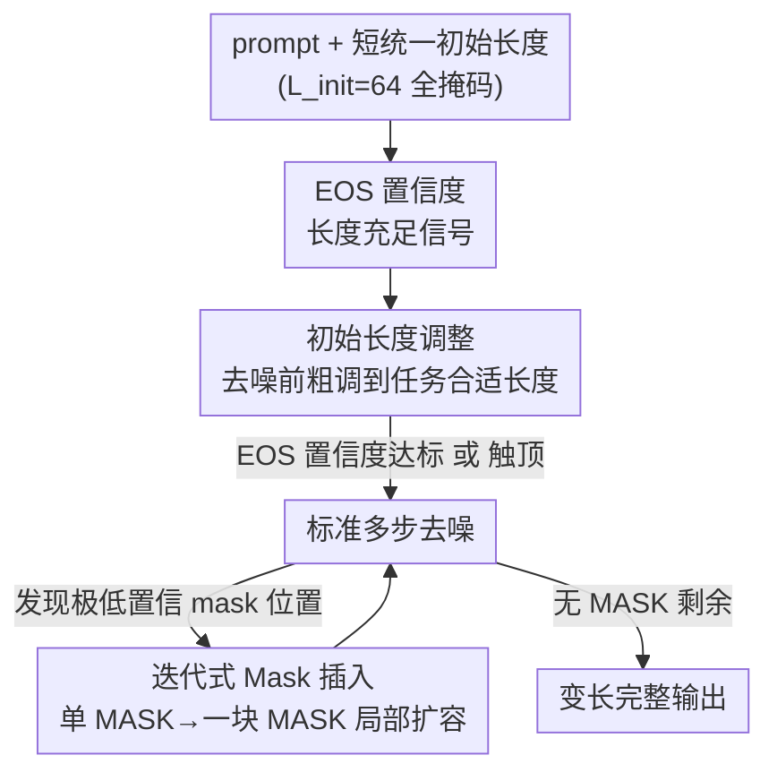

# Beyond Fixed: Training-Free Variable-Length Denoising for Diffusion Large Language Models

**会议**: ICLR2026  
**OpenReview**: [https://openreview.net/forum?id=Ic2A2gCseC](https://openreview.net/forum?id=Ic2A2gCseC)  
**代码**: https://github.com/Li-Jinsong/DAEDAL  
**领域**: LLM效率 / 扩散语言模型 / 推理解码  
**关键词**: 扩散大语言模型, 变长去噪, 训练无关, EOS 置信度, 推理效率

## 一句话总结
DAEDAL 利用扩散大语言模型（DLLM）在去噪时对 EOS token 的预测置信度这一内部信号，免训练地在去噪前先把序列长度从一个短的统一初值粗调到任务合适的长度、再在去噪过程中对低置信度区域局部插入 mask 扩容，从而摆脱"必须手工预设生成长度"的桎梏，在四个数学/代码基准上达到甚至超过精调定长基线的精度，同时大幅提升有效 token 占比。

## 研究背景与动机
**领域现状**：扩散大语言模型（DLLM，如 LLaDA、Dream）正成为自回归（AR）LLM 之外一条有竞争力的路线。它不靠 next-token 逐字生成，而是从一段全部被 [MASK] 的序列出发，靠双向注意力多步迭代去噪，把掩码序列逐步精炼成连贯文本，天然支持并行生成和全局规划。

**现有痛点**：DLLM 的推理有一个写死在架构里的硬约束——**生成长度必须在去噪开始前静态指定**。去噪从一段固定长度 $L$ 的全掩码序列起步，最终输出长度也就被这个 $L$ 锁死。长度给短了，复杂题目（多步推理、长代码）token 不够用，直接答错；长度给长了，一是双向注意力是二次复杂度、算力浪费严重，二是论文实测发现**过长的初始长度反而会掉点**（图 1a）。于是用户被迫在每个 benchmark 上手工网格搜索最优长度，既麻烦又不可迁移。

**核心矛盾**：这本质上是 AR 与 DLLM 的根本差异——**AR 模型根据任务动态决定输出多长，而 DLLM 只能根据预设长度反过来削足适履地塞任务**。更糟的是 DLLM 缺少 AR 的 test-time scaling 能力（无法像"Wait, let me rethink…"那样临时延长来自我纠错），加上它非顺序生成（可能先写好开头结尾、再发现中间推理空间不够），导致逻辑残缺、性能下降。

**切入角度**：作者发现解药藏在 DLLM 自身的规划能力里。每一步去噪时，模型其实是在用不同置信度同时预测所有 mask 位置——这是一种"全局规划"。关键观察是（图 2）：**当长度对任务足够时，模型在序列末端会高置信度地预测出 EOS（结束符）；当长度不够时，模型倾向于把可用空间填满，末端 EOS 的置信度就明显偏低**。也就是说，EOS 置信度是一个免费的、通用的"长度够不够"内部信号。

**核心 idea**：与其在外部手工调长度，不如读出模型自己的 EOS 置信度信号，让 DLLM 从一个短而统一的初始长度起步、按需动态扩张——这就是 DAEDAL（Dynamic Adaptive Length Expansion），一个**完全训练无关**的两阶段变长去噪策略。

## 方法详解

### 整体框架
DAEDAL 不改模型权重、不加任何训练，只在 DLLM 的标准去噪推理外面套了两个阶段，把"长度"从一个写死的超参变成了可动态调整的量。输入是一个 prompt 加上一段**短的统一初始长度**（默认 $L_{init}=64$）的全掩码序列，输出是一段长度自适应任务复杂度的完整生成结果。整条流程的灵魂是同一个信号——**模型自己对 mask 位置（尤其 EOS）的预测置信度**：高置信度 EOS 意味着长度够了，极低置信度的 mask 位置意味着此处需要更多"思考空间"。

围绕这个信号，DAEDAL 分两阶段工作：**阶段一（Initial Length Adjustment）在去噪正式开始前**，跑一个轻量的长度估计循环，靠 EOS 置信度把序列从 64 这个短初值粗调到任务合适的长度，相当于先定一个靠谱的全局规划框架；**阶段二（Iterative Mask Insertion）在去噪过程中**，逐步发现那些预测置信度极低的"卡壳"位置，把单个 [MASK] 替换成一整块 [MASK] 局部扩容，给模型在最需要的地方腾出"喘息空间"。一个是全局的、一次性的长度定调，一个是局部的、实时的按需精修，两者互补。

### 关键设计

**1. EOS 置信度作为长度充足性信号：把"长度够不够"变成模型可自答的内部量**

DAEDAL 的全部机制都立在这一个观察上。标准 DLLM 在第一步去噪（$t=1$）就要从全掩码序列里同时预测所有位置，包括序列末端会不会是 EOS。作者把题目按经验分成两组——"在 128 token 内就能答对的（长度充足）"和"必须用更长序列才答对的（长度不足）"——然后在 128 长度下测两组在序列末端窗口里对 EOS 的平均预测置信度之差（图 2 热力图）。结果差值几乎全为正（绿色），即**长度充足的题目 EOS 置信度系统性更高**。直觉解释很自然：如果模型觉得当前长度不足以把答案讲完，它就倾向于把所有可用空间都用上、不愿过早 commit 到 EOS，于是末端 EOS 置信度偏低。这个信号的价值在于它**通用、免费且训练无关**——不需要额外的长度预测器或标注，直接从模型已有的前向预测里读出来，后面两个阶段都靠它驱动。

**2. 初始长度调整（阶段一）：去噪前用 EOS 置信度把长度从短初值粗调到位**

针对"长度必须预设、给短给长都不对"的痛点，阶段一在主去噪流程**之前**插入一个长度估计循环。它从一个短的初始生成长度起步，每轮对当前序列（prompt + [MASK]）做一次前向，专门看序列末端一个宽度为 $W_{eos}$ 的窗口，算模型在这些位置预测 EOS 的平均置信度。若该置信度低于预设阈值，就判定"长度不足"——意味着模型被迫提前收尾、还没形成完整回答，于是在序列末尾追加一批 [MASK] 把长度扩张（每次扩张量由 expansion factor $E_{factor}$ 控制）。这个循环不断重复，直到 EOS 置信度越过阈值、或长度触到上限为止。它的作用是在精细去噪开始前，先给模型一个**合理的全局规划框架**。消融实验（表 2）证明这一步对全局规划至关重要：单用阶段二、若起始长度太短（如 64），即便比同长度基线强很多，仍够不到基线的峰值——因为初始空间太挤，全局规划从一开始就被压坏了；而把起始长度放宽到 256，单阶段二就能反超基线最优。这说明先把长度定调好，才能给后续局部扩容打下地基。

**3. 迭代式 Mask 插入（阶段二）：去噪中对低置信"卡壳点"局部插块扩容**

阶段一定下的长度仍可能在某些复杂推理段落不够用。作者进一步主张：**预测置信度极低的位置不只是"难 token"，更是"此处局部语境太挤、装不下一个复杂思路"的信号**——模型在喊"我需要更多论述空间"。于是在去噪的每一步里，除了照常确认填入高置信度 token，方法还会标出预测置信度**最低**且低于一个很低阈值的那个 mask 位置，把它标记为"扩展点（expansion point）"。处理扩展点时不再简单重新掩码，而是**把这单个 [MASK] 动态替换成一整块多个 [MASK]**，相当于就地往序列里插入额外空间。这样在真正需要复杂推理或细节展开的地方，模型在后续去噪轮次里就有了"喘息空间"去把语言和逻辑铺开。与阶段一的整体长度定调不同，阶段二是**局部的、按需的、实时发生**的精修，专门兜住"实际需求超过初始估计"的复杂场景，显著增强模型的表达能力。

### 损失函数 / 训练策略
DAEDAL **完全训练无关**：不微调、不加任何模块参数，只是在推理时改造去噪流程。关键超参（EOS 阈值、低置信扩展阈值、窗口宽度 $W_{eos}$、扩张因子 $E_{factor}$、初始长度 $L_{init}$ 等）在所有实验、所有模型上**完全一致、无任何针对模型的调参**，默认 $L_{init}=64$、$W_{eos}=32$、$E_{factor}=8$。

## 实验关键数据

### 主实验
基座为 LLaDA-Instruct-8B、LLaDA-1.5-8B 与 Dream-Instruct-7B；基准为 GSM8K、MATH500（数学，准确率）、MBPP、HumanEval（代码，pass@1）。基线在 64–2048 六档定长上分别测，取其最优档与 DAEDAL（统一初始长度 64）比。下表为 LLaDA-Instruct-8B 结果（基线列取其各基准最优档）：

| 基准 | 指标 | 基线最优（定长） | DAEDAL（init=64） | 说明 |
|------|------|------|------|------|
| GSM8K | Acc | 83.8（@1024） | **85.8** | 总长 1024→363，有效占比 27.7%→73.5% |
| MATH500 | Acc | 39.6（@2048） | **44.2** | +4.6，且总长仅 704 |
| MBPP | Acc | 38.8（@2048） | **40.8** | 用更短总长反超 |
| HumanEval | pass@1 | 47.6（@1024） | **48.2** | 略超峰值 |
| 平均 | Acc | 52.05（@1024） | **54.75** | 统一短初值即超所有定长档均值 |

核心结论：DAEDAL 用一个**统一的短初始长度**就普遍超过同初值基线，并达到甚至超过基线**逐基准精调**后的峰值；而基线的最优长度在不同基准间漂移（1024/2048 各异），印证定长范式不可迁移。效率上，DAEDAL 在相近有效 token 数（$E_{token}$）下总 token 数（$N_{token}$）远低于基线峰值配置，有效 token 占比（$E_{ratio}$）大幅提升，显著减少了双向注意力在冗余长序列上的开销和无意义 padding 的浪费。

### 消融实验
GSM8K + LLaDA-Instruct-8B 上拆解两阶段贡献（表 2）：

| 配置 | Acc | $E_{ratio}$ | 说明 |
|------|-----|-------|------|
| 基线最优（@1024） | 83.8 | 27.7% | 需手工调长度 |
| w/ 阶段一（init=64） | 84.1 | 81.3% | 单阶段一已超基线峰值 |
| w/ 阶段二（init=64） | 72.3 | 83.1% | 初值太短，全局规划受限，够不到基线峰值 |
| w/ 阶段二（init=256） | 84.7 | 75.3% | 初值放宽后单阶段二反超基线 |
| **DAEDAL（两阶段，init=64）** | **85.8** | 73.5% | 两阶段互补，效果最佳 |

超参敏感性（表 3/4）：初始长度 $L_{init}$ 在 32–256 间结果几乎不变（GSM8K 恒为 85.8、HumanEval 恒为 48.2），仅在 512 时轻微回落，体现对初值的强鲁棒性；扩张因子 $E_{factor}$ 从 8 增到 24 精度略升（85.8→86.4）但有效占比下降；EOS 窗口 $W_{eos}$ 从 8 增到 32 精度单调上升（82.9→85.8），故默认取 32。

### 关键发现
- **两阶段互补且都不可或缺**：单用任一阶段都明显超基线，但合用才达最优；阶段一负责"全局规划地基"，阶段二负责"局部按需扩容"。
- **阶段二依赖足够初值**：从极短初值（64）单用阶段二会被糟糕的初始全局规划拖住上限，凸显先定调长度的必要性。
- **强鲁棒性 + 高效率**：对初始长度几乎不敏感，且在相近有效 token 数下总 token 数更低，把有效 token 占比从基线峰值的 ~28% 提到 ~73%。

## 亮点与洞察
- **把"调长度"这个外部超参变成模型内部可读的信号**：EOS 置信度本来就在每次前向里算出来了，作者只是发现并利用了它和"长度够不够"的相关性——零额外成本、零训练，思路非常巧。
- **两阶段分工对应"全局规划 vs 局部细化"两种粒度**：先一次性把长度定调（粗、全局），再在去噪中对卡壳点插块（细、局部），这种"先定框架再补空间"的拆分对其它需要动态预算的生成任务很有借鉴意义。
- **"低置信度 = 需要更多空间"这一重解读很有启发**：通常低置信度被当作"难/不确定"，作者把它读成"局部语境太挤"，从而把它转化为一个扩容触发器，这个视角可迁移到其它需要动态分配生成预算的场景。
- **效率与性能不再二选一**：传统认知里 DLLM 要更高精度就得给更长序列、付更多算力；DAEDAL 用自适应长度同时拿到更高精度和更高有效 token 占比。

## 局限与展望
- **依赖 EOS 置信度信号的可靠性**：方法成立的前提是"EOS 置信度与长度充足性强相关"，这在 LLaDA/Dream 系列上验证有效，但换到训练方式不同、或 EOS 行为不典型的 DLLM 上是否同样成立，仍需更多验证。
- **评测集中在数学与代码推理**：四个基准都偏向有明确答案的推理任务，对开放式长文本生成、对话等长度需求更弹性的任务，动态扩张策略的收益与稳定性尚未充分检验。
- **多个阈值仍需设定**：虽然全程用同一组超参、不针对模型调参，但 EOS 阈值、低置信扩展阈值等仍是预设值，其在更广模型谱系上的可移植性值得进一步研究。
- **未叠加加速优化**：为公平对比作者刻意没用后续工作的缓存/加速技巧，与这些技术的兼容与协同潜力尚待探索。

## 相关工作与启发
- **vs 定长去噪基线**：基线必须为每个任务手工网格搜索最优生成长度，且最优长度跨基准漂移、不可迁移，过长还会掉点、浪费算力；DAEDAL 用统一短初值动态自适应，既省去调参又同时改善精度与效率。
- **vs AR LLM 的 test-time scaling**：AR 模型能靠续写（"Wait…"）临时延长来自我纠错，DLLM 因长度写死缺这种能力；DAEDAL 的迭代式 mask 插入相当于给 DLLM 补上了一种"按需扩容/再思考"的机制，缩小了与 AR 的差距。
- **vs 需训练的长度控制方案**：DAEDAL 走的是完全训练无关路线，不改权重、不加模块，落地成本极低，可直接挂到现有 DLLM 上。

## 评分
- 新颖性: ⭐⭐⭐⭐⭐ 把 EOS 置信度读成长度信号、并据此设计训练无关的两阶段变长去噪，切入点新颖且优雅
- 实验充分度: ⭐⭐⭐⭐ 三模型四基准 + 两阶段拆解 + 多超参鲁棒性消融较完整，但任务类型偏推理、缺开放式生成验证
- 写作质量: ⭐⭐⭐⭐⭐ 动机—观察—方法—实验逻辑链清晰，图 1/2 把核心 insight 讲得很直观
- 价值: ⭐⭐⭐⭐⭐ 直击 DLLM 落地的长度桎梏，免训练即插即用、同时提精度与效率，实用价值高

<!-- RELATED:START -->

## 相关论文

- [\[ICLR 2026\] Hierarchy Decoding: A Training-free Parallel Decoding Strategy for Diffusion Large Language Models](hierarchy_decoding_a_training-free_parallel_decoding_strategy_for_diffusion_larg.md)
- [\[ICLR 2026\] UltraLLaDA: Scaling the Context Length to 128K for Diffusion Large Language Models](ultrallada_scaling_the_context_length_to_128k_for_diffusion_large_language_model.md)
- [\[ICLR 2026\] Training-Free Loosely Speculative Decoding: Accepting Semantically Correct Drafts Beyond Exact Match](training-free_loosely_speculative_decoding_accepting_semantically_correct_drafts.md)
- [\[ICLR 2026\] Beyond Masks: Efficient, Flexible Diffusion Language Models via Deletion-Insertion Processes](beyond_masks_efficient_flexible_diffusion_language_models_via_deletion-insertion.md)
- [\[ICLR 2026\] Dynamic-dLLM: Dynamic Cache-Budget and Adaptive Parallel Decoding for Training-Free Acceleration of Diffusion LLM](dynamic-dllm_dynamic_cache-budget_and_adaptive_parallel_decoding_for_training-fr.md)

<!-- RELATED:END -->
