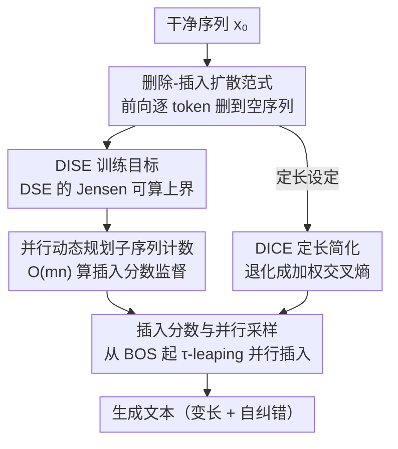

# Beyond Masks: Efficient, Flexible Diffusion Language Models via Deletion-Insertion Processes

**会议**: ICLR 2026  
**OpenReview**: [https://openreview.net/forum?id=VbvXjs5f72](https://openreview.net/forum?id=VbvXjs5f72)  
**代码**: https://github.com/FMD-NEXT/DID  
**领域**: 扩散语言模型 / 语言模型预训练  
**关键词**: 离散扩散、删除-插入过程、插入分数、变长生成、自纠错

## 一句话总结
DID 把扩散语言模型的「掩码-去掩码」彻底换成「删除-插入」两条连续时间马尔可夫链：前向把 token 逐个删到空序列、后向从空序列逐个插回去，再配一套基于「插入分数」的 DISE 训练目标和并行动态规划，既扔掉了占一半算力的 `<MASK>`/`<PAD>` token，又天然支持变长和生成中自纠错，定长/变长两种设定下训练加速最高 3.42×、推理加速最高 3.79×。

## 研究背景与动机
**领域现状**：扩散语言模型（DLM）被视为自回归（AR）模型之外最有希望的语言建模范式，主打双向上下文和并行解码。其中研究最多的是掩码扩散语言模型（MDLM，如 LLaDA、RADD）：前向过程把每个 token 逐步腐蚀成吸收态 `<MASK>`，后向过程从全是 `<MASK>` 的固定长度序列出发，迭代地把 token「去掩码」还原出来。

**现有痛点**：MDLM 被「固定序列长度」这件事死死卡住，带来两个根本问题。其一是**生成不灵活**——序列长度在扩散过程中是定死的，建模变长数据时必须把所有样本 padding 到同一长度，于是一堆 `<PAD>` token 白白吃掉算力，「生成短句子并不会更快」；而且 token 一旦被去掩码，它的内容和绝对位置就锁死了，跟 AR 一样会累积早期错误，没法自纠错。其二是**算力浪费**——模型每一步都要在整条满长度序列上前向，按常用的对数线性噪声调度，训练和推理时大约**一半的 FLOPs 都花在不携带信息的 `<MASK>` token 上**。

**核心矛盾**：问题的根都在「掩码-去掩码」这套范式本身——它要求序列长度全程不变，于是 `<MASK>`（占位）和 `<PAD>`（补长）这两类无信息 token 不可避免，灵活性和效率同时被牺牲。

**本文目标**：在保持「离散扩散、有似然界、可并行解码」这些优点的前提下，造一个既不需要 `<MASK>` 也不需要 `<PAD>`、且原生支持变长和自纠错的扩散语言模型。

**切入角度**：作者发现，「删除」和「插入」这对操作可以同样严格地写成离散扩散的前向/后向 CTMC。前向用「删除」把序列逐步缩短到空，后向用「插入」从空序列重建——这样序列长度是动态变化的，`<MASK>`/`<PAD>` 根本无从产生，而「在已有内容之间插入新 token」天生就是一种自纠错。

**核心 idea**：用「删除-插入」过程替换 MDLM 的「掩码-去掩码」过程，并为这套新范式推导出一个有似然上界保证的、可高效并行训练的「插入分数」目标。

## 方法详解

### 整体框架
DID（Deletion-Insertion Diffusion language model）把一个语言模型的训练和生成都重新挂到「删除-插入」这对操作上。**前向过程**是一条作用在「所有可变长序列」状态空间上的 CTMC：每个 token 以速率 $\sigma(t)$ 独立地被删除（转移到空态 $\varnothing$），序列越来越短，直到只剩一个不可删的 `<BOS>`，代表空序列。**后向过程**是它的时间反演，只做「单 token 插入」：从 `<BOS>` 出发，一步步把 token 插回去，直到重建出完整序列——这就是生成过程。

训练的难点在于：插入「在哪个位置插哪个 token」是一个变形状的输出，直接套用 MDLM 的 concrete score 学法会因为「不同插入可能产生同一结果」而变得无法处理。DID 的解法是定义一个形状规整（$|x_t|\times|V|$）的**插入分数** $\bar s$，证明 concrete score 是插入分数的缩放平均、从而把采样改写成纯插入操作；再用 Jensen 不等式把扩散标准目标 DSE 放成一个可算的上界 **DISE**；DISE 里出现的「子序列计数比」用一套 $O(mn)$ 的**并行动态规划**精确算出来；在定长设定下 DISE 还能进一步退化成类交叉熵的 **DICE**。整条 pipeline 如下：

### 关键设计

**1. 删除-插入扩散范式：用删/插的 CTMC 替掉掩码/去掩码**

针对「固定长度逼出 `<MASK>`/`<PAD>`」这个根因，DID 把前向过程定义成 token 级独立删除：在无穷小时间内，token $v$ 以 $\sigma(t)\Delta t$ 的概率被删除、否则保持不变。基于这个独立性，可以解析地写出序列级转移概率
$$p_{t|s}(x_t|x_s)=(1-e^{-(\bar\sigma(t)-\bar\sigma(s))})^{|x_s|-|x_t|}\,e^{-(\bar\sigma(t)-\bar\sigma(s))|x_t|}\,N(x_t,x_s),$$
其中 $\bar\sigma(t)=\int_0^t\sigma(\tau)\,d\tau$ 是累积噪声率，$N(x_t,x_s)$ 是 $x_t$ 作为「不同子序列」出现在 $x_s$ 中的次数——这个计数恰好统计了从 $x_s$ 删到 $x_t$ 的所有独立删除路径的多重性。由于每个无穷小步至多删一个 token，序列级转移率只在「$y$ 删一个 token 得到 $x_t$」时非零，且 $Q_t(y,x_t)=\sigma(t)N(x_t,y)$。实现上序列头部固定一个不可删的 `<BOS>`，所以「全噪声态」就是单个 `<BOS>`，它同时充当生成第一步的输入、代表空序列。

这套范式和已有插入类工作的区别正是它的价值：经典插入模型（Insertion/Levenshtein Transformer、InsNet）的目标是局部编辑策略、不对全局数据分布建模；FlexMDM 只是在掩码范式里多插 `<MASK>`、本质没跳出掩码；Edit Flows 虽是序列级流匹配但要引入辅助的「编辑路径」隐变量、靠蒙特卡洛采样估计目标、带来额外方差与工程复杂度；ILM 则不是真正的扩散模型、目标偏启发式、还只能一步插一个 token 并额外训一个网络判断何时停。DID 因为删除过程的独立性结构，前向转移有「子序列计数」的闭式表达，不需要任何辅助变量，就把灵活插入和严格离散扩散接上了。

**2. 插入分数与并行采样：把变形状的 concrete score 换成规整的逐位置打分**

直接学 concrete score 在这里行不通——给定 $x_t$，能插出的结果 $y$ 数量是变的（不同插入位置可能得到同一个 $y$），要求模型输出一个变形状的张量，复杂到没法实现。DID 改为学**插入分数**：把「在第 $i$ 位之后插入 token $v$」记作动作 $(i,v)$，结果序列 $\mathrm{Ins}(x_t,i,v)=(x_{\le i},v,x_{>i})$，并定义
$$\bar s(x_t,t)[i,v]\;\stackrel{\text{def}}{=}\;\frac{\mathbb E_{x_0}[(1-e^{-\bar\sigma(t)})^{|x_0|}N(\mathrm{Ins}(x_t,i,v),x_0)]}{\mathbb E_{x_0}[(1-e^{-\bar\sigma(t)})^{|x_0|}N(x_t,x_0)]},$$
它的形状固定为 $|x_t|\times|V|$，正好是 transformer 能吐出的张量。作者进一步证明 concrete score 是这些插入分数的缩放平均、反向转移率是各插入动作率之和，于是采样可以完全绕开难算的 $N(x_t,y)$，直接按
$$p^\theta_{t-\Delta t|t}((i,v)|x_t)=\frac{\sigma(t)e^{-\bar\sigma(t)}}{1-e^{-\bar\sigma(t)}}\,\bar s_\theta(x_t,t)[i,v]\,\Delta t\quad(v\neq\varnothing)$$
来对每个「位置-token」对独立采样，并用 $\tau$-leaping 一步同时落多个插入实现**并行解码**。因为打分挂在「相对位置」而非绝对位置上，早期插得不好的 token 还能在后续步骤里被新插入的 token 重排修正，这就是 DID 内禀的自纠错。

**3. DISE 训练目标：给删除-插入过程的扩散损失一个可算上界**

要用扩散标准目标 DSE 训练，需要把参数化的 concrete score $s_\theta$（它是一堆插入分数之和）代回 DSE，但「和的对数」会让目标出现难处理的 log-sum 结构。作者用 Jensen 不等式把它放成一个可算的变分上界——**Denoising Insertion Score Entropy（DISE）**：
$$L^{\text{DISE}}_\theta(x_0)=\mathbb E_{t,x_t}\Big\{\tfrac{\sigma(t)e^{-\bar\sigma(t)}}{1-e^{-\bar\sigma(t)}}\sum_{i,v}\big[\bar s_\theta(x_t,t)[i,v]-\tfrac{N(\mathrm{Ins}(x_t,i,v),x_0)}{N(x_t,x_0)}\log\bar s_\theta(x_t,t)[i,v]+C\big]\Big\},$$
其中 $C$ 是与 $\theta$ 无关的常数。关键点在于：这个上界把目标从「按状态 $y$」改写成「按动作 $(i,v)$」，因此训练时只需对每个候选插入动作打分、用「插入前后的子序列计数比」$N(\mathrm{Ins}(x_t,i,v),x_0)/N(x_t,x_0)$ 当监督目标，整套训练保持了似然有界（DISE 是 DSE 的上界，DSE 又是负 ELBO），比 ILM 那种启发式目标更有理论支撑。

**4. 并行动态规划子序列计数：把 $O(mn^2V)$ 砍到 $O(mn)$**

DISE 的瓶颈是：对 $x_t$ 上所有可能的插入 $(i,v)$，都要算 $N(\mathrm{Ins}(x_t,i,v),x_0)$ 与 $N(x_t,x_0)$ 的比值。单个子序列计数用 DP 是 $O(mn)$（$m,n$ 为 $x_0,x_t$ 长度），但对 $n\times|V|$ 个插入逐个算就是 $O(mn^2V)$，训练根本跑不动。作者证明，只要把 $N(x_t,x_0)$ 用**前缀 DP**和**后缀 DP** 各算一遍（拿到两张中间结果矩阵），所有插入的计数就能由
$$N(\mathrm{Ins}(x_t,i,v),x_0)=\sum_{j=1}^{m}\big[\delta(x_0[j],v)\cdot\underbrace{N(x_t[:i],x_0[:j-1])}_{\text{前缀 DP}}\cdot\underbrace{N(x_t[i:],x_0[j:])}_{\text{后缀 DP}}\big]$$
一次性并行得到——前后缀矩阵逐元素相乘、再做一次按 token 索引的稀疏加和即可。前缀/后缀 DP 都能沿 $i$ 维向量化、只在 $j$ 维顺序循环 $m$ 次，于是算所有计数比的总复杂度从 $O(mn^2V)$ 降到 $O(mn)$，DID 训练才变得可行。这一步是把「理论上漂亮的目标」落成「实际能训」的关键工程。

**5. DICE 定长简化：定长设定下退化成类交叉熵、可去掉时间输入**

为了在 MDLM 常用的定长语言建模 benchmark 上做公平对比、并干净地隔离出 DID 的 FLOPs 优势，作者针对 $|x_0|$ 为常数的情形做了简化。此时插入分数里的时间相关项 $(1-e^{-\bar\sigma(t)})^{|x_0|}$ 会被约掉，带来两个好处：一是**插入分数变得与时间无关**（$\bar s_\theta(x_t)$），网络不再需要 $t$ 作为输入，省掉时间嵌入参数，序列不变时还能像 RADD 那样缓存；二是出现**序列级归一化** $\sum_{i,v}\bar s(x_t,t)[i,v]=|x_0|-|x_t|$，可以把网络输出显式归一化。于是 DISE 里那个求和项变成常数，目标退化为 **Denoising Insertion Cross Entropy（DICE）**：
$$L^{\text{DICE}}_\theta(x_0)=\mathbb E_{t,x_t}\Big\{\tfrac{\sigma(t)e^{-\bar\sigma(t)}}{1-e^{-\bar\sigma(t)}}\sum_{i,v}\tfrac{N(\mathrm{Ins}(x_t,i,v),x_0)}{N(x_t,x_0)}\big[-\log\bar s_\theta(x_t)[i,v]+C\big]\Big\},$$
可解释为「预测插入分数」和「子序列计数比真值」之间的加权交叉熵，故得名 DICE。它让 DID 在定长设定下的参数化和学习都更顺、收敛更好。

### 损失函数 / 训练策略
变长设定用 DISE（式 12），定长设定用其简化版 DICE（式 18）。两者本质都是以「插入前后子序列计数比」为目标、对每个插入动作打分的加权（交叉）熵，借并行 DP 精确求监督信号。生成端统一用 $\tau$-leaping 近似模拟同时落多个插入以并行解码。实验中 DID 不需任何额外的超参调优。

## 实验关键数据

### 主实验
定长设定：在 OpenWebText 上以 RADD 为 MDLM 基线，按算力对齐比较。由于 DID 省掉 `<MASK>`、同样训练步数下 FLOPs 约为 RADD 的一半，作者比了两种配置：DID-S（步数对齐，400K 步）和 DID-F（FLOPs 对齐，800K 步）。零样本困惑度（越低越好，扩散模型为上界）：

| 规模 | 方法 | WikiText | Lambada | Pubmed | AG News | LM1B | Arxiv | PTB |
|------|------|----------|---------|--------|---------|------|-------|-----|
| Small | RADD | 38.27 | 51.82 | 56.99 | 73.18 | 72.99 | 85.95 | 108.79 |
| Small | DID-S | 38.72 | 49.10 | 55.02 | 76.02 | 74.04 | 82.41 | 115.37 |
| Small | DID-F | **36.91** | **48.00** | **52.89** | **71.48** | **72.04** | **78.38** | 111.60 |
| Medium | RADD | 28.44 | 44.10 | 41.06 | 48.96 | 60.32 | 66.28 | 81.05 |
| Medium | DID-F | **28.35** | **41.00** | **38.71** | **48.84** | **58.05** | **61.77** | 87.09 |

读法：DID-S 在只用约一半 FLOPs 时已和 RADD 相当；FLOPs 对齐的 DID-F 在多数数据集上反超 RADD——说明省下的算力被实打实转成了建模性能（PTB 是少数例外）。

变长设定（Stories 数据集，对比 ILM 和 padding 后的 RADD）生成质量与速度，DID 全程更稳、PPL 显著更低：

| 方法 | Steps=64 PPL | 128 | 256 | 512 | 推理 speedup(vs RADD) |
|------|------|------|------|------|------|
| ILM | 161.80 | 137.64 | 42.29 | 31.14 | （最快但质量最差） |
| RADD | 81.92 | 50.89 | 34.47 | 26.78 | 1× |
| DID | **22.78** | **21.07** | 21.90 | 23.88 | 最高 **3.79×** |

DID 的生成长度分布（Fig. 2 的 CDF）也最贴近真实数据分布，长度建模能力明显优于两个基线。

### 消融实验

| 配置 | 关键指标 | 说明 |
|------|---------|------|
| DID-DICE（定长完整版） | Tab.1 最优 | 定长设定用 DICE，性能反超 RADD |
| DID-DISE（去掉定长优化） | 弱于 DICE、与 RADD 相当 | 不用 §3.5 的定长简化（DICE）时性能回落，验证 DICE 的必要性 |
| 训练加速（定长，small→large） | 1.89×→1.99× | 去掉 `<MASK>` 计算，模型越大加速越明显 |
| 训练加速（变长，small→large） | 2.58×→3.42× | 去掉 `<PAD>`，变长下收益更大（平均长 213 ≪ padding 1024） |

### 关键发现
- **省的是无信息 token 的算力**：定长下去掉 `<MASK>` 带来约 2× 理论 FLOPs 节省，实测训练 1.89–1.99×、推理约 1.5×；变长下再叠加去掉 `<PAD>`，训练最高 3.42×、推理最高 3.79×。
- **实测加速低于理论 2×** 的原因：推理不是纯 FLOPs-bound 任务；训练侧 DP 算法是与模型规模无关的常数开销，所以模型越大、这部分被摊薄、加速越高；变长数据的系统级支持还不成熟也限制了加速。
- **DID 对生成步数更鲁棒**：步数较少时 DID 的生成 PPL 远好于 RADD（如变长 64 步 22.78 vs 81.92），且 PPL 随步数变化平稳；RADD 只在步数很多时才在定长上略胜，因为它本就是为定长设计的。

## 亮点与洞察
- **把「删除/插入」严格写成扩散 CTMC**：最巧的一步是发现删除过程的 token 级独立性让序列级转移概率有「子序列计数」的闭式，于是不必像 Edit Flows 那样引入辅助编辑路径变量、也不引入额外采样方差——这是 DID 同时拿到「严格似然界」和「无 `<MASK>`/`<PAD>`」的根本原因。
- **插入分数这个再参数化**：把变形状、难算的 concrete score 换成形状规整的 $|x_t|\times|V|$ 插入分数，并证明二者只差一个缩放平均，让 transformer 能直接输出、采样能完全绕开难算项。这种「换一个等价但可参数化的量来学」的思路可迁移到其他变结构生成问题。
- **前缀+后缀 DP 一次算全部插入计数**：把 $O(mn^2V)$ 压到 $O(mn)$ 的并行 DP 是让漂亮目标真正能训的关键，且可向量化、可稀疏实现。
- **插入天生自纠错**：基于相对位置而非绝对位置，早期错误能靠后续「在中间插 token」修正；论文还总结了上下文感知的解码顺序、谨慎的早期生成（首步至多插 1 个）、对相邻 token 依赖处理更好等四条结构性优势，解释了为何少步生成时 DID 更稳。

## 局限与展望
- **变长场景的系统支持不成熟**：作者明确指出变长数据缺少成熟的系统级优化，实测加速因此被压低；DP 损失实现也带来与模型无关的常数开销。
- **理论加速与实测有差距**：定长理论 2×、实测训练约 1.9×、推理约 1.5×，说明真实收益受 memory-bound、采样开销等非 FLOPs 因素牵制。
- **PTB 等个别数据集上未必更优**：定长 DID-F 在 PTB 上仍逊于 RADD，说明删除-插入范式并非在所有分布上都占优。
- **规模仍偏小**：实验止于 small/medium（large 只测了训练速度未充分训练），在真正大规模、下游任务上的表现仍待验证；与现代大词表、长上下文设定的适配也未展开。

## 相关工作与启发
- **vs MDLM（RADD / LLaDA）**：MDLM 用掩码-去掩码、固定长度，必产生 `<MASK>`/`<PAD>` 且绝对位置锁死无法自纠错；DID 用删除-插入、动态长度，扔掉两类无信息 token 并基于相对位置自纠错。代价是 DID 在「天生为定长设计」的纯定长多步场景下不总占优。
- **vs ILM（插入式 LM）**：ILM 也用删除前向学插入后向，但不是真扩散模型、目标偏启发式、每步只能插一个 token、还要额外网络判停；DID 有似然有界的 DISE 目标、可 $\tau$-leaping 并行一步多插、无需停机网络，生成质量大幅领先（变长 PPL 22.78 vs 161.80@64 步）。
- **vs Edit Flows**：同样面向变长、用插入/删除/替换编辑，但要引入辅助编辑路径隐变量并蒙特卡洛估计目标，带来额外方差与工程复杂度；DID 借删除独立性得到闭式子序列计数，精确求目标、无辅助变量。
- **vs FlexMDM**：FlexMDM 在掩码范式里学一个插入期望来多插 `<MASK>` 以支持变长，本质没跳出掩码；DID 从范式层面取消掩码。

## 评分
- 新颖性: ⭐⭐⭐⭐⭐ 把扩散语言模型从「掩码-去掩码」整体迁到「删除-插入」，并配齐严格的 CTMC 形式化、插入分数再参数化与 DISE/DICE 目标，是范式级创新。
- 实验充分度: ⭐⭐⭐⭐ 定长/变长双设定、与 MDLM 和插入式 LM 都比、覆盖建模质量+生成质量+长度分布+训练/推理速度；不足是规模偏小、个别数据集未占优。
- 写作质量: ⭐⭐⭐⭐⭐ 推导严谨、动机清晰，从范式到目标到高效实现层层递进，附录给了完整证明与 PyTorch 实现。
- 价值: ⭐⭐⭐⭐ 为扩散语言模型提供了一条无 `<MASK>`/`<PAD>`、原生变长且自纠错的新路线，效率与灵活性兼得，对后续 DLM 设计有方法论价值。

<!-- RELATED:START -->

## 相关论文

- [\[ICLR 2026\] Beyond Fixed: Training-Free Variable-Length Denoising for Diffusion Large Language Models](beyond_fixed_training-free_variable-length_denoising_for_diffusion_large_languag.md)
- [\[ICLR 2026\] DPad: Efficient Diffusion Language Models with Suffix Dropout](dpad_efficient_diffusion_language_models_with_suffix_dropout.md)
- [\[ICLR 2026\] Diffusion Language Models Know the Answer Before Decoding](diffusion_language_model_knows_the_answer_before_it_decodes.md)
- [\[ICLR 2026\] FlashDLM: Accelerating Diffusion Language Model Inference via Efficient KV Caching and Guided Diffusion](flashdlm_accelerating_diffusion_language_model_inference_via_efficient_kv_cachin.md)
- [\[ICLR 2026\] UltraLLaDA: Scaling the Context Length to 128K for Diffusion Large Language Models](ultrallada_scaling_the_context_length_to_128k_for_diffusion_large_language_model.md)

<!-- RELATED:END -->
