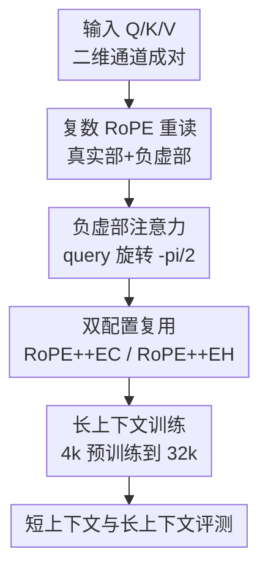

# Beyond Real: Imaginary Extension of Rotary Position Embeddings for Long-Context LLMs

**会议**: ICLR2026  
**OpenReview**: [https://openreview.net/forum?id=D5PJX02Jki](https://openreview.net/forum?id=D5PJX02Jki)  
**代码**: https://github.com/OpenMOSS/rope_pp  
**领域**: LLM效率  
**关键词**: 长上下文, RoPE, 位置编码, KV Cache, 长度外推  

## 一句话总结
RoPE++ 重新拿回标准 RoPE 复数注意力中被丢弃的负虚部，把它作为与真实部并行的 imaginary attention head，在不增加 KV cache 或直接减半 cache 的配置下提升长上下文建模能力。

## 研究背景与动机
**领域现状**：当前主流 LLM 基本都把 RoPE 作为位置编码的默认选择。它把 query 和 key 的二维通道对看成复数或旋转矩阵，通过位置相关的旋转角把绝对位置编码进向量，最终在注意力分数里自然出现相对距离 $t-s$。这让 RoPE 同时保留绝对位置和相对位置的好处，也解释了它为什么会出现在 LLaMA、Qwen 等长上下文模型的基础实现里。

**现有痛点**：长上下文扩展里，大量工作都在调 RoPE 的外部用法，例如调整 rotary base、做位置插值、做 YaRN 或 NTK scaling、把不同频率维度分区，或者配合稀疏注意力减少计算。它们多数默认标准 RoPE 的内部计算已经合理，只是在训练长度之外想办法让曲线别太快失控。但标准实现里有一个更基础的细节：RoPE 的复数乘积原本有真实部和虚部，最后进入 attention score 的只有真实部，虚部被直接扔掉了。

**核心矛盾**：真实部不是“完整 RoPE”，而是完整复数关系的一半。真实部对应的特征曲线更偏局部语义聚合，随着相对距离增加会更明显衰减；被丢掉的负虚部同样携带相对位置信息，而且平均上更愿意关注较远 token。也就是说，长上下文最需要的那部分相位关系，可能恰好被标准 RoPE 的 real-only 打分删掉了。

**本文目标**：作者希望回答三个问题：第一，虚部是否仍然能写成与 RoPE 一样的相对/绝对位置编码形式；第二，把虚部加入注意力后，能否真正帮助远距离依赖而不是只增加噪声；第三，这个改动在长上下文最敏感的 KV cache、参数量和推理吞吐上是否可控。

**切入角度**：论文从 RoPE 的复数形式重新推导，而不是从经验插值规则出发。作者观察到负虚部只需要对 query 额外旋转 $-\pi/2$，key 的位置编码保持不变，因此 imaginary attention 可以复用标准 RoPE 的绝对-相对统一结构，也可以和 FlashAttention / GQA 的现有实现自然拼接。

**核心 idea**：把标准 RoPE 复数注意力中被丢弃的负虚部重新作为一组 attention head 注入模型，让真实部负责更强的局部语义聚合，虚部补上更长距离的相位依赖。

## 方法详解

### 整体框架
RoPE++ 的整体流程很直接：先按标准 RoPE 计算真实部注意力，再把同一组 query 旋转 $-\pi/2$ 后与同一组 key 做一次并行注意力，得到负虚部注意力；最后根据资源目标选择 RoPE++EC 或 RoPE++EH，把真实部和虚部作为不同 head 输出给后续层。它不改变 Transformer 的主干，也不要求新增一套位置编码参数，核心改动发生在 QK attention score 的组织方式上。

在符号上，标准 RoPE 对每个二维通道对 $(2n,2n+1)$ 施加旋转，复数形式可写成 $\tilde q_t^{(n)} \tilde k_s^{(n)*} e^{i\theta_n(s-t)}$。标准注意力只取其实部 $A^{Re}_{t,s}$。RoPE++ 额外取负虚部 $A^{Im}_{t,s}$，并把它整理成与标准 RoPE 同构的旋转形式：

$$
A^{Re}_{t,s} = (R_{\Theta,t}q_t)^\top R_{\Theta,s}k_s = q_t^\top R_{\Theta,s-t}k_s
$$

$$
A^{Im}_{t,s} = (R_{\Theta,t}R_{-\pi/2}q_t)^\top R_{\Theta,s}k_s = (R_{-\pi/2}q_t)^\top R_{\Theta,s-t}k_s
$$

这两个公式很重要：虚部不是任意加出来的一路分支，它仍然是 RoPE 家族里的合法位置编码，只是 query 先多转了四分之一圆。key 的旋转与标准 RoPE 完全一致，因此 KV cache 不必为 imaginary attention 另存一份位置编码后的 key。

### 关键设计
**1. 复数 RoPE 重读：把被丢掉的负虚部变成可训练信号**

标准 RoPE 的向量旋转可以等价看成复数乘法。以往实现为了得到实数 attention score，会直接取复数乘积的实部，这在工程上很自然，却把虚部中关于相位方向的关系抹掉。论文不是简单说“虚部也有信息”，而是推导出负虚部也能写成相对位置形式：它同样依赖 $\theta_n(t-s)$，同样能拆成 query 和 key 各自的绝对位置旋转，只是 query 需要先做 $R_{-\pi/2}$。

这个设计的好处是边界很清楚。RoPE++ 没有发明新的频率表，也没有让模型学习一套额外位置参数，而是在原来已经存在的复数结构里恢复另一半计算。因此它保留了 RoPE 最有价值的“绝对编码输入、相对距离出现在 attention score”这一性质，避免变成一个只靠经验验证的黑盒位置编码变体。

**2. 负虚部注意力：用 sine 型特征曲线补足远距离依赖**

论文把真实部和负虚部的平均行为都写成频率积分。真实部对应的是类似 cosine integral 的曲线，直观上在近距离处更强，随距离增加逐渐衰减；负虚部对应的是 sine integral 型曲线：

$$
c^{Im}(\Delta t)=\frac{2}{d}\sum_{n=0}^{d/2-1}\sin(10^{-8n/d}\Delta t),\quad
\tilde c^{Im}=Si(\Delta t)-Si\left(\frac{\Delta t}{10^4}\right)
$$

因为 $\sin(0)=0$，虚部注意力在零距离处不是最强，这与真实部的局部聚合偏置不同。作者选择负虚部，是为了让相似 query-key 在平均意义下仍然得到正向增益；同时，sine 型曲线在远距离区域下降更慢，使 imaginary head 更容易把注意力分给长上下文中的全局信息。后面的可视化也印证了这一点：imaginary head 更常关注初始位置和全局锚点，而 real head 更偏局部邻域。

**3. 双配置复用：同一机制服务“同 cache 更强”和“同 head 更省”两种目标**

RoPE++ 最实用的地方在于它没有把长上下文收益建立在更大的 KV cache 上。RoPE++EC 表示 equal cache：保持 KV cache 与标准 RoPE 相同，复用同一批 key/value，把原 query 和 $R_{-\pi/2}q$ 交错送入注意力，于是 head 组数相当于翻倍。它的代价主要是额外 attention 计算和更大的输出投影 $W_o$，但不会把长上下文推理中最贵的 KV cache 再扩大一份。

RoPE++EH 表示 equal head：保持总 attention head 数与原模型一致，因此 QKV 参数和 KV cache 可以减半，再由真实部与虚部一起补回 head 表达能力。在长上下文解码里，cache 内存和带宽往往比纯计算更要命，所以 EH 版本的意义不是追求最高分，而是在接近或超过 RoPE 的同时换来更低显存和更快 TPOT。论文特别强调 real 和 imaginary attention 必须共享 $W_q$，不能随意把 75% head 分给虚部、25% 分给真实部；虚部是相对于同一个真实 query 的 $-\pi/2$ 旋转，不是一组独立参数头。

**4. 更完整的位置取值覆盖：让外推时的 OOD 位置模式变少**

RoPE 的长度外推失败，部分原因在于训练窗口内某些维度只见过一侧的正/负位置编码取值，推理长度超过训练范围后才遇到未见过的负值或极值。RoPE++ 加入 imaginary attention 后，同一维度组合会同时经历 cosine 和 sine 的不同符号关系，一些原本只在长距离才出现的取值范围，在预训练窗口内就提前暴露给模型。

这个解释并不等于 RoPE++ 可以像某些外推方法那样零训练无限延长上下文。论文的说法更谨慎：RoPE++ 仍然需要从头训练或继续长上下文训练，超过支持长度后 perplexity 也会上升；但因为更多维度见过完整的正负位置模式，它的 perplexity 曲线上升更慢，和 Linear PI、YaRN、NTK scaling 等技术也可以组合。

### 一个完整示例
可以把某一层、某一个 token $t$ 的注意力计算想成两路并行读上下文。第一路是标准 RoPE：query $q_t$ 和历史 key $k_s$ 各自按位置旋转后做点积，得到真实部注意力。它更像在问“附近有没有语义相似的 token”，因此很适合局部连贯建模。

第二路不重新生成 key，也不额外缓存 key，而是把同一个 $q_t$ 先旋转 $-\pi/2$，再与同一批旋转后的 $k_s$ 做点积。对于同一个远处 token $s$，这一路看到的是相位上错开四分之一周期的关系；如果该远处位置携带章节开头、全局事实、needle 信息或长距离引用，imaginary head 更可能保留它的影响。最终，两路输出像不同 attention head 一样进入后续投影，模型可以在训练中自己学习何时依赖局部 real head、何时依赖更全局的 imaginary head。

### 损失函数 / 训练策略
RoPE++ 本身不是一个新损失，而是注意力结构与位置编码计算的改造。训练目标仍然是标准自回归语言建模损失，优化器使用 AdamW，weight decay 为 0.1，最大学习率 $5\times 10^{-4}$，采用 warmup-stable-decay 调度：前 0.5B token warmup，最后 5B token decay 到 0。

实验训练分两段。第一段在 DCLM-Baseline-1.0 上做 4k context 的预训练，376M 和 776M 模型各训练 50B tokens，batch size 为 0.5M tokens。第二段对 RoPE 和 RoPE++ 做 32k context 的长上下文继续训练，训练 10B tokens，并把 rotary base 从 10000 调到 500000。论文还额外测试了 Linear PI、YaRN 等长上下文技术与 RoPE++ 的组合，说明 RoPE++ 更像底层 RoPE 机制增强，而不是与插值路线互斥的替代品。

## 实验关键数据

### 主实验
短上下文评测使用 OpenCompass，包含 WikiText / LAMBADA perplexity，以及 TruthfulQA、PIQA、HellaSwag、WinoGrande、ARC-e、GPQA、SocialIQA、OpenBookQA、SuperGLUE 等任务。下表只摘平均分和 perplexity，重点看 RoPE++ 是否在不牺牲短文本能力的情况下成立。

| 模型规模与训练阶段 | 方法 | Wiki ppl ↓ | LAMBADA ppl ↓ | 短任务 Avg ↑ | 说明 |
|--------|------|------:|------:|------:|------|
| 376M Short | RoPE | 19.9 | 32.7 | 40.1 | 标准 RoPE 基线 |
| 376M Short | RoPE++EH | 20.8 | 33.6 | 40.3 | 半 QKV / 半 KV cache，平均仍略高 |
| 376M Short | RoPE++EC | 19.4 | 32.6 | 41.0 | 同 cache，平均最佳 |
| 376M Long | RoPE | 20.4 | 33.8 | 39.6 | 32k 继续训练后基线 |
| 376M Long | RoPE++EC | 20.0 | 33.9 | 40.1 | 长训后仍优于 RoPE |
| 776M Short | RoPE | 14.8 | 27.3 | 42.0 | 更大模型基线 |
| 776M Short | RoPE++EC | 14.8 | 27.3 | 42.8 | 同 cache，短任务平均最高 |
| 776M Long | RoPE | 14.6 | 27.3 | 41.3 | 32k 继续训练后基线 |
| 776M Long | RoPE++EC | 14.4 | 27.1 | 43.5 | 长训后提升更明显 |

长上下文主实验使用 RULER 和 BABILong，覆盖 4k 到 64k 或 2k 到 64k。最关键的结论是：EC 版本在同 KV cache 下长上下文平均分最高，EH 版本虽然省 cache，但在不少设置中仍能接近甚至超过 RoPE。

| 模型规模 | 方法 | RULER Avg ↑ | BABILong Avg ↑ | 64k RULER ↑ | 64k BABILong ↑ | 资源含义 |
|------|------|------:|------:|------:|------:|------|
| 376M Long | RoPE | 18.8 | 11.0 | 5.5 | 7.8 | 标准 cache |
| 376M Long | RoPE++EH | 18.2 | 11.6 | 5.9 | 9.7 | 半 KV cache / 半 QKV |
| 376M Long | RoPE++EC | 25.0 | 16.1 | 9.0 | 12.8 | 同 KV cache，head 组增加 |
| 776M Long | RoPE | 27.4 | 22.8 | 10.4 | 12.1 | 标准 cache |
| 776M Long | RoPE++EH | 28.6 | 19.4 | 10.7 | 12.2 | 半 KV cache，但 BABILong 平均偏弱 |
| 776M Long | RoPE++EC | 29.4 | 24.1 | 10.9 | 14.8 | 同 KV cache，整体最佳 |

### 消融实验
论文的消融和分析主要围绕“imaginary attention 是否真的承担长上下文功能”展开，而不是做传统模块开关。作者观察 attention pattern，并分别给 real / imaginary attention 加同标准差的 Gaussian noise，看 RULER-4k 平均分如何变化。

| 分析项 | 关键指标 | 说明 |
|------|---------:|------|
| 376M，给 real attention 加噪声 $\sigma=1.0$ | 比 imaginary 加噪声高约 5 分 | 破坏 real head 的长上下文损伤较小 |
| 776M，给 real attention 加噪声 $\sigma=1.0$ | 比 imaginary 加噪声高约 8 分 | 模型更大时，imaginary head 的长程作用更明显 |
| 376M / 776M attention pattern | imaginary head 更关注初始和全局位置 | 与“负虚部更偏远距离依赖”的理论一致 |
| RoPE++EH 效率评测 | memory 与 TPOT 均优于 RoPE | 上下文越长，KV cache 减半带来的收益越大 |
| RoPE++ + YaRN / Linear PI | 多数组合下平均分继续领先 | 说明 RoPE++ 可叠加外部长度扩展技术 |

### 关键发现
- RoPE++EC 是性能主线：在相同 KV cache 下，它在 376M 和 776M 的短上下文、RULER、BABILong 平均表现都优于标准 RoPE，长上下文增益尤其明显。
- RoPE++EH 是效率主线：它把 KV cache 和 QKV 参数减半，长上下文推理时显存与 TPOT 优势随上下文长度扩大而扩大；代价是在部分任务上不如 EC 稳定，尤其 776M BABILong 平均低于 RoPE。
- imaginary attention 不是装饰性分支。噪声实验显示，当噪声标准差处于中等范围时，破坏 imaginary head 比破坏 real head 更伤长上下文任务，说明虚部确实承担了远距离信息通道。
- RoPE++ 不能直接解决所有长度外推问题。它能让超出训练长度后的 perplexity 上升更慢，但仍需要训练或与 PI / YaRN / NTK scaling 等方法配合。

## 亮点与洞察
- 这篇论文最漂亮的点在于“从已有计算里捡回被扔掉的信号”。很多长上下文方法都在 RoPE 外围加补丁，而 RoPE++ 直接问：标准 RoPE 的复数形式是否本来就少用了一半？这个问题简单，但一旦推导成立，解释力很强。
- imaginary attention 的定位很清楚：它不是替代 real attention，而是与 real attention 形成局部/远程偏置互补。真实部更适合近邻语义聚合，负虚部更适合全局锚点和长距离依赖，这比“多几个 head 所以更强”的解释更有说服力。
- EH / EC 两种配置把研究贡献落到工程权衡上。做长上下文模型时，用户往往既想要更强的 64k 表现，也想要更低的 KV cache；RoPE++ 用同一个机制给出两个可选落点，便于后续系统按显存预算选择。
- 对长度外推的分析也有启发：很多外推问题可以从“训练时哪些位置编码取值没见过”来理解。RoPE++ 通过虚部让维度提前接触更多正负取值，这个视角可能迁移到其他周期位置编码或多模态位置编码设计里。

## 局限与展望
- 最大限制是需要训练介入。RoPE++ 不是一个把现有 RoPE 模型直接 patch 掉就能用的无训练外推技巧；如果要替换已有大模型的位置编码，训练成本和兼容性会成为主要门槛。
- 论文虽然补充了 1.5B 规模实验，但距离真实开源主流 LLM 的 7B、13B、70B 仍有差距。位置编码类改动经常存在规模效应，RoPE++ 在更大模型、更长训练 token、更复杂指令数据上的收益还需要继续验证。
- RoPE++EC 虽然不增加 KV cache，但会增加 attention 计算和输出投影规模。论文指出长上下文推理常常 IO-bound，因此这个成本可接受；但在短上下文、高吞吐训练或低延迟服务里，额外计算是否划算仍要看具体部署。
- imaginary attention 与稀疏注意力、MLA、DuoAttention、MInference 等 cache/attention 压缩方法的组合空间还没充分展开。后续如果能自动识别哪些 head 更适合 real 或 imaginary 路径，可能进一步提高效率。
- 论文提到 sine 的奇函数性质可能适合双向注意力或 diffusion language model，但这里只是展望。RoPE++ 在非自回归、双向、视频/多模态位置编码里的实际表现仍是开放问题。

## 相关工作与启发
- **vs 标准 RoPE**: 标准 RoPE 只用复数乘积真实部，优点是实现简单、局部语义聚合强；RoPE++ 保留这一分支，同时加入负虚部，使模型额外获得远距离相位信息。它不是推翻 RoPE，而是补全 RoPE。
- **vs ALiBi / Pythia partial RoPE / FoPE**: 这些方法主要改变位置偏置形式、旋转维度范围或频域构造；RoPE++ 的差异在于不重新设计位置函数，而是恢复 RoPE 复数计算中原本存在但没进入 attention score 的部分。
- **vs Linear PI / YaRN / NTK scaling**: PI、YaRN 和 NTK scaling 更像训练长度到推理长度之间的映射策略，解决的是如何压缩或缩放位置索引；RoPE++ 改的是每个位置关系的内部表达。实验显示二者可以叠加，因此它们不是强竞争关系。
- **vs cache 压缩方法如 GQA / MLA / DuoAttention**: 这些方法关注 KV cache 的存储和访问结构；RoPE++EH 也能减 cache，但方式是用 real+imaginary 两路共享参数来补偿 head 数减少。它给 cache 优化提供了一条位置编码侧的思路。

## 评分
- 新颖性: ⭐⭐⭐⭐⭐ 从 RoPE 复数形式中恢复虚部注意力，问题切入非常直接但此前少被系统分析。
- 实验充分度: ⭐⭐⭐⭐ 覆盖 376M、776M、1.5B、多类短长上下文任务和效率分析，但缺少 7B 以上真实主流规模验证。
- 写作质量: ⭐⭐⭐⭐ 数学推导、工程配置和实验逻辑连贯，个别表格很多且信息密度高，需要读者自行区分性能主线与效率主线。
- 价值: ⭐⭐⭐⭐⭐ 对长上下文 LLM 的位置编码和 KV cache 设计都有直接启发，尤其适合训练新模型或做底层架构实验。

<!-- RELATED:START -->

## 相关论文

- [\[ICLR 2026\] Group Representational Position Encoding (GRAPE)](group_representational_position_encoding.md)
- [\[ICLR 2026\] Extending the Context of Pretrained LLMs by Dropping Their Positional Embedding](extending_the_context_of_pretrained_llms_by_dropping_their_positional_embedding.md)
- [\[ICLR 2026\] Tactic: Adaptive Sparse Attention with Clustering and Distribution Fitting for Long-Context LLMs](tactic_adaptive_sparse_attention_with_clustering_and_distribution_fitting_for_lo.md)
- [\[ICLR 2026\] Let's (not) just put things in Context: Test-time Training for Long-context LLMs](lets_not_just_put_things_in_context_test-time_training_for_long-context_llms.md)
- [\[ICLR 2026\] SoLoPO: Unlocking Long-Context Capabilities in LLMs via Short-to-Long Preference Optimization](solopo_unlocking_long-context_capabilities_in_llms_via_short-to-long_preference_.md)

<!-- RELATED:END -->
