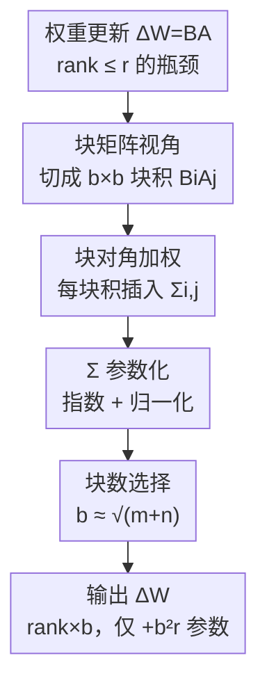

# BoRA: Towards More Expressive Low-Rank Adaptation with Block Diversity

**会议**: ICLR2026  
**OpenReview**: [https://openreview.net/forum?id=eUMJXFgMjM](https://openreview.net/forum?id=eUMJXFgMjM)  
**代码**: https://github.com/Leopold1423/bora-iclr26  
**领域**: LLM效率  
**关键词**: LoRA, 参数高效微调, 块矩阵, 低秩适应, 表达能力  

## 一句话总结
BoRA 把 LoRA 的 $BA$ 看成块矩阵乘法，给每个块积 $B_iA_j$ 插入一个独立的对角矩阵 $\Sigma_{i,j}$ 来打破块之间的相关性，只用 $b^2r$ 个额外参数就把 LoRA 权重的秩提升到原来的 $b$ 倍，在 GLUE、数学和常识推理上以与 LoRA 相近的参数量取得 2-4% 的准确率提升。

## 研究背景与动机
**领域现状**：大模型全参数微调（FFT）代价高昂，参数高效微调（PEFT）成为主流，其中 LoRA 因为不增加推理延迟而最受欢迎。LoRA 冻结预训练权重 $W\in\mathbb{R}^{m\times n}$，用两个低秩矩阵 $A\in\mathbb{R}^{r\times n}$、$B\in\mathbb{R}^{m\times r}$ 近似权重更新 $\Delta W=BA$，$r$ 是 LoRA 秩且 $r\ll\min\{m,n\}$。

**现有痛点**：LoRA 与 FFT 之间始终存在性能差距，普遍归因于 LoRA 权重的秩太低——$\mathrm{rank}(\Delta W)=\mathrm{rank}(BA)\le\min\{\mathrm{rank}(A),\mathrm{rank}(B)\}\le r$。大量工作证明，提高 LoRA 权重的秩通常能提升微调效果；Zeng 和 Lee（2024）进一步用秩 $r$ 量化了 LoRA 权重与"最优更新"之间的逼近误差，秩越高误差越小。于是"高效地提高 LoRA 权重的秩"成了共识方向。

**核心矛盾**：提秩最直接的办法是加大 $r$，但参数量随 $r$ 线性膨胀 $(m+n)r$，违背了 PEFT 的初衷——表达能力（秩）和参数效率之间存在直接 trade-off。已有的提秩方法各有代价：MELoRA 把对角块以外的块积全部置零来打破块间相关性，秩是上去了，但大量零元素反而压缩了 LoRA 的表达空间；HiRA、KronA 用 Hadamard/Kronecker 积提秩；ReLoRA 周期性把适配器合并回主干。

**切入角度**：作者换了一个观察视角——把 $A$ 按列切成 $b$ 块、$B$ 按行切成 $b$ 块，则 $BA$ 就是 $b\times b$ 个块积 $B_iA_j$ 的拼接。从这个视角看，秩受限的真正原因是**不同行/列的块积彼此相关**：同一行所有块共享同一个 $B_i$，同一列共享同一个 $A_j$。若 $B_1$ 可逆，把第一行左乘 $B_2B_1^{-1}$ 就能得到第二行，意味着第二行对秩没有贡献，列方向同理。

**核心 idea**：与其像 MELoRA 那样粗暴置零，不如给每个块积单独配一个对角矩阵 $\Sigma_{i,j}$，让 $B_i\Sigma_{i,j}A_j$ 在行/列间产生差异——既打破了相关性提升了秩，又不引入零值损害表达能力。

## 方法详解

### 整体框架
BoRA（Block-Diversified Low-Rank Adaptation）的核心是：在标准 LoRA 的 $BA$ 结构之上，给每一对块 $(i,j)$ 插入一个可学习的对角矩阵 $\Sigma_{i,j}\in\mathbb{R}^{r\times r}$，把第 $(i,j)$ 个块的更新写成 $\Delta W_{i,j}=B_i\Sigma_{i,j}A_j$。这些对角矩阵放大了块积在行、列方向上的差异，从而把 LoRA 权重的秩从 $r$ 提到至多 $br$，而需要新增的参数只有 $b^2r$ 个（远小于 LoRA 提秩所需的 $(m+n)br$）。整条流水线是：从 LoRA 的 $\Delta W=BA$ 出发 → 用块矩阵视角诊断出秩瓶颈来源 → 给每个块积加块对角加权 $\Sigma_{i,j}$ → 用指数+归一化把 $\Sigma$ 参数化好优化 → 按 $b\approx\sqrt{m+n}$ 选块数，最终得到一个秩翻 $b$ 倍、参数几乎不增的权重更新。

### 关键设计

**1. 块矩阵视角：把秩瓶颈定位到"块间相关性"**

LoRA 提秩难的根因，以往笼统归结为"$r$ 太小"。BoRA 的第一步贡献是用块矩阵乘法把这个瓶颈说清楚：把 $A=[A_1,\dots,A_b]$ 按列切块、$B=[B_1,\dots,B_b]^\top$ 按行切块后，$\Delta W$ 的每个子块就是 $\Delta W_{i,j}=B_iA_j$。秩取决于线性无关的行（列）向量个数，而第 $i$ 行的所有块只在 $B_i$ 上有区别——这意味着任意一行都能由另一行经同一个线性变换（如 $B_2B_1^{-1}$）生成，于是这些"重复行"对秩毫无贡献，列方向同样如此。这个分析把"提秩"这件事从"加大 $r$"重新表述为"打破块间相关性"，为后面的设计指明了发力点，也顺带给出了一个统一框架：LoRA 和 MELoRA 都只是 BoRA 的特例。

**2. 块对角加权：用 $\Sigma_{i,j}$ 打破相关性、却不引入零值**

针对上面的相关性瓶颈，BoRA 给每个块积单独学一个对角矩阵，令 $\Delta W_{i,j}=B_i\Sigma_{i,j}A_j$。直觉上，$\Sigma_{i,j}$ 沿对角线对 $r$ 个秩通道做逐元素重新缩放，不同的 $(i,j)$ 用不同的缩放，行与行、列与列之间就不再能被同一个变换互相生成，相关性被打破，秩随之上升。整块更新可以等价写成三矩阵乘积 $\Delta W=B'\Sigma'A'$，其中 $A'\in\mathbb{R}^{br\times n}$、$B'\in\mathbb{R}^{m\times br}$ 是由各块拼成的块对角矩阵，$\Sigma'$ 由所有 $\Sigma_{ij}$ 拼接而成。由此得到秩上界（命题 1）：

$$\mathrm{rank}(\Delta W)\le\min\{m,n,br\}$$

当三个矩阵都满秩时取到上界。关键对比在于：和 MELoRA"把非对角块直接置零"相比，BoRA 用的是对角矩阵而非零矩阵——同样能拉高秩，却没有 MELoRA 那样大片零元素带来的表达力损失。形式上，LoRA 是 $\Sigma_{i,j}=I$ 的特例，MELoRA 是 $\Sigma_{i,j}=I\ (i=j)$、$\Sigma_{i,j}=0\ (i\ne j)$ 的特例，BoRA 用一个连续可学的 $\Sigma$ 把两者统一并推广。

**3. $\Sigma$ 的指数-归一化参数化：让对角权重真正学得动**

直接学 $\Sigma$ 会遇到优化困难。BoRA 把它参数化为一个三维张量 $\sigma\in\mathbb{R}^{b\times b\times r}$，并用与矩阵 $A$ 相同的 Kaiming 初始化，使其能用同一个学习率一起训练。生成 $\Sigma$ 的公式为：

$$\Sigma_{i,j}=\mathrm{Diag}\Big(\mathrm{Exp}\big(\tfrac{\sigma[i][j]}{\mathrm{Mav}(\sigma)}\big)\Big),\quad \mathrm{Mav}(\sigma)=\frac{\lVert\sigma\rVert_1}{b^2r}$$

这里 $\mathrm{Mav}(\sigma)$ 是 $\sigma$ 的平均绝对值，$\mathrm{Exp}(\cdot)$ 逐元素取指数，$\mathrm{Diag}(\cdot)$ 把向量摊成对角矩阵。两个操作各有动机：**归一化**解决"$\sigma$ 初值方差很小、各块之间几乎没差异、$\Sigma$ 都贴近 1 因而块多样性上不去"的问题，把 $\sigma$ 除以其平均绝对值能削弱小初值对 $\Sigma$ 分布和优化的压制；**指数**解决"归一化后 $\sigma$ 零中心、出现 0 或近 0 会把 $B_i$、$A_j$ 整列归零造成信息丢失"的问题——取指数后 $\Sigma$ 全为正值，杜绝了因零值导致的信息损失。消融显示归一化比指数更关键，正印证了这个动机。

**4. 块数 $b$ 的选择：在"提秩"和"加参数"之间找最优**

BoRA 提秩的收益是线性的（秩到 $br$），代价 $b^2r$ 却是二次增长的，所以 $b$ 不能一味加大。要达到目标秩 $R=br$，所需参数为 $N=(m+n+b^2)r=R(\tfrac{m+n}{b}+b)$，对 $b$ 求极值在 $b=\sqrt{m+n}$ 处最小。也就是说一旦 $b$ 超过 $\sqrt{m+n}$，继续靠加块来提秩就不如直接加大基础秩 $r$ 划算。实践上作者直接取 $b=\lfloor\sqrt{n}\rfloor$。这条规则把"块数"这个超参从"凭经验调"变成了"有闭式最优可依"，也是 BoRA 参数效率优于直接加大 $r$ 的理论支撑。

### 一个完整示例：分段高效前向传播
BoRA 的前向不需要显式拼出大矩阵，而是把输入按块切段计算。设输入 token 为 $X\in\mathbb{R}^n$，LoRA 的前向是 $Y=WX+BAX$。BoRA 把 $X$ 均匀切成 $b$ 段 $\{X_1,\dots,X_b\}$，每段对应一个输出段：

$$Y_j=B_j\sum_{k=1}^{b}\Sigma_{j,k}A_kX_k$$

走一遍流程：先各段 $X_k$ 经对应的 $A_k$ 压到 $r$ 维得到 $A_kX_k\in\mathbb{R}^r$；再逐元素乘上对角的 $\Sigma_{j,k}$（因为是对角矩阵，等价于一次 element-wise 乘法，几乎零成本）；对 $k$ 求和后经 $B_j$ 升回去得到 $Y_j$；最后把 $b$ 个 $Y_j$ 拼成最终输出。相比 LoRA，BoRA 每个 token 多出的浮点运算只有 $b^2r$，前向 FLOPs 为 $mn+(m+n)r+b^2r$——这个值同时也是 BoRA 的可训练参数量，说明它的"计算密度"和 LoRA 完全一致；又因为 $b\ll\min\{m,n\}$，额外的显存和算力开销基本可忽略，所以 BoRA 在提秩的同时保住了 LoRA"不增推理延迟"的核心优点。

### 损失函数 / 训练策略
BoRA 不改训练目标，仍是标准的下游任务损失。训练侧只新增了张量 $\sigma$（用 Kaiming 初始化，与 $A$ 同学习率联合优化）。实验用 AdamW、线性学习率衰减、LoRA dropout 0.05、无 weight decay；GLUE 上 warm-up 比例 0.03，RoBERTa-Base/Large 学习率分别 3e-4/1e-4，默认只作用于 query、value 权重；数学/常识推理用 1e-4、100 步 warm-up、训 1 个 epoch，作用于 query、key、value。默认设置 $r=8$，块数取 8 或 16。

## 实验关键数据

### 主实验
在 GLUE（NLU，RoBERTa-Base/Large）、Math10K（数学推理）、Commonsense170K（常识推理，Gemma-7B / LLaMA-3-8B / Qwen2.5-14B）三个基准上对比 LoRA、DoRA、MELoRA、HydraLoRA。核心结论：BoRA 用与 LoRA($r=8$) 相近的参数量，效果追平甚至超过 LoRA($r=32$)。

| 基准（平均准确率） | 模型 | BoRA(r=8,b=16) | LoRA(r=8) | LoRA(r=32) |
|------|------|------|------|------|
| GLUE | RoBERTa-Base | **83.78** | 82.55 | 83.60 |
| GLUE | RoBERTa-Large | **86.51** | 84.38 | 86.35 |
| 数学推理 | Gemma-7B | **73.10** | 71.44 | 72.71 |
| 数学推理 | LLaMA-3-8B | **72.24** | 68.19 | 71.67 |
| 数学推理 | Qwen2.5-14B | **80.60** | 79.09 | 80.15 |
| 常识推理 | Gemma-7B | **87.04** | 85.95 | 86.61 |

数学推理上，BoRA 在同秩（$r=8$）下平均比 LoRA 高 2.4%，而 LoRA 把秩翻 4 倍（到 32）也只涨 1.9%；常识推理上 BoRA 同秩领先 0.95%，LoRA 翻 4 倍秩仅涨 0.77%——等价于 BoRA 用四分之一多的参数就能达到 LoRA 加秩的效果。MELoRA 虽然也提秩，但零元素带来信息损失，在数学推理上甚至常常落后于 LoRA。

### 消融实验
在数学推理上验证 $\Sigma$ 参数化中指数（Exp）和归一化（Norm）两个操作的作用：

| 配置 | Gemma-7B | LLaMA-3-8B | Qwen2.5-14B | 说明 |
|------|------|------|------|------|
| BoRA（完整） | **73.10** | **72.24** | **80.60** | Exp + Norm 都有 |
| w/o Exp | 71.77 | 68.51 | 79.79 | 去掉指数，可能出现零值 |
| w/o Norm | 72.15 | 68.48 | 79.26 | 去掉归一化，$\Sigma$ 贴近 1 |

两个操作缺一不可，且**归一化更关键**：缺了归一化时，$\sigma$ 初值太小使 $\Sigma$ 各元素都接近 1，块多样性上不去，表达能力被压制（LLaMA-3-8B 直接从 72.24 掉到 68.48）。

### 关键发现
- **秩与块数的可扩展性**：在 $\{2,4,8,16,32,64\}$ 范围扫 $r$ 和 $b$，即使 $b=2$ BoRA 也稳超 LoRA；$b$ 增大效果提升，但当 $r$ 较大且 $b$ 超过某阈值后准确率开始下降，作者归因于过高的权重秩带来过拟合——与第 4 条设计中 $b\approx\sqrt{m+n}$ 的最优分析一致。$b=64$ 时参数约为同秩 LoRA 的 1.6 倍。
- **微调粒度**：从 Q、QV、QKV 到 QKVUD、QKVOGUD，BoRA 在每种粒度下都优于 LoRA（如 QKV：LoRA 68.19 vs BoRA 73.40），说明增益对各类投影层（k_proj、v_proj 等）普遍成立。
- **奇异值验证提秩**：按 HiRA 的设定用 0.005 阈值统计"有效秩"，BoRA 的 query 层权重中大于 0.005 的奇异值数量显著多于 LoRA，平方奇异值之和也更大，直接印证了 BoRA 确实拉高了权重的秩。

## 亮点与洞察
- **统一视角是最大亮点**：把 LoRA、MELoRA 都收编为 BoRA 的特例（$\Sigma=I$ / 对角块为 $I$、非对角为 $0$），等于在一张图上说清了"提秩"这一族方法的关系，理论上很干净。
- **"加对角而非置零"的取舍很巧**：同样为了打破块相关性，MELoRA 选择置零、损失表达力，BoRA 选择插入连续可学的对角矩阵，既提秩又不丢信息——这个"不引入零值"的细节是它压过 MELoRA 的关键。
- **块对角加权的思路可迁移**：给"被结构性共享的子模块"插入轻量逐通道缩放来解耦相关性，这个 trick 不限于 LoRA，凡是用块/分组共享权重（如分组卷积、MoE 专家共享）想增加多样性而又不想加太多参数的场景，都可以借鉴。
- **有闭式的最优块数**：$b\approx\sqrt{m+n}$ 把一个超参变成可计算的最优值，省去大量调参，工程上很友好。

## 局限与展望
- **额外参数随 $b$ 二次增长**：$b^2r$ 在 $b$ 较大时不可忽略（$b=64$ 时已达 LoRA 的 1.6 倍），且 $b$ 过大反而过拟合掉点，所以 BoRA 的提秩能力有天花板，并非可以无限堆块。
- **对角约束的表达上限**：$\Sigma_{i,j}$ 被限制为对角矩阵（逐通道缩放），打破相关性的"自由度"有限；是否用更丰富但仍轻量的结构（如低秩或带状 $\Sigma$）能进一步提升，论文未探讨。
- **评测以中小模型和判别/推理任务为主**：最大到 14B，任务集中在 GLUE 与数学/常识推理，对更大模型、长文本生成、多模态等场景的收益还需验证。
- **理论上界 vs 实际可达**：命题 1 的秩上界需三矩阵都满秩才取到，实际训练中 $\Sigma$ 学到什么程度、是否逼近上界缺乏更细的刻画。

## 相关工作与启发
- **vs LoRA**：LoRA 的秩被 $r$ 死锁，BoRA 是其 $\Sigma=I$ 的特例；BoRA 用 $b^2r$ 参数把秩提到 $br$，在同等参数预算下表达力更强。
- **vs MELoRA**：两者都靠"打破块间相关性"提秩，但 MELoRA 置零非对角块、引入大量零值损害表达力，BoRA 用对角矩阵加权、不引入零值——这是 BoRA 在数学推理上反超 MELoRA 的直接原因。
- **vs DoRA**：DoRA 把权重拆成方向+幅度、用可学向量学幅度，属于"更好的优化"路线；BoRA 走的是"更高的秩"路线，两者正交，原则上可结合。
- **vs HydraLoRA / MoELoRA**：MoELoRA 把多个 LoRA 当专家、用路由网络组合，本质也是块矩阵乘法，但其分块方向与 BoRA 相反（沿行/列对调），得到 $\Delta W=\sum_k B_kA_k$ 的专家求和；HydraLoRA 共享一个 $A$、多个 $B$ 经路由组合提效。BoRA 与它们的根本区别在 $A$、$B$ 的分块方式不同。

## 评分
- 新颖性: ⭐⭐⭐⭐⭐ 块矩阵视角统一 LoRA/MELoRA，并用对角加权这一简单而有效的方式提秩。
- 实验充分度: ⭐⭐⭐⭐ 覆盖 NLU/数学/常识三类任务、四种模型、多组消融与可扩展性分析，但缺超大模型与生成类任务。
- 写作质量: ⭐⭐⭐⭐⭐ 动机、推导、特例关系讲得清晰，图 1 的三方对比一目了然。
- 价值: ⭐⭐⭐⭐ 即插即用、几乎零额外推理开销，对 PEFT 实践者有直接吸引力。

<!-- RELATED:START -->

## 相关论文

- [\[ICLR 2026\] BA-LoRA: Bias-Alleviating Low-Rank Adaptation to Mitigate Catastrophic Inheritance in Large Language Models](ba-lora_bias-alleviating_low-rank_adaptation_to_mitigate_catastrophic_inheritanc.md)
- [\[ICLR 2026\] LoRA-S: An Efficient Low Rank Adaptation scheme via Sylvester equation](lora-s_an_efficient_low_rank_adaptation_scheme_via_sylvester_equation.md)
- [\[ICLR 2026\] FLoRG: Federated Fine-tuning with Low-rank Gram Matrices and Procrustes Alignment](florg_federated_fine-tuning_with_low-rank_gram_matrices_and_procrustes_alignment.md)
- [\[ICLR 2026\] CR-Net: Scaling Parameter-Efficient Training with Cross-Layer Low-Rank Structure](cr-net_scaling_parameter-efficient_training_with_cross-layer_low-rank_structure.md)
- [\[ICLR 2026\] PARD: Accelerating LLM Inference with Low-Cost Parallel Draft Model Adaptation](pard_accelerating_llm_inference_with_lowcost_parallel_draft_model_adaptation.md)

<!-- RELATED:END -->
