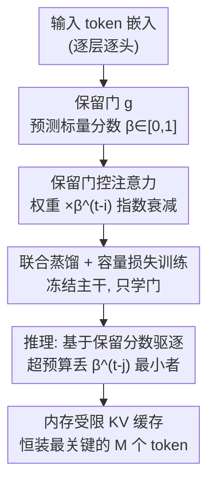

# Cache What Lasts: Token Retention for Memory-Bounded KV Cache in LLMs

**会议**: ICLR2026  
**OpenReview**: [https://openreview.net/forum?id=qCaq3jGb0S](https://openreview.net/forum?id=qCaq3jGb0S)  
**代码**: https://github.com/ngocbh/trimkv  
**领域**: LLM效率 / KV缓存压缩  
**关键词**: KV缓存驱逐, 保留门控注意力, 长上下文推理, 蒸馏微调, 可解释性

## 一句话总结
TRIM-KV 给预训练 LLM 的每个注意力头插入一个轻量"保留门"，在 token 生成时就预测它的内在长期重要性（一个会随时间指数衰减的标量分数），内存超预算时直接驱逐分数最低的 token；只需冻结主干、用蒸馏 + 容量损失微调这些门，推理几乎零额外开销，却在数学推理、长程生成和长上下文记忆等多个 benchmark 上稳定超越启发式驱逐和可学习检索基线，低显存场景下甚至反超全量缓存。

## 研究背景与动机
**领域现状**：长上下文 LLM 推理的两大瓶颈是自注意力的二次复杂度和不断膨胀的 KV 缓存。为了在固定显存预算下推理，社区主要走三条路：压缩/量化（把过去的 key/value 压成紧凑表示）、卸载/检索（把缓存搬到 CPU，用相似度检索按需取回）、以及最直接的 **KV 缓存驱逐**（直接从缓存里丢掉某些 token）。

**现有痛点**：压缩/量化主要在 prefill 阶段有效，随生成长度增长会失效；卸载/检索虽降低了 GPU 占用，但 CPU–GPU 协调开销会在长生成中不断累积，拖垮端到端吞吐。而最主流的驱逐方法几乎都是**注意力引导的启发式**——追踪新 query 对缓存 token 的注意力，保留最近被频繁关注的。

**核心矛盾**：这些启发式默认"最近的注意力是未来重要性的可靠代理"。但这个假设在长程推理里经常崩——一个 token 可能很久之后才变关键，即使它近期没被关注；而且注意力本身有 bias（被干扰上下文带偏时会暂时忽略某个其实需要的 token），导致它被过早驱逐。少数试图"学习驱逐决策"的工作又因为难以随序列长度扩展，只能用在 prefill 阶段。

**本文目标**：设计一个既能严格守住显存预算、又能用在**长程生成**（而不只是 prefill）、且不依赖注意力代理的可学习驱逐策略。

**切入角度**：作者换了个视角——与其用"当前 query 对它的注意力"判断重要性，不如在 token **被创建的那一刻**就判断它的内在长期价值。直觉上 token 生而不等：关键事实、被回答的问题、开头的 sink token 携带大量语义/任务权重，而填充词、停用词、思维链里琐碎的算术步骤则无足轻重；而且重要性在不同层、不同头之间还系统性地不同（反映各自的功能分工）。token 的上下文嵌入其实已经编码了它的长期效用。

**核心 idea**：给每个注意力层/头加一个**保留门（retention gate）**，把 token 嵌入映射成一个标量保留分数 $\beta \in [0,1]$，让它的影响随上下文增长**指数衰减**（仿照人脑 Ebbinghaus 遗忘曲线）；重要 token $\beta \approx 1$ 衰减慢、能长留缓存，不重要 token $\beta$ 接近 0 很快消失。驱逐策略极简：缓存超预算时丢掉**当前保留分数最低**的 token——这就是 Token RetentIon for Memory-bounded KV cache（TRIM-KV）。

## 方法详解

### 整体框架
TRIM-KV 要解决的是"在固定显存预算 $M$ 下，决定每一步该丢哪个 token，且不依赖注意力代理"。它的做法分训练和推理两段：**训练时**，把预训练 LLM 每个标准注意力块换成"保留门控注意力"，每块挂一个轻量保留门 $g$，用它产生的 $\beta_t$ 去调制注意力权重，然后**只训练这些门**（主干全冻结），用蒸馏损失保证质量 + 容量损失逼出稀疏；**推理时**，门只当"驱逐决策器"，每生成一个 token 算出它的 $\beta$，缓存超 $M$ 就驱逐 $\beta^{t-j}_j$ 最小的那个，附加开销几乎为零。

核心难点是：推理时的驱逐是**离散、非可微**的（token 要么在缓存里 $\alpha=1$、要么被丢 $\alpha=0$），没法直接学。TRIM-KV 的巧思是用一条**平滑的指数衰减曲线** $\bar\alpha_{ti}=\beta_i^{t-i}$ 在训练时近似这个硬驱逐，从而能用梯度训练，又能在推理时退化成简单的"比大小丢最小"。

### 关键设计

**1. 保留门控注意力：用平滑指数衰减把"硬驱逐"变成可微的训练信号**

痛点很直接：推理时的驱逐是二值开关——式 $\alpha_{ti}\in\{0,1\}$ 且 $\alpha_{ti}\ge\alpha_{t+1,i}$（单调性保证 token 一旦被丢就再也取不回），这种离散信号没有梯度、无法学习。一个朴素替代是用 sigmoid 预测"何时被驱逐"，但它有两个毛病：解码时序列长度未知导致 $f$ 的定义域无法归一化；且 sigmoid 大部分区间是平的，相邻步之间变化微乎其微，训练时梯度消失。

TRIM-KV 改用**指数衰减** $\bar\alpha_{ti}=\beta_i^{t-i}$（$\beta_i\in[0,1]$）来建模 token $i$ 随时间的保留率：$\beta_i$ 越大衰减越慢、记忆越持久。代入注意力得到保留门控注意力

$$o_t=\sum_{i=1}^{t}\frac{\beta_i^{t-i}\exp(q_t^\top k_i)}{\sum_{j=1}^{t}\beta_j^{t-j}\exp(q_t^\top k_j)}v_i.$$

把保留分数塞进指数项后，注意力权重可写成 $\exp\big(q_t^\top k_i+(t-i)\log\beta_i\big)$——也就是说**保留分数等价于注意力 logits 上的一个加性偏置**。当所有 $\beta_t=1$ 时它精确退化成原始注意力。这和"token retention vs attention score"的区别也正在于此：标准注意力 $a_{ti}\propto\exp(q_t^\top k_i)$ 依赖当前 query、是局部短视、每步重算的；而保留分数只基于 token 创建时的信息（表示、层、头），回答的是"这个 token 长期有多重要、该留多久"，天然契合长程驱逐这个长视野决策。

**2. 轻量保留门 g：把"长期效用"从 token 嵌入里读出来**

既然假设 token 的上下文嵌入已经编码了它的长期效用，那就用一个极轻的网络把它读出来。保留门 $g$ 把 token 表示映射成标量 $\beta_t=g(x_t)$，可以是线性投影 $g(x)=\sigma(W_\beta x_t+b)$（$W_\beta\in\mathbb{R}^{1\times d}$），也可以是简单 MLP $g(x)=\sigma(\text{MLP}(x)+b)$，sigmoid $\sigma$ 把输出压到 $[0,1]$，$b$ 是可学习偏置。实现里每个 transformer 块配一个隐层维度 512 的单层 MLP，维度 $d\to512\to h$（$h$ 为 KV 头数），即**每个头一套独立的 $\beta$**，从而能反映不同层/头的功能分工。这种"插件式"设计是它能用在现成预训练 LLM 上、且推理开销可忽略的关键——它与现有那些需要从头改注意力动力学、必须从零训练的遗忘机制（线性化/循环变体、修改 attention logits 等）形成鲜明对比。作者还把它类比 Ebbinghaus 遗忘曲线 $R=\exp(-tS)$，$\beta$ 扮演记忆强度 $S$ 的角色。

**3. 联合蒸馏 + 容量损失：冻结主干，只学门，且全局协同**

训练目标要同时兼顾两件事：保住原模型的预测质量、且把缓存压进预算。质量端用蒸馏 + 标准下一 token 预测的组合

$$L_{\text{quality}}=L_{\text{KL}}+L_{\text{NTP}}=D_{\text{KL}}\big(p(\cdot|x)\,\|\,q_\theta(\cdot|x)\big)+\mathbb{E}_{(x,y)}[-\log q_\theta(y|x)],$$

其中 $p$ 是原始 LLM、$q_\theta$ 是保留门控 LLM（$\theta$ 只含所有门的参数）；KL 让代理模型对齐原模型分布、NTP 让它直接从数据里发现稀疏模式。预算端用一个 hinge 式容量正则

$$L_{\text{cap}}=\frac{1}{T}\sum_{t=1}^{T}\frac{1}{t}\max\Big\{0,\ \sum_{i=1}^{t}\beta_i^{t-i}-M\Big\},$$

惩罚每一步有效保留质量超过预算槽位 $M$。这里 $M$ 是个**软超参**，主要防止解码早期序列还短时过度优化；训练用固定 $M$，推理却能灵活适配不同 KV 预算。总目标为 $\min_\theta L_{\text{quality}}+\lambda_{\text{cap}}L_{\text{cap}}$。

关键点有两个：其一，**只更新门参数、主干全冻结**，所以训练成本接近一次参数高效微调；其二，作者**把所有层/头的门联合端到端训练**，而不是像问题 (2) 那样逐层各训一个——这避免了贪心的逐层决策造成的误差传播，让模型学到一个全局协同、近最优的缓存策略。此外保留门控注意力完全可并行、兼容 FlashAttention 风格 kernel，作者用 FlexAttention + 自定义 Triton kernel 实现 $L_{\text{cap}}$，无需物化完整注意力或 $\beta$ 矩阵，从而能在 4 张 H100 上做到 128K token 的长上下文训练。

**4. 推理时基于保留分数的极简驱逐：守住预算、动态再评估**

推理阶段门不再调制注意力，而是纯粹当驱逐决策器，与注意力计算并行但独立。设 $S_t$ 是当前缓存的 token 集合，新 token $t+1$ 先暂时入缓存；若缓存超过容量 $M$，就触发驱逐，规则极简——丢掉保留分数最低者

$$j_{\text{evic}}=\arg\min_{j\in S_t}\{\beta_j^{t-j}\}.$$

它偏好保留被门判定为全局重要的 token，同时因为分数里带 $t-j$ 衰减项，又自带对较新 token 的偏好。这让推理既内存受限又自适应：新上下文到来时，模型持续重新评估旧 token 的重要性。复杂度上它比纯启发式还简单——论文报告在 32K 上下文下 TRIM-KV 解码吞吐约为全量缓存的 2 倍，甚至快于纯启发式的 SnapKV。

### 损失函数 / 训练策略
- 总损失 $L_{\text{quality}}+\lambda_{\text{cap}}L_{\text{cap}}$，主实验取 $\lambda_{\text{cap}}=1.0$、训练容量 $M=256$。
- 门初始化偏置取较大值（如 $b=18.0$），让训练从"几乎不遗忘/不压缩"起步，逐步学会驱逐。
- 数学推理实验用 OpenR1-MATH-220k 训练门；长上下文实验改用 SynthLong / BookSum / Buddhi、$M=1024$；chunk prefill 实验用 LongAlpaca、$M=512$。
- 全程只训门、冻结主干，4×H100 80G。

## 实验关键数据

### 主实验
基座主要用 Qwen3 系列（1.7B–14B）及 DeepSeek-R1-Distill 变体；基线含可学习检索 SeerAttn-R 与启发式驱逐 R-KV / SnapKV / H2O / StreamingLLM。

| 任务 / 设置 | 指标 | TRIM-KV | 对比 | 结论 |
|--------|------|------|----------|------|
| 数学推理（同预算） | pass@1 相对提升 | — | vs R-KV/SnapKV | **+198.4%**（甚至这些基线给 4× 预算仍不及） |
| 数学推理（同预算） | pass@1 相对提升 | — | vs SOTA 检索 SeerAttn-R | **+58.9%** |
| LongMemEvalS（128K） | Acc，KV=32768 | **44.8** | FullKV 49.4 / SnapKV 27.8 | 仅 25% 预算仍接近全量，基线骤降 |
| LongBench-V2（chunk prefill） | Acc | **34.09** | FullKV 28.79 / LocRet 28.03 | **+18.41%**，反超全量与可学习驱逐基线 |
| LongProc CountDown（KV=2048） | Acc | **93.5** | FullKV 90.0 / R-KV 81.0 | 在数学数据训练的门泛化到非数学任务，反超全量 |

在 SCBench 上 TRIM-KV 多数任务有竞争力（如 En.MultiChoice 23.58 vs SnapKV 10.04），但所有驱逐法在"不可压缩"的检索任务（Retr.KV、Code.RepoQA）上都吃力——丢了的 token 真要用时取不回。

### 消融实验
Qwen3-4B 在 AIME24、KV=4096 上拆目标项：

| 配置 | pass@1 | 说明 |
|------|---------|------|
| Full KV (32768) | 65.5 | 全量缓存参考 |
| TRIM-KV (4096) | **75.8** | 完整模型，仅 1/8 预算反超全量 |
| − $L_{\text{KL}}$ | 72.1 | 去蒸馏，掉 3.7 |
| − $L_{\text{NTP}}$ | 72.5 | 去下一 token 预测，掉 3.3 |
| − $L_{\text{cap}}$ | 42.9 | 去容量损失，**骤降 32.9** |

### 关键发现
- **容量损失是压缩的命门**：去掉 $L_{\text{cap}}$ 后 pass@1 从 75.8 暴跌到 42.9，说明没有显式预算约束门学不出稀疏。蒸馏与 NTP 单独都不错，组合更好。
- **选择性保留是一种正则**：多个设置下 TRIM-KV 反超全量缓存，作者解释为它抑制了无信息 token 的噪声——推理模型的 KV 缓存里很大一部分 token 是冗余的，丢掉不掉点反而更干净。
- **启发式自然涌现**：学到的保留分数和人类直觉对齐（高分给任务相关 token 和开头 sink token，低分给空格标点）；attention sink、滑动窗口、A-shape 等经典启发式无需硬编码就自发出现，还按层/头自适应——早期层多滑动窗口、后期层多 attention sink，并新观察到"无滑动窗口""多窗口共存""上下文切换"等模式。
- **可解释性副产品**：保留分数能当探针诊断各 KV 头的功能分工（有的留 recency 窗口、有的专留数字/算符、有的留句号当隐式 gist token），且后期层比前期层更稀疏。

## 亮点与洞察
- **把不可微的驱逐"软化"成指数衰减**：这是全文最巧的一步——用 $\beta_i^{t-i}$ 同时解决了 sigmoid 的定义域未归一化和梯度消失两个问题，还顺手揭示"保留分数 = 注意力 logits 的加性偏置"，把一个看似 hacky 的机制接回了标准注意力框架。
- **创建时定价 vs 实时打分**：用"token 内在长期效用"取代"当前 query 的注意力"作为驱逐依据，这个视角转换是它能用于长程生成（而非只 prefill）的根因——内在重要性不随解码状态漂移。
- **插件式、零重训**：只学每头一个轻量门、冻结主干、推理几乎零开销，且训练时间近似一次 PEFT，工程上极易落地；这套"给现成 LLM 装遗忘机制"的思路可迁移到任何想加可学习稀疏/驱逐却不愿从头训练的场景。
- **驱逐策略反向变可解释性工具**：学到的保留分数能反过来揭示各层各头的功能角色，把"省显存"和"理解注意力"两件事缝在一起，是个不错的额外收益。

## 局限与展望
- **不可压缩检索任务仍弱**：SCBench 上 Retr.KV、Code.RepoQA 接近 0——一旦答案 token 被丢就无法取回，驱逐范式的天花板在此，检索/卸载类方法在这类任务上反而更稳。
- **推理仍用标准注意力**：训练时门调制注意力、推理时只当决策器，二者存在 gap；作者把"推理也换成保留门控注意力、并与 QKV 联合预训练"列为未来工作。
- **异构预算难落地**：保留分数本可支持按头分配不同预算，但现有 KV 缓存/FlashAttention 实现假设同层各头序列等长，per-head 变长缓存的高效实现尚待解决。
- **软超参 M 的敏感性**：训练用固定 $M$、推理可变预算虽灵活，但 $M$ 作为软约束如何与 $\lambda_{\text{cap}}$ 协同、对不同任务的鲁棒性，正文只给了主设置，更全的扫参在附录。

## 相关工作与启发
- **vs 注意力引导启发式驱逐（H2O / SnapKV / R-KV / StreamingLLM）**: 它们用"最近被关注"作未来重要性的代理，长程下假设易崩、且有注意力 bias；TRIM-KV 用创建时定价的内在重要性，同预算下相对提升约 198%，启发式给 4× 预算仍不及。
- **vs 可学习 KV 检索（SeerAttn-R）**: 检索保留全部信息但要把缓存卸载到 host、靠近期 query 取回相关块，有 CPU–GPU 协调开销；TRIM-KV 是更严格的纯驱逐范式、无卸载开销，同预算 pass@1 仍 +58.9%。
- **vs 从头改注意力的遗忘机制（线性/循环变体、修改 logits 或可训练稀疏）**: 这些大幅改动注意力动力学、需从零训练、扩展性存疑；TRIM-KV 是给预训练 LLM 的插件式遗忘机制，不重训主干即可转成内存受限模型。
- **vs 块/分块 KV 缓存（如 NSA、SeerAttn 倡导的 chunk-based）**: 作者发现各头要留的高信息 token 往往**离散分布**而非连续块，保留少量高上下文 token 比保留连续块更省预算，这与块式方法的前提相左。

## 评分
- 新颖性: ⭐⭐⭐⭐⭐ "创建时定价 + 指数衰减软化硬驱逐"的视角和机制都很干净，还顺带打通可解释性。
- 实验充分度: ⭐⭐⭐⭐⭐ 覆盖数学推理 / 长程生成 / 长上下文 / chunk prefill 四类任务、多基座多基线，消融清楚。
- 写作质量: ⭐⭐⭐⭐ 动机推导和公式衔接流畅，Ebbinghaus 类比加分；个别表格数字排版较挤需对照原文。
- 价值: ⭐⭐⭐⭐⭐ 插件式、零重训、推理近零开销且反超全量，工程落地价值高。

<!-- RELATED:START -->

## 相关论文

- [\[ICLR 2026\] IceCache: Memory-Efficient KV-cache Management for Long-Sequence LLMs](icecache_memory-efficient_kv-cache_management_for_long-sequence_llms.md)
- [\[ICLR 2026\] DefensiveKV: Taming the Fragility of KV Cache Eviction in LLM Inference](defensivekv_taming_the_fragility_of_kv_cache_eviction_in_llm_inference.md)
- [\[AAAI 2026\] Judge Q: Trainable Queries for Optimized Information Retention in KV Cache Eviction](../../AAAI2026/llm_efficiency/judge_q_trainable_queries_for_optimized_information_retention_in_kv_cache_evicti.md)
- [\[ICLR 2026\] ThinKV: Thought-Adaptive KV Cache Compression for Efficient Reasoning Models](thinkv_thought-adaptive_kv_cache_compression_for_efficient_reasoning_models.md)
- [\[ICLR 2026\] LouisKV: Efficient KV Cache Retrieval for Long Input-Output Sequences](louiskv_efficient_kv_cache_retrieval_for_long_input-output_sequences.md)

<!-- RELATED:END -->
