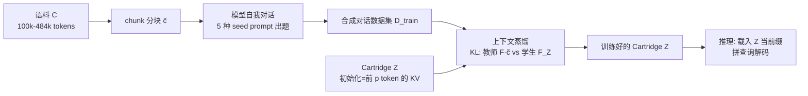

# Cartridges: Lightweight and General-Purpose Long Context Representations via Self-Study

**会议**: ICLR 2026  
**OpenReview**: [https://openreview.net/forum?id=0k5w8O0SNg](https://openreview.net/forum?id=0k5w8O0SNg)  
**代码**: 待确认  
**领域**: LLM 高效推理 / 长上下文 / KV Cache 压缩  
**关键词**: KV Cache, 长上下文, 上下文蒸馏, prefix-tuning, 离线训练, 合成数据  

## 一句话总结
把"长文档放进 KV cache 在线 prefill"换成"为每篇语料离线训练一个小型可学习 KV cache（Cartridge）"，再用 **Self-Study**（自生成合成对话 + 上下文蒸馏）让这个小 cache 复刻 ICL 的通用问答能力，平均省 38.6× 显存、提 26.4× 吞吐。

## 研究背景与动机
- **领域现状**：用户经常把整篇大语料（代码库、财报、法律文书、病历）塞进上下文窗口，靠 in-context learning（ICL）回答各种查询。现代模型支持 100K–10M token，但 KV cache 显存随输入长度线性增长——LLaMA-70B 回答一个 128k token 问题就要 84 GB 显存。
- **现有痛点**：ICL 服务成本极高，上下文从 1k 拉到 120k，单卡 H100 上 LLaMA-8B 峰值吞吐掉 77×。已有的 prompt 压缩、KV cache 压缩方法都有"显存-质量"权衡，压缩比一旦超过 2× 质量就急剧崩塌。
- **核心矛盾**：KV cache 之所以通用（一份 cache 能支持事实问答、推理、写诗等任意查询），恰恰因为它大而完整；想压小就容易丢掉通用性。简单地在语料上做 next-token prediction 训练一个小 cache，能用 107× 更少显存完美"背诵"原文，但**只会复读、无法泛化到多样查询**。
- **本文目标**：训练一个小型"虚拟 KV cache"，使模型用它时表现得像把整篇语料放进了上下文，既省显存又保留 ICL 的通用性。
- **核心 idea**：**【离线训练换在线显存】** 同一语料会被反复查询，把构造表示的成本一次性摊销到离线；**【合成对话 + 上下文蒸馏】** 让模型自己就语料"出题自测"生成训练数据，并用 KL 蒸馏对齐"带 cache 的学生"与"语料在上下文里的教师"的下一 token 分布，从而把通用性灌进小 cache。

## 方法详解

### 整体框架
方法分两层：**Cartridge 范式**定义"用什么参数承载语料、怎么训练和服务"，**Self-Study** 定义"用什么数据和目标训练才能泛化"。给定语料 $C$，冻结 LLM $F$，用 prefix-tuning 分配一组可训练的 key/value 向量 $Z=\{z^k, z^v\}\in\mathbb{R}^{p\times d}$ 作为 Cartridge；离线通过 Self-Study 把 $C$ 蒸馏进 $Z$；推理时把 $Z$ 当作长度为 $p$ 的前缀 KV cache 载入，拼上用户查询直接解码。

### 关键设计

**1. Cartridge 参数化：把语料写进可学习的 KV cache（prefix-tuning 而非 LoRA）。** Cartridge 是一组可训练的 key/value 向量 $Z\in\mathbb{R}^{L\times p\times d\times 2}$，超参 $p$ 控制大小。训练时把 ICL 中对应语料 $C$ 的那段 KV 对替换成 $Z$，冻结所有模型权重，只把 loss 反传进 $Z$ 的 key/value——等价于 prefix-tuning。作者特意对比了 LoRA 参数化：在 MTOB 上同等 0.6 GB 规模，prefix-tuning 高 4.5 ChRF；更关键的是泛化性——cache 从 0.15 GB 增到 0.96 GB 时 prefix-tuning 的 MMLU 只从 54.7 掉到 54.3，而 LoRA 暴跌到 45.3。选 prefix-tuning 还有工程红利：Cartridge 本身就是 KV cache，可直接塞进现有推理服务器的 KV cache 管理器（vLLM/SGLang 等本就为多用户分别管理 KV cache 而高度优化），解码一个带 Cartridge 的请求和服务一个长度为 $p$ 前缀的请求完全一样，而 LoRA 需要定制基础设施才能多用户高效服务。

**2. Cartridge 初始化：用语料前 p 个 token 的真实 KV cache 起步。** 以往工作发现直接优化随机初始化的 cache 不稳定、性能差，所以要先用小维度再 MLP 投影回去。本文发现只要初始化得当就能直接优化全尺寸 cache、无需重参数化：把 $Z$ 初始化为语料 $C$ 前 $p$ 个 token 对应的 KV cache。消融显示这一步至关重要——LongHealth 上用前 $p$ token 初始化得 55.3% 准确率，随机向量只有 29.9%；有趣的是即便用**另一篇无关语料**的 KV cache 初始化也能补上大半差距（51.3%），说明真正起作用的是"像一段真实 KV cache 的几何结构"而非语料本身的内容。

**3. Self-Study 合成数据：让模型自己就语料"出题自测"以逼出泛化。** 为避免在同一段原文上反复 next-token 训练导致只会复读，作者让模型自我对话生成训练数据（Algorithm 1）：先 `chunk(C)` 取一段能塞进窗口的子语料 $\tilde c$（512–4096 token），再取一个 `seed_prompt` 引导第一句提问，然后由两个共享同一模型的参与者 A、B 轮流提问回答，A 的历史里带 seed prompt、B 的不带，两者系统提示里都放 $\tilde c$；主实验都是单轮（$k=1$）。两个旋钮决定数据分布：**分块**让模型每次聚焦语料不同部分，且使训练语料可超过模型窗口长度；**种子提示**用 5 类通用模板（structuring / summarization / question / use case / creative）而非单一提示，且刻意保持通用（绝不提"翻译""医学"等任务专有词）。消融显示 5 种 seed prompt 比单一提示在 MTOB 上 +7.9 ChRF、LongHealth 上 +4.8 准确率。

**4. 上下文蒸馏目标：对齐"有 cache 的学生"与"语料在上下文里的教师"的下一 token 分布。** 给定合成数据集 $D_{train}$，教师是把子语料 $\tilde c$ 放进上下文的模型 $F(\cdot|\tilde c)$，学生是只带可训练 cache 的同一模型 $F_Z(\cdot)$，最小化两者在序列每个位置上的 KL 散度：

$$\arg\min_{Z}\sum_{(x,\tilde c)\in D_{train}}\sum_{i=1}^{|x|} D_{KL}\!\left(F(\cdot|\tilde c\oplus x[:i])\,\|\,F_Z(\cdot|x[:i])\right)$$

相比只学合成回答 token 的 next-token prediction，蒸软标签提供了更丰富的监督信号，控制数据量时 MTOB 上 +8.6 ChRF（24.9→33.5），LongHealth、QASPER 同样受益。这也是把 ICL 的"通用性"灌进小 cache 的关键一步。

## 实验关键数据

### 主实验：质量-显存前沿（LLaMA-3，C 均在 128k 窗口内）

| 数据集 | 指标 | Cartridge vs ICL 显存 | 吞吐提升 |
|--------|------|----------------------|----------|
| LongHealth | 准确率 | 同质量下省 13.8× | 11.5× |
| QASPER | log-perplexity | 省 97.0× | 76.6× |
| Multi-key NIAH | 准确率 | 省 648.3× | — |
| 平均（跨基准） | — | **38.6×** | **26.4×** |

- 所有 KV cache 压缩 baseline（含 SOTA 的 DuoAttention）在 2–4× 压缩比就无法匹配 ICL 质量。
- Qwen3 系列压缩比更大：Cartridge 小 106.4× 的同时在 LongHealth 上还比满 ICL 高 3.8 准确率。

### 上下文外推：MTOB（LLaMA-8B，窗口 128k）
- 用 chunking 为 **484k token** 教科书（远超 128k 窗口）训出 Cartridge。
- 比在前 130k token 上做 ICL 高 **11.0 chrF**，并匹配人工精选 60k 版本的 ICL 质量，显存却小得多。

### 消融实验

| 维度 | 对比 | 结果 |
|------|------|------|
| 参数化 | prefix-tuning vs LoRA（~0.6 GB, MTOB） | +4.5 ChRF；MMLU 泛化 54.3 vs 45.3 |
| 初始化 | 前 p token KV vs 随机向量（LongHealth） | 55.3% vs 29.9%（无关语料 KV 也有 51.3%） |
| 目标 | 上下文蒸馏 vs next-token（MTOB） | +8.6 ChRF（24.9→33.5） |
| seed prompt | 5 类 vs 单一（MTOB / LongHealth） | +7.9 ChRF / +4.8 acc |

### 关键发现
- **天下没有免费的午餐**：达到大压缩比下的 ICL 质量，需要比标准 prefill 多花 2–4 个数量级的离线 FLOPs；Self-Study 的价值在于"给从业者一个用离线算力换在线显存的选项"，在夜间廉价算力、同语料海量查询、在意 TTFT 的场景下划算。
- **Cartridge 可组合**：两个独立训练的 Cartridge（如 Pepsi 10-K 与 AMD 10-K）沿序列维直接拼接、无需联合训练，模型就能回答需要跨两篇文档的多文档问题，且显著优于单 Cartridge 或受窗口限制的 ICL。

## 亮点与洞察
- **范式转换**：把"长上下文表示"从在线 prefill 产物变成离线训练资产，开辟了"用离线训练算力换在线服务显存"这条新 scaling 轴。
- **复用 ICL 自己造监督**：用模型自身在上下文里的行为当教师做蒸馏，绕开了"离线训练时不知道未来查询 Q"的根本困难——不去猜查询，而是直接对齐分布。
- **工程友好**：Cartridge 就是普通 KV cache，零改动接入现有推理服务器的多用户 KV 管理，落地门槛远低于需要定制 serving 的 LoRA 方案。
- **意外的可组合性**：独立训练的 cache 能即插即拼，暗示这些表示在 KV 空间里有某种线性/可叠加结构，为"按文档组装上下文"提供了想象空间。

## 局限与展望
- **离线训练成本高**：本文未优化 Self-Study 训练成本，留待 shared-prefix attention kernel、更好的合成数据配比等后续优化。
- **长程依赖仍有上限**：在 LongHealth（长程依赖）和 MTOB（累积型）上虽匹配 ICL，但仍有 headroom；代码库等强长程依赖、累积型语料场景需要更强的 Self-Study 变体。
- **组合只是"可行"非"等效"**：拼接两个 Cartridge 能产生连贯回答，但作者未声称组合后与单独使用同样有效，如何更高效地组合 Cartridge 仍是开放问题。

## 相关工作与启发
- **参数高效微调 / 知识注入**：与 LoRA 类知识注入（把语料存进少量参数）不同，本文聚焦显存与吞吐收益，并指出 prefix-tuning 参数化的重要性。
- **Prompt / KV cache 压缩**：摘要、过滤、软 token、丢弃/合并 KV 对等方法都受 2–4× 压缩比的质量瓶颈所限，本文以离线训练绕过该权衡。
- **架构改动（线性注意力 / 常数显存）**：附录给出 Cartridge 与线性注意力的理论对比；与需要从头重训或复杂转换的架构改动不同，Self-Study 可直接套在任意预训练 Transformer 上。
- **启发**：对"同语料被反复查询"的服务场景（代码 agent 全仓上下文、chatbot 长期记忆、医疗助手全病史），离线蒸馏 KV cache 可能比堆长上下文更经济；上下文蒸馏作为"把 ICL 行为固化进小参数"的通用配方值得迁移到更多场景。

## 评分
- **新颖性**: ⭐⭐⭐⭐⭐ 把长上下文表示重新定义为离线训练资产，并用自生成对话+上下文蒸馏解决泛化难题，范式层面新颖。
- **实验充分度**: ⭐⭐⭐⭐ 跨 NIAH/LongHealth/MTOB/QASPER 多基准、多模型族（LLaMA、Qwen3），参数化/初始化/目标/seed 全维度消融，外推与组合都有验证；离线训练成本仅定性讨论略欠量化。
- **写作质量**: ⭐⭐⭐⭐ 动机—范式—方法—实验逻辑清晰，图表自洽，"非免费午餐"等权衡讨论坦诚。
- **价值**: ⭐⭐⭐⭐⭐ 平均 38.6× 省显存、26.4× 提吞吐且工程可直接落地，对长上下文服务成本是实打实的量级改进。

<!-- RELATED:START -->

## 相关论文

- [\[ICLR 2026\] Smooth Reading: Bridging the Gap of Recurrent LLM to Self-Attention LLM on Long-Context Understanding](smooth_reading_bridging_the_gap_of_recurrent_llm_to_self-attention_llm_on_long-c.md)
- [\[ICLR 2026\] Reasoning Language Model Inference Serving Unveiled: An Empirical Study](reasoning_language_model_inference_serving_unveiled_an_empirical_study.md)
- [\[ICLR 2026\] Let's (not) just put things in Context: Test-time Training for Long-context LLMs](lets_not_just_put_things_in_context_test-time_training_for_long-context_llms.md)
- [\[ICLR 2026\] Tactic: Adaptive Sparse Attention with Clustering and Distribution Fitting for Long-Context LLMs](tactic_adaptive_sparse_attention_with_clustering_and_distribution_fitting_for_lo.md)
- [\[ICLR 2026\] Stacked From One: Multi-Scale Self-Injection for Context Window Extension](stacked_from_one_multi-scale_self-injection_for_context_window_extension.md)

<!-- RELATED:END -->
