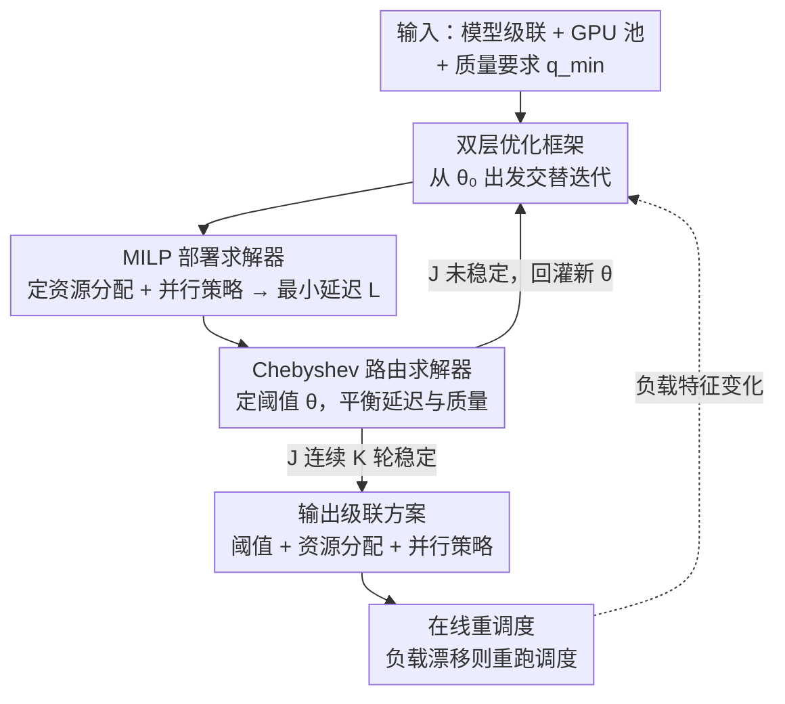

# Cascadia: An Efficient Cascade Serving System for Large Language Models

**会议**: ICLR2026  
**OpenReview**: [https://openreview.net/forum?id=wkrWbrHTJQ](https://openreview.net/forum?id=wkrWbrHTJQ)  
**代码**: 待确认  
**领域**: LLM效率 / LLM serving / 推理系统  
**关键词**: 模型级联, LLM 服务系统, 双层优化, MILP, 请求路由

## 一句话总结
Cascadia 是一个面向大模型的级联服务系统：它把"用多大模型/分多少 GPU/怎么并行"这件事建模成一个带约束的优化问题，用"MILP 解部署 + Chebyshev 解路由"的双层迭代框架联合求解，在保证答案质量的前提下，相比单模型部署把延迟 SLO 收紧最多 4×、吞吐提升最多 5×。

## 研究背景与动机

**领域现状**：更大的模型质量更高但延迟也更高，更小的模型快但能力弱。一个被反复提出的折中思路是**模型级联（model cascade）**——简单请求先丢给小模型，只有当小模型"答不好"时才升级到大模型。这样既能压住成本，又能在复杂请求上保住质量。FrugalGPT、AutoMix、CascadeServe 等工作都在这条线上。

**现有痛点**：把级联思路真正落到 LLM serving 上，比提出它难得多，作者点出三处现有框架处理不好的地方。其一，**模型异构**：级联里的小/中/大模型对显存和算力的需求差异极大（DeepSeek-671B 远比 dist-70B 吃资源），在固定 GPU 池里乱分配会拖垮整体效率。其二，**负载异构**：不同模型面对的请求分布不同（输入/输出长度、到达率各异），从而偏好不同的部署策略（复制几份、张量并行还是流水并行）——图 2 显示，选对并行策略能带来最多 3× 吞吐差异。其三，**级联感知的负载均衡**：路由策略决定了每个模型分到多少请求，进而决定它的系统负载，所以**部署必须和路由协同优化**，而现有系统几乎都把这两件事拆开做。

**核心矛盾**：路由策略决定请求在各模型上的分布 → 决定最优部署方案 → 部署方案决定系统延迟 → 延迟又反过来影响路由决策。这是一个相互依赖、搜索空间指数级膨胀的闭环，作者证明求最优级联方案是 NP-hard 的。现有系统要么只优化部署、要么只优化路由，缺一个把两者拧在一起的机制。

**本文目标**：在服务方自己托管级联中所有模型的设定下，**同时**确定（i）部署方案——每个模型类型分多少 GPU、用什么并行策略；（ii）路由策略——每个请求该走到级联的哪一级，在延迟和质量之间取舍。

**切入角度**：既然两层互相依赖，就别指望一步解出来，而是把它形式化成一个**带约束优化问题**，再用双层优化（bi-level optimization）做系统-算法协同设计，让两层交替求解、迭代收敛。

**核心 idea**：用"MILP 解部署 + Chebyshev 引导解路由"的双层迭代，把级联服务的部署与路由**联合优化**到收敛，而不是各自为政。

## 方法详解

### 整体框架

Cascadia 要回答的是这样一个调度问题：给定一组从小到大的模型类型 $\{c_1, c_2, \dots, c_C\}$、总共 $N$ 张 GPU、以及用户指定的质量要求 $q_{\min}$，求出一个**级联方案（cascade plan）**——既包含每个模型分多少 GPU、用什么并行度（部署方案 $D$），也包含每级模型的接受/转发阈值（路由策略 $\theta$）。

难点在于部署和路由互为输入输出，所以 Cascadia 不一次性求解，而是跑一个**双层迭代循环**（Algorithm 1）：从一个初始路由策略 $\theta_0$ 出发，每一轮先由当前路由推出各模型的工作负载分布 $W$ 和质量 $Q$；再调用**MILP 部署求解器**，在资源约束下算出让最大延迟最小的部署方案 $D$ 及对应延迟 $L$；接着把 $L$ 和质量要求喂给 **Chebyshev 路由求解器**，更新路由策略 $\theta$ 和延迟-质量得分 $J$；当 $J$ 连续 $K$ 轮稳定就判定收敛，返回最终的 $(\theta, D)$。上线后还有一个**在线重调度机制**：周期性采样真实负载，一旦检测到负载特征显著漂移，就把整个调度算法重跑一遍，产出新的方案。

### 关键设计

**1. 双层优化框架：把"部署 ↔ 路由"的死循环拆成可交替求解的两层**

直接求最优级联方案是 NP-hard 的，因为路由决定负载分布、负载分布决定最优部署、部署决定延迟、延迟又反过来约束路由，四者首尾相连。Cascadia 的破局点是承认这是个**双层（bi-level）结构**：外层是路由，内层是部署。算法从初始路由 $\theta_0$（比例路由，第 $i$ 个模型接 $1/i$ 的请求）出发，每轮固定当前路由、调用内层部署求解器拿到最小延迟 $L(\theta)$，再用这个 $L$ 去更新外层路由，如此往复直到延迟-质量得分 $J$ 连续 $K$ 轮稳定。这样做的好处是把一个耦合的全局优化，降解成两个各自可高效求解的子问题（一个 MILP、一个一维惩罚优化），同时仍保留两层之间的反馈——这正是作者强调的"系统-算法协同设计"：部署（系统侧）和路由（算法侧）不再各扫门前雪，而是被迫互相迁就到一个共同收敛点。

**2. MILP 部署求解器：给定负载，最小化级联里最慢那一级的延迟**

部署层要解决的是模型异构和负载异构带来的资源错配。它分两步走。第一步是**并行策略搜索**：对每个模型类型 $i$ 和每个候选 GPU 数 $f_i$，在数据并行（DP，即模型复制）、张量并行（TP）、流水并行（PP）三种方式的所有可行组合里枚举，组合需满足资源约束 $(\sum_{j=1}^{dp_i} tp_{i,j}\times pp_{i,j}) \le f_i$，再用模拟器 $\text{Sim}(\cdot)$ 估出 p95 延迟 $l_i = \text{Sim}(w_i, f_i)$，挑延迟最小的那组。这一步可以对所有可能的 $f$ 预计算，形成一张延迟查找表喂给下一步。第二步是**资源分配 MILP**：引入 0/1 变量 $x_{i,f}$（模型 $i$ 是否分到 $f$ 张 GPU），约束是每个模型恰好选一种分配（$\sum_f x_{i,f}=1$）、总 GPU 数用满（$\sum_i \sum_f f\,x_{i,f}=N$）、最大延迟 $L$ 不小于任一被选分配的延迟（$L\ge \sum_f l_i(f)\,x_{i,f}$），显存不够的分配对直接置 $x_{i,f}=0$。目标是

$$\min_{x}\ L \quad \text{s.t. } L \ge \sum_{f=1}^{N} l_i(f)\,x_{i,f},\ \forall i$$

即**最小化级联里最慢一级的延迟**（瓶颈延迟）。这种"先查表、后整数规划"的设计，把指数级的部署搜索压缩成一个变量规模可控、能被现成 MILP 求解器秒解的问题。

**3. Chebyshev 引导的路由求解器：在满足质量底线的前提下把延迟压到最低**

路由层沿用阈值级联的常见做法（图 4）：每个请求先进最小模型 $c_1$，一个 judger（实验里用 GPT-4o 当 LLM-as-a-Judge）给输出打分，再用一组阈值 $H=\{h_1,\dots,h_{C-1}\}$ 决定该接受还是转发到下一级，于是路由策略由阈值决定，$\theta=\theta(H)$。关键问题是怎么调这组阈值。Cascadia 用 **Chebyshev 引导法**把"延迟最小化"和"质量达标"拧成一个单目标惩罚问题：先定义 utopia 点 $z_1^*$（全部走最大模型 $c_C$，质量最好）和 nadir 点 $z_2^*$（全部走最小模型 $c_1$，质量最差），再求解

$$\arg\min_{\theta}\ J(\theta) = \arg\min_{\theta}\ \Big[L(\theta) + \mu\,\max\{0,\ (q_{\min}-Q(\theta))/(z_1^*-z_2^*)\}\Big]$$

其中 $L(\theta)$ 是当前路由对应的系统延迟（来自部署求解器），$Q(\theta)$ 是质量，$\mu>0$ 是惩罚权重。当质量达标（$Q(\theta)\ge q_{\min}$）时惩罚项为零，目标就退化为纯延迟最小化；一旦质量缺口出现，缺口被 $(z_1^*-z_2^*)$ 归一化（让惩罚无量纲、跨负载可比），再乘以足够大的 $\mu$ 把不可行解推开。原文给了个直观例子：$q_{\min}=0.90$、$\mu=100$，策略 $\theta_1$ 延迟 11.0s、质量 0.88，归一化缺口 $0.02/0.20=0.10$，$J(\theta_1)=11.0+100\times0.10=21.0$；而 $\theta_2$ 延迟 11.4s、质量 0.91 达标，$J(\theta_2)=11.4$，于是选 $\theta_2$。这套设计的巧处在于：它把"质量是硬约束、延迟是优化目标"这件事，用一个连续可优化的标量目标干净地表达了出来。

**4. 在线重调度机制：让离线算出的方案跟得上漂移的真实负载**

前三个设计算出的是某一时刻负载下的最优方案，但真实 LLM 负载（输入/输出长度分布、到达率、请求复杂度）会随时间漂移，一套静态方案会逐渐失配。借鉴 DistServe 的思路，Cascadia 加了一个轻量的重调度回路：周期性**子采样**记录实时负载特征（例如每 5 分钟采 50 个请求），一旦检测到显著漂移（到达率上升或请求变难），就把整个双层调度算法重跑一遍，结合近期历史数据产出更新后的部署方案和路由策略。由于调度算法本身很快（32 GPU 下 20s 内完成、80 GPU 下一分钟内），且资源分配/并行/路由三者相互独立、高度可并行，这个重调度的代价完全可以摊进在线服务里。

### 一个完整示例

以 trace 1、平均质量要求 90 为例走一遍：初始用比例路由，三级模型 $c_1$（DeepSeek-dist-7B）、$c_2$（dist-70B）、$c_3$（671B）。双层循环收敛后，最终方案是三级分别处理 100%、94%、50% 的请求，分到 4、8、20 张 GPU。当质量要求从 90 放宽到 85，更少请求需要走到最大的 $c_3$（处理比例从 50% 降到 21%），于是分给 $c_3$ 的 GPU 也相应减少（从 20 降到 16）——省下的资源回流到前两级，整体负载更均衡。并行策略也会随之变：质量 90 时 $c_2$ 的最优策略是 (DP=2, TP=4)，若强行改成 (DP=4, TP=2) 性能会掉 33.7%；质量降到 85 时最优策略又漂移到 (DP=6, TP=2)。这个例子说明 Cascadia 不是固定配置，而是随质量要求/负载动态地重新分配资源和路由。

## 实验关键数据

### 主实验

硬件为 4 台服务器、每台 8 张 H100-80GB（NVLink 400GB/s，跨机 InfiniBand 200GB/s）。级联用 DeepSeek-dist-7B / dist-70B / 671B(AWQ INT4) 三级，judger 用 GPT-4o。指标是 SLO attainment（达到 95% 达标所需的最小 SLO Scale，越小越好）和吞吐。

| 对比对象 | 延迟 SLO（最小 Scale 越低越好） | 吞吐 | 说明 |
|--------|------|------|------|
| vs 单模型（SGLang 直服 DeepSeek） | 最多 4×、平均 2.8× 更紧 | 最多 5×、平均 3× 更高 | trace 3 + 质量 85：单模型需 11.88 Scale，Cascadia 仅需 3.75 |
| vs CascadeServe（SOTA 级联系统） | 最多 2.5×、平均 1.7× 更紧 | 最多 3.3×、平均 1.7× 更高 | trace 1 + 质量 90：CascadeServe 需 17.3 Scale，Cascadia 仅 11.73 |
| Llama 级联（Llama3-8B/70B） | 最多 3.8×、平均 2.6× | — | 换模型级联仍领先，验证通用性 |
| vs Sarathi-Serve（chunked prefill） | — | 1.95× 峰值、1.64× 平均 | 比带调度优化的先进系统也更好 |
| vs RouteLLM（路由框架） | 平均低 21.3% Scale | 平均高 18.8% | 优势来自系统-算法协同 |

成本侧：相比 CascadeServe 平均降本 20–39%，相比单模型部署降本 33–61%。

### 消融实验

| 配置 | 性能下降 | 说明 |
|------|---------|------|
| Full Cascadia | — | 完整系统 |
| w/o 并行策略优化（改统一并行：机内 TP、跨机 DP） | 最多 1.6×、平均 1.4× | 7B/671B 需要更高 DP/TP 度，统一策略满足不了 |
| w/o 资源分配优化（改均匀分配） | 最多 2.1×、平均 1.7× | trace 1+质量90：671B 本该 20 GPU，均匀分配只给 12，导致负载失衡 |

### 关键发现

- **资源分配优化比并行策略优化更关键**：去掉资源分配优化掉点（最多 2.1×）比去掉并行策略优化（最多 1.6×）更狠，说明在异构级联里"把 GPU 分对"是第一性问题。
- **质量要求是调度的主旋钮**：质量从 90 放到 85，最大模型处理比例从 50% 砍到 21%、GPU 从 20 降到 16，整套部署和路由随之联动重排。
- **调度算法本身轻量且可扩展**：32 GPU 下 20s 内、80 GPU 下一分钟内完成；三类决策相互独立，可随 CPU 核数线性加速。
- **在线漂移场景仍稳**：在 trace 1→2→3 切换的波动负载下（段长 8/16/10 分钟），Cascadia 靠重调度持续领先基线最多 4.4×。

## 亮点与洞察

- **把模糊的"协同优化"做成了可计算的双层结构**：很多系统都喊"deployment 和 routing 要一起优化"，但 Cascadia 真正给出了一个交替收敛的算法骨架（外层 Chebyshev、内层 MILP），让这句口号落地成代码。
- **"先预计算延迟查找表，再 MILP"是很实用的工程拆分**：把昂贵的并行策略搜索离线打表，在线只解一个小规模整数规划，兼顾了最优性和速度——这个套路可迁移到任何"配置空间大但可离线枚举"的资源调度问题。
- **Chebyshev 惩罚目标优雅地把硬约束变成软目标**：用归一化质量缺口 + 大权重 $\mu$，把"质量达标"这个硬约束塞进单目标里，既能用一维优化求解，又能保证收敛到可行域，这个建模技巧值得借鉴到其他"约束 + 目标"的服务调度场景。
- **质量要求驱动资源重排的现象很直觉但被量化得很清楚**：质量放宽 → 大模型用得少 → 资源回流小模型，这条链路被 case study 用具体 GPU 数和处理比例钉死了。

## 局限与展望

- **依赖一个外部 judger 来评质量**：路由阈值的有效性建立在 judger（GPT-4o）打分可靠的前提上，judger 本身有延迟（单次约 0.27s）和成本；虽然附录测了换弱 judger（GPT-4o-mini、Llama3.1-70B）的敏感性，但 judger 误判会直接污染路由决策。
- **延迟估计依赖模拟器 Sim(·)**：部署求解器的延迟全部来自 ETH EASL Scratchpad 模拟器，真实集群的排队、批处理、通信抖动若与模拟器偏差较大，MILP 解出的"最优"可能在线上打折。
- **重调度是事后触发、非预测式**：检测到漂移才重跑，面对突发尖峰可能有一段失配窗口；引入负载预测做前瞻式重调度会更稳。
- **评测以会话/编码/数学类 trace 为主**：traces 取自 MT-Bench 子采样，对长上下文、工具调用、Agent 多轮等更复杂负载的泛化性还待验证。

## 相关工作与启发

- **vs CascadeServe**：CascadeServe 也做级联部署 + 路由，但它基于实时系统负载（如到达率）选方案，忽略了 LLM 特有的负载特征（输入/输出长度、请求复杂度），导致并行和路由都次优；Cascadia 把这些特征显式建进 MILP 和 Chebyshev 求解器，端到端再领先 1.7–3.3×。
- **vs FrugalGPT / AutoMix**：它们提出了阈值级联路由的算法思路（按难度逐级升级模型），但停留在算法层、不管底层系统怎么部署；Cascadia 复用了阈值路由的形式，却把它和资源/并行的系统部署协同了起来。
- **vs RouteLLM**：RouteLLM 是纯路由框架（决定请求走哪个模型），不优化部署；Cascadia 因为系统-算法协同，平均 SLO Scale 低 21.3%、吞吐高 18.8%。
- **vs Sarathi-Serve / DistServe**：Sarathi-Serve 的 chunked prefill、DistServe 的 prefill-decode 分离都是单模型内的服务优化；Cascadia 站在更上层做跨模型级联调度，且借鉴了 DistServe 的重调度思路应对在线漂移。

## 评分
- 新颖性: ⭐⭐⭐⭐ 首个把级联服务的部署与路由用双层优化（MILP + Chebyshev）真正协同求解的系统，建模干净。
- 实验充分度: ⭐⭐⭐⭐⭐ 覆盖两套模型级联、多条 trace、多质量要求、消融、case study、在线漂移、成本分析，相当扎实。
- 写作质量: ⭐⭐⭐⭐ 问题动机和算法推导清晰，配图丰富；少数符号（utopia/nadir、惩罚项）需对照例子才好懂。
- 价值: ⭐⭐⭐⭐ 对自托管多模型级联的服务方有直接落地价值，延迟/吞吐/成本三线收益明显。

<!-- RELATED:START -->

## 相关论文

- [\[ACL 2026\] Lizard: An Efficient Linearization Framework for Large Language Models](../../ACL2026/llm_efficiency/lizard_an_efficient_linearization_framework_for_large_language_models.md)
- [\[ICLR 2026\] DPad: Efficient Diffusion Language Models with Suffix Dropout](dpad_efficient_diffusion_language_models_with_suffix_dropout.md)
- [\[ICLR 2026\] Inference-Cost-Aware Dynamic Tree Construction for Efficient Inference in Large Language Models](inference-cost-aware_dynamic_tree_construction_for_efficient_inference_in_large_.md)
- [\[ICLR 2026\] Beyond Fixed: Training-Free Variable-Length Denoising for Diffusion Large Language Models](beyond_fixed_training-free_variable-length_denoising_for_diffusion_large_languag.md)
- [\[ACL 2026\] Tandem: Riding Together with Large and Small Language Models for Efficient Reasoning](../../ACL2026/llm_efficiency/tandem_riding_together_with_large_and_small_language_models_for_efficient_reason.md)

<!-- RELATED:END -->
