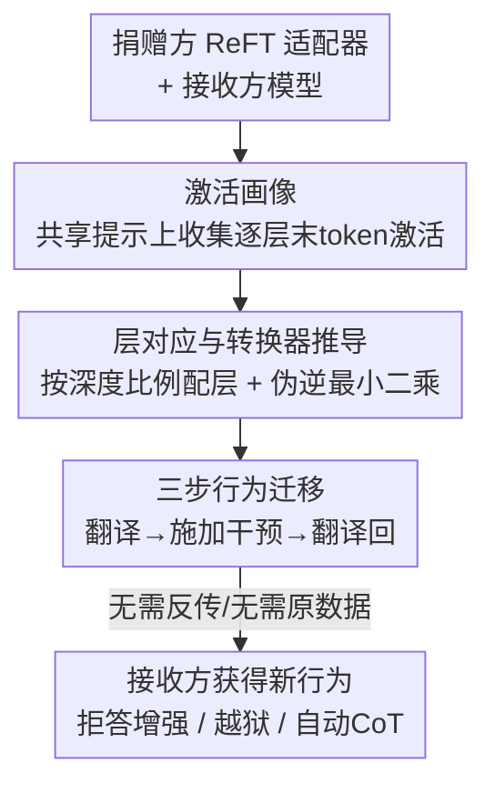

# Command-V: Training-Free Representation Finetuning Transfer

**会议**: ICLR2026  
**OpenReview**: [https://openreview.net/forum?id=oRYzpI3cmJ](https://openreview.net/forum?id=oRYzpI3cmJ)  
**代码**: https://github.com/ippolito-cmu/Command-V/  
**领域**: LLM效率 / 参数高效微调 / 行为迁移  
**关键词**: 免训练迁移, ReFT, 表示微调, 激活画像, 模型编辑

## 一句话总结
Command-V（⌘V）把一个模型上训好的残差表示适配器（ReFT adapter），不经任何反向传播、也不需要原始训练数据，通过一对线性"转换器"直接搬到另一个架构不同的模型上，让接收方"免费"获得捐赠方的新行为（如拒答增强、越狱、自动思维链），效果接近直接微调而算力省几个数量级。

## 研究背景与动机
**领域现状**：要给大模型"装"新行为（更安全地拒答、更愿意一步步推理等），主流做法是监督微调、指令微调、RLHF，或者参数高效微调（LoRA、prefix-tuning、ReFT 这类只更新极少参数的方法）。这些方法确实有效，但每换一个模型架构都得重做一遍。

**现有痛点**：微调/蒸馏的代价是双重的——既要准备专门策划的数据，又要花可观的计算资源；而且它们都假装"从零教起"，完全没利用一个事实：很多现成模型其实**已经**具备你想要的行为。如果模型 A 已经被调出了某种能力，为什么模型 B 还要重新从数据里学一遍？

**核心矛盾**：行为是被"编码"在某个特定模型的权重/激活空间里的，而不同模型（哪怕同族、不同规模）的隐藏维度数、层数都不一样，激活空间彼此不通。想把 A 的适配器直接装到 B 上，维度对不上、层也对不齐——这是"行为无法跨模型复用"的根本障碍。

**本文目标**：在不碰原始训练数据、不在接收方上做反向传播的前提下，把捐赠方（donor）训好的表示适配器"翻译"到接收方（recipient）的激活空间里去用。

**切入角度**：作者依托一条近年被反复验证的观察——跨架构的 LLM 会收敛到一个**共享表示空间**（universal geometry、对齐的激活邻域），且层的功能随深度近似线性缩放（浅网络第 2 层 ≈ 两倍深网络的第 4 层）。既然两个空间结构相似，那它们之间就有希望用一个**线性映射**互相对齐。

**核心 idea**：用"激活画像"在捐赠方和接收方之间建立逐层的线性对应（转换器），推理时把接收方的激活临时翻译到捐赠方空间、施加捐赠方的适配器干预、再翻译回来——相当于把一个适配器的"作用效果"剪切粘贴到另一个模型上。

## 方法详解

### 整体框架
⌘V 涉及三个模型：捐赠基座 $M_D$、其经 ReFT 微调后的版本 $M_{D'}$（两者只差一组干预模块 $I$）、以及架构不同的接收方 $M_R$。目标是把 $M_{D'}$ 相对 $M_D$ 多出来的那组行为（即干预 $\Delta I$）搬到 $M_R$ 上。整条流水线分四步：先在一小批共享提示上**同时**收集两个模型每层的激活、做成"激活画像"；再按深度比例把捐赠方有适配器的层映射到接收方对应层；然后用伪逆最小二乘在配对激活上解出双向线性转换器；最后在接收方前向推理时，把它的激活"翻译—干预—翻译回"，把捐赠方的行为注入进去。整个过程只需前向推理，转换器在 CPU 上几秒就能算完。

### 关键设计

**1. 激活画像：用一小批通用提示给每个模型拍"指纹"**

要在两个模型之间建映射，先得有可配对的素材。⌘V 让同一批提示 $P=\{p_1,\dots,p_N\}$ 分别过捐赠方和接收方，对每个提示记录每一层的**末 token 激活**（沿用 RepE 的最佳实践，也与适配器只作用在末 token 上的配置匹配）。对模型 $m$ 的层 $l$，把 $N$ 个提示的激活堆成矩阵 $A_m^{l}\in\mathbb{R}^{N\times d_m}$——例如 Llama3.1-8B（残差维 4096、32 层）用 100 个提示就得到每层一个 $(100,4096)$ 的矩阵。直观上，这张画像编码了"每个残差维度在多样化用户提示下如何响应"，是这层在激活空间里的稳定指纹。关键是它**与下游任务无关**：作者用 LIMA 数据集里 1030 条话题各异的通用提示（开放问答、创意写作、事实查询），并不需要安全/越狱等任务专属数据，所以每个模型只需做一次、可摊销复用。

**2. 层对应与转换器推导：用伪逆最小二乘把两个激活空间线性对齐**

有了画像还要解决"哪层对哪层、维度怎么换"。层对应上，作者基于"层功能随深度线性缩放"的观察，用最简单的比例映射 $l_R=\lfloor \alpha\cdot l_D\rfloor$，其中 $\alpha=|L_R|/|L_D|$ 是两模型层数之比，把捐赠方装了适配器的层对到接收方的层。维度对齐上，定义一对线性转换器 $C_{l_D\to l_R}$ 和 $C_{l_R\to l_D}$，要求它们尽量保结构且**循环一致**：$C_{l_R\to l_D}(h_R)\approx h_D$ 且 $C_{l_D\to l_R}(C_{l_R\to l_D}(h_R))\approx h_R$。把配对的激活矩阵记作接收方 $X\in\mathbb{R}^{N\times d_R}$、捐赠方 $Y\in\mathbb{R}^{N\times d_D}$，转换器就是最小二乘的闭式解：

$$C_{R\to D}=X^{\dagger}Y,\qquad C_{D\to R}=Y^{\dagger}X$$

其中 $X^{\dagger}$ 是 Moore-Penrose 伪逆。比如 Llama3.2-3B（$d=3072$）与 Llama3.1-8B（$d=4096$）之间，一对双向转换器形状就是 $(4096,3072)$ 和 $(3072,4096)$。妙处在于：**整个求解无需反向传播，纯线性代数，CPU 上对全部 14–18 对层平均只要 6.35 秒**。这和蒸馏/微调动辄要重训接收方形成鲜明对比。

**3. 三步行为迁移：推理时把激活"翻译—干预—翻译回"**

转换器是桥，真正的行为注入发生在接收方的前向推理里。捐赠方的适配器是 DiReFT，它对隐藏态的干预写作 $I(h)=h+W_2^{\top}(W_1 h+b)$（低秩，秩 4–32），记其增量为 $\Delta I(h)=I(h)-h$。⌘V 在接收方对应层 $l_R$ 上执行三步：(1) 把接收方激活翻译到捐赠方空间 $h_D^{\text{temp}}=h^{l_R}C_{R\to D}$；(2) 在捐赠方空间施加捐赠方的干预 $\Delta I_{l_D}(\cdot)$；(3) 把结果翻译回接收方空间再加回原激活：

$$h^{l_R}_{\text{intervened}}=h^{l_R}+C_{l_D\to l_R}\big(\Delta I_{l_D}\big(C_{l_R\to l_D}(h^{l_R})\big)\big)$$

因为干预只作用在每条序列的少数末 token、且每次生成只用一次（而非每解码一个 token 都用），额外延迟极小。更关键的是**显存优势**：全程没有反传、没有训练，若两个模型的激活画像已预先备好，边缘设备甚至能在"从不下载 8B 权重、也跑不动 8B"的情况下，把 8B 的适配器用到 3B 上。

## 实验关键数据

作者挑了三类"微调前后差异显著、易于验证"的行为来验证 ⌘V：拒答增强、拒答抑制（越狱）、自动思维链推理。

### 主实验

**拒答增强**（在 WildJailbreak 上训适配器，2000 条对抗有害提示评测 ASR↓）：

| 迁移方向 | 接收方 off-shelf ASR | ⌘V 后 ASR | 对照：接收方直接 ReFT |
|--------|------|------|------|
| 3B → 8B | 36.85% | **20.40%** | 28.55%（中间最低 21.05%） |
| 8B → 3B | 31.30% | **16.40%** | 12.20%（中间最低 5.65%） |

值得注意：3B 的适配器搬到 8B 后（20.40%）竟**超过**在 8B 上直接训练的效果（28.55%），说明迁移并非简单的次优近似。

**拒答抑制 / 越狱**（AdvBench 训练，AdvBench + HarmBench 评测 ASR↑）：多数模型原本越狱率仅个位数，经 ⌘V 后普遍升到 20–80%。最强捐赠方 Qwen2.5-7B 平均把接收方推到 41.2%（AdvBench）/46.9%（HarmBench），对 Qwen2.5-1.5B 最高达 80.7%/81.5%。同族迁移效果最好；Gemma2-2B-it 最抗迁移。

**自动思维链**（OpenMathReasoning 训练，Big Bench Hard 评测）：同族 8B→3B 迁移后模型更倾向先推理再答，Qwen2.5-3B 在 Multistep Arithmetic 上提升最高 +50%，部分迁移可比肩直接训练。

### 消融 / 代价分析

| 配置 | 关键指标 | 说明 |
|------|---------|------|
| 转换器推导耗时 | 6.35 秒 | 14–18 对层，MacBook Pro CPU |
| 适配器额外参数 | <0.04% | 每层一个 DiReFT，仅作用末 token |
| 激活画像 N | 1030（LIMA） | 任务无关，每模型一次性摊销 |
| ARC-Challenge（8B） | 85.75→86.43% | ⌘V 后通用推理能力基本不掉 |

### 关键发现
- **行为迁移的"质量"取决于捐赠适配器对捐赠方本身的影响强度**：若适配器对捐赠方收益就很小（如常识推理、虚构知识数据集），接收方几乎拿不到收益。
- **同族迁移 > 跨族迁移**：越狱这类行为能跨族传，但拒答增强、推理这类对架构相似度更敏感。
- **副作用**：拒答增强会带来过度拒答（8B：1.36%→4.52%，3B：3.17%→14.48%）；CoT 迁移有时损害指令遵循（最多 28.8% 响应不再符合 JSON 格式）甚至输出崩溃，尤其小模型和需要精确生成特殊 token（如 `<thinking>`）时。

## 亮点与洞察
- **"剪切—粘贴行为"的范式**：把"训练新能力"重新表述为"翻译已有能力"，这是建立在表示空间普适性假设上的一次干净落地——只要承认跨模型激活空间线性可对齐，行为就成了可搬运的资产。
- **闭式解 + 无反传**：转换器是最小二乘伪逆的闭式解，CPU 几秒算完，把"模型编辑"的成本压到了推理级别，真正可上边缘设备。这个 trick（用配对激活解线性映射）可迁移到任何"两个表示空间需要对齐"的场景。
- **3B→8B 反超直训**：小模型适配器搬到大模型后效果更好，提示迁移可能带来某种正则/泛化收益，而非纯损耗，值得深挖。
- **双刃剑的诚实呈现**：作者把越狱迁移（降低有害使用门槛）和过度拒答都摆上台面，没有掩饰能力迁移的安全风险。

## 局限与展望
- **依赖捐赠方收益足够大**：适配器本身在捐赠方上效果微弱时，⌘V 几乎无效。
- **效用偶发损伤**：小接收方可能出现输出崩溃、语言漂移、格式失效，类似激活过度操纵（oversteering）；需要精确 token 的行为最容易翻车。作者把 `<thinking>` 换成自然词来缓解，并指出 classifier-free guidance 等轻量手段可能改善，但未实现。
- **配对预测仍是开放问题**：哪对模型、哪类任务能迁移好，目前靠经验（Llama3.2-3B 与 3.1-8B 是较好搭档），缺乏可靠的事前信号（作者猜转换器在目标提示上的测试损失或许可预测迁移质量）。
- **线性转换器的天花板**：当前只用最小二乘线性映射；非线性映射、可训练转换器、ReFT 之外的适配器（如 JoLA）都可能进一步提升，留作未来工作。

## 相关工作与启发
- **vs 知识蒸馏**：蒸馏要从教师大量生成数据并重训学生；⌘V 直接迁移某个**既有适配器的功能效果**，靠激活映射，免数据生成、免重训。
- **vs 模型合并 / 任务向量 / ROME·MEMIT**：这些大多在**同架构、同参数量**上对权重做算术或改特定事实；⌘V 在**激活空间**操作，能跨不同架构迁移。
- **vs 激活引导 / steering vectors**：引导向量通常编辑**同一个目标模型**的激活；⌘V 用**捐赠方**的激活/干预去引导一个**不同的接收方**。
- **vs ReFT / LoRA**：ReFT 学低秩表示干预、宣称比 LoRA 参数效率高 15–65×；⌘V 更进一步，把训好的 ReFT 适配器**搬走复用**，既不要原始训练数据也不要在目标上反传。

## 评分
- 新颖性: ⭐⭐⭐⭐⭐ 把"表示空间普适性"落地成免训练、跨架构的行为搬运，范式清晰且少见。
- 实验充分度: ⭐⭐⭐⭐ 三类行为 + 多模型族 + 代价/效用消融较完整，但缺少更系统的"何时能迁移"预测分析。
- 写作质量: ⭐⭐⭐⭐ 算法伪代码 + 公式 + 图表清楚，局限与安全风险陈述诚实。
- 价值: ⭐⭐⭐⭐⭐ 把模型编辑成本压到推理级、可上边缘设备，对能力复用与组合很有想象空间。

<!-- RELATED:START -->

## 相关论文

- [\[ICLR 2026\] Beyond Fixed: Training-Free Variable-Length Denoising for Diffusion Large Language Models](beyond_fixed_training-free_variable-length_denoising_for_diffusion_large_languag.md)
- [\[ICLR 2026\] Dynamic-dLLM: Dynamic Cache-Budget and Adaptive Parallel Decoding for Training-Free Acceleration of Diffusion LLM](dynamic-dllm_dynamic_cache-budget_and_adaptive_parallel_decoding_for_training-fr.md)
- [\[ICML 2026\] Hyperparameter Transfer with Mixture-of-Experts Layers](../../ICML2026/llm_efficiency/hyperparameter_transfer_with_mixture-of-expert_layers.md)
- [\[ICLR 2026\] Hierarchy Decoding: A Training-free Parallel Decoding Strategy for Diffusion Large Language Models](hierarchy_decoding_a_training-free_parallel_decoding_strategy_for_diffusion_larg.md)
- [\[ICLR 2026\] Training-Free Loosely Speculative Decoding: Accepting Semantically Correct Drafts Beyond Exact Match](training-free_loosely_speculative_decoding_accepting_semantically_correct_drafts.md)

<!-- RELATED:END -->
