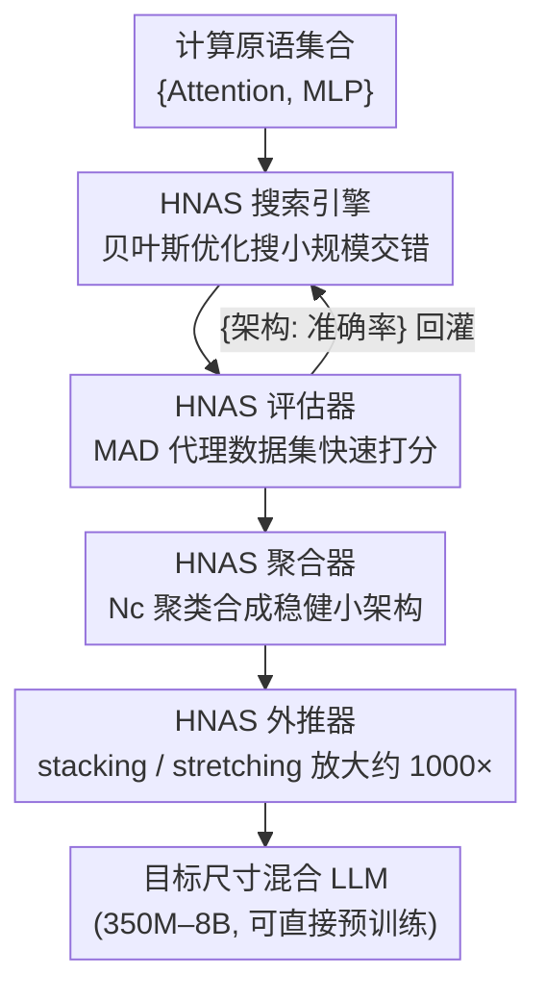

# Composer: A Search Framework for Hybrid Neural Architecture Design

**会议**: ICLR2026  
**OpenReview**: [https://openreview.net/forum?id=m00gjQfpCc](https://openreview.net/forum?id=m00gjQfpCc)  
**代码**: 待确认  
**领域**: LLM效率 / 神经架构搜索  
**关键词**: 混合架构, 神经架构搜索, 计算原语交错, 小规模搜索外推, 贝叶斯优化

## 一句话总结
Composer 把"该怎么把 Attention、MLP 这些计算原语交错排列成更好的 LLM"这个一直靠人手工拍脑袋的问题，做成了一个自动化搜索框架：在百万参数级的小模型上用贝叶斯优化搜出好的交错模式，再外推约 1000× 放大到 3B/8B，搜出的 Composite 架构在 350M–8B 全程压过 Llama 3.2，下游准确率平均涨 2–2.1%，同时训练吞吐 ×1.25、KV cache 缩小 ×1.69。

## 研究背景与动机
**领域现状**：标准 Transformer 把 self-attention 和 MLP 按固定 1:1 比例顺序交错堆叠，这套结构统治了 LLM 多年。但近来一批工作发现，偏离这种固定堆叠的"混合架构"能进一步提升质量——比如 Qwen3-Next、Mamba-2、MAD 调整 Attention 与 SSM 原语的比例，DeepSeek-V3 在前几层用 dense MLP、后面接稀疏 MoE，Sandwich Transformer 则在不改比例的前提下重排交错顺序。这些案例都暗示：**原语的比例和交错方式本身就是一个可优化的设计维度**。

**现有痛点**：所有这些混合架构都是研究者凭直觉手工设计的，没有系统框架去自动、高效地搜索。而设计空间大得离谱——光是一个 32 层、只含 Attention/MLP 两种原语的模型就有 $2^{32}$（40 多亿）种排列。逐个预训练评估完全不可行。

**核心矛盾**：要搜得起，就必须在"小规模"上搜（小模型、小数据），但小规模上表现好的架构未必能放大后还好。论文一个关键发现是：**按 Chinchilla scaling law 同时缩小模型和数据，小模型上的质量排名并不能反映大规模上的真实表现**——小规模搜索的信号失真，搜出来的是"小而宽浅"的畸形架构。已有尝试 STAR 假设直接在目标数据集上搜（面向边缘端小模型），而本文发现用 web-scale 数据搜要么无效要么不切实际。

**本文目标**：设计一个能自动、高效地为预训练发现"放大后仍优于 SOTA"的混合 LLM 架构的搜索框架，并把它拆成可独立替换/研究的模块，逐个回答四个设计问题：用什么搜索算法、用什么数据集评估、怎么把多个候选合成一个最终架构、怎么把小架构外推到大尺寸。

**切入角度**：与其在小规模上"等比缩放"导致信号失真，不如**只缩小到能保住宽深比的小模型 + 换用能被小模型学会、又能代表大规模任务的代理数据集（MAD 合成任务）**，让小规模搜索的相对排名忠实反映大规模表现（实测 6 层搜索与 1B 规模的 Spearman 秩相关达 0.97）。

**核心 idea**：把"原语交错设计"形式化为一个离散序列搜索问题，用模块化的 HNAS 框架（搜索→评估→聚合→外推）在小规模搜、向大规模外推。

## 方法详解

### 整体框架
Composer 输入一组计算原语（本文聚焦 Attention 与 MLP 两种），输出一个指定尺寸（如 3B）、可直接预训练的混合 LLM。一个混合 LLM 被形式化为长度为 $N$ 的原语序列 $a=(a_1,\dots,a_N)$，其中每个 $a_i$ 取自原语集合 $P=\{p_1,\dots,p_Z\}$，整个离散搜索空间大小为 $|A_N|=Z^N$，随目标层数指数膨胀。

整条流水线由四个核心组件串成：**HNAS 搜索引擎**在百万参数级小模型上用贝叶斯优化搜出候选交错模式 → **HNAS 评估器**用小规模代理数据集（MAD 合成任务）快速训练并打分每个候选 → **HNAS 聚合器**把搜出的一批 top 候选用聚类合成为一个稳健的小架构 → **HNAS 外推器**把这个小架构按比例放大约 1000× 到目标尺寸（stacking 或 stretching）。前两者构成搜索循环（评估打分回灌给引擎指导下一轮采样），后两者负责"小→大"的落地。

### 关键设计

**1. HNAS 搜索引擎：三种搜索方法论在指数空间里找好的交错模式**

搜索空间 $Z^N$ 随目标层数指数爆炸，引擎的任务是在这片空间里高效采样。核心引擎用**贝叶斯优化 + 高斯过程代理模型**（基于 Ax/BoTorch 的 SingleTaskGP，RBF 核 + qLogNEI 采集函数），优化目标是一个黑盒函数 $f(a)=\text{Accuracy}(\text{PreTrain}(a,D_{train}),D_{val})$，求解 $a^*=\arg\max_{a\in A_n} f(a)$；之所以用 BO 而非强化学习或进化搜索，是因为它在样本效率和不确定性建模上更划算。在此之上论文给了三种搜索策略：**One-Shot Search** 直接搜 $n\le N$ 层（$n<N$ 则交给外推器放大）；**End-Layer Incremental Search** 把空间剪枝成增量构建——先搜 $n$ 层、固定住已搜定的前缀、每步只在末尾新增的 $n$ 层里搜（每步只有 $2^n$ 种候选），共 $N/n$ 步搭到目标深度；**Middle-Layer Incremental Search** 类似但每次把上一轮架构从中间劈开、固定首尾、只搜中间 $n$ 层。实验里三者都能打过 Llama 3.2，但 One-Shot 在质量和搜索成本上权衡最好（attention 层只占 33%、成本比 End-Incremental 低 1.4–2.1×），故全文默认用 One-Shot（6 层和 16 层两个变体）。引擎还有一招提效：**同时缩小原语的宽度**而不仅是深度——不缩宽度时搜索成本高得离谱，且会搜出"又宽又浅"、放大后不灵的畸形架构；缩宽度后成本降 6.38×，还能搜出更好的 1:2 比例架构。

**2. HNAS 评估器：用能代表大规模任务的小代理数据集换取忠实的搜索信号**

搜索循环里每个候选都要被训练+评估，数据集选错会让整个搜索被误导。直接在目标 web-scale 数据（DCLM）上搜有两条路都不通：按 scaling law 同时缩小模型和数据（Small-Scale DCLM）只比 Llama 略好且随预算增大优势消失；只缩数据、保大模型（Large-Scale DCLM）质量好但搜索成本 >25 GPU·天。论文转而验证**小规模合成代理数据集**：最终选定 **MAD**（一个 token 操作类合成任务集，用于探测 LLM 的各种能力），它把搜索成本相比 Large-Scale DCLM 砍掉 >8×，同时搜出的架构放大后稳定优于 Llama 3.2。作者推测原因有二：MAD 的 token 操作任务（1）词表小、小模型也学得会，（2）能代表大规模 LLM 任务，于是"小规模可学 + 大规模可迁移"两头都占。

**3. HNAS 聚合器：用 Nc 聚类把一批 top 候选合成一个抗噪的最终小架构**

小规模搜索会吐出多个高分候选，直接挑单个最优容易过拟合小规模噪声。聚合器提出 **Nc 聚类**：在 top 候选集合 $C$（按验证准确率用 K-means 选出，5 个簇）上，逐层挑选原语时以"前 $c$ 层已选原语"为条件取众数——$\hat a_i=\text{mode}(\{a_i^{(m)}\mid a^{(m)}\in C,\, a^{(m)}_{i-c:i-1}=\hat a_{i-c:i-1}\})$。当 $c=0$ 时（$N_0$ 聚类）每层独立取众数、不看前文；$c=1$ 看紧邻前一层；$c=i-1$ 则强制整段前缀一致。实验发现 **$N_0$ 聚类效果最好**——对所有 top 候选逐层取众数，恰好把小规模搜索里的噪声和过拟合"平滑"掉，比直接用搜索过程中的单个最优架构更稳。

**4. HNAS 外推器：stacking 与 stretching 两种放大术把小架构升到目标尺寸**

搜出的小架构深度 $n$ 通常远小于目标深度 $N$，需要放大约 1000×。若 $n=N$ 只需把宽度放回 Llama 3.2 的宽度；否则用两种深度放大术之一。**Stretching（拉伸）**保持交错模式与原语比例不变、按比例拉长每段：把架构切成 $G$ 个同原语连续段 $\{(p_g,h_g)\}$，定义缩放因子 $s=M/m$（$M,m$ 为目标/当前模型尺寸），放大为 $\{(p_g,\lceil s\cdot h_g\rceil)\}$。**Stacking（堆叠）**把整个小架构当成一个可堆叠块、顺序堆 $s=\lfloor M/m\rfloor$ 份，再用余项 $r=M\bmod(m\times s)$ 按拉伸式补一小段到末尾以精确对齐目标尺寸。实验给出一个清晰的拐点：stacking 对各种搜索深度都稳；stretching 在小层数搜索（如 2A+4M）时会退化成"前段全 Attention、后段全 MLP"的劣质模式，但在 **16 层以上搜索时反超 stacking**——更大的搜索空间让 Composer 找到 stacking 探不到的创造性交错，且 stretching 保留了原语之间的过渡点、利于跨过渡点传播梯度捕捉全局依赖。故最终方案：**6 层搜索用 stacking、16 层搜索用 stretching**。

### 损失函数 / 训练策略
搜索目标是黑盒验证准确率 $f(a)$，由贝叶斯优化在固定 trial 预算内最大化；评估器在 MAD 上快速预训练每个候选。最终 Composite 架构在 DCLM 上预训练，IsoFLOP 分析覆盖 350M–8B 模型、2e19–4e20 FLOPs 训练预算；宽度设定对齐 Llama 3.2（如 1B 为 2048×8192、32 attention heads、8 KV heads）以保证差异只来自交错与比例。

## 实验关键数据

### 主实验
搜出的两个 Composite 架构为：6 层搜索 = 2A + 4M（stacking 放大）；16 层搜索 = 2A + 5M + 2A + 3M + 1A + 3M（stretching 放大）。在 1B 规模下与多个 SOTA 混合架构对比（同样用 DCLM、固定 37.5B tokens 训练，STAR 因未开源直接引用其论文数值）：

| 模型 (1B) | Loss ↓ | Arc C. | Hella. | Wino. | SciQ | PIQA | Arc E. | Avg. ↑ |
|-----------|--------|--------|--------|-------|------|------|--------|--------|
| Llama 3.2 | 2.80 | 29.8 | 53.1 | 55.8 | 80.6 | 71.8 | 61.03 | 58.69 |
| Sandwich Transformer | 2.77 | 30.8 | 54.93 | 55.25 | 83.4 | 71.5 | 63.43 | 59.88 |
| 1:2 Striped Attn. | 2.81 | 29.0 | 52.9 | 56.4 | 80.0 | 72.6 | 62.92 | 58.97 |
| STAR* | - | 27.9 | 52.6 | 53.9 | 87 | 71.8 | 60.8 | 59 |
| **Composite: Stacked** | **2.77** | 28.84 | 54.56 | 55.72 | 87.6 | 73.56 | 64.73 | **60.83** |
| **Composite: Stretched** | **2.77** | 32.25 | 54.96 | 53.9 | 87.9 | 72.3 | 63.26 | **60.76** |

跨尺寸（350M–8B）和训练预算上，Composite 一致比 Llama 3.2 降 loss 0.05–1.0，下游任务最高涨 2.8–8.3%（堆叠/拉伸平均 1.1–3.1%）。效率上：训练吞吐 ×1.25、单步训练时间 ×1.32、1B 推理延迟 ×1.33、KV cache 缩小 ×1.69（因为只有 9–10 个 attention 层、1:2 比例，且总层数 27/29 < Llama 的 32）。

### 消融实验
各组件方法论的消融（固定其他组件按 Table 1 默认配置，放大到 1B 比 DCLM 验证 loss）：

| 组件 / 配置 | 关键结论 | 说明 |
|------|---------|------|
| 搜索：End vs Middle vs One-Shot | One-Shot 胜出 | 三者都打过 Llama；One-Shot attention 占比仅 33%、成本低 1.4–2.1× |
| 评估：DCLM vs MAD | MAD 胜出 | DCLM 缩放无效/不切实际；MAD 成本降 >8× 且放大后稳赢 |
| 聚合：$N_0$ vs $N_1$ vs 单最优 | $N_0$ 聚类胜出 | 逐层取众数平滑掉小规模噪声/过拟合 |
| 外推：stacking vs stretching | 分场景 | 6 层用 stacking、16 层以上 stretching 反超 |
| 宽度缩放 on/off | 缩宽度更好 | 成本降 6.38×、loss 再降 0.02–0.04 |

### 关键发现
- **小规模搜索的排名能不能信，取决于数据集而非缩放定律**：6 层搜索与 1B 规模的 Spearman 秩相关高达 0.97，前提是用 MAD 这类代理数据集 + 保住宽深比，而非等比缩小 web-scale 数据。
- **1:2 的 Attention:MLP 比例 + 智能交错是质量来源**：相比 Transformer 的 1:1 顺序堆叠，减少 attention 层不仅提质还顺带提效；与 5 个随机生成的 16 层架构对比，以 MLP 开头（R1/R3）的表现差，Attention 过重的也不如 1:2。
- **"前 Attention 后 MLP"的交错偏好**：开头多个 attention 利于深层上下文理解与特征提取，结尾 MLP 负责精炼与投影；$N_0$ 聚类后的架构同时满足这两条性质，故质量最优。

## 亮点与洞察
- **把"架构直觉"变成可搜索的离散序列问题**：以往混合架构全靠人手工拍，本文第一个把"原语交错"系统化为 $Z^N$ 搜索空间并给出端到端框架，这个问题表述本身就有迁移价值。
- **"缩小但保宽深比 + 换代理数据"是小规模搜索可信的关键**：一反"等比缩放"的惯性，指出 Chinchilla 式缩放在 NAS 场景会失真，用 MAD 合成任务换来 0.97 秩相关——这个洞察对任何想"小规模搜、大规模用"的 NAS 都通用。
- **stacking/stretching 的拐点分析很实用**：清楚指出"小层数搜索用堆叠、≥16 层搜索用拉伸"的边界及其机理（拉伸保留过渡点利于全局信息传播），是可直接复用的工程经验。
- **模块化设计便于扩展**：四个组件各自可换，论文也明说框架能接入 Gated Delta Net、Mamba、Sliding Window Attention 等更多原语。

## 局限与展望
- **只验证了 Attention/MLP 两种原语**：虽然框架声称可扩展，但实际搜索空间仍是二元的，更丰富原语（SSM、卷积、recurrent）混入后搜索难度和结论是否成立未验证。
- **下游任务局限于标准 NLU**：评测集中在 PIQA、WinoGrande、SciQ 等常识/理解任务，作者自己承认长上下文和复杂推理任务的表现尚未验证，且可能需要新的长上下文/推理专用小规模代理数据集。
- **代理数据集的质量缺乏深入刻画**：MAD 为何能代表大规模任务只给了推测（词表小可学、任务有代表性），"什么样的代理任务才好"仍是开放问题，换任务域可能需要重新设计代理数据。
- **搜索 trial 预算固定带来上限**：>16 层搜索质量反降，被归因于空间指数膨胀超出固定预算，说明框架对超大深度直接搜索仍乏力，依赖外推绕开。

## 相关工作与启发
- **vs STAR**：同样想从头预训练混合 LLM，但 STAR 假设直接在目标数据集上搜、面向边缘端小模型；本文发现在 web-scale 数据上搜不可行，转用代理数据 + 小规模搜索 + 外推，且在固定 token 数下质量更优（loss 低 0.03、下游涨 1–2% avg）。
- **vs Nemotron 的 PostNAS**：PostNAS 是对预训练好的模型做剪枝/替换块（post hoc），Composer 则是预训练前从零搜索交错结构，定位互补。
- **vs 传统 NAS（如 width/depth 超参搜索）**：传统 NAS 假设固定的原语交错、只搜模型宽度/层数等超参；Composer 反过来固定可学超参、专门搜原语的交错模式与比例，是正交的搜索维度。
- **vs Sandwich Transformer / Striped Attention 等手工混合架构**：它们是人手工设计的特定交错/比例，Composer 把"找交错"自动化，且搜出的 Composite 在 1B 上全面压过这些手工 baseline。

## 评分
- 新颖性: ⭐⭐⭐⭐⭐ 首个把混合 LLM 的"原语交错设计"系统化为可搜索问题并给出可信的小规模搜索方案
- 实验充分度: ⭐⭐⭐⭐ 350M–8B 跨尺寸、四组件逐一消融、与多 SOTA 对比都很扎实，但下游任务偏 NLU、原语种类有限
- 写作质量: ⭐⭐⭐⭐⭐ 四组件分解清晰、五个 Observation/三个 Key Result 把发现讲得很有条理
- 价值: ⭐⭐⭐⭐ 给"如何自动设计高效混合架构"提供了可复用的方法论与工程经验，对追求训练/推理效率的预训练实践有直接参考

<!-- RELATED:START -->

## 相关论文

- [\[NeurIPS 2025\] Jet-Nemotron: Efficient Language Model with Post Neural Architecture Search](../../NeurIPS2025/llm_efficiency/jet-nemotron_efficient_language_model_with_post_neural_architecture_search.md)
- [\[ICLR 2026\] Distilling to Hybrid Attention Models via KL-Guided Layer Selection](distilling_to_hybrid_attention_models_via_kl-guided_layer_selection.md)
- [\[ICLR 2026\] Demystifying and Enhancing the Efficiency of Large Language Model Based Search Agents](demystifying_and_enhancing_the_efficiency_of_large_language_model_based_search_a.md)
- [\[ICLR 2026\] CONCUR: A Framework for Continual Constrained and Unconstrained Routing](concur_a_framework_for_continual_constrained_and_unconstrained_routing.md)
- [\[ICLR 2026\] A Two-Phase Deep Learning Framework for Adaptive Time-Stepping in High-Speed Flow Modeling](a_two-phase_deep_learning_framework_for_adaptive_time-stepping_in_high-speed_flo.md)

<!-- RELATED:END -->
