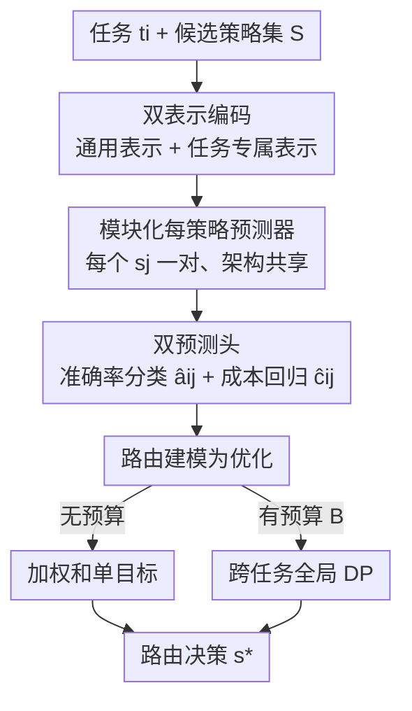

# CONCUR: A Framework for Continual Constrained and Unconstrained Routing

**会议**: ICLR2026  
**OpenReview**: [https://openreview.net/forum?id=gCUY6QIv8r](https://openreview.net/forum?id=gCUY6QIv8r)
**代码**: https://peterbaile.github.io/concur/  
**领域**: LLM效率 / 模型路由  
**关键词**: LLM 路由, 持续学习, 模块化预测器, 准确率-成本权衡, 约束优化

## 一句话总结
CONCUR 给每个「模型+解码方法」策略单独训练一对（准确率分类器 + 成本回归器）预测器，再把"该把任务交给谁"写成带/不带预算的优化问题来求解，从而在新策略不断涌现时只需加训新预测器、无需重训整套路由器，在分布内外、约束/无约束设置下都比最强单一策略和现有路由方法准确率更高、推理 FLOPs 更低。

## 研究背景与动机
**领域现状**：不同 AI 任务难度差异巨大，最优的"算力策略"（用哪个大/小模型、是否用思维链 CoT 解码）也不同。一个好的**路由器（router）**应该把每个任务派给最划算的策略，从而同时提升整体准确率、压低延迟与成本。主流路由工作（RouteLLM、EmbedLLM、RTR 等）都是在**所有策略的混合数据上联合训练一个单一模型**，由它一次性预测每个策略的好坏。

**现有痛点**：这种"一个大模型管所有策略"的单体设计有两个硬伤。其一是**持续设置（continual）下代价高**：更强更省的模型和解码方法层出不穷，一旦要纳入一个新策略，就得拿"旧策略 + 新策略"的全部数据从头重训整个路由器，开销巨大；不及时纳入又会错失省钱提点的机会。其二是**表示太单薄**：现有方法往往只用单一表示（有的只参数化任务级表示、有的只参数化策略表示），表达力受限，路由决策质量上不去。

**核心矛盾**：想要"持续可扩展"就得让模型解耦到单策略粒度，但已有的少数模块化尝试（Wang et al., 2025 给每个策略训不同架构的路由器；Jitkrittum et al., 2025 的零样本路由器依赖预定义 prompt）又牺牲了**泛化性**——架构因策略而异、或绑死特定 prompt，很难无痛扩展到没见过的策略。于是"模块化可扩展"和"对新策略泛化"成了一对张力。

**本文目标**：造一个同时覆盖①持续 / 非持续、②约束（带预算）/ 无约束（不带预算）四类设置的统一路由框架，既能低成本纳入新策略，又能保住端到端准确率与效率。

**切入角度**：把路由拆成两步——先**预测**（每个策略作用在某任务上的准确率与成本），再**优化**（用预测值把"派给谁"写成优化问题求解）。预测这步用**模块化**结构（每策略一对预测器、架构共享），扩展新策略只动新预测器；同时给每个预测器喂**多种表示**（通用 + 任务专属）补足表达力。

**核心 idea**：用"每策略独立的同构预测器 + 双表示输入 + 把路由建模为优化问题"替换"单一大模型联合预测"，从而把持续路由做得既便宜又泛化。

## 方法详解

### 整体框架
CONCUR 要解决的是：给定一批任务和一组候选算力策略 $S$，决定每个任务该用哪个策略，使整体准确率高、推理成本低，并且当 $S$ 后续新增策略 $S'$ 时扩展代价极小。它把这件事拆成"预测 + 路由"两段串行流程。

预测段：把任务 $t_i$ 和策略 $s_j=(m_j, d_j)$（模型 + 解码方法）分别编码成**通用表示**和**任务专属表示**两套向量，喂进**专属于该策略 $s_j$ 的一对预测器**，分别吐出预测准确率 $\hat a_{ij}$ 和预测成本 $\hat c_{ij}$（成本用 FLOPs 度量）。关键在于"每个策略一对预测器、且所有策略的预测器架构相同"——新增策略只需训它自己的预测器，旧的一概不动。

路由段：拿到所有 $(\hat a_{ij}, \hat c_{ij})$ 后，把"任务派给哪个策略"写成优化问题：无预算时是准确率与成本的加权权衡，带预算时是预算约束下的准确率最大化（且跨整批任务做全局分配），求解即得最终路由决策。

### 关键设计

**1. 双表示编码：给路由决策补足表达力**

针对"现有方法只用单一表示、表达力不足"的痛点，CONCUR 对每个 (任务, 策略) 对同时构造两套表示并拼接使用。**通用表示**直接把任务文本、模型描述、解码方法描述各自过一个**冻结的现成文本嵌入模型** $R$：$g^t_i=R(t_i)$、$g^m_j=R(m_j)$、$g^d_j=R(d_j)$，拼成 $g_{ij}=[g^t_i; g^m_j; g^d_j]\in\mathbb{R}^{3k}$，提供与任务/策略语义相关的通用信号。**任务专属表示**则用可学习参数：任务侧把通用表示再过一个可学习线性投影 $W_t R(t_i)$，模型和解码方法侧各用一张**可学习嵌入查找表** $E_M[m_j]$、$E_D[d_j]$（把模型 ID / 解码方法 ID 映射成可训练稠密向量），同样拼成 $s_{ij}\in\mathbb{R}^{3k}$。消融显示（见 Table 7）两套表示各有贡献、合用最佳——通用表示带来跨任务可迁移的语义先验，任务专属表示则学到针对具体模型/解码方法的判别信号，二者互补。

**2. 模块化每策略预测器：让"加新策略"只需加训一个预测器**

这是论文的核心贡献，直接回应"持续设置下重训代价高"的痛点。与"一个大模型在所有策略混合数据上联合训练"不同，CONCUR 给**每个策略 $s_j$ 单独训练预测器**，且所有策略的预测器**共享同一套架构**。由此带来两个性质：其一，训某个策略的预测器**只需要该策略对应的训练数据**（对每个任务跑一遍 $s_j$ 拿到真值标签 $a_{ij}, c_{ij}$），策略之间互不依赖；其二，当新策略 $s'_j$ 出现时，**只训它自己的那对预测器、旧预测器原封不动**，扩展开销极小。这与 Wang et al. (2025) "每策略架构不同、难扩展" 和 Jitkrittum et al. (2025) "绑死预定义 prompt" 的模块化尝试形成对比——CONCUR 架构同构、不限制 prompt 与任务多样性，因此既模块化又泛化。注意训练完后某策略 $s_j$ 的表示是固定的、对预测只贡献一个常数项，但论文证明保留策略表示仍能稳定超过强基线。

**3. 双预测头：准确率与成本分头估计**

对每个策略，CONCUR 不是用一个模型同时预测准确率和成本，而是**独立参数化两个预测器**：准确率预测器 $f^a$ 是二分类器，成本预测器 $f^c$ 是回归器。两者都把"通用表示 + 各自的任务专属表示"拼起来过两层线性层：$\hat a_{ij}=f^a([g_{ij}; s^a_{ij}])$、$\hat c_{ij}=f^c([g_{ij}; s^c_{ij}])$。训练时各用各的损失——准确率用交叉熵 $L_{acc}=-a_{ij}\log\hat a_{ij}-(1-a_{ij})\log(1-\hat a_{ij})$（$a_{ij}$ 由生成答案与目标答案比对得到的 0/1 标签），成本用均方误差 $L_{cost}=(c_{ij}-\hat c_{ij})^2$。成本之所以用 FLOPs 而非 token 数，是因为模型大小不一、单 token 算力成本不同，FLOPs 能在异构模型间做标准化比较（按部署环境也可换成吞吐/延迟/能耗）。分头设计让两个本质不同的目标（离散正确性 vs 连续算力）各自用最合适的损失，互不干扰。

**4. 路由建模为优化：无约束加权、有约束全局 DP**

有了 $\hat a_{ij}, \hat c_{ij}$，CONCUR 把"派给谁"显式写成优化问题。**无约束路由**追求准确率与成本的最优权衡，引入权重 $w$ 把双目标转成单目标，每个任务独立选使加权和最大的策略：

$$\max_j \sum_i \big(w\cdot a_{ij} + (1-w)\cdot(-c_{ij})\big) = \sum_i \max_j \big(w\cdot a_{ij}+(1-w)\cdot(-c_{ij})\big)$$

**约束路由**给定每任务预算 $B$，目标是预算内准确率最大。论文指出"逐任务各自最优（local）"并不等于整批最优——把预算平均分给每个任务会浪费，难任务该多花、易任务该省。于是对一批 $n$ 个任务做**全局优化（global）**：$\max_{j,\,\sum_i c_{ij}\le nB}\sum_i a_{ij}$，用**动态规划**求解，复杂度 $O(n\cdot nB\cdot|S|)=O(n^2\cdot B|S|)$。由于预算可通过缩放保持较小、同时在用的策略数 $|S|$ 通常不大，DP 在合理任务规模下可高效求解。Table 4 显示从 local 切到 global，准确率在低/高预算下都有明显正向提升（平均最高 +5.7 / +4.0）。这个公式也可对称地改成"给定准确率要求、最小化成本"。

### 损失函数 / 训练策略
准确率预测器用交叉熵 $L_{acc}$，成本预测器用 MSE $L_{cost}$，二者对每个策略独立训练。真值标签由"对每个任务实际跑一遍该策略"离线采集：准确率比对生成答案与标准答案得 0/1，成本直接按 Kaplan et al. (2020) 标准公式算 FLOPs。模块化使得每个预测器只用本策略数据训练，这是持续设置下省训练时间的根源。

## 实验关键数据

### 主实验
评测覆盖三类任务、各取一个分布内 + 一个分布外数据集：多跳 QA（2WikiMultiHop / HotpotQA）、通用推理多选（MMLU / GPQA）、数学（GSM8k / SVAMP）。策略集 = 5 个 LLM（Qwen2.5 系 1.5B/3B/7B、Llama-3.2-3B、Llama-3.1-8B）× 2 种解码（vanilla / CoT）= 10 个策略。成本用推理 FLOPs（按 $10^{11}$ 缩放）。基线为最强单一策略（Qwen2.5-7B + CoT）及 RouteLLM / EmbedLLM / RTR 三个路由器。

无约束路由 · 分布内（平均，Acc / FLOPs↓）：

| 方法 | 平均 Acc | 平均 FLOPs↓ | 说明 |
|------|---------|------------|------|
| Best single strategy | 74.3 | 41.63 | Qwen7B-CoT 全用 |
| RouteLLM | 53.5 | 10.20 | 准确率掉到单一策略以下 |
| EmbedLLM | 73.4 | 34.21 | 仍低于单一策略 |
| RTR | 74.3 | 40.52 | 与单一策略持平 |
| **CONCUR** | **75.2** | **36.50** | 准确率最高、FLOPs 在超过单一策略的方法里最低 |

分布外（HotpotQA/GPQA/SVAMP 平均）CONCUR 同样领先：Acc 62.6 vs 单一策略 62.3 / RTR 62.4，FLOPs 43.23 低于 RTR 45.00，说明优势能迁移到没见过的数据集。

### 消融实验
表示消融（无约束、分布内平均，Table 7）：

| 配置 | 平均 Acc | 平均 FLOPs↓ | 说明 |
|------|---------|------------|------|
| 仅通用表示 | 73.3 | 35.53 | 缺任务专属判别信号 |
| 仅任务专属表示 | 72.3 | 37.32 | 缺通用语义先验，MMLU 掉到 68.5 |
| **两者合用（CONCUR）** | **75.2** | 36.50 | 准确率最高 |

持续路由训练成本（Setting 2：大+小模型混合，相对训练时间，Table 5）：CONCUR 取 1.00x 基准，在超过单一策略的路由器里达到最高 Acc 75.2 / 最低 FLOPs 36.50；而 RTR 从头重训（FS）要 7.66x、EmbedLLM-FS 要 3.08x 训练时间。即"加新策略只训新预测器"把适配代价压了几倍。

### 关键发现
- **双表示缺一不可**：去掉任一表示准确率都掉（尤其仅任务专属时 MMLU 从 74.4 跌到 68.5），证明通用语义先验与任务专属判别信号互补。
- **全局优化显著优于逐任务**：约束设置下从 local 切 global，准确率平均提升最高 +5.7（低预算）/ +4.0（高预算），说明跨任务分配预算（难任务多花、易任务省）确实更划算。
- **增益来自"把易任务降级到便宜策略"**：Table 6 分析显示，对 2WikiMultiHop/MMLU，CONCUR 把大量任务路由到更小模型/更简单解码，多数任务保持原正确性但大幅降 FLOPs，部分任务还从错变对；只有极少数从对变错，净收益为正。GSM8k 因 96% 任务本就最适合 Qwen7B-CoT，CONCUR 几乎不动它、性能与单一策略持平。
- **持续设置省训练时间**：模块化让 CONCUR 在 Setting 1→2 引入小模型时无需重训旧预测器，相对训练时间远低于从头重训的基线。

## 亮点与洞察
- **"模块化预测 + 优化路由"两段式拆解很干净**：把难做的"端到端学一个路由器"换成"每策略学一对好训的预测器 + 一个有解析/DP 解的优化问题"，既让持续扩展变成加法操作，又让约束路由能用 DP 做全局最优。这种"学预测、不学决策"的范式可迁移到任何"选择 + 预算"类问题（如工具调用、检索源选择）。
- **成本用 FLOPs 而非 token 数**是个容易忽视但重要的细节：异构模型单 token 算力不同，token 数会系统性低估大模型成本，FLOPs 才是公平的效率代理。
- **全局 DP 预算分配**点出一个反直觉但正确的观点：逐任务局部最优 ≠ 整批最优，把预算在任务间灵活搬运能拿到额外几个点，这对实际带 QPS/成本上限的部署很有价值。
- **冻结嵌入 + 可学习嵌入查找表的混搭**：通用表示用冻结文本编码器拿语义先验、策略身份用可学习 embedding 学判别信号，是一个轻量且数据高效的表示设计。

## 局限与展望
- 论文未给出标准 ⭐ 评分维度下的失败案例细节，但**预测器质量决定路由上限**：若准确率/成本预测偏差大，优化求出的"最优"也会偏，分布外任务上预测器泛化性是隐忧。
- **策略表示训练后固定、只贡献常数项**，意味着 CONCUR 对策略本身的"上下文相关行为"建模有限——同一策略在不同任务族上的表现差异主要靠任务表示承载，策略侧表达力可能不足。
- **真值标签需对每个 (任务, 策略) 实际跑一遍**采集，策略数 × 训练任务数大时离线标注成本不低；虽然加新策略只训新预测器，但仍要为新策略在全部训练任务上跑一遍拿标签。
- 约束路由 DP 复杂度 $O(n^2 B|S|)$ 对超大批量任务或大预算可能吃力，论文靠"预算缩放 + 策略数适中"规避，极端规模下的可扩展性待验证。
- 评测策略集仅 5 模型 × 2 解码 = 10 个，且都是 7B 级以下开源模型；扩到几十上百个策略、含闭源 API 时的表现与标注成本是自然的下一步。

## 相关工作与启发
- **vs RouteLLM (Ong et al., 2024)**：RouteLLM 用单一通用任务表示训一个分类器选策略、且不考虑预算（只能无约束）。CONCUR 用多表示 + 每策略预测器 + 显式优化，既支持约束路由，准确率也从 53.5 拉到 75.2。
- **vs EmbedLLM (Zhuang et al., 2024)**：EmbedLLM 用单一模型预测各策略准确率并选最高（本文补了个成本模型适配），但策略侧只用单一任务专属表示。CONCUR 的多表示 + 模块化让它在准确率和 FLOPs 上双赢。
- **vs RTR (Pan et al., 2025)**：RTR 用单一模型联合预测所有策略的准确率与成本，但任务侧只用单一通用表示。CONCUR 双表示更全面，且模块化使持续设置训练时间从 RTR-FS 的 7.66x 降到 1.00x。
- **vs Wang et al. (2025) / Jitkrittum et al. (2025) 的模块化/零样本路由**：前者每策略用不同架构、难扩展到新策略；后者零样本但依赖预定义 prompt、对多样 prompt/任务适应性差。CONCUR 用同构预测器 + 不限 prompt，兼顾模块化与泛化。

## 评分
- 新颖性: ⭐⭐⭐⭐ 「模块化每策略预测器 + 把约束路由做成全局 DP」组合清晰，单看各组件不算全新，合起来解决持续路由痛点很扎实。
- 实验充分度: ⭐⭐⭐⭐ 覆盖三类任务、分布内外、约束/无约束、持续/非持续四维度，含表示消融与路由决策溯源分析，较完整；策略集规模偏小。
- 写作质量: ⭐⭐⭐⭐ 动机—方法—实验逻辑顺、公式与符号交代清楚，图表信息密度高。
- 价值: ⭐⭐⭐⭐ 持续路由是真实部署刚需，"加新策略只训新预测器 + FLOPs 公平计量 + 全局预算分配"几个点都很实用、易复用。

<!-- RELATED:START -->

## 相关论文

- [\[ICLR 2026\] Merge before Forget: A Single LoRA Continual Learning via Continual Merging](merge_before_forget_a_single_lora_continual_learning_via_continual_merging.md)
- [\[ICLR 2026\] Cactus: Accelerating Auto-Regressive Decoding with Constrained Acceptance Speculative Sampling](cactus_accelerating_auto-regressive_decoding_with_constrained_acceptance_specula.md)
- [\[ICLR 2026\] Efficient Resource-Constrained Training of Transformers via Subspace Optimization](efficient_resource-constrained_training_of_transformers_via_subspace_optimizatio.md)
- [\[ICLR 2026\] Composer: A Search Framework for Hybrid Neural Architecture Design](composer_a_search_framework_for_hybrid_neural_architecture_design.md)
- [\[ICLR 2026\] Meta-UCF: Unified Task-Conditioned LoRA Generation for Continual Learning in Large Language Models](meta-ucf_unified_task-conditioned_lora_generation_for_continual_learning_in_larg.md)

<!-- RELATED:END -->
