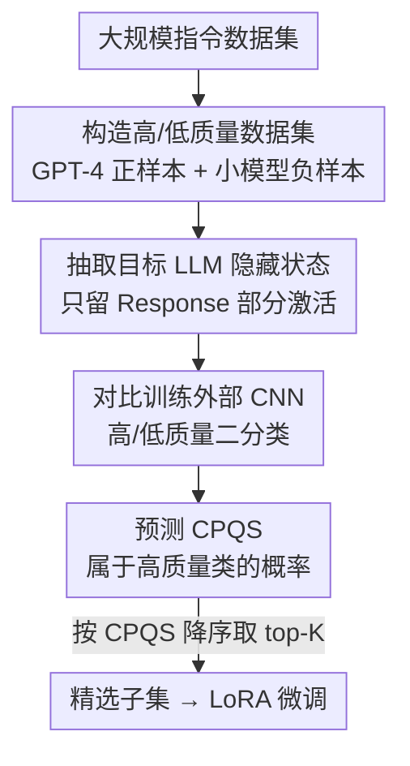

# CPQS-Tuning: A Model Self-Perception-Based Data Filtering Algorithm for Efficient Instruction Fine-Tuning

**会议**: ICLR2026  
**OpenReview**: [https://openreview.net/forum?id=d57KvqmcBA](https://openreview.net/forum?id=d57KvqmcBA)  
**代码**: 待确认  
**领域**: LLM效率 / 指令微调 / 数据筛选  
**关键词**: 数据筛选, 指令微调, 隐藏状态, 对比感知质量分, 高效训练

## 一句话总结
本文提出 CPQS-Tuning：不再用外部评分模型或人工指标来筛指令微调数据，而是直接读取目标 LLM 自己的隐藏状态，用一个小 CNN 把"模型对这条数据的隐式评价"翻译成一个对比感知质量分（CPQS），据此挑出不到 10% 的高质量数据，训练效果反而超过用全量数据。

## 研究背景与动机
**领域现状**：指令微调（instruction fine-tuning）是提升 LLM 能力的关键手段，但训练语料里混着大量低质、冗余样本。LIMA 之类工作已经证明：只用一千条精挑的高质量指令就能把模型调得很好，所以"从大数据集里筛一个小而精的子集"成了高效微调的热门方向。现有主流做法分两类——一类用预定义的奖励模型（如 ALPAGASUS 让 ChatGPT 打分）给每条数据评分后过滤，另一类从质量、覆盖度、必要性等人工设计的多维指标（如 MoDS）来选数据。

**现有痛点**：这些方法的评分标准全都来自"外部"——要么是另一个强模型的偏好，要么是人定的指标，**完全没有用到那个真正要被微调的目标 LLM 自身的信息**。一条数据"好不好"，外部评判员说了算，而不是即将拿它来训练的那个模型说了算。

**核心矛盾**：评判标准与被微调模型的实际需求之间存在错配（mismatch）。外部模型觉得高质量的数据，对目标 LLM 不一定有用；同一份数据在不同模型眼里的价值本就不同。用一套与目标模型无关的尺子去量，自然会削弱微调效果。

**本文目标**：让筛选标准"长在目标模型身上"——找到一种能反映目标 LLM 自己怎么看待一条数据质量的信号，并据此筛数据。

**切入角度**：作者提出一个新视角——**LLM 的隐藏状态（神经元激活）隐式地编码了它对训练数据质量的评价**。为验证这个假设，他们做了个初步实验：用 GPT-4 生成的 Alpaca GPT4 当高质量数据、用小模型（Llama-3.2-1B、Qwen2.5-1.5B）重新生成回答当低质量数据，取 Qwen2.5-7B 最后一层隐藏状态作为嵌入训练一个逻辑回归分类器，5 折交叉验证 AUC 竟然 = 1.00，说明高/低质量数据在隐藏状态空间里**线性可分**。这就证明了隐藏状态确实带着质量信号。

**核心 idea**：用目标 LLM 处理数据时的隐藏状态当特征，训一个外部小模型（CNN）把这种隐式评价读出来，输出对比感知质量分 CPQS，用 CPQS 排序选 top-K，从而让数据筛选标准来自模型自身而非外部评判。

## 方法详解

### 整体框架
CPQS-Tuning 的核心是：**训一个外部 CNN，专门"读"目标 LLM 在处理每条数据时产生的隐藏状态，从中解码出该模型对这条数据质量的隐式判断**。整套流程分四步走，前三步是离线"造分类器"，第四步是在线"用分类器筛数据"：先构造一批带高/低质量标签的指令数据→把它们喂给目标 LLM 抽取隐藏状态→用这些隐藏状态做对比训练得到一个二分类 CNN→预测时用 CNN 输出"该样本属于高质量类"的概率作为 CPQS，对全量数据集排序取 top-K，再拿这个精选子集去做 LoRA 微调。

### 关键设计

**1. 隐藏状态编码质量信号：把筛选标准锚在目标模型自己身上**

这是全文的立论根基，针对"外部评分与目标模型需求错配"的痛点。作者不再问别的模型/指标"这条数据好不好"，而是把数据真正喂给**即将被微调的那个目标 LLM**，取它内部的神经元激活（隐藏状态）作为该模型对这条数据的"隐式打分"。动机层面的证据很硬：在 Qwen2.5-7B 最后一层隐藏状态空间里，高质量与低质量样本线性可分，逻辑回归 5 折 CV 的 AUC 达到 1.00。这意味着模型在前向传播时其实已经"知道"哪条数据是好的，只是这种判断藏在高维激活里没被显式读出来。CPQS-Tuning 做的就是把这层信息挖出来当筛选依据，从根上解决了"评判员不是当事人"的错配问题。

**2. 高/低质量对比数据集构造：用模型能力差制造干净的正负标签**

要训一个能读隐藏状态的分类器，得先有带质量标签的数据，但"质量"难以人工标注。作者用一个巧妙的代理：**模型能力差异 = 质量差异**。正样本直接从 Alpaca GPT4（GPT-4 生成、52K 条 ⟨Instruction, Input, Response⟩ 三元组）随机抽 5000 条，且故意封顶 5000 以抑制过拟合；负样本则取 Alpaca GPT4 里的 ⟨Instruction, Input⟩，分别交给两个小模型 Llama-3.2-1B-Instruct 和 Qwen2.5-1.5B-Instruct 重新生成 Response，各采 5000 条，凑成 10000 条低质量数据。同一道题、强模型答的是正、弱模型答的是负，这样正负样本只在"回答质量"上有系统差异，给 CNN 提供了对比信号干净的训练集。

**3. Response 隐藏状态抽取：只看回答部分，因为质量瓶颈在回答**

拿到这批带标签数据后，把每条的 Instruction+Input 拼成 "user" 输入、Response 当 "assistant" 输入，整条喂进目标 LLM，取**所有层**的隐藏状态，但**只保留 Response 那部分 token 对应的隐藏状态**。理由很直接：指令微调数据的质量高低主要取决于回答写得好不好，而非问题本身，所以模型对"回答"那段的内部反应才是质量信号最浓的地方。保留全部层（而非只取最后一层）也有讲究——后面消融显示用全层比任何单一层段都好，不同任务依赖的层不一样（代码偏后层、数学偏前层），全层组合最稳。

**4. 对比训练 CNN + CPQS 打分选数据：把隐式评价变成可排序的标量**

外部模型选了一个简单 CNN（实验显示它比 MLP 等更简单模型表现更好），同时用 2D 和 1D 卷积去捕捉隐藏状态向量里的空间与序列模式，接自适应最大池化和全连接层做二分类，Adam（lr=0.0001）+ 梯度累积 + 混合精度训练，最小化交叉熵。受对比学习启发，把训练框成"高质量 vs 低质量"的二分类任务，正负样本比例设 1:2（共 15000 条，作者发现这个比例 loss 降得快且已近收敛），让 CNN 学会区分模型对好/坏样本隐藏状态的不同反应。预测阶段，对每条样本走同样的"拼接→喂 LLM→取 Response 隐藏状态→CNN"流程，取 CNN 输出的"属于类别 1（高质量）"的概率作为 CPQS：

$$\text{CPQS}_i = p_i = f(x_i)$$

其中 $f(x_i)$ 是第 $i$ 条样本的 LLM 隐藏状态向量经 CNN 处理后得到的高质量类概率。CPQS 越高，说明该 LLM 越"看重"这条数据、它的训练价值越大。算完全量样本的 CPQS 后降序排序，取前 K 条：

$$D_{\text{selected}} = \text{topK}\big(\{\text{CPQS}_i\}_{i=1}^{N}\big)$$

这个 $D_{\text{selected}}$ 就是最终拿去做 LoRA 微调的精选子集。

## 实验关键数据

实验在两块 RTX 4090 上做，统一用 LLaMA-Factory 的 LoRA 微调（bf16、3 epoch、lr=5e-5、batch=16、α=8、r=16、max_len=2048），推理用 vLLM。对比三个 SOTA 数据选择方法：ALPAGASUS、MoDS、Superfiltering（表中 Self 即本文方法）。

### 主实验

通用域 Alpaca GPT4（Llama2-7B），不同子集规模下的开放基准均分与 AlpacaEval 胜率：

| 数据量 | 算法 | 四基准均分 | AlpacaEval |
|--------|------|-----------|-----------|
| 1k | **Self** | **52.68** | **55.98** |
| 1k | Superfiltering | 52.53 | 55.87 |
| 1k | Alpagasus | 51.92 | 49.65 |
| 5k | **Self** | **54.40** | **59.94** |
| 12k | Alpagasus | 54.20 | 58.80 |
| 52k | Full（全量） | 54.37 | 59.81 |

关键结论：仅用 5k（不到全量 52k 的 10%）就在每个指标上超过 Alpagasus 筛的 12k 子集、并超过全量 52k 模型；1k 模型在 GPT-4o 偏好测试里就已胜过 52k 全量模型。

推理域 Reasoning-DeepSeek（Qwen2.5-7B-Instruct）：

| 数据量 | 模型 | GSM8K | Math500 | HumanEval | GPQA | 均分 |
|--------|------|-------|---------|-----------|------|------|
| — | Base | 76.27 | 73.40 | 64.02 | 30.30 | 61.00 |
| 10k | **Self** | 85.37 | 72.40 | 67.68 | 36.36 | **65.45** |
| 113k | Alpagasus | 84.84 | 66.52 | 64.63 | 28.18 | 61.04 |
| 146k | Full | 85.06 | 70.60 | 57.32 | 30.71 | 60.92 |

10k 精选子集均分 65.45，比全量 146k 高 3.48 分，说明全量数据里存在大量噪声与冗余。

下游数学 GSM8K（500 条精选）：Qwen2.5-7B-Instruct 上本文 81.12，比第二名高 3.61 分，且比全量微调的 69.83 高出 11.29 分（全量在此反而掉点）。下游代码（Magicoder→Llama2-7B-Chat，pass@1）本文平均 14.95，比其他方法平均高约 4.3 分。

### 消融实验

隐藏层选择消融（Qwen2.5-7B-Instruct，对比用不同层段训 CNN）：

| 层段 | GSM8K | HumanEval | HumanEval-Plus |
|------|-------|-----------|----------------|
| Full（全层） | **84.91** | **80.0** | **74.4** |
| Early(9) | 84.23 | 75.0 | 70.1 |
| Middle(9) | 83.85 | 77.4 | 71.3 |
| Last(11) | 83.70 | 79.3 | 73.8 |
| Final(1) | 83.70 | 78.7 | 72.6 |

### 关键发现
- **全层 > 任意单层段**：用全部隐藏层训 CNN 在数学和代码上都最优；不同任务依赖的层不同（GSM8K 数学早层最好、代码后层最好），但任何单一层段都不如全层组合。
- **数据不是越多越好**：推理域 10k 子集超过 50k 和全量 146k，证实全量数据里有噪声和冗余，targeted filtering 反而提质。
- **CNN 优于更简单模型**：作者指出简单 CNN 比 MLP 等表现更好，2D+1D 卷积能同时抓隐藏状态的空间与序列模式。
- **Math500 初期掉点的原因**：归因于最大生成长度只设 8K token，放宽长度限制后性能显著回升——是评测设置而非方法本身的问题。

## 亮点与洞察
- **"让模型自己当数据评判员"这个视角很干净**：以前都在外面找尺子（强模型、人工指标），本文直接读目标模型的隐藏状态，等于让被微调的模型自己投票，从根上避免了评判标准与训练需求的错配。
- **AUC=1.00 的可分性证据是点睛之笔**：用一个极简的逻辑回归+5 折 CV 就证明高/低质量在隐藏状态里线性可分，把"隐藏状态编码质量"从直觉变成了可验证的事实，立论非常稳。
- **用模型能力差制造标签是可复用的 trick**：同一道题强模型答=正、弱模型答=负，零人工标注就得到对比信号干净的正负样本，这个思路可迁移到任何需要"质量标签"但难人工标的场景。
- **CPQS 是 prompt-insensitive 的评估**：不依赖打分 prompt 的设计（ALPAGASUS 那类的痛点），换成读内部激活，评估更稳定也更便宜（一次前向传播 + 一个小 CNN）。

## 局限与展望
- **正负样本构造依赖"强=好、弱=坏"的代理假设**：用小模型重写的回答当低质量数据，可能与真实世界的"低质量"分布不一致（真实低质有标注错误、格式问题、事实错误等多种形态），CNN 学到的可能是"模型规模痕迹"而非纯粹的"质量"。
- **CNN 训练集偏窄**：正样本只采自 Alpaca GPT4 5000 条、封顶以防过拟合，这个分类器对差异很大的领域（如长链推理、专业代码）是否还准，跨域泛化性需打问号——虽然作者在 Tulu3、不同模型规模上做了附录验证。
- **全层隐藏状态成本**：保留所有层的隐藏状态向量在大模型上内存/存储开销不小，论文用 7B 模型 + 两块 4090，更大模型上的可扩展性未充分展开。
- **改进方向**：把负样本来源多样化（注入真实噪声、事实错误样本）、探索目标 LLM 与 CNN 联合/在线更新（边筛边微调形成闭环）、给 CPQS 加一个覆盖度/多样性约束（目前纯按质量分排序 top-K，可能选出一堆同质高分样本）。

## 相关工作与启发
- **vs ALPAGASUS**：它用强模型（ChatGPT）设计打分 prompt 给数据评分后阈值过滤；本文不设计任何 prompt、不调外部强模型，改读目标模型自身隐藏状态，避开了 prompt 敏感性，且筛选标准与被微调模型一致。
- **vs MoDS**：它从质量/覆盖度/必要性三个人工维度依次用奖励模型、聚类、目标模型评估来选数据；本文把"质量判断"整体内化为一个学出来的 CNN，省掉了多阶段人工指标设计，但也因此暂未显式建模覆盖度/多样性。
- **vs Superfiltering**：它用一个小模型按"指令跟随难度"筛数据（weak-to-strong 范式）降低开销；本文同样追求高效，但信号来源不同——Superfiltering 看的是小模型对难度的感知，本文看的是目标大模型对质量的隐式感知，更贴近被微调模型本身。

## 评分
- 新颖性: ⭐⭐⭐⭐⭐ "隐藏状态隐式编码数据质量"这个视角新颖且有强证据（AUC=1.00），把筛选标准内化到目标模型自身。
- 实验充分度: ⭐⭐⭐⭐ 覆盖通用/推理/数学/代码四类任务、三个 7B 模型、三个 SOTA 基线，附录还补了 Tulu3、全参微调、跨规模等，较扎实；负样本构造的代理假设缺更细的鲁棒性分析。
- 写作质量: ⭐⭐⭐⭐ 四步方法叙述清晰、动机有初步实验铺垫，图表完整；部分指标命名（Self/CPQS）需对照才好懂。
- 价值: ⭐⭐⭐⭐ 用不到 10% 数据超过全量训练，思路简单可落地、成本低，对高效指令微调有实用价值。

<!-- RELATED:START -->

## 相关论文

- [\[ICLR 2026\] Difficulty–Diversity Collaborative Filtering for Data-Efficient LLM Fine-Tuning](difficultydiversity_collaborative_filtering_for_data-efficient_llm_fine-tuning.md)
- [\[ICLR 2026\] Neuron-Aware Data Selection in Instruction Tuning for Large Language Models](neuron-aware_data_selection_in_instruction_tuning_for_large_language_models.md)
- [\[ICLR 2026\] Explainable Token-level Noise Filtering for LLM Fine-tuning Datasets](explainable_token-level_noise_filtering_for_llm_fine-tuning_datasets.md)
- [\[ICLR 2026\] Influence-Preserving Proxies for Gradient-Based Data Selection in LLM Fine-Tuning](influence-preserving_proxies_for_gradient-based_data_selection_in_llm_finetuning.md)
- [\[ACL 2026\] Small Data, Big Noise: Adversarial Training for Robust Parameter-Efficient Fine-Tuning](../../ACL2026/llm_efficiency/small_data_big_noise_adversarial_training_for_robust_parameter-efficient_fine-tu.md)

<!-- RELATED:END -->
