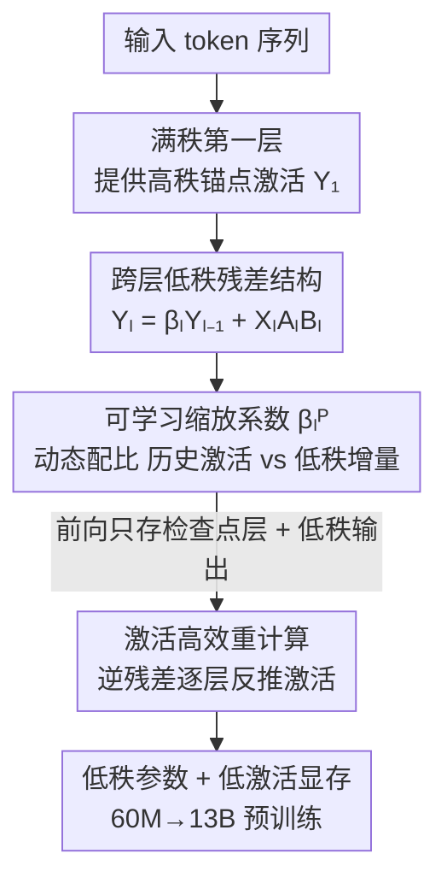

# CR-Net: Scaling Parameter-Efficient Training with Cross-Layer Low-Rank Structure

**会议**: ICLR2026  
**OpenReview**: [https://openreview.net/forum?id=VVruwk9404](https://openreview.net/forum?id=VVruwk9404)  
**代码**: https://github.com/KongBoao/CR-Net  
**领域**: LLM 效率 / 参数高效训练  
**关键词**: 低秩结构, 跨层残差, 高效预训练, 激活重计算, 内存优化

## 一句话总结
CR-Net 发现「相邻层激活之差」具有强低秩结构，于是把每层线性映射改写成「上一层激活 × 可学习缩放 + 低秩增量」，在不损失高秩信息的前提下把参数砍掉一半，再配一套专为这种跨层依赖设计的激活重计算策略，从 60M 一路 scale 到 13B 预训练，效果稳压现有低秩方法、显存与算力还更省。

## 研究背景与动机
**领域现状**：LLM 预训练越来越贵——从 GPT-3 的 2.7B 扩到 175B，显存需求涨 66 倍、算力涨 66 倍。为压成本，低秩结构成了最主流的方向，主要分两派：一派做**低秩参数**（LoRA 及其变体，用两个小矩阵 $A,B$ 替代全秩权重更新），一派做**低秩梯度**（GaLore、Apollo 等把优化器状态投影到低维子空间）。

**现有痛点**：作者把现有低秩方法的毛病归结为三条。其一（L1），低秩参数化会**掉点**——transformer 权重经验上接近满秩，强行低秩会限制模型容量，靠满秩初始化、更新聚合、非线性算子能缓解但又吃掉了省下来的算力。其二（L2），低秩梯度方法虽然效果好些，但梯度压缩本身有**计算瓶颈**——GaLore/FIRA 要做 SVD 找子空间，严重拖慢吞吐；用随机子空间又可能掉点。其三（L3），几乎所有方法都只压参数/梯度/优化器状态，却**忽略了激活显存**——前向缓存的中间激活通常是模型参数量的 1～4 倍，且随 batch size 放大。

**核心矛盾**：低秩省钱与模型能力之间存在 trade-off，根因在于现有方法都直接对**单层激活 $Y_l^P$ 本身**做低秩近似，而单层激活其实接近满秩，低秩近似必然丢信息。

**本文目标**：找到一个真正「天然就低秩」的对象来做近似，从而既省参数又不掉点，同时把激活显存也一起压下来。

**切入角度**：作者观察到一个此前没人报告过的结构性质——**相邻层激活之差 $Y_l^P - \beta_0 Y_{l-1}^P$ 才是真正的低秩**，而非激活本身。直觉上 transformer 残差结构让相邻层激活高度相关，差值里只剩少量「增量信息」。

**核心 idea**：用「上一层激活 + 低秩差值」来重建当前层激活，即 $Y_l^P \approx \beta_0 Y_{l-1}^P + \mathrm{LR}_r(\Delta_{\beta_0} Y_l^P)$，把这个公式直接固化成网络结构（跨层低秩残差），用低秩参数表达高秩激活。

## 方法详解

### 整体框架
CR-Net（Cross-layer low-Rank residual Network）建立在 LLaMA-2 架构上（含 SwiGLU、省略 LayerNorm 与 RoPE 简化叙述）。它的核心改造是：**除第一层外，每一层的每个线性投影 $P\in\{Q,K,V,O,\text{gate},\text{up},\text{down}\}$ 都不再用满秩权重 $W_l^P$，而是用「跨层残差 + 低秩增量」来算输出**。

整条 pipeline 这样转：输入先经过一个**保留满秩权重的第一层**（提供高秩「锚点」激活，避免一上来就被低秩压垮）；从第 2 层起，每个线性层的激活 = 上一层同位置激活乘一个**可学习缩放系数 $\beta_l^P$** + 当前输入过两个小矩阵 $A_l^P B_l^P$ 得到的低秩增量；反向传播时不存大部分激活，而是用一套**定制重计算策略**——只存少量「检查点层」的激活和所有低秩输出，其余激活靠跨层残差的逆运算逐层反推回来。这样参数省一半、激活显存大降，而高秩信息靠满秩首层 + 残差链路一路保住。

### 关键设计

**1. 跨层低秩激活差：把「低秩」用在真正低秩的对象上**

这是全文的地基，针对的是痛点 L1——单层激活近似满秩，直接低秩化必掉点。作者先验证了一个观察：用「历史激活 + 低秩差值」$\tilde Y_{l,\beta_0}^P := \beta_0 Y_{l-1}^P + \mathrm{LR}_r(\Delta_{\beta_0} Y_l^P)$ 去重建 $Y_l^P$，比直接对 $Y_l^P$ 做同秩低秩近似 $\mathrm{LR}_r(Y_l^P)$ 的相对误差小得多。其中 $\mathrm{LR}_r(A):=\arg\min_{\Lambda}\|A-\Lambda\|_F^2,\ \text{s.t.}\ \mathrm{rank}(\Lambda)\le r$ 是 Frobenius 意义下的最优 $r$ 秩近似，相对误差定义为 $\|\tilde Y_l^P - Y_l^P\|_F / \|Y_l^P\|_F$。在 LLaMA-3 8B 与 GPT-2 small 上、固定 $r=0.25h$，各投影位置的相对误差都被压到原来的 0.4～0.97 倍。这说明「相邻层激活之差低秩」是个跨模型、跨训练阶段都成立的真实结构，CR-Net 因此**不是 LoRA 的简单延伸**——它换了被低秩化的对象。

**2. 跨层低秩残差结构：把观察固化进网络权重**

既然 $\Delta_{\beta_0}Y_l^P$ 天然低秩，作者就把满秩权重 $W_l^P\in\mathbb{R}^{h_{in}\times h_{out}}$ 拆成两个低秩可学习矩阵 $A_l^P\in\mathbb{R}^{h_{in}\times r}$、$B_l^P\in\mathbb{R}^{r\times h_{out}}$（$r<\min\{h_{in},h_{out}\}$），从第 2 层起，激活按 $Y_l^P = \beta_0 Y_{l-1}^P + X_l^P A_l^P B_l^P$ 计算。这一步把「低秩近似差值」直接变成了前向计算图：当前激活 = 上一层激活的缩放 + 当前输入的低秩投影。和 LoRA 系反复对激活做低秩近似、不断累积信息损失不同，CR-Net 只对「增量」低秩、把高秩主干信息交给残差链路无损传递，因此同时解决 L1（不掉点）和 L2（无需 SVD，标准优化即可，省算力）。

**3. 可学习缩放系数 $\beta_l^P$ 与满秩首层：稳住低秩训练的高秩信息**

固定的 $\beta_0$ 不够灵活，作者把它升级成**每层每位置可学习的标量 $\beta_l^P$**，并写成 $\mathrm{sign}(\beta_l^P)(|\beta_l^P|+\varepsilon)$ 的形式（$\varepsilon=10^{-6}$ 防止系数恰好为零），完整结构为

$$Y_l^P = \begin{cases} X_l^P W_l^P, & l=1,\\ \mathrm{sign}(\beta_l^P)(|\beta_l^P|+\varepsilon)\,Y_{l-1}^P + X_l^P A_l^P B_l^P, & l=2,\dots,L. \end{cases}$$

$\beta_l^P$ 让模型自适应地在「历史激活」与「低秩增量」之间配比：$\beta_l^P$ 接近 0 时几乎完全靠低秩残差，较大时则把低秩项当作对强传播信号的微调。这让网络能在浅而表达力强的层和深而低秩过渡的层之间平滑插值，全程不超内存/算力预算。配合**第一层保留满秩权重 $W_1^P$** 提供高秩锚点，CR-Net 不靠 QR/SVD 这类硬投影约束，就能避免低秩训练常见的塌缩到低维子空间、数值不稳，训练动态接近全秩方法。消融表 6 反向印证了首层的重要性：350M 上若把首层也低秩化，6.4B token 时 PPL 从 18.95 恶化到 19.68。

**4. 激活高效重计算：针对跨层依赖定制的反传策略**

跨层残差带来一个副作用——某层激活依赖前面所有层（L2 级依赖），如果直接套 vanilla 梯度检查点（GCP），重算时要重跑所有前置层，产生 $O(L^2)$ 开销。作者据此定制重计算：前向只存三样东西——所有层输入 $X_l$、一个**检查点层子集** $A$（取 $|A|=L/8$，且强制 $L\in A$、$1\notin A$）里的线性激活 $Y_l^P$、以及所有层的低秩输出 $X_l^P A_l^P$（这部分存下来省去矩阵重算）。反传时若 $Y_l^P$ 已存就直接用，否则用跨层残差的**逆运算**反推：

$$Y_l^P = \frac{1}{\mathrm{sign}(\beta_{l+1}^P)(|\beta_{l+1}^P|+\varepsilon)}\big(Y_{l+1}^P - X_{l+1}^P A_{l+1}^P B_{l+1}^P\big).$$

存一部分检查点既能逐层无损反推全部激活，又能切断激活恢复过程中的误差累积。最终 CR-Net 比 vanilla GCP 减少 67.4% 总计算开销、比 CoLA-M 再省 8.0%，同时激活显存也更低。

### 损失函数 / 训练策略
训练目标就是标准 LLM 预训练（C4-en 上的语言建模），优化器用标准 Adam，无需任何额外的子空间投影/分解步骤。复杂度上，第一层与全秩相同，其余层参数量为 $(L-1)(11hr+3h_{ff}r)$、显存约为参数量的 4 倍（Adam 三份状态）。当 $r\approx 0.25h$ 时参数约省 50%；由于 LLaMA 中 $h_{ff}\approx 8h/3$，只要 $r<0.5h$，CR-Net 的每步 FLOPs 就低于全秩。

## 实验关键数据

### 主实验
在 C4-en 上预训练 LLaMA-2，规模从 60M 覆盖到 13B。与参数高效方法按「对齐参数量」比（标 ♢），与优化器高效方法按「对齐显存」比（标 †）。验证困惑度（PPL，越低越好）：

| 模型规模 | 指标 | CR-Net | 全秩 Full-rank | CoLA | Apollo |
|----------|------|--------|----------------|------|--------|
| 60M | PPL | **32.76** | 34.06 | 34.04 | 31.55 |
| 130M | PPL | 24.31♢ | 24.36 | 24.48 | 22.94 |
| 350M | PPL | 18.95♢ | 18.80 | 19.40 | 16.85 |
| 1B | PPL | 15.22♢ | 15.56 | 15.52 | 14.20 |
| 1B | 参数(M) | **583** | 1339 | 609 | 1339 |

对齐参数量时，CR-Net 在 1B 上甚至超过全秩训练，同时参数砍 56.5%、每步算力省 63.2%。对齐显存时（†），在 >1B 规模上 PPL 优于 GaLore/RSO/Apollo 等优化器高效方法。

LLaMA-2 7B（配重计算）与 13B：

| 任务 | 步数 | CR-Net | 最优 baseline |
|------|------|--------|---------------|
| 7B | 80K | **13.72** | CoLA-M 13.82 |
| 7B | 65K | **16.01** | CoLA-M 16.21 |
| 13B | 40K | 18.12 | 8-bit Adam 17.85 |

7B 全程压过 CoLA-M 且显存更低；13B 参数省 50%+，PPL 仅退化约 2%。

### 消融实验

| 配置 | 关键指标 | 说明 |
|------|---------|------|
| CR-Net（满秩首层，350M/6.4B） | PPL 18.95 | 完整模型 |
| 首层也低秩化 | PPL 19.68 | 去掉满秩首层，掉点明显 |
| 去掉可学习 $\beta_l^P$ | 收敛变差 | 缩放系数有利收敛（5.2 节） |
| rank 配置 | — | 中间层高秩、两端低秩最好 |

激活内存与重计算复杂度（LLaMA2-7B, $r=512$, batch 16）：CR-Net 重计算显存 23.35 GB（vanilla GCP 的 0.456×）、FLOPs $0.692\times10^{15}$（0.326×），均优于 CoLA-M。

### 关键发现
- **满秩第一层是稳定训练的关键**：去掉后 350M 上 PPL 从 18.95 退化到 19.68，印证「保留高秩锚点」的设计动机。
- **rank 应按层分配**：中间层给高秩、两端层给低秩，效果最好——说明信息密度在层间不均匀。
- **可学习 $\beta_l^P$ 提升收敛**：让模型自适应配比历史激活与低秩增量，比固定系数更稳。
- **规模越大优势越明显**：在 >1B 尤其 7B/13B 上，CR-Net 相对优化器高效方法的领先更突出。

## 亮点与洞察
- **换被低秩化的对象**：别人都对「激活本身」或「梯度」做低秩，CR-Net 发现「相邻层激活之差」才真正低秩——同一把低秩刀，砍在对的地方就既省参数又不掉点。这个「找到真正低秩的量」的思路可迁移到任何想做压缩/近似的场景。
- **把经验观察直接焊进网络结构**：从「差值低秩」的观察，到 $Y_l = \beta Y_{l-1} + XAB$ 的前向公式，再到反传的逆运算重计算，三者是同一个等式的不同侧面，设计高度自洽。
- **跨层残差的可逆性顺手解决激活显存**：因为残差结构可逆，反传时能从后往前逐层反推激活，天然适配重计算——这是结构设计带来的「免费」内存收益。
- **稳定性不靠硬约束**：用满秩首层 + 可学习标量替代 QR/SVD 投影，既稳又省，避免了低秩训练塌缩。

## 局限与展望
- **依赖一个经验观察**：「相邻层激活之差低秩」虽跨模型验证，但缺乏严格理论保证（作者把理论洞察放在附录 D），在非 LLaMA 类架构上是否成立需进一步验证。
- **13B 上略逊全秩/8-bit Adam**：13B/40K 时 PPL 18.12 vs 8-bit Adam 17.85，更大规模下低秩的能力上限可能开始显现。
- **重计算引入额外存储**：相比 vanilla GCP/CoLA-M，CR-Net 的重计算策略要多存低秩输出，是用一点显存换大幅算力——在极端显存受限场景下需权衡。
- **rank 分层配置靠手工**：「中间高秩、两端低秩」是实验观察出来的，缺一个自动确定每层秩的机制。

## 相关工作与启发
- **vs LoRA / ReLoRA**：它们用低秩矩阵替代权重更新、反复对激活做低秩近似，导致信息损失与掉点；CR-Net 只对「跨层激活差」低秩、高秩主干靠残差无损传递，同参数量下 PPL 更优。
- **vs CoLA**：CoLA 给低秩输出加非线性来恢复容量但带来算力开销；CR-Net 去掉非线性、改用跨层残差，FLOPs 与 CoLA 同阶但在更低 $r$ 下表现更好，重计算也比 CoLA-M 省 8%。
- **vs GaLore / Apollo（低秩梯度）**：它们靠 SVD 或随机投影压梯度子空间，SVD 拖吞吐、随机投影掉点；CR-Net 是参数侧低秩、用标准 Adam 无额外投影开销，对齐显存时在 >1B 规模上反超。
- **vs 梯度检查点（GCP）**：vanilla GCP 在 CR-Net 的跨层依赖下会退化成 $O(L^2)$ 重算；本文定制的「检查点子集 + 低秩输出缓存 + 逆残差反推」把开销压回可控。

## 评分
- 新颖性: ⭐⭐⭐⭐⭐ 提出并验证「相邻层激活差低秩」这一未被报告的结构性质，并完整工程化
- 实验充分度: ⭐⭐⭐⭐⭐ 从 60M 到 13B 全规模、含参数/显存/吞吐多维对比与充分消融
- 写作质量: ⭐⭐⭐⭐ 逻辑自洽（观察→结构→重计算一线串通），个别排版/笔误瑕疵
- 价值: ⭐⭐⭐⭐⭐ 给低秩预训练换了被压缩的对象，参数省一半且不掉点，实用价值高

<!-- RELATED:START -->

## 相关论文

- [\[ICLR 2026\] LoRA-S: An Efficient Low Rank Adaptation scheme via Sylvester equation](lora-s_an_efficient_low_rank_adaptation_scheme_via_sylvester_equation.md)
- [\[ICLR 2026\] BoRA: Towards More Expressive Low-Rank Adaptation with Block Diversity](bora_towards_more_expressive_low-rank_adaptation_with_block_diversity.md)
- [\[ICLR 2026\] Reconstructing KV Caches with Cross-Layer Fusion for Enhanced Transformers](reconstructing_kv_caches_with_cross-layer_fusion_for_enhanced_transformers.md)
- [\[ICLR 2026\] Revisiting Parameter Server in LLM Post-Training](revisiting_parameter_server_in_llm_post-training.md)
- [\[ICLR 2026\] BA-LoRA: Bias-Alleviating Low-Rank Adaptation to Mitigate Catastrophic Inheritance in Large Language Models](ba-lora_bias-alleviating_low-rank_adaptation_to_mitigate_catastrophic_inheritanc.md)

<!-- RELATED:END -->
