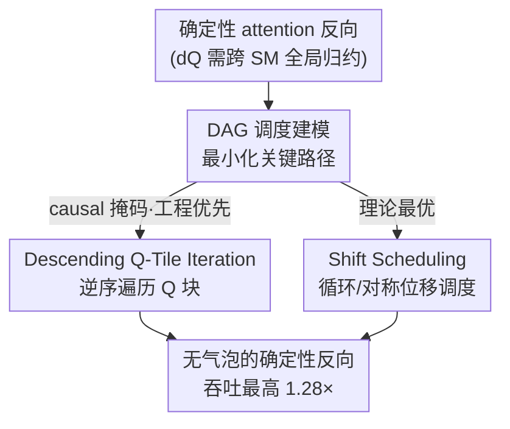

# DASH: Deterministic Attention Scheduling for High-throughput Reproducible LLM Training

**会议**: ICLR2026  
**OpenReview**: [https://openreview.net/forum?id=bMi5ssfPoM](https://openreview.net/forum?id=bMi5ssfPoM)  
**代码**: https://github.com/SJTU-Liquid/deterministic-FA3  
**领域**: LLM效率 / GPU内核优化 / 训练系统 / 可复现性 / Attention  
**关键词**: 确定性训练, FlashAttention, 反向传播调度, 关键路径, 流水线气泡

## 一句话总结
DASH 把确定性 attention 反向传播抽象成一个 DAG 调度问题，目标是最小化关键路径长度，再用「逆序 Q 块遍历」和「位移调度」两套互补策略消除流水线气泡，在 H800 上把确定性 attention 反向算子的吞吐相对 FlashAttention-3 确定性模式提升最高 1.28×，让可复现的 LLM 训练几乎不再为确定性付代价。

## 研究背景与动机
**领域现状**：大规模 LLM 训练动辄上万张 GPU、成本极高，确定性（determinism，每次运行得到逐比特一致的结果）已经成为工业界训练的标准实践——它让人能复现 loss 发散、诊断训练不稳定、干净地评估架构改动。FlashAttention-3 为此提供了一个「确定性模式」。

**现有痛点**：确定性这件事在 attention 反向传播里特别贵。FlashAttention-3 的确定性反向相对非确定性版本最高会掉 37.9% 的吞吐。根因是：attention 反向里 $dQ$ 需要沿 KV 轴做归约，而实现为了暴露并行度把 KV 维切到不同 SM 上，于是每个 query 的 $dQ$ 被分散到多个 SM，必须做一次**跨 SM 的全局归约**。非确定性实现用 `atomicAdd` 并发累加，但浮点加法不满足结合律（$(10^8+10^{-6})-10^8=0$ 而 $10^8-10^8+10^{-6}=10^{-6}$），完成顺序不固定就会带来逐比特差异。要确定性就得用 barrier 把累加强行**串行化成固定顺序**（比如按 CTA 编号），代价就是流水线停顿。

**核心矛盾**：作者指出这 37.9% 的损失**并不是串行化本身的必然代价**，而是「tile 计算调度」和「一个僵硬的、预先定死的累加顺序」之间的冲突。计算调度和累加顺序是紧耦合的，不能各自孤立地优化——朴素调度让归约只能顺序启动，制造瓶颈；而理想调度本可以让不同 SM 在不同 tile 上并行开始归约。

**本文目标**：在保持确定性（固定累加顺序）的前提下，把反向传播的执行调度和累加顺序**联合优化**，把流水线气泡（pipeline bubble，SM 空闲）压到最小。

**切入角度**：既然「调度 + 累加顺序」本质是一个带依赖约束的排程问题，那就把它形式化成图论问题——用关键路径长度作为可优化的、有理论保证的目标。

**核心 idea**：把确定性 attention 反向建模成 DAG，证明「在不延长关键路径的前提下能插入哪些依赖边」的引理，再据此设计出让 SM 完美错位、归约无冲突的调度。

## 方法详解

### 整体框架
DASH 是一套**纯调度层**的优化：它不改变 attention 反向的数学（$dQ/dK/dV$ 该算什么还算什么），也不放松确定性约束（累加顺序依然固定），只是重新安排「哪个 SM 在什么时刻处理哪个 tile、按什么顺序做归约」，从而把串行化引入的流水线气泡挤掉。

整条思路是：先把反向执行**抽象成 DAG**（每个 tile 任务是一条「计算 $C_{i,j}$ → 归约 $R_{i,j}$」的链，跨任务之间插零权依赖边来编码合法的累加顺序），目标是最小化这张图的关键路径长度；同一个 KV tile 的所有操作因为要复用寄存器里的 $dK/dV$ 累加器，必须**连续地**跑在同一个 SM 上（这是核心约束）。在这个模型下，作者给出两套互补策略：一套是工程上简单、对 causal 掩码立竿见影的启发式（逆序 Q 块遍历）；一套是 DAG 模型下**可证最优**的位移调度（全掩码用循环位移、causal 掩码用对称位移 + 两阶段折叠）。最后用一条引理证明这些调度确实不会延长关键路径。

### 关键设计

**1. DAG 调度建模：把确定性反向变成可证明的排程问题**

作者把反向传播形式化为有向无环图：每个 tile 任务建成一条线性路径，由两段边组成——计算阶段（耗时 $c$）和随后的全局归约阶段（耗时 $r$），边权就是各自的执行时间；跨任务之间插入**零权依赖边**来编码合法的累加顺序与数据依赖。这样一来，边权刻画「时长」，拓扑刻画「顺序约束」，优化目标就是最小化关键路径长度 $\text{critical path}$，直接对应端到端延迟。一条硬约束来自 GPU 架构：为了让 $dK/dV$ 在最快的寄存器里累加，某个 KV tile 的所有边必须形成一条**不可打断的连续链**跑在单个 SM 上。这个建模的价值在于，它把「调度好不好」从经验调参变成了可推导的图论命题——后面所有策略的最优性都靠它来论证。在这个模型下，作者分析了 FlashAttention-3 的基线调度：全掩码下只有启动期有气泡，稳态是 $T_{\text{full}}\approx m\cdot n\cdot(c+r)+(n-1)\cdot r$；而 causal 掩码因为依赖关系会在**每个 attention head 内部**都插一个大气泡，关键路径变成 $T_{\text{head}}=n(c+r)+(n-1)r$ 且对每个 head 重复，这才是 causal 慢的根。

**2. Descending Q-Tile Iteration：逆序遍历 Q 块，提前解依赖、跨 head 接力填满流水线**

这是针对 causal 掩码的「简单但有效」的启发式：把 query（Q）块的处理顺序**反过来**遍历。因为 causal 下不同 Q 块的任务长度不均（早 KV 块参与更多交互），正序遍历会让长任务卡在前面、短任务的 SM 早早空出来又没活干。逆序之后**短任务先做完**，对应 SM 更早释放，于是**下一个 attention head 可以立刻接管这些空出来的 SM**，把 head 之间的空隙几乎填平，形成紧耦合的流水线。在偶数个 $m$ 个 head 上，总执行时间降到 $T_{\text{reversed}}\approx \frac{m(n+1)(c+r)}{2}+(n-1)\cdot r$，相比基线的每 head 一个大气泡是显著收缩。它的好处是实现代价极低（就是把循环方向反过来），不增加寄存器压力，因此在大 head 维度（headdim=128）这种资源吃紧的场景反而比理论最优解更实用。

**3. Shift Scheduling：循环/对称位移让归约无冲突，逼近 DAG 理论下界**

这是 DAG 模型下**可证最优**的调度，核心靠一条引理：在一组并行同构链上插零权依赖边，当且仅当每条新边 $(u,v)$ 满足 $\text{depth}(u)\le \text{depth}(v)$ 时，关键路径长度不变。翻译成物理含义就是——同一个 $dQ_j$ 的两个贡献 tile **不能在不同 SM 上同时执行**，否则归约会冲突、被迫串行而插入一条 $\text{depth}(u)>\text{depth}(v)$ 的逆向边，违反引理、拉长关键路径。于是目标变成两条：负载均衡 + 无冲突归约顺序。**全掩码**下每个 KV tile 工作量一致，作者用循环位移：$SM_i$ 按 $(i, i+1, \dots, n-1, 0, \dots, i-1)$ 的顺序处理 KV 块，这种错位天然给每个 $dQ$ 块制造了无冲突的串行归约顺序，既均衡又满足引理，因此理论最优，总时间压到 $T_{\text{full opt}}=m\cdot n\cdot(c+r)$（去掉了 $(n-1)r$ 的启动开销）。**causal 掩码**工作量随序列线性递减、严重不均，作者用 **Symmetric Shift Scheduling（对称位移）**：让 SM 成对处理 KV 块 $i$ 和 $n-1-i$（最长配最短、次长配次短），把每个 SM 的链长拉平；再用**两阶段调度**——Phase 1 对稠密的左下矩形做循环位移填满流水线，Phase 2 用「工作量折叠」把右下三角在逻辑上映射到左上被掩码的空槽里，拼成一个概念上的正方形而无需任何数据搬移，等价于在这个方块上做对角线初始化的位移调度。这样既保持均衡、又保证每个 KV 块连续计算、还满足 Lemma 1 的深度单调累加，最终把 causal 的气泡也清零，$T_{\text{causal opt}}=\frac{m(n+1)(c+r)}{2}$。

### 损失函数 / 训练策略
本文不涉及训练目标或损失改动，是纯 GPU 内核调度优化；所有内核都在 FlashAttention-3 实现基础上扩展，用 Triton 3.4 / CUDA 12.6，BF16 随机输入，在 NVIDIA H800 上评测。

## 实验关键数据

### 主实验
固定总 token 数 16,384、隐藏维 2,048，序列长度从 512 扫到 16,384，head 维取 64/128，测反向算子吞吐（TFLOPS）。

| 场景 | 方法 | 相对 FA3 确定性基线 | 备注 |
|------|------|------|------|
| 反向算子（综合） | DASH（两策略） | **最高 1.28×** | 显著缩小与非确定性的差距 |
| Full mask | Shift Scheduling | 多数序列长度优于基线 | seqlen=16384 时因 L2 远端访问反而略降 |
| Causal mask, headdim=64 | Symmetric Shift | 最高 | 负载均衡收益最大 |
| Causal mask, headdim=128 | Descending | 反超 Symmetric Shift | 寄存器压力下对称位移会 spill |

### 端到端与数值验证

| 配置 | 指标 | 结果 |
|------|------|------|
| Causal 模型（LLaMA3-8B/Qwen2.5-7B/Mistral-8×7B，8k/16k/32k） | 整个 transformer block 加速 | 2%–10% |
| Full mask 模型（SAM-ViT-Huge / SD3.5 / LLaDA-1b，4k, bs=16） | 加速 | ≈4% |
| 全体平均 | 端到端加速 | ≈5%（与万卡内部训练经验吻合） |
| 梯度逐比特一致性（Table 1） | 非确定性 run-to-run 偏差 | Full $2.4\times10^{-4}$ / Causal $4.9\times10^{-4}$；确定性恒为 **0** |

### 关键发现
- **理论最优 ≠ 实践最优**，这是全文最重要的洞察：Symmetric Shift 在 DAG 模型里可证最优，但在 headdim=128 时其更复杂的折叠状态多用约 10 个寄存器，会把每线程寄存器数顶过硬件上限触发 register spilling，溢出到慢速 local memory 反而拖慢，被更简单的 Descending 反超。
- **硬件现实会推翻算法优势**：Shift Scheduling 在 seqlen=16384 退化，是因为模型假设依赖边零开销，但实际跨 SM 同步走 L2 cache，本地段约 200 cycle、远端段超 500 cycle；极端并行（128 SM）下大量同步信号走远端 L2，复杂依赖图对此更敏感。
- 因此 causal 的两套策略是**互补**的：Symmetric Shift 理论最优，Descending 是当前 GPU 大 head 维下的实用选择；作者预期 Blackwell（更大寄存器/TMEM）上对称位移的优势能完全兑现。

## 亮点与洞察
- **把工程性能问题翻译成可证明的图论问题**：用 DAG + 关键路径 + 一条「深度单调」引理，把「调度怎么排才不拖慢」从拍脑袋变成有最优性证明，这种「先建模再求解」的范式很值得迁移到其他确定性算子（GEMM split-K、归一化等同样涉及归约）。
- **一句话级别的工程 trick 也能很值钱**：Descending Q-Tile Iteration 本质只是「把 Q 循环反过来」，几乎零实现成本，却靠「短任务先释放 SM → 下个 head 接力」把 causal 气泡填平，是典型的小改动大收益。
- **对称配对 + 两阶段折叠**很巧：把 causal 的三角形不均衡工作量在逻辑上折叠成正方形、且不搬数据，既均衡又满足累加顺序约束，是把负载均衡和确定性两个看似矛盾的目标同时满足的关键。
- **诚实地承认理论与硬件的鸿沟**：论文没有掩盖 Shift Scheduling 在长序列/大 head 维下的退化，反而把 register spilling、远端 L2 延迟讲透，这种「最优解为什么在真硬件上输了」的分析比单纯报 SOTA 更有参考价值。

## 局限与展望
- **DAG 模型是简化抽象**：作者明确说模型假设依赖边零开销、不预测真实执行时间，与真实 GPU 行为有显著差距——seqlen=16384 的退化正是这个简化的反噬。
- **最优策略受当代硬件约束**：Symmetric Shift 的理论优势在 H800 上因寄存器压力无法完全兑现，需要等更大片上资源（Blackwell/TMEM/更大寄存器文件）或对寄存器分配约束更松的内核设计。
- **收益集中在反向算子**：算子级最高 1.28×，但端到端只有约 5%，因为 attention 反向只占整个 transformer block 的一部分；对 FFN 占比更大的模型增益会被摊薄。
- **适用面**：方法假设 KV tile 数等于 SM 数（不等时靠概念性细化/聚合 head 来对齐），且只针对 attention 反向的全局归约；其它非确定性来源（如必须用 split-K 的小 batch GEMM）不在覆盖范围。
- 可改进方向：把 L2 远近段延迟、寄存器预算等硬件约束直接建进调度的代价模型里，做「硬件感知」的关键路径优化，而非事后解释退化。

## 相关工作与启发
- **vs FlashAttention-3 确定性模式**: FA3 用 barrier 强制按 CTA 编号串行累加来保证确定性，但调度和累加顺序僵硬耦合、气泡严重；DASH 在同样确定性约束下联合优化二者，把气泡消掉，是直接超越对象（基线）。
- **vs Triton tutorial 确定性实现 / FlashAttention-2**: 它们要么把 $dK/dV$ 和 $dQ$ 拆成不同 pass（多读一次 K/V），要么物化 per-tile $dQ$ 部分和再合并（多占内存 + 额外归约 kernel）——都是用带宽/内存换确定性；DASH 不额外读写，而是协同优化执行与累加顺序。
- **vs 分布式循环调度（RingAttention / StripedAttention / LoongTrain）**: 这些方法用 ring/phase-shift 在**设备间**重叠通信与计算；DASH 把位移策略用到**单 GPU 内**，目的是协同确定性累加和负载均衡，应用层级不同但灵感同源。
- **vs 推理确定性（batch-invariant kernels）**: He & Lab (2025) 把推理不可复现归因于「批不变性」缺失、设计批不变内核；DASH 针对的是训练时 run-to-run 确定性（batch 配置已固定），目标不同。

## 评分
- 新颖性: ⭐⭐⭐⭐⭐ 首个把确定性 attention 反向调度形式化为 DAG 并给出最优性证明
- 实验充分度: ⭐⭐⭐⭐ 算子级 + 端到端 + 数值验证齐全，且诚实分析了退化，但只在 H800 单一硬件上评测
- 写作质量: ⭐⭐⭐⭐⭐ 问题建模、引理、调度图、退化分析逻辑链清晰，图解到位
- 价值: ⭐⭐⭐⭐⭐ 万卡可复现训练的确定性几乎不再付代价，已开源、工业相关性高

<!-- RELATED:START -->

## 相关论文

- [\[NeurIPS 2025\] Efficient Training-Free Online Routing for High-Volume Multi-LLM Serving](../../NeurIPS2025/llm_efficiency/efficient_training-free_online_routing_for_high-volume_multi-llm_serving.md)
- [\[ICLR 2026\] Revisiting Parameter Server in LLM Post-Training](revisiting_parameter_server_in_llm_post-training.md)
- [\[ICLR 2026\] A Two-Phase Deep Learning Framework for Adaptive Time-Stepping in High-Speed Flow Modeling](a_two-phase_deep_learning_framework_for_adaptive_time-stepping_in_high-speed_flo.md)
- [\[ICLR 2026\] RACE Attention: A Strictly Linear-Time Attention Layer for Training on Outrageously Large Contexts](race_attention_a_strictly_linear-time_attention_layer_for_training_on_outrageous.md)
- [\[ICLR 2026\] Dynamic-dLLM: Dynamic Cache-Budget and Adaptive Parallel Decoding for Training-Free Acceleration of Diffusion LLM](dynamic-dllm_dynamic_cache-budget_and_adaptive_parallel_decoding_for_training-fr.md)

<!-- RELATED:END -->
