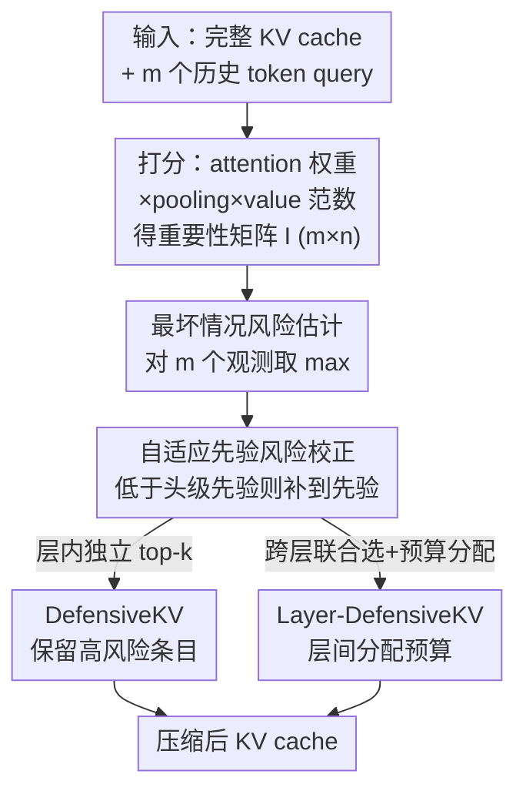

# DefensiveKV: Taming the Fragility of KV Cache Eviction in LLM Inference

**会议**: ICLR2026  
**OpenReview**: [https://openreview.net/forum?id=nJgS06sX3O](https://openreview.net/forum?id=nJgS06sX3O)  
**代码**: https://github.com/FFY0/DefensiveKV  
**领域**: LLM效率 / KV Cache 压缩  
**关键词**: KV Cache 驱逐, 最坏情况风险, 防御性聚合, 长上下文推理, 层间预算分配

## 一句话总结
针对 KV cache 驱逐普遍依赖的"重要性稳定假设"其实很脆弱、而主流的均值聚合在极端时刻会跟着崩这一问题，本文提出线性时间的"防御性聚合"（用历史观测的最大值估计最坏风险 + 自适应先验校正），据此构建 DefensiveKV 与跨层版 Layer-DefensiveKV，在 18 个数据集、20% cache 预算下把生成质量损失相比最强 baseline 缩小 2.3× 与 4.3×。

## 研究背景与动机
**领域现状**：Transformer LLM 自回归生成时要维护 KV cache 缓存历史 token 的 Key/Value，但 cache 随序列长度线性增长（70B 模型、batch 8、128k 上下文可吃掉约 330GB 显存），成为部署时的存储和 I/O 瓶颈。当前主流的应对是"选择性 cache 驱逐"，它建立在一个底层假设——**重要性稳定假设**：存在一个固定的 KV 条目子集，在整个生成过程中始终重要，保留它就能用更小显存近似完整 cache。具体做法是 **scoring-aggregation 两步框架**：scoring 步用多个历史 token 的 query 对每个 KV 条目打出多个重要性分数；aggregation 步把这些分数聚合成一个标量来排序、决定驱逐谁。

**现有痛点**：过去几年的工作几乎只在 scoring 步上卷——从朴素 attention 权重（H2O、Scissorhands），到 SnapKV 的 pooling，再到 CriticalKV 用投影 value 状态的范数做更有原则的打分。而 **aggregation 步几乎没人动**，大家默认用最简单的均值聚合 $S_i = \frac{1}{m}\sum_{j=1}^m I_{j,i}$，理由是"既然假设重要性稳定，那对多次观测取平均能降噪、抓住一致重要的条目"。

**核心矛盾**：作者指出稳定假设**本质上是脆弱的**。他们在 Llama-3.1-8B 的摘要任务上实测：基于单个历史 token 观测做 50% 驱逐时，大部分生成步保留子集能覆盖完整 cache 重要性的 0.8 以上、平均高达 0.92，看起来很稳；但在某些区间（如生成第 150–320 步）假设会突然失效，保留重要性骤降到 0.34，且"保留的 50% cache 覆盖不到一半重要性"的离群点频繁出现（一次试验就有 89 次）。问题在于：均值聚合只优化"期望情况"，它对这种罕见但极端的崩塌完全无防备——当大多数单 token 观测同时失败时，取平均不过是把一堆失败值"和稀泥"成一个同样糟糕的结果，离群点照样有 65 次。

**切入角度**：作者借了一个金融领域的经典教训——只优化平均收益（期望）的策略是有根本缺陷的，因为它忽略了罕见但致命的最坏情况风险（worst-case risk）。把这个视角搬到 cache 驱逐：与其继续打磨"更准的打分指标"，不如换掉聚合环节，做**最坏情况风险管理**。

**核心 idea**：放弃"优化平均情况"，改用"控制最坏情况"——提出**防御性聚合（defensive aggregation）**，一个只需两次线性时间操作、计算量与均值聚合相当、却能在假设崩塌时守住重要条目的聚合策略，并据此构建 DefensiveKV 系列驱逐方法。

## 方法详解

### 整体框架
DefensiveKV 不发明新的打分指标，也不改驱逐的整体流水线，它**只替换 scoring-aggregation 框架里的"聚合"这一步**。一次驱逐的输入是完整 KV cache $(K, V)$ 与最近 $m$ 个历史 token 的 query；流程是：先保留最近若干历史 token 的 KV，再用这些 query 对每个 cache 条目算出重要性矩阵 $I \in \mathbb{R}^{m\times n}$（沿用 attention 权重 + SnapKV 的 pooling + CriticalKV 的投影 value 范数缩放），然后把过去大家用的"对 $m$ 个观测取均值"换成**防御性聚合**——先用最大值估计每个条目的最坏情况风险，再做一次自适应先验校正得到风险分 $R \in \mathbb{R}^n$，最后保留 top-risk 的条目。这个替换在层内独立选 top-k 时得到 **DefensiveKV**；若改成跨层联合选 + 层间预算分配则得到 **Layer-DefensiveKV**。整条流水线无需训练、推理时即插即用。

### 关键设计

**1. 最坏情况风险估计：用 max 代替 mean，把"会不会崩"也算进来**

这一步直击均值聚合"对极端值无感"的痛点。从风险控制视角看，驱逐一个 KV 条目的代价，等于它在未来某时刻本可拥有的重要性分数；因此条目 $i$ 的真正最坏风险是它在整个未来生成过程中能达到的峰值重要性 $R^*_i = \max_{t\in L} I_{t,i}$。但未来不可知，作者用已观测的历史 token 上的最大值来近似它：

$$\tilde{R}_i = \max_{1\le j\le m} I_{j,i}, \quad \forall i = 1,\dots,n$$

和均值聚合相比，差别只是把 $\frac{1}{m}\sum$ 换成 $\max$，计算复杂度仍是 $O(n)$、和均值一样快，却把语义从"平均有多重要"换成"最坏时能有多重要"。直觉上，一个条目哪怕只在少数观测里飙高、其余时刻都低，均值会把它判为不重要而错误驱逐，等它未来再次关键时就造成重要性大幅损失；而取最大值会记住这次"飙高"，从而对这种间歇性关键的条目留有防备。（GQA 下，一个条目的最坏风险取其 KV 组内所有共享 head 上历史 token 观测的最大值。）

**2. 自适应先验风险校正：用 Laplace 平滑式补偿弥补"观测窗口太短"**

光取 max 还不够稳：为控制开销，驱逐方法通常只用很短的历史观测窗口（如 32 个 token，因为 FlashAttention 下显式存全部 attention 权重在 32k 上下文要约 64GB），窗口太短会漏掉那些罕见但要命的风险，导致 $\tilde{R}_i$ 仍偏低估。作者借鉴贝叶斯估计里的 Laplace 平滑，引入一个 head 级的先验风险——该 head 内所有条目最坏风险的均值 $\bar{R} = \frac{1}{n}\sum_{i=1}^n \tilde{R}_i$，并对每个条目做下界校正：

$$R_i = \max\!\left(\tilde{R}_i,\ \bar{R}\right)$$

含义是：如果某条目的观测风险低于该 head 的整体先验，就认为它是"观测不足"而非"真的不重要"，把它的风险抬到先验水平。这样设计是**自适应**的——整体风险更高的 head 会得到更大的先验、更不依赖有限的历史观测，整体风险低的 head 则先验小、几乎不干预。两步合起来（Algorithm 1）就是全部的防御性聚合：仅 $\max$ 与"取先验下界"两次线性操作。实测在摘要任务上把最坏保留重要性从均值聚合的 0.33 抬到 0.61，并把 65 个离群点清零；在六类任务（NrtvQA / HotpotQA / GovReport / TREC / PCount / Lcc）上最坏值一致优于均值聚合（如 GovReport 0.28→0.52）。

**3. DefensiveKV：把防御性聚合无痛嵌入现有驱逐流程**

这是把上面的聚合策略落地成可用方法的最小改动版本。它完全沿用传统 cache 驱逐流程——保留最近历史 token 的 KV、用其 query 算重要性、用 attention 权重起步并叠加 SnapKV 的 pooling 与 CriticalKV 的投影 value 范数缩放（$R_i \leftarrow R_i \times \text{norm}(v_i W_O)$）——**唯一的改动就是把第 6 行的均值聚合换成防御性聚合**，然后在每层内独立选风险 top-k 的条目保留。改动极小却把生成质量损失直接砍掉 2× 以上，证明问题确实出在被忽视的聚合环节，而非打分指标不够好。作者特意把 DefensiveKV 建在当前 SOTA 指标 CriticalKV 之上，但强调防御性聚合与打分指标完全正交、可叠加到其它驱逐方法上。

**4. Layer-DefensiveKV：跨层联合选择，把预算挪给风险更高的层**

DefensiveKV 在每层内独立分配固定预算，忽略了不同层风险高低不同。Layer-DefensiveKV 引入层间预算分配做增强：一是把投影 value 范数做**层间归一化** $R_i \leftarrow R_i / \sum_i \text{norm}(v_i W_O)$，消除范数在不同层间方差过大的问题，让跨层比较有可比性；二是**跨所有层联合**选风险最高的条目（而非每层各选各的），从而把更多 cache 预算自动倾斜给"高风险条目更多"的层。这层增强让质量损失相比基线进一步收窄到 4× 以上的缩减。

## 实验关键数据

### 主实验
评测三个开源 LLM（Llama-3.1-8B-Instruct、Mistral-7B-Instruct-v0.3、Qwen2.5-32B-Instruct），在 LongBench（16 数据集 / 六大任务域）+ Needle-in-a-Haystack 共 18 个数据集上，历史窗口 32、FlashAttention-2 加速。下表为 20% cache 预算下的生成质量损失（越小越好），对照六个 baseline：

| 模型（20% cache） | StreamingLLM | SnapKV | AdaKV | CAKE | CriticalKV(最强baseline) | DefensiveKV | Layer-DefensiveKV |
|---|---|---|---|---|---|---|---|
| Llama-3.1-8B | -40.7% | -20.1% | -16.8% | -16.2% | -9.6% | **-4.6%** | **-2.1%** |
| Mistral-7B | -47.6% | -27.8% | -25.4% | -27.3% | -13.4% | **-4.4%** | **-1.4%** |
| Qwen2.5-32B | -37.8% | -24.6% | -22.9% | -27.9% | -8.6% | **-2.7%** | **-1.7%** |

汇总到 LongBench 16 数据集平均：20% 预算下 CriticalKV 损失 11.1%，DefensiveKV 降到 4.8%、Layer-DefensiveKV 降到 2.6%，分别是 2.3× 与 4.3× 的损失缩减；40% 预算下 DefensiveKV 已基本无损（部分任务甚至 +0.2% 略升），优于需离线训练的 DuoAttention。

### 消融 / 分析实验

| 配置 | 效果 | 说明 |
|---|---|---|
| 均值聚合（baseline） | 最坏保留重要性 0.33，离群点 65 | 现有标准做法 |
| 仅最坏情况风险估计（max） | 较 mean 显著改善 | 把语义从期望换成最坏 |
| + 自适应先验校正（完整防御聚合） | 最坏值 0.61，离群点 0 | 两步合起来清零离群点 |
| DefensiveKV → Layer-DefensiveKV | 损失再降约一半（2× → 4× 缩减） | 跨层预算分配带来的增量 |

### 关键发现
- **瓶颈在聚合而非打分**：仅把均值聚合替换为防御性聚合（DefensiveKV，改动只有一行）就带来 2× 以上的损失缩减，说明社区长期忽视的 aggregation 步才是被低估的优化空间。
- **稳定假设的脆弱是"间歇性"的**：平均覆盖率高达 0.92 掩盖了局部骤降到 0.34 的崩塌，正是这些罕见极端时刻拖垮均值聚合——这解释了为什么只看平均指标的方法在小预算下集体失效。
- **越极端越显优势**：cache 预算从 40% 降到 20% 时，baseline 普遍急剧恶化，而 DefensiveKV 系列退化平缓，最坏情况管理在高压缩比下收益最大。

## 亮点与洞察
- **把金融"最坏情况风险管理"迁到 cache 驱逐**：用一句"别只优化期望、要控制尾部风险"的金融直觉，精准点出均值聚合的盲区，视角新颖且解释力强。
- **极简却有效**：核心方法只是 $\max$ + 取先验下界两次 $O(n)$ 操作，与均值聚合同复杂度、无需训练、可即插即用，工程落地成本极低。
- **正交可叠加**：防御性聚合与打分指标（SnapKV/CriticalKV）、预算分配（AdaKV/PyramidKV/CAKE）乃至量化都正交，是一个可以普遍替换进现有驱逐方法的通用模块——这种"开辟新维度"的贡献比在旧维度上刷点更有价值。

## 局限与展望
- **最坏风险靠历史窗口近似**：$\tilde{R}_i$ 是用有限历史观测的 max 去估计未知未来峰值，先验校正只是缓解而非根治；窗口外真正罕见的风险仍可能被漏掉。
- **先验校正较粗**：自适应先验只用 head 级均值做下界，是个相对朴素的 Laplace 式平滑，是否有更精细、随生成动态更新的风险先验值得探索。
- **评测集中在 LongBench 类任务**：主要在长上下文理解类基准上验证，更复杂的多轮对话、agent 长程推理等场景下最坏风险的形态可能不同，泛化性有待进一步检验。

## 相关工作与启发
- **vs CriticalKV / SnapKV / H2O（scoring-aggregation 框架）**：它们都在打磨 scoring 步（更准的重要性指标），默认沿用均值聚合；本文反其道，指出 aggregation 步才是被忽视的瓶颈，并证明换聚合比换指标收益更大、二者还能叠加。
- **vs StreamingLLM / LaCache（固定模式框架）**：固定规则（只留最近 / 阶梯结构）开销低、适合每步都压缩的场景，但压缩质量差（StreamingLLM 在 20% cache 下损失超 40%）；DefensiveKV 属于质量导向的 scoring-aggregation 路线，面向不那么频繁的压缩场景换取高质量。
- **vs AdaKV / PyramidKV / CAKE（预算分配）**：这些专注层内/层间预算分配，与本文正交；Layer-DefensiveKV 借用层间分配作为增强，证明防御性聚合能与预算分配策略组合使用。

## 评分
- 新颖性: ⭐⭐⭐⭐⭐ 首次系统揭示稳定假设的脆弱与均值聚合的脆弱，用最坏情况风险管理开辟与打分指标正交的新维度
- 实验充分度: ⭐⭐⭐⭐ 三模型、18 数据集、多预算、含与训练型方法对比，消融清晰；场景偏长上下文理解类
- 写作质量: ⭐⭐⭐⭐⭐ 用金融类比把动机讲得透彻，图表（脆弱性可视化）有力，方法叙述简洁
- 价值: ⭐⭐⭐⭐⭐ 改动极小、无需训练、可即插即用且正交可叠加，对长上下文推理部署有直接实用价值

<!-- RELATED:START -->

## 相关论文

- [\[ICLR 2026\] Cache What Lasts: Token Retention for Memory-Bounded KV Cache in LLMs](cache_what_lasts_token_retention_for_memory-bounded_kv_cache_in_llms.md)
- [\[AAAI 2026\] Judge Q: Trainable Queries for Optimized Information Retention in KV Cache Eviction](../../AAAI2026/llm_efficiency/judge_q_trainable_queries_for_optimized_information_retention_in_kv_cache_evicti.md)
- [\[ICLR 2026\] ReST-KV: Robust KV Cache Eviction with Layer-wise Output Reconstruction and Spatial-Temporal Smoothing](rest-kv_robust_kv_cache_eviction_with_layer-wise_output_reconstruction_and_spati.md)
- [\[ICML 2026\] OBCache: Optimal Brain KV Cache Pruning for Efficient Long-Context LLM Inference](../../ICML2026/llm_efficiency/obcache_optimal_brain_kv_cache_pruning_for_efficient_long-context_llm_inference.md)
- [\[ICML 2026\] CriticalKV: Optimizing KV Cache Eviction from an Output Perturbation Perspective](../../ICML2026/llm_efficiency/criticalkv_optimizing_kv_cache_eviction_from_an_output_perturbation_perspective.md)

<!-- RELATED:END -->
