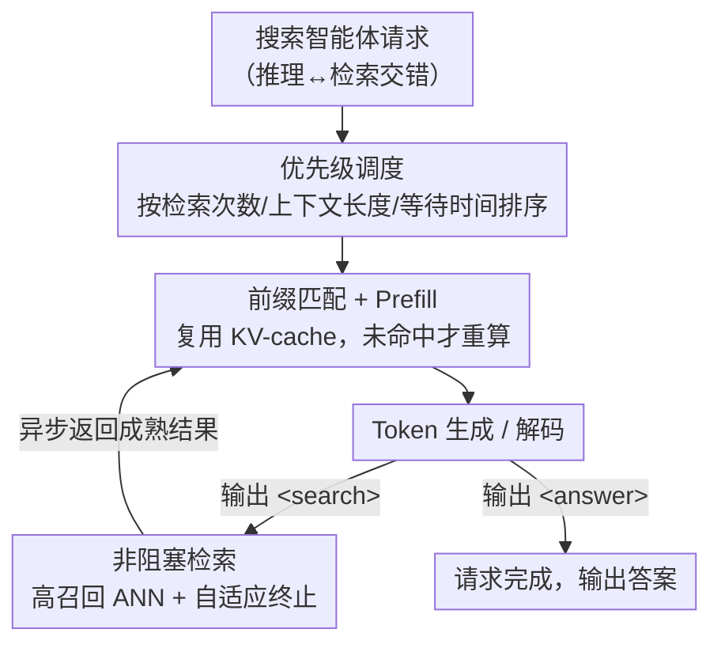

# Demystifying and Enhancing the Efficiency of Large Language Model Based Search Agents

**会议**: ICLR2026  
**OpenReview**: [https://openreview.net/forum?id=BtWBi17eVi](https://openreview.net/forum?id=BtWBi17eVi)  
**代码**: https://github.com/tiannuo-yang/SearchAgent-X  
**领域**: LLM效率 / 推理系统 / 检索增强  
**关键词**: 搜索智能体, 推理系统, KV-cache, 近似最近邻检索, 优先级调度

## 一句话总结
本文先系统分析了 LLM 搜索智能体（边推理边检索）为什么慢——既不是检索越准越好（高召回开销大、低召回逼模型多检索几轮），又对检索延迟极度敏感（FCFS 调度和检索引发的停顿会反复把长请求的 KV-cache 挤掉重算）——再提出推理系统 SearchAgent-X，用高召回近似检索 + 优先级调度 + 非阻塞检索三招，把吞吐做到最高 3.4×、延迟降到 0.2–0.6×，且生成质量与精确检索持平。

## 研究背景与动机
**领域现状**：传统 RAG 是"先检索后生成"的固定流水线；新一代"搜索智能体"（RAG 2.0，如 Search-R1、ReCall）借助 LLM 的推理能力，把推理步骤和检索调用动态交错——模型在生成过程中自己决定何时检索、检索什么，遇到 `<search>` 标签就暂停解码、发起查询、把召回文档拼回序列再继续推理。这显著提升了答案质量，但代价是效率。

**现有痛点**：交错式范式带来两个被忽视的效率瓶颈。其一，检索精度和端到端效率不是单调关系；其二，系统对检索延迟异常敏感——哪怕检索只慢一点点，端到端延迟也会被成倍放大。现有 vLLM 等推理框架里的序列拼接、前缀缓存等优化，都不是为"多步推理紧耦合动态检索"这种独特负载设计的。

**核心矛盾**：作者把效率退化拆成两条根因。第一条是 **检索精度的非单调性**：召回太低，模型拿到的上下文不够好，只能多发几次检索、把推理链拉长来补偿（实测 ANN 搜索范围太小时平均 6.5 次检索/请求，吞吐掉到 2.1）；召回太高（如精确检索 ENN），检索本身开销又过大。第二条是 **检索延迟的放大效应**：朴素 RAG 里检索时间相对整请求可忽略，但搜索智能体里一次 token 生成和一次检索是同量级，检索平均延迟从 0.6s 涨到 4.4s，端到端延迟竟被放大 83×，同时前缀 KV-cache 命中率从 30%+ 跌到 21% 以下，逼出大量昂贵的 KV 重算。

**根因再细分**：延迟放大又来自两点。**① 调度不当**：FCFS 不感知请求的"重用价值"——长请求 #a（检索过 6 次、前缀很长）和短请求 #b（刚检索 1 次），若 #a 检索完成稍晚一点，FCFS 会先服务 #b，#b 占用 KV-cache 空间把 #a 的前缀挤掉，#a 恢复时缓存未命中只能从头重算（实测受影响请求 55.9% 的 token 被无谓重算，单请求计算时间增加 108%+）。**② 检索引发停顿**：检索与生成异步执行存在时序错位，长请求若错过当前生成批次的截止点就得等下一批，等待期间又被短请求挤占缓存（实测 25%+ 的序列检索完成后会经历这种停顿）。

**本文目标 / 核心 idea**：与其在精度极端值上硬拼，不如建在 **高召回近似检索** 之上，再针对两条根因各出一招——**优先级调度** 提升 KV-cache 重用、**非阻塞检索** 消除停顿，做成一个易部署的推理系统 SearchAgent-X，在不牺牲生成质量的前提下把端到端效率拉满。

## 方法详解

### 整体框架
SearchAgent-X 是一个工作在 token 生成粒度上的紧耦合推理系统。每个 LLM 输出步会检查特殊标签：遇到 `<search>` 触发 ANN 检索器去查预建的图索引，遇到 `<answer>` 表示请求完成。系统先用 **优先级调度器** 根据实时指标（检索次数、上下文长度、等待时间）对并发请求排序，让"前缀更长、更能复用缓存"的请求先跑；prefill 阶段通过前缀匹配复用已有 KV，命中不上才重算；检索与生成异步并行，并由 **非阻塞检索** 的自适应终止策略让生成不必傻等检索、同时保证检索质量足够成熟。整套设计的落脚点只有一个：尽量多地复用前缀 KV-cache、尽量少地触发重算。

### 关键设计

**1. 高召回近似检索：用"够用就好"取代"越准越好"**

这一招直接回应"检索精度非单调"的发现。作者在 Search-R1 7B 上扫 ANN 搜索范围发现一个"less is more"现象：搜索范围 10 时召回太差，模型平均要检索 6.5 次、吞吐仅 2.1；范围升到 500 时检索质量足以支撑推理，检索次数降到约 5.7、吞吐升到 3.2+；但范围再升到 10000 以上，检索次数只略降、吞吐却因高召回 ANN 的昂贵开销反而下滑。结论是：一旦检索质量足够支撑推理，再加搜索努力边际收益极小甚至有害。因此 SearchAgent-X 不用全召回的精确检索 ENN，而是建在基于 HNSW 图索引的高召回 ANN 上，把检索开销控制在"刚好够推理用"的甜点区，这也是后面两招能生效的地基。

**2. 优先级调度：让"更能复用缓存"的请求先跑，又不饿死短请求**

针对 FCFS 不感知重用价值的痛点。每个请求 $i$ 对应一串生成序列 $[s_{i,0}, s_{i,1}, \dots, s_{i,r_i}]$，$r_i$ 是已完成的检索次数。检索次数越多的请求共享前缀越长、越受益于前缀缓存复用，但只按检索次数排会饿死少检索/没检索的请求、损害公平和延迟。SearchAgent-X 用一个分层调度器，综合三个指标：完成的检索数 $R_i = r_i$、当前序列上下文长度 $C_i = L_{seq,i}$、初始请求的等待时间 $W_i = t_{now} - t_{arr,i}$。前两者隐式偏好"可复用前缀更长"的序列，后者保证公平。

它没有把三者加权成单一分数（要调权重、还可能 task-specific），而是把每个指标离散成 $G$ 个优先级。对指标 $M \in \{R, W, C\}$，第 $k$ 级下界阈值为

$$T_{M,k} = \min(M) + \frac{k}{G}\cdot(\max(M)-\min(M)), \quad 0 \le k < G$$

请求 $i$ 被分到"它的某个指标值超过对应阈值"的最高级别：

$$k = \max\{\, j \in [0, G-1] \mid R_i > T_{R,j} \lor W_i > T_{W,j} \lor C_i > T_{C,j} \,\}$$

同级内再按当前排队时间 $W^{cur}_i = t_{now} - t^{(r_i)}_{arr,i}$ 降序排（等得越久越先处理，降低缓存被挤掉的风险），最后从高级别到低级别遍历执行。消融显示它把前缀缓存命中率从 0.07 拉到 0.51、端到端延迟降 35.55%。

**3. 非阻塞检索：在 ANN 搜索的"拐点"提前收手，对齐异步的检索与生成**

针对检索引发停顿。传统 ANN 会迭代细化候选直到满足预设条件（探索节点数、列表稳定）才停，检索一慢就卡住流水线。SearchAgent-X 改成自适应提前终止，依据两个条件：检索结果的成熟度 + LLM 引擎的就绪度。核心是"软上限"——作者观察到 ANN 检索质量随探索邻居增加而提升，但提升速率会在某点后骤降，出现一个"膝盖"，新找到的点几乎不再改善质量。用归一化指标 $RQ_t = (d_t - d_{best})/(d_{worst} - d_{best})$ 评估第 $t$ 步新候选的质量，其中 $d_t$ 是新候选到查询的距离，$d_{best}/d_{worst}$ 是当前列表里最好/最坏候选的距离；$RQ_t$ 高说明新候选几乎没改善、收益递减。当平滑后的质量信号越过阈值 $\tau$ 表明已到平台期，且 LLM 引擎正好就绪要进行下一步生成时，就立即停止检索、把当前足够成熟的结果交给 LLM；否则检索自然结束。这样把异步检索和生成在时间上对齐，吃掉了异步执行的"免费午餐"。实测它只让约 24% 的检索提前终止、检索时间仅省 0.01s（0.16→0.15s），却把命中率从 0.51 进一步提到 0.65、端到端延迟再降。

### 一个完整示例
设想长请求 #a（已检索 6 次、前缀很长）与短请求 #b（刚检索 1 次）并发。FCFS 下若 #a 检索完成稍晚于 #b，调度器先跑 #b，#b 占用缓存把 #a 的长前缀挤掉，#a 恢复时缓存未命中、整段前缀从头重算。换成 SearchAgent-X：优先级调度看到 #a 的检索次数 $R$ 和上下文长度 $C$ 都更高，把它放进更高优先级先处理，避免长前缀被驱逐；与此同时 #a 这次的 ANN 检索一旦质量信号越过拐点、且引擎就绪，非阻塞检索立刻交还成熟结果，让 #a 不必错过当前生成批次、也就不会陷入停顿被 #b 挤占。两招合力把命中率从 0.07 推到 0.65，长请求的重算被系统性消除。

## 实验关键数据

### 主实验
模型用 Search-R1 与 ReCall 的搜索智能体（7B 单卡 L20，14B 双 A100），知识库为分块 Wikipedia + HNSWlib 建的 ANN 索引；对比 vLLM ENN、vLLM ANN、CachevLLM ANN（带前缀缓存）三种 baseline；数据集 MuSiQue、HotpotQA 等多跳问答。

| 场景 | 指标 | SearchAgent-X vs 最佳 baseline |
|------|------|------|
| 离线推理（各 top-k） | 吞吐 | 1.3–3.4× 更高 |
| 离线推理（各 top-k） | 端到端延迟 | 仅 0.2–0.6× |
| 离线 top-k=5（最难） | 吞吐 / 延迟 | 1.5× / 0.6× |
| 在线推理（请求率 1–6） | 完成请求数 | 平均多 1.5×，最高 3.5× |
| 在线推理 | 待处理序列比例 | ≈0.2（baseline >0.6） |

生成质量与精确检索几乎一致（六数据集平均 Exact Match 均为 0.430），部分数据集甚至略高（NQ 0.320 vs 0.316）——因为全召回未必等于最优生成精度，且搜索智能体能自适应调整推理长度/查询。所有方法的性能都随 top-k 先升后降，印证"过高/过低检索质量都损害效率"的发现，而 SearchAgent-X 在所有 top-k 上都稳居最优。

### 消融实验（Search-R1 7B / MuSiQue / top-k=5，逐项累加）

| 配置 | 前缀缓存命中率 | 说明 |
|------|---------------|------|
| vLLM ANN | 0.07 | 基线 |
| + 前缀缓存 | — | top-k=5 下仅 1.01× 提升（top-k=1 时为 1.91×），需配合调度才有效 |
| + 优先级调度 | 0.51 | 端到端延迟降 35.55% |
| + 非阻塞检索 | 0.65 | 延迟再降 6.3% |

### 关键发现
- **优先级调度是主力**：把命中率从 0.07 拉到 0.51、延迟降 35.55%，且既减 prefill 时间又减 decode 时间（避免长请求重算后更早释放 GPU 空间、提升解码并行）。
- **非阻塞检索是"以小博大"**：只省 0.01s 检索时间、仅终止约 24% 的检索，却把命中率推到 0.65、显著降低端到端延迟——印证"微小检索延迟会被放大"，反过来微小的提前终止也能撬动大收益。
- **前缀缓存不能单打独斗**：top-k=5 这种困难场景下单独加缓存几乎无用（1.01×），必须配合恰当调度与检索方法才能释放潜力。
- **越难的任务收益越大**：MuSiQue（难）的吞吐提升 1.84× 高于 HotpotQA（易）的 1.52×（top-k=3）。

## 亮点与洞察
- **"先诊断再开药"的范式**：论文一半篇幅在做系统性归因分析，把"检索精度非单调"和"延迟放大 83×"两个反直觉现象量化清楚，再让三个设计各自精确对应一条根因——这种"洞察驱动设计"比直接堆优化更有说服力。
- **检索的"膝盖点"很可迁移**：用 $RQ_t$ 监控 ANN 检索的边际收益递减、在拐点提前收手的思路，可推广到任何"质量随计算单调提升但有平台期"的异步子任务（如多步工具调用、推测解码的草稿长度）。
- **离散化分桶替代加权调分**：把多个异质指标各自离散成 $G$ 级、取"任一超阈即升级"，绕开了加权超参的繁琐调优，是个轻量又鲁棒的调度 trick。
- **质量零损、纯系统层增益**：不改模型、不动训练，纯推理系统侧把吞吐做到 3.4×，且模型无关、ANN 无关，工程落地价值高。

## 局限与展望
- 评测以 Search-R1 / ReCall 两类搜索智能体 + HNSW + Wikipedia 为主，更多检索后端（如 IVF-PQ）、更大知识库、更多模型规模下的表现需进一步验证（作者称方法 model-agnostic，但主表多为 7B）。
- 非阻塞检索的成熟度阈值 $\tau$ 与离散级数 $G$ 都是需要设定的超参，论文未充分展开其敏感性与跨任务自适应设置。
- 软上限依赖"质量随探索单调提升、存在拐点"的假设，对某些分布或硬查询（拐点不明显/晚出现）可能过早终止而漏掉关键文档——虽生成质量整体持平，但最坏情形的鲁棒性边界值得探讨。
- 论文坦言其优化与上下文压缩、检索重排等技术正交、可叠加，但未实测组合后的协同收益。

## 相关工作与启发
- **vs 朴素 RAG / RAGCache、PipeRAG 等 RAG 流水线优化**：这些工作预取或流水化检索、调检索/生成超参，但仍把检索和生成当作大体分离的阶段，没有分析"动态交错的搜推模式"的低效根因；本文专门解构并针对交错范式。
- **vs vLLM 的 FCFS + 迭代级调度**：vLLM 用 FCFS 不感知搜索智能体特有的请求优先级，导致缓存利用差、重算多；本文用优先级调度直接补上这一缺口，命中率从 0.07→0.65。
- **vs 传统 ANN（HNSW 固定停止准则）**：HNSW 按预设条件迭代到底、检索慢就卡流水线；本文的非阻塞自适应终止把停止时机与生成引擎的就绪状态动态对齐。
- **正交可叠加**：作者强调其方法与上下文压缩（Shi et al. 2024）、检索重排（Glass et al. 2022）、KV-cache 管理等正交，理论上可组合获得叠加收益。

## 评分
- 新颖性: ⭐⭐⭐⭐ 诊断出两个反直觉效率现象并各自精准开药，系统层贡献扎实，但单点技术（优先级调度、ANN 提前终止）思路有迹可循。
- 实验充分度: ⭐⭐⭐⭐ 离线/在线、多 top-k、多数据集、逐项消融 + 质量持平验证齐全；更大模型与更多检索后端覆盖偏少。
- 写作质量: ⭐⭐⭐⭐⭐ "现象→归因→设计→验证"逻辑闭环清晰，图表把放大效应和缓存命中率讲得很直观。
- 价值: ⭐⭐⭐⭐⭐ 即插即用、模型/ANN 无关、质量零损还能 3.4× 吞吐，对搜索智能体落地与 RL rollout 提速都有直接价值。

<!-- RELATED:START -->

## 相关论文

- [\[ICLR 2026\] Unlocking Full Efficiency of Token Filtering in Large Language Model Training](unlocking_full_efficiency_of_token_filtering_in_large_language_model_training.md)
- [\[ICLR 2026\] ReFusion: A Diffusion Large Language Model with Parallel Autoregressive Decoding](refusion_a_diffusion_large_language_model_with_parallel_autoregressive_decoding.md)
- [\[ICLR 2026\] Composer: A Search Framework for Hybrid Neural Architecture Design](composer_a_search_framework_for_hybrid_neural_architecture_design.md)
- [\[NeurIPS 2025\] Jet-Nemotron: Efficient Language Model with Post Neural Architecture Search](../../NeurIPS2025/llm_efficiency/jet-nemotron_efficient_language_model_with_post_neural_architecture_search.md)
- [\[ICLR 2026\] Scaling Large Vision-Language Model RL Training via Efficient Load Balancing](scaling_large_vision-language_model_rl_training_via_efficient_load_balancing.md)

<!-- RELATED:END -->
