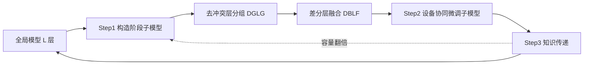

# Developmental Federated Tuning: A Cognitive-Inspired Paradigm for Efficient LLM Adaptation

**会议**: ICLR 2026  
**OpenReview**: [https://openreview.net/forum?id=htbzmulSaG](https://openreview.net/forum?id=htbzmulSaG)  
**代码**: 待确认  
**领域**: 联邦微调 / LLM 高效适配  
**关键词**: 联邦微调, LoRA, 渐进式训练, 课程学习, 边缘设备, 层融合  

## 一句话总结
DEVFT 把联邦微调拆成「先小后大」的发展阶段，从一个紧凑子模型逐步长成完整 LLM，并通过层分组与差分层融合实现跨阶段知识传递，在边缘设备上做到 4.59× 收敛加速、10.67× 通信节省、9.07% 平均性能提升。

## 研究背景与动机

**领域现状**：联邦微调（federated fine-tuning）让 LLM 在不汇集隐私数据的前提下协同适配下游任务，LoRA 类参数高效方法因冻结大部分权重、只训练低秩增量而成为主流路线（FedIT、FLoRA、FedSA-LoRA 等）。

**现有痛点**：即便上了 LoRA，现有方法仍然是**端到端**地微调整个 LLM——前向/反向都要走完所有层。论文用 Figure 1 量化了这道鸿沟：单步微调 LLaMA2-13B 需要 415.2 TFLOPs，是 BERT 的 112.2×，连相对紧凑的 TinyLLaMA 也要 9.3× 于 BERT。对算力、内存、通信都受限的边缘设备而言，这种开销从根本上挡住了部署。

**核心矛盾**：资源效率与模型能力天然对立——想省资源就得用小模型，但小模型能力不够；想要强能力就得训大模型，但大模型在边缘端训不动、传不起，而且高维度参数空间损失面崎岖、容易陷入差的局部极小值。

**本文目标**：在不牺牲最终能力的前提下，把联邦微调的「全程满负荷」改成「逐步加负荷」，让边缘设备绝大部分时间只需训练小子模型。

**核心 idea（发展式微调）**：受人类认知发展启发——学习是循序渐进而非一蹴而就的。**DEVFT 把微调过程分解成 S 个能力递增的发展阶段**：从一个紧凑子模型（"孩童"）起步，掌握当前阶段技能后扩容子模型（"成长"），并把已学知识迁移去初始化下一阶段（"长成成人"），重复直到达到目标容量。小模型损失面更平滑、不易陷局部极小，早期蒸出的知识又给后续大模型一个好的初始化，从而既省资源又涨点。

## 方法详解

### 整体框架

DEVFT 把整个联邦微调切成 $S$ 个阶段，子模型容量（层数）构成严格递增序列 $\{L_1, L_2, \dots, L_S\}$，最后一阶段 $L_S = L$ 覆盖全部层（实现中容量每阶段翻倍，如 7B/8B 用 $\{4,8,16,32\}$）。每个阶段循环三步：服务器先构造该阶段子模型，设备协同训练，阶段结束后把知识同步回全局模型并迁移到下一阶段。

### 关键设计

**1. 去冲突层分组（DGLG）：先把"能合得来"的层归到一组。** 要把 $L$ 层压成 $L_s$ 层的子模型，本质是给每组层造一个代表层。但若把参数符号相反、功能冲突的层硬塞进一组，融合时它们会互相抵消、造成严重信息损失，得到低保真的代表层。DEVFT 因此先用余弦相似度衡量层间参数冲突：$\mathrm{sim}(\theta_i, \theta_j) = \frac{\langle \theta_i, \theta_j \rangle}{\|\theta_i\|\|\theta_j\|}$（含各层关联的 LoRA 参数），相似度越高冲突越小、越该分到一起。以相似度矩阵 $W$ 为边权构造完全图，目标是把图切成 $L_s$ 个组使组间割边权重最小：$\min \sum_n \sum_{m\neq n} \mathrm{cut}(g_n, g_m)$。求解上走谱聚类——构造拉普拉斯矩阵 $\mathcal{L} = D - W$，取最小 $L_s$ 个特征值对应的特征向量堆成嵌入矩阵 $E$，再对 $E$ 做 k-means 得到 $L_s$ 个不相交分组，确保组内层参数冲突最小、知识能干净地共享。

**2. 差分层融合（DBLF）：只把每层"独有的那点信息"蒸进代表层。** 拿到分组后要合成代表层。最朴素的做法是把组内所有层参数直接相加，但组内层功能本就同质，全加会带来大量冗余、压制子模型表达多样表示的能力。DBLF 改为把组内第一层定为锚点层 $\theta_{\text{anchor}}$，对其它层做减法 $\theta_j - \theta_{\text{anchor}}$ 抽出相对于锚点的"信息差分"，只把这些差分按权重 $\beta$ 累加进锚点：$\vartheta_{g_n} = \theta_{\text{anchor}} + \beta \sum_{j\in g_n}(\theta_j - \theta_{\text{anchor}})$。这套加/减层算术（Figure 4）在参数空间做细粒度知识编辑——加法合并语义、减法蒸馏独有信息，既保住每层的关键功能又剔除冗余。所有组的代表层顺序拼接即得本阶段子模型。

**3. 跨阶段知识传递：让大模型站在小模型的肩膀上。** 阶段结束后，子模型里学到的代表层知识 $\{\vartheta_{g_n}\}$ 不能浪费。由于 DGLG 保证了组内层功能同质、参数分布与学习模式相近，每个代表层的知识可直接回写去更新它所在组的全部原始层（只更新 LoRA 参数），从而把 $L_s$ 层学到的东西摊回 $L$ 层全局模型。这个更新后的全局模型再作为下一阶段构造子模型的基础，实现知识的无缝继承。其意义在于：后一阶段的大子模型不是从预训练权重冷启动，而是拿到一个已被本任务初步对齐的初始化，从而加速收敛、避开差的局部极小。

## 实验关键数据

设置：LLaMA2-7B / LLaMA3.1-8B / LLaMA2-13B（均 INT4），Alpaca-GPT4 微调，$S=4$，容量逐阶段翻倍。闭式基准 TruthfulQA/MMLU/IFEval/BBH，开放式基准 Vicuna-Bench/MT-Bench。

### 主实验（闭式基准平均分 ↑）

| 方法 | LLaMA2-7B | LLaMA3.1-8B | LLaMA2-13B |
|------|-----------|-------------|-----------|
| FedIT | 40.27 | 55.35 | 48.58 |
| DoFIT | 40.89 | 57.79 | 49.74 |
| ProgFed | 41.00 | 60.12 | 50.22 |
| FedSA-LoRA | 40.81 | 60.97 | 50.84 |
| **DEVFT** | **42.33** | **64.25** | **52.77** |

DEVFT 在三个模型上闭式基准平均分均居首，对 LLaMA3.1-8B 相比 FedIT 提升约 8.9%；开放式 MT-Bench 也全面领先（如 8B 上 7.79 vs FedSA-LoRA 7.12）。

### 效率与消融

| 维度 | 结果 |
|------|------|
| 收敛训练时间（7B） | DEVFT 0.81h vs C2A 3.72h，最高 **4.59× 加速** |
| 通信开销（13B） | DEVFT 3.93GB vs C2A 41.95GB，最高 **10.67× 节省** |
| 首阶段单轮（7B） | 训练时间 10.3×、通信 4×、内存 4× 节省；末阶段仍有 1.44× 加速 |
| DGLG 消融（8B） | RANDOM ↓3.56%，EVEN ↓6.49% |
| DBLF 消融（8B） | 只取锚点层 R-ONE ↓10.96%，直接求和 SUM ↓3.05% |
| 兼容性 | FedSA-LoRA+DEVFT 在 7B 上 ↑3.51% 且时间 ×3.31、通信 ×2.14 |

### 关键发现
- **小模型起步既省资源又涨点**：发展式范式的损失面更平滑，配合知识迁移既加速收敛又避开差局部极小，性能反超端到端方法。
- **分组与融合策略缺一不可**：DGLG 把冲突最小的层归组、DBLF 只蒸独有信息，两者的消融下降（最高 10.96%）说明"造一个高保真代表层"是性能关键。
- **即插即用**：DEVFT 作为外层调度框架可叠加在 FedIT、FedSA-LoRA 之上，在涨点的同时再砍 2–3× 资源。

## 亮点与洞察
- **把"课程学习/认知发展"迁到联邦微调的资源维度**：不是数据由易到难，而是**模型容量**由小到大，直击边缘端算力/通信瓶颈这个真痛点。
- **层算术做模型构造**：用余弦相似度去冲突分组 + 锚点减法蒸差分，给"如何把 L 层压成 Ls 层还能无损传知识"提供了一个干净、可解释的解法。
- **正交于已有方法**：作为外层框架可与多数 LoRA 联邦方法组合，落地友好。

## 局限与展望
- 阶段数 $S$、容量序列、融合权重 $\beta$ 都是手调超参（13B 用 0.15、其余 0.1），缺乏自适应机制。
- 谱聚类需对 $L\times L$ 相似度矩阵做特征分解，由服务器承担——层数极大时该成本及"层级独立同质"假设是否成立有待考察。
- 评测集中在 LLaMA 系 + 指令微调单类任务，跨架构、跨任务（如代码/数学）以及强数据异构下的鲁棒性尚未充分验证。

## 相关工作与启发
- **参数高效联邦微调**：Prompt-based、Adapter-based、LoRA-based 三类；异构资源下有 HETLoRA/FlexLoRA 分配不同秩，Fed-pilot/Fed-HeLLo 按层贡献调度，FwdLLM/FedKSeed 用零阶优化省资源。DEVFT 与它们正交——前者优化"怎么训每一层"，DEVFT 优化"何时训多少层"。
- **渐进式训练**：ProgFed 把模型分块逐步加入训练，是最接近的对照；DEVFT 的差异在于显式的层分组融合与跨阶段知识回写。
- **启发**：这套"小模型蒸知识→初始化大模型"的发展式思路，可推广到非联邦的高效预训练/持续学习场景。

## 评分
- 新颖性: ⭐⭐⭐⭐ — 认知发展启发的"模型容量课程 + 层算术构造子模型"组合在联邦微调里少见，切入点扎实。
- 实验充分度: ⭐⭐⭐⭐ — 三模型、闭/开两类基准、效率+消融+兼容性齐全，但任务类型偏单一、数据异构未深入。
- 写作质量: ⭐⭐⭐⭐ — 动机—方法—实验逻辑清晰，图示（Figure 2/3/4）有效，公式表述规范。
- 价值: ⭐⭐⭐⭐ — 直接降低边缘端联邦微调门槛，且可即插即用叠加现有方法，落地潜力强。

<!-- RELATED:START -->

## 相关论文

- [\[ICLR 2026\] FLoRG: Federated Fine-tuning with Low-rank Gram Matrices and Procrustes Alignment](florg_federated_fine-tuning_with_low-rank_gram_matrices_and_procrustes_alignment.md)
- [\[ICLR 2026\] On-the-Fly Adaptation to Quantization: Configuration-Aware LoRA for Efficient Fine-Tuning of Quantized LLMs](on-the-fly_adaptation_to_quantization_configuration-aware_lora_for_efficient_fin.md)
- [\[ICLR 2026\] Mitigating Non-IID Drift in Zeroth-Order Federated LLM Fine-Tuning with Transferable Sparsity](mitigating_non-iid_drift_in_zeroth-order_federated_llm_fine-tuning_with_transfer.md)
- [\[ICLR 2026\] Difficulty–Diversity Collaborative Filtering for Data-Efficient LLM Fine-Tuning](difficultydiversity_collaborative_filtering_for_data-efficient_llm_fine-tuning.md)
- [\[ICLR 2026\] LoRA-S: An Efficient Low Rank Adaptation scheme via Sylvester equation](lora-s_an_efficient_low_rank_adaptation_scheme_via_sylvester_equation.md)

<!-- RELATED:END -->
