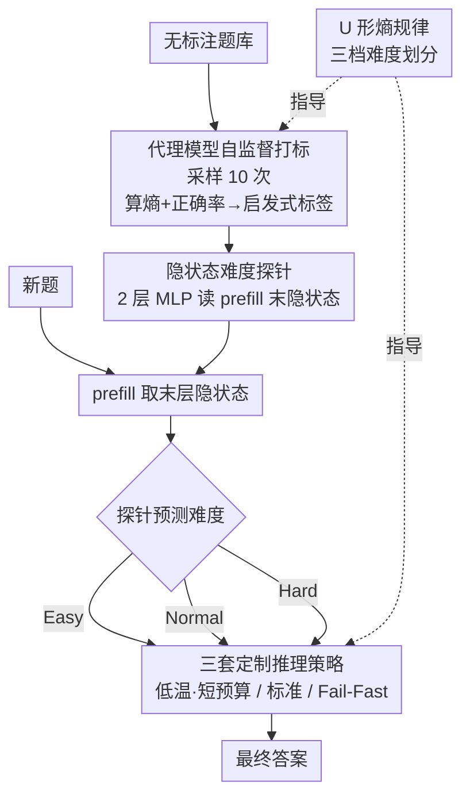

# DiffAdapt: Difficulty-Adaptive Reasoning for Token-Efficient LLM Inference

**会议**: ICLR2026  
**OpenReview**: [https://openreview.net/forum?id=644FH1vVIl](https://openreview.net/forum?id=644FH1vVIl)  
**代码**: 待确认（作者承诺论文发表后开源）  
**领域**: LLM 推理效率  
**关键词**: 推理大模型、过度思考、Token 预算、难度自适应、隐状态探针

## 一句话总结
作者先发现推理大模型在不同难度题目上呈现"U 形熵曲线"——简单题答得对却熵很高（过度思考），于是训练一个只读取模型隐状态的轻量探针，为每道题动态选择 Easy/Normal/Hard 三套推理策略，在不微调主模型的前提下把 token 消耗最多降 22.4%、端到端延迟降到原来的 1/6，同时准确率持平甚至更高。

## 研究背景与动机
**领域现状**：以 DeepSeek-R1、Qwen3 为代表的推理大模型，靠生成冗长的"思维链"（chain-of-thought）来提升数学、代码、逻辑推理能力，这种"测试时扩展"（test-time scaling）已成主流范式。

**现有痛点**：模型对**每一道题**都不分青红皂白地写超长 CoT。简单题被浪费大量算力（如 GSM8K 一道小学应用题也能写几百上千 token），而真正难的题给再多 token 也未必算得对。这种"一刀切"的固定预算既烧钱又拖慢延迟。

**核心矛盾**：现有的效率优化方法要么需要用强化学习重新微调主模型（成本高、要大规模 rollout 数据），要么是训练无关的早退方法（如 DEER 靠置信度提前停，但泛化差、常常反而把生成顶到 token 上限）。问题的根本在于：**没有一个便宜又准的"难度信号"来指导每道题该花多少算力**。

**本文目标**：在不动主模型权重、不引入额外大模型的前提下，让 LLM 按题目难度自适应地分配推理预算。

**切入角度**：作者没有直接去预测"该写多长"，而是先做了一个反直觉的观察——把生成熵（token 概率分布的不确定性）按题目难度画出来，发现一条 **U 形曲线**：简单题熵高、中等题熵低、难题熵又高。从易到中的熵下降高达 22–25%，说明模型在简单题上确实"想多了"。这条曲线天然把题目切成三个区，每个区该用不同策略。

**核心 idea**：用一个读取主模型最后一层隐状态的小探针（MLP）把题目分成 Easy/Normal/Hard 三档，每档配一套固定的 prompt + 温度 + 最大长度，从而"对症下药"地分配 token，而不微调主模型本身。

## 方法详解

### 整体框架
DiffAdapt 的目标是：给定一道新题，在主模型真正开始推理前，就用一个极轻量的探针判断它属于 Easy/Normal/Hard 哪一档，然后套用对应的推理策略。整条管线分三个串行阶段——**先离线造训练数据、再训探针、最后在线用探针选策略**——而这三档的划分和策略设计都来自前置的 U 形熵分析。

具体来说：第一阶段用主模型自己当"代理模型"（proxy model），在无标注题库上每题采样 10 次，算出生成熵和正确率，按启发式规则给每题打上 Easy/Normal/Hard 标签，得到探针的训练集；第二阶段提取主模型在 prefill 完问题后最后一层的隐状态 $h_L$，训一个两层 MLP 探针去预测这个难度标签；第三阶段在线推理时，探针读隐状态、预测难度、映射到三套策略之一，最后用选定的 prompt/温度/长度生成答案。由于探针只在 prefill 之后、decode 之前插一脚，它不干扰主模型的 KV cache、batching、prefix cache，可无缝叠加现有推理优化。

### 关键设计

**1. U 形熵规律：把"过度思考"量化成可操作的三档难度**

这是全文的经验基石，直接回答"凭什么把题分三档"。作者在 DeepMath-103K（题目带 1–10 难度评级）上，每个难度采样 300 题、每题跑 10 次，用**生成熵**衡量不确定性——对每个 token 位置 $t$，熵为 $H_t = -\sum_{j=1}^{V} p_{t,j}\log p_{t,j}$，整条序列取平均。画出"难度 vs 熵"曲线后得到反直觉的 U 形：简单题正确率高却熵高（模型明明会做却很不确定，即过度思考区）、中等题熵最低（确定区，能力与难度匹配的甜点）、难题熵又高（能力极限区，真不会）。从易到中熵下降 22–25%。这三个区天然对应三种算力需求——简单题该少花、中等题正常、难题该"快速止损"，从而为后面的三套策略提供了理论依据。

**2. 三套定制推理策略：每档配独立的 prompt、温度、长度**

针对 U 形三区，作者设计三套固定配置（超参由网格搜索而非拍脑袋确定）：Easy 用低温 0.5、token 预算只给 $0.4\times|\text{Max}|$、prompt 鼓励"直接求解+验证"，避免模型在会做的题上瞎探索；Normal 用温度 0.8、给满预算 $1.0\times|\text{Max}|$、prompt 引导"分步系统推理"，让中等题在最优区充分展开；Hard 用低温 0.4、预算 $0.5\times|\text{Max}|$、prompt 走"资源感知的策略推理"，核心是 **Fail-Fast** 机制——既然分析表明难题给再多 token 也大概率算不对，不如严格限长、及时止损，把算力省下来重新分配。Oracle 实验（每题事后选最优策略）显示，这三套策略只要选得对，就能省约 50% token 同时涨 10% 准确率，证明"按难度选策略"的上限很高。

**3. 代理模型自监督打标：不靠人工、用熵+正确率自动造训练集**

探针要训练就得有难度标签，但人工标注 difficulty 既贵又主观。作者让主模型自己充当代理模型，在无标注题库上每题采样 10 次，算出平均生成熵和正确率，再按启发式规则打标：**正确率 $\geq \alpha$ 且熵 $\leq \beta$ 标 Normal；正确率 $< \gamma$ 标 Hard；其余标 Easy**（典型即低难度反常区——正确率中等却熵异常高）。阈值 $\alpha,\beta,\gamma$ 按模型用观测到的熵-正确率分布简单设定，并在小验证集上做轻量稳定性检查。这套打标完全自监督，把"U 形熵"这个观察直接转成可训练的标签，避开了昂贵的人工或大规模 RL rollout。

**4. 隐状态难度探针：一个两层 MLP 就够，不碰主模型权重**

这是 DiffAdapt"便宜"的关键。作者不微调主模型，而是冻结它，只训一个极小的探针 $C$：取 prefill 完问题后最后一层隐状态 $h_L$，过两层 MLP 得到三类难度分布 $d = \mathrm{softmax}(W_2 \cdot \mathrm{ReLU}(W_1 h_L + b_1) + b_2)$，用交叉熵损失 $L(\theta) = -\frac{1}{N}\sum_{i=1}^{N}\log P(d_i = y_i \mid h_L^{(i)};\theta)$ 优化。相比那些需要额外跑 BERT、R1-7B 做"切换器"的方法，这个探针参数量微乎其微、延迟几乎为零，而且因为只在 prefill 后取一次隐状态，不打断主模型的 decode，可与 KV/prefix cache、batching 等优化共存。消融显示：把两层 MLP 换成线性头会掉约 3.2%，说明这点非线性是必要的。

### 损失函数 / 训练策略
探针用 AdamW 优化、学习率 1e-3、训练 100 epoch；训练数据为 DeepMath-103K 子集（每难度 300 题）。主模型全程冻结，唯一可学参数是探针的 $\{W_1, W_2, b_1, b_2\}$，因此训练成本极低。

## 实验关键数据

### 主实验
在 5 个模型（Qwen3-4B、DeepSeek-R1-Qwen-7B、DeepSeek-R1-Llama-8B、Nemotron-1.5B、ThinkPrune-7B）× 8 个 benchmark（GSM8K、MATH500、AIME24/25、OlympiadBench 为 in-domain；Minerva、GPQA、MMLU-Pro 为 out-of-domain）上评测。核心对比是 token 节省率（相对 Normal 固定策略）：

| 模型 | DiffAdapt token 节省 | DEER token 节省 |
|------|----------------------|------------------|
| DeepSeek-R1-Qwen-7B | **9.7%** | −53.3%（反而更多） |
| Qwen3-4B | **22.4%** | −27.5%（反而更多） |
| ThinkPrune-7B | **10.1%** | — |

DiffAdapt 在所有模型/领域上一致优于固定策略；相比训练无关基线 DEER，最多实现 62% token 缩减 + 18% 性能提升。DEER 因为靠置信度续写、常把生成顶到 token 上限，反而比 Normal 用更多 token。

端到端延迟（Qwen3-4B，40 道 OlympiadBench，batch 10，单卡 A800，均用 vLLM 后端）：

| 方法 | 耗时（分钟）↓ |
|------|--------------|
| vLLM 基线 | 64 |
| + DEER | 57 |
| + DiffAdapt | **10** |

即 DiffAdapt 比 vLLM 基线快约 6×、比 DEER 快约 5×，说明 token 节省切实转化为运行时加速。

### 消融实验
在 Qwen3-4B 上，跨不同 token 预算（33%–100%）平均：

| 配置 | 平均性能 | 说明 |
|------|---------|------|
| DiffAdapt（默认） | 70.9 | 完整方法 |
| 迁移阈值（取自 DeepSeek-R1 家族 $\alpha{=}0.85,\beta{=}0.35,\gamma{=}0.60$） | 71.2 | 仅差约 0.3%，几乎免调参 |
| 线性探针头 | 67.7 | 去掉非线性掉约 3.2% |
| 仅 30% 训练数据 | 68.5 | 数据砍到三成几乎不掉点 |

### 关键发现
- **探针非线性是必要的**：换成纯线性头一致掉约 3.2%，2 层 MLP 这点表达力不能省。
- **几乎免调参**：把别的模型族的阈值直接迁移过来只差约 0.3%，支持"即插即用"部署，无需逐模型重标定。
- **极度数据高效**：训练数据砍到 30% 几乎不掉点，远比需要大规模 rollout 的 RL 方法省。
- **与 RL 长度控制正交**：在 Nemotron-1.5B、ThinkPrune-7B 这类已用长度控制 RL 训过的模型上叠加 DiffAdapt，在高 token 预算下仍取得 SOTA，说明它能与训练侧优化方法组合而非互斥。
- **不牺牲推理完整性**：Qwen3-30B 当盲审裁判，在 50 道 GSM8K 上 DiffAdapt 胜 76%、基线胜 12%、平 12%；真正因早截断导致逻辑失败的只有 2%，打消了"省 token 会砍坏推理链"的担忧。

## 亮点与洞察
- **从"熵"反推算力分配**：U 形熵曲线是个漂亮的观察——简单题熵高=过度思考，把一个抽象的"过度思考"现象量化成可操作的三档信号，这是全文最"啊哈"的地方。
- **隐状态探针的便宜哲学**：不微调主模型、不引外部大模型，只在 prefill 后插一个 MLP，既保住了与 KV/prefix cache 的兼容性，又把额外延迟压到几乎为零；这种"读内部表征做轻量决策"的思路可迁移到路由、早退、难度感知采样等任何需要"先估难度再决策"的场景。
- **Fail-Fast 反直觉但有效**：给难题**更少**而非更多 token，承认"模型能力有上限、难题硬磕也是浪费"，把算力让给真正划算的题，这个取舍很务实。
- **正交性**：能叠加在 RL 长度控制模型之上，意味着它是"补丁式"增益，部署门槛低。

## 局限与展望
- **依赖三档离散划分**：把连续的难度谱硬切成 Easy/Normal/Hard 三档，粒度较粗；介于两档之间的题可能被误分，未来可考虑连续预算回归。
- **策略配置靠网格搜索**：三套 prompt/温度/长度是经验+网格搜索定的，换到代码、Agent 等非数学领域可能要重调（论文主战场是数学推理 + 少量 OOD）。
- **代理打标的循环依赖**：标签由主模型自己采样得到，若主模型本身能力偏弱，正确率/熵的估计会带噪声，标签质量受限。
- **阈值鲁棒性的边界**：迁移阈值在同量级模型间几乎无损，但跨差异极大的模型族是否仍成立，论文未充分覆盖。

## 相关工作与启发
- **vs DEER（训练无关早退）**：DEER 靠监测过渡 token + 置信度提前退出，但在固定预算下常把生成顶到上限，token 反增（Qwen3-4B 上 −27.5%）、OOD 泛化差；DiffAdapt 改用"学出来的难度模型"指导分配，更稳更省。
- **vs 训练侧预算控制（ThinkPrune、LC-R1、Thinkless 等）**：这些方法用 RL/GRPO 把预算控制塞进训练阶段，成本高、要大规模 rollout；DiffAdapt 不动主模型、只训探针，且能**叠加**在这些模型之上做正交增益。
- **vs 需要辅助模型的方法（训 BERT 预测剩余长度 / R1-7B 当切换器 / MLP switcher）**：它们都要在推理时多跑一个非平凡模型，增加算力和部署复杂度；DiffAdapt 的探针直接挂在主模型隐状态上，延迟近乎为零。

## 评分
- 新颖性: ⭐⭐⭐⭐ U 形熵观察反直觉且有洞见，隐状态探针做难度路由的组合很巧
- 实验充分度: ⭐⭐⭐⭐⭐ 5 模型 × 8 benchmark，含 token/延迟/盲审/消融/正交性全方位验证
- 写作质量: ⭐⭐⭐⭐ 从现象到方法的逻辑链清晰，图表充分，三档划分讲得透
- 价值: ⭐⭐⭐⭐⭐ 即插即用、免微调、可叠加，延迟降 6×，落地性极强

<!-- RELATED:START -->

## 相关论文

- [\[ICLR 2026\] Difficulty–Diversity Collaborative Filtering for Data-Efficient LLM Fine-Tuning](difficultydiversity_collaborative_filtering_for_data-efficient_llm_fine-tuning.md)
- [\[ICLR 2026\] MoL: Adaptive Mixture-of-Length Reasoning for Efficient Question Answering with Context](mol_adaptive_mixture-of-length_reasoning_for_efficient_question_answering_with_c.md)
- [\[ICLR 2026\] ThinKV: Thought-Adaptive KV Cache Compression for Efficient Reasoning Models](thinkv_thought-adaptive_kv_cache_compression_for_efficient_reasoning_models.md)
- [\[ICLR 2026\] Reasoning Language Model Inference Serving Unveiled: An Empirical Study](reasoning_language_model_inference_serving_unveiled_an_empirical_study.md)
- [\[ICLR 2026\] Universal Model Routing for Efficient LLM Inference](universal_model_routing_for_efficient_llm_inference.md)

<!-- RELATED:END -->
