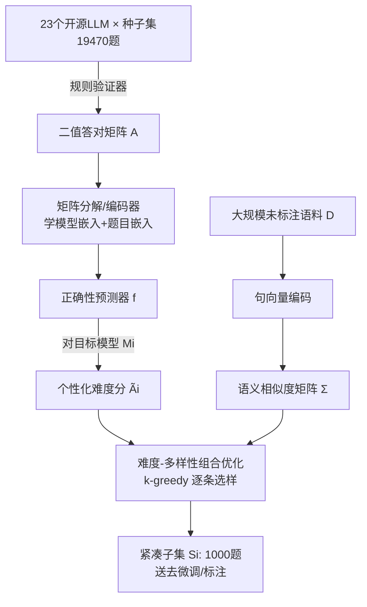

# Difficulty–Diversity Collaborative Filtering for Data-Efficient LLM Fine-Tuning

**会议**: ICLR 2026  
**OpenReview**: [https://openreview.net/forum?id=n9mXlqD2SJ](https://openreview.net/forum?id=n9mXlqD2SJ)  
**代码**: [https://github.com/iNLP-Lab/DDCF](https://github.com/iNLP-Lab/DDCF)  
**领域**: LLM 数据高效微调 / 数据选择  
**关键词**: 数据选择, 协同过滤, 难度-多样性权衡, Less-is-More, 监督微调, 矩阵分解  

## 一句话总结
把"模型-问题"答对与否的交互矩阵当成推荐系统的评分矩阵，用协同过滤学出**为每个目标模型个性化的题目难度**，再与语义多样性联合做组合优化选样，从大规模未标注语料里挑出 1000 条最有学习价值的题，把标注成本降低 100–200 倍而下游性能逼近全量微调。

## 研究背景与动机
**领域现状**：监督微调（SFT）通常依赖几十万条人工标注样本，但 Less-is-More 假说指出——下游任务往往只需少量高质量样本就能"唤醒"预训练阶段已编码的知识，精选几百条样本有时反而超过盲目堆全量语料。理论上也已证明：当底座模型够强时，挑更难的样本有可证明的优势。

**现有痛点**：要识别这种"难且多样"的优质数据，现有做法要么靠不断演化的人类专家经验（费力、僵化、换模型/换任务就得重来），要么依赖全量语料微调后再筛（如 S2L 按损失轨迹聚类）、依赖梯度匹配目标集（LESS）、或依赖 ChatGPT 等闭源模型打分（AlpaGasus）——这些都假设了昂贵的前置条件。更关键的是，**难度不是题目的固有属性**：对一个模型难的题对另一个模型未必难，而绝大多数方法用统一的困惑度/推理长度来定义难度，忽略了模型个体差异。

**核心矛盾**：既想在**标注之前**就完成选样以省下标注费，又想让选出的子集对**特定目标模型**既难又多样——但难度的"个性化"与"无需标注"这两个诉求，现有方法几乎无法同时满足。

**本文目标**：在仅有一个小种子集标注的前提下，为任意目标模型自动从大规模未标注语料里选出紧凑、有挑战性又覆盖广的训练子集。

**核心 idea**：**把数据选择重铸为推荐问题**——模型当"用户"、题目当"物品"、答对与否当"评分"，用协同过滤的矩阵分解学出可泛化到未见题目的个性化难度预测器，再把"难度 + 多样性"写成一个可贪心求解的组合优化目标。

## 方法详解

### 整体框架
DDCF 分两段：先用 23 个开源 LLM 在小种子集上跑出一张二值"答对矩阵"，训练一个**正确性预测器**学会预测"模型 i 在题 j 上是否答对"；再对目标模型，用这个预测器给大语料每道题打**个性化难度分**，与句向量算出的**语义相似度**一起送入难度-多样性组合优化，用 k-greedy 逐条挑出最终子集。

### 关键设计

**1. 正确性预测器：把答对矩阵分解成可泛化的难度模型。** 给定 $m$ 个模型和 $n$ 道带标准答案的种子题，先构造二值矩阵 $A\in\{0,1\}^{m\times n}$（$A_{ij}$ 表示模型 $i$ 是否答对题 $j$）。朴素的协同过滤把它分解成 $A\approx E_M E_Q^\top$，但这种纯矩阵分解只对训练集内的题有效、无法外推到新题。为此本文把分解参数化成一个编码器：模型编码器 $\phi_M$ 把模型索引映射到隐空间，题目编码器 $\phi_Q=h_Q\circ g_Q$ 先用预训练句向量（Qwen3-Embedding-4B）把题面 $g_Q$ 编码、再用 MLP $h_Q$ 投到共享隐空间；分类头对两个嵌入的 Hadamard 积打分，$f(M_i,q_j)=\psi(\phi_M(M_i)\odot\phi_Q(q_j))$，用二元交叉熵训练。预测的答对概率 $\hat A_{ij}=\sigma(f(M_i,q_j)_1)$ 可看作经典矩阵分解的参数化版本——关键差别在于它**不再给每道题一个全局难度，而是让难度因模型而异**，这正是后续个性化选样的基础。因为题面经过句向量编码，预测器能对从未见过的新题给出难度估计。

**2. 难度-多样性组合优化：一个目标同时压低难度分、压低冗余度。** 对目标模型 $M_i$ 和大语料 $D$（$|D|\gg|Q|$），每道题的预测答对分 $\tilde A_{ij}=\sigma(f(M_i,q_j)_1)$，分越低说明模型越可能答错、题越难。多样性则用句向量余弦相似度矩阵 $\Sigma$ 度量。选 $k$ 道题的问题写成 $\min_{x\in\{0,1\}^{|D|}}\ \lambda(x^\top\tilde A_i)+(1-\lambda)(x^\top\Sigma x),\ \text{s.t.}\ \sum_j x_j=k$，其中 $\lambda$ 平衡"挑难题"（第一项越小越难）与"避免相似冗余"（第二项是被选题之间的相似度之和）。这个目标在连续松弛下是凸的，但二值约束让它 NP-hard，且 $\Sigma$ 带来 $O(|D|^2)$ 的内存开销。

**3. k-greedy 逐条选样：把 NP-hard 选样降成线性内存的在线贪心。** 与其求解整张相似度矩阵，DDCF 从空集出发，每步只加入边际增益最大的那道题：$q_j=\arg\min_{q_j\in D\setminus S_i}\big[\lambda\tilde A_{ij}+(1-\lambda)\max_{q_u\in S_i}\Sigma_{uj}\big]$。这里多样性项被换成"与已选集合中最相似那道题的相似度"，只需在线计算 $O(k\cdot|D|)$ 个相似度而非 $O(|D|^2)$，既绕开 NP-hard 又把内存压到可扩展规模。t-SNE 可视化验证了它的双重目标：在句向量空间里选中的子集铺满多个语义区域（多样性达成），在分解隐空间里则集中落在最难的区域（难度达成）。

**4. 即插即用的双场景定位。** 同一套选样在两种语料下都管用：面对**未标注**语料，DDCF 当前置过滤器，把昂贵的标注（人类专家或强教师模型）只集中到选出的 $k$ 条上，标注成本降 100–200 倍；面对**已标注**语料，它当后置过滤器，剔除琐碎冗余样本、按目标模型的强弱裁剪学习路径，缩短训练时间。选出的子集还可再过一道质量审查，适配医疗、法律等高风险场景。

## 实验关键数据

### 主实验（从 OpenR1-Math-220K 选 1000 条，10 个推理基准）

| 模型 | 方法 | ID 均分 | OOD 均分 |
|------|------|---------|----------|
| Qwen2.5-Math-7B | Full Dataset (220K) | 75.8 | 66.1 |
| | Base Model | 55.6 | 49.2 |
| | Random | 67.8 | 60.5 |
| | Perplexity（最强 baseline） | 69.3 | 65.1 |
| | LIMO / s1.1-1K（人工精选） | 67.4 / 68.5 | 56.0 / 61.0 |
| | **DDCF** | **70.2** | **65.4** |
| Qwen3-8B-Base | Full Dataset | 87.0 | 80.4 |
| | Random | 83.6 | 79.0 |
| | **DDCF** | **85.0** | **80.5** |

7B 上 DDCF 的 ID 均分 70.2 超过最强 baseline，仅落后全量 5.6 分；OOD 65.4 把与全量的差距压到 0.7 分，在 Gaokao 上 74.7 甚至**反超全量微调 +2.5**。8B 上 OOD 80.5 略超全量 80.4。最难的 AIME24 上 DDCF 把 7B 从 base 的 34.6 提到 49.0（+14.4，比 Random +10.4）。

### 数据规模消融（k 从 0 扫到 220K）
- **强模型 Qwen2.5-Math-7B**：ID 随 k 近似单调上升（55.6→75.8）；OOD 非单调，k=1000 早早冲到峰值 65.4，中段 4K–8K 跌到约 61，再缓慢回升。只选 1000 条就锁定了 70% 以上的 ID 增益和几乎全部 OOD 收益。
- **弱模型 Qwen2.5-Math-1.5B**：印证了"小模型可学性鸿沟 / 长 CoT 退化"——k=1000 时 ID 反而从 54.3 暴跌到 45.4（-8.9）。加到 k=4000 基本止损，k≥8000 才完全恢复并爬升，k=128K 时 ID 59.2 / OOD 46.0，比全量 220K 微调还高 +1.0 ID / +2.2 OOD。

### 难度-多样性权衡（λ 消融，SVAMP + AMC23）
λ 从 0（纯多样性）增到 0.2 时竞赛级 AMC23 性能上升、随后基本饱和；λ 过大（纯难度）则在简单的 SVAMP 上掉点。最终默认 **λ=0.2**，说明"以多样性为主、辅以适度难度"是最稳的配比。

### 关键发现
- 难度的**个性化**是关键：强模型从难样本受益，弱模型却会被同样的难样本拖垮，统一难度定义无法兼顾。
- 紧凑子集不仅不损失泛化，反而在 OOD（Gaokao、Minerva）上偶尔超过全量训练，提示盲目堆数据可能稀释可迁移性。

## 亮点与洞察
- **视角迁移漂亮**：把 LLM 数据选择重铸成"模型=用户、题目=物品"的推荐问题，让协同过滤、矩阵分解、LLM 路由这些成熟工具直接为数据策展服务，思路清晰且工程上轻量。
- **个性化难度**击中了数据选择的核心盲区——大多数方法用全局困惑度/推理长度定义难度，DDCF 让难度因模型而异，这是它能在 7B 上赢、又能解释 1.5B 为何被难样本拖垮的根因。
- **唯一同时满足五项标准**（难度感知 / 多样性感知 / 无需全量微调 / 几乎免标注 / 不依赖闭源 LLM 反馈）的方法，且能扩展到 ICL、主动学习、课程学习等设定。

## 局限与展望
- 弱模型（1.5B）在小而难的子集上会显著退化，"少而精"对底座能力有门槛，DDCF 的 1000 条增益主要属于强模型场景。
- 正确性预测器依赖 23 个开源 LLM 跑种子集，前期需要一笔不小的推理预算来构造答对矩阵（虽然只跑一次、可摊销）。
- 实验集中在数学推理（GSM8K/MATH 系），跨到代码、开放域指令、多模态等任务的泛化尚待验证。
- 难度只用"答对/答错"的二值信号刻画，未利用置信度、推理过程质量等更细粒度信息。

## 相关工作与启发
- **影响力类**（Grad-Match、LESS、NICE）靠梯度匹配目标集；**启发式类**（Perplexity 选中困惑度、Dataset Cartography）用 token 概率代理难度；**反馈驱动类**（AlpaGasus、Evol）靠闭源 LLM 打分；**多样性类**（D4、DiSF）按嵌入相似度保覆盖；**代理模型类**（S2L）按损失轨迹聚类。DDCF 的差异是把这些诉求统一进一个免标注、模型个性化的框架。
- 与 **LLM 路由**（FrugalGPT、RouterBench 系矩阵分解路由）同源——都把模型/问题嵌入共享隐空间，但 DDCF 把路由学到的相关性分用来反向指导**选数据**而非选模型，是两条研究线的桥接。
- 对从业者的启发：当你要给某个特定模型做高效微调时，"难度"应当先针对该模型测量，而非套用通用难度榜；并且多样性优先、难度适度（λ≈0.2）通常比一味挑最难更稳。

## 评分
- 新颖性: ⭐⭐⭐⭐ — "推荐问题 + 个性化难度"的重铸视角新颖，首次系统量化难度-多样性权衡。
- 实验充分度: ⭐⭐⭐⭐ — 10 个基准、多模型规模、数据规模与 λ 双消融充分，但局限在数学推理。
- 写作质量: ⭐⭐⭐⭐ — 动机递进清晰，t-SNE 与对比表把方法讲得直观。
- 价值: ⭐⭐⭐⭐ — 100–200 倍标注降本且性能逼近全量，对低资源微调实用性强。

<!-- RELATED:START -->

## 相关论文

- [\[ICLR 2026\] Influence-Preserving Proxies for Gradient-Based Data Selection in LLM Fine-Tuning](influence-preserving_proxies_for_gradient-based_data_selection_in_llm_finetuning.md)
- [\[ICLR 2026\] CPQS-Tuning: A Model Self-Perception-Based Data Filtering Algorithm for Efficient Instruction Fine-Tuning](cpqs-tuning_a_model_self-perception-based_data_filtering_algorithm_for_efficient.md)
- [\[ICLR 2026\] Explainable Token-level Noise Filtering for LLM Fine-tuning Datasets](explainable_token-level_noise_filtering_for_llm_fine-tuning_datasets.md)
- [\[ICLR 2026\] Neuron-Aware Data Selection in Instruction Tuning for Large Language Models](neuron-aware_data_selection_in_instruction_tuning_for_large_language_models.md)
- [\[ICLR 2026\] On-the-Fly Adaptation to Quantization: Configuration-Aware LoRA for Efficient Fine-Tuning of Quantized LLMs](on-the-fly_adaptation_to_quantization_configuration-aware_lora_for_efficient_fin.md)

<!-- RELATED:END -->
