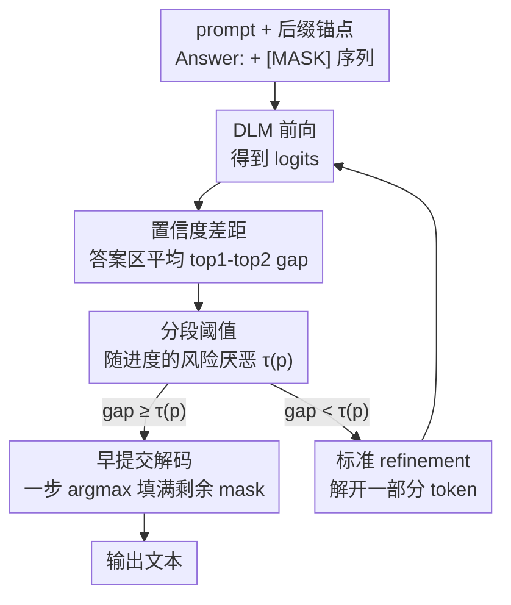

# Diffusion Language Models Know the Answer Before Decoding

**会议**: ICLR 2026  
**OpenReview**: [https://openreview.net/forum?id=g88nt4ieTG](https://openreview.net/forum?id=g88nt4ieTG)  
**代码**: https://github.com/pixeli99/Prophet  
**领域**: LLM效率  
**关键词**: 扩散语言模型, 推理加速, 早停解码, 置信度, 训练免费

## 一句话总结
扩散语言模型（DLM）在解码到一半时往往就已经在内部确定了正确答案，本文据此提出训练免费的 Prophet 解码范式——用"前两名候选 token 的 logit 差距"判断答案是否收敛，一旦收敛就一步填完所有剩余位置（早提交解码），在 LLaDA-8B / Dream-7B 上把解码步数最多减少 3.4× 而精度几乎不掉。

## 研究背景与动机

**领域现状**：扩散语言模型（DLM，如 LLaDA、Dream、商用的 Mercury / Gemini Diffusion）是自回归（AR）模型之外的一条序列生成路线。它不是从左到右逐 token 生成，而是把整段输出先初始化成一串 `[MASK]`，再通过若干轮"预测干净序列 → 重新加噪（remasking）"的迭代去噪，并行地把所有位置逐步填实。其卖点是并行解码和灵活的生成顺序。

**现有痛点**：尽管理论上能并行，DLM 的实际推理速度反而比 AR 模型慢。原因有二：一是双向注意力无法直接套用 KV cache；二是为了保证质量，往往需要很多轮 refinement 步（步数常设得和生成长度一样大，比如生成 256 个 token 就跑 256 步），一旦激进地一步多解码几个 token，质量就明显掉。于是 DLM 卡在"效率 vs 精度"的 trade-off 里。

**核心矛盾**：现有加速工作（KV cache 近似、token 剪枝、蒸馏）几乎都在压"每一步的计算成本"，却默认"步数本身是必需的"。但如果模型其实早就知道答案了，那后面那一大半 refinement 步就是纯粹的冗余计算——这是一个没人系统利用的维度。

**切入角度**：作者做了一个细致的解码动力学分析：跟踪每个位置的 top-1 预测 token 随解码步的变化，统计"正确答案 token 第一次稳定成为 top-1"发生在整个解码过程的百分之几。结论很惊人——在 GSM8K 和 MMLU 上，分别有高达 97% 和 99% 的样本，只用一半的 refinement 步就能解出正确答案；在随机 remasking 下这个"早收敛"现象尤其显著。也就是说，答案区域的 token 远比思维链（CoT）token 更早稳定下来。

**核心 idea**：既然答案早就收敛了，那就把 DLM 解码重新表述为一个"何时停止采样"的**最优停止问题**——实时监控答案区域的置信度，一旦判定收敛就"all-in"（一步填完全部剩余 mask），跳过后续所有冗余步。这套机制叫 **Prophet**，训练免费、零额外开销、可直接包在现有 DLM 推理循环外面。

## 方法详解

### 整体框架

Prophet 不改模型、不改训练，它只是在 DLM 标准去噪循环里插入一个"早提交检查"。输入是 prompt 加上一串 `[MASK]` 的待生成序列，输出是最终文本。每一步，模型照常前向算出 logits；Prophet 额外做一件事：在**答案区域** $A$ 上算一个"置信度差距"（confidence gap）的平均值 $\bar g_t$，再和一个随解码进度变化的阈值 $\tau(p)$ 比较。如果 $\bar g_t \ge \tau(p)$，就认为答案已收敛，直接用当前 logits 的 argmax 一次性填满所有剩余 mask 并返回（早提交解码）；否则就退回去执行一步标准的 DLM refinement（按 remasking 策略解开一部分 token），再进入下一轮检查。

整个流程是一个"每步带早停判定的去噪循环"，关键在于三件事的配合：用什么指标衡量"收敛"（置信度差距）、阈值怎么随时间变（分段风险厌恶）、收敛后怎么收尾（一步 all-in）。此外作者发现一个加速早收敛的小技巧——在 prompt 末尾加一个语义锚点 suffix（"Answer:"），能显著把答案的早收敛点再往前提。

### 关键设计

**1. 早答案收敛：把"步数冗余"变成可利用的现象**

这是全文的基石观察，针对的痛点是"DLM 默认跑满步数纯属浪费"。作者用 LLaDA-8B 在 GSM8K / MMLU 上做解码动力学分析：记录每个位置 top-1 预测 token 随步数的演化，统计正确答案 token 第一次匹配 ground truth 发生在总步数的百分之几（只统计最终输出含正确答案的样本）。结论分三点：① 大量样本早早就解对了——低置信 remasking 下 24.2% 的样本在前一半步就已正确、7.9% 在前 25% 步就正确，换成随机 remasking 这两个数飙到 97.2% 和 88.5%；② 答案 token 比 CoT token 稳定得多——非答案 token 在定稿前频繁波动，而答案 token 很早稳定下来后整段解码都不再变；③ 这说明"常规跑满全长的慢解码"存在根本性冗余。正是这个冗余给了早停以巨大的加速空间。

**2. 置信度差距：只看答案区的 top-2 间隔来度量收敛**

要早停就得有一个可靠、廉价的"收敛信号"。Prophet 用的是置信度差距：在第 $t$ 步，模型对每个位置 $i$ 输出 logit 向量，取最高 logit $L^{(1)}_{t,i}$ 与次高 logit $L^{(2)}_{t,i}$，其差

$$g_{t,i} = L^{(1)}_{t,i} - L^{(2)}_{t,i}$$

间隔越大，说明 top-1 token 把第二名甩得越开、预测越笃定、越可能已经收敛。关键的工程取舍是：**只在答案区域 $A$（长度 $N_{\text{ans}}$）上取平均**

$$\bar g_t = \frac{1}{|A|}\sum_{i\in A} g_{t,i}$$

而不是在整个序列上平均。因为 CoT 等非答案 token 一直在抖，把它们算进来会稀释信号、让早停判定迟钝；只盯答案区能最大化灵敏度。这个指标几乎零成本——logits 本来就要算，多做一次减法和求平均而已。

**3. 分段阈值：时变风险厌恶决定"何时敢提交"**

有了信号还得有判据，而且这个判据不能是固定阈值。作者把早停建模成最优停止问题：每步要权衡"多跑一步的计算成本"和"提前定稿可能定错的风险"。关键洞察是这两者随解码进度 $p=(T_{\max}-t)/T_{\max}$ 反向变化——解码早期（$p$ 小）预测还很可能大幅改善，此时提交风险高，应当**风险厌恶**、要求极高的阈值 $\tau_{\text{high}}$ 才敢提交；解码后期（$p$ 大）预测已稳定、再多跑一步省不下多少，应当**风险容忍**、用较低阈值 $\tau_{\text{low}}$ 就确认收敛。这套时变风险厌恶被实例化成一个分段阈值函数：

$$\tau(p)=\begin{cases}\tau_{\text{high}} & p<0.33\\ \tau_{\text{mid}} & 0.33\le p<0.67\\ \tau_{\text{low}} & p\ge 0.67\end{cases}$$

论文取 $\tau_{\text{high}}=7.5,\ \tau_{\text{mid}}=5.0,\ \tau_{\text{low}}=2.5$。正是这条"早期严、后期松"的曲线，让 Prophet 既不会在噪声大的早期贸然砍掉解码（避免精度崩），又能在答案稳定后果断止损（避免过度精修）。这也是它优于"静态截断到固定步数"的根本原因——静态截断要么欠算掉精度、要么过算浪费步。

**4. 早提交解码 + 后缀语义锚点：一步收尾与加速收敛**

当某步满足 $\bar g_t \ge \tau(p)$，Prophet 不再逐步精修，而是把当前 logits 的 argmax 一次性填进所有剩余 `[MASK]` 位置、立即返回（即"all-in"早提交解码）。这一步是纯并行操作、开销可忽略，把原本要跑的后半段步数整段省掉。配套的小设计是**后缀语义锚点**：在 prompt 末尾加上 "Answer:"。由于 DLM 是双向生成，这个锚点显式地把模型条件化到"在指定区域定位答案"，缩小搜索空间、加速收敛——实验里它把"前 25% 步就解对"的比例从 7.9% 提到 59.7%（低置信 remasking）。作者强调锚点只是语义引导、并不泄露 oracle 信息。

> Prophet 的四个设计是层层依赖的：观察（早收敛）→ 信号（置信度差距）→ 判据（分段阈值）→ 动作（早提交 + 锚点）。整套机制是对标准 DLM 解码循环的一个外挂 wrapper，model-agnostic、无需重训。

### 一个完整示例

以论文 Figure 3 的算术题为例（GSM8K，标准设 10 步）。标准全步解码会老老实实跑完全部 10 步：`[MASK] [MASK] [MASK]` → `3 sprints [MASK]` → `3×3=9, 9×60=[MASK]` → `3×3=9, 9×60=540` → 输出 `540`。但答案 token `540` 其实在第 6 步就已经在答案区稳定成 top-1，后面 t=7~10 全是冗余精修。Prophet 在第 6 步监测到答案区平均置信度差距已超过当前阈值 $\tau(p)$，立刻触发早提交：把当前 argmax 一次性填满剩余 mask，直接输出 `540`，省下约 55% 的步数，结果一字不差。

### 损失函数 / 训练策略
无。Prophet 完全训练免费，不引入任何可学习参数或损失，只是在推理循环里加一个置信度差距检查（见 Algorithm 1）。唯一的超参是三档阈值 $\tau_{\text{high}}/\tau_{\text{mid}}/\tau_{\text{low}}=7.5/5.0/2.5$ 和两个进度切换点 33% / 67%，通过少量预实验选定。

## 实验关键数据

### 主实验

在 LLaDA-8B-Instruct 与 Dream-7B-Instruct 上，跨通用推理 / 数学科学 / 代码 / 规划四类任务对比"全步解码"与"Prophet"。Prophet 在大幅减步的同时精度基本持平甚至更高（括号内为相对 baseline 的精度变化 $\Delta$）：

| 任务 | 模型 | Full (%) | Prophet (Δ) | 加速 |
|------|------|----------|-------------|------|
| MMLU | LLaDA-8B | 54.1 | 54.0 (−0.1) | 2.34× |
| HellaSwag | LLaDA-8B | 68.7 | 70.9 (+2.2) | 2.14× |
| TruthfulQA | LLaDA-8B | 34.4 | 46.1 (+11.7) | 2.31× |
| GSM8K | LLaDA-8B | 77.1 | 77.9 (+0.8) | 1.63× |
| HumanEval | LLaDA-8B | 30.5 | 30.5 (0.0) | 1.20× |
| Sudoku | Dream-7B | 89.0 | 89.0 (0.0) | 3.40× |
| MMLU | Dream-7B | 67.6 | 66.1 (−1.5) | 2.47× |

亮点：通用推理任务上加速最猛（2~2.5×）且常常精度不降反升（HellaSwag +2.2、TruthfulQA +11.7），说明早提交能避免后期噪声步把已正确的预测改坏；代码这类需要精细 refinement 的任务上加速更保守（HumanEval 仅 1.20×），体现 Prophet 的自适应性——难题就多留几步。最高 3.4×（Dream-7B / Sudoku）。

### 与其它加速方法正交叠加

Prophet 压的是"总步数"，与压"每步成本"的方法正交，可乘性叠加：

| 方法 | 精度 (%) | 加速 | 说明 |
|------|---------|------|------|
| LLaDA baseline | 77.1 | 1.00× | 256 步 |
| SDTT（蒸馏） | 76.9 | 2.00× | 256→128 步 student |
| SDTT + Prophet | 76.4 | 3.21× | 蒸馏模型仍保留早收敛性质 |
| Fast-dLLM（KV cache+并行） | 76.6 | 6.82× | 压每步成本 |
| Fast-dLLM + Prophet | 77.3 | 7.66× | 两维度相乘 |

### 关键发现
- **不是"少跑步"的副产品**：在 L=256 下静态截断到 16/32/64/128 步，精度单调上升（7.7→22.5→58.8→76.2%）但都不如全步；Prophet 自适应停在 ≈160 步却拿到 77.9%（>256 步的 77.1%），证明收益来自"答案稳定后避免过度精修"而非单纯减步。
- **对块长鲁棒**：半自回归块更新下，静态方案在大块时崩盘（block=128 时 baseline 仅 33.1%），Prophet 在 block=64 / 128 分别 +9.9 / +19.1 点——块越粗、并行更新注入噪声越多，时变阈值的"早期严"越能兜住。
- **remasking 策略无关**：随机 / 低置信 / top-k margin 三种 remasking 下 Prophet 均稳定优于静态对应（随机下 +2.8 最大），且随机 remasking 早收敛最明显，与前面观察一致。

## 亮点与洞察
- **把"解码"重述为"最优停止"**：本文最 aha 的地方是视角转换——不去优化"每步算多快"，而是问"什么时候该停"。这个维度此前被整个 DLM 加速社区忽略，却几乎免费就能拿 1.6~3.4× 加速。
- **置信度差距 + 只看答案区**：用 top-1 与 top-2 的 logit 间隔当收敛代理，简单到几乎零成本；而"只在答案区域取平均"这一步工程细节是灵敏度的关键，避免被一直抖动的 CoT token 拖累。这个思路可迁移到任何"有可识别答案区"的迭代式生成。
- **时变风险厌恶的阈值曲线**："早期严、后期松"把抽象的速度-质量权衡落成一条三段折线，既好实现又可解释，是它打败静态截断的核心。
- **正交即可乘**：把"减步数"和"减每步成本"明确解耦，使 Prophet 能叠在 Fast-dLLM、SDTT 之上做乘法加速（最高 7.66×），实用价值很高。

## 局限与展望
- **依赖"可识别的答案区域"**：方法明确针对 reasoning / code / planning 这类有明确 answer region 的任务，置信度差距也是在答案区上算的。对开放式长文本生成（无清晰答案区、整段都重要）该如何定义早停信号、收益几何，论文未覆盖。
- **阈值是手调的全局常数**：$\tau_{\text{high/mid/low}}$ 和两个切换点由预实验选定、跨任务固定。不同模型 / 任务的最优阈值可能不同，缺少自适应或按样本自校准的机制。
- **个别任务掉点**：如 WinoGrande（LLaDA −3.3）、MMLU（Dream −1.5）、TruthfulQA（Dream −2.4）仍有可见下降，说明"早提交不伤精度"并非对所有任务都成立。
- **改进方向**：把分段阈值换成随置信度分布在线自适应的连续函数；把答案区检测自动化以推广到无显式答案区的任务；与 token 剪枝（DPad）等更多正交方法联合验证乘性加速的上限。

## 相关工作与启发
- **vs Fast-dLLM**：Fast-dLLM 用近似 KV cache + 置信度感知并行解码降低**每步成本**；Prophet 降低**总步数**。两者作用维度正交，叠加得到 6.82×→7.66× 的乘性加速。
- **vs SDTT（蒸馏）**：SDTT 通过 Self-Distillation Through Time 训练一个少步 student（256→128 步，需重训）；Prophet 训练免费、即插即用，且能叠在蒸馏后的 student 上再加速到 3.21×，说明蒸馏模型仍保留早收敛性质。
- **vs SlowFast / WINO**：SlowFast 在"谨慎探索"与"加速"两相位间切换、WINO 用可撤销的 draft-and-verify；它们仍聚焦每步 token 选择策略，而 Prophet 的贡献是把整段后续步直接砍掉，且作为停止规则与这些 token 选择策略互补。
- **vs 并发工作（averaging across time）**：有并发工作也发现了早答案收敛，但其目标是跨时间步平均预测以**提精度**；本文则用早提交解码来**降算力**、同时保质，落脚点不同。

## 评分
- 新颖性: ⭐⭐⭐⭐⭐ 把 DLM 解码重述为"何时停止采样"的最优停止问题，开辟了与"减每步成本"正交的全新加速维度。
- 实验充分度: ⭐⭐⭐⭐ 两模型四类任务全覆盖，含步数预算 / remasking / 块长三组消融与正交叠加验证；但阈值敏感性、长文本场景未深究。
- 写作质量: ⭐⭐⭐⭐⭐ 观察→指标→判据→动作的逻辑链清晰，图 1~3 把"早收敛"讲得很直观。
- 价值: ⭐⭐⭐⭐⭐ 训练免费、零开销、可叠加，直接提升 DLM 推理实用性，工程落地门槛极低。

<!-- RELATED:START -->

## 相关论文

- [\[ICLR 2026\] Learning to Parallel: Accelerating Diffusion Large Language Models via Learnable Parallel Decoding](learning_to_parallel_accelerating_diffusion_large_language_models_via_learnable_.md)
- [\[ICLR 2026\] Hierarchy Decoding: A Training-free Parallel Decoding Strategy for Diffusion Large Language Models](hierarchy_decoding_a_training-free_parallel_decoding_strategy_for_diffusion_larg.md)
- [\[ACL 2026\] CreditDecoding: Accelerating Parallel Decoding in Diffusion Large Language Models with Trace Credit](../../ACL2026/llm_efficiency/creditdecoding_accelerating_parallel_decoding_in_diffusion_large_language_models.md)
- [\[ACL 2026\] Breaking Block Boundaries: Anchor-based History-stable Decoding for Diffusion Large Language Models](../../ACL2026/llm_efficiency/breaking_block_boundaries_anchor-based_history-stable_decoding_for_diffusion_lar.md)
- [\[ICLR 2026\] UltraLLaDA: Scaling the Context Length to 128K for Diffusion Large Language Models](ultrallada_scaling_the_context_length_to_128k_for_diffusion_large_language_model.md)

<!-- RELATED:END -->
