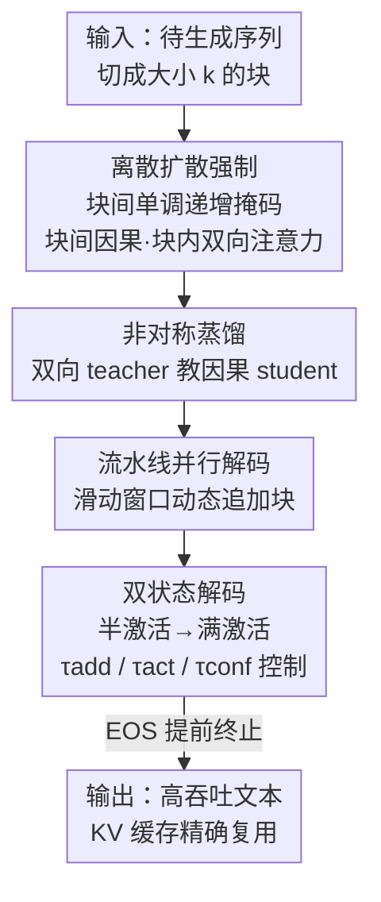

# Diffusion LLMs Can Do Faster-Than-AR Inference via Discrete Diffusion Forcing

**会议**: ICLR2026  
**OpenReview**: [https://openreview.net/forum?id=t5uLZSRjhF](https://openreview.net/forum?id=t5uLZSRjhF)  
**代码**: https://github.com/SJTU-DENG-Lab/Discrete-Diffusion-Forcing  
**领域**: LLM效率 / 扩散语言模型 / 推理加速  
**关键词**: 扩散语言模型、离散扩散强制、块级自回归、KV 缓存、并行解码

## 一句话总结
本文提出离散扩散强制（D2F），把预训练扩散语言模型（dLLM）改造成「块级自回归 + 块间并行解码」的 AR-扩散混合范式，靠非对称蒸馏低成本获得该能力、再配流水线并行解码，首次让开源 dLLM 的推理吞吐反超同规模自回归 LLM（GSM8K 上比 LLaMA3 快 2.5×，比原始 dLLM 快 50×）。

## 研究背景与动机
**领域现状**：自回归（AR）LLM 长期统治文本生成，但天然受限于逐 token 串行解码。扩散语言模型（dLLM，如 LLaDA、Dream）改用「从全掩码序列迭代去噪」的方式，理论上能一次并行预测多个 token，被视为打破 AR 延迟瓶颈的有希望路线。闭源 dLLM（Gemini Diffusion、Mercury、Seed Diffusion）确实跑出了每秒数千 token、比同规模 AR 快 5–10 倍的速度。

**现有痛点**：可在开源社区里，**没有任何一个 dLLM 的推理速度真正超过同规模 AR 模型**。原因有两个硬伤：① dLLM 用的是双向注意力，与标准 KV 缓存天然冲突——每步去噪都要对整条序列重算，冗余计算极大；② 并行解码依赖「条件独立假设」，很难一次性生成相互依赖的 token，要么质量塌，要么得加很多迭代步数补回来。

**核心矛盾**：想要 KV 缓存就得让生成变成「块级顺序」（先定下前面的块、缓存其状态），但块级顺序又会**禁掉块间并行**——后面的块必须等前面的块完全去噪完才能开始。已有工作（Block Diffusion 引入块级顺序拿到 KV 缓存，Fast-dLLM 用近似 KV 缓存 + 置信度重掩码）都卡在「KV 缓存」和「并行解码」二者只能取其一，所以速度始终追不上 AR。

**本文目标**：同时拿到两件看似互斥的东西——既要**块级因果结构以便精确 KV 缓存**，又要**允许后续块在前块没去噪完时就提前并行解码**。

**切入角度**：作者注意到这正好和连续空间扩散里的「扩散强制」（Diffusion Forcing, DF，被用于视频生成）精神一致——DF 让模型学会在「带噪、不完整的前提」上预测下一帧。把 DF 从连续数据迁移到离散 token 序列，就能让 dLLM 学会「在部分去噪的前缀上预测后续块」。

**核心 idea**：给序列里不同块施加**单调递增的掩码比例**（越靠前越干净、越靠后越被掩），并把注意力约束成**块间因果、块内双向**；这样前面的块能先完成并缓存 KV，后面的块基于不完整前缀提前并行解码——即离散扩散强制（D2F），再用非对称蒸馏从现成 dLLM 低成本"翻新"出这个能力。

## 方法详解

### 整体框架
D2F 的目标：把一个普通双向 dLLM 改造成支持「精确 KV 缓存 + 块间并行解码」的混合模型，从而把推理加速到反超 AR 的程度。整条管线分三步：① **离散扩散强制**重新定义生成范式——把答案切成大小为 $k$ 的块，对各块施加单调递增掩码比例，注意力设为块间因果、块内双向，让模型学会「在带噪前缀上预测后续块」；② **非对称蒸馏**——不从头训练，而是用一个全局双向的 teacher dLLM 去教一个只能看因果前缀的 student（D2F 模型），把 teacher 的掩码预测能力"塞"进 student；③ **流水线并行解码**——推理时维护一个滑动的活跃块窗口，动态追加新块、用双状态机制控制每个块的解码激进程度，配合 KV 缓存边算边缓存。

### 关键设计

**1. 离散扩散强制（D2F）：用块间单调递增掩码同时解锁 KV 缓存与块间并行**

这一步针对的就是「KV 缓存」和「块间并行」二选一的核心矛盾。D2F 把干净序列 $Y^0$ 切成 $N$ 个大小为 $k$ 的块 $\{Y_{B_1},\dots,Y_{B_N}\}$，前向过程对各块施加**单调递增的噪声调度** $t_1 < t_2 < \dots < t_N$，即越靠前的块掩码越少（越完整）、越靠后的块掩码越多（越不确定）。反向过程训练模型刻画

$$p_\theta(Y^0|Y^t) = \prod_{i=1}^{N} p_\theta\big(Y^0_{B_i} \mid Y^{t_1}_{B_1}, \dots, Y^{t_i}_{B_i}\big),$$

注意第 $i$ 个块只条件于**它自己及之前的块**（因果视野），而不看后面的块。这带来两个直接好处：① 因为越靠前的块越干净、能先完成解码，其 KV 状态可以被缓存供后续精确复用——作者把注意力约束成**块间因果、块内双向**正是为了保证缓存的 KV 不会因后续 token 解码而失效（这是 Fast-dLLM 近似缓存做不到的，它的双向注意力会让缓存状态被后解码 token 污染）；② 模型在训练时就被逼着「从不完整的前缀预测后续块」，于是推理时前块还没去噪完，后块就能同时往前推进，实现真正的块间并行。作者点明这正是连续空间「扩散强制」在离散序列上的扩展，故命名 discrete diffusion forcing。

**2. 非对称蒸馏：用全局视野 teacher 低成本翻新出因果 student**

从头训练数十亿参数的 dLLM 代价极高，所以 D2F 选择从社区现成的双向 dLLM 蒸馏。设 $p_{\phi^-}$ 为标准双向 teacher、$p_\theta$ 为 student（$\theta$ 用 $\phi^-$ 初始化），两者**架构上唯一区别就是注意力掩码**：teacher 用双向、student 用块间因果。蒸馏损失为

$$\mathcal{L}_{\text{D2F}} = \mathbb{E}_{t_1<\dots<t_N}\Bigg[\sum_{i=1}^{N} D_{\mathrm{KL}}\Big( p_\theta(Y^0_{B_i}\mid Y^{t_1}_{B_1},\dots,Y^{t_i}_{B_i}) \,\big\|\, p_{\phi^-}(Y^0_{B_i}\mid Y^{t_1}_{B_1},\dots,Y^{t_N}_{B_N}) \Big)\Bigg].$$

「非对称」体现在：teacher 预测每个块 $Y^0_{B_i}$ 时拥有**所有噪声块的全局视野**（条件到 $Y^{t_N}_{B_N}$），而 student 只能用**因果受限视野**（条件到 $Y^{t_i}_{B_i}$）去逼近 teacher 的输出分布。这样做的好处是：现成 dLLM 的掩码预测能力被直接"嫁接"进新的因果模型，避免了从头训练的高昂成本——论文里只用 8 张 A100 蒸馏 12 小时、并用 LoRA（rank 32）微调 q/k/v/o 投影，就完成了改造。这个目标也与视频生成里 CausVid 把整体扩散视频生成器蒸馏成流式生成器的思路同源。

**3. 流水线并行解码：滑动窗口 + 动态追加块榨取块间并行**

训练拿到能力后，推理需要一套调度算法把块间并行真正跑起来。D2F 维护一个**滑动的活跃块窗口**：从一个全掩码块开始，当最后一个块的已解码 token 比例超过阈值 $\tau_{\text{add}}$ 时，就**动态追加一个新的全掩码块**。这种动态策略相比「全程维护一长串块」大幅降低了每步计算量。每个块用 $\tau_{\text{conf}}$ 做置信度过滤：只接受预测置信度高于 $\tau_{\text{conf}}$ 的位置上的 token、其余位置重新掩码；对 Instruct 模型还能靠检测 `<EOS>` 提前终止、避免无谓生成（这是 D2F 在某些任务上拿到 50× 加速的关键来源之一）。

**4. 双状态解码：用「半激活→满激活」缓冲过早激进解码的质量损失**

作者观察到：对一个刚追加进来的新块就激进地并行解码，会明显掉点（因为它的前缀上下文还没积累够）。为此引入**双状态机制**：新块初始化为**半激活态**做保守并行解码，仅当其前驱块完成了 $\tau_{\text{act}}$ 比例的解码（即上下文信息已积累充分）后，才转为**满激活态**。两种状态都沿用 Fast-dLLM 的置信度准则接受高置信 token，但满激活块更激进——当没有任何 token 置信度超过 $\tau_{\text{conf}}$ 时，它会**强制选出置信度最高的那个 token** 解码，保证流水线不停滞。当 $\tau_{\text{add}} = \tau_{\text{act}}$ 时退化为「新块立即激活」的单状态；实验显示双状态（$\tau_{\text{add}} < \tau_{\text{act}}$）一致更优。动态块管理与双状态机制协同，把「每步效率」和「块间并行」两者兼顾起来。

### 一个例子：流水线如何边推进边追加
以 $\tau_{\text{add}}=\tfrac13$、$\tau_{\text{act}}=\tfrac56$ 为例走一遍：初始只有块 $B_1$（全掩码）。模型前向一步后 $B_1$ 解出若干 token，当 $B_1$ 完成比例超过 $\tfrac13$，就追加一个半激活的新块 $B_2$——此时 $B_1$、$B_2$ 在同一次前向里**并行**被推进，但 $B_2$ 保守解码。等 $B_1$ 完成度超过 $\tfrac56$，$B_2$ 升级为满激活、开始更激进地一步解多 token，同时若 $B_2$ 完成比例又过 $\tfrac13$，再追加 $B_3$……如此形成一条「前块边收尾、后块边起步」的流水线；已完成的块 KV 被缓存复用，整条序列从不需要重算。这正是吞吐相对原始 dLLM 暴涨数十倍的来源。

### 损失函数 / 训练策略
训练目标即上文非对称蒸馏的 KL 损失 $\mathcal{L}_{\text{D2F}}$（按掩码 token 聚合 KL 散度）。数据用 Bespoke-Stratos-17k 派生集（第三方用 Qwen2.5-7B 生成的回答，预过滤到最长 600 token）。块大小 $k=16$，块级单调递增掩码比例上限 0.7、下限 0.2（借鉴 Block Diffusion）；序列截断/补齐到 1024 token；用 LoRA（rank 32、scaling 32、dropout 0.1）只调 q/k/v/o 投影；AdamW + 常数学习率 $10^{-5}$，8×A100-40GB 训练 12 小时。推理默认 $\tau_{\text{conf}}=0.9$、$\tau_{\text{add}}=0.1$、$\tau_{\text{act}}=0.95$。

## 实验关键数据

### 主实验
在 LLaDA-Instruct-8B 与 Dream-Base-7B 两个 backbone 上，对比 dLLM-Cache、Fast-dLLM（Prefix/Dual-Cache）等加速方法，并与同规模 AR（LLaMA3-Instruct-8B、Qwen2.5-Base-7B）比吞吐。TPS = tokens/second。

| 测试集 | 方法 | TPS↑ | 加速比 | Score↑ |
|--------|------|------|--------|--------|
| GSM8K-4shot | LLaDA-Instruct | 7.2 | 1.0× | 77.4 |
| GSM8K-4shot | Fast-dLLM(Dual) | 35.2 | 4.9× | 78.9 |
| GSM8K-4shot | **D2F-LLaDA** | **52.5** | **7.3×** | 77.3 |
| MBPP-3shot | LLaDA-Instruct | 0.9 | 1.0× | 39.0 |
| MBPP-3shot | **D2F-LLaDA** | **47.6** | **52.9×** | 38.0 |
| GSM8K-CoT-8shot | Dream-Base | 9.5 | 1.0× | 75.0 |
| GSM8K-CoT-8shot | **D2F-Dream** | **91.2** | **9.6×** | 77.6 |

faster-than-AR 关键结论（最大生成长度统一 512）：D2F-Dream-Base-7B 在 GSM8K 上跑到 **119.9 tokens/s**，相对 LLaMA3-Instruct-8B（48.0）快 **2.5×**、相对 Qwen2.5-Base-7B（52.7）快 2.3×——这是首个推理吞吐反超 AR 的开源 dLLM。在 HumanEval 上比 LLaMA3 快 1.6×。此外 D2F 能把 DiffuCoder 加速最高 11.8× 且不掉性能。

### 消融实验

| 配置 | 关键指标 | 说明 |
|------|---------|------|
| 双状态 ($\tau_{\text{add}}<\tau_{\text{act}}$) | $\tau_{\text{act}}=0.85$ 下 74.2 分 / 139.0 TPS | $\tau_{\text{add}}$ 从 0.85 降到 0.7：分数 72.6→74.2、TPS 136.8→139.0 |
| 单状态 ($\tau_{\text{add}}=\tau_{\text{act}}$) | $\tau_{\text{act}}=0.85$ 下 72.6 分 | 新块立即激活，分数更低 |
| D2F 单调噪声调度 | MBPP TPS 171.2 / 54.6 分 | vs random 调度（147.2 / 49.6）：同时更快更好 |
| Block size = 48（推理） | GSM8K 峰值 77.5 分 | 块越大吞吐越低，但分数先升后降，48 是甜点 |

### 关键发现
- **早终止是大加速来源**：D2F-LLaDA 在 MBPP 上拿到 52.9× 加速，很大程度来自 Instruct 模型靠 `<EOS>` 检测提前终止、避免无谓生成。
- **吞吐-性能 trade-off 远优于原始 dLLM**：原始 Dream-Base 把采样步数从 512 砍到 128 时 GSM8K 从 71.4 暴跌到 42.8；D2F 在 150.9 tokens/s（3.1× LLaMA3 吞吐）时仍拿 71.2 分、超过 LLaMA3 的 70.1。
- **双状态设计始终优于单状态**：保守的半激活初始态能缓冲过早激进解码的质量损失。
- **不同 backbone 用不同最大长度对齐各自 baseline 协议**：LLaDA 用 512、Dream 用 256（Dream 难以正确生成停止符），横向比 TPS 时需注意这一 caveat，不可直接跨表比大小。

## 亮点与洞察
- **把"扩散强制"从连续域迁到离散域**：核心洞察是「KV 缓存要块级因果、并行解码要敢在不完整前缀上预测」二者其实能用「单调递增掩码 + 块间因果注意力」同时满足——一个很优雅的范式重构，而非小修小补。
- **非对称蒸馏是低成本翻新的关键**：teacher/student 仅注意力掩码不同，让现成 dLLM 的能力几乎零损耗地"嫁接"成因果模型，8×A100 训 12 小时即可，复现门槛低。
- **双状态 + 动态追加块**：把视频生成里的流式/因果生成思路（CausVid、Diffusion Forcing）成功搬到文本 dLLM，半激活缓冲这个工程巧思可迁移到其他「流水线式并行生成」场景。
- **首次让开源 dLLM 反超 AR**：把 dLLM"理论上能并行"的潜力第一次真正变现成"实测吞吐超 AR"，对 dLLM 路线的实用价值是里程碑式的证明。

## 局限与展望
- **依赖现成 dLLM 蒸馏**：D2F 不是从头训练，能力上限受 teacher dLLM 约束；若 teacher 本身某任务弱，student 也难超越。
- **超参较多需逐 benchmark 调**：$\tau_{\text{conf}}$、$\tau_{\text{add}}$、$\tau_{\text{act}}$、块大小都影响吞吐-质量平衡，论文对每个 benchmark 用了不同推理超参（附录 D），实际部署需要调参。
- **评测集中在数学/代码**：实验主要在 GSM8K/MATH/HumanEval/MBPP 上，开放域长文本生成、对话等更"token 强依赖"的场景下并行解码是否仍能保质，论文未充分验证。
- **不同 backbone 用不同最大长度**（512 vs 256）虽各自对齐 baseline，但也让跨模型吞吐对比不能直接比绝对值。

## 相关工作与启发
- **vs Block Diffusion**：都用块级顺序生成来拿 KV 缓存，但 Block Diffusion 用 teacher-forcing 训练、要求前块完全去噪才能预测后块，**禁掉了块间并行**；D2F 用扩散强制让模型学会从不完整前缀预测后块，解锁块间并行，这是速度反超的根本区别。
- **vs Fast-dLLM**：Fast-dLLM 也走块级生成 + 置信度重掩码并行解码，但它用的是**近似 KV 缓存**——双向注意力下，缓存状态会被后解码 token 污染而有偏；D2F 用块间因果注意力保证 KV 精确可复用，所以既快又稳。D2F 也复用了 Fast-dLLM 的置信度准则。
- **vs dLLM-Cache**：dLLM-Cache 走缓存近似复用静态序列部分的计算，加速有限（多在 1–3×）；D2F 从生成范式层面重构，加速可达数十倍。
- **vs Diffusion Forcing / CausVid（视频生成）**：D2F 把连续空间的扩散强制和流式蒸馏思想迁移到离散文本 dLLM，是一次成功的跨模态范式借鉴。

## 评分
- 新颖性: ⭐⭐⭐⭐⭐ 把扩散强制迁到离散域、用单调掩码同时解锁 KV 缓存与块间并行，是范式级重构
- 实验充分度: ⭐⭐⭐⭐ 两 backbone × 多 benchmark + 充分消融，但评测集中在数学/代码、跨模型长度不一
- 写作质量: ⭐⭐⭐⭐⭐ 动机推导清晰，训练/推理两套算法 + 图示讲得很透
- 价值: ⭐⭐⭐⭐⭐ 首个反超 AR 的开源 dLLM，对扩散语言模型实用化是里程碑

<!-- RELATED:START -->

## 相关论文

- [\[ICLR 2026\] NI Sampling: Accelerating Discrete Diffusion Sampling by Token Order Optimization](ni_sampling_accelerating_discrete_diffusion_sampling_by_token_order_optimization.md)
- [\[ICML 2026\] Fast-dLLM++: Fréchet Profile Decoding for Faster Diffusion LLM Inference](../../ICML2026/llm_efficiency/fast-dllm_fréchet_profile_decoding_for_faster_diffusion_llm_inference.md)
- [\[ICLR 2026\] DPad: Efficient Diffusion Language Models with Suffix Dropout](dpad_efficient_diffusion_language_models_with_suffix_dropout.md)
- [\[ICLR 2026\] FlashDLM: Accelerating Diffusion Language Model Inference via Efficient KV Caching and Guided Diffusion](flashdlm_accelerating_diffusion_language_model_inference_via_efficient_kv_cachin.md)
- [\[ICLR 2026\] Planned Diffusion](planned_diffusion.md)

<!-- RELATED:END -->
