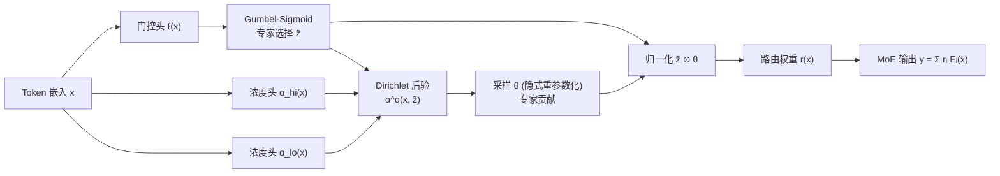

# DirMoE: Dirichlet-Routed Mixture of Experts

**会议**: ICLR 2026  
**arXiv**: [2602.09001](https://arxiv.org/abs/2602.09001)  
**OpenReview**: [https://openreview.net/forum?id=a15cDnzr6r](https://openreview.net/forum?id=a15cDnzr6r)  
**代码**: 待确认  
**领域**: LLM 高效化 / MoE 路由  
**关键词**: Mixture-of-Experts, 可微路由, Dirichlet 变分, Gumbel-Sigmoid, 稀疏性控制, 专家特化  

## 一句话总结
DirMoE 把 MoE 路由拆成"选哪些专家(Bernoulli/Gumbel-Sigmoid)"和"选中专家间如何分配权重(Dirichlet)"两个解耦决策，用一个 Dirichlet 变分自编码器框架做到全程端到端可微，并给出一个有理论保证的"稀疏旋钮" λ 来直接校准稀疏度，无需辅助负载均衡损失即可提升专家特化。

## 研究背景与动机
- **领域现状**：稀疏 MoE 通过把每个 token 路由给少数专家来扩容量而不等比增计算，路由器是核心。主流路由器是 Top-k+Softmax（GShard、Switch），靠容量约束 + 辅助均衡损失维持稳定。
- **现有痛点**：Top-k 的离散选择步骤**不可微**，需要靠温度调节、辅助损失、直通估计器(STE)等二级目标来"逼"出稀疏，复杂且难校准；ReMoE 等连续门控虽恢复了梯度，但仍要辅助稀疏损失，会注入干扰梯度、抑制专家特化，与容量丢 token 结合时还会不稳定。
- **核心矛盾**：单个 Softmax 把"**选哪些专家**(selection)"和"**选中后各占多少**(contribution)"两件事**纠缠**在一起——负载均衡和混合权重校准被同一个温度耦合，导致专家使用不可解释、负载分布不均。
- **本文目标**：要一个路由机制既 (i) 保持全程可微，又 (ii) 对专家选择和概率分配提供**显式、可解释**的控制。
- **核心 idea**：**用 spike-and-slab 先验把路由分解为"二元选择掩码 z"+"单纯形上的 Dirichlet 混合权重 θ"，最终路由权重是两者归一化后的 Hadamard 积；选择用 Gumbel-Sigmoid 松弛、Dirichlet 用隐式重参数化，全程可微，并利用"Dirichlet 子集质量服从 Beta 分布"推出单参数稀疏旋钮。**

## 方法详解

### 整体框架
DirMoE 把标准 MoE 路由器替换为一个 Dirichlet 变分路由器：给定 token 嵌入 $x$，三个头分别产出门控 logits $\ell(x)$、活跃浓度 $\alpha_{hi}(x)$ 和非活跃浓度 $\alpha_{lo}(x)$。门控 logits 经 Gumbel-Sigmoid 得到松弛的**专家选择向量** $\tilde z\in(0,1)^E$；以 $\tilde z$ 为条件的 Dirichlet 后验采样出**专家贡献** $\theta\in\Delta^{E-1}$；最终路由权重 $r(x)=\text{normalize}(\tilde z\odot\theta)$，再加权聚合专家输出。训练用变分 ELBO（重构 + Dirichlet KL + 稀疏惩罚），并对温度和 Dirichlet 浓度做调度，把模型从"探索态"逐步推向"决断态"。

### 关键设计

**1. 单纯形上的 spike-and-slab 分解：解开"选谁"和"占多少"。** DirMoE 的出发点是用 spike-and-slab 先验把路由的两个决策正式拆开：选择掩码 $z\in\{0,1\}^E$ 是 spike（决定哪些专家活跃），单纯形向量 $\theta\in\Delta^{E-1}$ 是 slab（决定活跃专家间的质量分配）。联合分布写成 $p(z,\theta\mid x)=\prod_i \text{Bernoulli}(z_i\mid\pi_i(x))\times \text{Dir}(\theta\mid\alpha^{(p)}(z))$。slab 用两级浓度 $\alpha_i^{(p)}(z)=\lambda\big(z_i\alpha_{hi}+(1-z_i)\alpha_{lo}\big)$，其中 $\alpha_{hi}>\alpha_{lo}>0$：活跃专家拿高浓度、非活跃专家拿低浓度（抑制漏到非活跃专家的质量），$\lambda$ 是全局尺度——$\lambda$ 大则采样紧贴均值更均匀，$\lambda$ 小则方差大、质量更多落在单纯形顶点（更稀疏）。这一分解是后面所有可微化和稀疏校准的地基。

**2. 全程可微路由：Gumbel-Sigmoid + Dirichlet 隐式重参数化。** 为让梯度穿过离散选择，选择向量用二元 Gumbel-Sigmoid 采样 $\tilde z_i=\sigma\big((\ell_i(x)+g_i)/\tau_z\big)$，$g_i\sim\text{Logistic}(0,1)$，温度 $\tau_z\downarrow 0$ 时 $\tilde z$ 趋近二值。以 $\tilde z$ 为条件，后验是 $q_\phi(\theta\mid x,\tilde z)=\text{Dir}(\alpha^{(q)}(x,\tilde z))$，其中 $\alpha_i^{(q)}=\lambda^{(q)}\big(\tilde z_i\alpha_{hi,i}(x)+(1-\tilde z_i)\alpha_{lo,i}(x)\big)$，通过归一化 Gamma 的隐式重参数化采样。先验用同样的松弛门 $\tilde z$ 以保持闭式 KL。最终 $r(x)=\text{normalize}(\tilde z(x)\odot\theta(x))$——梯度同时穿过 Binary-Concrete 松弛和 Dirichlet，整条前向不再需要 STE 或离散 Top-k。

**3. 变分训练目标 + 显式稀疏惩罚。** 每个 token 优化 $\mathcal{L}_{\text{DirMoE}}=-\mathbb{E}_q[\log p_\psi(x\mid r(x))] + \beta_\theta\,\mathbb{E}_q[D_{KL}(\text{Dir}(\alpha^{(q)})\|\text{Dir}(\alpha^{(p)}))] + R_{\text{sparsity}}$，$\beta_\theta=1$ 时退化为标准 ELBO，总损失 $\mathcal{L}_{\text{total}}=\mathcal{L}_{LM}+\mathcal{L}_{\text{DirMoE}}$。稀疏项不是间接的辅助均衡损失，而是直接在期望上约束活跃专家数为 $k$：$R_{\text{sparsity}}(x)=\lambda_{\text{sparsity}}\big(\sum_i\tilde z_i(x)-k\big)^2$。实验证明 $\lambda_{\text{sparsity}}$ 越大越能精确逼近目标稀疏 $1-k/E$，$\lambda_{\text{sparsity}}=0$ 时达不到期望稀疏。

**4. 有理论保证的"稀疏旋钮" λ。** 这是论文最漂亮的一笔：利用 Dirichlet 的性质——任意子集的质量和服从 Beta 分布——把稀疏度变成一个可解析校准的标量。活跃集 $S$ 上的总质量 $T=\sum_{i\in S}\theta_i\sim\text{Beta}(k\lambda^{(p)}\alpha_{hi},(E-k)\lambda^{(p)}\alpha_{lo})$，期望 $\mathbb{E}[T]=m=\frac{k\alpha_{hi}}{k\alpha_{hi}+(E-k)\alpha_{lo}}$，于是给定目标质量分数 $m$ 可解出比值 $r=\alpha_{hi}/\alpha_{lo}=\frac{m}{1-m}\cdot\frac{E-k}{k}$。再用 Simpson 指数 $H(p)=\sum_i p_i^2$ 度量稀疏，定理证明 $\mathbb{E}[H(p)]=\frac{\lambda S_2/B+1}{\lambda B+1}$ 关于浓度 $\lambda$ **严格单调递减**（从 $\lambda\to 0$ 的 $H=1$ 降到 $\lambda\to\infty$ 的 $\sum m_i^2$）。这给出两个实用校准器：对称基下目标 Simpson $h$ 直接映射 $\lambda=\frac{1-h}{hE-1}$；两组(Beta)校准下给定方差 $v_{\text{tar}}$ 得 $\lambda=\frac{m(1-m)/v_{\text{tar}}-1}{s\alpha_{hi}+(E-s)\alpha_{lo}}$。这样 $k$ 干净地决定"几个专家参与"，$\lambda$ 干净地决定"它们共占多少、多集中"——两个旋钮正交。配合温度调度 $\tau_z^{(t)}=\max(\tau_{\min},\tau_0\rho^t)$（早探索、晚决断）和浓度调度，模型平滑收敛到决断性路由。

## 实验关键数据

骨干为 185M 参数的 LLaMA（12 层、RMSNorm、SwiGLU、RoPE、GQA），在 The Pile 上训练约 30B tokens（zero-shot 60k 步，消融 10k 步），基于 Megatron-LM，用 4–8 张 H100。

### 主实验：Zero-shot 准确率（%，越高越好）

| 方法 | ARC-c | ARC-e | BoolQ | HellaSwag | LAMBADA | PIQA | RACE | Avg. |
|------|-------|-------|-------|-----------|---------|------|------|------|
| Hash | 19.28 | 45.45 | 54.95 | 29.68 | 31.44 | 63.06 | 27.66 | 38.79 |
| Lory | 20.31 | 42.97 | 49.54 | 28.75 | 32.35 | 62.24 | 27.75 | 37.70 |
| SparseMixer-v2 | 19.80 | 46.72 | 45.96 | 30.24 | 34.12 | 62.89 | 29.00 | 38.39 |
| Expert Choice | 18.86 | 42.97 | 60.21 | 29.14 | 29.26 | 61.92 | 27.37 | 38.53 |
| Switch MoE† | 20.09 | 44.23 | 57.83 | 29.68 | 32.97 | 63.55 | 27.96 | 39.47 |
| ReMoE | 20.22 | 46.68 | 54.16 | 30.26 | **35.94** | 63.55 | 29.38 | 40.03 |
| **DirMoE (ours)** | **20.57** | 46.20 | **61.52** | 29.93 | 36.44 | **63.75** | 29.52 | **41.13** |

平均分 41.13 领先最强基线 ReMoE(40.03)约 1.1 点，BoolQ 上优势最明显(+1.3 vs EC)。

### 训练效率（LLaMA-185M, E=8, k=1）

| 方法 | 迭代时间(ms)↓ | 吞吐(TFLOP/s/GPU)↑ |
|------|----------------|---------------------|
| Vanilla MoE (Switch) | 431.5 | 138.2 |
| DirMoE (ours) | 437.3 | 137.2 |

计算开销额外不到 1%，与 vanilla MoE 基本持平（同样用 all-to-all dispatch + grouped-GEMM）。

### 消融与分析（图表形式）
- **稀疏正则的必要性**：$\lambda_{\text{sparsity}}=0.01$ 能稳定逼近目标稀疏，$=0$ 时稀疏明显不足。
- **$m$ 与 $\lambda$ 的解耦**：固定 Beta 方差 0.01，$m$ 下降时由公式算出的 $\lambda$ 上升以保持相近稀疏(Fig.3b)，只改变活跃专家间的贡献分布(Fig.3a) —— 验证了"选谁/占多少"两旋钮正交。
- **可扩展性**：在 $k\in\{1,2,3\}$、$E\in\{8,16,32,48\}$ 下训练稳定、都能达到期望稀疏。

### 关键发现
- **无需辅助负载均衡损失**也能控制稀疏并**提升专家特化**：Fig.5 显示 DirMoE 各层各 domain 的专家路由比 vanilla MoE 更偏离均匀分布（特化更强），代价是可接受的轻微负载不对称；vanilla MoE 强制均衡反而同质化专家、削弱语义聚焦。

## 亮点与洞察
- **概念解耦清晰**：把"哪些专家活跃"和"活跃专家间如何分配"显式拆成 Bernoulli + Dirichlet 两个变量，是对 Top-k+Softmax "一个温度管两件事"的根本性回应。
- **稀疏可校准且有证明**：Lemma/Theorem 给出 Simpson 指数随 Dirichlet 浓度单调递减，把"调稀疏"从玄学温度调参变成解析公式 $\lambda=\frac{1-h}{hE-1}$，可解释性极强。
- **去掉辅助损失**：直接 ELBO + 期望约束 $\sum\tilde z_i\approx k$，避免了辅助均衡损失注入的干扰梯度，反而换来更好特化。
- **白盒路由**：选择向量与贡献向量天然暴露"谁活跃、各占多少"，对 MoE 可解释性研究友好。

## 局限与展望
- **规模有限**：仅在 185M LLaMA + 30B tokens 上验证，未证明在数十亿参数、主流 MoE 规模下能否保持稳定与优势。
- **超参偏多**：温度调度 $(\tau_0,\rho,\tau_{\min})$、浓度衰减 $(\gamma,\eta)$、$\beta_\theta$、$\lambda_{\text{sparsity}}$ 等需要联合调度，工程上比 Top-k 复杂；论文也坦言要分清调后验 $\lambda^{(q)}$ 还是先验 $\lambda^{(p)}$。
- **负载不对称**：去掉均衡损失带来"轻微负载不对称"，大规模下是否影响专家并行效率仍待验证。
- **未来方向**：作者展望两点——概率化建模可能提升鲁棒性；解耦的路由变量可能催生更单义(monosemantic)的专家特化，利于可解释性。

## 相关工作与启发
- **Top-k+Softmax 路由**：GShard、Switch、GLaM 靠辅助均衡 + 容量控制，离散选择不可微是本文要解的根本痛点。
- **可微路由**：Soft-MoE(软分配)、ReMoE(ReLU 路由 + 显式稀疏)、Lory(段路由全可微) —— DirMoE 与之同属"恢复端到端梯度"路线，但额外提供了 spike-and-slab 解耦和理论化稀疏旋钮。
- **可变 k / 动态深度**：DynMoE、DA-MoE 学每 token 专家数，MoD、A-MoD 在层维度分配算力 —— 与 DirMoE 的"按需稀疏"理念互补。
- **启发**：把变分推断(Dirichlet VAE)引入路由器，提示"路由本质是一个带不确定性的概率分配问题"；Beta/Simpson 解析校准的思路可迁移到其他需要"可控稀疏"的门控/注意力稀疏化场景。

## 评分
- **新颖性**: ⭐⭐⭐⭐⭐ 用 Dirichlet 变分自编码器重新表述 MoE 路由、解耦选择与贡献、并给出有证明的稀疏旋钮，是 MoE 路由领域少见的"换框架"工作。
- **实验充分度**: ⭐⭐⭐ 7 个 zero-shot 基准 + 效率 + 稀疏/可扩展消融较完整，但模型只到 185M、缺乏大规模与下游微调验证，说服力受限。
- **写作质量**: ⭐⭐⭐⭐ 动机清晰、理论部分(Lemma/Theorem/Corollary)严谨、图示到位；超参调度细节略多但有 Appendix 兜底。
- **价值**: ⭐⭐⭐⭐ 提供了一个可解释、可校准、无需辅助均衡损失的可微路由器，对追求专家特化与可控稀疏的 MoE 研究有清晰借鉴价值。

<!-- RELATED:START -->

## 相关论文

- [\[ICLR 2026\] Understanding the Mixture-of-Experts with Nadaraya-Watson Kernel](understanding_the_mixture-of-experts_with_nadaraya-watson_kernel.md)
- [\[ICLR 2026\] Mixture-of-Experts Can Surpass Dense LLMs Under Strictly Equal Resource](mixture-of-experts_can_surpass_dense_llms_under_strictly_equal_resource.md)
- [\[ICLR 2026\] Expert Merging in Sparse Mixture of Experts with Nash Bargaining](expert_merging_in_sparse_mixture_of_experts_with_nash_bargaining.md)
- [\[ICLR 2026\] Routing Manifold Alignment Improves Generalization of Mixture-of-Experts LLMs](routing_manifold_alignment_improves_generalization_of_mixture-of-experts_llms.md)
- [\[ICML 2025\] Mixture of Lookup Experts](../../ICML2025/llm_efficiency/mixture_of_lookup_experts.md)

<!-- RELATED:END -->
