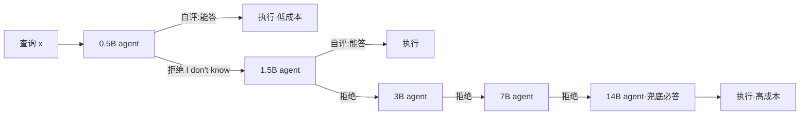

# DiSRouter: Distributed Self-Routing for LLM Selections

**会议**: ICLR 2026  
**OpenReview**: [https://openreview.net/forum?id=KDcwXKr0NU](https://openreview.net/forum?id=KDcwXKr0NU)  
**代码**: 待确认  
**领域**: LLM 高效推理 / 查询路由（Query Routing）  
**关键词**: LLM Routing, Model Selection, Self-Awareness, Distributed System, Cost-Performance Trade-off  

## 一句话总结
DiSRouter 把传统的"中心化外部路由器"换成"让每个 LLM 自己判断要不要答"的分布式自路由范式：查询在一串按成本递增排列的 LLM agent 之间传递，每个 agent 凭自我认知决定是回答还是甩给下一个更强的模型，从而在性能与成本之间取得更优的效用（Utility）。

## 研究背景与动机
**领域现状**：LLM 生态高度异质——从边端可跑的 0.5B 小模型到云端的 14B/旗舰大模型，性能和成本相差悬殊。"查询路由 / 模型选择"因此成为热门方向，连 GPT-5 都用上了多模型 + 实时路由的统一架构。主流做法是训练一个**中心化路由器**（打分模型）来评估查询难度、预测某个 LLM 能不能答对，然后把查询派给"最小的能答对的模型"。

**现有痛点**：中心化路由器有两个根本缺陷。其一是**灵活性差**——路由器是在固定的候选 LLM 集合上训练的，一旦要加新模型或更新某个 agent，就得把整个路由系统重训一遍，系统僵化、可扩展性被破坏。其二是**能力评估不准**——路由器通常是个小模型，根本没有能力去理解大模型的内在知识边界，对"这个查询某个大模型到底能不能答对"判断不可靠，成为整个系统的瓶颈。

**核心矛盾**：路由决策的本质是判断"某模型在某查询上的胜任度"，但**让一个外部小模型去隔空评估大模型的知识边界**，天然比让模型自己判断要困难。外部评估（external assessment）与被评估对象的能力之间存在信息鸿沟。

**本文目标**：用一个不依赖外部路由器、可即插即用增删 agent、且能随用户偏好（重性能 vs 重成本）动态调整的分布式系统，在多场景下取得比中心化路由更高的效用与更强的泛化性。

**核心 idea**：**「自我认知优于外部评估」**——与其训一个隔空打分的外部路由器，不如**赋能每个 agent 自己评估胜任度并自主决定答还是转发**。把抽象的"自我认知"落地成一个具体动作：confident 就答、不 confident 就"拒绝（I don't know）"并转给下一个更大的模型。再配一套**带局部奖励的两阶段自我认知训练**，让每个 agent 都能独立、并行地被训练。

## 方法详解

### 整体框架
DiSRouter 把单一中心路由器替换成一个**自评估 + 自主路由的 agent 网络**。论文中实例化为一条按模型尺寸/成本递增排列的**级联（cascade）**：查询从最小的 m₁ 进入，每个 agent mᵢ 的动作空间只有"执行查询"或"拒绝并转给 mᵢ₊₁"两种；最后一个 agent m_K 被固定为"永远执行"，充当兜底专家。路径在某个 agent 决定执行时终止，由于路由开销可忽略，系统总成本就等于最终执行模型的推理成本。整个系统的优化目标被**分解**成每个 agent 独立最大化各自局部效用 $U_i$，因此单个 agent 可以被独立训练/更新而无需全系统重训。

### 关键设计

**1. 分布式自路由范式：用"拒绝"动作把自我认知变成路由策略。** 传统路由把策略 π 写成一个全局映射 $\pi: X \to M$ 由中心路由器统一决策；DiSRouter 把它拆成分布在各 agent 上的**局部策略集合** $\Pi = \{\pi_1, \dots, \pi_K\}$，每个 $\pi_i(x)$ 只在自身及更高成本的 agent 中选目标，$\pi_i(x) \in \{m_j \in M \mid j \geq i\}$。落到级联结构上，动作被简化为二选一：答或拒。这个范式转变的好处直接来自分布式结构——增删一个模型不影响其他 agent 的局部策略，系统天然支持"即插即用"；而且让每个大模型用**自身的知识**判断知识边界，比小路由器隔空猜测更准。系统级目标 $\Pi^* = \arg\max_\Pi \mathbb{E}_{x\sim D}[A(\Pi(x), x) - \alpha \cdot C(\Pi(x))]$ 被分解为各 agent 独立优化 $\pi_i^* = \arg\max_{\pi_i} U_i(\pi_i)$，这正是"完全独立、可并行训练"的数学基础。

**2. 两阶段自我认知训练（SFT → RL）：先学会说"不知道"，再学准什么时候说。** 开源小模型本身的自我认知不可靠，于是先做 **SFT**：用目标 LLM 对每条训练查询做 N 次 CoT 采样，以答对频率衡量它对该查询的胜任度；答对频率低于阈值 δ 的查询被判为"不可答"，其回答被替换成"I don't know"，其余高胜任度查询则把思维链与答案规范成"Answer"模板。这样模型获得了基础的"拒绝行为"。SFT 之后再做 **RL** 进一步打磨，让模型把"什么时候该拒绝"学得更精准。两阶段都保持接受/拒绝样本各半以防偏置，每阶段各用 1 万条样本。

**3. 场景条件化的局部奖励：一个奖励函数同时实现可并行训练与场景自适应。** RL 的奖励设计是全文最精巧的一处：
$$
\text{reward}(x) = \begin{cases} 1, & \text{答对} \\ 0, & \text{答错} \\ (1-\alpha)^\gamma, & \text{拒绝} \end{cases}
$$
其中 α 是**偏好因子**（越大越重成本），γ 是**可靠性因子**（保证不过度为省钱牺牲精度）。关键在于这个奖励是**局部的**——每个 agent 只看自己答得对不对、拒不拒，不需要任何 agent 间通信，因此 K 个 agent 可以**完全独立、并行训练**。其合理性可由期望分析推出：模型答查询的期望奖励 $E[\text{answer}] = p(x)$（p 为胜任度），拒绝的期望奖励 $E[\text{reject}] = (1-\alpha)^\gamma$，于是模型选择回答当且仅当 $p(x) > (1-\alpha)^\gamma$。这说明**胜任度必须超过一个由 α 决定的阈值才回答**：α 越大（越重成本）阈值越低，agent 越"激进"地抢答小模型也能答的题。γ 控制这条阈值曲线的形状——γ=1 时线性，0<γ<1 时非线性（论文取 γ=0.5），刻画"大多数时候保持高可靠、只有极端省钱时才允许精度明显下降"的人类偏好。

**场景适配指令**：训练时把三个场景（Performance First α=0.2 / Balance α=0.5 / Cost First α=0.8）的偏好通过 prompt 指令显式告诉模型，并在 SFT 把拒绝阈值设为 δ=1−α（如性能优先 α=0.2 时 δ=0.8，只有高度自信才答）。这样**同一套系统**靠换 prompt 就能在三种场景间切换，无需像 GraphRouter 那样每个场景重训一次。

## 实验关键数据

**配置**：模型池为 Qwen2.5-Instruct 系列五个尺寸（0.5B→14B），成本归一化为 0.1→0.9。7 个域内数据集（GSM8K/ARC/MMLU/RACE/OpenbookQA/DROP/CosmosQA）训练+评测，3 个域外数据集（SQuAD/HellaSwag/HeadQA）测泛化。SFT/RL 各 1 万样本，A800 训练。

### 主实验（域内，效用 Utility ↑，越高越好）

| 方法 | 性能优先 α=0.2 | 平衡 α=0.5 | 成本优先 α=0.8 |
|---|---|---|---|
| Oracle（topline） | 0.87 | 0.79 | 0.70 |
| Smallest LLM | 0.36 | 0.33 | 0.30 |
| Largest LLM | 0.67 | 0.40 | 0.13 |
| Random | 0.58 | 0.44 | 0.30 |
| RouteLLM | 0.41 | 0.36 | 0.31 |
| FrugalGPT | 0.64 | 0.52 | 0.43 |
| Automix | 0.63 | 0.29 | 0.18 |
| FORC | 0.65 | 0.47 | 0.37 |
| GraphRouter | 0.68 | 0.53 | 0.45 |
| **DiSRouter (SFT)** | 0.72 | 0.57 | 0.43 |
| **DiSRouter (+RL)** | **0.73** | **0.61** | **0.52** |

三个场景下 DiSRouter 全部取得最高效用，且至少达到 Oracle topline 的 74.29%。

### 域外泛化（Balance α=0.5）

| 方法 | Accuracy ↑ | Cost ↓ | Utility ↑ |
|---|---|---|---|
| Oracle | 0.89 | 0.33 | 0.72 |
| GraphRouter | 0.64 | 0.49 | 0.39 |
| FrugalGPT | 0.55 | 0.25 | 0.42 |
| **DiSRouter (+RL)** | 0.69 | 0.43 | **0.48** |

域外效用仍领先所有 baseline，验证自我认知对未见数据集的判别力。

### 消融与分析

| 分析维度 | 关键结果 |
|---|---|
| SFT vs +RL | RL 阶段普遍降成本、升效用（如 Balance 域内 0.57→0.61），代价是略降准确率 |
| 模块化（5→3 agent，免重训） | 3-agent（1.5B/3B/14B）Balance 效用仍达 0.60，超所有 baseline；比 5-agent 略降属预期 |
| 系统级路由分布 | 场景从性能优先→成本优先，被路由到小模型的查询占比上升（如 0.5B：3.4%→8.1%，1.5B：32.9%→51.3%） |
| Agent 级答题率 | α 增大时每个 agent 的 answer rate 同步抬高（如 1.5B：35.6%→58.7%），无需显式协调即实现全局目标 |
| 难易区分 | 把 ≤3B 可解的查询定义为"易"，DiSRouter 对易/难查询的平均成本区分度显著优于 GraphRouter/FORC/FrugalGPT |

### 关键发现
- **+RL 的作用是"省成本"而非"提性能"**：论文专门验证训练不会直接提升任务准确率，效用增益来自更准的路由（更准的自我认知），而非模型变强了。
- **场景自适应是涌现的全局行为**：每个 agent 独立根据局部奖励调整阈值，系统级就自动呈现"重成本→更多查询走小模型"的策略迁移，无需 agent 间通信。
- **异质模型池同样有效**：在 Gemma-3、Phi-4 等不同架构混合的 agent 池上，训练管线与分布式架构依然奏效（附录 A.10）。

## 亮点与洞察
- **范式层面的转变**：把"路由"这件事从"外部裁判打分"重构为"选手自己举手/弃权"，本质是把决策权交还给最懂自己能力的主体，绕开了"小模型评估大模型"的信息鸿沟。
- **局部奖励是工程上的关键解锁点**：$(1-\alpha)^\gamma$ 这一项让 K 个 agent 的训练完全解耦，既支撑了"即插即用"的模块化，又用一个标量 α 把"性能-成本偏好"参数化进奖励，三场景一套系统搞定。
- **可解释性强**：system-level 路由分布与 agent-level 答题率两张图把"为什么省钱/为什么更准"讲得很清楚——阈值 $p(x) > (1-\alpha)^\gamma$ 给了一个干净的理论刻画。

## 局限与展望
- **评测只跑了级联结构**：论文反复强调框架支持 tree/mesh 等拓扑，但实验全在 cascade 上；分布式自路由在更复杂拓扑（非单调成本、并行投票）下的行为与收益仍是 open question。
- **动作空间被人为简化**：为方便评测强制"只能转给更高成本 agent"，丢掉了"横向/回退"等更一般的路由动作，真实分布式系统未必满足成本单调假设。
- **自我认知的天花板**：开源小模型即使训练后，自评估仍可能系统性高估/低估；γ=0.5 是个经验设定，可靠性与成本的权衡曲线如何随任务自适应尚未深究。
- **闭源强模型可免训直接接入**（附录 A.9 提到 GPT-4 类已有强自我认知），但开源-闭源混合池的协同与成本核算未充分展开。

## 相关工作与启发
- **中心化路由**：RouteLLM、FrugalGPT、FORC、GraphRouter 等都依赖外部打分/级联验证，DiSRouter 与之的根本区别在于"自评估"而非"他评估"，并因此获得免重训的模块化。
- **LLM 自我认知 / 弃权**：借鉴了用"I don't know"训练 LLM 可靠性的思路（Xu et al. 2024），把弃权行为复用为路由信号——这是把"知道自己不知道"这一能力直接产品化为系统级收益的一个漂亮范例。
- **对 multi-agent 系统的启发**：论文主张利用 LLM 内在自我认知比外部评估更有效，为更模块化、可扩展的多 agent 协作（每个 agent 自主决定接单/转单）提供了一个可训练、可并行的范式样板。

## 评分
- 新颖性: ⭐⭐⭐⭐ — "分布式自路由 + 拒绝即路由"是对查询路由范式的清晰重构，局部奖励解耦训练的设计有巧思。
- 实验充分度: ⭐⭐⭐⭐ — 三场景 × 域内/域外 × 5/3-agent × 异质池 × 开放生成，对比 8 个 baseline，分析（路由分布/答题率/难易区分）扎实；但只验证了级联拓扑。
- 写作质量: ⭐⭐⭐⭐ — 问题定义、奖励合理性分析、图示清晰，逻辑闭环。
- 价值: ⭐⭐⭐⭐ — 免重训、即插即用、单系统多场景，对实际 LLM serving 的成本-性能调度有直接落地价值。

<!-- RELATED:START -->

## 相关论文

- [\[ICLR 2026\] Universal Model Routing for Efficient LLM Inference](universal_model_routing_for_efficient_llm_inference.md)
- [\[ICLR 2026\] Smooth Reading: Bridging the Gap of Recurrent LLM to Self-Attention LLM on Long-Context Understanding](smooth_reading_bridging_the_gap_of_recurrent_llm_to_self-attention_llm_on_long-c.md)
- [\[ICLR 2026\] DualMap: Enabling Both Cache Affinity and Load Balancing for Distributed LLM Serving](dualmap_enabling_both_cache_affinity_and_load_balancing_for_distributed_llm_serv.md)
- [\[ICLR 2026\] Long-Context Attention Benchmark: From Kernel Efficiency to Distributed Context Parallelism](long-context_attention_benchmark_from_kernel_efficiency_to_distributed_context_p.md)
- [\[ICLR 2026\] Stacked From One: Multi-Scale Self-Injection for Context Window Extension](stacked_from_one_multi-scale_self-injection_for_context_window_extension.md)

<!-- RELATED:END -->
