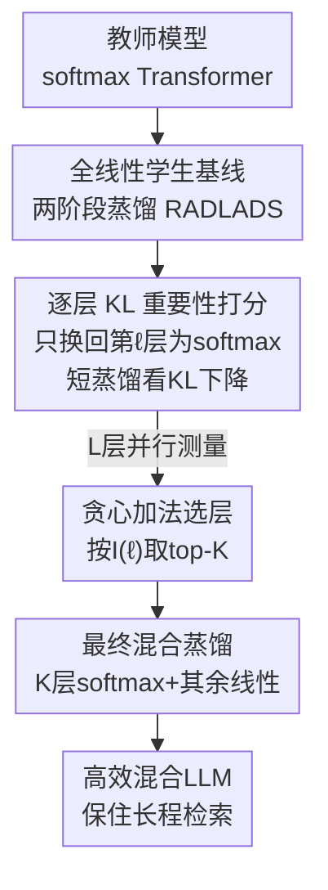

# Distilling to Hybrid Attention Models via KL-Guided Layer Selection

**会议**: ICLR2026  
**OpenReview**: [https://openreview.net/forum?id=RzbsHcFqIf](https://openreview.net/forum?id=RzbsHcFqIf)  
**代码**: https://github.com/fla-org/hybrid-distillation  
**领域**: LLM效率 / 混合注意力 / 知识蒸馏  
**关键词**: 线性注意力、混合架构、跨架构蒸馏、层选择、KL 散度

## 一句话总结
把预训练的 softmax 注意力 Transformer 蒸馏成"少数 softmax 层 + 大量线性注意力层"的混合模型时，用"逐层临时换回 softmax、短暂蒸馏后看 KL 损失下降多少"来给每层打重要性分数，再贪心挑出最关键的 K 层保留为 softmax，从而在几乎不掉长上下文检索能力的前提下大幅提升推理效率。

## 研究背景与动机
**领域现状**：线性注意力（linear attention）和状态空间模型推理快、显存恒定，但绝大多数现成的强模型仍是纯 softmax 注意力 Transformer，从头预训练一个线性注意力大模型成本极高。于是出现了"跨架构蒸馏"这条路：把已经训好的 Transformer 检查点转换成更高效的线性注意力版本，省去从头预训练。最近的工作（如 RADLADS）已经把蒸馏流程本身做得比较成熟——注意力权重迁移、隐状态对齐、KL 分布匹配再加少量微调。

**现有痛点**：纯线性注意力学生在 MMLU、常识推理这类**短上下文**任务上确实能逼近教师，但这些评测掩盖了一个关键短板——**长上下文的"在上下文中检索"（in-context recall）能力**。论文的 Figure 1、Figure 2 给出很扎实的证据：纯线性（甚至小滑动窗口）模型在 RULER 这类长程检索基准上随 softmax 层数增加单调上升，说明全局注意力对检索不可或缺；而常识推理几乎对 softmax 层数不敏感，单层 softmax 就能接近教师。这意味着"线性注意力够用"的结论其实是被短上下文评测惯出来的错觉。

**核心矛盾**：要兼顾效率（少留昂贵的 softmax 层）和长程检索（softmax 层不可或缺），自然走向**混合架构**——只保留少数几层全局 softmax，其余转成线性注意力。但随之而来的真正难题是：**到底该把哪几层保留为 softmax？** 从头预训练的混合模型常用"固定比例均匀穿插"（如每 3 层或 7 层线性配 1 层全局），但作者的预实验发现：这种均匀策略在**蒸馏**场景下并不最优，因为预训练和蒸馏的本质不同——蒸馏要让学生去拟合一个已经定型的教师分布，关键层的位置不是均匀分布的。

**本文目标**：在给定预算 $K$（保留多少 softmax 层）下，找到一个层子集 $S_{\text{softmax}}$，使得把其余层换成线性注意力后性能损失最小。直接穷举所有 $K$ 元子集是组合爆炸，不可行。

**核心 idea**：用蒸馏自带的 **KL 散度损失**作为层重要性的度量——直觉是"一个全局注意力层越关键，把它从全线性学生里恢复回 softmax 后，蒸馏 KL 损失下降得越多"。于是逐层做"只换回这一层"的边际效用测量，按 KL 改善排序贪心选 top-K。

## 方法详解

### 整体框架
方法要解决的是"挑哪 K 层留 softmax"这一离散选择问题，整体分三步走：先把教师整体蒸馏成一个**全线性学生**作为公共基线；然后**逐层**把某一层临时恢复成 softmax、短暂蒸馏一下、记录 KL 损失改善多少，得到每层的重要性分数 $I(\ell)$；最后按分数取 top-K 层固定为 softmax，其余转线性，跑一遍**最终蒸馏**得到混合模型。整套蒸馏流程复用 RADLADS 的两阶段配方（Stage 1 隐状态对齐 + Stage 2 KL 分布匹配）。注意逐层打分这一步是**可并行**的——L 层各自独立测量，互不依赖。

### 关键设计

**1. 全线性学生作为统一打分基线**

要衡量"某层有多重要"，得有一个固定的参照系。作者先用 RADLADS 的前两阶段把教师整体蒸馏成一个**纯线性注意力学生** $M_{\text{all-linear}}$：线性注意力层的 $W_Q, W_K, W_V, W_O$ 直接从教师对应参数初始化，只有数据相关门控项 $\alpha_t$ 的线性层随机初始化。Stage 1 是逐层隐状态对齐，用 L2 损失让学生每个块的注意力隐状态 $U^{(\ell)}_{\text{all-linear}}$ 去匹配教师的 $U^{(\ell)}_{\text{teacher}}$（此阶段冻结 FFN、只训线性注意力层），$L_{\text{hidden}}=\sum_\ell \frac{1}{T}\lVert U^{(\ell)}_{\text{teacher}}-U^{(\ell)}_{\text{all-linear}}\rVert_2^2$；Stage 1 用 100M token。Stage 2 是温度缩放的 KL 分布匹配，最小化教师与学生 logits 的 $L_{\text{KL}}=\frac{\tau^2}{T}\sum_t \text{KL}\big(\text{Softmax}(\ell_{\text{teacher},t}/\tau)\,\Vert\,\text{Softmax}(\ell_{\text{all-linear},t}/\tau)\big)$，此阶段放开包括 FFN 在内的全部学生参数训练，用 600M token。这个全线性基线之所以重要，是因为后续每层的重要性都是相对它"恢复一层 softmax 能改善多少"来定义的——参照系固定，分数才可比。

**2. 一次一换的 KL 边际效用打分（GA-S2 的 S2 部分）**

这是全文最核心的度量。对第 $\ell$ 层，构造 $M^{(-\ell)}_{\text{all-linear}}$：在全线性基线上**只把第 $\ell$ 块恢复成教师对应的 softmax 层**，其余仍是线性。然后对这个"只有一层 softmax"的学生重新跑一遍 Stage 1 + Stage 2 短蒸馏，定义层重要性为蒸馏后相对教师的 KL（取负号，越大越好）：$I(\ell)=-\mathbb{E}_{x\sim D}\big[L_{\text{KD}}(M^{(-\ell)}_{\text{all-linear}}, x)\big]$。$I(\ell)$ 越高表示恢复这一层带来的 KL 下降越大、边际效用越高。这个分数的妙处在于它是**"hybrid-aware、variant-aware"的**：因为基线学生和其它层都固定为线性，分数直接反映"在当前线性骨架下、用当前这种线性注意力变体时，这一层换成 softmax 有多关键"，而不是脱离上下文地给教师层打一个固定的重要性。论文还做了关键消融：用 Stage-2 的 KL 度量远胜用 Stage-1 的 MSE 度量（见 Table 2），说明分布层面的 KL 才真正捕捉到了对最终生成质量的影响，隐状态 MSE 抓不到。

**3. 贪心加法选层（GA 优于 GR）**

拿到逐层分数 $I(\ell)$ 后，直接取 top-K 最重要的层保留 softmax：$S_{\text{softmax}}=\text{top-}K(I(\ell))$，其余 $S_{\text{linear}}=\{1,\dots,L\}\setminus S_{\text{softmax}}$。这种"从全线性出发、贪心地加入边际 KL 下降最大的层"叫**贪心加法（Greedy Addition, GA）**。对照的替代方案有：贪心删除（GR，从全 softmax 出发逐步把最不重要的层换成线性）、以及把 GA 和 GR 的排名平均（AVG）。Table 2 显示 GA-S2 一致地优于 GR-S2，作者的解释是——"从全线性基线里识别出最该加的那一层"比"从全 softmax 里识别出最该删的那一层"是更鲁棒的信号：前者直接对准了"补哪一层能最快把检索能力拉回来"这个真正的瓶颈。整套流程就是论文的 Algorithm 1（GA-S2）。

**4. 用线性变体当"探针"，挑出可迁移的关键层**

层选择对所用的线性注意力变体（GDN vs GLA）是敏感的——同样 25% 预算下，GDN 和 GLA 各自选出的层 Jaccard 相似度只有 0.54~0.65（约 6~7/9 层重叠，差 1~3 层），但这 1~3 层的差异对长程检索影响巨大。一个出人意料的发现是：用 **GDN 作为选层探针**选出的层集，拿去蒸 GLA 学生时，RULER 反而显著优于"GLA 自己选层蒸 GLA"（Llama 0.6927 vs 0.6498、Qwen 0.8407 vs 0.6921）。这说明不同线性变体当"探针"识别重要层的能力有强弱，GDN 探出的层集更鲁棒、能同时迁移到 GDN 和 GLA 学生。这个设计点的价值在于：它把"选层"和"最终用哪种线性层"解耦，提示可以用一个好探针选一次层、复用到多种部署架构。

### 损失函数 / 训练策略
两阶段蒸馏沿用 RADLADS：Stage 1 隐状态 L2 对齐（100M token，冻结 FFN）；Stage 2 温度缩放 KL 分布匹配（600M token，全参数）。打分阶段每层都跑一遍这两阶段，且 L 层并行。一个工程优化：主选择器 GA-S2 的最终混合模型可复用 Stage-1 已对齐的线性层，因此最后一步只需跑 Stage 2。整条选择流水线只用约 5–6B token，远少于对照工作 PostNAS 的 50B token。

## 实验关键数据

### 主实验
两个 3B 教师（Qwen2.5-3B-Instruct、Llama-3.2-3B-Instruct），线性层用 gated DeltaNet（GDN），在长上下文检索基准 RULER 与 SWDE 上对比多种选层方法（Figure 3）。低预算区优势最明显：Qwen2.5 在 12.5% softmax 预算（5 层）下，GA-S2 达 0.662，比最强基线 AR（0.542）高 +0.12、比均匀穿插（0.441）高 +0.22。

| 任务/设置 | 本文 GA-S2 | 最强基线 | 均匀穿插 | 提升 |
|--------|------|------|------|------|
| RULER, Qwen2.5-3B, 12.5% softmax | 0.662 | 0.542 (AR) | 0.441 | +0.12 / +0.22 |
| RULER, Qwen2.5-1.5B, 25% | 0.5408 | 0.5098 (SMART) | — | +0.031 |
| RULER, Qwen2.5-7B, 25% | 0.8584 | 0.8158 (SMART) | — | +0.043 |
| RULER, Llama-3.2-3B, 25% (GDN) | 0.7539 | 0.6274 (SMART) | 0.461 | +0.126 |

跨规模（1.5B/7B）GA-S2 在 25%/33% 预算下均稳定优于最强基线 SMART；50% 预算时混合模型已能恢复教师在这些检索任务上的绝大部分性能。

### 消融实验

| 配置 | RULER (Llama-3.2-3B, 25%) | 说明 |
|------|---------|------|
| GA-S2（完整方法） | 0.7539 | KL 度量 + 贪心加法 |
| GR-S2 | 0.4950 | KL 度量但改成贪心删除，大幅掉点 |
| GA-S1 | 0.4193 | 改用 Stage-1 MSE 度量，崩 |
| AVG-S2 | 0.5580 | GA/GR 排名平均 |

### 关键发现
- **KL（Stage-2）度量是性能命门**：换成 Stage-1 的 MSE 度量后 RULER 从 0.75 暴跌到 0.42——隐状态 L2 抓不到对生成分布真正重要的层。
- **贪心加法 > 贪心删除**："识别最该加的层"比"识别最该删的层"是更强的信号（0.754 vs 0.495）。
- **探针可迁移**：GDN 探针选出的层集迁移到 GLA 学生反而比 GLA 自选更好，说明好探针选的层更本质。
- **token 效率高**：选层集在训练前 25–40% 就基本稳定（K−1 层"骨架"已定），早停可省 58–74% 的选择 token 预算，对最终 RULER 影响 <0.01。

## 亮点与洞察
- **用蒸馏目标本身当选层信号**：不引入额外诊断数据集或合成检索任务，直接拿"恢复这一层后 KL 下降多少"度量重要性，简单、与最终目标天然对齐——这是比 AR/SMART 等任务驱动选层更优雅的地方。
- **戳破"线性注意力够用"的评测错觉**：Figure 1/2 用 RULER vs 常识推理的鲜明对比说明，过去"纯线性能逼近教师"的结论是短上下文评测惯出来的，长程检索才是真正瓶颈——这个动机论证本身就很有价值。
- **"探针可迁移"是可复用的思路**：选层和部署架构解耦，可迁移到其它需要"用一个代理模型选结构、再换到目标模型"的场景（如不同量化/稀疏配置下的结构搜索）。
- **逐层并行 + 早停**让"组合爆炸的选层"变成可负担的工程流程，5–6B token 就够，相比 PostNAS 的 50B token 省了近一个数量级。

## 局限与展望
- **打分成本随层数线性增长**：要对 L 层各跑一遍两阶段短蒸馏，虽可并行但总算力不小；超大模型（几十上百层）时绝对开销仍可观。
- **预算 K 需人工指定**：方法回答"哪 K 层"，但"K 取多少"仍靠目标 softmax:linear 比例外部设定，没有自动决定最优预算。
- **检索之外的能力未充分评测**：实验集中在 RULER/SWDE 等检索基准，混合模型在数学推理、代码、超长上下文（>RULER 长度）等场景的表现还需更多验证。
- **探针选择缺乏先验指导**：发现 GDN 探针好用是经验性的，为什么某些线性变体当探针更鲁棒、如何先验地挑探针，仍是开放问题。

## 相关工作与启发
- **vs 均匀穿插（Wang et al. 2024 / Jamba、MiniMax 等预训练混合模型）**：它们按固定比例均匀放 softmax 层，对从头预训练有效；本文指出蒸馏场景下均匀次优，关键层位置非均匀，需按 KL 边际效用挑层。
- **vs SMART（Yang et al. 2025）**：SMART 同样用"换入 softmax 看 KL 改善"打分，但额外加了"端点保留"启发式 + 从近均匀候选里凑总敏感度；本文证明纯贪心加法（GA-S2）不靠这些启发式就更强（如 Llama 25% 下 0.754 vs 0.627）。
- **vs PostNAS（Gu et al. 2025）**：PostNAS 训一个 once-for-all SuperNet 再用 beam search 针对下游任务搜层，需 50B token，复杂且昂贵；本文 5–6B token、流程简单，公平复现 PostNAS 释放的层集后本文仍占优。
- **vs AR / AR-MH（合成检索探针选层）**：用合成键值检索任务的掉点排层，需要专门构造诊断数据；本文直接用通用文本上的蒸馏 KL，无需特制数据集且效果更好。

## 评分
- 新颖性: ⭐⭐⭐⭐ 用蒸馏 KL 自身当选层信号 + "探针可迁移"的发现都很有洞察，虽属同期多篇 KL 选层工作之一但论证最干净。
- 实验充分度: ⭐⭐⭐⭐ 两教师、多规模（1.5B~7B）、多预算、GDN/GLA 双变体、与 6+ 基线对比 + token 效率分析，相当扎实。
- 写作质量: ⭐⭐⭐⭐⭐ 动机推导（检索 vs 常识的二分）极清晰，方法简洁，消融把每个设计选择都讲透了。
- 价值: ⭐⭐⭐⭐ 让"把现成 Transformer 转成高效混合 LLM"在保住长程检索的前提下更可靠，对推理效率落地有直接实用价值。

<!-- RELATED:START -->

## 相关论文

- [\[ACL 2026\] Native Hybrid Attention for Efficient Sequence Modeling](../../ACL2026/llm_efficiency/native_hybrid_attention_for_efficient_sequence_modeling.md)
- [\[ICLR 2026\] RACE Attention: A Strictly Linear-Time Attention Layer for Training on Outrageously Large Contexts](race_attention_a_strictly_linear-time_attention_layer_for_training_on_outrageous.md)
- [\[ICML 2026\] KnapSpec: Self-Speculative Decoding via Adaptive Layer Selection as a Knapsack Problem](../../ICML2026/llm_efficiency/knapspec_self-speculative_decoding_via_adaptive_layer_selection_as_a_knapsack_pr.md)
- [\[ICLR 2026\] Composer: A Search Framework for Hybrid Neural Architecture Design](composer_a_search_framework_for_hybrid_neural_architecture_design.md)
- [\[ICLR 2026\] KnowProxy: Adapting Large Language Models by Knowledge-guided Proxy](knowproxy_adapting_large_language_models_by_knowledge-guided_proxy.md)

<!-- RELATED:END -->
