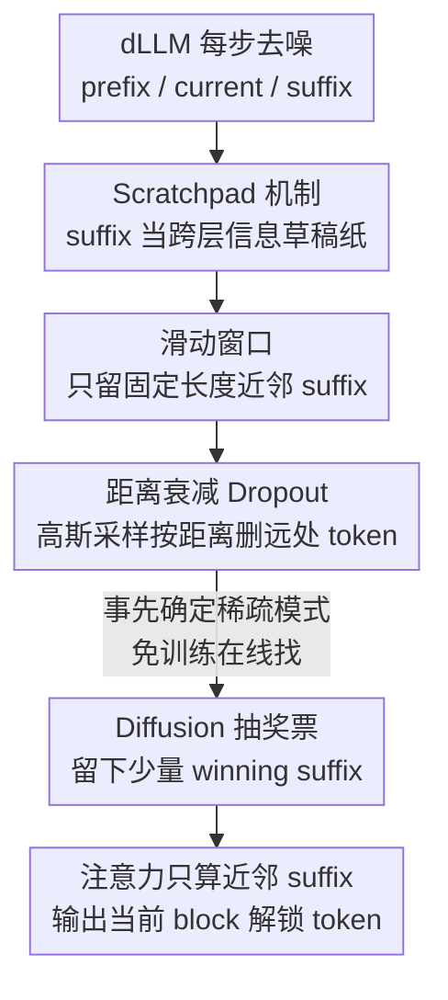

# DPad: Efficient Diffusion Language Models with Suffix Dropout

**会议**: ICLR2026  
**OpenReview**: [https://openreview.net/forum?id=0yOsSMU1eY](https://openreview.net/forum?id=0yOsSMU1eY)  
**代码**: https://github.com/Crys-Chen/DPad.git  
**领域**: LLM效率 / 扩散语言模型 / 高效推理  
**关键词**: 扩散语言模型, 后缀 dropout, 免训练加速, 滑动窗口, 抽奖票假设

## 一句话总结
DPad 发现扩散语言模型（dLLM）在每一步都要为所有未来 suffix token 计算注意力、却只保留极少数，造成巨大冗余；它用"滑动窗口 + 距离衰减 dropout"在注意力计算**之前**就丢掉远处 suffix token，免训练、即插即用，在 LLaDA-1.5/GSM8K（1024 token，1-shot）上叠加并行解码与前缀缓存后达到最高 61.39× 加速且精度不降反升。

## 研究背景与动机

**领域现状**：扩散式大语言模型（dLLM，如 LLaDA、Dream）把文本生成建模为去噪过程，可以并行预测多个 token，被视为打破自回归"一次一 token"串行瓶颈的有希望路线。主流做法是 block-wise（半自回归）解码：把回复切成若干 block，每个 block 内反复去噪，未确定的位置都填成 `[MASK]`。

**现有痛点**：这种并行是有代价的。在每一个去噪步，模型都要为**所有**后续（suffix）位置算注意力、做预测，但每步只解锁置信度最高的极少数 token，其余预测全被丢弃。结果是吞吐量的并行收益被计算量的"超线性"膨胀抵消——suffix 越长，浪费越多。

**核心矛盾**：作者通过分析发现，这些 suffix token 在 mask 结构下**本身不携带语义**，它们更像一块"草稿纸"（scratchpad），跨 Transformer 层把 prefix/current 的上下文信号汇集起来再回灌给当前 block。但这块草稿纸极其低效：大多数 suffix token 是冗余、低熵的，且注意力分数随距离急剧衰减——离当前 block 越远的 suffix token 几乎不被关注，却仍在白白消耗算力，甚至干扰生成质量。

**本文目标**：在**不重新训练**的前提下，砍掉这部分冗余 suffix 计算，同时保住（最好还能提升）生成质量，并且要能和已有的并行解码、前缀缓存等优化叠加。

**切入角度**：既然 suffix token 的注意力呈现"近处主导、远处衰减"的规律，且远处 token 高度冗余，那就**事先**按距离把它们丢掉，根本不必先算完注意力分数再剪枝。作者进一步用一组实验验证：哪怕强行剪掉远处注意力"尖峰"token，精度也几乎不掉——信息会被邻近 token 吸收。

**核心 idea**：把 suffix 注意力限制在"近处少量 token"这一结构化子集上——用固定长度滑动窗口锁住一个有界的近邻区，再用距离衰减 dropout 在执行前确定性地删掉远处 token，用"免训练的抽奖票搜索"在线找出那一小撮真正有用的 suffix token。

## 方法详解

### 整体框架

DPad 是一个套在现成 dLLM 推理流程上的**免训练**注意力稀疏策略，不改任何参数，只改"当前 block 看哪些 suffix token"。输入是一段 prompt，输出是逐 block 去噪生成的回复。它分三层来讲：先把 suffix token"为什么有用"形式化为 **Scratchpad 机制**；再用 **Suffix Dropout（滑动窗口 + 距离衰减）**砍掉其中的冗余；最后用 **Diffusion Lottery Tickets 假设**解释"为什么可以事先丢、丢了还不掉点"。

具体地，token 序列被切成三段：prefix `[0, c-1]`、current `[c, s-1]`、suffix `[s, L-1]`，注意力矩阵相应分成 3×3 块。关键交互发生在 current↔suffix（图中 Block 6/7/8）：第 $n$ 层 suffix 把 prefix 和 current 的信息聚合进自己（"写草稿"），第 $n{+}1$ 层 current 再从 suffix 把信息读回来（"读草稿"），作者把这种跨层、经 suffix 中转的信息通路称为 **Attention Connection**（一种专门作用于注意力的"残差连接"）。DPad 要做的，就是在每一步进入注意力计算前，就把远处那些低价值 suffix 列从这套读写里剔除。

### 关键设计

**1. Scratchpad 机制：把 suffix token 形式化为跨层信息草稿纸**

要敢丢 suffix token，先得搞清它到底在干嘛。由于 mask 结构，suffix 位置本身没有语义，但作者发现它扮演着"信息蓄水池"的角色。形式化地，第 $n$ 层的全局注意力 $A^{(n)} = \mathrm{Softmax}\!\left(\frac{Q^{(n)}(K^{(n)})^\top}{\sqrt{d_k}}\right)$ 被切成 prefix/current/suffix 子块，suffix 位置的隐表示为 $H^{(n)}_S = A^{(n)}_{S,P}V^{(n)}_P + A^{(n)}_{S,C}V^{(n)}_C + A^{(n)}_{S,S}V^{(n)}_S$，即 suffix 把 prefix 和 current 的信息**写**进自己；到第 $n{+}1$ 层，current 又通过 $A^{(n+1)}_{C,S}$ 把这些信息**读**回去。作者把这条"写—读"通路命名为 Attention Connection，类比残差连接但专作用于注意力：模型把 prefix+current 的高维信号压进 suffix 这块低秩缓存，再回灌给当前 block 复用。这个机制说清了 suffix 不是废物——它确实在帮去噪；但也暴露了关键点：真正起作用的是"近处少量"草稿，远处那一大片是冗余。

**2. 滑动窗口：让 suffix 关注成本与序列长度解耦**

vanilla dLLM 里，suffix 的计算量随生成序列变长而增长（suffix 越长，注意力越贵）。借鉴前缀 KV-cache 优化里 streaming/sliding window 的思路，DPad 把它搬到 suffix 一侧：维护一个**固定长度** $W$ 的 suffix 窗口，随当前 block 一起向前滑动，只保留窗口内有限数量的近邻 suffix token，窗口外的一律不参与注意力。这样 suffix 关注的 token 数被钉死成常数，与整段回复多长无关——等于把 suffix 相关的复杂度"降了一个维度"，从随长度二次膨胀压成接近线性。消融发现真正关键的上下文窗口只有当前 block 之后 64–128 个 token，把有限预算密集地放在这个临界窗口内最划算，把预算稀疏地摊到大窗口上反而掉点。

**3. 距离衰减 Dropout：事先按距离删 token，而非先算分再剪枝**

光有硬窗口还不够细。DPad 在窗口内再叠一个距离衰减的删除：离当前 block 越远，被丢概率越高，直到窗口外全删。对距离 suffix 边界 $d$ 的 token，保留概率取标准正态右半支 $P(d) = a\cdot\frac{1}{\sigma\sqrt{2\pi}}\exp\!\left[-\frac{1}{2}\left(\frac{k\sigma}{W}\cdot\frac{d-\mu}{\sigma}\right)^2\right]$（$0 < d \le W$，$\mu{=}0,\sigma{=}1$），用拒绝采样实现；超参 $k$ 把窗口 $W$ 映到 $k\sigma$（如 $W{=}256$、$k{=}3$ 时 $d{=}256$ 对应 $3\sigma$），$a$ 控制整体采样幅度。这一设计的关键区别在于：传统注意力剪枝（attention-score pruning）要**先算完注意力分数、再按大小剪**；而 DPad 在模型执行前就**预先确定**一张距离衰减的稀疏掩码，在每一步最开头就把远处 token 删掉，连分数都不用算。这说明"稀疏是 suffix 注意力的内在属性"，也是它能 a priori 丢弃、且实现只需几行代码的根本原因。消融显示高斯衰减在低预算下稳定优于均匀 dropout，但对衰减函数的具体形态（指数/线性/阶梯）并不敏感，只要"强调近处"即可。

**4. Diffusion Lottery Tickets（DLT）假设：解释为什么能事先丢、丢了还不掉点**

为什么删掉远处那些注意力"尖峰"token 也不影响精度？作者做了关键实验：跑一步推理后强行剪掉前 128 位之外注意力最高的 10 个"spotlight"token（如距离 199/298/362），精度几乎不变（GSM8K 40.5→41.7，HumanEval 37.8→39.0），且被删 token 的注意力会自动转移到邻近 token（362 的尖峰被 359 吸收）。据此作者把 Lottery Ticket 假设推广到 dLLM 推理，提出 **DLT 假设**：suffix 区域含大量冗余 token，但其中一个稀疏子集就足以保证语义一致与生成质量；通过 DPad 机制，这个子集能在前向过程中被自适应地重组成"winning tickets"。于是 suffix dropout 就成了一次**免训练的抽奖票搜索**——高斯采样负责挑出那一小撮承载去噪关键信息的 suffix token。这也解释了它和前缀缓存剪枝的本质差异：prefix token 携带稠密、位置绑定的语义，不能随便删；suffix token 则是灵活的低秩记忆缓冲，可被任意重组。

### 损失函数 / 训练策略

DPad 是**纯推理期、免训练**策略，不引入任何训练目标或微调，沿用 dLLM 原有的去噪训练（mask 预测的负对数似然 $L(\theta) = -\mathbb{E}_{t,x_0,x_t}\left[\frac{1}{t}\sum_{i:x^i_t=[\text{MASK}]}\log p_\theta(x^i_0|x_t)\right]$）。它只引入三个推理超参：衰减率因子 $k$、幅度标量 $a$、滑动窗口大小，在各 benchmark 小子集上调好即可；默认 block size 32、batch size 1、并行解码置信阈值 0.9。

## 实验关键数据

### 主实验

在 LLaDA-Instruct 与 Dream-Base 上跨 GSM8K/MATH/HumanEval/MBPP 四个 benchmark 评测，A100 80GB，效率看端到端 latency 与 TPS，精度看 flexible/strict-match 或 pass@1。

| 模型 / Benchmark | 方法 | Latency↓ | 加速 | Strict-Match↑ |
|------|------|------|------|------|
| LLaDA-Inst / GSM8K(4-shot) | Vanilla | 27.48s | 1.00× | 37.38 |
| LLaDA-Inst / GSM8K | +DPad | 18.35s | 1.50× | 63.84 |
| LLaDA-Inst / GSM8K | +Par.+DPad | 6.64s | 4.14× | 64.97 |
| LLaDA-Inst / MBPP(3-shot) | Vanilla | 62.11s | 1.00× | 15.00 |
| LLaDA-Inst / MBPP | +Par.+DPad | 6.02s | 10.32× | 39.40 |
| Dream-Base / HumanEval(0-shot) | Vanilla | 28.49s | 1.00× | 51.22(flex) |
| Dream-Base / HumanEval | +Par.+DPad | 4.06s | 7.01× | 52.44(flex) |

DPad 单独用即带来 1.18×–3.91× latency 加速，叠加并行解码后达 2.72×–10.32×。值得注意的是 LLaDA 上精度不降反升：GSM8K strict-match +26.46%、MATH +19.62%——作者解释为远处 suffix token 引入低价值/跑偏格式的干扰，DPad 把注意力导向高价值的 prefix few-shot 范例，反而更忠实地复现了 strict-match 要求的结构化推理格式。

### 长序列 / 消融实验

长序列才是 DPad 的主场。LLaDA-1.5/GSM8K（1024 token，1-shot）：

| 配置 | Acc.(Flex./Str.) | Lat.(s)/TPS | 相对加速 |
|------|------|------|------|
| Vanilla | 78.17 / 48.98 | 127 / 1.55 | 1.00× |
| +DPad | 78.77 / 74.07 | 6.28 / 18.4 | 20.3× |
| +Par.+DPad | 79.38 / 74.22 | 2.26 / 51.4 | 5.17×(vs +Par.) |
| +Par.+PC.+DPad vs Vanilla | 77.10 / 70.66 | 2.07 / 55.5 | **61.39×** |

滑动窗口/dropout 函数消融（Fig. 5）：临界上下文窗口约 64–128 token，预算应密集放在这里；高斯 dropout 在低预算下稳定优于均匀 dropout，但对衰减函数具体形态不敏感。

### 关键发现
- **加速随序列长度增长**：256 token 时仅 1.51×，1024 token 单独 DPad 即 20.3×，叠加并行解码+前缀缓存达 61.39×；因为短序列里 prompt 占主导、suffix 计算占比小，受 Amdahl 定律限制。
- **DPad 与并行解码正交互补**：DPad 砍冗余 KV-token 计算，并行解码缓解依赖约束，两者打不同瓶颈，叠加收益相乘。
- **LLaDA 比 Dream 受益更大**：LLaDA 从零训练为 dLLM、依赖完整 suffix 上下文，对 DPad 的正则更敏感；Dream 从自回归 Qwen2.5 初始化、没见过 suffix token，因而提升有限。
- **TPS 增益有时不如 latency 明显**：DPad 让模型更早自然终止、生成更简洁，token 变少反而拉低 GPU 利用率/TPS——作者认为这是优点而非缺陷，并呼吁社区反思吞吐量指标。

## 亮点与洞察
- **"先确定稀疏模式、再执行"的范式转换**：传统剪枝是"算完分数再剪"，DPad 把它翻成"执行前按距离先验删"，省掉了算分数这步本身，实现只需几行代码——这背后是"稀疏是 suffix 注意力内在属性"的洞察。
- **把 Lottery Ticket 假设迁到推理期**：原 LTH 讲的是训练前剪子网络，DPad 的 DLT 假设讲的是**推理时**在线找 winning suffix token，且不需要"训练后才匹配"——这是个很漂亮的概念迁移，可启发其他免训练稀疏化工作。
- **加速与精度"双赢"打破常规 trade-off**：通常加速要牺牲精度，DPad 反而靠"抑制干扰性远处 token"提升了 strict-match，把效率优化和质量提升统一了起来。
- **"草稿纸/写书"的直觉很有迁移性**：把 suffix 类比成写书时的草稿（当前章反复改、邻章打草稿、远章只留提纲），这种"近处精细、远处粗略"的资源分配思路可迁移到其他长上下文/KV-cache 场景。

## 局限与展望
- **短序列收益有限**：受 Amdahl 定律约束，prompt 占主导的多 shot 短序列里 suffix 计算占比小，加速只有 1.x×；DPad 的价值集中在低 shot、长序列。
- **对模型类型敏感**：Dream（自回归初始化）几乎没收益，说明 DPad 的红利依赖"原生 dLLM 重度依赖 suffix 上下文"这一前提，泛化到非原生 dLLM 时需谨慎。
- **衰减函数未必最优**：作者承认高斯采样可能不是最佳衰减形态，指数/线性/阶梯等方案待探索（虽然实验显示对形态不敏感）。
- **超参需逐 benchmark 调**：$k/a$/窗口大小要在小子集上调，缺少自适应设定机制；TPS 指标在生成被压短时会机械性下降，也提示现有吞吐量度量本身有待改进。

## 相关工作与启发
- **vs 注意力分数剪枝（attention-score pruning，如 Song et al. 2025a）**: 他们先算完注意力分数、再按大小动态驱逐低分项；DPad 在执行前用距离先验确定稀疏掩码、连分数都不算，更省且更简单——核心区别是 suffix 的稀疏可 a priori 预测。
- **vs 前缀 KV-cache / sliding window（StreamingLLM、Longformer）**: 那些工作把滑动窗口用在 prefix 一侧；DPad 把同样的"近邻有界窗口"思路搬到 suffix 一侧，并指出 prefix（稠密语义、位置绑定）不能随便删，而 suffix（低秩记忆缓冲）可以。
- **vs 并行解码 / 前缀缓存（Fast-dLLM, Wu et al. / dLLM-Cache, Liu et al.）**: 它们缓解依赖约束或复用稳定 KV，与 DPad 砍 suffix 冗余正交，DPad 可与其叠加，把 61.39× 这种乘性加速跑出来。
- **vs Lottery Ticket Hypothesis（Frankle & Carbin 2019）**: 原假设面向训练期子网络剪枝；DPad 的 DLT 假设把它推广到 dLLM 推理期 suffix token 的在线抽奖票搜索，是一次跨场景的概念延伸。

## 评分
- 新颖性: ⭐⭐⭐⭐⭐ Scratchpad 机制形式化 + DLT 假设 + "先验删 suffix" 三个点都很有原创性。
- 实验充分度: ⭐⭐⭐⭐ 双模型四 benchmark + 长序列 + 窗口/dropout 消融较完整，但偏集中在 LLaDA/GSM8K。
- 写作质量: ⭐⭐⭐⭐⭐ 直觉（写书草稿）、机制图、公式与实验衔接清晰，逻辑链完整。
- 价值: ⭐⭐⭐⭐⭐ 免训练、即插即用、可叠加，对 dLLM 长序列高效推理有直接落地价值。

<!-- RELATED:START -->

## 相关论文

- [\[ICLR 2026\] Diffusion Language Models Know the Answer Before Decoding](diffusion_language_model_knows_the_answer_before_it_decodes.md)
- [\[ICLR 2026\] Beyond Masks: Efficient, Flexible Diffusion Language Models via Deletion-Insertion Processes](beyond_masks_efficient_flexible_diffusion_language_models_via_deletion-insertion.md)
- [\[ICLR 2026\] UltraLLaDA: Scaling the Context Length to 128K for Diffusion Large Language Models](ultrallada_scaling_the_context_length_to_128k_for_diffusion_large_language_model.md)
- [\[ICLR 2026\] FlashDLM: Accelerating Diffusion Language Model Inference via Efficient KV Caching and Guided Diffusion](flashdlm_accelerating_diffusion_language_model_inference_via_efficient_kv_cachin.md)
- [\[ICLR 2026\] Beyond Fixed: Training-Free Variable-Length Denoising for Diffusion Large Language Models](beyond_fixed_training-free_variable-length_denoising_for_diffusion_large_languag.md)

<!-- RELATED:END -->
