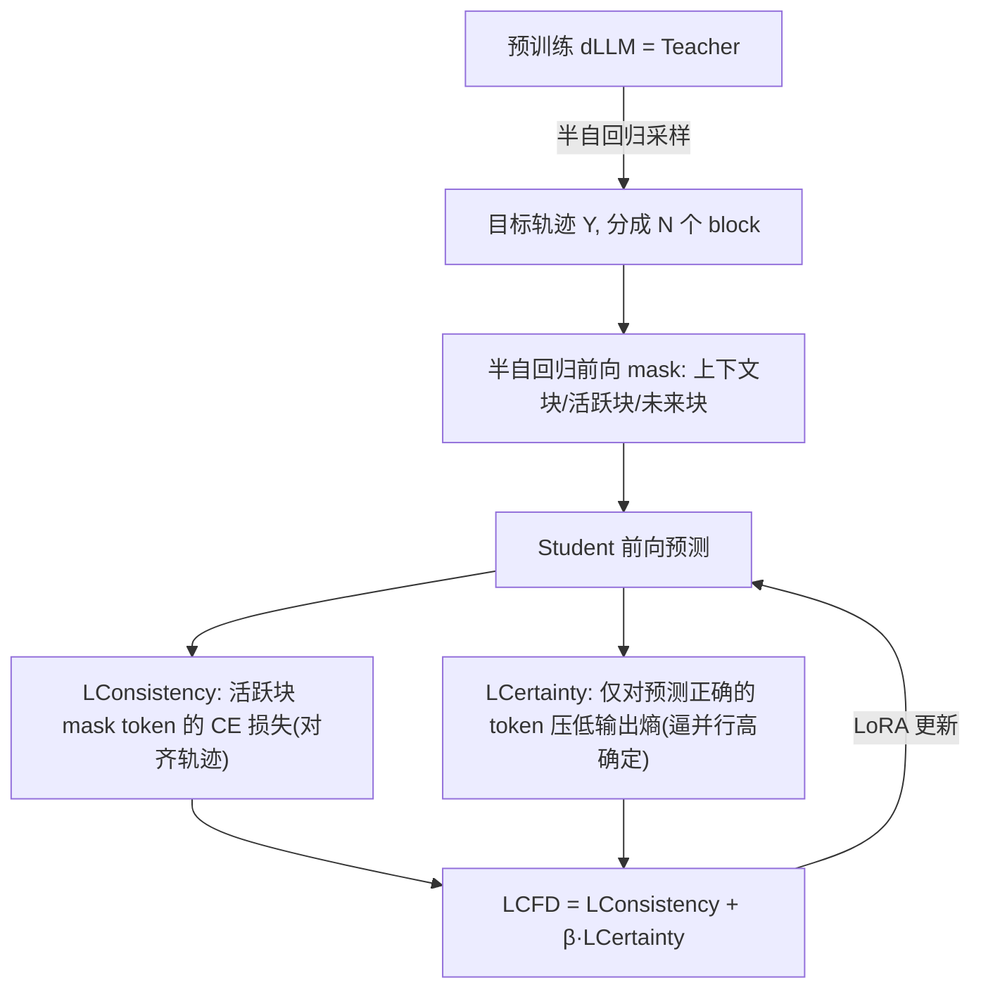

# dParallel: Learnable Parallel Decoding for dLLMs

**会议**: ICLR 2026  
**OpenReview**: [https://openreview.net/forum?id=hVOcstAURb](https://openreview.net/forum?id=hVOcstAURb)  
**代码**: [https://github.com/czg1225/dParallel](https://github.com/czg1225/dParallel)  
**领域**: LLM 推理加速 / 扩散语言模型 / 并行解码  
**关键词**: diffusion LLM, parallel decoding, certainty-forcing distillation, self-distillation, LLaDA, Dream  

## 一句话总结
通过"确定性强制蒸馏"把扩散语言模型(dLLM)原本"逐字串行收敛"的预测确定性改造成"并行同时收敛",让 LLaDA-8B 在 GSM8K 上把解码步数从 256 砍到 30(8.5× 加速)而精度不降。

## 研究背景与动机
**领域现状**：扩散语言模型(dLLM,如 LLaDA、Dream)用双向注意力替代自回归的左到右生成,理论上每步能并行预测所有被 mask 的 token,被寄望于带来远低于 AR-LLM 的推理延迟。然而现有开源 dLLM 要维持生成质量,解码步数几乎仍要正比于序列长度(256 长度就要 256 步),并行潜力名存实亡。

**现有痛点**：已有加速工作分两路——一路(Dual-Cache 等)给 dLLM 加 KV 缓存降低单步耗时,一路(各种采样策略)优化 remasking 减少步数。但只要把并行度推高(一步定多个 token),性能就崩。原因没人讲清楚,大家只在"轨迹对齐"层面打转(teacher forcing / diffusion forcing),并没碰到问题本质。

**核心矛盾**：dLLM 虽然每步并行预测全部 mask token,但这些预测的"确定性(certainty/confidence)"是**逐字左到右串行收敛**的——每步只有紧挨已知上下文的少数 token 能达到高置信,其余一直低置信,直到新的确定 token 提供新上下文才轮到下一批。而作者实证发现**高确定性是正确生成的必要条件**(置信度与准确率强正相关),所以一旦强行提前 commit 低置信 token,就级联出错。这就是并行解码真正的瓶颈:**串行的确定性收敛**。

**本文目标**：训练 dLLM,让它能在多个位置**并行**地达到高确定性,从而打破串行瓶颈、把解码步数大幅压缩而不掉点。

**核心 idea**：**[确定性即训练信号]** 提出 certainty-forcing distillation——让模型沿自己原始的采样轨迹自蒸馏(保证轨迹一致不跑偏),同时直接把"对正确预测 token 的输出熵"压低,逼模型更快、更并行地把确定性顶到峰值。

## 方法详解

### 整体框架
方法是一个**自蒸馏(self-distillation)** 训练流程:用预训练 dLLM 当 teacher 生成目标轨迹,再让一份完全相同的 student 复制体沿这条轨迹学习,但训练目标多了一条"逼高确定性"的项。全程不改变原始生成轨迹,只重塑确定性的收敛节奏(从串行变并行),训练用 LoRA,8 张 24GB A5000 上 10 小时即可完成。

### 关键设计

**1. 半自回归前向 mask:让训练状态对齐真实采样过程。** Teacher 先用半自回归 remasking(总长 $L$、块大小 $L_b$)生成目标响应 $Y=(y_1,\dots,y_L)$ 并切成 $N=L/L_b$ 个连续块。训练时不像标准 dLLM 预训练那样在全序列随机 mask,而是先采一个块索引 $n$,把序列切成三段构造噪声输入 $\tilde Y$:第 $n$ 块之前是**上下文块**(全保留,当条件)、第 $n{+}1$ 块是**活跃块**(以概率 $q$ 把 token 替换成 [MASK])、其后是**未来块**(全 mask,因为还没生成)。这样 $\tilde Y$ 恰好模拟了"已知前 $n$ 块、正在生成第 $n{+}1$ 块"的半自回归中间态,使自蒸馏的输入分布与推理时真正会遇到的状态一致——消融显示这一步对最终的高效率+高精度不可或缺。

**2. 一致性损失:沿原始轨迹自蒸馏,不让模型跑偏。** 学习信号只施加在活跃块 $B_{n+1}$ 的 mask 位置集合 $M_a$ 上,用标准交叉熵把 student 拉向 teacher 轨迹的正确 token:
$$\mathcal{L}_{\text{Consistency}} = -\frac{1}{|M_a|}\sum_{i\in M_a}\log p_\theta(y_i\mid \tilde Y).$$
它保证 student 的生成轨迹与原模型一致,但**单靠它解决不了串行收敛**:CE 只关心"对不对",一旦预测对了梯度迅速消失,完全没有动力去把置信度进一步顶高——这正是 consistency distillation 提速有限的原因。

**3. 确定性强制损失:直接把"已对"token 的熵压到更低。** 这是全文核心。先取出活跃块里 student **已经预测正确**的 token 集合 $M_c=\{i\in M_a\mid \arg\max_v p_\theta(v\mid\tilde Y)=y_i\}$,只对这部分 token 最小化带温度 $T$ 的输出分布熵:
$$\mathcal{L}_{\text{Certainty}} = \frac{1}{|M_c|}\sum_{i\in M_c}\Big(-\sum_{v\in V} p_\theta(v\mid\tilde Y;T)\log p_\theta(v\mid\tilde Y;T)\Big).$$
之所以**只对已预测正确的 token** 压熵,是为了让 CE 管"方向正确"、熵项管"信心更足",二者分工:前者保证收敛到 teacher 轨迹,后者在已对的位置上把置信度并行地推到峰值,使更多 token 能在同一步跨过 commit 阈值。温度 $T$(实验取 0.5)控制强制力度。总目标为
$$\mathcal{L}_{\text{CFD}} = \mathcal{L}_{\text{Consistency}} + \beta\,\mathcal{L}_{\text{Certainty}}.$$
$\beta$ 平衡"贴 teacher 轨迹"与"逼高确定性"。这套组合把原本左到右串行爬升的置信曲线,改造成多位置并行同时冲顶——推理时配合 entropy-threshold 的半自回归 remasking,一步就能确定多个 token。

## 实验关键数据

### 主实验(LLaDA-8B-Instruct,序列长 256/块长 32)

| Benchmark | Method | #Steps ↓ | Latency ↓ | Speedup ↑ | Acc ↑ |
|---|---|---|---|---|---|
| GSM8K-CoT | LLaDA-8B(原) | 256 | 18.6s | 1.0× | 75.7% |
| | Conf-threshold | 72 | 5.2s | 3.6× | 75.5% |
| | Consistency Distill | 64 | 4.7s | 4.0× | 69.9% |
| | **dParallel(本文)** | **30** | **2.2s** | **8.5×** | **76.1%** |
| MATH(4-shot) | LLaDA-8B | 256 | 50.9s | 1.0× | 33.5% |
| | **dParallel** | **46** | **8.9s** | **5.7×** | 31.5% |
| HumanEval | LLaDA-8B | 256 | 23.5s | 1.0× | 38.4% |
| | **dParallel** | **33** | **2.9s** | **8.2×** | **40.2%** |
| MBPP(3-shot) | LLaDA-8B | 256 | 50.1s | 1.0× | 42.4% |
| | **dParallel** | **24** | **4.8s** | **10.5×** | 40.8% |

Dream-7B-Instruct 上同样有效:GSM8K 39 步 6.9× 加速(82.1% vs 原 82.9%),MBPP 29 步 8.8× 加速。注意 Dream 因初始化自 AR-LLM,半自回归 mask 会让它退化回 AR,故改用全序列随机 mask,加速幅度略低于 LLaDA。

### 消融实验(LLaDA,GSM8K-CoT / HumanEval)

| Consistency | Certainty | Semi-AR Mask | GSM8K Steps/Speed/Acc | HumanEval Steps/Speed/Acc |
|---|---|---|---|---|
| ✓ | | ✓ | 53 / 4.5× / 73.5% | 71 / 3.6× / 36.0% |
| | ✓ | ✓ | 23 / 10.4× / 57.8% | 28 / 9.8× / 30.5% |
| ✓ | ✓ | | 44 / 5.5× / 73.3% | 61 / 4.3× / 32.9% |
| ✓ | ✓ | ✓ | **30 / 8.5× / 76.1%** | **33 / 8.2× / 40.2%** |

mask 比例消融:50% 最优(76.3% Acc);只去 certainty loss 退回基线速度,只留 certainty loss 速度飙到 10.4× 但精度崩到 57.8%。

### 关键发现
- **置信度=正确性的必要条件**:置信度与生成准确率强正相关,低置信强行 commit 必出错。
- **三个组件缺一不可**:一致性损失管"不跑偏"、确定性损失管"并行冲顶"、半自回归 mask 管"训练-推理状态对齐",任意去一个都掉点或掉速。
- **跨任务泛化**:LLaDA 只用数学 prompt 训练,代码任务上的并行解码能力也显著提升。
- **trade-off 曲线碾压**:同 9.4× 加速下,本文在 LLaDA-GSM8K 比 conf-threshold 高 16.5% 精度,HumanEval 高 21.3%。

## 亮点与洞察
- **抓住了真问题**:把"dLLM 并行解码为何不行"从含糊的"轨迹没对齐"精确定位到"确定性串行收敛",并用实证(置信度传播图、收敛轨迹图)把它讲透,这个洞察本身比方法更有价值。
- **熵正则的巧用**:不是泛泛地最小化全序列熵,而是**只对已预测正确的 token** 压熵——既不破坏正确性又精准提升信心,这个限定是方法 work 的关键。
- **极低成本**:纯自蒸馏,不需任何外部标注数据(target 全是模型自己生成的);LoRA + 8×A5000 训 10 小时,工程上非常可复现。

## 局限与展望
- **AR-初始化模型受限**:Dream 用半自回归 mask 会退化回 AR,只能退而求其次用随机 mask,加速幅度明显低于原生 dLLM LLaDA,说明方法对"模型是否原生扩散"敏感。
- **数学/代码为主**:训练与评测集中在 GSM8K/MATH/HumanEval/MBPP 这类有明确答案、可过滤错误轨迹的任务,开放式生成、长文本上的并行收益尚未验证。
- **超参敏感**:温度 $T$、权重 $\beta$、mask 比例都需调(50% mask 才最优),缺乏自适应机制。
- **理论留白**:为何"压已对 token 的熵"能从串行收敛跳到并行收敛,目前是实证现象,缺乏更深的理论刻画。

## 相关工作与启发
- **dLLM 加速两条主线**:降单步耗时(Dual-Cache/KV 缓存/token dropping)vs 减步数(改 remasking 采样策略)。本文属第三条路——直接训练改变模型的确定性动力学,与前两者正交,可叠加。
- **蒸馏类方法**:SDTT 用渐进蒸馏减步、Consistency Distillation 学预测剩余 mask token,但都只对齐轨迹,本文指出这对解决串行收敛"不够"。
- **启发**:把"模型内部某种统计量(这里是预测确定性)的演化节奏"作为直接优化对象,而非只盯着输出正确性,可能是加速一类迭代式生成模型(扩散、流匹配)的通用思路;"只对已正确样本做正则"也是一个值得迁移的 trick。

## 评分
- **新颖性**: ⭐⭐⭐⭐⭐ 把并行解码瓶颈精确归因到"确定性串行收敛",并用确定性作直接训练信号,视角新且切中要害。
- **实验充分度**: ⭐⭐⭐⭐ 两个代表性 dLLM × 四个 benchmark × 多基线 + 完整消融(策略/mask 比例)+ trade-off 曲线,扎实;但任务类型偏窄(数学/代码)。
- **写作质量**: ⭐⭐⭐⭐ 问题定位清晰、实证图表有力(置信度传播/收敛对比),方法叙述简洁。
- **价值**: ⭐⭐⭐⭐⭐ 8.5–10.5× 无损加速 + 极低训练成本,直接把 dLLM 推理效率拉到可用区间,为 few-step / 并行 dLLM 立了新 baseline。

<!-- RELATED:START -->

## 相关论文

- [\[ICLR 2026\] Learning to Parallel: Accelerating Diffusion Large Language Models via Learnable Parallel Decoding](learning_to_parallel_accelerating_diffusion_large_language_models_via_learnable_.md)
- [\[ICLR 2026\] Hierarchy Decoding: A Training-free Parallel Decoding Strategy for Diffusion Large Language Models](hierarchy_decoding_a_training-free_parallel_decoding_strategy_for_diffusion_larg.md)
- [\[ICLR 2026\] Wide-In, Narrow-Out: Revokable Decoding for Efficient and Effective DLLMs](wide-in_narrow-out_revokable_decoding_for_efficient_and_effective_dllms.md)
- [\[ICLR 2026\] ReFusion: A Diffusion Large Language Model with Parallel Autoregressive Decoding](refusion_a_diffusion_large_language_model_with_parallel_autoregressive_decoding.md)
- [\[ICLR 2026\] Gumbel Distillation for Parallel Text Generation](gumbel_distillation_for_parallel_text_generation.md)

<!-- RELATED:END -->
