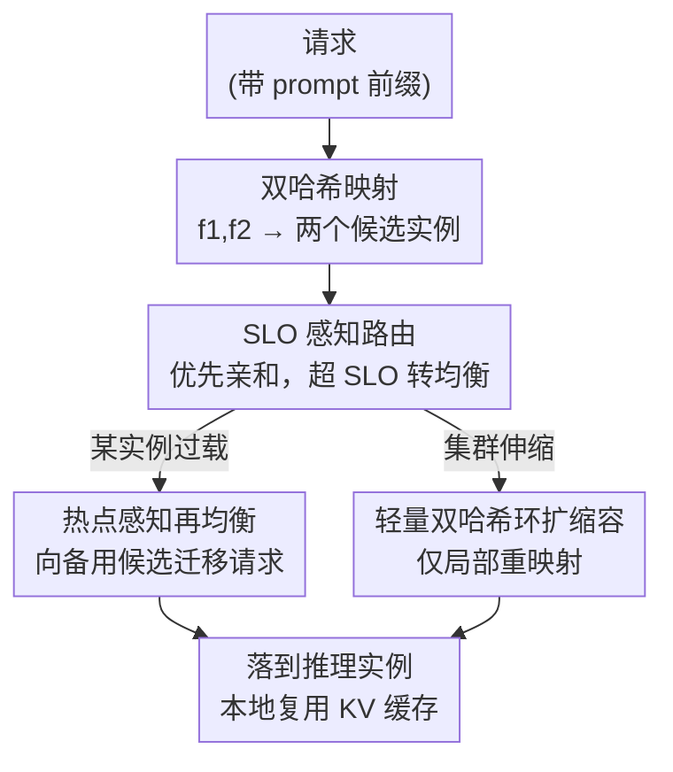

# DualMap: Enabling Both Cache Affinity and Load Balancing for Distributed LLM Serving

**会议**: ICLR2026  
**OpenReview**: [https://openreview.net/forum?id=zCadrJ32Xn](https://openreview.net/forum?id=zCadrJ32Xn)  
**代码**: https://github.com/ASISys/DualMap  
**领域**: LLM 推理服务 / 分布式调度 / KV 缓存  
**关键词**: 前缀缓存, 缓存亲和, 负载均衡, 双哈希映射, 两选一

## 一句话总结
DualMap 用两个独立哈希函数把每个请求映射到两个候选实例、再按系统状态择优，借「两选一（power of two choices）」原理把过去互相打架的「缓存亲和」与「负载均衡」**在一套调度里同时拿到**，在相同 TTFT SLO 下把有效请求容量最多提升 2.25×。

## 研究背景与动机
**领域现状**：分布式 LLM 推理服务里，把不同请求共享的 prompt 前缀对应的 KV 缓存复用起来（context / prefix caching）是降低首 token 时延 TTFT、压低服务成本的关键手段。多轮对话共享对话历史、agent 调用工具反复带相同指令前缀，都让前缀复用收益巨大。

**现有痛点**：要让复用真正发生，调度器必须把「带相同前缀的请求」路由到**同一个**已经缓存了该前缀的实例上，这叫**缓存亲和（cache affinity）**。但真实工作负载里前缀热度高度倾斜（skewed）——热门前缀的请求全压到一个实例，该实例排长队、TTFT 尾延迟飙升，其它实例却闲着。于是又需要**负载均衡（load balancing）**把请求摊匀。两者直接冲突：亲和把同前缀请求往一处堆，均衡把它们往各处撒。

**核心矛盾**：作者点出冲突的根因是——现有调度器都困在**单一映射空间**里。亲和策略用一个「认 prompt」的映射函数，均衡策略用一个「认负载」的映射函数，二者是同一个槽位上的互斥选择。Mooncake、Preble、Dynamo 的折中本质都是「一部分请求走 prompt-aware、另一部分走 load-aware」，所以永远是按下葫芦浮起瓢，谁也没法同时拿满。实测（图 1 的 Pareto 曲线）里这些方法的缓存命中率和负载均衡度都卡在 Cache Affinity 和 Least Loaded 两个极端之间。

**切入角度**：作者借来负载均衡领域的经典结论 **PoTC（power of two choices）**：给每个任务随机选 **2** 个候选、挑负载更低的那个，就能把最大负载牢牢压在均值附近。如果不是「一个映射 vs 一个映射」二选一，而是「同时存在两个映射、任选其一都能缓存复用」，亲和和均衡就不再互斥了。

**核心 idea**：用**两个独立哈希函数**对请求前缀算出两个候选实例，按当前系统状态择优——两个哈希的随机性保证不同前缀均匀散布（拿到均衡），用前缀当哈希输入保证同前缀请求稳定落到同一对候选里（拿到亲和）。理论上 $m$ 个同前缀请求映射到同一候选对 $\{I_1,I_2\}$，命中率为 $\max(0, 1-2/m)$，$m$ 大时逼近纯亲和的 $\max(0,1-1/m)$；而负载偏差项从单选的 $\Theta(\sqrt{m\log n/n})$ 降到双选的 $\log\log n$，指数级更紧。

## 方法详解

### 整体框架
DualMap 是架在分布式 LLM 服务系统（实现于 vLLM）之上的一个**全局调度层**，由 **global scheduler（全局调度器）** 和 **inference cluster（推理集群）** 两部分组成。每个推理实例跑一个 LLM，并配一块固定大小的主机 DRAM 做 context caching，让跨请求的 KV 缓存能本地复用。调度器收到请求后，先用两个独立哈希函数 $f_1,f_2$ 对请求前缀算出**两个候选实例**，然后围绕「怎么从两个候选里择优、热点了怎么办、扩缩容了怎么办」三件事展开三项技术：①SLO 感知路由负责正常情况下的择优，②热点感知再均衡处理倾斜负载下的过载实例，③轻量双哈希环扩缩容保证弹性。三者共用「每个请求恒有两个候选实例」这一底座——这正是 PoTC 能成立、且迁移/扩缩容都能在候选对内完成的前提。

### 关键设计

**1. 双哈希映射：把「亲和 vs 均衡」从二选一变成二者兼得**

这是全篇的地基，针对「单一映射空间无法同时满足亲和与均衡」这个根因。做法是对每个请求用两个**独立**哈希函数 $f_1,f_2$、以请求前缀为 key，算出两个候选实例，再按系统状态择优。两个哈希的随机性让不同前缀均匀铺满集群（均衡来自 PoTC），而「用前缀当 key」保证同前缀请求每次都被映到同一对候选 $\{I_1,I_2\}$（亲和来自一致映射）。作者刻意只取 $d=2$ 而非更多候选：由 PoTC 上界 $\max_i L(I_i)\le \frac{m}{n}+\frac{\log\log n}{\log d}+O(1)$，$d$ 从 2 增到 3、4 对偏差项改善已是边际收益，但更多候选会把同前缀请求摊到更多实例、削弱缓存局部性——「从所有实例里选最好的」等价于 $d=n$，均衡几乎不再变好却把命中率打垮。$d=2$ 是「均衡够紧 + 局部性还在」的甜点。若 $f_1,f_2$ 恰好撞到同一实例，则确定性地把第二候选改成 $\text{id}_2=(\text{id}_1+1)\bmod\text{num\_instances}$，保证两个候选始终不同。

**2. SLO 感知路由：默认守亲和，只有快要违约 SLO 时才让位给均衡**

有了两个候选，还要回答两个子问题。其一是**哈希 key 取多长前缀**：太长会超出实际共享前缀、把本该同处的请求拆散，太短会让不同请求集合碰撞、把负载挤到少数实例。作者用**自适应哈希前缀长度**——维护一棵「前缀热度树」，每个节点记前缀信息，哈希前缀 = 根到叶的整条路径；某叶前缀变热就加子节点延长前缀、把热请求摊到更多实例，父前缀变冷就删子节点缩短前缀、把普通请求聚回一处。热度用滑动窗口里该前缀的流量占比 $\rho$ 实时跟踪，$\rho>\frac{2}{n}$ 判为热（对应双映射上界），热前缀流量从 $\rho>\frac{2}{n}$ 跌到 $\rho<\frac{1}{n}$ 就更新热度、缩短前缀。其二是**两个候选里选哪个**：朴素的 least-loaded 不看缓存、纯亲和会失衡、Min TTFT 逐请求估 $\text{TTFT}(r,i)=T_q(r,i)+T_c(r,i)$ 选小者，但会在 cache-aware 和 load-aware 间反复横跳、负载一抖就频繁 miss。DualMap 的 SLO 感知策略是：**优先选缓存复用最高的实例，一直用它直到其负载让预期 TTFT 超过 SLO 才切到选负载更低的实例**；两候选命中率相等时永远挑负载低的。它不追求逐请求最优 TTFT，只在负载允许时一律保亲和，从而压住重算频率、稳住命中率。实现上用「待处理 prefill token 数」量化负载，由 SLO 反推出一个 `ttft_slo_threshold` 作为切换阈值。

**3. 热点感知再均衡：倾斜负载下把过载实例的队列往备用候选搬**

即便有了前两项，真实负载的倾斜仍会让个别实例随时间过载、排长队、尾 TTFT 升高。受 **Cuckoo hashing** 启发（每个 key 有两个槽，主槽满了可挪到备槽），DualMap 把实例当槽、请求当 key：实例过载时，把部分排队请求重定向到它们的**备用候选**（双映射里的另一个实例），从而保住映射一致性。与可能递归驱逐的传统 Cuckoo 不同，这里用**非递归、单轮批量迁移**控制开销。迁移哪些请求很关键——只搬队尾会撞上备用实例也拥堵、只搬低亲和请求会撞上目标实例缓存更不相关。作者改为按**迁移收益**排序：$B^{(i\to j)}_r=\text{TTFT}_{r,i}-\text{TTFT}_{r,j}=(T_q(r,i)+T_c(r,i))-(T_q(r,j)+T_c(r,j))$，只迁收益足够正的请求，按收益降序搬到过载队列里所有请求都能满足 SLO 为止。备用实例 $j$ 恰是双映射的第二候选，迁移只在候选对 $\{I_1,I_2\}$ 内进行、不全局搜索，既保亲和又把调度复杂度压住。

**4. 轻量双哈希环扩缩容：增删实例只动局部映射，不做全局重映射**

LLM 负载随时间起伏大，需要弹性扩缩容，但静态哈希映射一加/删实例就触发全局重映射、把缓存亲和打碎。DualMap 把**双映射与一致性哈希（consistent hashing）结合**成一个双哈希环：哈希空间 $[0,M)$，每个实例按唯一标识（如 IP+端口）放一个锚点；每个请求用 $f_1,f_2$ 对前缀算出两个锚点、各取顺时针最近实例为候选，再交给 SLO 感知路由择优。因为请求到实例的映射只取决于环上的**相对位置**，集群成员变化只影响局部区域，绝大多数请求扩缩容时仍走原映射路径，缓存损失大幅减小、弹性扩缩容近乎无扰。

## 实验关键数据

### 主实验
测试床为分布式 LLM 服务集群，每节点 8 张昇腾 NPU（910B4 32GB / 910B3 64GB）+ 1.5TB DRAM，DualMap 架在 vLLM 上。模型用 Qwen2.5 7B / 14B（float16），8 实例。负载用 Mooncake 的两个真实 trace：Conversation 与 Tool&Agent。对比 Cache Affinity、Least Loaded、Min TTFT、Preble 四种策略。核心指标 **Effective Request Capacity**（TTFT < 5s SLO 的请求占比）与 Goodput（满足 90% SLO 时的峰值请求率）。

| 工作负载 | 指标 | 相对最佳基线提升 |
|--------|------|------|
| Tool&Agent（倾斜前缀多） | Effective Request Capacity | 最高 **+125%**（即论文摘要里 2.25×） |
| Tool&Agent | Goodput | +16.7% ~ +48% |
| Conversation（无明显倾斜） | Effective Request Capacity | +40.6% ~ +80% |
| Conversation | Goodput | +14.3% ~ +40% |
| 高 QPS（全设置） | P50 TTFT | 降 55.4% ~ 97.4%（靠高命中率减重算） |
| 高 QPS（全设置） | P90 TTFT | 降 82.3% ~ 97%（靠均衡削尾部排队） |

在倾斜更重的 Tool&Agent 上，纯 Cache Affinity 因严重失衡即便低 QPS 也大量违约；Preble/Min TTFT 靠均衡缓解失衡但命中率被牺牲；DualMap 同时拿到两者，全程领先。QPS 翻倍时 DualMap 时延仍接近低 QPS 水平，稳定性强。

### 消融实验
在 Conversation + Qwen2.5-14B 上逐项叠加技术：

| 配置 | 现象 | 说明 |
|------|---------|------|
| DualMap-cache-affinity | P50/P90 TTFT 最高 | 最大化复用 → 严重失衡、长队列 |
| DualMap-least-loaded | 失衡缓解但命中率低 | 只看负载不看缓存 |
| DualMap-min-ttft | 略好但命中率仍低 | cache/load 频繁横跳致 miss |
| DualMap-no-rebalance | 比 min-ttft 再降 P50/P90 TTFT 23.5%/18.5% | 仅 SLO 感知路由的贡献 |
| DualMap（完整） | 最优 | 再叠热点感知再均衡 |

### 关键发现
- **SLO 感知路由（§3.2）** 相对 Min TTFT 单独带来 P50/P90 TTFT 降 23.5%/18.5%，源头是不再逐请求横跳、稳住了命中率。
- **热点感知再均衡（§3.3）** 在此之上进一步削尾延迟，对倾斜负载尤其关键——这解释了为什么 Tool&Agent 上增益（最高 +125%）远大于 Conversation（+40.6%~+80%）。
- $d=2$ 而非更多候选是有意取舍：理论与实验都表明再加候选对均衡是边际改善，却显著破坏缓存局部性。

## 亮点与洞察
- **把负载均衡的经典理论 PoTC 嫁接到 LLM 缓存调度**：用「两选一」一招同时换来「同前缀只散到 2 个实例（亲和几乎不掉）」和「指数级更紧的负载上界（均衡）」，从根上跳出单映射空间的二选一困局——这个「换个维度就不互斥」的视角最让人 aha。
- **三项工程技术分别对应三个真实落地难题**：自适应前缀树解决「前缀该多长」、Cuckoo 式候选对内迁移解决「热点怎么搬还不丢亲和」、双哈希环 + 一致性哈希解决「扩缩容怎么不碎缓存」，每项都把通用算法思想精准改造到 serving 场景（如非递归单轮批量迁移、迁移收益 $B^{(i\to j)}_r$ 排序）。
- **可迁移**：用前缀当哈希 key + 候选对内迁移的思路，可推广到任何「数据局部性 vs 负载均衡」打架的有状态分布式系统（如向量检索分片、特征缓存）。

## 局限与展望
- **强依赖前缀共享结构**：增益在倾斜/共享前缀重的负载（Tool&Agent）上最大，无明显前缀复用的负载收益会缩水；对几乎无共享前缀的场景，双映射的亲和优势退化。
- **$d=2$ 是为「亲和优先」做的取舍**：在极端均衡敏感、缓存不重要的场景，更大的 $d$ 或全局调度可能更优，DualMap 没有覆盖这一端。
- **前缀热度树 + 滑动窗口引入超参**（热度阈值 $\frac{2}{n}/\frac{1}{n}$、窗口大小、`ttft_slo_threshold`），论文未充分讨论其敏感性与在线维护开销；热度判定滞后可能在突发流量下短暂误路由。
- **评测局限于 Qwen2.5 7B/14B + 8 实例 + 昇腾 NPU**，更大集群规模、异构硬件、多模型混部下的表现待验证。

## 相关工作与启发
- **vs Mooncake（Min TTFT）**：Mooncake 在单映射空间里按负载是否均衡在 prompt-aware / load-aware 间切换、逐请求估 TTFT 选优，会反复横跳致 miss；DualMap 用两个独立映射并行存在、默认守亲和仅在超 SLO 时让位，跳出单空间且更稳。
- **vs Preble**：Preble 在前缀命中率 >50% 时走 prompt-aware、否则 load-aware，本质仍是「一部分请求亲和、另一部分均衡」；DualMap 让每个请求都同时享有亲和与均衡的可能。
- **vs PoTC / Cuckoo hashing / 一致性哈希**：DualMap 把这三个经典思想分别用于「双候选择优」「热点迁移」「弹性扩缩容」，并针对 LLM serving 改造（前缀当 key、非递归单轮迁移、双哈希环），是经典分布式算法在 LLM 推理调度上的一次系统性落地。

## 评分
- 新颖性: ⭐⭐⭐⭐⭐ 用 PoTC「双映射」把缓存亲和与负载均衡从互斥变为兼得，视角新且根因清晰。
- 实验充分度: ⭐⭐⭐⭐ 两真实 trace × 两模型 × 多 QPS + 逐项消融，但集群规模/硬件较单一，超参敏感性未展开。
- 写作质量: ⭐⭐⭐⭐⭐ 矛盾—理论—设计—实验逻辑链清晰，三项技术与三个挑战一一对应。
- 价值: ⭐⭐⭐⭐⭐ 直接提升分布式 LLM serving 的有效容量（最高 2.25×），已开源，落地价值高。

<!-- RELATED:START -->

## 相关论文

- [\[ICLR 2026\] Scaling Large Vision-Language Model RL Training via Efficient Load Balancing](scaling_large_vision-language_model_rl_training_via_efficient_load_balancing.md)
- [\[ICLR 2026\] Libra: Effective yet Efficient Load Balancing for Large-scale MoE Inference](libra_effective_yet_efficient_load_balancing_for_large-scale_moe_inference.md)
- [\[ACL 2025\] SpindleKV: A Novel KV Cache Reduction Method Balancing Both Shallow and Deep Layers](../../ACL2025/llm_efficiency/spindlekv_layered_kv_cache.md)
- [\[ICLR 2026\] DiSRouter: Distributed Self-Routing for LLM Selections](disrouter_distributed_self-routing_for_llm_selections.md)
- [\[ICLR 2026\] DefensiveKV: Taming the Fragility of KV Cache Eviction in LLM Inference](defensivekv_taming_the_fragility_of_kv_cache_eviction_in_llm_inference.md)

<!-- RELATED:END -->
