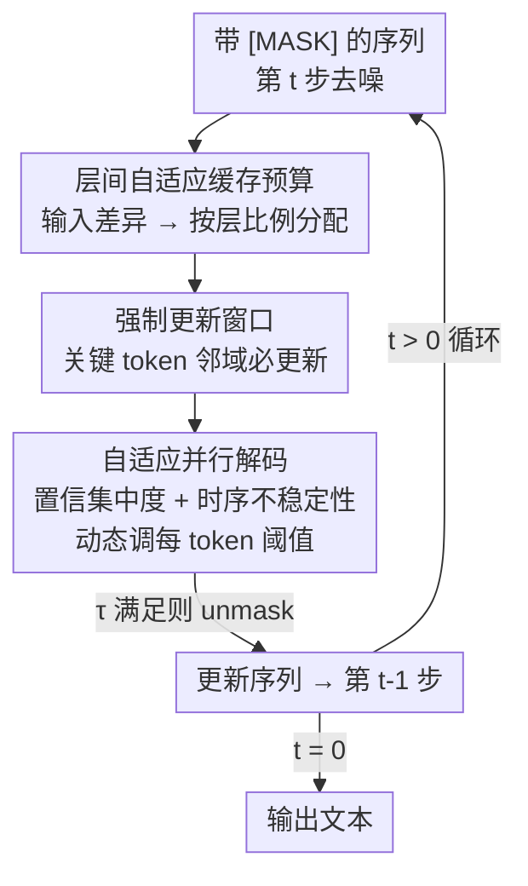

# Dynamic-dLLM: Dynamic Cache-Budget and Adaptive Parallel Decoding for Training-Free Acceleration of Diffusion LLM

**会议**: ICLR2026  
**OpenReview**: [https://openreview.net/forum?id=SdnkB5pGbq](https://openreview.net/forum?id=SdnkB5pGbq)  
**代码**: https://github.com/TianyiWu233/DYNAMIC-DLLM  
**领域**: LLM效率 / 扩散语言模型 / 推理加速  
**关键词**: 扩散LLM、免训练加速、动态缓存、并行解码、自适应阈值

## 一句话总结
Dynamic-dLLM 是一个免训练的扩散 LLM 推理加速框架，针对 token 在不同层、不同解码步上的"动态性"差异，用动态缓存更新（DCU）按层自适应分配缓存更新预算、用自适应并行解码（APD）按 token 动态校准解码阈值，在 LLaDA/Dream 等模型上平均提速 3× 以上、最高 4.48×，几乎不掉精度。

## 研究背景与动机

**领域现状**：扩散大语言模型（dLLM，如 LLaDA、Dream）用双向注意力做迭代去噪生成文本，相比自回归模型（AR）在"反转诅咒"等复杂场景上更有优势，被视为一个有希望的替代范式。

**现有痛点**：dLLM 的计算复杂度随序列长度 $L$ 以 $O(L^3)$ 增长，远高于 AR 的 $O(L^2)$。根因在于它的非自回归本质——每一步去噪都要对整条序列里所有 token 并行重算，这既带来三次方开销，又让 dLLM 天然无法复用 AR 那套 KV-Cache 机制（每步所有 token 都在变，缓存没法直接挪用）。

**核心矛盾**：现有加速方法（dLLM-Cache、dKV-Cache、Fast-dLLM 等）要么缓存中间 token 表示跨步复用、要么在单步内并行 unmask 多个高置信 token，但它们都用**静态**策略——对所有层、所有解码步套用同一套缓存或 unmask 规则。可论文观察到 token 的属性其实是动态的：① 需要更新缓存的 token 比例随层深从浅到深单调上升（深层变化大、浅层稳定）；② 每个 token 的置信分布在不同解码步上来回波动，早期最高置信的预测后面常被"亚军"替换掉。静态规则与这种内在动态性错配，要么浪费算力、要么早早 commit 错 token 引发误差传播。

**本文目标**：设计一个能动态对齐模型"层间 + 步间 token 动态性"的免训练加速框架，分解为两个子问题——缓存更新预算怎么按层动态分、并行解码阈值怎么按 token 动态调。

**切入角度**：作者从两组关键观察出发——缓存更新需求按层显著不同（Figure 2a-d）、固定阈值会丢掉真正该被选中的"亚军"候选（Figure 2e），从而认定"按层/按步自适应"才是正解。

**核心 idea**：用动态缓存更新（DCU）替代静态缓存、用自适应并行解码（APD）替代固定阈值，让算力预算流向"真正在变"的层和 token，免训练即插即用。

## 方法详解

### 整体框架

Dynamic-dLLM 把加速拆到两个正交维度上同时优化：**缓存更新管理**（层维度）和**并行解码调度**（步维度）。输入是带 `[MASK]` 占位的序列，输出是经 $T$ 步迭代去噪后的完整文本；中间每一步去噪时，DCU 先决定"这一步每层重算哪些 token 的缓存"，APD 再决定"这一步哪些 token 的预测可以提前定下来（unmask）"。两个组件互不依赖、可叠加：DCU 负责省掉冗余的前向计算，APD 负责减少总的去噪步数。

DCU（上半部分）的逻辑是：先用一个**输入级差异度**代理估计每个 token 在每层的变化量，再据此按层比例分配缓存更新预算，最后用一个**强制更新窗口**保证关键 token 不会因为长期不更新而"陷在泥里"。APD（下半部分）的逻辑是：给每个 token 一个会随步演化的阈值，根据它预测分布的**置信集中度**和**时序不稳定性**动态升降这个阈值，让稳的 token 早 commit、不稳的 token 等一等。

### 关键设计

**1. 动态缓存更新 DCU：用输入差异当代理，按层比例分配缓存预算**

现有缓存方法对所有层更新固定/均匀数量的 token 缓存，可论文实测发现需要更新的 token 比例随层深单调上升——浅层特征稳定、深层变化剧烈，一刀切显然次优。一个直接做法是像 dLLM-Cache 那样显式重算并比较 Value 向量的余弦相似度来判断哪些 token 变了，但这本身就要重算 Value、开销不小。论文受 DiT 里"输入-输出强相关"启发，验证了 dLLM 中层输入与各类中间特征（Key/Value/Attention 输出/FFN 输出）的 Spearman 相关都很高（0.94~0.99），于是用**层输入的变化**当中间激活动态性的廉价代理，不必触碰缓存特征本身。

具体地，token $x_i$ 在第 $l$ 层、相邻步 $t$ 与 $t{+}1$ 间的差异度用归一化输入的余弦距离衡量：

$$d_i^{t,l} = 1 - \frac{(x_i^{t,l})^\top x_i^{t+1,l}}{\|x_i^{t,l}\|\,\|x_i^{t+1,l}\|}$$

把 token 级差异聚合成层级动态度 $s^{t,l}=\frac{1}{N}\sum_i d_i^{t,l}$，再按上一步的 $s^{t+1,l}$ 在各层间**比例分配**总预算 $B_{\text{layer}}\times \text{LayerNum}$：

$$B_{\text{layer}}^{t,l} = (B_{\text{layer}}\times \text{LayerNum})\cdot \frac{s^{t+1,l}}{\sum_{k} s^{t+1,k}}$$

每层挑差异 $d_i^{t,l}$ 最大的 top-$B_{\text{layer}}^{t,l}$ 个 token 重算缓存，其余复用旧值。这样算力被精准导向"真正在变"的深层，浅层省下来。

**2. 强制更新窗口：救出"陷在泥里"的关键 token**

按层比例分配有个隐患：如果 token $x_i$ 在第 $l$ 层没被选中更新，它的缓存表示不变，进而它喂给第 $l{+}1$ 层的输入也不变，导致 $d_i^{t,l+1}=0$；而分配策略恰恰优先选差异大的 token，于是 $x_i$ 在后续层也极可能继续被跳过，陷入"越不更新→差异越小→越不被选"的死循环。论文把这种 token 连续多层得不到更新的现象叫 **token stuck in the mud（陷在泥里）**。

解法来自一个空间局部性观察（Figure 5）：上一步被 unmask 的 token（key token，位置记 $p$）周围的 token 在当前步更可能被解码、受影响也最大。于是论文在 key token 邻域设一个固定大小 $B_{\text{window}}$ 的窗口 $\left[p-\frac{B_{\text{window}}}{2},\, p+\frac{B_{\text{window}}}{2}\right]$，**无视预算分配**强制更新窗口内所有 token 的缓存：

$$U^{t,l} \leftarrow U^{t,l}\cup\left\{x_i \;\middle|\; p-\tfrac{B_{\text{window}}}{2}\le i\le p+\tfrac{B_{\text{window}}}{2}\right\}$$

这保证了"下一个最可能被 unmask 的关键 token"不会被漏掉，剩余的全局预算再在窗口外按层动态度分配。

**3. 自适应并行解码 APD：按置信集中度 + 时序不稳定性动态调每个 token 的阈值**

固定阈值的并行解码（如 Fast-dLLM）只要 token 置信超过某个静态阈值就 unmask，但 token 的峰值置信在步间会剧烈变化：早期最高置信的预测未必是想要的输出，后面常被"亚军"替换；反过来，某些 top 预测明显碾压其他候选（低熵/大 margin）的 token 即使绝对置信没到阈值也可以安全提前定下来。所以应该用**每 token 动态阈值**。

每个 token 起始阈值 $\tau_i^T$，第 $t$ 步的阈值从上一步 $\tau_i^{t+1}$ 演化而来。第一个信号是**置信集中度**——用第二高概率衡量分布是否尖锐（$u=\arg\max_v (z_i^t)_v$ 为最可能 token）：

$$c_i^t = 1 - \max_{v\in V\setminus\{u\}} (z_i^t)_v$$

$c_i^t$ 越大说明分布越集中越自信，就该**调低**阈值允许早解码；反之分布弥散就调高阈值防止误判。第二个信号是**时序不稳定性**——用相邻步置信分布的余弦距离衡量历史波动：

$$H_i^t = 1 - \frac{(z_i^t)^\top z_i^{t+1}}{\|z_i^t\|\,\|z_i^{t+1}\|}$$

$H_i^t$ 越大说明预测还在大幅修订、未来很可能被改，该调高阈值等一等。两个信号合起来更新阈值：

$$\tau_i^t = \tau_i^{t+1} - \alpha\cdot c_i^t + \beta\cdot H_i^t$$

其中 $\alpha,\beta\ge 0$ 平衡置信集中度与时序不稳定性的影响。这样稳定且自信的 token 提早 commit、不稳的 token 推迟，在"低阈值掉质量"和"高阈值低效率"之间取得更好的折中，从而在不掉精度的前提下减少总解码步数。

### 损失函数 / 训练策略
本方法**完全免训练**，没有任何训练目标或微调——DCU 与 APD 都是推理期即插即用的调度策略。关键超参默认 $B_{\text{layer}}=32$、$B_{\text{window}}=32$，APD 阈值初始化在 0.9 附近，$\alpha,\beta$ 控制阈值自适应灵敏度。

## 实验关键数据

### 主实验
在三个典型 dLLM（LLaDA-8B-Instruct、LLaDA-1.5、Dream-v0-7B-Instruct）上，覆盖 MMLU/ARC-C/GSM8k/GPQA/HumanEval，对比 dLLM-Cache、dKV-Cache、Fast-dLLM。指标为精度（accuracy）与吞吐（TPS, tokens-per-second）。带 * 表示叠加并行解码。

| 模型 / 配置 | 平均精度 | 平均加速 | GSM8k 峰值加速 |
|------------|---------|---------|---------------|
| LLaDA-8B-Instruct（baseline） | 59.67 | 1.0× | — |
| + Fast-dLLM | 59.62 | 2.27× | 2.73× |
| + Dynamic-dLLM（仅特征缓存） | 59.51 | 2.63× | 3.27× |
| + Fast-dLLM*（并行解码） | 59.22 | 2.85× | 3.77× |
| + Dynamic-dLLM*（并行解码） | 59.33 | **3.21×** | **4.48×**（37.29 vs 8.32 TPS） |

跨模型一致：LLaDA-1.5 在 GSM8k 上 4.46× 加速（37.02 vs 8.30 TPS），精度 60.67% vs 基线 61.08%，几乎无损；Dream-v0-7B-Instruct 在 GSM8k 上 3.91× 加速（31.48 vs 8.05 TPS）。在所有对比方法里 Dynamic-dLLM 同时拿到最高吞吐和最稳精度。

### 消融实验

| 配置 | 关键发现 | 说明 |
|------|---------|------|
| $B_{\text{layer}}$ 扫描 | 精度随其增大上升、约 32 处饱和；吞吐随其增大快速下降 | 32 是精度/吞吐折中点 |
| $B_{\text{window}}$ 扫描 | 趋势同 $B_{\text{layer}}$，但 window 过小时精度跌得更狠 | 取 32 保证精度对齐基线 |
| 动态阈值 vs 固定阈值 | 同初始化下精度相同；高初始化下动态阈值步数更少 | 初始化 0.9 时动态阈值比固定阈值减少约 30% 推理步 |

### 关键发现
- DCU 的核心增益来自"按层分配 + 输入差异代理"：把缓存预算导向变化剧烈的深层，浅层省算力，且代理避免了重算 Value 的开销。
- 强制更新窗口是必要的稳定器——没有它，关键 token 会"陷在泥里"连续多层不更新，拖累精度。
- APD 的价值主要体现在"减步数而不掉精度"：在 0.9 这个不显著降性能的高初始化下，动态阈值比固定阈值少约 30% 步。
- 叠加并行解码（*）后加速进一步放大，但绝对精度略有抖动（如 Dream* 在 GPQA/HE 上小掉），说明并行解码在难任务上更激进。

## 亮点与洞察
- **用层输入当中间特征动态性的代理**：先验证 Key/Value/Attn/FFN 输出与层输入高度相关（0.94~0.99），再只看输入差异就决定缓存更新，省掉了重算缓存特征的开销——这是个可迁移到其他缓存复用场景的廉价信号。
- **"陷在泥里"的诊断很漂亮**：作者把"自适应分配 + 缓存复用"的耦合副作用（不更新→零差异→更不被更新）讲成一个闭环故障，再用空间局部性观察对症下药，机制干净。
- **阈值的双信号设计**：置信集中度（看亚军概率）管"该不该早 commit"，时序不稳定性（看相邻步分布余弦距离）管"会不会被改"，两个正交信号合成一个标量阈值更新式，思路清晰且免训练。
- **两个组件正交可叠加**：DCU 省前向计算、APD 省步数，分属层维与步维，能直接组合，工程上即插即用。

## 局限与展望
- 作者承认：当前只在单模态文本生成 benchmark 上验证，多模态理解和复杂推理场景几乎未探索，核心机制如何泛化到跨模态对齐/表示融合尚不清楚。
- 自己发现的局限：① $B_{\text{layer}}/B_{\text{window}}$ 都固定取 32，缺少更大序列/更长生成下的预算自适应分析，超参可能需要随任务调；② 叠加并行解码后在 GPQA、HumanEval 等难任务上精度有可见抖动，"几乎无损"主要成立于均值层面；③ 强制更新窗口为固定大小，未随 key token 局部性强度自适应。
- 改进思路：把窗口大小也做成随注意力局部性自适应；为 APD 的 $\alpha,\beta$ 引入按任务/按步的自动校准；在多模态 dLLM 上重新推导差异度代理是否仍成立。

## 相关工作与启发
- **vs dLLM-Cache / dKV-Cache（静态缓存）**：它们对所有层用固定/均匀缓存更新数，且 dLLM-Cache 需重算 Value 比较相似度；本文按层动态分配预算、用输入差异代理免去重算，把算力导向真正在变的深层。
- **vs Fast-dLLM（固定阈值并行解码）**：它用静态置信阈值 unmask，易过早 commit 错 token；本文用每 token 动态阈值（置信集中度 + 时序不稳定性），稳的早定、不稳的延后，同精度下少约 30% 步。
- **启发**：在迭代式生成里，"哪些计算可以省"往往不是全局静态的而是随层/随步漂移的；先找一个廉价代理量化这种漂移、再把预算/阈值按代理动态分配，是一条通用的免训练加速路线。

## 评分
- 新颖性: ⭐⭐⭐⭐ 把"层间动态 + 步间动态"明确建模并各给一套自适应机制，输入差异代理与"陷在泥里"诊断都有新意。
- 实验充分度: ⭐⭐⭐⭐ 三模型五 benchmark、对比三类 SOTA、含关键超参与阈值消融，覆盖较全；缺更长序列与多模态验证。
- 写作质量: ⭐⭐⭐⭐ 动机-观察-方法链条清楚，公式与图示对应；个别表述（如 $B_{\text{layer}}$/$B_{\text{window}}$ 消融文字）有小笔误。
- 价值: ⭐⭐⭐⭐ 免训练即插即用、平均 3×+ 加速且近乎无损，对 dLLM 实际部署有直接价值。

<!-- RELATED:START -->

## 相关论文

- [\[ICLR 2026\] Hierarchy Decoding: A Training-free Parallel Decoding Strategy for Diffusion Large Language Models](hierarchy_decoding_a_training-free_parallel_decoding_strategy_for_diffusion_larg.md)
- [\[ICLR 2026\] Fast-dLLM v2: Efficient Block-Diffusion LLM](fast-dllm_v2_efficient_block-diffusion_llm.md)
- [\[ICML 2026\] dLLM-Cache: Accelerating Diffusion Large Language Models with Adaptive Caching](../../ICML2026/llm_efficiency/dllm-cache_accelerating_diffusion_large_language_models_with_adaptive_caching.md)
- [\[ICLR 2026\] Dynamic Speculative Agent Planning](dynamic_speculative_agent_planning.md)
- [\[ICLR 2026\] Learning to Parallel: Accelerating Diffusion Large Language Models via Learnable Parallel Decoding](learning_to_parallel_accelerating_diffusion_large_language_models_via_learnable_.md)

<!-- RELATED:END -->
