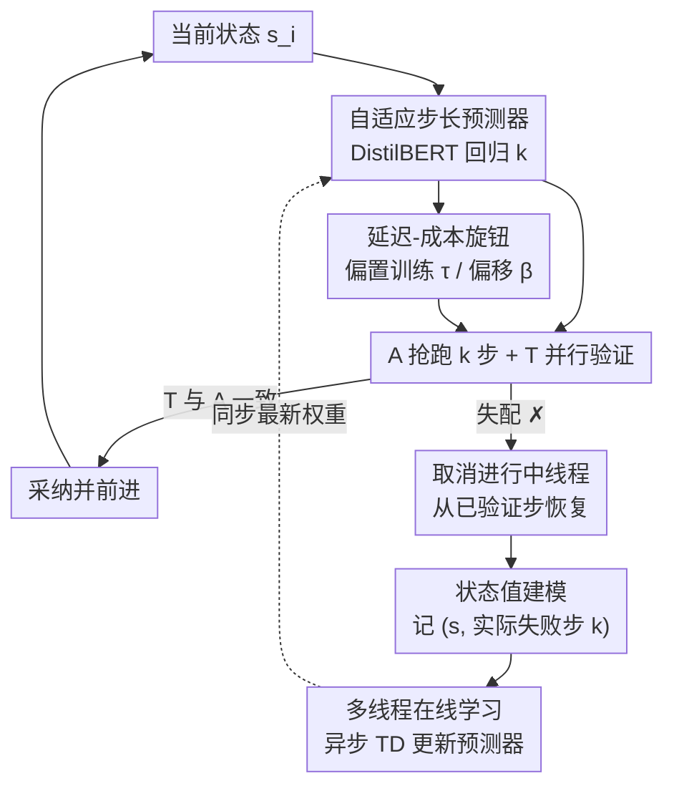

# Dynamic Speculative Agent Planning

**会议**: ICLR2026  
**OpenReview**: [https://openreview.net/forum?id=YZ5k2dVj6O](https://openreview.net/forum?id=YZ5k2dVj6O)  
**代码**: https://github.com/guanyilin428/Dynamic-Speculative-Planning  
**领域**: LLM效率 / Agent / 推测执行  
**关键词**: 推测式规划, LLM 智能体加速, 在线强化学习, 延迟-成本权衡, TD 学习

## 一句话总结
针对 LLM 智能体"边规划边推测执行"时固定推测步长 $k$ 要么省不了时间、要么烧掉大量冗余 token 的问题，本文提出 DSP：用一个轻量 DistilBERT 回归器在线（无需任何部署前准备）预测每一步该推测多远，并把预测建模成强化学习里的状态值函数用 TD 学习更新，在保持"无损加速"的同时把总成本降 30%、无效成本降最高 60%，还暴露一个旋钮让用户自由滑动延迟与成本的取舍。

## 研究背景与动机
**领域现状**：LLM 智能体已经从 demo 走进真实部署（自动软件工程、开放世界工具调用、日常助手），但实践者普遍抱怨端到端延迟太高——多步规划本质是自回归的，每一步都要等上一步的 LLM 调用返回。为了提速，社区尝试了上下文压缩、步骤并行、快慢双系统思考等路线。其中 Interactive Speculative Planning（ISP）把"推测执行"从 CPU/解码搬到了智能体规划：一个便宜的近似智能体 A 抢先生成后续动作，强大的目标智能体 T 并行地基于 A 的前缀去验证；只要 T 认同 A 的提议就直接采纳，从而把串行流水线变成非自回归并行，且因为最终轨迹始终服从 T 的策略而保证"无损"。

**现有痛点**：现有加速方法各有硬伤——(1) 除 ISP 外多数不保证无损（System 1.x 要训路由器、EcoAct 要精心调 prompt、并行化方法要模型学会生成可并行步骤，性能都依赖额外组件的质量）；(2) 普遍需要部署前准备（离线训练专门模块），增加实现复杂度；(3) 几乎都不给用户控制延迟-成本取舍的旋钮，而 LLM 生态里定价、推理速度、模型能力变化极快，不同组织的优先级又千差万别。

**核心矛盾**：ISP 虽然无损又零训练，但它用的是**固定推测步长** $k$。论文用 312 个 OpenAGI 任务做了实测：哪怕在同一个任务内部，"最优 $k$"（从当前状态到第一次失配的步数）波动也很大——平均最大 3.53、最小 1.60、方差 1.46、极差 1.93。这意味着不存在一个全局最优 $k$：$k$ 太小（图 2a）并行度不够、省不了多少时间；$k$ 太大（图 2b）一旦在第 $k$ 步之前就失配，后面所有抢跑的步骤全部作废，token 白烧。论文进一步把浪费拆成四块——A 的 prompt/生成 token、T 的 prompt/生成 token，发现 A 的浪费主要来自 prompt（环境描述、任务细节、历史动作很长），而 T 还多出"已完成但失效的步骤"和"被强行取消的进行中步骤"两类浪费，且都随 $k$ 线性放大。

**本文目标**：在不牺牲无损性、不做任何部署前准备的前提下，让推测步长 $k$ **随上下文动态自适应**，同时给用户一个可调旋钮控制延迟与成本的平衡。

**切入角度**：既然失配点本质上由"当前部分轨迹"决定，那么"A 还能正确生成多少步"是可以从状态预测出来的。与其离线训一个昂贵模型，不如在系统运行时**在线学**这个预测——每次失配自然产生一条 $(\text{部分轨迹}, k)$ 训练样本，而且推测执行的特性保证了预测 $k$ 不会改变生成轨迹的分布，于是这是一个稳定的值估计问题而非策略优化问题。

**核心 idea**：把"该推测几步"建模成强化学习里的**状态值预测**，用 TD 学习在线、异步地训练一个轻量预测器，并通过偏置训练 / 偏移推理两种手段把延迟-成本取舍交到用户手里。

## 方法详解

### 整体框架
DSP 在 ISP 的"A 抢跑、T 验证"双智能体骨架上，插入一个**自适应步长预测器**：每个 episode 开始时，预测器看当前状态 $s_i$ 吐出一个推测步长 $k$，A 和 T 据此并行执行；一旦出现失配（T 的动作与 A 不一致），取消所有进行中的线程、从最后一个被验证的步骤恢复，并把这次"实际能正确走多少步"作为一条训练样本记下来。一个**独立的异步训练线程**不断用新样本把预测器微调到收敛、再把权重同步给在线推理用的预测器，整个学习过程从不阻塞智能体规划。最后，用户通过一个参数（训练期的 expectile $\tau$ 或推理期的偏移 $\beta$）就能把系统推向"更快更贵"或"更慢更省"的任意一点。

### 关键设计

**1. 自适应步长预测器：让 $k$ 跟着上下文走，而不是拍一个固定值**

这是 DSP 对 ISP 最直接的修正。固定 $k$ 的根本问题是"最优推测步数高度依赖上下文且事先未知"，于是 DSP 训一个轻量的 DistilBERT 回归器，从当前（部分）轨迹的 token 序列直接预测该推测多远。选 DistilBERT 是因为它既有足够表达力理解轨迹语义，单次前向的代价又远小于一次 LLM 调用——预测器的开销相对智能体推理可忽略。预测器在 episode 开始时**异步**触发，与 A 当前这一步的规划并行跑，通常在 A 这步结束前就算完，从而把预测延迟藏进 A 的计算里、不拖慢系统吞吐。直观上，它学会了"在简单片段大胆抢跑、在复杂片段保守一点"，从源头上既拿到加速又不浪费。

**2. 把步长预测形式化成状态值函数，用 TD 学习在线更新：稳定且不需要任何离线数据集**

DSP 把推测步长选择写成一个 MDP $\mathcal{M}=(S,A,P,p_0,R,\gamma)$：状态 $S$ 是 token 序列、动作 $A$ 是推测步、状态转移就是把动作 token 拼到状态后面 $s_{t+1}=s_t\,|\,a_t$，并取 $\gamma=1$。奖励设计是精髓——只要 A 的这一步和 T 一致就给 $R(s_t,a_t)=1$，一旦失配就给 0 并立即结束 episode。在这种奖励下，从状态 $s$ 出发的回报 $G_t=\sum_{i=t}^{T-1}\gamma^{i-t}R(s_i,a_i)$ 恰好等于"还能正确推测多少步"，于是状态值 $V_\pi(s)=\mathbb{E}_\pi[G_t\mid s_t=s]$ 正是我们想预测的期望步长。用神经网络 $V_\theta$ 逼近 $V_\pi$，损失为

$$L_\theta=\mathbb{E}_{\tau\sim\pi}\big[(G^\lambda_t-V_\theta(s_t))^2\big],$$

其中 $G^\lambda_t$ 是 $\lambda$-return，在蒙特卡洛回报（$\lambda=1$）和单步 TD 目标（$\lambda=0$）之间插值以平衡偏差-方差（实现里取 $\lambda=0.95$）。一个漂亮的观察是：当 $\lambda=1$ 且 $\gamma=1$ 时 $G^1_t=G_t=k$，TD 学习退化成普通的在线监督学习——也就是说本文是监督学习的更一般化框架，实验上也优于纯监督训练。之所以能用值预测而非策略优化，是因为 A、T 都固定（A 是策略、T 属于环境），且预测 $k$ 不改变轨迹分布，从而绕开了策略优化的不稳定性。

这里还有一个易被忽视的细节——**预测解耦的数据采集**：训练样本只在 A **真正失败**时记录、而不是在推测预算耗尽时记录。否则若预测器低估（预测 $k_2<k_1$，而 A 本可正确走 $k_1$ 步），按 $k_2$ 收集样本会系统性地把预测器越训越保守；在真实失败点 $k_1$ 记录，能让预测误差只影响成本和效率、不污染训练数据。

**3. 多线程异步在线学习：训练永不阻塞推理**

为了让"边跑边学"不拖慢智能体，DSP 维护**两份模型**——一个持续被更新的训练预测器，一个服务所有运行时请求的推理预测器。每个 episode 结束就独立启一个异步线程去训练，训完立刻把权重同步进内存中的推理预测器。配合上面的异步推理（预测与 A 规划并行），推理和训练都从核心执行流水线里解耦出去。相比离线训练，这套在线多线程机制有两个好处：(1) 实时适配——预测器始终对齐当前用户交互分布；(2) prompt 成本即时下降——新数据一到就开始省钱，不必先苦哈哈攒一个大离线数据集。

**4. 延迟-成本旋钮：偏置训练与偏移推理两种用户可控手段**

成本与延迟的平衡本质上系于预测的 $k$，于是 DSP 给用户两种调法。其一是**偏置 $k$ 预测**：在训练时把 MSE 换成 expectile regression 的非对称平方损失 $L^\tau_2(u)=|\tau-\mathbb{1}(u<0)|\,u^2$，$\tau\in(0,1)$ 决定估计哪个 expectile（$\tau=0.5$ 退化为 MSE）。当 $\tau>0.5$ 时，负向预测误差惩罚更轻，$V_\theta$ 倾向高估 $G^\lambda_t$，于是执行更快但更贵；$\tau<0.5$ 则相反，更省但更慢。其二是**带偏移的 $k$**：完全不重训，直接在无偏预测 $\hat{k}$ 上加一个用户指定偏移 $\beta\in\mathbb{N}$，$k=\max(1,\hat{k}+\beta)$，$\beta>0$ 更激进、$\beta<0$ 更保守，$\max$ 保证步长至少为 1。这两个旋钮让实践者能精确停在从"低成本低速"到"高成本高速"连续谱上的任意一点。

### 损失函数 / 训练策略
预测器为 DistilBERT，用 AdamW 优化，学习率 $1\times10^{-5}$、batch size 16；每次在一个随机采样的回放缓冲（大小 2500）上迭代 3 个 epoch；多步回报用 $\lambda=0.95$ 的 $\lambda$-return 融合。骨干智能体来自 GPT 与 DeepSeek 家族（如 GPT-4.1-mini，prompt/生成 $0.40/\$1.60$ 每百万 token；DeepSeek-chat 作 A、DeepSeek-reasoner 作 T）。

## 实验关键数据

### 主实验
在 OpenAGI（312 个跨视觉-语言多步任务）和 TravelPlanner（180 个任务）两个基准上评测，所有指标都以固定 $k=2$ 为基线归一化：$T(\times)$ 相对延迟、$P(\times)$/$G(\times)$ 相对 prompt/生成 token、$\text{Cost}(\times)$ 相对货币成本、MC 平均峰值并发、K 平均预测步长。下表节选 OpenAGI + GPT 骨干、Direct-ReAct 设置（数值越低越省/越快）：

| 模式 | 延迟 $T(\times)$ | 成本 $\text{Cost}(\times)$ | 平均步长 K | 说明 |
|------|------|------|------|------|
| Fix ($k=2$) | 1.00 | 1.00 | 2.00 | 基线 |
| Fix ($k=4$) | 0.92 | 1.41 | 4.00 | 快一点但成本飙 41% |
| Fix ($k=6$) | 0.90 | 1.92 | 6.00 | 最快固定档，成本近 2 倍 |
| Dyn. ($\tau=0.5$) | 1.01 | **0.88** | 1.78 | 与 $k=2$ 同速却省 12% |
| Dyn. ($\tau=0.99$) | 0.91 | 1.25 | 3.59 | 追平 $k=6$ 速度，成本仅 1.25 |
| Dyn. (offset=2) | 0.90 | 1.25 | 3.47 | 同上，成本比 $k=6$ 降约 35% |

关键结论是**严格 Pareto 占优**：在 setting 1 中 Dyn.($\tau=0.99$)/Dyn.(offset=2) 达到与 Fix($k=6$) 相当的提速，却把成本从 $1.92\times$ 降到 $1.25\times$（降 34.9%）；Dyn.(offset=1) 在与 Fix($k=4$) 同等加速下省 23.4% 成本。论文整体宣称：相比最快的无损加速方法，DSP 保持相当加速的同时总成本降最高 30%、无效成本降最高 60%。

### 消融实验

| 配置 | 关键结论 | 说明 |
|------|---------|------|
| 完整 DSP（RL/TD 公式） | 最优 Pareto | $\lambda=1,\gamma=1$ 时退化为在线监督 |
| w/o RL，纯监督微调 | 弱于 RL（§A.8） | 验证 TD 公式比纯监督更优 |
| 非上下文动态优化（贝叶斯优化） | 不如神经预测器（§A.7） | 证明需要会看轨迹的预测器 |
| 预测解耦数据采集 vs 预算耗尽采集 | 后者系统性偏保守 | 必须在真实失败点记样本 |

### 关键发现
- **同一任务内最优 $k$ 都在波动**（max 3.53 / min 1.60 / 方差 1.46），从根上否定了固定 $k$ 的合理性，这是动态化最有力的动机证据。
- **浪费的主因是 prompt token 而非生成 token**（A 的环境/历史描述很长），所以省成本主要省在避免无效抢跑带来的重复长 prompt。
- **旋钮真的连续可调**：$\tau$ 从 0.5 调到 0.99、offset 从 1 加到 2，延迟与成本平滑地沿 Pareto 前沿滑动，给了部署方实打实的控制力。

## 亮点与洞察
- **把"推测几步"翻译成"状态值"是全文最巧的一步**：奖励设成"对一步 +1、错即终止"，回报天然等于期望可推测步数，于是一个看似启发式的调参问题变成了有理论支撑、可用 TD 稳定学习的值估计问题——而且因为不动轨迹分布，避开了策略优化的不稳定。
- **"在真实失败点记样本"这个细节很容易被忽略却至关重要**：它切断了"预测保守→只看到短样本→更保守"的负反馈，是无偏在线学习能成立的前提，值得迁移到任何"用自身预测结果当训练信号"的在线系统。
- **双预测器 + 全异步**把"边服务边学习"工程化得很干净：训练永不阻塞推理、权重热同步，这套解耦范式可直接搬到其他需要在线适配的推理加速场景。
- **两种旋钮覆盖了不同部署约束**：偏置训练适合能重训、想要原理性偏置的场景；偏移推理适合不能重训、要即时调档的场景——产品化考量做得很到位。

## 局限与展望
- **无损保证完全继承自 ISP 的"以 T 策略为准"机制**，DSP 本身不改变正确性边界；若底层推测范式被换掉，本文的成本论断未必成立。
- **预测器仍需冷启动**：在线学习虽零部署前准备，但系统早期预测不准会有一段 warm-up（论文用 §A.6/§A.12 论证收敛快、能快速稳定到最优区），对短任务或低流量场景，摊销训练收益的时间值得关注。
- **评测局限在两个智能体基准（OpenAGI / TravelPlanner）和 GPT/DeepSeek 两族骨干**，在更长程、工具更复杂或失配模式更不规律的真实智能体上，最优 $k$ 的可预测性是否依旧成立有待检验。
- **成本提升的横向数字依赖具体定价**：prompt/生成 token 单价、并发上限不同，旋钮的最优档位会变，论文的具体百分比应视作特定价目下的快照。

## 相关工作与启发
- **vs ISP（Interactive Speculative Planning）**：ISP 首次把推测执行搬到智能体规划、做到无损零训练，但用固定 $k$；DSP 在其骨架上加动态预测器与用户旋钮，专治固定 $k$ 的"要么慢要么贵"，是直接的承接与改进。
- **vs 推测解码（Speculative Decoding，Leviathan 等）**：解码层面用 draft model 抢跑 token、target model 并行验证；DSP 把同一思想抬到"动作/规划步"粒度，并额外解决了"该抢跑多少"这个动态步长问题。
- **vs System 1.x / EcoAct**：前者靠训练路由器在快慢模型间切换、后者靠裁剪无关工具描述压 prompt，都要额外组件或精调且不保证无损；DSP 的卖点恰是无损 + 零部署前准备 + 用户可控。
- **vs 动态 draft 长度的推测解码方法**（Liu 2025 等）：同样在调"抢跑多远"，但 DSP 把它形式化为 RL 状态值、在线 TD 更新，并给出无偏数据采集与连续可控旋钮，机制更系统。

## 评分
- 新颖性: ⭐⭐⭐⭐⭐ 把推测步长选择形式化为状态值预测 + 在线 TD，并暴露连续延迟-成本旋钮，角度新且自洽。
- 实验充分度: ⭐⭐⭐⭐ 两基准、四配置、GPT/DeepSeek 双骨干 + 多组消融，较扎实；真实长程智能体覆盖偏少。
- 写作质量: ⭐⭐⭐⭐ 动机用实测数据（最优 $k$ 波动、成本四拆）支撑得很有说服力，公式与机制讲清楚。
- 价值: ⭐⭐⭐⭐⭐ 无损、零部署前准备、可控成本，直击 LLM 智能体落地的延迟与成本痛点，实用性强。

<!-- RELATED:START -->

## 相关论文

- [\[ICLR 2026\] Dynamic-dLLM: Dynamic Cache-Budget and Adaptive Parallel Decoding for Training-Free Acceleration of Diffusion LLM](dynamic-dllm_dynamic_cache-budget_and_adaptive_parallel_decoding_for_training-fr.md)
- [\[ACL 2026\] TokenTiming: A Dynamic Alignment Method for Universal Speculative Decoding Model Pairs](../../ACL2026/llm_efficiency/tokentiming_a_dynamic_alignment_method_for_universal_speculative_decoding_model_.md)
- [\[ICLR 2026\] MemAgent: Reshaping Long-Context LLM with Multi-Conv RL-based Memory Agent](memagent_reshaping_long-context_llm_with_multi-conv_rl-based_memory_agent.md)
- [\[ICML 2026\] GraphFlow: A Graph-Based Workflow Management for Efficient LLM-Agent Serving](../../ICML2026/llm_efficiency/graphflow_a_graph-based_workflow_management_for_efficient_llm-agent_serving.md)
- [\[ICML 2026\] Dynamic Linear Attention](../../ICML2026/llm_efficiency/dynamic_linear_attention.md)

<!-- RELATED:END -->
