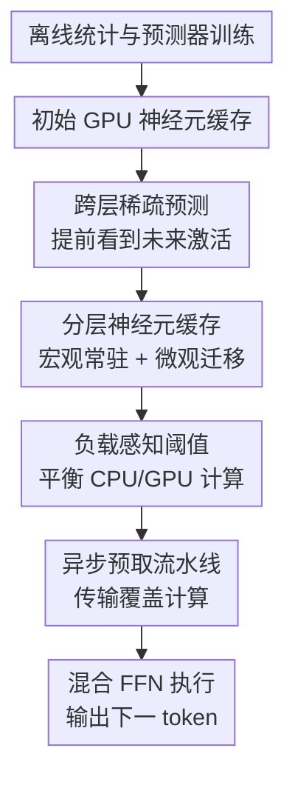

# DynamicInfer: Runtime-Aware Sparse Offloading for LLMs Inference on a Consumer-Grade GPU

**会议**: ICLR 2026  
**OpenReview**: [https://openreview.net/forum?id=CvjmvjlczZ](https://openreview.net/forum?id=CvjmvjlczZ)  
**代码**: 未确认  
**领域**: LLM效率  
**关键词**: 稀疏激活, 模型卸载, LLM推理, 动态调度, 消费级GPU  

## 一句话总结
DynamicInfer 面向显存不足的消费级 GPU，把 LLM FFN 神经元按运行时激活模式在 CPU/GPU 之间动态调度，并用跨层预测、分层神经元缓存和负载感知阈值让更多真正会被用到的神经元落到 GPU 上，最终在保持精度基本不变的前提下比 llama.cpp 和 PowerInfer 明显加速。

## 研究背景与动机

**领域现状**：本地部署大语言模型越来越重要，因为个人设备上的推理能降低云端调用成本，也能减少隐私数据外传。问题是，现代 LLM 的参数量远超消费级 GPU 的显存容量，尤其 FFN 层占了大部分参数，直接把完整模型放进 RTX 4090 或 RTX 2080 Ti 这类设备并不现实。

**现有痛点**：模型卸载把部分权重放在 CPU 内存，需要时再搬到 GPU，或者干脆让 CPU 参与计算；稀疏激活则利用 ReLU/ProSparse 等模型中大量近零 FFN 神经元，跳过预测为不活跃的神经元。PowerInfer 把两者结合起来，先离线统计哪些神经元经常活跃，再把高频热神经元常驻 GPU、低频冷神经元留给 CPU。但这种一次性冷热划分是静态的，遇到新 prompt 和不同 decoding token 时会失配：GPU 上常驻的神经元可能这一步根本不用，而真正活跃的冷神经元却在 CPU 上慢慢算。

**核心矛盾**：LLM 的 FFN 稀疏性既有局部性，又高度依赖输入。论文观察到，在 ReluLLaMA 的某些层里，top 40% 神经元可以覆盖约 80% 激活，说明“热神经元”确实存在；但不同句子的热神经元集合 Jaccard distance 达到 0.53-0.57，相邻 token 的激活集合差异更大，Jaccard distance 达到 0.70-0.75。也就是说，静态配置能抓住总体倾向，却抓不住当前 token 真正需要的计算负载。

**本文目标**：作者要解决的是一个系统问题：在显存有限、PCIe 传输昂贵、CPU/GPU 算力差异巨大的环境下，如何让活跃 FFN 神经元尽量在 GPU 上计算，同时不让动态迁移权重本身变成新的 I/O 瓶颈，也不因为更激进的稀疏跳过损伤模型精度。

**切入角度**：DynamicInfer 的切入点是“运行时调度”而不是“更好的离线分区”。如果可以提前一点预测未来层会激活哪些神经元，就能在当前层计算时把下一层所需的神经元异步搬到 GPU；如果还能根据 CPU/GPU 当前负载调节激活阈值，就能把计算从慢的一侧转移到快的一侧。

**核心 idea**：用跨层稀疏预测把“将来会活跃的神经元”提前暴露出来，再结合历史频率和实时负载做动态神经元缓存与阈值调整，从而把静态 offloading 变成 runtime-aware sparse offloading。

## 方法详解

### 整体框架
DynamicInfer 的整体流程分成离线准备和在线推理两部分。离线阶段训练轻量 MLP 稀疏预测器，并统计每层神经元在公开数据上的激活频率；在线阶段先按显存预算把一部分历史高频神经元预加载到 GPU，随后在每个推理步骤里用当前隐藏状态预测未来层的激活神经元、异步迁移权重、并按 CPU/GPU 负载分别调整稀疏阈值。

从系统视角看，它不是简单地“把更多权重搬上 GPU”，而是在有限显存中持续替换 GPU 神经元缓存：宏观上保留同一输入里反复出现的热神经元，微观上为下一个 token/未来层临时预取马上会用到的神经元。FFN 计算仍然是 CPU/GPU 混合执行：GPU 负责已经在显存中的活跃神经元，CPU 负责留在主存中的活跃神经元，最后把 CPU 结果同步回 GPU 汇总。

论文的关键系统路径可以理解为三个相互咬合的环节。第一，跨层稀疏预测给调度争取时间窗口；第二，分层神经元缓存决定哪些权重应该留在 GPU、哪些应该迁移；第三，负载感知阈值决定 GPU 和 CPU 各自实际激活多少神经元。最后通过异步传输流水线把调度成本藏在前后层计算之中。

### 关键设计

**1. 跨层稀疏预测：把“未来层会用哪些神经元”提前变成调度信号**

PowerInfer 的稀疏预测发生在 FFN 计算附近，如果这时才决定要不要迁移神经元，PCIe 传输很容易直接阻塞当前计算。DynamicInfer 利用一个观察：相邻层甚至隔若干层的 hidden states 变化相对平滑，论文附录中不同模型相邻层隐藏状态平均 cosine similarity 超过 88%。因此，对第 $i+k$ 层的稀疏预测器 $	ext{MLP}_{i+k}$，可以提前使用第 $i$ 层 attention 输出的 hidden state $h_i$ 作为输入，得到未来层的预测向量 $z_{i+k}\in\mathbb{R}^d$。

这个设计的价值不只是“预测激活”，而是把调度从同步路径里挪出来。第 $i$ 层 attention 完成后，系统启动一个调度子线程做稀疏预测和神经元迁移；主线程继续执行第 $i$ 层 FFN。只要预测提前量 $k$ 和当前计算窗口足够，未来层需要的冷神经元就可以在真正执行该 FFN 之前完成 CPU-to-GPU 预取。

**2. 分层神经元缓存：同时利用句子级局部性和 token 级动态性**

论文把神经元调度拆成宏观和微观两层。宏观层面，同一个输入句子内部会反复激活一批高频神经元，系统持续跟踪历史激活频率，把这些高频神经元尽量常驻 GPU，减少来回迁移。微观层面，相邻 token 的具体激活集合变化很大，系统用当前 token 上下文预测下一步会激活的神经元，并临时把这些预测活跃神经元排到 GPU 缓存里。

这种缓存策略被建模成一个带约束的 GPU 放置问题。对第 $l$ 层第 $i$ 个神经元，重要性定义为 $v_{l,i}=a_{l,i}+\lambda f_{l,i}$，其中 $a_{l,i}\in\{0,1\}$ 表示当前预测是否活跃，$f_{l,i}$ 是历史激活频率，$\lambda$ 控制微观预测和宏观频率的权重。目标是最大化被放到 GPU 的神经元重要性总和 $\sum_{l,i}g_{l,i}v_{l,i}$，同时满足显存预算、通信时间窗口和高频神经元常驻约束。由于实时求解整数规划太贵，系统采用逐层贪心：先固定高频常驻神经元，再按重要性排序替换剩余神经元，直到通信约束不允许继续迁移。

**3. 负载感知阈值：不用同一个稀疏阈值硬套 CPU 和 GPU**

传统稀疏激活通常用统一阈值 $\theta$ 判断神经元是否激活，但在 CPU/GPU 异构系统里，统一阈值会造成负载不均。GPU 算力强但显存有限，CPU 可用内存大但计算慢；如果 CPU 侧活跃神经元过多，整层 FFN 延迟会被 CPU 拖住。DynamicInfer 因此给 GPU 和 CPU 使用不同阈值 $\theta_g$ 与 $\theta_c$，并根据负载动态调节。

作者把 FFN 层延迟写成两侧耗时的最大值：$\min_{\theta_g,\theta_c}\max(t_{gpu}N_{gpu}(\theta_g), t_{cpu}N_{cpu}(\theta_c)+t_{sync})$。直觉上，当 CPU 成为瓶颈时，系统可以降低 GPU 阈值，让 GPU 多算一些原本可能被跳过的神经元，同时提高 CPU 阈值，减少 CPU 侧计算。为了不牺牲精度，阈值调整还受误差约束 $Err(\theta_g,\theta_c)\le Err(\theta)$，即动态阈值产生的跳过误差不能超过原始静态阈值。论文用贪心策略从静态阈值出发，逐步降低 $\theta_g$、提高 $\theta_c$，在精度约束内尽量把负载推向 GPU。

**4. 异步预取流水线：让权重迁移隐藏在现有计算窗口里**

动态调度最大的风险是“搬权重比省计算更慢”。DynamicInfer 的流水线设计专门处理这个问题：调度线程在主线程计算当前层时工作，利用 CUDA 异步传输把未来层预测活跃的神经元从 CPU pinned memory 拷到 GPU。真正进入某层 FFN 前，系统设置同步屏障，确保需要的神经元权重和 CPU 侧结果已经准备好，再开始混合 FFN 计算。

实现上，作者还重新组织了 FFN 神经元的内存布局。LLaMA 系列 FFN 通常包含 gate、up、down 三组权重，同一个神经元在三组矩阵中对应的权重会一起被访问和迁移。DynamicInfer 把这些权重按神经元连续存放，并在 GPU 上维护 `gpu_bucket` 这样的索引表，使 `gpu_bucket[i]` 指向原始 FFN 中对应的神经元编号。这样迁移一个神经元时可以把相关权重块一起传输，减少零散拷贝和索引开销。

### 一个完整示例
假设某一层当前 GPU 缓存里有神经元 1、3、6、7，CPU 内存里有 2、4、5、8、9。第 $i$ 层 attention 完成后，跨层预测器判断未来层可能激活 1、2、4、5、8。调度器并不会盲目把所有预测神经元都搬上 GPU，而是结合历史频率和传输窗口做取舍：例如它可能把神经元 4 从 CPU 迁移到 GPU，同时把近期不重要的神经元 7 从 GPU 淘汰。

随后负载感知阈值模块发现，如果照统一阈值执行，CPU 需要算 2、5、8 等多个神经元，会成为瓶颈；于是它降低 GPU 阈值，让 GPU 额外激活 3 和 6，同时提高 CPU 阈值，抑制 CPU 上贡献较小的神经元 8。这样调度前可能是 GPU 只算 1 个神经元、CPU 算 4 个神经元；调度后变成 GPU 算 4 个、CPU 算 2 个，瓶颈从慢 CPU 侧被部分转移到 GPU 侧。

这个例子说明 DynamicInfer 的“动态”不是单一动作，而是缓存替换、阈值调整和异步传输共同作用：预测告诉系统下一步可能需要什么，缓存策略决定哪些东西值得搬，阈值策略决定谁来算，流水线负责尽量不让搬运暴露成额外延迟。

### 损失函数 / 训练策略
离线阶段的稀疏预测器是轻量 MLP，训练数据来自 C4 中随机采样的 2,000 个样本，约生成 700,000 个输出 token。预测器把神经元激活视作二分类问题，使用交叉熵训练：$L=-(y_i\log\sigma(z_i)+(1-y_i)\log(1-\sigma(z_i)))$。在最大似然意义下，$\sigma(z_i)$ 被解释为神经元激活概率 $p_i=P(y=1|x_i)$。

在线初始化时，系统根据离线统计的激活频率和 GPU 显存预算求一个初始神经元缓存。论文实现里沿用了类似 PowerInfer 的 ILP 思路来分配各 FFN 层预算；但实际推理过程中不再每步动态申请显存，而是在预分配预算内做神经元替换。硬件相关参数如调度固定开销 $t_0$、单神经元传输时间 $t_{trans}$、GPU/CPU 单神经元计算时间 $t_{gpu},t_{cpu}$ 和同步开销 $t_{sync}$ 通过初始 decoding 步骤短暂 profiling 得到，后续调度用保守估计避免 I/O 阻塞。

## 实验关键数据

### 主实验
作者在两套消费级/工作站级配置上评估：PC-High 使用 RTX 4090 24GB + Xeon Platinum 8358P + PCIe 4.0，PC-Low 使用 RTX 2080 Ti 12GB + Ryzen 9 5950X + PCIe 3.0。模型包括 ReluLLaMA 与 ProSparse；PC-Low 跑 7B/13B，PC-High 跑 13B/70B，其中 70B 使用 int4 量化，其余模型使用 FP16。主要指标是 decoding 阶段 tokens per second，默认 batch size 为 1，输入来自 Alpaca。

| 硬件 / 模型 | 输入/输出长度 | Transformers | llama.cpp | PowerInfer | DynamicInfer |
|-------------|---------------|--------------|-----------|------------|--------------|
| PC-High / ReluLLaMA-13B | 64 / 128 | 4.0 | 9.7 | 15.5 | 19.1 |
| PC-High / ProSparse-13B | 64 / 128 | 3.0 | 9.3 | 15.6 | 18.3 |
| PC-High / ReluLLaMA-70B | 64 / 128 | 0.28 | 2.23 | 5.14 | 7.88 |
| PC-Low / ReluLLaMA-7B | 64 / 128 | 2.0 | 8.1 | 18.9 | 24.4 |
| PC-Low / ProSparse-7B | 64 / 128 | 2.0 | 8.2 | 21.9 | 26.5 |
| PC-Low / ReluLLaMA-13B | 64 / 128 | 0.39 | 2.90 | 7.49 | 8.47 |

从区间结果看，PC-High 上 13B 模型相对 PowerInfer 提升 18%-26%，相对 llama.cpp 提升 60%-97%；70B 模型相对 PowerInfer 提升 53%-59%，相对 llama.cpp 提升 148%-253%。PC-Low 上 7B 模型相对 PowerInfer 提升 20%-35%，13B 模型提升较小，为 11%-13%，主要因为 2080 Ti 的可用显存更紧，能迁移到 GPU 的 FFN 神经元受限。

| 设置 | 观测指标 | PowerInfer | DynamicInfer | 说明 |
|------|----------|------------|--------------|------|
| PC-High / ReluLLaMA 系列 | GPU 执行的活跃神经元占比 | 平均 51% | 平均 68% | 动态调度让更多真正活跃神经元落到 GPU |
| PC-High / ReluLLaMA 系列 | FFN 延迟中 CPU 贡献 | 平均 72% | 平均 57% | CPU 侧瓶颈被缓解，但仍不是完全消除 |
| ReluLLaMA-13B / PC-High | 64 / 128 TPS | 15.5 | 19.1 | 典型配置下提升约 23.2% |
| ReluLLaMA-70B / PC-High | 64 / 128 TPS | 5.14 | 7.88 | 大模型更受益，因为 CPU FFN 瓶颈更重 |

### 消融实验
论文在 PC-High 上以 PowerInfer 为基线，逐步加入 Micro-level scheduling、Macro-level scheduling 和 Dynamic threshold。虽然图中没有列出所有绝对 TPS 数值，作者给出了相对加速比例。

| 配置 | ReluLLaMA-13B 加速 | ReluLLaMA-70B 加速 | 说明 |
|------|--------------------|--------------------|------|
| PowerInfer | 0% | 0% | 静态冷热神经元划分 |
| + Micro-level scheduling | 11.3% | 27.6% | 当前 token 预测带来最大单项收益 |
| + Macro-level scheduling | 13.6% | 34.0% | 历史高频常驻进一步减少 CPU 计算 |
| + Dynamic threshold | 23.1% | 57.1% | 负载感知阈值把更多计算推向 GPU |

精度方面，作者比较 dense 与 sparse 推理在 RTE、PIQA、COPA、Winogrande 上的结果，整体差异较小。例如 ReluLLaMA-7B 在 RTE 上从 68.23 到 68.59、PIQA 从 77.42 到 77.47、COPA 保持 87.00、Winogrande 从 66.22 到 65.98；ReluLLaMA-70B 在 RTE 上从 74.36 到 73.28、PIQA 从 80.14 到 80.41、COPA 从 93.00 到 92.00、Winogrande 从 75.85 到 75.06。

| 模型 | RTE Dense / Sparse | PIQA Dense / Sparse | COPA Dense / Sparse | Winogrande Dense / Sparse |
|------|--------------------|---------------------|----------------------|---------------------------|
| ReluLLaMA-7B | 68.23 / 68.59 | 77.42 / 77.47 | 87.00 / 87.00 | 66.22 / 65.98 |
| ReluLLaMA-13B | 59.92 / 59.57 | 78.02 / 78.07 | 84.00 / 85.00 | 67.56 / 66.93 |
| ReluLLaMA-70B | 74.36 / 73.28 | 80.14 / 80.41 | 93.00 / 92.00 | 75.85 / 75.06 |
| ProSparse-13B | 74.01 / 73.64 | 76.39 / 74.10 | 90.00 / 89.00 | 70.40 / 70.33 |

### 关键发现
- Micro-level scheduling 是最直接的收益来源，说明 token 级激活动态确实是 PowerInfer 静态分区的核心短板。尤其在 70B 上，该模块单独带来 27.6% 加速，比 13B 上更明显。
- Macro-level scheduling 的收益小于微观预测但很关键，因为它减少了频繁迁移高频神经元的开销，使动态策略不至于退化成每步都大规模搬运权重。
- Dynamic threshold 的作用不是简单“更稀疏”，而是重新分配 CPU/GPU 负载：在保持误差不超过静态阈值的前提下，让 GPU 多承担可接受的额外计算，减少 CPU FFN 尾延迟。
- 显存越充足，DynamicInfer 的收益越大。附录中的 VRAM budget 实验显示，在 12GB 到 24GB 范围内，显存增加会让更多 FFN 神经元可被调度到 GPU，DynamicInfer 相对 PowerInfer 的优势随之扩大。
- 内存开销主要落在 CPU 侧。表 3 显示 GPU 峰值内存与 PowerInfer 接近，例如 ReluLLaMA-70B int4 在 4090 上 PowerInfer / DynamicInfer 分别为 23.6GB / 23.5GB；但 CPU 内存会增加，如 ReluLLaMA-13B 在 2080 Ti 上从 21.3GB 增至 36.6GB，来自预测器和动态迁移缓冲。

## 亮点与洞察
- 把 offloading 的粒度降到 FFN 神经元级，并且从离线静态分区推进到在线动态调度，是这篇论文最有价值的系统洞察。它抓住了 ReLU/ProSparse LLM 的稀疏性，但没有假设“全局热神经元”能适配所有输入。
- 跨层预测是很巧的一步：它利用 hidden state 相邻层相似性，把预测提前到可以隐藏 I/O 的位置。这里的收益不只是预测准确率，而是系统流水线可调度性。
- 负载感知阈值比常见稀疏阈值更贴近硬件现实。对 GPU 和 CPU 用同一阈值看似公平，实际上会把慢 CPU 侧拖成瓶颈；分设备阈值把精度预算转化成负载均衡空间。
- 论文把“稀疏激活”和“权重放置”绑定起来考虑，而不是只做算法层剪枝或只做系统层搬运。这个思路可以迁移到 MoE expert offloading、KV cache 分层存储、甚至多 GPU/CPU/NVMe 混合推理场景。
- 实现细节里连续存放 gate/up/down 权重很务实。很多系统论文的收益来自调度策略，但真正能跑快还取决于内存布局、异步拷贝、同步屏障这些容易被忽略的工程细节。

## 局限与展望
- DynamicInfer 依赖可预测的激活稀疏性，对 ReLU/ProSparse 模型最自然。论文虽然在 Llama-2 SiLU 激活模型上用低幅值剪枝策略展示了泛化性，但非 ReLU 模型的稀疏语义更弱，精度-速度边界可能更难稳定。
- 系统假设运行环境相对独占，硬件参数通过初始 profiling 后作为常量使用。如果本地设备同时跑其他 GPU/CPU 任务，PCIe 带宽、CPU 线程和显存压力都会动态变化，当前调度可能不能及时适配。
- CPU 内存开销并不小。DynamicInfer 为预测器和动态迁移缓冲引入额外 CPU 内存，在小主机或移动设备上可能成为新的部署门槛。
- 实验主要覆盖 batch size 1 的交互式推理，这与个人设备场景一致，但对多请求并发、长上下文、多轮对话中 KV cache 膨胀后的表现还需要更多系统性评估。
- 论文报告的代码状态未确认，若缺少开源实现，复现实验会比较依赖作者的 C++/CUDA 工程细节，尤其是异步预取、连续内存布局和同步屏障策略。
- 未来可以把调度器做成更在线的控制系统：持续测量 $t_{trans}$、$t_{gpu}$、$t_{cpu}$，在系统负载变化时更新阈值和迁移预算，而不是只依赖初始 conservative profiling。

## 相关工作与启发
- **vs llama.cpp**: llama.cpp 通过 CPU/GPU 混合 offloading 支持本地 LLM 推理，但调度粒度更多在层或张量层面，CPU 计算瓶颈仍然明显。DynamicInfer 聚焦 FFN 神经元级稀疏，把活跃子计算尽量转移到 GPU，因此在大模型和显存紧张时速度优势更明显。
- **vs PowerInfer**: PowerInfer 已经把稀疏激活和冷热神经元分区结合起来，是本文最直接的基础。DynamicInfer 的区别在于不相信一次性离线热度足够，而是用运行时预测和历史统计持续更新 GPU 神经元缓存，并通过动态阈值减少 CPU 尾延迟。
- **vs Deja Vu / SparseInfer / CATS**: 这些工作主要关注如何预测或利用激活稀疏性。DynamicInfer 继承了“按上下文预测稀疏”的思想，但把重点放在异构硬件上的神经元放置、迁移和负载均衡。
- **vs FlexGen / DeepSpeed-Inference / LLM in a flash**: 这些系统解决的是更一般的存储层级和大模型卸载问题，常面向吞吐或更大存储介质。DynamicInfer 更贴近个人设备上的低 batch 延迟优化，核心瓶颈不是“能不能放下”，而是“每个 token 哪些神经元应该由谁来算”。
- **启发**: 对本地 LLM 系统来说，静态 profiling 只能提供先验，真正决定速度的是当前请求的动态结构。未来的高效推理框架可能会越来越像运行时系统：预测未来负载、调整缓存、平衡异构设备，并把数据搬运藏进计算流水线。

## 评分
- 新颖性: ⭐⭐⭐⭐☆ 运行时神经元 offloading 与负载感知阈值结合得比较完整，基于 PowerInfer 但明显推进了动态调度。
- 实验充分度: ⭐⭐⭐⭐☆ 覆盖两类硬件、多种模型、速度/精度/内存/显存预算/线程数分析，主要缺口是并发服务和真实桌面负载干扰。
- 写作质量: ⭐⭐⭐⭐☆ 系统动机清楚，观察到设计的链条完整；部分实现细节和图表数值需要读附录才能拼全。
- 价值: ⭐⭐⭐⭐⭐ 对想在消费级 GPU 上跑较大 LLM 的场景很实用，也给稀疏激活系统如何落地到异构硬件提供了可复用范式。

<!-- RELATED:START -->

## 相关论文

- [\[ICLR 2026\] Inference-Cost-Aware Dynamic Tree Construction for Efficient Inference in Large Language Models](inference-cost-aware_dynamic_tree_construction_for_efficient_inference_in_large_.md)
- [\[ICML 2026\] WarmServe：一次加载多模型的 GPU 预热机制](../../ICML2026/llm_efficiency/warmserve_enabling_one-for-many_gpu_prewarming_for_multi-llm_serving.md)
- [\[ICLR 2026\] Guided Speculative Inference for Efficient Test-Time Alignment of LLMs](guided_speculative_inference_for_efficient_test-time_alignment_of_llms.md)
- [\[ICLR 2026\] Scaling Laws Meet Model Architecture: Toward Inference-Efficient LLMs](scaling_laws_meet_model_architecture_toward_inference-efficient_llms.md)
- [\[ICLR 2026\] On-the-Fly Adaptation to Quantization: Configuration-Aware LoRA for Efficient Fine-Tuning of Quantized LLMs](on-the-fly_adaptation_to_quantization_configuration-aware_lora_for_efficient_fin.md)

<!-- RELATED:END -->
