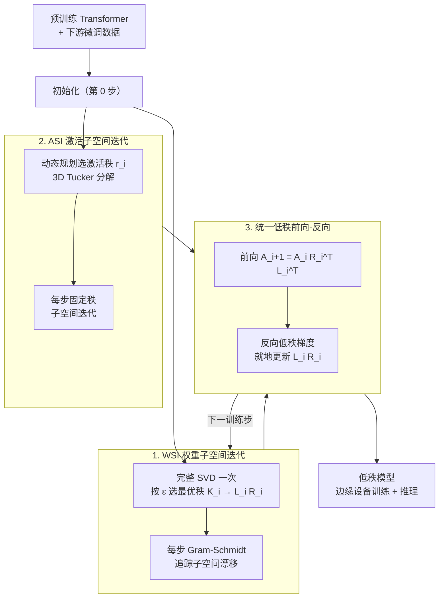

# Efficient Resource-Constrained Training of Transformers via Subspace Optimization

**会议**: ICLR 2026 Oral  
**arXiv**: [2510.09160](https://arxiv.org/abs/2510.09160)  
**代码**: [https://github.com/Le-TrungNguyen/ICLR2026-WASI.git](https://github.com/Le-TrungNguyen/ICLR2026-WASI.git)  
**领域**: AI安全  
**关键词**: subspace optimization, transformer compression, SVD, activation compression, edge deployment

## 一句话总结

提出 WASI（Weight-Activation Subspace Iteration），基于"微调过程中参数子空间稳定"的假设，同时压缩 Transformer 的权重（SVD + Gram-Schmidt 子空间迭代）和激活（Tucker 分解），实现训练和推理都在低秩表示中完成，达到 62× 训练内存压缩和 Raspberry Pi 5 上 1.4× 加速，且精度损失可忽略。

## 研究背景与动机

**领域现状**：边缘设备部署 Transformer 面临严峻的内存和计算挑战。LoRA 等方法虽减少可训练参数，但推理仍在全秩空间进行；前向传播中的激活图（activation maps）是内存瓶颈的主要来源。

**现有方法局限**：
   - **LoRA 及变体**：减少训练参数但推理需合并回全秩，推理开销不变；且训练时需同时存储冻结权重和适配器，内存反增
   - **ASVD / FWSVD**：用截断 SVD 压缩模型，但缺乏截断误差与模型性能的理论联系
   - **SVD-LLM**：解决理论基础，但仅适用于 LLM，不支持 4D 及以上激活张量的视觉 Transformer
   - **AMC**：用 HOSVD 压缩激活，但每次迭代重算 HOSVD 计算开销巨大，秩波动导致内存不稳定
   - **ASI**：固定激活秩用子空间迭代替代 HOSVD，降低计算，但不压缩权重

**核心洞察**：微调时参数的本质子空间保持稳定（小学习率→每步更新微小→SVD 基底变化极小），因此初始 SVD 后可用廉价的子空间迭代追踪基底变化，无需每步重算。

**核心 idea**：同时压缩权重（WSI）和激活（ASI），训练和推理全程在低秩空间执行。

## 方法详解

### 整体框架

WASI 把 Transformer 的训练和推理整体搬进低秩子空间。微调开始前先做一次初始化：每一层的权重 $\mathcal{W}_i$ 被 WSI 用完整 SVD 分解成 $L_i R_i$ 两个瘦矩阵，激活则被 ASI 用 Tucker 分解压成核张量。之后的每个训练步，前向直接在压缩表示里算 $\mathcal{A}_{i+1} = \mathcal{A}_i R_i^T L_i^T$，反向的梯度也在低秩空间计算并就地更新 $L_i R_i \leftarrow L_i R_i + \eta \cdot \widetilde{\nabla_{\mathcal{W}_i}\mathcal{L}}$；同时 WSI 用廉价的 Gram-Schmidt、ASI 用固定秩子空间迭代分别追踪权重/激活子空间的微小漂移，省掉每步重算 SVD/HOSVD。整条链路全程不把张量恢复成全秩，所以训练显存、推理显存能同步降下来。

### 关键设计

**1. WSI（权重子空间迭代）：让权重压缩"只算一次 SVD"**

直接对每层每步都做截断 SVD 太贵，但完整 SVD 又是确定最优低秩基底的唯一可靠方式。WASI 的折中是：只在第 0 步对权重 $\mathcal{W}_i$ 做一次完整 SVD，按方差解释率阈值 $\varepsilon$ 选出能保留足够能量的最优秩 $K_i$，即满足 $\sum_{j=1}^{K_i} \sigma_{i,j}^2 \geq \varepsilon$，得到初始分解 $\mathcal{W}_i \approx L_i R_i$；之后的每一步不再重算 SVD，而是用廉价的 Gram-Schmidt 正交化去追踪子空间的微小漂移。这之所以成立，正是因为微调时学习率小、每步更新幅度极小，奇异向量张成的本质子空间几乎不变，所以一次 SVD 定基底、后续轻量迭代修正就够了——实测下来 WSI 比每步重算 SVD 省 1.36× 计算量，同等 FLOPs 预算下精度反而高出 35%。

**2. ASI（激活子空间迭代）：用 DP 选秩压住激活内存峰值**

前向激活图是边缘训练的真正内存瓶颈，而原始 ASI 既靠暴力搜索确定每层激活秩、又只支持低维张量。WASI 在两处改进：一是把选秩从指数级暴力搜索改写成动态规划，在目标困惑度约束下最小化总内存，搜索复杂度降到线性，从而既压住内存又把固定秩稳定下来（避免逐步重算 HOSVD 带来的秩波动）；二是把 Tucker 分解扩展到支持 Transformer 的 3D 激活张量 $\mathcal{A}_i \in \mathbb{R}^{B \times N_i \times I_i}$，使方法能覆盖 ViT/Swin 这类视觉 Transformer 而不只是序列模型。由于激活的前几个主成分就能捕获 90% 以上方差，这一步的压缩比可以做得很激进（TinyLlama 上激活压缩高达 953×）。

**3. 统一的前向-反向低秩计算：消除解压/压缩往返**

如果前向算在压缩空间、反向却要先解压再压回，往返开销会把低秩的好处吃掉。WASI 让前向和反向都直接在 $(L_i, R_i)$ 表示上闭环：权重梯度由低秩函数 $\widetilde{\nabla_{\mathcal{W}_i}\mathcal{L}} = f_{LR}(\tilde{\mathcal{A}_i}, \widetilde{\nabla_{\mathcal{A}_{i+1}}\mathcal{L}})$ 直接给出，传给上一层的激活梯度为 $\widetilde{\nabla_{\mathcal{A}_i}\mathcal{L}} = \widetilde{\nabla_{\mathcal{A}_{i+1}}\mathcal{L}} \cdot L_i R_i$，损失仍是标准交叉熵。这样整条训练-推理链路始终保持在低秩表示里，推理时也无需把权重恢复成全秩，这正是它与 LoRA（推理需把适配器合并回全秩）本质不同、天然适配边缘部署的地方。

## 实验关键数据

### 主实验：多模型多数据集

| 模型 | 数据集 | 训练内存压缩 | 推理内存压缩 | 训练 FLOPs 减少 | 精度变化 |
|------|--------|------------|-----------|---------------|--------|
| ViT | CIFAR-10 | **62×** | **62×** | **2×** | -0.5% |
| ViT | Pets | **62×** | **62×** | **2×** | 0% |
| SwinT | CUB | ~50× | ~50× | 1.5× | +2%（反超） |
| SwinT | Flowers | ~50× | ~50× | 1.5× | -1% |
| SwinT | CIFAR-100 | ~50× | ~50× | 1.5× | 0% |
| TinyLlama | BoolQ | **953×**(激活) / **30×**(权重) | **30×** | **13×** | 0% |

### 消融实验：WSI vs 全 SVD

| 方法 | ε=0.4 | ε=0.6 | ε=0.8 | ε=0.9 | 计算开销比 |
|------|-------|-------|-------|-------|-----------|
| 全 SVD | 低精度 | 中等 | 高 | 接近满 | 1.0× |
| WSI | 低精度 | 中等 | 高 | 接近满 | **0.74×（省 1.36×）** |
| 同 FLOPs 精度差 | — | — | — | — | WSI 高 **35%** |

### 设备实测：Raspberry Pi 5

| 设置 | 训练时间/步 | 推理时间/步 | 加速比 |
|------|-----------|-----------|-------|
| Vanilla | 基准 | 基准 | 1.0× |
| WASI (ε=0.9) | 更快 | 更快 | **~1.4×** |
| WASI (ε=0.4) | 最快 | 最快 | **>2×** |

### 关键发现

- 层秩 $K_i$ 在 50 epoch 中保持**常数**——验证子空间稳定性假设
- WSI 比重算 SVD 少 1.36× FLOPs，同预算下精度高 35%
- 激活前几个主成分捕获 >90% 方差，高度可压缩
- SwinT 在 CUB 上 WASI 精度**反超** vanilla（低秩约束起正则化作用）
- TinyLlama 上激活压缩高达 **953×**，展示 LLM 的压缩潜力

## 亮点与洞察

- **训练+推理都在压缩空间**——与 LoRA（推理需合并回全秩）本质不同，天然适合边缘部署
- **子空间稳定性假设的实验验证**：图 3(a) 直接可视化了奇异值在微调全程的稳定性，理论与实验完美对齐
- **DP 选秩替代暴力搜索**：将指数级搜索优化为线性，实用性大幅提升
- **压缩可以反超**：CUB 上 WASI 精度超越 vanilla，说明低秩约束具有正则化效果
- **62× 内存压缩**意味着原需 62GB 的模型可在 1GB 设备上训练

## 局限性

- LLM 验证有限：仅在 TinyLlama 最后 5 层上测试，更大规模 LLM 的效果未知
- 需要预先调整 $\varepsilon$ 阈值，不同任务/模型的最优值可能不同
- 极小秩下 Gram-Schmidt 可能出现数值不稳定
- SVD-LLM 中的 LoRA 适配器使其在 FLOPs 上有优势，WASI 的 FLOPs 优势不如内存优势显著
- 未与量化、蒸馏等正交压缩技术结合探索

## 相关工作

- **vs LoRA**：LoRA 仅减少训练参数，推理不压缩；WASI 训练+推理全程压缩，边缘部署优势明显
- **vs SVD-LLM**：SVD-LLM 仅适用 LLM 且低压缩比时内存反增（LoRA 适配器开销）；WASI 通用且无额外开销
- **vs ASI**：ASI 仅压缩激活不压缩权重，推理空间不变；WASI 统一压缩两者
- **vs AMC**：AMC 每步 HOSVD 计算代价巨大；WASI 初始 SVD + 子空间迭代，计算高效

## 评分

- 新颖性: ⭐⭐⭐⭐ 同时压缩权重+激活的统一框架，子空间稳定性假设有理论支撑
- 实验充分度: ⭐⭐⭐⭐ RPi5 部署验证有说服力，ViT/SwinT/TinyLlama 多模型验证
- 写作质量: ⭐⭐⭐⭐ 数学推导完整，对计算复杂度有详细分析
- 价值: ⭐⭐⭐⭐ 边缘部署 Transformer 的实用方案，62× 压缩具有显著工程价值

<!-- RELATED:START -->

## 相关论文

- [\[ICLR 2026\] CONCUR: A Framework for Continual Constrained and Unconstrained Routing](concur_a_framework_for_continual_constrained_and_unconstrained_routing.md)
- [\[AAAI 2026\] Resource Efficient Sleep Staging via Multi-Level Masking and Prompt Learning](../../AAAI2026/llm_efficiency/resource_efficient_sleep_staging_via_multi-level_masking_and_prompt_learning.md)
- [\[ICLR 2026\] MeSH: Memory-as-State-Highways for Recursive Transformers](mesh_memory-as-state-highways_for_recursive_transformers.md)
- [\[ICLR 2026\] RMAAT: Astrocyte-Inspired Memory Compression and Replay for Efficient Long-Context Transformers](rmaat_astrocyte-inspired_memory_compression_and_replay_for_efficient_long-contex.md)
- [\[ICLR 2026\] Deep Hierarchical Learning with Nested Subspace Networks for Large Language Models](deep_hierarchical_learning_with_nested_subspace_networks_for_large_language_mode.md)

<!-- RELATED:END -->
